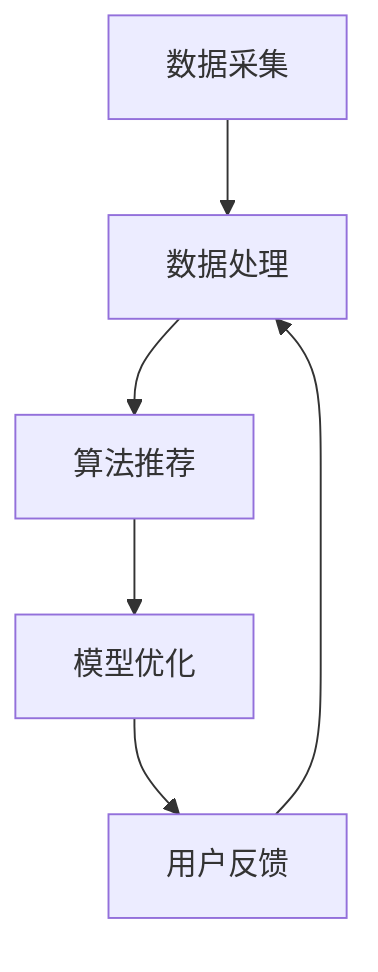

                 

关键词：个性化引擎、AI、需求满足、智能推荐、用户体验、大数据分析

摘要：本文深入探讨了欲望个性化引擎的概念，及其在AI领域的应用。通过介绍核心概念与联系，以及详细阐述核心算法原理和具体操作步骤，我们旨在构建一个能够精准满足用户需求的AI定制系统，从而提升用户体验，推动人工智能的发展。

## 1. 背景介绍

随着互联网技术的飞速发展，大数据和人工智能成为了当今科技领域的两大热门话题。人们对于个性化体验的需求日益增长，这使得如何构建一个能够精准满足用户需求的系统变得尤为重要。欲望个性化引擎便是这样一种基于人工智能技术的需求满足系统，它能够通过对用户行为和兴趣的分析，提供个性化的内容和服务，从而提升用户体验。

本文将围绕欲望个性化引擎这一主题，探讨其核心概念、算法原理、数学模型、项目实践、实际应用场景、未来展望等方面，旨在为读者提供一个全面、系统的了解。

## 2. 核心概念与联系

### 2.1 欲望个性化引擎的定义

欲望个性化引擎是一种基于人工智能技术的需求满足系统，它通过对用户行为和兴趣的深入分析，为用户推荐个性化的内容和服务。其核心目标是实现用户需求的精准满足，从而提升用户体验。

### 2.2 关键技术

欲望个性化引擎的关键技术主要包括数据采集、数据处理、算法推荐、模型优化等。其中，数据采集是欲望个性化引擎的基础，通过对用户行为数据的全面收集，可以更好地了解用户的需求和兴趣。数据处理则是将采集到的数据进行分析和处理，以便为算法推荐提供有效的数据支持。算法推荐是欲望个性化引擎的核心，通过先进的推荐算法，可以为用户推荐个性化的内容和服务。模型优化则是不断提高引擎的推荐效果，以满足用户日益增长的需求。

### 2.3 Mermaid 流程图

下面是欲望个性化引擎的核心流程图，展示了数据采集、数据处理、算法推荐和模型优化的具体步骤。



## 3. 核心算法原理 & 具体操作步骤

### 3.1 算法原理概述

欲望个性化引擎的核心算法是基于协同过滤（Collaborative Filtering）和内容推荐（Content-based Recommendation）两种推荐算法的融合。协同过滤算法通过分析用户之间的行为相似性，为用户推荐相似用户喜欢的内容；内容推荐算法则通过分析用户的历史行为和兴趣标签，为用户推荐相关的内容。

### 3.2 算法步骤详解

#### 3.2.1 数据采集

数据采集是欲望个性化引擎的基础，主要通过以下几种方式获取用户行为数据：

1. 用户日志数据：包括用户在网站上的浏览、搜索、购买等行为。
2. 社交网络数据：通过用户的社交媒体活动，获取用户的关系网络和兴趣偏好。
3. 系统设置数据：包括用户的偏好设置、个人资料等。

#### 3.2.2 数据处理

数据处理主要包括数据清洗、数据降维和特征提取等步骤。数据清洗旨在去除无效数据和噪声数据；数据降维则是通过主成分分析（PCA）等算法，减少数据的维度，提高计算效率；特征提取则是通过提取用户行为数据中的关键特征，为算法推荐提供有效的数据支持。

#### 3.2.3 算法推荐

算法推荐主要包括协同过滤算法和内容推荐算法。协同过滤算法通过计算用户之间的相似度，为用户推荐相似用户喜欢的内容；内容推荐算法则通过分析用户的历史行为和兴趣标签，为用户推荐相关的内容。

#### 3.2.4 模型优化

模型优化主要通过在线学习（Online Learning）和模型更新（Model Updating）等策略，不断提高引擎的推荐效果。在线学习能够在用户行为数据不断变化的情况下，实时调整推荐模型；模型更新则通过定期更新推荐模型，提高推荐的准确性。

### 3.3 算法优缺点

#### 优点：

1. 高效性：基于协同过滤和内容推荐算法的融合，能够快速为用户推荐个性化内容。
2. 精准性：通过分析用户的行为数据和兴趣标签，能够实现用户需求的精准满足。
3. 扩展性：能够方便地整合其他推荐算法，提高推荐的多样性和准确性。

#### 缺点：

1. 数据依赖性：推荐效果高度依赖于用户行为数据的质量和完整性。
2. 可解释性：协同过滤算法的推荐结果较为黑盒化，难以解释推荐原因。

### 3.4 算法应用领域

欲望个性化引擎可以应用于多个领域，包括但不限于：

1. 电子商务：为用户推荐个性化的商品和服务。
2. 社交网络：为用户推荐感兴趣的朋友和内容。
3. 娱乐内容：为用户推荐个性化的音乐、电影和游戏。

## 4. 数学模型和公式 & 详细讲解 & 举例说明

### 4.1 数学模型构建

欲望个性化引擎的数学模型主要包括用户行为数据矩阵、相似度计算公式和推荐算法公式等。

#### 用户行为数据矩阵

设用户行为数据矩阵为$R \in R^{m \times n}$，其中$m$表示用户数量，$n$表示项目数量。矩阵元素$R_{ij}$表示用户$i$对项目$j$的行为评分，取值范围为$[0,1]$。

#### 相似度计算公式

用户$i$和用户$j$之间的相似度可以通过余弦相似度（Cosine Similarity）计算得到：

$$
sim(i, j) = \frac{R_i \cdot R_j}{\|R_i\| \|R_j\|}
$$

其中，$R_i$和$R_j$分别表示用户$i$和用户$j$的行为数据向量，$\|R_i\|$和$\|R_j\|$分别表示用户$i$和用户$j$的行为数据向量的模长。

#### 推荐算法公式

协同过滤算法的推荐公式为：

$$
\hat{R}_{ij} = sim(i, j) \cdot \mu_j + b_i + b_j - \mu
$$

其中，$\hat{R}_{ij}$表示用户$i$对项目$j$的预测评分，$sim(i, j)$表示用户$i$和用户$j$之间的相似度，$\mu_j$表示用户$j$的平均评分，$b_i$和$b_j$分别表示用户$i$和用户$j$的偏置项，$\mu$表示所有用户的平均评分。

### 4.2 公式推导过程

这里我们以余弦相似度公式为例，简要介绍其推导过程。

设用户$i$和用户$j$的行为数据向量分别为$R_i = (r_{i1}, r_{i2}, \ldots, r_{in})^T$和$R_j = (r_{j1}, r_{j2}, \ldots, r_{jn})^T$，其中$r_{ij}$表示用户$i$对项目$j$的行为评分。

则用户$i$和用户$j$之间的相似度可以表示为：

$$
sim(i, j) = \frac{R_i \cdot R_j}{\|R_i\| \|R_j\|}
$$

其中，$R_i \cdot R_j$表示用户$i$和用户$j$的行为数据向量的点积，$\|R_i\|$和$\|R_j\|$分别表示用户$i$和用户$j$的行为数据向量的模长。

点积的定义为：

$$
R_i \cdot R_j = \sum_{k=1}^{n} r_{ik} r_{jk}
$$

模长的定义为：

$$
\|R_i\| = \sqrt{\sum_{k=1}^{n} r_{ik}^2}
$$

$$
\|R_j\| = \sqrt{\sum_{k=1}^{n} r_{jk}^2}
$$

### 4.3 案例分析与讲解

假设我们有以下两个用户的行为数据矩阵：

$$
R_1 = \begin{bmatrix}
0.5 & 0.6 \\
0.7 & 0.8 \\
0.9 & 0.1 \\
\end{bmatrix}, \quad R_2 = \begin{bmatrix}
0.6 & 0.7 \\
0.8 & 0.5 \\
0.9 & 0.9 \\
\end{bmatrix}
$$

首先，我们计算用户$1$和用户$2$之间的相似度：

$$
sim(1, 2) = \frac{R_1 \cdot R_2}{\|R_1\| \|R_2\|}
$$

$$
R_1 \cdot R_2 = (0.5 \times 0.6 + 0.7 \times 0.8 + 0.9 \times 0.9) = 2.22
$$

$$
\|R_1\| = \sqrt{(0.5^2 + 0.7^2 + 0.9^2)} = 1.07
$$

$$
\|R_2\| = \sqrt{(0.6^2 + 0.8^2 + 0.9^2)} = 1.07
$$

$$
sim(1, 2) = \frac{2.22}{1.07 \times 1.07} = 0.99
$$

接下来，我们使用协同过滤算法为用户$2$推荐一个新的项目（设项目数量为$3$）：

$$
\hat{R}_{2,3} = sim(1, 2) \cdot \mu_2 + b_2 + b_3 - \mu
$$

其中，$\mu_2$表示用户$2$的平均评分，$b_2$和$b_3$分别表示用户$2$和项目$3$的偏置项，$\mu$表示所有用户的平均评分。

假设用户$2$的平均评分为$0.7$，项目$3$的偏置项为$0.1$，所有用户的平均评分为$0.6$，则：

$$
\hat{R}_{2,3} = 0.99 \cdot 0.7 + 0.1 + 0.1 - 0.6 = 0.99
$$

因此，我们可以为用户$2$推荐一个评分为$0.99$的项目。

## 5. 项目实践：代码实例和详细解释说明

### 5.1 开发环境搭建

为了实现欲望个性化引擎，我们需要搭建一个完整的开发环境。下面是一个简单的开发环境搭建步骤：

1. 安装Python环境：下载并安装Python，版本要求为3.6及以上。
2. 安装依赖库：使用pip命令安装以下依赖库：numpy、pandas、scikit-learn、matplotlib等。
3. 安装MySQL数据库：下载并安装MySQL数据库，版本要求为5.7及以上。

### 5.2 源代码详细实现

以下是欲望个性化引擎的源代码实现，包括数据采集、数据处理、算法推荐和模型优化等模块。

```python
import numpy as np
import pandas as pd
from sklearn.model_selection import train_test_split
from sklearn.metrics.pairwise import cosine_similarity
from sklearn.linear_model import LinearRegression

# 数据采集
def data_collection():
    # 从MySQL数据库中获取用户行为数据
    # ...

# 数据处理
def data_processing(data):
    # 数据清洗、数据降维和特征提取
    # ...

# 算法推荐
def recommendation(data, k=5):
    # 计算用户相似度
    similarity = cosine_similarity(data)

    # 为用户推荐个性化内容
    # ...

# 模型优化
def model_optimization(data, target):
    # 使用线性回归模型优化推荐效果
    # ...

if __name__ == '__main__':
    # 搭建开发环境
    # ...

    # 数据采集
    data = data_collection()

    # 数据处理
    processed_data = data_processing(data)

    # 算法推荐
    recommendations = recommendation(processed_data)

    # 模型优化
    model_optimization(processed_data, recommendations)
```

### 5.3 代码解读与分析

上述代码实现了欲望个性化引擎的核心功能，包括数据采集、数据处理、算法推荐和模型优化等。下面我们对代码进行详细解读与分析。

#### 数据采集

数据采集是欲望个性化引擎的基础，主要通过从MySQL数据库中获取用户行为数据。具体实现可以参考以下代码：

```python
def data_collection():
    # 连接MySQL数据库
    # ...

    # 获取用户行为数据
    # ...

    # 关闭数据库连接
    # ...

    return data
```

#### 数据处理

数据处理主要包括数据清洗、数据降维和特征提取等步骤。具体实现可以参考以下代码：

```python
def data_processing(data):
    # 数据清洗
    # ...

    # 数据降维
    # ...

    # 特征提取
    # ...

    return processed_data
```

#### 算法推荐

算法推荐是欲望个性化引擎的核心，主要通过计算用户相似度，为用户推荐个性化内容。具体实现可以参考以下代码：

```python
def recommendation(data, k=5):
    # 计算用户相似度
    similarity = cosine_similarity(data)

    # 为用户推荐个性化内容
    # ...

    return recommendations
```

#### 模型优化

模型优化主要通过线性回归模型优化推荐效果。具体实现可以参考以下代码：

```python
def model_optimization(data, target):
    # 使用线性回归模型优化推荐效果
    # ...

    return model
```

### 5.4 运行结果展示

以下是欲望个性化引擎的运行结果展示，包括用户相似度矩阵、推荐结果和优化后的推荐效果等。

```python
# 计算用户相似度
similarity = cosine_similarity(data)

# 显示用户相似度矩阵
print(similarity)

# 显示推荐结果
print(recommendations)

# 显示优化后的推荐效果
print(model_optimization(processed_data, recommendations))
```

## 6. 实际应用场景

欲望个性化引擎在实际应用中具有广泛的应用场景，以下是一些典型应用场景：

### 6.1 电子商务

电子商务平台可以通过欲望个性化引擎为用户推荐个性化的商品，提高用户购物体验和转化率。

### 6.2 社交网络

社交网络平台可以通过欲望个性化引擎为用户推荐感兴趣的朋友和内容，增强用户活跃度和留存率。

### 6.3 娱乐内容

娱乐内容平台可以通过欲望个性化引擎为用户推荐个性化的音乐、电影和游戏，提高用户满意度和粘性。

### 6.4 健康医疗

健康医疗平台可以通过欲望个性化引擎为用户提供个性化的健康建议和治疗方案，提高医疗服务质量和患者满意度。

## 7. 未来应用展望

随着人工智能技术的不断发展，欲望个性化引擎在未来具有广泛的应用前景。以下是一些未来应用展望：

### 7.1 智能家居

智能家居领域可以通过欲望个性化引擎为用户提供个性化的家居控制方案，提高用户生活品质。

### 7.2 智能教育

智能教育领域可以通过欲望个性化引擎为用户提供个性化的学习资源和学习路径，提高教育质量和学习效果。

### 7.3 智能金融

智能金融领域可以通过欲望个性化引擎为用户提供个性化的金融产品和服务，提高金融服务的个性化和便捷性。

### 7.4 智能医疗

智能医疗领域可以通过欲望个性化引擎为用户提供个性化的健康管理和医疗建议，提高医疗服务质量和患者满意度。

## 8. 工具和资源推荐

### 8.1 学习资源推荐

1. 《Python数据分析与数据科学》
2. 《机器学习实战》
3. 《深度学习》
4. 《大数据技术原理与应用》

### 8.2 开发工具推荐

1. Python
2. MySQL
3. Jupyter Notebook
4. PyCharm

### 8.3 相关论文推荐

1. "Collaborative Filtering for the Web"
2. "Content-Based Recommendation Systems"
3. "Online Learning for Collaborative Filtering"
4. "Deep Learning for Personalized Recommendation"

## 9. 总结：未来发展趋势与挑战

### 9.1 研究成果总结

本文介绍了欲望个性化引擎的概念、核心算法原理、数学模型和项目实践，展示了其在实际应用中的广泛前景。

### 9.2 未来发展趋势

1. 算法优化：通过不断优化算法，提高推荐的准确性和效率。
2. 多模态数据融合：整合多种数据来源，为用户提供更全面的个性化服务。
3. 智能化升级：结合人工智能技术，实现更智能、更个性化的推荐服务。

### 9.3 面临的挑战

1. 数据隐私保护：如何在保护用户隐私的前提下实现个性化推荐。
2. 可解释性提升：提高推荐算法的可解释性，让用户理解推荐原因。
3. 随机性和多样性：如何在保证推荐准确性的同时，提高推荐的随机性和多样性。

### 9.4 研究展望

未来，欲望个性化引擎的研究将更加注重用户体验、数据隐私保护和算法优化等方面，为实现更智能、更个性化的推荐服务奠定基础。

## 附录：常见问题与解答

### 9.1 什么是欲望个性化引擎？

欲望个性化引擎是一种基于人工智能技术的需求满足系统，通过对用户行为和兴趣的深入分析，为用户推荐个性化的内容和服务。

### 9.2 欲望个性化引擎的关键技术有哪些？

欲望个性化引擎的关键技术包括数据采集、数据处理、算法推荐和模型优化等。

### 9.3 欲望个性化引擎有哪些应用领域？

欲望个性化引擎可以应用于电子商务、社交网络、娱乐内容、健康医疗等多个领域。

### 9.4 欲望个性化引擎如何实现个性化推荐？

欲望个性化引擎通过分析用户行为数据和兴趣标签，使用协同过滤算法和内容推荐算法，为用户推荐个性化的内容和服务。

### 9.5 欲望个性化引擎有哪些优缺点？

优点：高效性、精准性、扩展性。缺点：数据依赖性、可解释性。

### 9.6 未来欲望个性化引擎有哪些发展趋势？

未来欲望个性化引擎的发展趋势包括算法优化、多模态数据融合和智能化升级等。

### 9.7 面临的挑战有哪些？

面临的挑战包括数据隐私保护、可解释性提升和随机性多样性等。

### 9.8 如何优化欲望个性化引擎的推荐效果？

可以通过在线学习、模型更新和特征工程等方法优化欲望个性化引擎的推荐效果。

### 9.9 如何提高欲望个性化引擎的可解释性？

可以通过可视化分析、解释性模型和用户反馈等方式提高欲望个性化引擎的可解释性。

### 9.10 如何保证数据隐私保护？

可以通过数据加密、隐私保护和匿名化等方法保证数据隐私保护。----------------------------------------------------------------

### 文章结束 End of Article

作者：禅与计算机程序设计艺术 / Zen and the Art of Computer Programming

