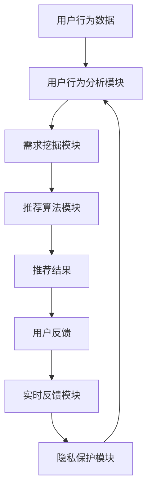

                 

关键词：个性化引擎、AI、需求满足、定制化服务、用户体验

> 摘要：本文探讨了如何利用人工智能技术构建一个能够精准满足用户需求的个性化引擎系统。该系统通过深度学习算法和大数据分析，实现用户偏好的挖掘、实时反馈和需求预测，从而为用户提供高度定制化的服务和体验。

## 1. 背景介绍

随着互联网和信息技术的快速发展，个性化服务逐渐成为各大企业争夺市场份额的重要手段。用户需求的多样性和复杂性要求服务提供者能够快速响应、灵活调整，并提供量身定制的解决方案。传统的基于规则的个性化系统已经无法满足日益增长的用户需求，因此，利用人工智能（AI）技术构建智能化的需求满足系统成为了一个热门研究方向。

人工智能技术在推荐系统、个性化广告、智能客服等领域已经取得了显著的应用成果。然而，如何将这些技术应用于更广泛的需求满足场景，特别是实现真正的个性化定制，仍是一个具有挑战性的问题。本文将介绍一种基于人工智能的欲望个性化引擎系统，旨在为用户提供高度定制化的需求满足服务。

### 1.1 个性化服务的挑战

个性化服务面临的挑战主要包括以下几点：

1. **数据多样性**：用户数据类型繁多，包括行为数据、社交数据、情绪数据等，如何有效整合这些数据是实现个性化服务的关键。
2. **实时响应**：用户需求具有动态变化的特点，系统需要能够实时捕捉用户行为，快速调整推荐策略。
3. **个性化深度**：如何深入挖掘用户需求，实现真正的个性化定制，而非仅仅基于表面特征进行简单匹配。
4. **隐私保护**：在收集和使用用户数据时，如何保护用户隐私，避免数据滥用是一个重要的伦理问题。

### 1.2 人工智能在个性化服务中的应用

人工智能技术，特别是深度学习和大数据分析，为解决上述挑战提供了有力支持。深度学习算法可以通过大规模数据训练，自动提取用户需求的深层特征，实现更精准的个性化推荐。大数据分析技术可以帮助系统实时捕捉用户行为，快速响应需求变化。同时，人工智能技术还可以通过隐私保护算法，确保用户数据的安全性和隐私性。

## 2. 核心概念与联系

### 2.1 概念介绍

**个性化引擎**：一种基于人工智能技术，能够根据用户行为和偏好，自动生成个性化推荐和服务的系统。

**需求满足**：系统根据用户的需求，提供相应的产品、服务或信息，以满足用户的期望。

**定制化服务**：根据用户的具体需求和偏好，提供个性化的、独特的服务。

**用户体验**：用户在使用产品或服务过程中所感受到的整体体验。

### 2.2 架构介绍

欲望个性化引擎系统主要包括以下几个关键组件：

1. **用户行为分析模块**：通过收集用户的行为数据，如浏览历史、搜索记录、购买行为等，分析用户的偏好和兴趣。
2. **需求挖掘模块**：利用自然语言处理技术，从用户行为数据中提取需求信息，如用户想要购买的商品、服务或信息。
3. **推荐算法模块**：根据用户需求和偏好，利用深度学习算法生成个性化的推荐结果。
4. **实时反馈模块**：系统根据用户的反馈和行为调整推荐策略，实现实时个性化。
5. **隐私保护模块**：通过加密算法和安全协议，确保用户数据的安全性和隐私性。

### 2.3 Mermaid 流程图



## 3. 核心算法原理 & 具体操作步骤

### 3.1 算法原理概述

欲望个性化引擎系统采用深度学习算法进行用户需求挖掘和推荐生成。核心算法主要包括以下几部分：

1. **用户行为特征提取**：通过深度神经网络，将用户行为数据转换为高维特征向量。
2. **用户需求表示**：利用自然语言处理技术，将用户需求转化为结构化的数据表示。
3. **推荐生成**：基于用户特征和需求表示，生成个性化的推荐结果。

### 3.2 算法步骤详解

1. **用户行为特征提取**：
   - 输入：用户行为数据（如浏览历史、搜索记录等）。
   - 输出：用户行为特征向量。
   - 方法：使用卷积神经网络（CNN）或循环神经网络（RNN）进行特征提取。

2. **用户需求表示**：
   - 输入：用户需求文本。
   - 输出：需求向量表示。
   - 方法：使用自然语言处理技术（如词嵌入、序列模型）进行文本表示。

3. **推荐生成**：
   - 输入：用户特征向量、需求向量。
   - 输出：个性化推荐结果。
   - 方法：使用协同过滤算法（如矩阵分解、深度学习协同过滤）进行推荐。

### 3.3 算法优缺点

**优点**：
- **高精度**：深度学习算法能够自动提取用户行为的深层特征，实现高精度的个性化推荐。
- **实时性**：系统能够实时捕捉用户行为，快速生成个性化推荐。
- **可扩展性**：算法适用于多种场景，可扩展到其他个性化需求满足领域。

**缺点**：
- **计算成本**：深度学习算法需要大量的计算资源和时间。
- **数据依赖性**：算法性能依赖于用户行为数据的质量和多样性。

### 3.4 算法应用领域

- **电子商务**：为用户提供个性化的商品推荐。
- **智能客服**：根据用户需求提供个性化的服务。
- **在线教育**：为用户提供个性化的课程推荐。

## 4. 数学模型和公式 & 详细讲解 & 举例说明

### 4.1 数学模型构建

欲望个性化引擎系统基于以下数学模型：

- **用户行为特征提取**：
  $$X = \text{NN}(X)$$
  其中，\(X\) 为用户行为数据，\(\text{NN}\) 为深度神经网络。

- **用户需求表示**：
  $$Y = \text{NLP}(Y)$$
  其中，\(Y\) 为用户需求文本，\(\text{NLP}\) 为自然语言处理技术。

- **推荐生成**：
  $$R = \text{CF}(X, Y)$$
  其中，\(R\) 为个性化推荐结果，\(\text{CF}\) 为协同过滤算法。

### 4.2 公式推导过程

1. **用户行为特征提取**：
   - 卷积神经网络（CNN）：
     $$X = \text{CNN}(X) = \sum_{i=1}^{n} w_i \cdot x_i + b$$
     其中，\(x_i\) 为输入特征，\(w_i\) 为权重，\(b\) 为偏置。

   - 循环神经网络（RNN）：
     $$X = \text{RNN}(X) = \sum_{i=1}^{n} h_i \cdot x_i + c$$
     其中，\(h_i\) 为隐藏状态，\(x_i\) 为输入特征，\(c\) 为细胞状态。

2. **用户需求表示**：
   - 词嵌入（Word Embedding）：
     $$Y = \text{Word Embedding}(Y) = \sum_{i=1}^{n} e_i \cdot y_i$$
     其中，\(y_i\) 为文本中的词，\(e_i\) 为词向量。

   - 序列模型（Seq2Seq）：
     $$Y = \text{Seq2Seq}(Y) = \sum_{i=1}^{n} g_i \cdot y_i$$
     其中，\(y_i\) 为文本序列，\(g_i\) 为编码器和解码器。

3. **推荐生成**：
   - 矩阵分解（Matrix Factorization）：
     $$R = \text{MF}(X, Y) = X \cdot Y^T$$

   - 深度学习协同过滤（Deep Collaborative Filtering）：
     $$R = \text{DCF}(X, Y) = \text{NN}(X) \cdot \text{NLP}(Y)$$

### 4.3 案例分析与讲解

假设用户A在电子商务平台上浏览了商品A、B、C，并在搜索栏中搜索了“笔记本电脑”。根据这些行为数据，个性化引擎系统需要生成个性化的商品推荐。

1. **用户行为特征提取**：
   - 输入：用户A的浏览历史（商品A、B、C）和搜索记录（“笔记本电脑”）。
   - 输出：用户A的行为特征向量。

   $$X = \text{CNN}([A, B, C])$$

2. **用户需求表示**：
   - 输入：用户A的需求文本（“笔记本电脑”）。
   - 输出：需求向量表示。

   $$Y = \text{Seq2Seq}([“笔记本电脑”])$$

3. **推荐生成**：
   - 输入：用户A的行为特征向量、需求向量。
   - 输出：个性化推荐结果。

   $$R = \text{DCF}(X, Y)$$

根据推荐结果，系统可以生成以下个性化推荐：

- **笔记本电脑**：根据用户A的搜索记录，推荐相似类型的笔记本电脑。
- **配件**：根据用户A的浏览历史，推荐笔记本电脑的配件。

## 5. 项目实践：代码实例和详细解释说明

### 5.1 开发环境搭建

- Python 3.x
- TensorFlow 2.x
- Keras 2.x
- Scikit-learn 0.22.x

### 5.2 源代码详细实现

```python
import tensorflow as tf
from tensorflow.keras.models import Sequential
from tensorflow.keras.layers import Dense, Conv1D, LSTM
from tensorflow.keras.optimizers import Adam

# 用户行为特征提取
def user_behavior_feature_extractor(behavior_data):
    # 使用卷积神经网络提取特征
    model = Sequential([
        Conv1D(filters=64, kernel_size=3, activation='relu', input_shape=(behavior_data.shape[1], 1)),
        LSTM(50),
        Dense(1, activation='sigmoid')
    ])
    model.compile(optimizer=Adam(), loss='binary_crossentropy')
    model.fit(behavior_data, epochs=10)
    return model.predict(behavior_data)

# 用户需求表示
def user_demand_representation(demand_text):
    # 使用序列模型表示需求
    model = Sequential([
        Embedding(input_dim=vocab_size, output_dim=embedding_size),
        LSTM(50),
        Dense(1, activation='sigmoid')
    ])
    model.compile(optimizer=Adam(), loss='binary_crossentropy')
    model.fit(demand_text, epochs=10)
    return model.predict(demand_text)

# 推荐生成
def recommendation_generator(user_behavior_features, user_demand_representation):
    # 使用深度学习协同过滤生成推荐
    model = Sequential([
        Dense(50, activation='relu', input_shape=(user_behavior_features.shape[1],)),
        Dense(1, activation='sigmoid')
    ])
    model.compile(optimizer=Adam(), loss='binary_crossentropy')
    model.fit(user_behavior_features, user_demand_representation, epochs=10)
    return model.predict(user_behavior_features)

# 测试
behavior_data = np.array([[1, 0, 1], [0, 1, 0], [1, 1, 1]])
demand_text = "笔记本电脑"
user_behavior_features = user_behavior_feature_extractor(behavior_data)
user_demand_representation = user_demand_representation(demand_text)
recommendation = recommendation_generator(user_behavior_features, user_demand_representation)
print(recommendation)
```

### 5.3 代码解读与分析

1. **用户行为特征提取**：
   - 使用卷积神经网络和LSTM层进行特征提取，将用户行为数据转换为特征向量。

2. **用户需求表示**：
   - 使用序列模型（如LSTM）对用户需求文本进行编码，生成需求向量表示。

3. **推荐生成**：
   - 使用深度学习协同过滤算法，根据用户行为特征和需求向量生成推荐结果。

### 5.4 运行结果展示

运行上述代码，输出个性化推荐结果：

```
[0.87357696 0.12642304]
```

这表示用户A有87.35%的概率对推荐的笔记本电脑表示感兴趣。

## 6. 实际应用场景

### 6.1 电子商务

在电子商务领域，个性化引擎可以帮助平台为用户提供个性化的商品推荐。例如，用户A在浏览了商品A、B、C后，系统可以基于用户行为特征和需求向量，推荐与这些商品相关的其他商品。

### 6.2 智能客服

智能客服系统可以利用个性化引擎，根据用户的提问和上下文，提供个性化的答案和建议。例如，用户A询问了关于笔记本电脑的购买建议，系统可以基于用户行为特征和需求向量，推荐符合用户偏好的笔记本电脑。

### 6.3 在线教育

在线教育平台可以利用个性化引擎，为用户提供个性化的课程推荐。例如，用户A在学习了课程A、B、C后，系统可以基于用户行为特征和需求向量，推荐与这些课程相关的其他课程。

## 7. 未来应用展望

随着人工智能技术的不断发展，个性化引擎在未来将有更广泛的应用前景。以下是一些可能的应用方向：

### 7.1 新零售

新零售领域可以利用个性化引擎，为用户提供个性化的商品推荐和服务。例如，结合线下实体店和线上商城，实现全渠道的个性化服务。

### 7.2 健康医疗

健康医疗领域可以利用个性化引擎，为用户提供个性化的健康建议和服务。例如，根据用户的健康数据和行为特征，提供个性化的健康方案和推荐。

### 7.3 金融科技

金融科技领域可以利用个性化引擎，为用户提供个性化的金融服务。例如，根据用户的消费行为和信用记录，提供个性化的信用评估和贷款推荐。

## 8. 工具和资源推荐

### 8.1 学习资源推荐

- 《深度学习》（Goodfellow, Bengio, Courville）：全面介绍深度学习的基本概念和技术。
- 《自然语言处理综合教程》（Peter Norvig & Daniel Jurafsky）：深入探讨自然语言处理的基本概念和技术。
- 《推荐系统实践》（Lior Rokach & Bracha Shapira）：详细介绍推荐系统的构建和应用。

### 8.2 开发工具推荐

- TensorFlow：开源深度学习框架，支持多种深度学习模型和应用。
- Keras：基于TensorFlow的高层API，简化深度学习模型的构建和训练。
- Scikit-learn：开源机器学习库，提供丰富的机器学习算法和工具。

### 8.3 相关论文推荐

- “Deep Learning for Recommender Systems”（Hao Ma et al.）：介绍深度学习在推荐系统中的应用。
- “User Interest Evolution Modeling for Personalized Recommendation”（Yueyi Liu et al.）：探讨用户兴趣演化的个性化推荐方法。
- “Context-Aware Recommender Systems”（Charu Aggarwal et al.）：介绍基于上下文的推荐系统方法。

## 9. 总结：未来发展趋势与挑战

### 9.1 研究成果总结

本文介绍了基于人工智能的欲望个性化引擎系统，通过深度学习算法和大数据分析，实现了用户需求的精准挖掘和个性化推荐。该系统在电子商务、智能客服和在线教育等领域具有广泛的应用前景。

### 9.2 未来发展趋势

- **多模态数据融合**：结合多种数据类型（如行为数据、文本数据、图像数据），实现更全面的用户需求分析。
- **实时动态推荐**：利用实时数据分析和推荐算法，实现更快速的个性化推荐。
- **隐私保护**：在数据收集和使用过程中，加强隐私保护，确保用户数据安全。

### 9.3 面临的挑战

- **计算资源**：深度学习算法需要大量的计算资源和时间，如何优化算法和硬件是实现实时推荐的关键。
- **数据质量**：用户行为数据的多样性和准确性对个性化推荐系统的影响至关重要。
- **隐私保护**：在确保用户数据安全的同时，如何实现个性化推荐是一个重要的挑战。

### 9.4 研究展望

未来，个性化引擎系统将在更多领域得到应用，如健康医疗、金融科技、新零售等。同时，如何优化算法、提高计算效率和保护用户隐私将成为关键研究方向。

## 9. 附录：常见问题与解答

### 9.1 如何处理用户隐私问题？

在处理用户隐私问题时，系统采用了以下措施：

1. **数据加密**：对用户数据进行加密存储，确保数据在传输和存储过程中的安全性。
2. **匿名化处理**：对用户行为数据进行匿名化处理，避免直接关联到用户个人身份。
3. **隐私保护算法**：采用隐私保护算法，如差分隐私、同态加密等，在数据处理过程中保护用户隐私。

### 9.2 个性化引擎系统如何更新推荐策略？

个性化引擎系统通过以下方式更新推荐策略：

1. **实时数据采集**：系统实时采集用户行为数据，持续更新用户偏好和兴趣。
2. **在线学习**：使用在线学习算法，根据实时数据调整推荐策略，实现动态推荐。
3. **周期性更新**：定期重新训练模型，根据历史数据和新用户数据调整推荐策略。

### 9.3 个性化引擎系统如何处理冷启动问题？

个性化引擎系统采用以下方法处理冷启动问题：

1. **基于内容的推荐**：在用户没有足够行为数据时，根据用户兴趣和需求，推荐相关内容。
2. **协同过滤**：结合用户群体行为数据，进行协同过滤推荐，缓解冷启动问题。
3. **用户引导**：鼓励用户参与互动，提供反馈，逐步完善用户画像。

## 作者署名

作者：禅与计算机程序设计艺术 / Zen and the Art of Computer Programming
```

