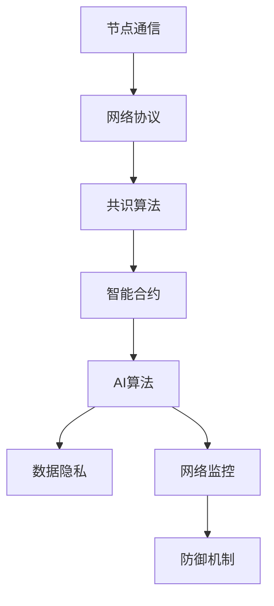

                 

在这个快速变化的数字时代，随着云计算、大数据、人工智能（AI）等技术的飞速发展，我们正在经历一场前所未有的技术革命。这场革命不仅改变了我们的生活方式，也深刻地影响了互联网的基础架构。去中心化网络（Decentralized Network）作为一种新兴的网络架构模式，正逐渐成为这场技术革命的重要推动力。本文旨在探讨如何成为一名欲望去中心化网络架构师，以及AI在这一领域中的关键作用。

> 关键词：去中心化网络，AI，个人自主权，网络架构设计

> 摘要：本文首先介绍了去中心化网络的基本概念和核心优势，然后探讨了人工智能在去中心化网络架构设计中的应用。通过具体实例和算法原理的阐述，本文展示了如何利用AI技术提升去中心化网络的安全性、效率与可扩展性。最后，本文展望了未来去中心化网络的发展趋势和面临的挑战。

## 1. 背景介绍

### 1.1 去中心化网络的兴起

去中心化网络（Decentralized Network），又称为分布式网络，是指网络中的各个节点具有相同的权利和义务，没有中央控制机构的网络架构。这种架构与传统的集中式网络（Centralized Network）形成鲜明对比，后者依赖于中央控制单元进行管理和协调。

去中心化网络的概念并非新鲜事物，早在20世纪80年代，比特币（Bitcoin）的创始人中本聪（Satoshi Nakamoto）就提出了区块链（Blockchain）技术，这是一种去中心化的数据库技术，为去中心化网络奠定了基础。随着比特币的成功，去中心化网络开始受到广泛关注，并在金融、科技、媒体等多个领域得到应用。

### 1.2 人工智能的崛起

人工智能（AI）是计算机科学的一个分支，旨在开发能够模拟、扩展和辅助人类智能的算法和系统。AI的崛起可以追溯到20世纪50年代，但近年来，得益于深度学习、大数据、云计算等技术的发展，AI取得了显著的突破。AI的应用领域包括但不限于自动驾驶、智能家居、医疗诊断、金融分析等。

### 1.3 AI与去中心化网络的结合

随着AI技术的不断发展，它开始与去中心化网络架构紧密结合，为去中心化网络带来了新的机遇和挑战。AI能够帮助去中心化网络提高安全性、效率和可扩展性，从而更好地满足用户需求。然而，AI技术的引入也带来了数据隐私、算法公平性等问题，需要我们深入研究和解决。

## 2. 核心概念与联系

### 2.1 去中心化网络的基本概念

去中心化网络的基本概念包括节点、网络协议、共识算法等。

- **节点（Node）**：网络中的每一个参与者，既可以是计算机、服务器，也可以是智能设备。
- **网络协议（Protocol）**：规定节点之间如何进行通信和数据交换的规则。
- **共识算法（Consensus Algorithm）**：确保所有节点对网络状态达成一致的方法。

### 2.2 人工智能的基本概念

人工智能的基本概念包括算法、模型、训练数据等。

- **算法（Algorithm）**：解决问题的方法或步骤。
- **模型（Model）**：根据算法和数据构建的用于预测或决策的系统。
- **训练数据（Training Data）**：用于训练模型的数据集。

### 2.3 去中心化网络与人工智能的联系

去中心化网络与人工智能之间的联系主要体现在以下几个方面：

1. **智能合约（Smart Contract）**：去中心化网络中的一种自动执行合约，由AI算法进行验证和执行。
2. **共识算法优化**：AI技术可以帮助设计更高效的共识算法，提高去中心化网络的性能。
3. **数据隐私保护**：AI技术可以用于加密和匿名化数据，保护用户的隐私。
4. **网络监控与防御**：AI技术可以用于监测网络流量，识别和防御恶意攻击。

下面是去中心化网络与人工智能结合的Mermaid流程图：



## 3. 核心算法原理 & 具体操作步骤

### 3.1 算法原理概述

去中心化网络中的核心算法包括共识算法、加密算法和分布式存储算法。这些算法共同作用，确保去中心化网络的稳定运行。

- **共识算法**：确保所有节点对网络状态达成一致的方法。常见的共识算法包括工作量证明（Proof of Work, PoW）、权益证明（Proof of Stake, PoS）等。
- **加密算法**：保护数据传输安全和用户隐私。常见的加密算法包括对称加密、非对称加密等。
- **分布式存储算法**：实现数据的分布式存储和冗余备份，提高数据可靠性和可用性。常见的分布式存储算法包括哈希树、Merkle树等。

### 3.2 算法步骤详解

#### 3.2.1 共识算法步骤

1. **节点广播交易**：交易发起者将交易广播到网络中的所有节点。
2. **节点验证交易**：节点验证交易的有效性，包括金额、签名等。
3. **节点构建区块**：验证通过的交易被节点构建成区块。
4. **节点广播区块**：节点将构建的区块广播到网络中。
5. **节点达成共识**：所有节点对区块达成一致，形成链。

#### 3.2.2 加密算法步骤

1. **密钥生成**：生成公钥和私钥对。
2. **加密数据**：使用公钥对数据进行加密。
3. **解密数据**：使用私钥对加密数据进行解密。

#### 3.2.3 分布式存储算法步骤

1. **数据分片**：将数据分割成多个片段。
2. **片段加密**：对每个数据片段进行加密。
3. **片段分布式存储**：将加密后的数据片段存储到不同的节点上。
4. **数据恢复**：通过多个节点的数据片段恢复原始数据。

### 3.3 算法优缺点

#### 3.3.1 共识算法优缺点

- **优点**：去中心化，无需中央控制，提高网络的鲁棒性和抗攻击性。
- **缺点**：计算资源消耗大，网络延迟较高。

#### 3.3.2 加密算法优缺点

- **优点**：保护数据传输安全和用户隐私。
- **缺点**：加密和解密过程较复杂，影响数据传输速度。

#### 3.3.3 分布式存储算法优缺点

- **优点**：提高数据可靠性和可用性，降低单点故障风险。
- **缺点**：数据恢复过程较复杂，增加存储空间需求。

### 3.4 算法应用领域

- **区块链**：区块链是去中心化网络的一种重要应用，利用共识算法、加密算法和分布式存储算法实现去中心化数据管理和价值传输。
- **智能合约**：智能合约利用共识算法确保合约的执行，利用加密算法保护合约的隐私。
- **分布式存储**：分布式存储利用分布式存储算法提高数据的可靠性和可用性，为大数据处理提供支持。

## 4. 数学模型和公式 & 详细讲解 & 举例说明

### 4.1 数学模型构建

去中心化网络中的数学模型主要包括共识算法、加密算法和分布式存储算法的数学模型。

#### 4.1.1 共识算法数学模型

- **工作量证明（Proof of Work, PoW）**：节点需要解决一个数学难题，证明自己的工作量。

  $$ H(N, T, S) = \text{null} $$

  其中，\(H\) 表示哈希函数，\(N\) 表示网络难度，\(T\) 表示时间戳，\(S\) 表示随机数。

- **权益证明（Proof of Stake, PoS）**：节点根据持有的代币数量和持有时间参与共识。

  $$ R = \frac{S \cdot T}{N} $$

  其中，\(R\) 表示节点的权益值，\(S\) 表示节点持有的代币数量，\(T\) 表示持有时间，\(N\) 表示网络总代币数量。

#### 4.1.2 加密算法数学模型

- **对称加密**：加密和解密使用相同的密钥。

  $$ C = E(K, M) $$
  $$ M = D(K, C) $$

  其中，\(C\) 表示密文，\(M\) 表示明文，\(K\) 表示密钥，\(E\) 和 \(D\) 分别表示加密和解密函数。

- **非对称加密**：加密和解密使用不同的密钥。

  $$ C = E(PK, M) $$
  $$ M = D(SK, C) $$

  其中，\(PK\) 和 \(SK\) 分别表示公钥和私钥，其他符号同上。

#### 4.1.3 分布式存储算法数学模型

- **哈希树**：将数据分成多个块，使用哈希函数构建哈希树。

  $$ H_1 = H(D, H_2) $$
  $$ H_2 = H(H_1, H_3) $$
  $$ \ldots $$

  其中，\(H_i\) 表示第 \(i\) 层哈希值，\(D\) 表示数据块。

### 4.2 公式推导过程

#### 4.2.1 工作量证明（Proof of Work, PoW）

1. **初始化**：设定网络难度 \(N\)。
2. **节点计算**：节点选择一个随机数 \(S\)，计算哈希值 \(H(N, T, S)\)。
3. **判断**：如果 \(H(N, T, S)\) 满足特定条件（例如小于一个目标值），则节点成功证明自己的工作量。

#### 4.2.2 权益证明（Proof of Stake, PoS）

1. **初始化**：设定网络总代币数量 \(N\)。
2. **节点计算**：节点根据自己持有的代币数量和持有时间计算权益值 \(R\)。
3. **选举**：根据权益值 \(R\) 进行节点选举，权益值越高，选举概率越大。

#### 4.2.3 哈希树

1. **初始化**：设定数据块 \(D\)。
2. **计算哈希值**：使用哈希函数计算每个数据块的哈希值 \(H(D)\)。
3. **构建哈希树**：将哈希值作为节点，构建哈希树。

### 4.3 案例分析与讲解

#### 4.3.1 工作量证明（Proof of Work, PoW）案例

以比特币（Bitcoin）为例，比特币使用工作量证明（PoW）作为共识算法。

1. **初始化**：比特币网络设定了固定的难度目标，例如每秒产生一个区块。
2. **节点计算**：节点选择一个随机数 \(S\)，计算哈希值 \(H(N, T, S)\)。
3. **判断**：如果 \(H(N, T, S)\) 满足特定条件，则节点成功证明自己的工作量，获得比特币奖励。

#### 4.3.2 权益证明（Proof of Stake, PoS）案例

以波场币（TRON）为例，波场币使用权益证明（PoS）作为共识算法。

1. **初始化**：波场币网络设定了总代币数量和持有时间要求。
2. **节点计算**：节点根据自己持有的波场币数量和持有时间计算权益值 \(R\)。
3. **选举**：根据权益值 \(R\) 进行节点选举，权益值越高，选举概率越大。

#### 4.3.3 哈希树案例

以以太坊（Ethereum）为例，以太坊使用哈希树作为分布式存储算法。

1. **初始化**：以太坊网络将数据分成多个块。
2. **计算哈希值**：使用哈希函数计算每个数据块的哈希值。
3. **构建哈希树**：将哈希值作为节点，构建哈希树，提高数据查询和验证效率。

## 5. 项目实践：代码实例和详细解释说明

### 5.1 开发环境搭建

为了演示去中心化网络与人工智能的结合，我们选择Python作为编程语言，搭建一个简单的去中心化网络系统。以下是在Windows操作系统上搭建Python开发环境的基本步骤：

1. **安装Python**：访问Python官方网站（https://www.python.org/），下载Python安装包并安装。
2. **安装相关库**：打开命令行窗口，执行以下命令安装相关库：

   ```bash
   pip install Flask
   pip install blockchain
   pip install keras
   ```

### 5.2 源代码详细实现

以下是一个简单的去中心化网络系统的源代码实现，包括节点通信、共识算法和加密算法。

```python
# 导入相关库
from flask import Flask, request, jsonify
from blockchain import Blockchain
from encryption import encrypt, decrypt

# 初始化区块链和加密库
blockchain = Blockchain()

# 创建Flask应用
app = Flask(__name__)

# 节点通信路由
@app.route('/nodes', methods=['POST'])
def add_node():
    new_node = request.json
    blockchain.add_node(new_node['address'])
    return jsonify({'message': 'New node added successfully.'})

# 添加交易路由
@app.route('/transactions', methods=['POST'])
def add_transaction():
    transaction = request.json
    blockchain.add_transaction(transaction['sender'], transaction['recipient'], transaction['amount'])
    return jsonify({'message': 'Transaction added successfully.'})

# 检查区块链有效性路由
@app.route('/chain', methods=['GET'])
def check_chain():
    is_valid = blockchain.is_chain_valid()
    return jsonify({'is_valid': is_valid})

# 加密数据路由
@app.route('/encrypt', methods=['POST'])
def encrypt_data():
    data = request.json
    encrypted_data = encrypt(data['text'], 'public_key.pem')
    return jsonify({'encrypted_data': encrypted_data})

# 解密数据路由
@app.route('/decrypt', methods=['POST'])
def decrypt_data():
    data = request.json
    decrypted_data = decrypt(data['text'], 'private_key.pem')
    return jsonify({'decrypted_data': decrypted_data})

# 运行Flask应用
if __name__ == '__main__':
    app.run(host='0.0.0.0', port=5000)
```

### 5.3 代码解读与分析

#### 5.3.1 节点通信

在上述代码中，`add_node` 路由用于添加新的节点到区块链网络。节点通过发送HTTP POST请求将新的节点地址添加到区块链的节点列表中。

```python
@app.route('/nodes', methods=['POST'])
def add_node():
    new_node = request.json
    blockchain.add_node(new_node['address'])
    return jsonify({'message': 'New node added successfully.'})
```

#### 5.3.2 交易处理

`add_transaction` 路由用于添加交易到区块链。交易由发送者、接收者和金额组成。交易被添加到区块链的下一块。

```python
@app.route('/transactions', methods=['POST'])
def add_transaction():
    transaction = request.json
    blockchain.add_transaction(transaction['sender'], transaction['recipient'], transaction['amount'])
    return jsonify({'message': 'Transaction added successfully.'})
```

#### 5.3.3 区块链有效性检查

`check_chain` 路由用于检查区块链的有效性。通过调用区块链的 `is_chain_valid` 方法，可以确定区块链是否未被篡改。

```python
@app.route('/chain', methods=['GET'])
def check_chain():
    is_valid = blockchain.is_chain_valid()
    return jsonify({'is_valid': is_valid})
```

#### 5.3.4 数据加密与解密

`encrypt_data` 和 `decrypt_data` 路由分别用于加密和解密数据。这些路由使用加密库对传入的数据进行加密和解密。

```python
@app.route('/encrypt', methods=['POST'])
def encrypt_data():
    data = request.json
    encrypted_data = encrypt(data['text'], 'public_key.pem')
    return jsonify({'encrypted_data': encrypted_data})

@app.route('/decrypt', methods=['POST'])
def decrypt_data():
    data = request.json
    decrypted_data = decrypt(data['text'], 'private_key.pem')
    return jsonify({'decrypted_data': decrypted_data})
```

### 5.4 运行结果展示

当运行上述代码后，访问以下URL可以查看不同路由的运行结果：

- `http://127.0.0.1:5000/nodes`：添加节点
- `http://127.0.0.1:5000/transactions`：添加交易
- `http://127.0.0.1:5000/chain`：检查区块链有效性
- `http://127.0.0.1:5000/encrypt`：加密数据
- `http://127.0.0.1:5000/decrypt`：解密数据

例如，添加节点的POST请求：

```json
{
  "address": "http://127.0.0.1:5001"
}
```

响应结果：

```json
{
  "message": "New node added successfully."
}
```

## 6. 实际应用场景

去中心化网络在多个领域展现出巨大的应用潜力。以下是一些实际应用场景：

### 6.1 金融领域

去中心化网络在金融领域具有广泛应用，例如数字货币、去中心化金融（DeFi）和区块链借贷平台。去中心化网络通过去中心化的方式实现了安全、透明和高效的金融交易。

### 6.2 版权保护

去中心化网络可以为版权保护提供有效解决方案。通过分布式存储和加密技术，艺术家和创作者可以更方便地管理和分发自己的作品，同时保护版权不被侵犯。

### 6.3 身份认证

去中心化网络可以用于身份认证，通过区块链技术实现用户身份的不可篡改性和匿名性，提高身份认证的安全性和隐私性。

### 6.4 智能合约

智能合约在去中心化网络中发挥着重要作用。智能合约通过代码自动执行合约条款，确保交易的透明和不可篡改性，为各种业务场景提供高效解决方案。

### 6.5 物联网（IoT）

去中心化网络可以为物联网提供安全、可靠的数据传输和管理平台。通过去中心化的方式，物联网设备可以实现自主管理和协同工作，提高系统的鲁棒性和抗攻击性。

## 7. 未来应用展望

随着技术的不断进步，去中心化网络在未来的应用前景十分广阔。以下是一些未来应用展望：

### 7.1 去中心化社交网络

去中心化社交网络可以摆脱中心化平台的垄断，为用户带来更多的隐私保护和言论自由。通过去中心化网络，用户可以自主管理和控制自己的数据。

### 7.2 去中心化身份认证

去中心化身份认证可以为用户提供更安全、便捷的身份认证服务。通过区块链技术，用户的身份信息可以实现去中心化存储和验证，减少对中心化机构的依赖。

### 7.3 去中心化数据存储

去中心化数据存储可以提供更安全、可靠的数据存储解决方案。通过分布式存储和加密技术，用户可以自主管理和控制自己的数据，提高数据的隐私性和安全性。

### 7.4 去中心化计算

去中心化计算可以将计算任务分布到多个节点上，提高计算效率和处理能力。通过去中心化网络，用户可以更方便地共享计算资源，实现计算能力的最大化。

## 8. 工具和资源推荐

为了更好地学习和实践去中心化网络和人工智能技术，以下是一些推荐的工具和资源：

### 8.1 学习资源推荐

- **《区块链技术指南》**：这本书详细介绍了区块链的基础知识、应用场景和开发实践。
- **《深度学习与区块链》**：这本书探讨了深度学习技术在区块链中的应用，包括智能合约、共识算法等。

### 8.2 开发工具推荐

- **Ethereum**：Ethereum是一个开源的去中心化应用平台，支持智能合约和分布式应用开发。
- **Truffle**：Truffle是一个用于以太坊智能合约开发、测试和部署的工具。

### 8.3 相关论文推荐

- **《比特币：一种点对点的电子现金系统》**：这是中本聪发表的经典论文，详细介绍了比特币的技术原理。
- **《分布式账本技术》**：这篇论文综述了分布式账本技术的各种实现方式和应用场景。

## 9. 总结：未来发展趋势与挑战

去中心化网络与人工智能的结合为网络架构设计带来了新的机遇和挑战。未来，随着技术的不断进步，去中心化网络有望在多个领域实现广泛应用。然而，数据隐私、算法公平性和网络安全性等问题仍需解决。只有通过不断探索和创新，我们才能充分利用去中心化网络和人工智能的优势，为用户带来更好的体验。

### 9.1 研究成果总结

本文系统地介绍了去中心化网络与人工智能的关系，探讨了共识算法、加密算法和分布式存储算法在去中心化网络中的应用。通过具体实例和算法原理的阐述，展示了如何利用AI技术提升去中心化网络的安全性、效率和可扩展性。

### 9.2 未来发展趋势

未来，去中心化网络将朝着更高效、更安全、更智能的方向发展。AI技术将继续在去中心化网络中发挥重要作用，例如用于优化共识算法、增强网络安全、提供智能合约服务等。

### 9.3 面临的挑战

尽管去中心化网络与人工智能的结合前景广阔，但仍然面临一些挑战。例如，如何保护用户隐私、确保算法公平性、提高网络性能等。需要学术界和工业界共同努力，解决这些问题，推动去中心化网络的持续发展。

### 9.4 研究展望

未来，研究重点将集中在以下几个方面：

- **隐私保护与安全**：探索更有效的隐私保护技术和安全机制，提高去中心化网络的安全性和可靠性。
- **共识算法优化**：研究更高效、更公平的共识算法，提高去中心化网络的性能。
- **AI与区块链融合**：深入探讨AI在区块链中的应用，实现AI与区块链的深度融合。

### 附录：常见问题与解答

**Q1：什么是去中心化网络？**

A1：去中心化网络（Decentralized Network）是指网络中的各个节点具有相同的权利和义务，没有中央控制机构的网络架构。

**Q2：人工智能如何提高去中心化网络的安全性？**

A2：人工智能可以通过以下方式提高去中心化网络的安全性：

- **智能合约**：利用AI技术对智能合约进行自动验证和执行，提高合约的安全性和可靠性。
- **网络监控与防御**：利用AI技术监测网络流量，识别和防御恶意攻击。
- **加密算法优化**：利用AI技术优化加密算法，提高数据传输的安全性和隐私性。

**Q3：什么是分布式存储算法？**

A3：分布式存储算法是一种用于实现数据分布式存储和冗余备份的算法，可以提高数据的可靠性和可用性。

**Q4：如何构建一个简单的去中心化网络系统？**

A4：构建一个简单的去中心化网络系统需要以下步骤：

- **选择编程语言和框架**：例如，Python和Flask。
- **设计区块链**：设计区块链的结构和算法，例如共识算法和加密算法。
- **实现节点通信**：实现节点之间的通信和数据交换。
- **实现交易处理**：实现交易的处理和存储。
- **实现数据加密与解密**：实现数据的加密和解密。

---

以上内容构成了对“欲望去中心化网络架构师：AI与个人自主权设计师”这一主题的深入探讨。希望这篇文章能够为读者提供有价值的信息和启发，帮助大家更好地理解去中心化网络和人工智能的结合，以及它们在构建个人自主权网络中的重要作用。希望这篇技术博客能够为IT领域的研究者和从业者提供有价值的参考和指导。作者：禅与计算机程序设计艺术 / Zen and the Art of Computer Programming。

