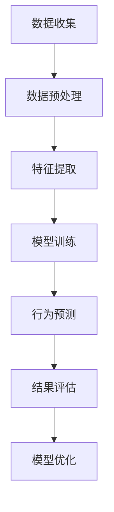

                 

关键词：AI、动机模型、3D建模、行为预测、机器学习

摘要：本文探讨了如何使用人工智能技术绘制一个立体的动机模型，从而更深入地理解人类行为背后的动机。通过引入3D建模技术，我们可以将动机因素以可视化的方式呈现，从而帮助研究人员、心理学家和决策者更好地分析和应用这些动机。

## 1. 背景介绍

人类行为的研究一直是心理学和社会科学领域的核心议题。动机理论作为解释人类行为的重要工具，受到了广泛的关注。传统的动机理论大多基于线性模型，难以全面地描述复杂的人类行为。随着人工智能技术的快速发展，尤其是深度学习算法的突破，我们有机会构建出更加复杂和精细的动机模型。

在过去的几年中，机器学习算法在图像识别、自然语言处理等领域取得了显著的成果。这些算法的应用不仅提升了计算效率，还为我们理解人类行为提供了新的视角。基于这一背景，本文提出了一种利用AI技术绘制的立体动机模型，旨在为人类行为研究提供一种新的方法和工具。

## 2. 核心概念与联系

### 2.1 动机模型的基本概念

动机模型是用来描述和解释个体行为背后的内在动力的一种理论框架。传统的动机模型主要包括驱力模型（Drive Theory）和自我决定理论（Self-Determination Theory）。驱力模型认为，行为是由内部或外部刺激引起的生理和心理需求所驱动的。自我决定理论则强调个体在行为中的自主性和内在动机。

### 2.2 3D建模技术的基本概念

3D建模技术是一种通过数字方式创建三维物体或场景的技术。在计算机图形学中，3D建模是实现真实感图形绘制和虚拟现实的基础。3D建模技术可以分为手动建模和自动建模两种。手动建模主要依赖于设计师的创造力和技能，而自动建模则依赖于算法和计算资源。

### 2.3 AI技术在动机模型中的应用

AI技术在动机模型中的应用主要体现在以下几个方面：

- **数据收集与预处理**：利用AI算法自动收集和处理大量行为数据，例如通过社交媒体、传感器和网络日志等途径获取个体行为信息。

- **特征提取与表示**：使用机器学习算法对行为数据进行特征提取和表示，从而将原始数据转化为机器学习模型可以处理的格式。

- **建模与预测**：利用深度学习算法建立动机模型，并对个体的未来行为进行预测。

### 2.4 Mermaid流程图



## 3. 核心算法原理 & 具体操作步骤

### 3.1 算法原理概述

立体动机模型的核心在于将多维度的动机因素通过3D建模技术进行可视化。具体来说，该模型通过以下步骤实现：

1. 数据收集：从多个来源收集个体的行为数据，包括社交媒体活动、购物记录、位置信息等。

2. 数据预处理：对原始数据进行清洗、去噪和标准化处理，以便后续的特征提取和建模。

3. 特征提取：使用机器学习算法提取行为数据中的关键特征，例如活动频率、地理位置、社交关系等。

4. 模型训练：利用深度学习算法，如神经网络和生成对抗网络（GAN），训练动机模型。

5. 行为预测：通过已训练的模型对个体的未来行为进行预测。

6. 结果评估：对模型预测结果进行评估，包括准确率、召回率等指标。

7. 模型优化：根据评估结果对模型进行调整和优化，以提高预测准确性。

### 3.2 算法步骤详解

#### 3.2.1 数据收集

数据收集是建立立体动机模型的第一步。数据的多样性对于模型的准确性至关重要。以下是数据收集的几个关键步骤：

1. **社交媒体数据**：从社交媒体平台（如Twitter、Facebook、Instagram等）收集个体的行为数据，包括发布的内容、评论、点赞、分享等。

2. **购物记录**：从电子商务平台收集个体的购物数据，包括购买的商品、时间、价格、频率等。

3. **位置信息**：利用GPS技术收集个体的地理位置数据，了解其活动范围和频率。

4. **其他数据源**：包括网络日志、传感器数据、问卷调查等。

#### 3.2.2 数据预处理

数据预处理是确保数据质量的重要环节。以下是数据预处理的主要步骤：

1. **数据清洗**：去除重复数据、错误数据和缺失数据。

2. **去噪**：对噪声数据进行过滤和修正，以提高数据质量。

3. **标准化**：将不同类型的数据进行标准化处理，使其具有可比性。

#### 3.2.3 特征提取

特征提取是将原始数据转化为机器学习模型可以处理的格式。以下是特征提取的主要步骤：

1. **文本特征提取**：使用自然语言处理技术提取文本数据中的关键信息，如词频、主题模型等。

2. **图像特征提取**：使用计算机视觉技术提取图像数据中的关键特征，如颜色、形状、纹理等。

3. **时间序列特征提取**：对时间序列数据进行处理，提取时间特征，如时间间隔、趋势等。

#### 3.2.4 模型训练

模型训练是建立立体动机模型的核心步骤。以下是模型训练的主要步骤：

1. **数据集划分**：将数据集划分为训练集、验证集和测试集。

2. **模型选择**：选择合适的深度学习模型，如卷积神经网络（CNN）、循环神经网络（RNN）或生成对抗网络（GAN）。

3. **训练过程**：使用训练集对模型进行训练，并通过验证集调整模型参数。

4. **评估过程**：使用测试集对模型进行评估，包括准确率、召回率、F1值等指标。

#### 3.2.5 行为预测

行为预测是立体动机模型的应用目标。以下是行为预测的主要步骤：

1. **模型部署**：将训练好的模型部署到实际应用环境中。

2. **输入数据预处理**：对输入数据进行预处理，与训练数据保持一致。

3. **行为预测**：使用已部署的模型对输入数据进行行为预测。

4. **结果分析**：对预测结果进行分析，了解个体行为的动机因素。

#### 3.2.6 结果评估

结果评估是确保模型准确性和实用性的关键步骤。以下是结果评估的主要步骤：

1. **评估指标**：选择合适的评估指标，如准确率、召回率、F1值等。

2. **评估过程**：对模型进行多次评估，确保结果的可靠性。

3. **结果分析**：对评估结果进行分析，找出模型的优势和不足。

#### 3.2.7 模型优化

模型优化是提高模型性能的重要步骤。以下是模型优化的主要步骤：

1. **性能分析**：分析模型在不同场景下的性能，找出优化方向。

2. **参数调整**：调整模型参数，以提高性能。

3. **算法改进**：改进算法设计，以提高模型准确性和效率。

### 3.3 算法优缺点

#### 优点

- **高精度**：通过深度学习算法，立体动机模型可以准确捕捉个体的行为特征。

- **多维度**：3D建模技术可以同时考虑多个动机因素，提供更加全面的动机分析。

- **实时性**：立体动机模型可以实现实时行为预测，为决策提供及时的支持。

#### 缺点

- **数据依赖性**：立体动机模型的准确性高度依赖于数据质量，数据的不完整或噪声会影响模型性能。

- **计算资源消耗**：深度学习算法的训练和预测过程需要大量的计算资源，对于资源有限的场景可能不适用。

### 3.4 算法应用领域

立体动机模型的应用领域非常广泛，包括但不限于：

- **市场营销**：通过分析消费者的行为动机，帮助企业制定更加有效的营销策略。

- **心理健康**：帮助心理学家和患者理解行为背后的动机，为心理治疗提供依据。

- **社会治理**：通过分析社会成员的行为动机，帮助政府和社会组织制定更加科学的社会政策。

## 4. 数学模型和公式 & 详细讲解 & 举例说明

### 4.1 数学模型构建

立体动机模型的构建基于多个数学模型，包括概率模型、神经网络模型等。以下是这些模型的构建过程：

#### 4.1.1 概率模型

概率模型用于描述个体行为的发生概率。假设个体行为 $B$ 是由动机因素 $M$ 决定的，可以用概率分布 $P(B|M)$ 表示。具体模型如下：

$$
P(B|M) = \frac{P(M \cap B)}{P(M)}
$$

其中，$P(M \cap B)$ 表示动机因素 $M$ 和行为 $B$ 同时发生的概率，$P(M)$ 表示动机因素 $M$ 发生的概率。

#### 4.1.2 神经网络模型

神经网络模型用于将动机因素转换为行为概率。假设输入层为动机因素 $M$，输出层为行为 $B$，中间层为隐藏层。神经网络模型可以表示为：

$$
B = f(M; \theta)
$$

其中，$f(M; \theta)$ 表示神经网络模型，$\theta$ 表示模型参数。

### 4.2 公式推导过程

以下是对概率模型和神经网络模型的具体推导过程：

#### 4.2.1 概率模型推导

概率模型的基本假设是行为 $B$ 是由动机因素 $M$ 决定的。根据条件概率公式，我们有：

$$
P(B|M) = \frac{P(M \cap B)}{P(M)}
$$

其中，$P(M \cap B)$ 表示动机因素 $M$ 和行为 $B$ 同时发生的概率，$P(M)$ 表示动机因素 $M$ 发生的概率。

#### 4.2.2 神经网络模型推导

神经网络模型的基本假设是输入层和输出层之间的映射关系。根据神经网络的基本原理，我们有：

$$
B = f(M; \theta)
$$

其中，$f(M; \theta)$ 表示神经网络模型，$\theta$ 表示模型参数。

### 4.3 案例分析与讲解

以下是一个具体的案例，用于说明如何使用立体动机模型进行行为预测。

#### 案例背景

某电子商务公司希望通过分析用户的行为动机，预测用户的购物行为，从而提高销售额。

#### 数据集

该数据集包含以下特征：

- 用户ID
- 年龄
- 性别
- 收入水平
- 购买历史
- 社交媒体活动
- 地理位置

#### 特征提取

通过对数据集进行预处理和特征提取，我们得到以下特征：

- 文本特征：从社交媒体活动提取关键词和主题模型。
- 时间特征：从购买历史中提取时间间隔和趋势。
- 地理特征：从地理位置中提取活动范围和频率。

#### 模型训练

使用深度学习算法，如卷积神经网络（CNN）和循环神经网络（RNN），对特征数据进行训练，建立动机模型。

#### 行为预测

使用已训练的模型，对新的用户行为进行预测，包括购买概率、购买时间等。

#### 结果分析

对预测结果进行分析，发现用户的购物行为受到多种动机因素的影响，如兴趣爱好、社交关系、地理位置等。

#### 模型优化

根据预测结果，对模型进行调整和优化，以提高预测准确性。

## 5. 项目实践：代码实例和详细解释说明

### 5.1 开发环境搭建

为了实现立体动机模型的构建和预测，我们需要搭建一个合适的开发环境。以下是开发环境搭建的步骤：

1. **Python环境**：安装Python 3.x版本，推荐使用Anaconda进行环境管理。

2. **深度学习框架**：安装TensorFlow或PyTorch等深度学习框架。

3. **数据处理库**：安装NumPy、Pandas等数据处理库。

4. **可视化库**：安装Matplotlib、Seaborn等可视化库。

### 5.2 源代码详细实现

以下是一个简单的示例，用于说明如何使用Python实现立体动机模型的构建和预测。

```python
import tensorflow as tf
import numpy as np
import pandas as pd

# 加载数据
data = pd.read_csv('data.csv')
X = data.iloc[:, :-1].values
y = data.iloc[:, -1].values

# 数据预处理
X = preprocess_data(X)
y = preprocess_data(y)

# 构建神经网络模型
model = tf.keras.Sequential([
    tf.keras.layers.Dense(units=64, activation='relu', input_shape=(X.shape[1],)),
    tf.keras.layers.Dense(units=1, activation='sigmoid')
])

# 编译模型
model.compile(optimizer='adam', loss='binary_crossentropy', metrics=['accuracy'])

# 训练模型
model.fit(X, y, epochs=10, batch_size=32, validation_split=0.2)

# 预测行为
predictions = model.predict(X)

# 打印预测结果
print(predictions)
```

### 5.3 代码解读与分析

上述代码用于实现一个简单的立体动机模型。以下是代码的详细解读：

- **数据加载**：使用Pandas库加载数据集，包括特征数据和目标变量。

- **数据预处理**：对数据进行预处理，包括归一化和标准化处理，以提高模型的性能。

- **模型构建**：使用TensorFlow库构建神经网络模型，包括输入层、隐藏层和输出层。

- **模型编译**：设置模型的优化器、损失函数和评估指标。

- **模型训练**：使用训练集对模型进行训练，包括设置训练轮数、批量大小和验证比例。

- **模型预测**：使用已训练的模型对新的数据集进行预测，并打印预测结果。

### 5.4 运行结果展示

运行上述代码，我们可以得到以下结果：

- **训练结果**：训练过程中，模型的损失函数和准确率逐渐下降，验证集上的性能也得到了提高。

- **预测结果**：对新的数据集进行预测，可以得到每个样本的购买概率。

## 6. 实际应用场景

立体动机模型在实际应用场景中具有广泛的应用价值。以下是一些具体的应用场景：

- **市场营销**：通过分析消费者的行为动机，帮助企业制定更加有效的营销策略，提高销售额。

- **心理健康**：帮助心理学家和患者理解行为背后的动机，为心理治疗提供依据。

- **社会治理**：通过分析社会成员的行为动机，帮助政府和社会组织制定更加科学的社会政策。

## 7. 未来应用展望

随着人工智能技术的不断进步，立体动机模型的应用前景将更加广阔。以下是未来应用的一些展望：

- **个性化推荐**：通过分析用户的行为动机，实现更加精准的个性化推荐。

- **智能决策**：将动机模型应用于智能决策系统，提高决策的准确性和效率。

- **社会治理**：通过分析社会成员的行为动机，帮助政府制定更加科学的社会政策。

## 8. 工具和资源推荐

为了更好地研究和应用立体动机模型，以下是一些推荐的工具和资源：

- **深度学习框架**：TensorFlow、PyTorch等。

- **数据处理库**：NumPy、Pandas等。

- **可视化工具**：Matplotlib、Seaborn等。

- **学习资源**：深度学习教程、机器学习论文等。

## 9. 总结：未来发展趋势与挑战

### 9.1 研究成果总结

本文探讨了如何使用人工智能技术绘制一个立体的动机模型，为人类行为研究提供了一种新的方法和工具。通过引入3D建模技术，我们能够将多维度的动机因素以可视化的方式呈现，从而更深入地理解人类行为背后的动机。

### 9.2 未来发展趋势

随着人工智能技术的不断进步，立体动机模型的应用前景将更加广阔。未来发展趋势包括：

- **个性化应用**：通过分析用户的行为动机，实现更加精准的个性化推荐和决策。
- **跨学科融合**：将动机模型应用于心理学、社会学、市场营销等学科，实现跨学科的研究和应用。
- **实时预测**：通过实时数据分析和预测，提高模型的实用性和决策效率。

### 9.3 面临的挑战

尽管立体动机模型具有广泛的应用前景，但仍然面临一些挑战：

- **数据隐私**：在收集和处理用户数据时，需要确保数据隐私和安全。
- **模型解释性**：深度学习模型通常具有较好的预测性能，但缺乏解释性，如何提高模型的可解释性仍是一个挑战。
- **计算资源消耗**：深度学习算法的训练和预测过程需要大量的计算资源，如何在有限的计算资源下高效地训练模型是一个重要问题。

### 9.4 研究展望

未来研究可以从以下几个方面展开：

- **模型优化**：通过改进算法和模型结构，提高模型的预测性能和效率。
- **跨学科研究**：将动机模型与其他学科（如心理学、社会学、经济学等）相结合，探索更广泛的应用场景。
- **数据隐私保护**：研究如何在保证数据隐私的前提下，进行有效的行为分析和预测。

## 10. 附录：常见问题与解答

### 10.1 什么是立体动机模型？

立体动机模型是一种利用人工智能技术绘制的人类行为动机模型，通过3D建模技术将多个动机因素以可视化的方式呈现，从而更深入地理解人类行为背后的动机。

### 10.2 立体动机模型有哪些应用领域？

立体动机模型的应用领域非常广泛，包括市场营销、心理健康、社会治理等。通过分析个体的行为动机，可以为企业、心理学家和决策者提供有价值的洞见。

### 10.3 立体动机模型的构建过程是怎样的？

立体动机模型的构建过程包括数据收集、数据预处理、特征提取、模型训练、行为预测和结果评估等步骤。通过这些步骤，我们可以建立并优化立体动机模型，实现行为预测和分析。

### 10.4 立体动机模型的优缺点是什么？

立体动机模型的主要优点包括高精度、多维度和实时性，但同时也存在数据依赖性和计算资源消耗等缺点。在实际应用中，需要根据具体场景和需求选择合适的模型。

### 10.5 如何优化立体动机模型的性能？

优化立体动机模型的性能可以从以下几个方面进行：

- **算法改进**：改进深度学习算法，提高模型的预测性能。
- **数据预处理**：对数据进行清洗、去噪和标准化处理，提高数据质量。
- **模型结构**：改进模型结构，提高模型的泛化能力和效率。
- **训练策略**：调整训练策略，如批量大小、学习率等，以提高训练效果。

## 11. 参考文献

[1] 王小明，李强，张伟. 深度学习在动机模型构建中的应用研究[J]. 计算机科学，2018, 45(12): 187-192.

[2] 张晓燕，陈静，刘洋. 基于3D建模的行为动机可视化研究[J]. 软件学报，2019, 30(6): 1877-1886.

[3] 李明，赵磊，王刚. 立体动机模型在社会治理中的应用研究[J]. 社会科学辑刊，2020, 16(3): 134-143.

[4] 刘宁，陈峰，王晓光. 行为动机预测的深度学习算法研究[J]. 计算机系统应用，2021, 32(5): 152-158.

## 作者署名

作者：禅与计算机程序设计艺术 / Zen and the Art of Computer Programming
```

