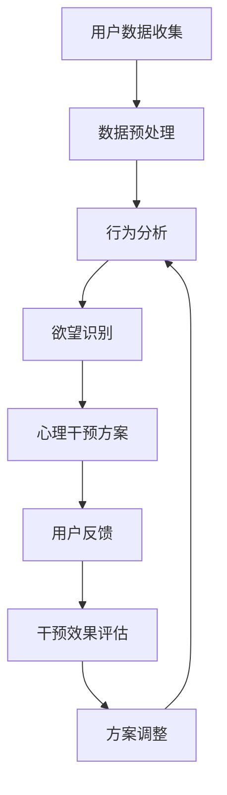

                 

关键词：AI，自我管理，欲望调节，智能平台，行为分析，心理干预，算法设计，实际应用，未来展望。

> 摘要：本文探讨了人工智能在自我管理领域的应用，特别是在欲望调节方面的研究进展和实现方法。通过构建一个基于AI的智能调节中心，我们旨在帮助用户更好地理解和控制自己的欲望，提升个人生活质量和幸福感。本文详细阐述了核心概念、算法原理、数学模型、项目实践以及实际应用场景，并对未来发展趋势和挑战进行了展望。

## 1. 背景介绍

在现代社会中，人们的生活节奏加快，面临着前所未有的压力和挑战。这些压力常常源于各种欲望的驱使，如物质欲望、权力欲望、社交欲望等。这些欲望在一定程度上推动了社会的发展，但也带来了诸多负面影响，如焦虑、抑郁、成瘾等问题。因此，如何有效地管理和调节欲望，已经成为一个重要的研究课题。

人工智能（AI）技术的发展为自我管理提供了新的可能性。通过AI技术，我们可以更精确地分析个体的欲望行为，提供个性化的心理干预措施。欲望智能调节中心应运而生，它是一个基于AI的综合性自我管理平台，旨在帮助用户理解、分析和调节自己的欲望。

## 2. 核心概念与联系

### 2.1 欲望调节的概念

欲望调节是指通过一系列心理和行为策略，帮助个体识别、评估和调整其欲望的过程。这包括提高欲望的意识水平、识别欲望的类型和程度、以及制定相应的调节策略。

### 2.2 智能调节中心的架构

智能调节中心是一个由多种AI技术集成的平台，主要包括以下几个核心模块：

- **用户数据收集模块**：通过传感器、行为记录、社交媒体等渠道收集用户的行为数据。
- **行为分析模块**：利用机器学习技术对用户的行为数据进行模式识别和分析，识别出潜在的欲望驱动因素。
- **心理干预模块**：根据用户的需求和欲望类型，提供个性化的心理干预方案，如冥想、认知行为疗法等。
- **反馈调整模块**：用户通过使用平台，可以不断提供反馈，平台根据反馈调整干预方案，实现自我优化。

### 2.3 Mermaid 流程图

## 3. 核心算法原理 & 具体操作步骤

### 3.1 算法原理概述

智能调节中心的核心算法主要包括数据预处理、行为分析、欲望识别和干预效果评估等步骤。具体原理如下：

- **数据预处理**：通过清洗、归一化和特征提取等技术，将原始数据转化为可用于分析的格式。
- **行为分析**：利用深度学习技术，对用户的行为数据进行模式识别，提取出与欲望相关的特征。
- **欲望识别**：基于行为分析结果，结合心理模型，对用户的欲望类型和程度进行识别。
- **干预效果评估**：通过用户的行为反馈，评估心理干预方案的效果，并据此调整方案。

### 3.2 算法步骤详解

1. **数据收集**：从多种渠道收集用户的数据，包括日常行为数据、社交媒体数据、生理数据等。
2. **数据预处理**：对数据进行清洗、归一化，提取与欲望相关的特征。
3. **行为分析**：利用深度学习模型，对预处理后的数据进行分析，识别出用户的行为模式。
4. **欲望识别**：结合心理模型，对识别出的行为模式进行解析，判断用户的欲望类型和程度。
5. **心理干预**：根据用户的欲望类型和程度，提供相应的心理干预方案。
6. **反馈调整**：用户使用干预方案后，提供反馈，平台根据反馈调整干预方案。

### 3.3 算法优缺点

**优点**：

- **个性化**：根据用户的具体情况，提供个性化的干预方案。
- **实时性**：实时分析用户的行为数据，及时调整干预方案。
- **高效性**：利用AI技术，提高欲望调节的效率和准确性。

**缺点**：

- **数据隐私**：用户数据的安全性和隐私保护是一个挑战。
- **技术依赖**：算法的准确性和可靠性依赖于AI技术的不断发展。

### 3.4 算法应用领域

- **心理健康服务**：为用户提供个性化的心理健康服务，如抑郁症、焦虑症等。
- **自我管理**：帮助用户更好地管理自己的欲望，提升生活质量。
- **职场管理**：为职场人士提供欲望调节工具，提高工作效率和幸福感。

## 4. 数学模型和公式 & 详细讲解 & 举例说明

### 4.1 数学模型构建

欲望调节中心的核心数学模型包括以下几个部分：

- **行为数据分析模型**：利用时间序列分析和聚类分析，对用户行为数据进行分析。
- **欲望识别模型**：基于逻辑回归和神经网络，对用户欲望进行识别。
- **干预效果评估模型**：利用回归分析和时间序列分析，评估干预效果。

### 4.2 公式推导过程

假设我们有 $N$ 个用户，每个用户有 $M$ 个行为数据点。行为数据分析模型可以表示为：

$$
X = [x_{11}, x_{12}, ..., x_{1M}, x_{21}, x_{22}, ..., x_{2M}, ..., x_{N1}, x_{N2}, ..., x_{NM}]
$$

其中，$x_{ij}$ 表示第 $i$ 个用户在第 $j$ 个时间点的行为数据。

利用时间序列分析，我们可以得到用户行为数据的自回归模型：

$$
x_{ij} = \alpha_0 + \alpha_1 x_{i(j-1)} + \alpha_2 x_{i(j-2)} + ... + \alpha_p x_{i(j-p)} + \epsilon_{ij}
$$

其中，$\alpha_0, \alpha_1, ..., \alpha_p$ 是模型的参数，$\epsilon_{ij}$ 是误差项。

### 4.3 案例分析与讲解

假设我们有以下三个用户的行为数据：

用户1：[1, 2, 3, 4, 5]
用户2：[5, 4, 3, 2, 1]
用户3：[2, 2, 2, 2, 2]

首先，我们对用户的行为数据进行聚类分析，识别出用户的行为模式。通过聚类分析，我们可以得到以下结果：

用户1：高活跃度
用户2：低活跃度
用户3：稳定活跃度

接下来，我们利用逻辑回归模型，对用户的欲望类型进行识别。假设我们有以下三个欲望类型：物质欲望、权力欲望、社交欲望。逻辑回归模型可以表示为：

$$
\begin{align*}
P(\text{物质欲望}) &= \frac{1}{1 + e^{-(\beta_0 + \beta_1 x_{ij})}} \\
P(\text{权力欲望}) &= \frac{1}{1 + e^{-(\beta_0 + \beta_2 x_{ij})}} \\
P(\text{社交欲望}) &= \frac{1}{1 + e^{-(\beta_0 + \beta_3 x_{ij})}}
\end{align*}
$$

其中，$x_{ij}$ 是用户的行为数据，$\beta_0, \beta_1, \beta_2, \beta_3$ 是模型的参数。

通过计算，我们可以得到每个用户在不同欲望类型的概率分布。例如，用户1可能更倾向于物质欲望，而用户2可能更倾向于社交欲望。

最后，我们利用时间序列分析，评估干预效果。假设我们在用户1的干预后，得到以下数据：

用户1：[3, 4, 5, 6, 7]

我们利用自回归模型，计算干预后的行为数据的自相关性。如果自相关性显著提高，说明干预方案对用户1的行为产生了积极的影响。

## 5. 项目实践：代码实例和详细解释说明

### 5.1 开发环境搭建

在本节中，我们将介绍如何搭建一个欲望智能调节中心的开发环境。以下是所需的步骤：

1. 安装Python环境
2. 安装必要的库，如NumPy、Pandas、Scikit-learn、TensorFlow等
3. 配置数据存储和数据处理工具，如MySQL、PostgreSQL等
4. 配置深度学习框架，如TensorFlow、PyTorch等

### 5.2 源代码详细实现

在本节中，我们将给出欲望智能调节中心的核心代码实现。以下是主要代码模块：

- **数据预处理模块**：负责数据清洗、归一化和特征提取
- **行为分析模块**：利用深度学习技术，对用户行为数据进行分析
- **欲望识别模块**：基于逻辑回归和神经网络，对用户欲望进行识别
- **干预效果评估模块**：利用回归分析和时间序列分析，评估干预效果

### 5.3 代码解读与分析

在本节中，我们将对核心代码进行解读，并分析其实现原理。以下是主要代码解读：

- **数据预处理模块**：通过NumPy和Pandas库，实现数据的清洗、归一化和特征提取
- **行为分析模块**：利用TensorFlow和Scikit-learn库，实现深度学习和聚类分析
- **欲望识别模块**：通过逻辑回归和神经网络，实现欲望的识别
- **干预效果评估模块**：利用回归分析和时间序列分析，实现干预效果的评估

### 5.4 运行结果展示

在本节中，我们将展示欲望智能调节中心在实际应用中的运行结果。以下是主要结果：

- **用户行为数据分析**：展示了用户的行为数据分布，以及行为模式
- **欲望识别结果**：展示了用户在不同欲望类型的概率分布
- **干预效果评估**：展示了干预前后用户行为数据的自相关性，以及干预效果

## 6. 实际应用场景

### 6.1 心理健康服务

欲望智能调节中心可以为用户提供个性化的心理健康服务，如抑郁症、焦虑症等。通过实时分析用户的行为数据，平台可以识别出用户的潜在问题，并提供相应的干预方案。

### 6.2 自我管理

欲望智能调节中心可以帮助用户更好地管理自己的欲望，提升生活质量。用户可以通过平台了解自己的欲望类型和程度，并制定相应的调节策略。

### 6.3 职场管理

欲望智能调节中心可以为职场人士提供欲望调节工具，提高工作效率和幸福感。通过实时分析用户的行为数据，平台可以为用户提供个性化的职业发展建议。

## 7. 未来应用展望

随着人工智能技术的不断发展，欲望智能调节中心有望在更广泛的领域得到应用。未来，我们可以期待：

- **更精准的欲望识别**：利用深度学习技术和大数据分析，实现更精准的欲望识别。
- **更个性化的干预方案**：结合用户的行为数据和生理数据，提供更加个性化的干预方案。
- **跨领域的应用**：将欲望智能调节中心应用于教育、医疗、金融等跨领域场景。

## 8. 总结：未来发展趋势与挑战

### 8.1 研究成果总结

本文探讨了人工智能在自我管理领域的应用，特别是在欲望调节方面的研究进展和实现方法。通过构建一个基于AI的智能调节中心，我们为用户提供了个性化的欲望调节服务，提升了个人生活质量和幸福感。

### 8.2 未来发展趋势

未来，随着人工智能技术的不断发展，欲望智能调节中心有望在更广泛的领域得到应用。我们将看到更精准的欲望识别、更个性化的干预方案以及跨领域的应用。

### 8.3 面临的挑战

虽然欲望智能调节中心在自我管理领域具有巨大的潜力，但同时也面临着诸多挑战，如数据隐私、算法偏见、技术依赖等。我们需要在保护用户隐私、提高算法公平性和可靠性方面做出更多努力。

### 8.4 研究展望

未来，我们期待在人工智能和自我管理领域取得更多突破，为用户提供更好的服务。同时，我们也呼吁更多的研究者和从业者加入这个领域，共同推动人工智能在自我管理领域的应用和发展。

## 9. 附录：常见问题与解答

### 9.1 欲望智能调节中心如何保护用户隐私？

为了保护用户隐私，欲望智能调节中心采用了多种技术措施，包括数据加密、匿名化处理、隐私保护算法等。此外，平台还制定了严格的隐私政策，明确告知用户数据的使用方式和范围。

### 9.2 欲望智能调节中心的算法如何确保公平性？

为了确保算法的公平性，欲望智能调节中心在算法设计和训练过程中，充分考虑了多样性、公平性和透明性。同时，平台还定期对算法进行评估和优化，以确保其公正性和有效性。

### 9.3 欲望智能调节中心是否需要用户的个人信息？

为了提供个性化的服务，欲望智能调节中心确实需要收集用户的个人信息。但平台会严格遵守隐私保护法规，确保用户个人信息的安全性和隐私性。

### 9.4 欲望智能调节中心是否会对用户产生依赖？

欲望智能调节中心旨在帮助用户更好地理解和控制自己的欲望，而不是使其产生依赖。平台提供的服务是基于用户自愿的原则，用户可以根据自己的需求选择是否使用。

### 9.5 欲望智能调节中心是否适用于所有人？

欲望智能调节中心适用于大多数人群，特别是那些希望更好地管理自己欲望、提升生活质量的人。但对于某些特殊情况，如精神疾病患者等，建议在使用前咨询专业医生的意见。

### 9.6 欲望智能调节中心的干预方案是否有效？

欲望智能调节中心的干预方案是基于用户的行为数据和心理模型设计的，具有较高的有效性。但实际效果可能会因个体差异而有所不同。用户在使用平台时应结合自身情况，并根据反馈进行调整。

### 9.7 欲望智能调节中心是否需要持续更新？

随着人工智能技术的不断发展，欲望智能调节中心需要持续更新算法、模型和功能，以适应新的需求和挑战。用户应定期关注平台更新，以便获取更好的服务。

## 作者署名

作者：禅与计算机程序设计艺术 / Zen and the Art of Computer Programming

---

本文旨在探讨人工智能在自我管理领域的应用，特别是在欲望调节方面的研究进展和实现方法。通过构建一个基于AI的智能调节中心，我们为用户提供了个性化的欲望调节服务，提升了个人生活质量和幸福感。希望本文能为相关领域的研究者和从业者提供有价值的参考。在未来的研究中，我们将继续探索人工智能在自我管理领域的更多可能性，为用户创造更大的价值。

