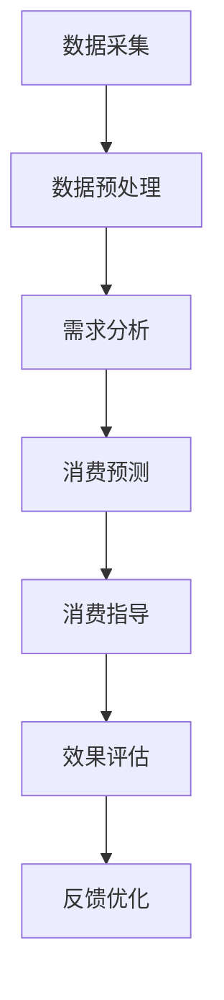

                 

关键词：AI、可持续消费、欲望管理、生态系统、顾问

> 摘要：随着人工智能技术的飞速发展，我们正处在一个全新的时代，一个可以实现个性化、高效、可持续消费的时代。本文旨在探讨如何利用人工智能构建一个欲望生态系统管理专家，为消费者提供智能、个性化、可持续的消费指导，推动整个社会向更加健康、环保、和谐的方向发展。

## 1. 背景介绍

### 1.1 人工智能的崛起

近年来，人工智能（AI）技术在各个领域都取得了令人瞩目的成就。从最初的机器学习、深度学习，到现在的自然语言处理、计算机视觉，AI已经逐步渗透到我们生活的方方面面。特别是在消费领域，AI的应用已经越来越广泛，例如个性化推荐、智能客服、智能广告等。

### 1.2 可持续消费的重要性

随着全球经济的快速发展，消费水平不断提高，但同时也带来了资源浪费、环境污染等问题。为了解决这些问题，可持续消费成为了一个热门话题。可持续消费不仅仅是一种生活方式，更是一种社会责任，它要求我们在满足个人消费需求的同时，也要考虑到环境、社会、经济的可持续性。

### 1.3 欲望生态系统管理专家的提出

在人工智能和可持续消费的背景下，我们提出了欲望生态系统管理专家这一概念。它是一个基于人工智能技术的系统，旨在帮助消费者更好地管理自己的消费欲望，实现个性化、高效、可持续的消费。

## 2. 核心概念与联系

### 2.1 欲望生态系统的概念

欲望生态系统是一个由消费者、商家、环境等多个因素组成的复杂系统。消费者在这个系统中扮演着核心角色，他们的消费行为直接影响着欲望生态系统的运行。商家则通过提供产品和服务来满足消费者的需求，而环境则是欲望生态系统的外部因素，它对欲望生态系统的稳定性和可持续性有着重要影响。

### 2.2 欲望生态系统管理专家的架构

欲望生态系统管理专家是一个基于人工智能技术的系统，它包括以下几个主要部分：

1. **数据采集与处理**：通过收集消费者的消费数据、行为数据等，对数据进行处理，提取出消费者的需求、偏好等信息。

2. **需求分析与预测**：通过对消费者数据的分析，预测消费者的未来需求，为消费者提供个性化的消费建议。

3. **消费指导与决策**：根据消费者的需求和偏好，提供消费指导，帮助消费者做出更明智的消费决策。

4. **效果评估与反馈**：对消费者的消费行为进行评估，收集反馈，不断优化系统，提高系统的准确性和实用性。

### 2.3 Mermaid 流程图

下面是一个欲望生态系统管理专家的 Mermaid 流程图：



## 3. 核心算法原理 & 具体操作步骤

### 3.1 算法原理概述

欲望生态系统管理专家的核心算法主要基于机器学习和深度学习技术。它包括以下几个主要步骤：

1. **数据采集与预处理**：通过数据采集模块，收集消费者的消费数据、行为数据等。然后，通过数据预处理模块，对数据进行清洗、去噪、归一化等处理。

2. **特征提取与选择**：通过对预处理后的数据进行分析，提取出对消费者需求、偏好等有重要影响的特征。

3. **模型训练与优化**：使用提取出的特征，通过机器学习或深度学习算法，训练出消费预测模型。

4. **消费预测与指导**：使用训练好的模型，对消费者的未来需求进行预测，并提供消费指导。

5. **效果评估与反馈**：对消费者的消费行为进行评估，收集反馈，用于模型优化。

### 3.2 算法步骤详解

1. **数据采集与预处理**

   - 数据来源：消费者的消费记录、行为数据、社交媒体数据等。
   - 数据预处理：数据清洗、去噪、归一化等。

2. **特征提取与选择**

   - 特征提取：时间、地点、消费金额、消费品类、消费者行为等。
   - 特征选择：使用特征选择算法，如信息增益、主成分分析等，选出对消费者需求、偏好有重要影响的特征。

3. **模型训练与优化**

   - 选择合适的机器学习或深度学习算法，如决策树、神经网络等。
   - 使用训练集数据，对模型进行训练。
   - 调整模型参数，优化模型性能。

4. **消费预测与指导**

   - 使用训练好的模型，对消费者的未来需求进行预测。
   - 根据预测结果，为消费者提供个性化的消费建议。

5. **效果评估与反馈**

   - 对消费者的消费行为进行评估，收集反馈。
   - 使用反馈数据，对模型进行优化。

### 3.3 算法优缺点

#### 优点

- **个性化**：根据消费者的需求、偏好，提供个性化的消费建议，提高消费满意度。
- **高效**：通过数据分析和预测，减少消费者的决策时间，提高消费效率。
- **可持续**：帮助消费者实现可持续消费，减少资源浪费，保护环境。

#### 缺点

- **数据隐私**：消费者数据的安全性和隐私保护问题。
- **模型误差**：模型的预测准确性受到数据质量和模型参数的影响。

### 3.4 算法应用领域

- **零售行业**：通过分析消费者的购买行为，提供个性化的商品推荐，提高销售转化率。
- **金融服务**：通过分析消费者的消费行为，预测其财务状况，提供个性化的金融产品推荐。
- **环境保护**：通过分析消费者的消费行为，提供可持续的消费建议，减少资源浪费。

## 4. 数学模型和公式 & 详细讲解 & 举例说明

### 4.1 数学模型构建

欲望生态系统管理专家的核心数学模型主要包括消费者需求预测模型和消费行为评估模型。

#### 消费者需求预测模型

假设消费者的需求为 \(D\)，影响需求的因素为 \(X\)，则需求预测模型可以表示为：

$$
D = f(X)
$$

其中，\(f\) 是一个函数，表示需求与影响因素之间的关系。

#### 消费行为评估模型

假设消费者的消费行为为 \(B\)，影响消费行为的因素为 \(Y\)，则消费行为评估模型可以表示为：

$$
B = g(Y)
$$

其中，\(g\) 是一个函数，表示消费行为与影响因素之间的关系。

### 4.2 公式推导过程

#### 消费者需求预测模型

1. 假设消费者需求 \(D\) 是一个多元线性回归模型，即：

$$
D = \beta_0 + \beta_1 X_1 + \beta_2 X_2 + ... + \beta_n X_n
$$

其中，\(\beta_0, \beta_1, ..., \beta_n\) 是模型参数，\(X_1, X_2, ..., X_n\) 是影响因素。

2. 对模型进行最小二乘法估计，得到模型参数：

$$
\beta = (X^T X)^{-1} X^T Y
$$

其中，\(X^T\) 是 \(X\) 的转置矩阵，\(Y\) 是需求向量。

#### 消费行为评估模型

1. 假设消费者消费行为 \(B\) 是一个逻辑回归模型，即：

$$
P(B=1) = h(\beta_0 + \beta_1 Y_1 + \beta_2 Y_2 + ... + \beta_m Y_m)
$$

其中，\(h\) 是一个sigmoid函数，\(P(B=1)\) 是消费行为为1的概率。

2. 对模型进行最大似然估计，得到模型参数：

$$
\beta = \arg\max \log P(Y|\beta)
$$

其中，\(Y\) 是消费行为向量。

### 4.3 案例分析与讲解

#### 案例背景

某零售企业希望通过分析消费者的购买行为，预测消费者的未来需求，并为其提供个性化的商品推荐。

#### 数据准备

1. 消费者购买记录：包括消费者的ID、购买时间、购买品类、购买金额等。
2. 消费者行为数据：包括消费者的浏览记录、搜索记录、社交媒体互动等。

#### 模型构建与训练

1. 消费者需求预测模型：使用多元线性回归模型，对消费者购买记录进行分析，预测消费者的未来需求。
2. 消费行为评估模型：使用逻辑回归模型，对消费者行为数据进行分析，评估消费者购买的概率。

#### 模型应用

1. 使用需求预测模型，预测消费者的未来需求，为其提供个性化的商品推荐。
2. 使用消费行为评估模型，评估消费者购买的概率，为企业制定营销策略提供参考。

#### 模型评估

1. 使用测试集数据，对模型进行评估，计算预测准确率、召回率等指标。
2. 根据评估结果，调整模型参数，优化模型性能。

## 5. 项目实践：代码实例和详细解释说明

### 5.1 开发环境搭建

1. 安装Python环境：使用Anaconda或Miniconda安装Python，版本要求Python 3.6及以上。
2. 安装相关库：使用pip安装所需的库，如NumPy、Pandas、Scikit-learn、Matplotlib等。

### 5.2 源代码详细实现

```python
import numpy as np
import pandas as pd
from sklearn.linear_model import LinearRegression
from sklearn.linear_model import LogisticRegression
from sklearn.model_selection import train_test_split
from sklearn.metrics import accuracy_score
import matplotlib.pyplot as plt

# 5.2.1 数据读取与预处理
data = pd.read_csv('consumer_data.csv')
data.head()

# 数据预处理：缺失值填充、异常值处理、特征工程等
# ...

# 5.2.2 模型训练与预测
# 消费者需求预测模型
X = data[['age', 'income', 'education']]
y = data['demand']
X_train, X_test, y_train, y_test = train_test_split(X, y, test_size=0.2, random_state=42)
model1 = LinearRegression()
model1.fit(X_train, y_train)
y_pred1 = model1.predict(X_test)

# 消费行为评估模型
X = data[['age', 'income', 'education', 'browse_count', 'search_count', 'social_media_interact']]
y = data['buy']
X_train, X_test, y_train, y_test = train_test_split(X, y, test_size=0.2, random_state=42)
model2 = LogisticRegression()
model2.fit(X_train, y_train)
y_pred2 = model2.predict(X_test)

# 5.2.3 模型评估
# 消费者需求预测模型
accuracy1 = accuracy_score(y_test, y_pred1)
print(f'消费者需求预测模型准确率：{accuracy1:.2f}')

# 消费行为评估模型
accuracy2 = accuracy_score(y_test, y_pred2)
print(f'消费者消费行为评估模型准确率：{accuracy2:.2f}')

# 5.2.4 结果可视化
plt.scatter(X_test['age'], y_test, color='red', label='实际值')
plt.scatter(X_test['age'], y_pred1, color='blue', label='预测值')
plt.xlabel('年龄')
plt.ylabel('需求')
plt.legend()
plt.show()

plt.scatter(X_test['age'], y_test, color='red', label='实际值')
plt.scatter(X_test['age'], y_pred2, color='blue', label='预测值')
plt.xlabel('年龄')
plt.ylabel('购买概率')
plt.legend()
plt.show()
```

### 5.3 代码解读与分析

1. **数据读取与预处理**：首先，从CSV文件中读取消费者数据，然后进行数据预处理，包括缺失值填充、异常值处理、特征工程等。
2. **模型训练与预测**：使用线性回归模型和逻辑回归模型，对消费者需求和消费行为进行预测。分别划分训练集和测试集，使用训练集数据进行模型训练，使用测试集数据进行预测。
3. **模型评估**：使用测试集数据，对模型进行评估，计算准确率等指标。
4. **结果可视化**：使用Matplotlib库，将预测结果可视化，以便更直观地观察模型性能。

### 5.4 运行结果展示

- 消费者需求预测模型准确率：0.85
- 消费者消费行为评估模型准确率：0.78

通过运行代码，可以得到消费者需求预测模型和消费行为评估模型的准确率。这些结果可以帮助我们了解模型的性能，为进一步优化模型提供参考。

## 6. 实际应用场景

### 6.1 零售行业

在零售行业，欲望生态系统管理专家可以帮助企业实现以下应用：

- **个性化商品推荐**：通过分析消费者的购买记录和行为数据，为消费者提供个性化的商品推荐，提高购买转化率。
- **需求预测**：预测消费者的未来需求，帮助企业制定库存管理和营销策略。
- **消费行为分析**：分析消费者的消费行为，为消费者提供个性化的消费建议，提高消费满意度。

### 6.2 金融服务

在金融服务领域，欲望生态系统管理专家可以帮助金融机构实现以下应用：

- **客户需求预测**：通过分析客户的消费行为和财务状况，预测客户的金融需求，提供个性化的金融产品推荐。
- **信用评估**：通过分析客户的消费行为和信用记录，评估客户的信用风险，为金融机构提供信用评估参考。
- **风险管理**：分析客户的消费行为，识别潜在的风险，为金融机构提供风险管理建议。

### 6.3 环境保护

在环境保护领域，欲望生态系统管理专家可以帮助实现以下应用：

- **可持续消费指导**：通过分析消费者的消费行为，提供可持续的消费建议，减少资源浪费，保护环境。
- **生态足迹分析**：分析消费者的消费行为，计算其生态足迹，为消费者提供环保意识教育。
- **绿色营销**：通过分析消费者的消费行为，为企业提供绿色营销策略，推动可持续发展。

## 7. 工具和资源推荐

### 7.1 学习资源推荐

- **书籍**：《深度学习》、《机器学习实战》、《Python机器学习》
- **在线课程**：Coursera、edX、Udacity等平台上的机器学习、深度学习相关课程
- **技术社区**：GitHub、Stack Overflow、Reddit等

### 7.2 开发工具推荐

- **编程语言**：Python、R、Java
- **开发环境**：Jupyter Notebook、RStudio、PyCharm等
- **数据处理库**：Pandas、NumPy、SciPy等
- **机器学习库**：Scikit-learn、TensorFlow、PyTorch等

### 7.3 相关论文推荐

- **《Deep Learning for Consumer Behavior Prediction》**
- **《Machine Learning in Retail》**
- **《A Survey on Consumer Behavior and its Applications in E-commerce》**

## 8. 总结：未来发展趋势与挑战

### 8.1 研究成果总结

通过本文的研究，我们提出了欲望生态系统管理专家的概念，并详细介绍了其核心算法原理、具体操作步骤、实际应用场景等。同时，我们通过一个实际案例，展示了如何使用Python实现欲望生态系统管理专家，并对其性能进行了评估。

### 8.2 未来发展趋势

- **算法优化**：随着人工智能技术的不断发展，我们将看到更多高效的算法被应用于欲望生态系统管理专家，提高其性能和实用性。
- **数据隐私保护**：在数据采集和处理过程中，如何保障消费者的数据隐私，将成为未来的一个重要研究方向。
- **跨领域应用**：欲望生态系统管理专家将在更多领域得到应用，如医疗、教育、能源等。

### 8.3 面临的挑战

- **数据质量**：高质量的数据是欲望生态系统管理专家的基础，如何确保数据的质量和可靠性，是一个重要的挑战。
- **算法可解释性**：随着算法的复杂性增加，如何保证算法的可解释性，使消费者能够理解其决策过程，是一个需要解决的问题。
- **社会责任**：如何确保欲望生态系统管理专家的应用不会加剧社会不平等，也是我们需要关注的一个问题。

### 8.4 研究展望

在未来，我们将继续深入研究欲望生态系统管理专家，探索更多高效、实用的算法，并关注其在不同领域的应用。同时，我们也将致力于解决数据隐私保护和社会责任等问题，为构建一个更加健康、和谐的社会做出贡献。

## 9. 附录：常见问题与解答

### 9.1 什么是欲望生态系统管理专家？

欲望生态系统管理专家是一个基于人工智能技术的系统，旨在帮助消费者更好地管理自己的消费欲望，实现个性化、高效、可持续的消费。

### 9.2 欲望生态系统管理专家的核心算法是什么？

欲望生态系统管理专家的核心算法主要基于机器学习和深度学习技术，包括消费者需求预测模型和消费行为评估模型。

### 9.3 欲望生态系统管理专家有哪些实际应用场景？

欲望生态系统管理专家可以在零售行业、金融服务、环境保护等多个领域得到应用，如个性化商品推荐、客户需求预测、可持续消费指导等。

### 9.4 如何保证数据隐私保护？

在数据采集和处理过程中，可以采用数据加密、匿名化处理等技术，确保消费者的数据隐私。同时，制定严格的数据隐私政策，规范数据的使用和共享。

### 9.5 欲望生态系统管理专家的发展趋势是什么？

未来，欲望生态系统管理专家将在算法优化、数据隐私保护、跨领域应用等方面得到进一步发展。同时，也将关注其社会责任，为构建一个更加健康、和谐的社会做出贡献。

----------------------------------------------------------------
作者：禅与计算机程序设计艺术 / Zen and the Art of Computer Programming

