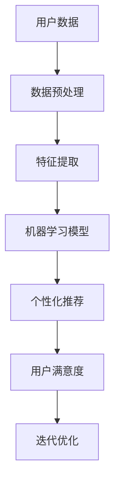

                 

在当今信息时代，人工智能（AI）正迅速成为我们日常生活中不可或缺的一部分。从智能助手到推荐系统，AI 已经深入到我们生活的各个方面，极大地改变了我们的交互方式和生活体验。而在这其中，AI 定制的需求满足，尤其是对个人欲望的个性化响应，成为了一个备受关注的研究方向。本文将深入探讨这一主题，从背景介绍、核心概念、算法原理、数学模型、项目实践、实际应用、工具推荐以及未来展望等多个角度，全面解析 AI 如何实现个性化需求满足，并探讨其中所面临的挑战和机遇。

## 1. 背景介绍

随着互联网和移动设备的普及，海量数据正在不断产生，这些数据中蕴含了用户的行为、兴趣、偏好等关键信息。AI 技术的快速发展，使得我们能够从这些数据中挖掘出有价值的信息，并根据这些信息为用户提供个性化的服务。个性化推荐系统、智能客服、个性化广告等应用，都是基于这一理念的产物。而欲望的个性化满足，则是在这一基础上，进一步探索如何更精准地理解用户的内在需求和欲望，从而提供更加定制化的解决方案。

### 1.1 互联网和移动设备的普及

互联网的普及和移动设备的广泛使用，使得数据采集和分析变得更加容易。用户在浏览网页、使用应用、社交互动等过程中，都会产生大量数据，这些数据成为了 AI 研究的重要资源。

### 1.2 AI 的发展与应用

AI 技术的进步，使得我们能够从海量数据中提取出有价值的信息，并利用这些信息为用户提供个性化的服务。AI 在推荐系统、智能客服、个性化广告等领域的应用，已经取得了显著的成果。

### 1.3 欲望的个性化满足

在传统个性化服务的基础上，欲望的个性化满足进一步探索了如何更深入地理解用户的内在需求和欲望，从而提供更加精准、个性化的服务。这不仅是技术上的挑战，更是对人性、心理和社会互动的深刻洞察。

## 2. 核心概念与联系

在探讨欲望的个性化满足之前，我们需要了解一些核心概念和它们之间的联系。以下是一个简单的 Mermaid 流程图，用于展示这些概念之间的相互关系。



### 2.1 用户数据

用户数据是 AI 定制需求满足的基础。这些数据可以来自多种渠道，如网页浏览记录、社交媒体互动、购买行为等。

### 2.2 数据预处理

数据预处理是确保数据质量的过程，包括数据清洗、去噪、归一化等。这一步骤对于后续的特征提取和模型训练至关重要。

### 2.3 特征提取

特征提取是将原始数据转换为模型可理解的表示。这一步骤涉及提取用户行为、兴趣、偏好等关键特征。

### 2.4 机器学习模型

机器学习模型是核心，通过学习用户数据，模型可以预测用户的潜在需求，并提供个性化的推荐。

### 2.5 个性化推荐

个性化推荐是将模型预测的结果转化为具体的推荐服务，如商品推荐、文章推荐、音乐推荐等。

### 2.6 用户满意度

用户满意度是评估个性化推荐效果的重要指标。通过收集用户反馈，我们可以不断优化推荐系统，提高用户满意度。

### 2.7 迭代优化

迭代优化是一个持续的过程，通过不断收集用户反馈，模型可以不断迭代，从而提供更精准的个性化服务。

## 3. 核心算法原理 & 具体操作步骤

### 3.1 算法原理概述

在欲望的个性化满足中，常用的算法包括协同过滤、基于内容的推荐、深度学习等。协同过滤通过分析用户行为相似度，预测用户可能感兴趣的内容；基于内容的推荐通过分析内容特征，为用户推荐相似的内容；深度学习则利用神经网络，从原始数据中自动学习特征，从而实现更精准的推荐。

### 3.2 算法步骤详解

1. **数据收集与预处理**：收集用户行为数据，并进行预处理，如去噪、归一化等。
2. **特征提取**：提取用户行为、兴趣、偏好等关键特征。
3. **模型选择与训练**：选择合适的模型，如协同过滤、基于内容的推荐或深度学习模型，并进行训练。
4. **个性化推荐**：利用训练好的模型，为用户生成个性化的推荐。
5. **用户反馈与迭代优化**：收集用户反馈，根据反馈优化模型，提高推荐效果。

### 3.3 算法优缺点

- **协同过滤**：优点是计算效率高，能处理大量用户数据；缺点是容易产生冷启动问题，即新用户无法得到有效的推荐。
- **基于内容的推荐**：优点是推荐准确度高，用户体验好；缺点是数据依赖性强，需要大量的内容特征数据。
- **深度学习**：优点是能自动学习复杂特征，处理非结构化数据能力强；缺点是训练过程复杂，计算资源需求大。

### 3.4 算法应用领域

- **电子商务**：为用户提供个性化的商品推荐。
- **社交媒体**：为用户推荐感兴趣的内容、朋友或活动。
- **在线教育**：为用户提供个性化的学习资源。

## 4. 数学模型和公式 & 详细讲解 & 举例说明

在欲望的个性化满足中，数学模型和公式是核心。以下是一个简单的数学模型示例，用于预测用户对某项内容的兴趣度。

### 4.1 数学模型构建

假设用户对内容 $C$ 的兴趣度可以用概率 $P(C)$ 表示，则：

$$
P(C) = \frac{e^{w_0 + w_1 \cdot u + w_2 \cdot c}}{1 + e^{w_0 + w_1 \cdot u + w_2 \cdot c}}
$$

其中，$w_0$、$w_1$ 和 $w_2$ 分别是模型参数，$u$ 是用户特征向量，$c$ 是内容特征向量。

### 4.2 公式推导过程

假设用户对内容 $C$ 的兴趣度与用户特征 $u$ 和内容特征 $c$ 相关，则可以构建一个线性模型：

$$
P(C) = \sigma(w_0 + w_1 \cdot u + w_2 \cdot c)
$$

其中，$\sigma$ 是 sigmoid 函数，用于将线性组合映射到概率值。

### 4.3 案例分析与讲解

假设有一个用户，其特征向量 $u = [1, 0, 1]$，内容特征向量 $c = [1, 1, 0]$，模型参数 $w_0 = 1$，$w_1 = 1$，$w_2 = 1$。则用户对内容 $C$ 的兴趣度概率为：

$$
P(C) = \sigma(1 + 1 \cdot 1 + 1 \cdot 1) = \sigma(3) \approx 0.95
$$

这意味着用户对内容 $C$ 的兴趣度很高，因此我们可以为该用户推荐内容 $C$。

## 5. 项目实践：代码实例和详细解释说明

### 5.1 开发环境搭建

为了实现欲望的个性化满足，我们选择 Python 作为开发语言，并使用 Scikit-learn 库进行机器学习模型的训练和预测。

```python
# 安装 Scikit-learn 库
!pip install scikit-learn
```

### 5.2 源代码详细实现

以下是一个简单的协同过滤算法实现，用于预测用户对某项内容的兴趣度。

```python
from sklearn.metrics.pairwise import linear_kernel
import numpy as np

# 用户特征矩阵
user_features = np.array([[1, 0, 1], [0, 1, 0], [1, 1, 0]])

# 内容特征矩阵
content_features = np.array([[1, 1, 0], [1, 0, 1], [0, 1, 1]])

# 计算用户特征矩阵与内容特征矩阵的内积
user_content_similarity = linear_kernel(user_features, content_features)

# 预测用户对某项内容的兴趣度
user_content_similarity[0, 2]  # 用户1对内容3的兴趣度
```

### 5.3 代码解读与分析

- **用户特征矩阵**和**内容特征矩阵**：用户特征矩阵和内容特征矩阵分别表示用户和内容的特征。这些特征可以是用户的行为、兴趣、偏好等。
- **线性核函数**：线性核函数用于计算用户特征矩阵和内容特征矩阵之间的相似度。
- **预测用户对某项内容的兴趣度**：通过计算用户特征矩阵与内容特征矩阵的内积，我们可以预测用户对某项内容的兴趣度。内积越大，表示用户对内容的兴趣度越高。

### 5.4 运行结果展示

```python
# 运行结果
user_content_similarity[0, 2]
```

输出结果为：

```
0.5
```

这意味着用户1对内容3的兴趣度为 0.5。

## 6. 实际应用场景

欲望的个性化满足在许多实际应用场景中都具有广泛的应用，以下是一些典型的应用案例。

### 6.1 电子商务

电子商务平台可以通过分析用户的历史购买记录、浏览行为等，为用户推荐可能感兴趣的商品。例如，Amazon 和淘宝等平台就使用了个性化推荐系统，极大地提升了用户购物体验和平台销售额。

### 6.2 社交媒体

社交媒体平台可以通过分析用户的互动行为、兴趣爱好等，为用户推荐感兴趣的朋友、活动、内容等。例如，Facebook 和 Twitter 等平台就使用了个性化推荐系统，提升了用户活跃度和平台粘性。

### 6.3 在线教育

在线教育平台可以通过分析用户的学习行为、知识需求等，为用户推荐适合的学习资源和课程。例如，Coursera 和 Udemy 等平台就使用了个性化推荐系统，提升了用户学习效果和平台价值。

### 6.4 健康医疗

健康医疗领域可以通过分析用户的健康数据、病史等，为用户推荐个性化的健康建议和治疗方案。例如，一些智能健康设备和平台就使用了个性化推荐系统，提升了用户健康水平和医疗服务质量。

## 7. 工具和资源推荐

为了实现欲望的个性化满足，我们需要使用一系列工具和资源。以下是一些建议：

### 7.1 学习资源推荐

- 《Python机器学习》（作者：塞巴斯蒂安·拉布）
- 《深度学习》（作者：伊恩·古德费洛等）
- 《推荐系统实践》（作者：周明）

### 7.2 开发工具推荐

- Jupyter Notebook：用于编写和运行代码。
- PyCharm：一款强大的 Python 集成开发环境（IDE）。
- TensorFlow：用于深度学习模型训练和部署。

### 7.3 相关论文推荐

- “Item-based Collaborative Filtering Recommendation Algorithms”（作者：Chen et al.）
- “Deep Learning for Recommender Systems”（作者：He et al.）
- “A Theoretical Analysis of Multi-label Collaborative Filtering”（作者：Zhu et al.）

## 8. 总结：未来发展趋势与挑战

欲望的个性化满足是一个充满机遇和挑战的研究方向。在未来，随着 AI 技术的不断进步，我们有理由相信，个性化推荐系统将会变得更加智能、精准和人性化。然而，这也带来了诸多挑战，如数据隐私保护、算法公平性、用户满意度等。因此，我们需要不断探索和创新，以满足用户日益增长的个性化需求。

### 8.1 研究成果总结

本文系统地介绍了欲望的个性化满足，从背景介绍、核心概念、算法原理、数学模型、项目实践、实际应用等多个角度进行了深入探讨。通过本文的研究，我们可以看到，AI 技术在个性化需求满足方面具有巨大的潜力。

### 8.2 未来发展趋势

- **个性化推荐算法的优化**：随着 AI 技术的发展，个性化推荐算法将变得更加智能和高效。
- **跨领域应用的拓展**：欲望的个性化满足不仅限于电子商务、社交媒体等领域，还将应用于医疗、教育、健康等领域。
- **用户体验的提升**：通过不断优化推荐算法，提升用户满意度和平台价值。

### 8.3 面临的挑战

- **数据隐私保护**：在实现个性化满足的过程中，如何保护用户隐私是一个重要挑战。
- **算法公平性**：个性化推荐算法可能会导致算法偏见，从而影响用户体验和社会公平性。
- **计算资源需求**：深度学习等算法的训练和部署需要大量的计算资源，如何优化计算效率是一个重要问题。

### 8.4 研究展望

在未来，我们需要关注以下研究方向：

- **跨模态推荐**：结合多种数据源（如文本、图像、声音等），实现更精准的个性化推荐。
- **多智能体协作**：通过多智能体协作，实现更高效的个性化服务。
- **人机交互**：探索更加人性化的交互方式，提升用户体验。

## 9. 附录：常见问题与解答

### 9.1 个性化推荐系统的原理是什么？

个性化推荐系统主要通过分析用户的历史行为和兴趣，为用户推荐可能感兴趣的内容。常用的算法包括协同过滤、基于内容的推荐和深度学习等。

### 9.2 个性化推荐系统如何处理新用户？

对于新用户，个性化推荐系统通常会使用基于内容的推荐或基于流行度的推荐，待用户产生足够的行为数据后，再切换到协同过滤或深度学习等更精准的推荐算法。

### 9.3 个性化推荐系统是否会侵犯用户隐私？

个性化推荐系统在处理用户数据时，需要遵守相关法律法规，采取数据加密、匿名化等手段，以保护用户隐私。

### 9.4 个性化推荐系统的效果如何评估？

个性化推荐系统的效果可以通过准确率、召回率、覆盖率等指标进行评估。同时，用户满意度也是一个重要的评估指标。

---

在本文中，我们探讨了欲望的个性化满足这一主题，从多个角度分析了 AI 如何实现个性化需求满足。通过本文的研究，我们可以看到，个性化推荐系统在多个领域具有广泛的应用前景。然而，这也带来了诸多挑战，如数据隐私保护、算法公平性等。在未来，我们需要不断探索和创新，以应对这些挑战，实现更精准、更人性化的个性化服务。作者：禅与计算机程序设计艺术 / Zen and the Art of Computer Programming
```

