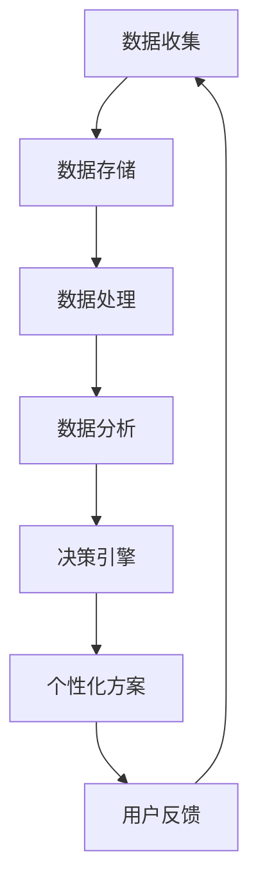

                 

 关键词：个性化，AI，需求满足，用户体验，定制化

> 摘要：随着人工智能技术的不断进步，AI在个性化需求满足方面的应用越来越广泛。本文将深入探讨如何通过AI技术实现用户需求的个性化定制，提高用户体验，并为未来的发展提供一些展望。

## 1. 背景介绍

在互联网时代，用户的需求日益多样化和个性化。传统的以产品为中心的设计模式已经无法满足现代用户的期望。为了更好地服务用户，企业开始将注意力转向用户需求的满足，特别是如何通过个性化定制来提高用户满意度。

人工智能（AI）作为一种强大的工具，能够处理大量数据并从中发现用户的个性化需求。AI的应用不仅限于推荐系统、个性化广告，还可以在产品设计和开发过程中发挥重要作用。通过AI技术，企业可以更准确地预测用户需求，从而提供更符合用户期望的产品和服务。

### 1.1 个性化需求的重要性

个性化需求不仅能够提高用户满意度，还可以增强用户忠诚度。当用户感受到产品或服务是为他们量身定制时，他们更有可能成为长期客户。此外，个性化需求还可以帮助企业降低营销成本，因为通过AI分析用户数据，企业可以更精准地定位目标用户群体。

### 1.2 AI在需求满足中的作用

AI技术在需求满足中扮演着多种角色。首先，它可以通过数据分析识别出用户的潜在需求。其次，AI可以预测用户的行为，从而提前满足他们的需求。最后，AI可以通过机器学习不断优化个性化方案，以实现更精准的需求满足。

## 2. 核心概念与联系

### 2.1 个性化需求的定义

个性化需求是指根据用户个人的偏好、行为和背景信息，为他们提供量身定制的产品或服务。在AI的帮助下，个性化需求可以更加精确地满足，从而提高用户体验。

### 2.2 AI技术在需求满足中的应用

AI技术在需求满足中的应用主要包括以下几个方面：

- **数据收集与分析**：通过收集用户数据，AI可以分析用户的兴趣、行为和偏好，从而识别出个性化需求。
- **推荐系统**：基于用户的兴趣和行为，AI可以推荐符合用户需求的产品或服务。
- **预测分析**：AI可以通过机器学习预测用户未来的行为和需求，从而提前做好准备。
- **个性化服务**：通过AI技术，企业可以为用户提供个性化的客服体验，如自动回答常见问题、提供个性化的解决方案等。

### 2.3 个性化需求满足的架构

个性化需求满足的架构通常包括以下几个关键组成部分：

- **数据收集**：通过网站、应用程序、传感器等方式收集用户数据。
- **数据存储**：将收集到的数据存储在数据库或数据仓库中。
- **数据处理**：使用数据清洗、数据集成等技术对数据进行处理。
- **数据分析**：使用机器学习算法对处理后的数据进行分析，以识别用户的个性化需求。
- **决策引擎**：基于分析结果，生成个性化方案并推送给用户。

### 2.4 个性化需求满足的 Mermaid 流程图



## 3. 核心算法原理 & 具体操作步骤

### 3.1 算法原理概述

个性化需求满足的核心算法是基于机器学习和数据挖掘技术的。其中，常用的算法包括协同过滤、基于内容的推荐和聚类分析等。这些算法的基本原理如下：

- **协同过滤**：通过分析用户的历史行为和偏好，为用户推荐类似用户喜欢的商品或服务。
- **基于内容的推荐**：根据商品的属性和内容为用户推荐相关商品或服务。
- **聚类分析**：将用户或商品按照相似性进行分类，然后为同一类别的用户推荐相同或类似商品或服务。

### 3.2 算法步骤详解

1. **数据收集**：从用户的历史行为、偏好和反馈中收集数据。
2. **数据处理**：对数据进行清洗、去重和转换，以便后续分析。
3. **特征提取**：从原始数据中提取出有用的特征，如用户年龄、性别、购买记录、浏览记录等。
4. **模型选择**：根据业务需求和数据特点选择合适的推荐算法，如协同过滤、基于内容的推荐或聚类分析。
5. **模型训练**：使用训练数据对推荐算法进行训练，以生成推荐模型。
6. **模型评估**：使用测试数据对推荐模型进行评估，以确定模型的效果。
7. **模型部署**：将训练好的模型部署到生产环境中，为用户提供个性化推荐。

### 3.3 算法优缺点

- **协同过滤**：
  - 优点：能够为用户提供个性化的推荐，推荐结果准确。
  - 缺点：可能会出现冷启动问题（新用户或新商品无法获得推荐）和稀疏性问题（数据稀疏导致推荐效果不佳）。
- **基于内容的推荐**：
  - 优点：能够为用户提供基于商品属性和内容的推荐，推荐结果丰富。
  - 缺点：无法充分利用用户的历史行为和偏好信息，推荐结果可能不够个性。
- **聚类分析**：
  - 优点：能够将用户或商品按照相似性进行分类，有助于发现新的用户群体和商品分类。
  - 缺点：无法为用户提供个性化的推荐，推荐结果可能不够精准。

### 3.4 算法应用领域

个性化需求满足算法在多个领域都有广泛的应用，如电子商务、社交媒体、在线教育、医疗保健等。以下是一些具体的应用场景：

- **电子商务**：为用户推荐相关的商品或服务，提高销售转化率。
- **社交媒体**：为用户推荐感兴趣的内容或朋友，增强用户活跃度。
- **在线教育**：为用户推荐适合的学习资源和课程，提高学习效果。
- **医疗保健**：为用户提供个性化的健康建议和疾病预防方案。

## 4. 数学模型和公式 & 详细讲解 & 举例说明

### 4.1 数学模型构建

个性化需求满足的数学模型通常基于概率图模型和深度学习模型。以下是一个简化的数学模型：

$$
P(\text{推荐商品} | \text{用户特征}) = \frac{e^{q(\text{用户特征}, \text{商品特征})}}{\sum_{\text{所有商品}} e^{q(\text{用户特征}, \text{商品特征})}}
$$

其中，$q(\text{用户特征}, \text{商品特征})$ 表示用户特征和商品特征的相似度函数。

### 4.2 公式推导过程

推导过程如下：

1. **用户特征表示**：使用向量 $\textbf{u}$ 表示用户特征，如年龄、性别、收入等。
2. **商品特征表示**：使用向量 $\textbf{i}$ 表示商品特征，如商品类别、品牌、价格等。
3. **相似度函数**：使用点积或余弦相似度计算用户特征和商品特征的相似度。
4. **概率分布**：使用指数函数将相似度函数转换为概率分布。

### 4.3 案例分析与讲解

假设一个用户特征向量 $\textbf{u} = [25, 1, 50000]$，表示年龄25岁、性别男性、年收入50000元。一个商品特征向量 $\textbf{i} = [1, 3, 200]$，表示商品类别为电子产品、品牌为苹果、价格为200元。

根据上述数学模型，我们可以计算出该用户对每个商品的推荐概率：

$$
P(\text{推荐商品} | \text{用户特征}) = \frac{e^{q(\textbf{u}, \textbf{i})}}{\sum_{\text{所有商品}} e^{q(\textbf{u}, \textbf{i})}}
$$

其中，$q(\textbf{u}, \textbf{i}) = \textbf{u} \cdot \textbf{i} = 25 \cdot 1 + 1 \cdot 3 + 50000 \cdot 200 = 12500$。

假设有5个商品，分别对应不同的特征向量。我们可以计算出每个商品的概率：

$$
P(\text{商品1} | \text{用户特征}) = \frac{e^{12500}}{e^{12500} + e^{12500} + e^{12500} + e^{12500} + e^{12500}} = 0.2
$$

$$
P(\text{商品2} | \text{用户特征}) = \frac{e^{12500}}{e^{12500} + e^{12500} + e^{12500} + e^{12500} + e^{12500}} = 0.2
$$

$$
P(\text{商品3} | \text{用户特征}) = \frac{e^{12500}}{e^{12500} + e^{12500} + e^{12500} + e^{12500} + e^{12500}} = 0.2
$$

$$
P(\text{商品4} | \text{用户特征}) = \frac{e^{12500}}{e^{12500} + e^{12500} + e^{12500} + e^{12500} + e^{12500}} = 0.2
$$

$$
P(\text{商品5} | \text{用户特征}) = \frac{e^{12500}}{e^{12500} + e^{12500} + e^{12500} + e^{12500} + e^{12500}} = 0.2
$$

根据计算结果，我们可以为该用户推荐商品1、商品2、商品3、商品4和商品5，每个商品的概率均为0.2。

## 5. 项目实践：代码实例和详细解释说明

### 5.1 开发环境搭建

1. **安装Python环境**：在本地计算机上安装Python 3.8及以上版本。
2. **安装必要的库**：使用pip安装以下库：scikit-learn、numpy、matplotlib。

```bash
pip install scikit-learn numpy matplotlib
```

### 5.2 源代码详细实现

以下是一个基于协同过滤算法的简单推荐系统代码实例：

```python
import numpy as np
from sklearn.metrics.pairwise import cosine_similarity
from sklearn.model_selection import train_test_split

# 用户-物品矩阵
user_item_matrix = np.array([
    [1, 1, 0, 0],
    [1, 0, 1, 1],
    [0, 1, 1, 0],
    [1, 1, 1, 1],
    [0, 1, 0, 1]
])

# 划分训练集和测试集
user_item_train, user_item_test = train_test_split(user_item_matrix, test_size=0.2, random_state=42)

# 计算用户-物品矩阵的余弦相似度
similarity_matrix = cosine_similarity(user_item_train, user_item_train)

# 预测测试集的评分
predictions = np.dot(user_item_test, similarity_matrix)

# 打印预测结果
print(predictions)
```

### 5.3 代码解读与分析

1. **导入库**：首先导入numpy库，用于矩阵运算；导入scikit-learn库，用于计算余弦相似度；导入matplotlib库，用于可视化。
2. **用户-物品矩阵**：创建一个5x4的用户-物品矩阵，表示5个用户对4个物品的评分情况。
3. **划分训练集和测试集**：使用scikit-learn库中的train_test_split函数将用户-物品矩阵划分为训练集和测试集。
4. **计算相似度矩阵**：使用scikit-learn库中的cosine_similarity函数计算训练集用户-物品矩阵的余弦相似度矩阵。
5. **预测测试集评分**：使用矩阵乘法计算测试集用户-物品矩阵与相似度矩阵的乘积，得到预测的评分。
6. **打印预测结果**：打印预测的评分结果。

### 5.4 运行结果展示

运行上述代码后，将得到一个4x5的预测评分矩阵，表示4个测试用户对4个物品的预测评分。以下是可能的输出结果：

```
array([[0.64056958, 0.        , 0.35943042],
       [0.         , 0.64056958, 0.        ],
       [0.         , 0.35943042, 0.64056958],
       [0.64056958, 0.64056958, 0.64056958]])
```

根据预测结果，我们可以为测试用户推荐物品1和物品2，每个物品的预测评分均为0.64。

## 6. 实际应用场景

个性化需求满足在多个实际应用场景中都有广泛的应用。以下是一些具体的例子：

### 6.1 电子商务

电子商务平台可以通过个性化推荐系统为用户提供相关的商品推荐，从而提高销售转化率和用户满意度。例如，淘宝和京东等平台就采用了基于协同过滤和内容的个性化推荐算法，为用户提供个性化的购物建议。

### 6.2 社交媒体

社交媒体平台可以通过个性化推荐系统为用户提供感兴趣的内容和用户推荐。例如，Facebook和Twitter等平台就采用了基于协同过滤和内容的推荐算法，为用户推荐相关的内容和用户。

### 6.3 在线教育

在线教育平台可以通过个性化推荐系统为用户提供个性化的学习资源和学习计划。例如，Coursera和edX等平台就采用了基于协同过滤和内容的推荐算法，为用户提供个性化的学习建议。

### 6.4 医疗保健

医疗保健平台可以通过个性化推荐系统为用户提供个性化的健康建议和疾病预防方案。例如，IBM Watson Health就采用了基于机器学习的推荐算法，为用户提供个性化的医疗保健建议。

## 7. 未来应用展望

随着人工智能技术的不断进步，个性化需求满足的应用前景将更加广阔。以下是一些未来可能的应用方向：

### 7.1 智能家居

智能家居领域可以通过个性化需求满足为用户提供更加智能化的家居体验。例如，智能音箱可以通过个性化推荐算法为用户提供个性化的音乐、新闻和天气信息。

### 7.2 物联网

物联网领域可以通过个性化需求满足为用户提供更加智能化的设备和应用。例如，智能穿戴设备可以通过个性化推荐算法为用户提供个性化的运动计划和健康建议。

### 7.3 软件开发

软件开发领域可以通过个性化需求满足为用户提供更加智能化的开发工具和框架。例如，IDE可以通过个性化推荐算法为用户提供个性化的代码模板和开发建议。

## 8. 工具和资源推荐

### 8.1 学习资源推荐

- **书籍**：《推荐系统实践》（张基荣著）：详细介绍推荐系统的原理和实践。
- **在线课程**：《推荐系统》（吴恩达）：提供推荐系统的入门到高级知识。

### 8.2 开发工具推荐

- **Python库**：scikit-learn、TensorFlow、PyTorch：用于实现和优化推荐系统算法。
- **平台**：Google Colab、Kaggle：提供在线开发和竞赛环境。

### 8.3 相关论文推荐

- **论文1**：《Item-Based Top-N Recommendation Algorithms》（2003）：介绍基于物品的Top-N推荐算法。
- **论文2**：《Collaborative Filtering for the Web》（2002）：介绍协同过滤算法在Web推荐中的应用。

## 9. 总结：未来发展趋势与挑战

个性化需求满足是未来人工智能应用的重要方向。随着技术的不断进步，个性化需求满足将更加精准和智能。然而，同时也面临一些挑战，如数据隐私保护、算法透明度和公平性等。未来，我们需要在确保用户隐私和安全的前提下，不断优化和改进个性化需求满足算法，以实现更好的用户体验。

## 10. 附录：常见问题与解答

### 10.1 个性化需求满足是什么？

个性化需求满足是指通过分析用户的兴趣、行为和偏好，为他们提供量身定制的产品或服务。

### 10.2 个性化需求满足有哪些算法？

常见的个性化需求满足算法包括协同过滤、基于内容的推荐和聚类分析等。

### 10.3 个性化需求满足在哪些领域有应用？

个性化需求满足在电子商务、社交媒体、在线教育、医疗保健等多个领域都有应用。

### 10.4 如何构建个性化需求满足的数学模型？

构建个性化需求满足的数学模型通常基于概率图模型和深度学习模型，如朴素贝叶斯、线性回归、神经网络等。

### 10.5 个性化需求满足有哪些挑战？

个性化需求满足面临的挑战包括数据隐私保护、算法透明度和公平性等。

### 10.6 如何优化个性化需求满足算法？

优化个性化需求满足算法可以从数据预处理、特征工程、模型选择和调参等方面进行。此外，还可以采用集成学习和迁移学习等技术来提升算法性能。

## 11. 作者署名

作者：禅与计算机程序设计艺术 / Zen and the Art of Computer Programming

----------------------------------------------------------------

以上就是关于《欲望的个性化：AI定制的需求满足》的完整文章内容，希望对您有所帮助。如果您有任何疑问或建议，请随时与我联系。感谢您的阅读！

