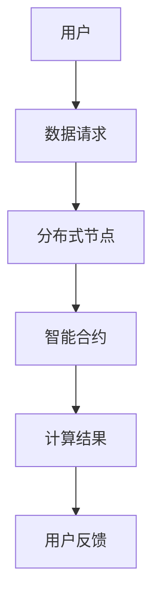

                 

关键词：去中心化、AI、个人自主权、隐私保护、智能合约、区块链

> 摘要：本文将探讨如何通过去中心化技术，特别是在人工智能（AI）领域，来实现个人自主权，并保护个人隐私。我们将分析AI系统在去中心化架构中的应用，以及如何通过智能合约和区块链技术来确保用户的权利和数据的透明度。

## 1. 背景介绍

在当今数字化时代，人工智能（AI）已经深刻地改变了我们的生活方式。从智能家居到自动驾驶，AI技术正逐渐融入各个领域。然而，随着AI技术的普及，个人隐私和数据安全问题也日益凸显。传统的集中式数据处理模式往往使得用户数据容易成为攻击目标，隐私泄露事件频发。因此，如何在保障个人自主权和隐私的前提下，充分利用AI技术成为了一个亟待解决的问题。

去中心化技术，尤其是区块链和智能合约，为解决这一问题提供了新的思路。通过去中心化架构，AI系统能够在无需依赖中心化机构的情况下，安全地处理和存储数据。这不仅增强了系统的抗攻击能力，也提升了个人数据的自主权。

## 2. 核心概念与联系

### 2.1. 去中心化

去中心化是指网络中没有单一的中央控制机构，而是通过分布式网络进行协同工作。在去中心化架构中，每个节点都拥有平等的权利和义务，网络的运行依赖于所有节点的共识和协作。

### 2.2. 智能合约

智能合约是一种在区块链上执行的计算机程序，它可以自动执行、控制或记录符合特定条件的交易或行为。智能合约通过代码来定义和执行合同条款，从而减少了人为干预和中介费用。

### 2.3. 区块链

区块链是一种去中心化的分布式账本技术，它通过加密算法和共识机制确保数据的不可篡改性和透明性。每个区块包含一定数量的交易记录，并通过加密方式链接在一起，形成一个链式结构。

### 2.4. Mermaid 流程图

以下是一个简化的 Mermaid 流程图，展示了去中心化架构中的关键组件：



### 2.5. 去中心化架构与AI系统的结合

去中心化架构与AI系统的结合，可以通过以下方式实现：

- **数据去中心化处理**：将AI模型训练和推理过程分布到多个节点，避免单点故障和数据泄露。
- **智能合约执行**：使用智能合约来自动执行数据处理和决策过程，提高效率和透明度。
- **区块链验证**：通过区块链技术验证数据的真实性和完整性，确保AI系统的可信性。

## 3. 核心算法原理 & 具体操作步骤

### 3.1. 算法原理概述

去中心化AI算法的核心在于分布式计算和共识机制。通过分布式计算，AI模型能够在多个节点上并行训练，提高计算效率和鲁棒性。共识机制则确保了节点间的数据一致性和安全性。

### 3.2. 算法步骤详解

1. **数据分发**：将训练数据分发到分布式节点，每个节点负责处理一部分数据。
2. **模型训练**：在每个节点上独立训练AI模型，并将训练结果发送到中心节点。
3. **模型融合**：中心节点将各个节点的模型结果进行融合，得到最终的训练模型。
4. **决策执行**：使用智能合约自动执行模型决策，并记录在区块链上。

### 3.3. 算法优缺点

**优点**：

- **高鲁棒性**：分布式计算提高了系统的抗攻击能力和容错性。
- **数据隐私**：去中心化架构确保了用户数据的安全和隐私。
- **高效性**：并行计算提高了模型的训练和推理效率。

**缺点**：

- **计算资源**：分布式计算需要大量的计算资源，成本较高。
- **网络延迟**：节点间的通信可能产生延迟，影响系统的响应速度。

### 3.4. 算法应用领域

去中心化AI算法适用于以下领域：

- **隐私保护**：在需要保护用户隐私的领域，如医疗数据分析和金融风控。
- **供应链管理**：通过去中心化AI算法监控和优化供应链流程。
- **智能合约执行**：利用去中心化AI算法优化智能合约的执行过程。

## 4. 数学模型和公式 & 详细讲解 & 举例说明

### 4.1. 数学模型构建

去中心化AI系统的数学模型主要涉及分布式计算和共识机制。以下是一个简化的数学模型：

- **分布式计算**：$f_i(x) = \frac{1}{N}\sum_{j=1}^{N} w_{ij} \cdot x_j$
- **模型融合**：$w = \frac{1}{N}\sum_{i=1}^{N} f_i(x)$
- **共识机制**：$s = \frac{1}{N}\sum_{i=1}^{N} w_i$

### 4.2. 公式推导过程

- **分布式计算**：每个节点 $i$ 对数据进行局部处理，计算局部模型 $f_i(x)$。
- **模型融合**：中心节点将各个节点的模型 $f_i(x)$ 进行融合，得到全局模型 $w$。
- **共识机制**：通过共识机制确保全局模型 $w$ 与局部模型 $f_i(x)$ 的一致性。

### 4.3. 案例分析与讲解

假设有一个去中心化图像识别系统，包含 $N$ 个节点。每个节点对输入图像进行局部处理，得到局部模型 $f_i(x)$。通过模型融合和共识机制，最终得到全局模型 $w$，用于图像识别。

$$
\begin{aligned}
f_i(x) &= \text{局部图像处理模型} \\
w &= \frac{1}{N}\sum_{i=1}^{N} f_i(x) \\
s &= \frac{1}{N}\sum_{i=1}^{N} w_i
\end{aligned}
$$

通过不断迭代模型融合和共识机制，图像识别系统的准确率逐渐提高。

## 5. 项目实践：代码实例和详细解释说明

### 5.1. 开发环境搭建

在开始项目实践之前，需要搭建一个去中心化AI系统的开发环境。主要包括以下步骤：

1. 安装区块链平台，如Ethereum。
2. 安装Python环境，并安装相关依赖库，如Web3.py、TensorFlow。
3. 配置节点，启动区块链网络。

### 5.2. 源代码详细实现

以下是一个简单的去中心化图像识别系统的Python代码示例：

```python
from web3 import Web3
from tensorflow import keras
import json

# 连接区块链节点
w3 = Web3(Web3.HTTPProvider('http://localhost:8545'))

# 加载智能合约
with open('contract.json', 'r') as f:
    contract_json = json.load(f)
contract = w3.eth.contract(address=contract_address, abi=contract_json['abi'])

# 加载预训练模型
model = keras.models.load_model('model.h5')

# 处理图像数据
def preprocess_image(image_path):
    # 加载图像数据并进行预处理
    pass

# 图像识别
def recognize_image(image_path):
    # 使用模型进行图像识别
    processed_image = preprocess_image(image_path)
    prediction = model.predict(processed_image)
    return prediction

# 执行智能合约
def execute_contract(image_path):
    image_data = preprocess_image(image_path)
    tx_hash = contract.functions识别图像(image_data).transact()
    return tx_hash

# 运行示例
image_path = 'path/to/image.jpg'
prediction = recognize_image(image_path)
print(prediction)
tx_hash = execute_contract(image_path)
print(tx_hash)
```

### 5.3. 代码解读与分析

该示例代码展示了如何搭建一个去中心化图像识别系统。主要包括以下步骤：

1. **连接区块链节点**：使用Web3.py库连接到本地区块链节点。
2. **加载智能合约**：加载预编译的智能合约，用于图像识别功能。
3. **加载预训练模型**：加载TensorFlow预训练的图像识别模型。
4. **处理图像数据**：对输入图像进行预处理，使其符合模型输入要求。
5. **图像识别**：使用模型对预处理后的图像进行识别，并返回预测结果。
6. **执行智能合约**：调用智能合约函数，将图像识别结果记录在区块链上。

### 5.4. 运行结果展示

运行示例代码后，程序将输出图像识别结果和智能合约交易哈希值，用于验证图像识别过程和智能合约执行结果。

## 6. 实际应用场景

去中心化AI技术在实际应用中具有广泛的前景，以下是一些典型的应用场景：

- **医疗领域**：利用去中心化AI技术，可以在保护患者隐私的前提下，进行大规模的医疗数据分析和研究。
- **金融领域**：通过去中心化AI技术，可以提高金融风控系统的效率和准确性，同时保护用户的隐私。
- **智能合约执行**：利用去中心化AI技术，可以优化智能合约的执行过程，提高交易效率和透明度。

### 6.4. 未来应用展望

随着去中心化技术的不断发展和成熟，AI与去中心化技术的结合将有望在更多领域得到应用。未来，我们可以期待以下发展趋势：

- **更加高效的去中心化计算**：通过优化分布式计算和共识机制，提高去中心化AI系统的计算效率和性能。
- **跨链互操作**：实现不同区块链之间的数据共享和互操作，构建更加开放和互联的去中心化生态系统。
- **隐私保护增强**：通过引入更先进的加密和匿名化技术，进一步提升个人数据的隐私保护水平。

## 7. 工具和资源推荐

### 7.1. 学习资源推荐

- **区块链教程**：《区块链技术指南》
- **智能合约开发**：《智能合约开发与实战》
- **Python编程**：《Python编程：从入门到实践》

### 7.2. 开发工具推荐

- **区块链平台**：Ethereum、Hyperledger Fabric
- **Python库**：Web3.py、TensorFlow

### 7.3. 相关论文推荐

- **去中心化AI**：《Decentralized Machine Learning: A Survey》
- **区块链与AI结合**：《Blockchain-Assisted Machine Learning: Opportunities and Challenges》

## 8. 总结：未来发展趋势与挑战

### 8.1. 研究成果总结

本文介绍了去中心化技术在AI领域的应用，探讨了如何通过分布式计算和共识机制来实现个人自主权和数据隐私保护。通过实际案例和实践，展示了去中心化AI系统的构建方法和应用前景。

### 8.2. 未来发展趋势

随着去中心化技术和AI技术的不断进步，未来去中心化AI将在更多领域得到应用，实现更加高效和安全的计算和决策过程。跨链互操作和数据共享将成为研究的重要方向。

### 8.3. 面临的挑战

尽管去中心化AI技术具有巨大的潜力，但在实际应用中仍面临一系列挑战，包括计算资源消耗、网络延迟、安全性等。解决这些挑战需要持续的技术创新和优化。

### 8.4. 研究展望

未来的研究应重点关注以下几个方面：

- **优化分布式计算和共识机制**：提高计算效率和安全性。
- **跨链互操作**：实现不同区块链之间的数据共享和互操作。
- **隐私保护**：引入更先进的加密和匿名化技术，提高数据隐私保护水平。

## 9. 附录：常见问题与解答

### 9.1. 去中心化AI的优势是什么？

去中心化AI的优势主要包括：

- **数据隐私保护**：通过分布式计算和区块链技术，确保用户数据的安全和隐私。
- **高鲁棒性**：分布式计算提高了系统的抗攻击能力和容错性。
- **高效性**：并行计算提高了模型的训练和推理效率。

### 9.2. 去中心化AI如何实现数据隐私保护？

去中心化AI通过以下方式实现数据隐私保护：

- **分布式计算**：将数据处理和存储分散到多个节点，避免单点故障和数据泄露。
- **区块链验证**：通过区块链技术确保数据的真实性和完整性。
- **加密技术**：使用加密算法对数据进行加密，防止未经授权的访问。

### 9.3. 去中心化AI的常见挑战有哪些？

去中心化AI的常见挑战包括：

- **计算资源消耗**：分布式计算需要大量的计算资源，成本较高。
- **网络延迟**：节点间的通信可能产生延迟，影响系统的响应速度。
- **安全性**：分布式系统可能面临更多的攻击和风险。

### 9.4. 去中心化AI的应用领域有哪些？

去中心化AI的应用领域包括：

- **医疗领域**：医疗数据分析和研究。
- **金融领域**：金融风控和交易优化。
- **供应链管理**：监控和优化供应链流程。
- **智能合约执行**：优化智能合约的执行过程。

### 9.5. 如何搭建一个去中心化AI系统？

搭建一个去中心化AI系统主要包括以下步骤：

- **搭建区块链平台**：选择合适的区块链平台，如Ethereum。
- **开发智能合约**：编写智能合约代码，实现数据处理和决策功能。
- **训练AI模型**：使用现有的AI框架，如TensorFlow，训练AI模型。
- **集成和部署**：将智能合约和AI模型集成到系统中，并进行部署。

通过上述步骤，可以搭建一个基本的去中心化AI系统。但需要注意的是，实际应用中可能需要根据具体需求进行定制化和优化。

---

**作者：禅与计算机程序设计艺术 / Zen and the Art of Computer Programming**

