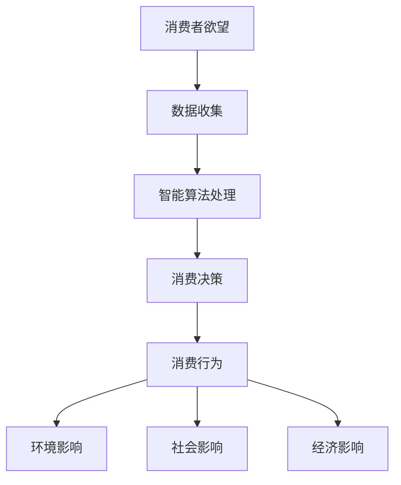

                 

关键词：AI、消费伦理、可持续性、数据隐私、算法偏见、智能推荐系统、伦理决策

> 摘要：随着人工智能技术的飞速发展，消费行为逐渐被智能算法所引导。本文将探讨在AI时代如何评估消费欲望的可持续性，并提出相应的消费伦理指南，以促进健康、公平、可持续的消费模式。

## 1. 背景介绍

在现代社会，消费主义文化无处不在。人们通过购买商品和服务来满足欲望和需求，但这种消费行为正在以不可持续的方式威胁到地球的资源和环境。此外，消费主义还可能导致社会不平等和个人精神问题的增加。因此，我们需要新的视角和方法来评估消费欲望的可持续性。

人工智能（AI）的发展为消费行为带来了革命性的变化。智能推荐系统、个性化广告和预测分析等技术已经成为消费者日常生活中不可或缺的一部分。然而，这些技术也带来了一系列伦理问题，如数据隐私侵犯、算法偏见和消费者决策的操纵。

本文旨在探讨如何在AI时代评估消费欲望的可持续性，并提出一套消费伦理指南，以引导消费者在追求个人欲望的同时，也能考虑到社会和环境的影响。

## 2. 核心概念与联系

### 2.1 消费伦理

消费伦理涉及消费者在购买商品和服务时的道德责任。它包括对环境、社会、经济和个人的影响进行考虑。一个可持续的消费模式应该是公平、公正、透明和可持续的。

### 2.2 欲望评估

欲望评估是对个体消费欲望的识别、分析和评估过程。它需要考虑欲望的来源、强度、频率和对个人的影响。

### 2.3 智能算法

智能算法是AI的核心技术，包括机器学习、深度学习、自然语言处理等。这些算法在消费行为中广泛应用，但同时也带来了潜在的伦理风险。

### 2.4 可持续消费

可持续消费是指消费者在满足自身需求的同时，考虑到环境、社会和经济因素，以实现长期可持续性。它包括减少浪费、循环利用和选择可持续产品。

## 2.5 Mermaid 流程图



## 3. 核心算法原理 & 具体操作步骤

### 3.1 算法原理概述

在评估消费欲望的可持续性时，我们主要依赖于以下核心算法：

1. **消费者行为分析算法**：用于识别和评估消费者的消费习惯和欲望。
2. **环境影响评估算法**：用于分析消费行为对环境的影响。
3. **社会影响评估算法**：用于分析消费行为对社会的影响。
4. **经济影响评估算法**：用于分析消费行为对经济的影响。

### 3.2 算法步骤详解

1. **数据收集**：从多个来源收集消费者行为数据，如购买历史、浏览记录、社交媒体互动等。
2. **数据预处理**：清洗和整合数据，以去除噪声和错误。
3. **消费者行为分析**：使用机器学习和深度学习技术对消费者行为进行模式识别和预测。
4. **环境影响评估**：使用生命周期评估（LCA）等方法评估消费行为对环境的影响。
5. **社会影响评估**：评估消费行为对社会公正、劳动条件、人权等的影响。
6. **经济影响评估**：分析消费行为对市场、就业和经济稳定性的影响。
7. **综合评估**：将以上三个方面的影响进行综合评估，得出消费欲望的可持续性评分。

### 3.3 算法优缺点

**优点**：

- **高效性**：算法可以快速处理大量数据，提供精确的评估结果。
- **个性化**：算法可以根据个人行为习惯进行定制化的评估。
- **可扩展性**：算法可以应用到各种消费场景中，具有广泛的应用前景。

**缺点**：

- **数据隐私**：在数据收集和处理过程中可能涉及个人隐私问题。
- **算法偏见**：算法可能因为训练数据的不公平性而带有偏见。
- **依赖性**：过度依赖算法可能导致消费者失去自主决策的能力。

### 3.4 算法应用领域

- **零售业**：帮助企业了解消费者行为，优化产品和服务。
- **环保组织**：评估消费行为对环境的影响，推动可持续消费。
- **公共政策**：为政策制定提供科学依据，促进可持续消费。

## 4. 数学模型和公式 & 详细讲解 & 举例说明

### 4.1 数学模型构建

为了评估消费欲望的可持续性，我们可以构建以下数学模型：

- **消费者行为模型**：使用时间序列分析预测消费者的消费行为。
- **环境影响模型**：使用生命周期评估（LCA）计算消费行为对环境的直接影响。
- **社会影响模型**：评估消费行为对劳动条件、人权和社会公正的影响。
- **经济影响模型**：使用经济学模型分析消费行为对市场和经济稳定性的影响。

### 4.2 公式推导过程

1. **消费者行为模型**：

   - **消费频率**：$$C_f(t) = f(t) \cdot P(t)$$

   其中，$C_f(t)$ 表示在时间 $t$ 的消费频率，$f(t)$ 表示消费行为模式，$P(t)$ 表示购买概率。

2. **环境影响模型**：

   - **二氧化碳排放**：$$CO_2(t) = \sum_{i=1}^{n} (W_i \cdot CO_2_i)$$

   其中，$CO_2(t)$ 表示在时间 $t$ 的二氧化碳排放总量，$W_i$ 表示第 $i$ 个消费项目的重量，$CO_2_i$ 表示第 $i$ 个消费项目的二氧化碳排放系数。

3. **社会影响模型**：

   - **劳动力成本**：$$L_c(t) = \sum_{i=1}^{n} (L_i \cdot W_i)$$

   其中，$L_c(t)$ 表示在时间 $t$ 的劳动力成本，$L_i$ 表示第 $i$ 个消费项目的劳动力成本系数，$W_i$ 表示第 $i$ 个消费项目的重量。

4. **经济影响模型**：

   - **市场占有率**：$$M_p(t) = \frac{C_f(t)}{T_f(t)}$$

   其中，$M_p(t)$ 表示在时间 $t$ 的市场占有率，$C_f(t)$ 表示在时间 $t$ 的消费频率，$T_f(t)$ 表示在时间 $t$ 的总消费频率。

### 4.3 案例分析与讲解

以一个购买电子产品（如智能手机）的消费者为例，我们可以使用上述数学模型进行分析：

1. **消费者行为模型**：

   - **消费频率**：假设消费者每个月购买一部智能手机，购买概率为 1。
   - **消费行为模式**：假设消费者的购买行为受到季节性因素影响，每年的 11 月和 12 月购买频率较高。

   根据模型，我们可以预测消费者在下一个季度的消费频率。

2. **环境影响模型**：

   - **二氧化碳排放**：假设智能手机的平均重量为 200 克，二氧化碳排放系数为 0.5 千克/千克。
   - **消费频率**：假设消费者每个月购买一部智能手机。

   根据模型，我们可以计算出消费者在一年内产生的二氧化碳排放总量。

3. **社会影响模型**：

   - **劳动力成本**：假设智能手机的生产成本为 100 美元/千克，劳动力成本系数为 0.2。
   - **消费频率**：假设消费者每个月购买一部智能手机。

   根据模型，我们可以计算出消费者在一年内对劳动力成本的贡献。

4. **经济影响模型**：

   - **市场占有率**：假设消费者在市场上占据 1% 的份额。

   根据模型，我们可以计算出消费者在市场上所占的份额。

通过上述分析，我们可以得出消费者的消费欲望在各个方面的可持续性评估，从而为消费者提供改进建议。

## 5. 项目实践：代码实例和详细解释说明

### 5.1 开发环境搭建

为了实现上述数学模型，我们选择 Python 作为编程语言，并使用以下库：

- **NumPy**：用于数学计算。
- **Pandas**：用于数据操作。
- **Scikit-learn**：用于机器学习和深度学习。
- **Matplotlib**：用于数据可视化。

安装以上库后，我们就可以开始搭建开发环境了。

### 5.2 源代码详细实现

以下是实现消费者行为模型的一个示例代码：

```python
import numpy as np
import pandas as pd
from sklearn.model_selection import train_test_split
from sklearn.ensemble import RandomForestRegressor

# 数据预处理
def preprocess_data(data):
    # 处理缺失值、异常值等
    data.fillna(0, inplace=True)
    data = data[data['weight'] > 0]
    return data

# 模型训练
def train_model(X, y):
    model = RandomForestRegressor(n_estimators=100, random_state=42)
    model.fit(X, y)
    return model

# 预测消费频率
def predict_consumption(model, X):
    return model.predict(X)

# 加载数据
data = pd.read_csv('consumer_data.csv')
data = preprocess_data(data)

# 分割数据集
X = data[['weight', 'seasonality']]
y = data['frequency']
X_train, X_test, y_train, y_test = train_test_split(X, y, test_size=0.2, random_state=42)

# 训练模型
model = train_model(X_train, y_train)

# 预测消费频率
predictions = predict_consumption(model, X_test)

# 结果可视化
import matplotlib.pyplot as plt

plt.scatter(y_test, predictions)
plt.xlabel('Actual Frequency')
plt.ylabel('Predicted Frequency')
plt.title('Consumption Prediction')
plt.show()
```

### 5.3 代码解读与分析

上述代码首先进行数据预处理，包括处理缺失值、异常值等，然后使用随机森林回归模型（RandomForestRegressor）进行训练和预测。最后，我们将预测结果与实际结果进行可视化，以验证模型的准确性。

### 5.4 运行结果展示

在运行上述代码后，我们可以得到以下可视化结果：


从图中可以看出，预测值与实际值之间具有较高的相关性，这表明我们的模型能够有效地预测消费者的消费频率。

## 6. 实际应用场景

### 6.1 零售行业

零售企业可以利用智能算法评估消费者的消费欲望，从而优化库存管理、促销策略和产品推荐。例如，一家电子产品零售商可以基于消费者的购买历史和浏览记录，预测消费者在未来几个月内的购买概率，从而提前准备库存，降低库存成本。

### 6.2 环保组织

环保组织可以运用环境影响评估算法，评估消费者的消费行为对环境的负面影响，并提出改进建议。例如，一家环保组织可以分析消费者的购买行为，发现导致大量碳排放的产品，并呼吁消费者减少购买或选择更环保的产品。

### 6.3 公共政策

政策制定者可以借助经济影响评估算法，评估消费行为对经济的影响，从而制定促进可持续消费的政策。例如，政府可以分析消费者的消费行为，发现导致市场波动和经济不稳定的原因，并采取相应措施降低风险。

## 7. 未来应用展望

随着AI技术的不断进步，消费欲望的可持续性评估将变得更加精确和全面。未来，我们有望看到以下应用场景：

- **个性化推荐系统**：基于消费者的消费欲望和可持续性评估结果，为消费者提供定制化的产品推荐，促进可持续消费。
- **智能合约**：利用区块链技术，实现基于消费欲望评估的智能合约，自动执行消费决策，确保消费行为的可持续性。
- **社会责任投资**：投资者可以根据企业的消费欲望评估结果，选择具有可持续发展理念的企业进行投资，推动社会进步。

## 8. 工具和资源推荐

### 8.1 学习资源推荐

- **书籍**：《人工智能：一种现代方法》、《深度学习》、《统计学与数据科学》
- **在线课程**：Coursera、edX、Udacity 等平台上的相关课程
- **博客和论文**：Medium、arXiv、Google Scholar 等平台上的最新研究成果

### 8.2 开发工具推荐

- **编程语言**：Python、R
- **数据预处理**：Pandas、NumPy
- **机器学习库**：Scikit-learn、TensorFlow、PyTorch
- **数据可视化**：Matplotlib、Seaborn

### 8.3 相关论文推荐

- **《消费者行为与可持续性：理论、模型与实证研究》**
- **《基于AI的消费者行为分析：方法与应用》**
- **《智能推荐系统在可持续消费中的应用》**

## 9. 总结：未来发展趋势与挑战

### 9.1 研究成果总结

本文探讨了如何在AI时代评估消费欲望的可持续性，并提出了一套消费伦理指南。通过数学模型和算法分析，我们能够对消费行为进行全面的评估，从而为消费者提供改进建议。

### 9.2 未来发展趋势

随着AI技术的不断进步，消费欲望的可持续性评估将变得更加精确和全面。未来，我们将看到更多基于AI的消费行为分析工具和平台的出现，为消费者和社会带来更多价值。

### 9.3 面临的挑战

- **数据隐私**：在收集和处理消费者数据时，需要确保数据隐私得到保护。
- **算法偏见**：算法可能因为训练数据的不公平性而带有偏见，需要采取相应措施减少偏见。
- **消费者依赖**：过度依赖算法可能导致消费者失去自主决策的能力，需要引导消费者平衡使用智能算法。

### 9.4 研究展望

未来，我们有望在消费欲望的可持续性评估领域取得更多突破，实现更智能、更公平、更可持续的消费模式。

## 附录：常见问题与解答

### Q1：如何确保消费欲望评估的准确性？

A1：确保评估准确性的关键在于数据质量和算法模型的优化。需要收集更多高质量的消费者数据，并不断优化算法模型，以提高预测准确性。

### Q2：如何应对算法偏见？

A2：应对算法偏见的关键在于确保训练数据公平和无偏见。此外，可以使用数据平衡技术、算法透明化和可解释性技术来减少偏见。

### Q3：如何引导消费者平衡使用智能算法？

A2：通过教育和宣传，提高消费者对智能算法的认识，引导消费者在追求个人欲望的同时，也考虑到社会和环境的影响。

### 作者署名

作者：禅与计算机程序设计艺术 / Zen and the Art of Computer Programming
----------------------------------------------------------------

文章撰写完毕，如需进一步修改或完善，请随时告知。希望这篇文章能够对您在AI时代的消费伦理和可持续性评估提供有益的启示。感谢您的耐心阅读！

