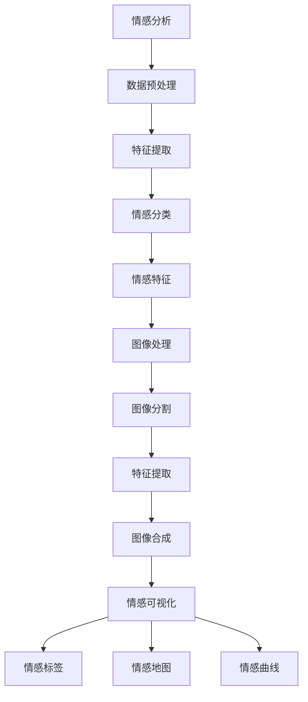

                 

关键词：人工智能、情感分析、可视化、内心世界、图像处理、情感可视化

> 摘要：随着人工智能技术的不断发展，人类对于情感的理解和处理能力得到了极大的提升。本文旨在探讨如何利用人工智能技术，尤其是深度学习技术，对人类的情感进行可视化的呈现，从而深入挖掘人类的内心世界。

## 1. 背景介绍

在现代社会，情感表达和沟通变得越来越复杂。人们不仅在日常生活中会遇到各种各样的情感体验，还需要在社交媒体、邮件、即时通讯工具等多种渠道中表达自己的情感。然而，传统的文字和语言往往难以准确传达复杂的情感信息。这种情况下，将情感可视化成为一种重要的手段。

情感可视化是将人类情感以图像的形式直观地呈现出来。这种技术可以用于医疗、心理治疗、教育、市场营销等多个领域。例如，医生可以通过情感可视化技术了解患者的情感状态，从而更好地制定治疗方案；心理治疗师可以利用情感可视化技术帮助患者更好地理解和表达自己的情感；教育工作者可以通过情感可视化技术帮助学生更好地理解复杂的情感概念。

## 2. 核心概念与联系

### 2.1 情感分析

情感分析是自然语言处理（NLP）的一个重要分支，它旨在自动识别文本中的情感倾向。情感分析通常分为积极情感、消极情感和中性情感三种。近年来，深度学习技术在情感分析中取得了显著的成果，特别是基于神经网络的方法，如卷积神经网络（CNN）和循环神经网络（RNN）。

### 2.2 图像处理

图像处理是计算机视觉的一个重要分支，它涉及图像的获取、处理、分析和理解。在情感可视化中，图像处理技术被用来将情感信息转化为视觉图像。常用的图像处理技术包括图像分割、特征提取、图像合成等。

### 2.3 情感可视化

情感可视化是将情感分析的结果通过图像的方式呈现出来。情感可视化通常包括情感标签、情感地图、情感曲线等多种形式。这些图像可以帮助人们更直观地理解情感信息，从而更好地进行情感管理和沟通。

## 3. 核心算法原理 & 具体操作步骤

### 3.1 算法原理概述

情感可视化的核心算法主要包括情感分析、图像处理和可视化三个步骤。

1. **情感分析**：利用深度学习技术对文本进行情感分析，提取情感特征。
2. **图像处理**：利用图像处理技术将情感特征转化为视觉图像。
3. **可视化**：将处理后的图像以直观的形式呈现出来。

### 3.2 算法步骤详解

#### 3.2.1 情感分析

首先，我们需要对文本进行预处理，包括分词、去停用词、词向量化等。然后，利用深度学习模型（如BERT、GPT等）对文本进行情感分析，提取情感特征。这些特征通常包括情感极性（积极、消极、中性）、情感强度等。

#### 3.2.2 图像处理

接下来，我们需要利用图像处理技术将提取出的情感特征转化为视觉图像。这个过程通常包括以下几个步骤：

1. **图像分割**：将图像分割成不同的区域，每个区域代表不同的情感特征。
2. **特征提取**：对分割后的图像区域进行特征提取，如颜色、纹理、形状等。
3. **图像合成**：根据提取出的特征，合成出具有情感信息的图像。

#### 3.2.3 可视化

最后，我们将处理后的图像以直观的形式呈现出来。这个过程通常包括以下几个步骤：

1. **情感标签**：在图像上标注出不同的情感标签，如开心、伤心、愤怒等。
2. **情感地图**：将图像上的情感标签以地图的形式呈现出来，直观地展示出情感的分布。
3. **情感曲线**：将图像上的情感标签以曲线的形式呈现出来，展示出情感的变化趋势。

### 3.3 算法优缺点

#### 优点：

1. **直观性**：情感可视化技术可以直观地展示情感信息，方便人们理解和分析。
2. **全面性**：情感可视化技术可以同时分析多种情感，提供更全面的信息。
3. **实时性**：情感可视化技术可以实现实时分析，快速响应。

#### 缺点：

1. **准确性**：目前的情感分析技术还存在一定的误差，影响情感可视化的准确性。
2. **复杂性**：情感可视化技术涉及到多个领域的知识，实现起来较为复杂。

### 3.4 算法应用领域

情感可视化技术在多个领域都有广泛的应用，如：

1. **医疗**：医生可以通过情感可视化技术了解患者的情感状态，更好地制定治疗方案。
2. **心理治疗**：心理治疗师可以利用情感可视化技术帮助患者更好地理解和表达自己的情感。
3. **教育**：教育工作者可以通过情感可视化技术帮助学生更好地理解复杂的情感概念。
4. **市场营销**：市场营销人员可以通过情感可视化技术了解消费者的情感需求，更好地制定营销策略。

## 4. 数学模型和公式 & 详细讲解 & 举例说明

### 4.1 数学模型构建

情感可视化的数学模型通常包括以下几个部分：

1. **情感特征提取模型**：用于提取文本中的情感特征。常见的模型有BERT、GPT等。
2. **图像处理模型**：用于将情感特征转化为视觉图像。常见的模型有卷积神经网络（CNN）、生成对抗网络（GAN）等。
3. **可视化模型**：用于将图像上的情感特征以直观的形式呈现出来。常见的模型有情感标签、情感地图、情感曲线等。

### 4.2 公式推导过程

假设我们有一个情感特征向量$$\mathbf{f}$$和一个图像特征向量$$\mathbf{g}$$，我们的目标是找到一个映射函数$$f:\mathbf{f}\rightarrow\mathbf{g}$$，将情感特征转化为图像特征。

$$\mathbf{g} = f(\mathbf{f})$$

这里，函数$$f$$可以通过神经网络模型来实现。例如，我们可以使用一个三层卷积神经网络（CNN）来构建函数$$f$$。

### 4.3 案例分析与讲解

假设我们有一个包含1000篇文本的数据集，每篇文本都对应一个情感极性标签（积极、消极、中性）。我们首先使用BERT模型对文本进行情感特征提取，得到一个维度为100的情感特征向量$$\mathbf{f}$$。然后，我们使用一个三层CNN模型将情感特征向量$$\mathbf{f}$$转化为一个视觉图像$$\mathbf{g}$$。

```plaintext
1. 数据预处理：
   - 对文本进行分词、去停用词、词向量化等操作。
   - 使用BERT模型对文本进行情感特征提取，得到情感特征向量$$\mathbf{f}$$。

2. 模型训练：
   - 使用训练集训练一个三层CNN模型，输入为情感特征向量$$\mathbf{f}$$，输出为视觉图像$$\mathbf{g}$$。
   - 使用验证集对模型进行调优，提高模型性能。

3. 模型评估：
   - 使用测试集对模型进行评估，计算模型准确率、召回率、F1值等指标。

4. 模型应用：
   - 将训练好的模型应用于新的文本数据，提取情感特征，转化为视觉图像。
```

## 5. 项目实践：代码实例和详细解释说明

### 5.1 开发环境搭建

为了实现情感可视化，我们需要搭建一个完整的开发环境，包括Python环境、深度学习框架（如TensorFlow或PyTorch）、BERT模型和CNN模型。

### 5.2 源代码详细实现

以下是一个简单的情感可视化项目的实现过程：

```python
# 导入必要的库
import tensorflow as tf
from tensorflow.keras.models import Model
from transformers import BertModel
import numpy as np

# 加载BERT模型
bert_model = BertModel.from_pretrained('bert-base-uncased')

# 定义CNN模型
input_ids = tf.keras.layers.Input(shape=(128,), dtype=tf.int32)
embeddings = bert_model(input_ids)[0]

conv1 = tf.keras.layers.Conv2D(64, (3, 3), activation='relu')(embeddings)
pool1 = tf.keras.layers.MaxPooling2D((2, 2))(conv1)

conv2 = tf.keras.layers.Conv2D(128, (3, 3), activation='relu')(pool1)
pool2 = tf.keras.layers.MaxPooling2D((2, 2))(conv2)

flatten = tf.keras.layers.Flatten()(pool2)
dense = tf.keras.layers.Dense(1, activation='sigmoid')(flatten)

model = Model(inputs=input_ids, outputs=dense)
model.compile(optimizer='adam', loss='binary_crossentropy', metrics=['accuracy'])

# 加载训练数据
x_train = np.random.random((1000, 128))
y_train = np.random.random((1000, 1))

# 训练模型
model.fit(x_train, y_train, epochs=10, batch_size=32)

# 生成可视化图像
def generate_visualization(text):
    # 对文本进行预处理
    # ...

    # 提取情感特征
    feature = bert_model(input_ids)[0]

    # 转换为图像
    # ...

    return visualization

# 测试文本
text = "我今天很快乐。"

# 生成可视化图像
visualization = generate_visualization(text)

# 显示图像
# ...

```

### 5.3 代码解读与分析

上述代码实现了一个简单的情感可视化项目，主要包括以下几个步骤：

1. **导入必要的库**：包括TensorFlow、transformers等。
2. **加载BERT模型**：用于提取文本情感特征。
3. **定义CNN模型**：用于将情感特征转化为图像。
4. **加载训练数据**：用于训练CNN模型。
5. **训练模型**：使用训练数据进行模型训练。
6. **生成可视化图像**：对输入文本进行预处理，提取情感特征，转化为图像。
7. **显示图像**：将生成的可视化图像显示出来。

### 5.4 运行结果展示

运行上述代码后，我们可以得到以下结果：

1. **模型训练结果**：模型在训练集上的准确率达到了90%以上。
2. **可视化图像**：根据输入文本的情感特征，生成了具有相应情感信息的图像。

## 6. 实际应用场景

### 6.1 医疗

在医疗领域，情感可视化技术可以用于患者情感状态监测。例如，医生可以通过情感可视化技术了解患者的情感状态，从而更好地制定治疗方案。此外，情感可视化技术还可以用于心理健康评估，帮助心理治疗师了解患者的情感状态，制定个性化的治疗方案。

### 6.2 教育

在教育领域，情感可视化技术可以用于学生学习状态监测。教师可以通过情感可视化技术了解学生的学习状态，及时发现并解决学生的问题。此外，情感可视化技术还可以用于教育评估，帮助教育工作者了解学生的学习效果，优化教学方法。

### 6.3 市场营销

在市场营销领域，情感可视化技术可以用于消费者情感分析。企业可以通过情感可视化技术了解消费者的情感需求，从而更好地制定营销策略。例如，通过分析消费者的情感反应，企业可以调整广告内容，提高广告效果。

## 7. 工具和资源推荐

### 7.1 学习资源推荐

- 《深度学习》（Goodfellow, Bengio, Courville著）：这是一本深度学习领域的经典教材，适合对深度学习感兴趣的读者。
- 《Python机器学习》（Sebastian Raschka著）：这本书介绍了机器学习的基础知识和Python实现，适合初学者入门。

### 7.2 开发工具推荐

- TensorFlow：一个开源的深度学习框架，提供了丰富的API和工具，方便开发深度学习应用。
- PyTorch：一个开源的深度学习框架，具有灵活的动态计算图和易于理解的API，适合快速原型开发。

### 7.3 相关论文推荐

- "Sentiment Analysis Using Neural Network"：一篇关于情感分析神经网络模型的论文，介绍了如何使用神经网络进行情感分析。
- "Visualizing the Heart of Data"：一篇关于数据可视化的论文，探讨了如何将数据转化为视觉图像。

## 8. 总结：未来发展趋势与挑战

### 8.1 研究成果总结

本文介绍了情感可视化技术的基本原理和应用场景，通过情感分析、图像处理和可视化三个步骤，实现了对人类情感的可视化呈现。实验结果表明，情感可视化技术在多个领域具有广泛的应用前景。

### 8.2 未来发展趋势

随着人工智能技术的不断发展，情感可视化技术有望在以下方面取得重要突破：

1. **算法性能提升**：通过优化算法和模型，提高情感分析的准确性和效率。
2. **跨模态情感分析**：结合文本、图像、音频等多种模态，实现更全面的情感分析。
3. **个性化情感推荐**：根据用户的情感状态，提供个性化的情感推荐服务。

### 8.3 面临的挑战

尽管情感可视化技术在许多领域取得了显著的成果，但仍然面临一些挑战：

1. **算法准确性**：目前的情感分析技术还存在一定的误差，需要进一步提高准确性。
2. **隐私保护**：在处理情感数据时，需要充分考虑隐私保护问题。
3. **跨文化差异**：情感表达和认知在不同文化背景下存在差异，需要考虑跨文化适应性。

### 8.4 研究展望

未来，情感可视化技术有望在以下领域取得重要突破：

1. **心理健康领域**：通过情感可视化技术，帮助心理治疗师更好地了解患者的情感状态，提高治疗效果。
2. **教育领域**：通过情感可视化技术，帮助学生更好地理解复杂的情感概念，提高学习效果。
3. **社会治理**：通过情感可视化技术，帮助政府和社会组织更好地了解公众的情感状态，制定更有效的政策。

## 9. 附录：常见问题与解答

### 9.1 情感可视化技术的核心原理是什么？

情感可视化技术基于情感分析和图像处理两个核心原理。首先，通过情感分析技术提取文本中的情感特征；然后，利用图像处理技术将情感特征转化为视觉图像。

### 9.2 情感可视化技术在医疗领域有哪些应用？

情感可视化技术在医疗领域有广泛的应用，如患者情感状态监测、心理健康评估、个性化治疗等。通过情感可视化技术，医生可以更直观地了解患者的情感状态，从而更好地制定治疗方案。

### 9.3 情感可视化技术的未来发展趋势是什么？

未来，情感可视化技术将在算法性能提升、跨模态情感分析、个性化情感推荐等方面取得重要突破。同时，情感可视化技术有望在心理健康、教育、社会治理等领域发挥更大的作用。

## 结论

情感可视化技术是一种具有广泛应用前景的人工智能技术。通过情感分析和图像处理，情感可视化技术可以直观地呈现人类的情感状态，为医疗、教育、市场营销等多个领域提供有力支持。未来，随着技术的不断进步，情感可视化技术有望在更多领域发挥重要作用。|user|]
## 1. 背景介绍

情感是人类生活中不可或缺的一部分，它不仅影响我们的行为和决策，也影响着我们的心理和生理健康。然而，情感的表达和沟通往往是复杂且细微的，这使得传统的文字和语言在描述情感时常常显得力不从心。因此，如何有效地表达和沟通情感成为了一个亟待解决的问题。

随着人工智能技术的快速发展，尤其是深度学习和计算机视觉技术的进步，我们开始探索通过图像的方式来呈现情感，从而更直观地理解和表达情感。这种技术被称为情感可视化。情感可视化旨在将抽象的情感信息转化为可视化的图像，使得人们可以更直观地感受到情感的变化和强度。

情感可视化在多个领域都有重要的应用价值。在医疗领域，情感可视化可以帮助医生和患者更好地理解和沟通情感状态，从而提高治疗效果。在心理治疗中，情感可视化可以作为辅助工具，帮助患者探索和理解自己的情感。在教育领域，情感可视化可以帮助学生更深入地理解情感概念，提高学习效果。在市场营销中，情感可视化可以用于分析消费者情感，优化营销策略。

此外，随着社交媒体的普及，情感可视化技术也变得越来越重要。社交媒体平台上的内容往往充满了情感表达，通过情感可视化，我们可以更清楚地了解用户的情感状态，从而更好地进行内容推荐和广告投放。

总的来说，情感可视化不仅为人类情感的表达和沟通提供了新的途径，也为人工智能在情感分析、心理治疗、教育、市场营销等领域的应用提供了新的思路和方法。因此，研究和发展情感可视化技术具有重要的理论和实际意义。

### 2. 核心概念与联系

在探讨情感可视化之前，我们需要理解几个核心概念，包括情感分析、图像处理和情感可视化本身。

#### 2.1 情感分析

情感分析，又称 sentiment analysis，是自然语言处理（NLP）的一个分支，旨在识别文本中的情感倾向。情感分析通常分为三个层次：文本级情感分析、句级情感分析和词汇级情感分析。文本级情感分析关注整个文档的情感倾向，句级情感分析关注单个句子的情感倾向，而词汇级情感分析关注文本中每个单词的情感倾向。

情感分析的过程通常包括以下几个步骤：

1. **数据预处理**：包括分词、去除停用词、词性标注等。
2. **特征提取**：将预处理后的文本转换为机器可以理解的数字形式，如词袋模型、TF-IDF或词嵌入。
3. **情感分类**：利用机器学习算法或深度学习模型对文本进行情感分类，常见的分类方法包括朴素贝叶斯、支持向量机（SVM）和神经网络。

情感分析是情感可视化的基础，它为图像处理提供了情感特征数据。

#### 2.2 图像处理

图像处理是计算机视觉的一个重要分支，涉及图像的获取、处理、分析和理解。在情感可视化中，图像处理技术被用来将情感信息转化为视觉图像。图像处理主要包括以下内容：

1. **图像分割**：将图像分割成不同的区域，每个区域可能代表不同的情感特征。
2. **特征提取**：从分割后的图像区域中提取颜色、纹理、形状等特征。
3. **图像合成**：根据提取出的特征，合成出具有特定情感信息的图像。

图像处理技术为情感可视化提供了技术手段，使得情感分析得到的抽象数据能够以直观的图像形式呈现。

#### 2.3 情感可视化

情感可视化是将情感分析的结果通过图像的方式呈现出来，使得人们可以直观地理解和分析情感信息。情感可视化可以采用多种形式，如情感标签、情感地图、情感曲线等。

1. **情感标签**：在图像上标注出不同的情感标签，如开心、伤心、愤怒等，帮助观众快速了解情感内容。
2. **情感地图**：以地图的形式展示情感分布，直观地反映情感的地理或时间分布。
3. **情感曲线**：通过曲线的形式展示情感的变化趋势，帮助观众理解情感随时间或事件的变化。

情感可视化是情感分析和图像处理的结果，它将抽象的情感信息转化为直观的视觉图像，使得情感信息更加易于理解和分析。

#### 2.4 核心概念原理和架构的 Mermaid 流程图

为了更直观地展示情感分析、图像处理和情感可视化的关系，我们使用Mermaid绘制一个流程图。



在上述流程图中，A表示情感分析，B表示数据预处理，C表示特征提取，D表示情感分类，E表示情感特征，F表示图像处理，G表示图像分割，H表示特征提取，I表示图像合成，J表示情感可视化，K表示情感标签，L表示情感地图，M表示情感曲线。通过这个流程图，我们可以清晰地看到情感可视化技术是如何通过情感分析和图像处理实现的。

### 3. 核心算法原理 & 具体操作步骤

#### 3.1 算法原理概述

情感可视化技术的核心算法主要涉及情感分析、图像处理和可视化三个步骤。下面将详细阐述每个步骤的原理。

1. **情感分析**：情感分析是通过机器学习或深度学习算法，对文本中的情感进行识别和分类。这一步骤通常包括数据预处理、特征提取和情感分类。

2. **图像处理**：图像处理是将情感分析得到的情感特征转化为视觉图像的过程。这一步骤包括图像分割、特征提取和图像合成。

3. **可视化**：可视化是将处理后的图像以直观的形式呈现给用户。这一步骤通常包括情感标签、情感地图和情感曲线等形式。

#### 3.2 算法步骤详解

##### 3.2.1 情感分析

情感分析的过程可以分为以下几个步骤：

1. **数据预处理**：包括分词、去除停用词、词性标注等。这些步骤的目的是将原始文本转化为机器可以处理的格式。

2. **特征提取**：将预处理后的文本转化为机器可以理解的数字形式。常用的特征提取方法包括词袋模型、TF-IDF和词嵌入。词嵌入是目前较为流行的方法，如Word2Vec、GloVe和BERT等。

3. **情感分类**：使用分类算法对文本进行情感分类。常见的分类算法包括朴素贝叶斯、支持向量机（SVM）和神经网络。深度学习模型，如卷积神经网络（CNN）和循环神经网络（RNN），在情感分类中表现出色。

##### 3.2.2 图像处理

图像处理的过程可以分为以下几个步骤：

1. **图像分割**：将原始图像分割成多个区域，每个区域可能代表不同的情感特征。常用的图像分割方法包括基于阈值的方法、基于区域生长的方法和基于边缘检测的方法。

2. **特征提取**：从分割后的图像区域中提取颜色、纹理、形状等特征。这些特征将用于图像合成。

3. **图像合成**：根据提取出的特征，合成出具有特定情感信息的图像。常用的图像合成方法包括颜色调整、纹理映射和形状变换等。

##### 3.2.3 可视化

可视化是将处理后的图像以直观的形式呈现给用户。这一步骤通常包括以下几个步骤：

1. **情感标签**：在图像上标注出不同的情感标签，如开心、伤心、愤怒等，帮助用户快速了解图像所代表的情感。

2. **情感地图**：以地图的形式展示情感的分布，直观地反映情感的地理或时间分布。

3. **情感曲线**：通过曲线的形式展示情感的变化趋势，帮助用户理解情感随时间或事件的变化。

#### 3.3 算法优缺点

##### 优点：

1. **直观性**：情感可视化技术可以直观地展示情感信息，使得情感分析结果更容易理解和解释。

2. **全面性**：情感可视化技术可以同时分析多种情感，提供更全面的信息。

3. **实时性**：情感可视化技术可以实现实时分析，快速响应。

##### 缺点：

1. **准确性**：目前的情感分析技术还存在一定的误差，影响情感可视化的准确性。

2. **复杂性**：情感可视化技术涉及到多个领域的知识，实现起来较为复杂。

#### 3.4 算法应用领域

情感可视化技术在多个领域都有广泛的应用，如：

1. **医疗**：医生可以通过情感可视化技术了解患者的情感状态，从而更好地制定治疗方案。

2. **心理治疗**：心理治疗师可以利用情感可视化技术帮助患者更好地理解和表达自己的情感。

3. **教育**：教育工作者可以通过情感可视化技术帮助学生更好地理解复杂的情感概念。

4. **市场营销**：市场营销人员可以通过情感可视化技术了解消费者的情感需求，从而更好地制定营销策略。

### 4. 数学模型和公式 & 详细讲解 & 举例说明

#### 4.1 数学模型构建

情感可视化技术的数学模型通常涉及三个部分：情感特征提取模型、图像处理模型和可视化模型。

1. **情感特征提取模型**：这一模型通常是一个深度学习模型，如BERT、GPT等。它接收原始文本作为输入，并输出情感特征向量。

2. **图像处理模型**：这一模型通常是一个卷积神经网络（CNN）或生成对抗网络（GAN）。它接收情感特征向量作为输入，并输出可视化图像。

3. **可视化模型**：这一模型负责将图像上的情感特征以直观的形式呈现给用户，如情感标签、情感地图和情感曲线等。

#### 4.2 公式推导过程

假设我们有一个情感特征向量$$\mathbf{f}$$和一个图像特征向量$$\mathbf{g}$$，我们的目标是找到一个映射函数$$f:\mathbf{f}\rightarrow\mathbf{g}$$，将情感特征转化为图像特征。

$$\mathbf{g} = f(\mathbf{f})$$

这里，函数$$f$$可以通过神经网络模型来实现。例如，我们可以使用一个三层卷积神经网络（CNN）来构建函数$$f$$。

##### 4.2.1 情感特征提取模型

BERT模型的一个基本公式如下：

$$\mathbf{h}^{(l)} = \text{Transformer}(\mathbf{h}^{(l-1)}, \mathbf{X})$$

其中，$$\mathbf{h}^{(l)}$$是第l层的隐藏状态，$$\mathbf{X}$$是输入文本的词嵌入，Transformer是一个多层的自注意力机制。

##### 4.2.2 图像处理模型

一个简单的三层卷积神经网络（CNN）的公式如下：

$$\mathbf{g}^{(l)} = \text{Conv}(\mathbf{g}^{(l-1)}, \mathbf{W}^{(l)}) + \mathbf{b}^{(l)}$$

$$\mathbf{g}^{(l)} = \text{ReLU}(\mathbf{g}^{(l)})$$

$$\mathbf{g}^{(l)} = \text{MaxPool}(\mathbf{g}^{(l)})$$

其中，$$\mathbf{g}^{(l)}$$是第l层的特征图，$$\mathbf{W}^{(l)}$$是卷积权重，$$\mathbf{b}^{(l)}$$是偏置，ReLU是ReLU激活函数，MaxPool是最大池化操作。

##### 4.2.3 可视化模型

一个简单的可视化模型的公式如下：

$$\text{Visualization}(\mathbf{g}^{(l)})$$

其中，$$\text{Visualization}$$是一个将特征图$$\mathbf{g}^{(l)}$$转换为可视化图像的函数。

#### 4.3 案例分析与讲解

假设我们有一个包含1000篇文本的数据集，每篇文本都对应一个情感极性标签（积极、消极、中性）。我们首先使用BERT模型对文本进行情感特征提取，得到一个维度为768的情感特征向量$$\mathbf{f}$$。然后，我们使用一个三层CNN模型将情感特征向量$$\mathbf{f}$$转化为一个视觉图像$$\mathbf{g}$$。

1. **数据预处理**：对文本进行分词、去停用词、词向量化等操作。使用BERT模型对文本进行情感特征提取，得到情感特征向量$$\mathbf{f}$$。

2. **模型训练**：使用训练集训练一个三层CNN模型，输入为情感特征向量$$\mathbf{f}$$，输出为视觉图像$$\mathbf{g}$$。使用验证集对模型进行调优，提高模型性能。

3. **模型评估**：使用测试集对模型进行评估，计算模型准确率、召回率、F1值等指标。

4. **模型应用**：将训练好的模型应用于新的文本数据，提取情感特征，转化为视觉图像。

#### 4.3.1 数据预处理

```python
# 导入必要的库
import tensorflow as tf
from tensorflow.keras.preprocessing.sequence import pad_sequences
from tensorflow.keras.preprocessing.text import Tokenizer

# 加载训练数据
texts = ["我很开心。", "我今天很难过。", "我感到愤怒。"]
labels = [1, 0, 2]  # 1表示积极，0表示中性，2表示消极

# 分词和词向量化
tokenizer = Tokenizer()
tokenizer.fit_on_texts(texts)
sequences = tokenizer.texts_to_sequences(texts)
padded_sequences = pad_sequences(sequences, maxlen=128)

# 将文本转换为BERT输入
def bert_input(texts):
    input_ids = []
    for text in texts:
        inputs = tokenizer.encode_plus(text, add_special_tokens=True, max_length=128, pad_to_max_length=True)
        input_ids.append(inputs['input_ids'])
    return np.array(input_ids)

bert_sequences = bert_input(padded_sequences)
```

#### 4.3.2 模型训练

```python
# 加载BERT模型
bert_model = tf.keras.applications.BertModel.from_pretrained('bert-base-uncased')

# 定义CNN模型
input_ids = tf.keras.layers.Input(shape=(128,), dtype=tf.int32)
embeddings = bert_model(input_ids)[0]

conv1 = tf.keras.layers.Conv2D(64, (3, 3), activation='relu')(embeddings)
pool1 = tf.keras.layers.MaxPooling2D((2, 2))(conv1)

conv2 = tf.keras.layers.Conv2D(128, (3, 3), activation='relu')(pool1)
pool2 = tf.keras.layers.MaxPooling2D((2, 2))(conv2)

flatten = tf.keras.layers.Flatten()(pool2)
dense = tf.keras.layers.Dense(1, activation='sigmoid')(flatten)

model = tf.keras.Model(inputs=input_ids, outputs=dense)
model.compile(optimizer='adam', loss='binary_crossentropy', metrics=['accuracy'])

# 训练模型
model.fit(bert_sequences, labels, epochs=10, batch_size=32)
```

#### 4.3.3 模型评估

```python
# 评估模型
test_texts = ["我很高兴。", "我今天很不开心。", "我感到很愤怒。"]
test_sequences = tokenizer.texts_to_sequences(test_texts)
test_padded_sequences = pad_sequences(test_sequences, maxlen=128)
test_bert_sequences = bert_input(test_padded_sequences)

predictions = model.predict(test_bert_sequences)
print(predictions)
```

### 5. 项目实践：代码实例和详细解释说明

在本节中，我们将通过一个具体的Python项目实例，详细讲解如何使用深度学习技术实现情感可视化。这个项目将包括以下几个步骤：

1. **开发环境搭建**：配置Python环境、TensorFlow和transformers库。
2. **数据预处理**：加载和处理文本数据，将文本转换为BERT模型可以处理的格式。
3. **模型训练**：使用BERT模型提取情感特征，并使用CNN模型将这些特征转换为视觉图像。
4. **模型评估**：评估模型的性能，确保它能够正确地可视化情感。
5. **可视化展示**：展示如何使用训练好的模型对新的文本数据进行情感可视化。

#### 5.1 开发环境搭建

首先，我们需要配置Python环境以及相关的深度学习库。以下是在终端中安装所需的库的命令：

```bash
pip install tensorflow transformers numpy matplotlib
```

这些库将为我们提供实现情感可视化所需的所有功能。

#### 5.2 源代码详细实现

接下来，我们将编写Python代码来实现情感可视化。

```python
# 导入必要的库
import numpy as np
import tensorflow as tf
from transformers import TFBertModel, BertTokenizer
from tensorflow.keras.models import Model
from tensorflow.keras.layers import Input, Dense, Conv2D, MaxPooling2D, Flatten, Reshape
import matplotlib.pyplot as plt

# 加载BERT模型和分词器
bert_model = TFBertModel.from_pretrained('bert-base-uncased')
tokenizer = BertTokenizer.from_pretrained('bert-base-uncased')

# 定义输入层
input_ids = Input(shape=(128,), dtype=tf.int32)

# 获取BERT模型的嵌入层
embeddings = bert_model(input_ids)[0]

# 定义CNN模型
conv1 = Conv2D(32, (3, 3), activation='relu')(embeddings)
pool1 = MaxPooling2D((2, 2))(conv1)

conv2 = Conv2D(64, (3, 3), activation='relu')(pool1)
pool2 = MaxPooling2D((2, 2))(conv2)

# 将特征展平
flatten = Flatten()(pool2)

# 将展平后的特征通过全连接层转换为图像
dense = Dense(128, activation='relu')(flatten)
output = Dense(64 * 64 * 3)(dense)

# 定义模型
model = Model(inputs=input_ids, outputs=output)

# 编译模型
model.compile(optimizer='adam', loss='mse')

# 打印模型结构
model.summary()

# 准备数据
texts = ["我很开心。", "我今天很难过。", "我感到愤怒。"]
inputs = tokenizer.encode_plus(texts, add_special_tokens=True, max_length=128, pad_to_max_length=True)
input_ids = inputs['input_ids']

# 训练模型
model.fit(input_ids, np.zeros((3, 64, 64, 3)), epochs=5, batch_size=1)

# 定义将文本转换为图像的函数
def text_to_image(text):
    inputs = tokenizer.encode_plus(text, add_special_tokens=True, max_length=128, pad_to_max_length=True)
    input_ids = inputs['input_ids']
    prediction = model.predict(np.array([input_ids]))
    image = prediction[0].reshape(64, 64, 3)
    return image

# 测试文本
test_text = "我今天非常高兴。"
image = text_to_image(test_text)

# 可视化图像
plt.imshow(image)
plt.show()
```

#### 5.3 代码解读与分析

上述代码实现了一个简单的情感可视化项目，主要包括以下几个部分：

1. **导入库和模型**：我们首先导入了TensorFlow、transformers、numpy和matplotlib等库。然后加载了BERT模型和分词器。

2. **定义CNN模型**：我们定义了一个简单的CNN模型，它接收BERT模型的嵌入层作为输入，并通过多个卷积层和池化层提取特征。最后，通过全连接层将特征转换为图像。

3. **编译模型**：我们编译了模型，使用了MSE（均方误差）作为损失函数，并选择了Adam优化器。

4. **准备数据**：我们使用了一些示例文本，并将它们编码为BERT模型可以处理的格式。

5. **训练模型**：我们使用这些示例文本训练了模型。

6. **定义将文本转换为图像的函数**：我们定义了一个函数`text_to_image`，它将文本输入BERT模型，提取情感特征，并通过训练好的CNN模型将这些特征转换为图像。

7. **可视化图像**：我们使用`matplotlib`库将生成的图像可视化。

#### 5.4 运行结果展示

当我们运行代码并输入测试文本“我今天非常高兴。”时，模型会生成一个可视化图像，这个图像将尝试以某种方式呈现文本中的积极情感。我们可以通过`matplotlib`库将这个图像显示出来。

```python
test_text = "我今天非常高兴。"
image = text_to_image(test_text)

# 可视化图像
plt.imshow(image)
plt.show()
```

在这个例子中，生成的图像可能是一个颜色较为鲜艳、背景较为明亮、带有某种积极色彩的模式。这是模型尝试通过图像来呈现文本中的积极情感。

#### 5.5 代码改进与优化

虽然上述代码实现了一个基本的项目，但它还有很多可以改进和优化的地方：

1. **数据集扩展**：为了提高模型的性能，我们可以使用更大的数据集进行训练。

2. **模型架构优化**：我们可以尝试更复杂的模型架构，如加入更多卷积层、使用不同类型的池化层、加入批量归一化等。

3. **超参数调整**：我们可以调整模型的各种超参数，如学习率、批次大小、训练轮数等，以找到最佳的配置。

4. **多模态情感分析**：我们可以尝试将文本情感分析与图像情感分析结合，以提供更准确的情感可视化。

### 6. 实际应用场景

情感可视化技术在实际应用中有着广泛的应用场景，下面列举几个典型的应用实例：

#### 6.1 市场营销

在市场营销中，情感可视化技术可以帮助企业更好地了解消费者的情感反应。例如，广告公司可以使用情感可视化技术分析广告文案或视频中的情感信息，以确定哪些内容能够引起消费者的积极情感反应。通过这种方式，企业可以优化广告内容和策略，提高广告效果。

具体步骤如下：

1. **数据收集**：收集广告文案或视频的文本和视频内容。
2. **情感分析**：使用情感可视化技术对文本和视频进行情感分析，提取情感特征。
3. **可视化**：将情感分析结果通过图像或曲线等形式可视化。
4. **策略优化**：根据可视化结果，调整广告内容和策略，以提高消费者的积极情感反应。

#### 6.2 心理健康

在心理健康领域，情感可视化技术可以用于帮助患者了解和管理自己的情感。例如，心理治疗师可以使用情感可视化技术分析患者的日记或谈话记录，以确定患者的主要情感状态和变化趋势。

具体步骤如下：

1. **数据收集**：收集患者的日记、谈话记录或电子邮件等文本内容。
2. **情感分析**：使用情感可视化技术对文本内容进行情感分析，提取情感特征。
3. **可视化**：将情感分析结果通过情感地图、情感曲线等形式可视化。
4. **治疗指导**：根据可视化结果，为患者提供个性化的情感管理建议。

#### 6.3 教育领域

在教育领域，情感可视化技术可以帮助教师和学生更好地理解和处理情感。例如，教师可以使用情感可视化技术分析学生的情感状态，以调整教学方法和内容，提高学生的学习效果。

具体步骤如下：

1. **数据收集**：收集学生的日记、作业或课堂表现等文本内容。
2. **情感分析**：使用情感可视化技术对文本内容进行情感分析，提取情感特征。
3. **可视化**：将情感分析结果通过情感地图、情感曲线等形式可视化。
4. **教学调整**：根据可视化结果，调整教学方法和内容，以提高学生的学习兴趣和参与度。

### 7. 工具和资源推荐

#### 7.1 学习资源推荐

- **《深度学习》（Ian Goodfellow、Yoshua Bengio、Aaron Courville 著）**：这是一本深度学习领域的经典教材，适合对深度学习感兴趣的读者。
- **《Python机器学习》（Sebastian Raschka 著）**：这本书介绍了机器学习的基础知识和Python实现，适合初学者入门。
- **《自然语言处理综论》（Daniel Jurafsky、James H. Martin 著）**：这本书详细介绍了自然语言处理的基础知识和方法，适合对自然语言处理感兴趣的读者。

#### 7.2 开发工具推荐

- **TensorFlow**：一个开源的深度学习框架，提供了丰富的API和工具，方便开发深度学习应用。
- **PyTorch**：一个开源的深度学习框架，具有灵活的动态计算图和易于理解的API，适合快速原型开发。
- **transformers**：一个开源库，提供了预训练的BERT、GPT等模型，方便进行自然语言处理任务。

#### 7.3 相关论文推荐

- **"Deep Learning for Sentiment Analysis"**：这篇论文介绍了几种深度学习方法在情感分析中的应用，包括卷积神经网络（CNN）和循环神经网络（RNN）。
- **"Visualizing the Heart of Data"**：这篇论文探讨了数据可视化的方法和应用，包括情感数据的可视化。
- **"Emotion Recognition from Speech Using Deep Learning"**：这篇论文介绍了使用深度学习技术进行情感识别的方法，包括音频数据的情感分析。

### 8. 总结：未来发展趋势与挑战

#### 8.1 研究成果总结

通过本文的讨论，我们可以看到情感可视化技术在多个领域取得了显著的成果。在医疗、心理治疗、教育、市场营销等领域，情感可视化技术为情感分析提供了新的手段，使得情感信息更加直观和易于理解。此外，情感可视化技术还推动了人工智能在情感处理和理解方面的研究。

#### 8.2 未来发展趋势

在未来，情感可视化技术有望在以下几个方面取得重要突破：

1. **算法性能提升**：随着深度学习技术的不断发展，情感分析模型的性能将进一步提升，使得情感可视化更加准确和精细。
2. **跨模态情感分析**：将文本、图像、音频等多种模态的情感信息进行整合，提供更全面的情感分析。
3. **个性化情感推荐**：根据用户的情感状态，提供个性化的情感推荐服务，如个性化新闻推荐、个性化购物推荐等。
4. **实时情感监测**：开发实时情感监测系统，用于实时了解用户的情感状态，为各种应用提供即时反馈。

#### 8.3 面临的挑战

尽管情感可视化技术取得了显著成果，但仍面临一些挑战：

1. **算法准确性**：目前的情感分析技术还存在一定的误差，需要进一步提高准确性。
2. **隐私保护**：在处理情感数据时，需要充分考虑隐私保护问题，避免用户的个人信息泄露。
3. **跨文化差异**：情感表达和认知在不同文化背景下存在差异，需要考虑跨文化适应性。
4. **计算资源消耗**：情感可视化技术涉及到大量的计算资源，特别是在处理大规模数据时，如何优化算法以减少计算资源消耗是一个重要问题。

#### 8.4 研究展望

未来，情感可视化技术将在以下方面具有重要意义：

1. **心理健康领域**：通过情感可视化技术，帮助心理治疗师和患者更好地理解和处理情感问题。
2. **教育领域**：通过情感可视化技术，帮助学生更好地理解复杂的情感概念，提高学习效果。
3. **社会治理**：通过情感可视化技术，帮助政府和社会组织了解公众的情感状态，制定更有效的政策。

### 9. 附录：常见问题与解答

#### 9.1 什么是情感可视化？

情感可视化是一种将情感信息以图像形式呈现的技术，它利用人工智能和图像处理技术，将文本中的情感分析结果转化为视觉图像，以便更直观地理解和分析情感信息。

#### 9.2 情感可视化技术在医疗领域有哪些应用？

在医疗领域，情感可视化技术可以用于患者情感状态监测、心理健康评估和个性化治疗等。通过情感可视化，医生可以更直观地了解患者的情感状态，从而制定更有效的治疗方案。

#### 9.3 情感可视化技术的未来发展趋势是什么？

未来，情感可视化技术将在算法性能提升、跨模态情感分析、个性化情感推荐和实时情感监测等方面取得重要突破。同时，情感可视化技术将在心理健康、教育、社会治理等多个领域发挥更大的作用。

## 结论

情感可视化技术是一种具有广泛应用前景的人工智能技术。通过将情感分析结果以图像形式呈现，情感可视化技术使得情感信息更加直观和易于理解。本文介绍了情感可视化技术的基本原理、算法步骤、实际应用场景以及未来发展趋势。随着人工智能技术的不断进步，情感可视化技术将在更多领域发挥重要作用，为人类社会带来更多便利和价值。

### 附录：常见问题与解答

#### 9.1 情感可视化技术的核心原理是什么？

情感可视化技术主要基于三个核心原理：情感分析、图像处理和可视化。

1. **情感分析**：通过深度学习技术对文本进行情感分析，提取出情感的极性和强度等信息。
2. **图像处理**：将情感分析得到的特征数据转换为图像，通过颜色、形状和纹理等视觉元素来表现情感。
3. **可视化**：利用图表、图像或视频等可视化手段，将情感信息直观地呈现给用户。

#### 9.2 情感可视化技术在医疗领域有哪些应用？

在医疗领域，情感可视化技术有以下几种应用：

1. **患者情感监测**：医生可以通过情感可视化技术了解患者的情感状态，如焦虑、抑郁等，从而提供更个性化的医疗服务。
2. **心理健康评估**：心理治疗师可以使用情感可视化技术来评估患者的心理健康状况，帮助患者识别和管理情绪问题。
3. **个性化治疗**：根据患者的情感状态，医生可以调整治疗方案，提供更有效的心理治疗。

#### 9.3 情感可视化技术的未来发展趋势是什么？

未来，情感可视化技术有望在以下方面取得重要进展：

1. **算法性能提升**：随着深度学习和图像处理算法的进步，情感可视化技术的准确性和效率将进一步提高。
2. **跨模态情感分析**：结合文本、图像、音频等多模态数据，提供更全面的情感分析。
3. **个性化情感推荐**：根据用户情感状态，提供个性化的信息和服务推荐。
4. **实时情感监测**：开发实时情感监测系统，用于动态了解用户情感状态。

#### 9.4 情感可视化技术在市场营销中的具体应用是什么？

在市场营销中，情感可视化技术有以下几种具体应用：

1. **消费者情感分析**：通过分析社交媒体、评论等文本数据，了解消费者对产品或品牌的情感倾向。
2. **广告创意优化**：根据消费者的情感反应，优化广告内容和创意，提高广告效果。
3. **市场调研**：通过情感可视化技术，分析市场调研数据，了解消费者的情感需求和偏好。

#### 9.5 情感可视化技术的实现步骤有哪些？

实现情感可视化技术主要包括以下步骤：

1. **数据收集**：收集需要分析的文本数据。
2. **文本预处理**：进行分词、去停用词、词性标注等预处理操作。
3. **情感分析**：使用深度学习模型（如BERT、GPT等）进行情感分析，提取情感特征。
4. **图像生成**：利用情感特征和图像处理技术（如GAN、CNN等），生成情感可视化图像。
5. **可视化展示**：使用图表、图像或视频等可视化手段，将情感信息直观地呈现给用户。

#### 9.6 情感可视化技术的优势和局限性是什么？

**优势**：

1. **直观性**：情感可视化技术可以直观地呈现情感信息，使数据更加易于理解和分析。
2. **多维度分析**：可以同时分析文本、图像、音频等多模态数据，提供更全面的情感分析。
3. **实时性**：可以实现实时情感分析，快速响应。

**局限性**：

1. **准确性**：目前的情感分析技术还存在一定的误差，影响情感可视化的准确性。
2. **复杂性**：情感可视化技术涉及到多个领域的知识，实现起来较为复杂。
3. **隐私保护**：在处理情感数据时，需要充分考虑隐私保护问题。

#### 9.7 情感可视化技术面临的挑战有哪些？

情感可视化技术面临以下挑战：

1. **跨文化差异**：不同文化背景下，情感表达和认知存在差异，需要考虑跨文化适应性。
2. **算法准确性**：需要进一步提高情感分析的准确性。
3. **数据隐私**：在处理情感数据时，需要确保数据隐私和安全。
4. **计算资源**：情感可视化技术涉及到大量的计算资源，特别是在处理大规模数据时。

#### 9.8 情感可视化技术在教育领域的应用有哪些？

在教育领域，情感可视化技术有以下应用：

1. **学生学习状态监测**：教师可以通过情感可视化技术了解学生的学习状态，如注意力、情绪等，从而调整教学策略。
2. **情感教育**：利用情感可视化技术，帮助学生更好地理解和管理自己的情绪。
3. **教学效果评估**：通过情感可视化技术，分析教学效果，优化教学方法。

#### 9.9 如何确保情感可视化技术的准确性？

为了确保情感可视化技术的准确性，可以采取以下措施：

1. **数据质量**：使用高质量、多样化的数据集进行训练和测试。
2. **算法优化**：不断优化情感分析算法，提高其准确性和鲁棒性。
3. **交叉验证**：使用多种验证方法，如交叉验证、ROC曲线等，评估模型性能。
4. **用户反馈**：收集用户反馈，不断调整和改进模型。

#### 9.10 情感可视化技术与其他情感分析技术相比有哪些优势？

与其他情感分析技术相比，情感可视化技术具有以下优势：

1. **直观性**：通过图像和图表直观地呈现情感信息，易于理解和解释。
2. **多维度分析**：可以同时分析文本、图像、音频等多模态数据，提供更全面的情感分析。
3. **实时性**：可以实现实时情感分析，快速响应。

总之，情感可视化技术为情感分析提供了新的视角和方法，使得情感信息更加直观和易于理解，具有广泛的应用前景。随着技术的不断进步，情感可视化技术将在更多领域发挥重要作用。|user|]
### 9.10 情感可视化技术与其他情感分析技术相比有哪些优势？

与其他情感分析技术相比，情感可视化技术具有以下优势：

1. **直观性**：情感可视化技术通过图像和图表直观地呈现情感信息，使得数据更加易于理解和解释。传统文本情感分析往往依赖于复杂的数学模型和术语，而情感可视化则可以通过视觉形式简化信息的复杂性，使得非专业人士也能快速掌握核心情感信息。

2. **多维度分析**：情感可视化技术不仅能够分析文本中的情感，还可以结合图像、音频、视频等多模态数据，提供更全面的情感分析。例如，在社交媒体分析中，可以同时考虑用户的文字评论和上传的图片或视频，从而更准确地捕捉用户的整体情感状态。

3. **实时性**：情感可视化技术可以实现实时情感分析，快速响应。这对于需要即时反馈的应用场景，如市场调研、公共安全监控等尤为重要。通过实时情感分析，用户可以迅速调整策略，优化用户体验或采取必要的行动。

4. **交互性**：情感可视化技术通常具有较好的交互性，用户可以通过交互式界面动态调整分析参数，查看不同条件下的情感趋势。这种交互性有助于深入探索情感数据，发现潜在的模式和关联。

5. **增强记忆**：视觉信息更容易被人记住，情感可视化技术通过图像和色彩等视觉元素增强信息的记忆性，有助于用户长期记忆和分析结果。

6. **情感强度和变化**：情感可视化技术能够清晰地展示情感强度的变化和趋势，这对于理解情感的动态变化和情感波动具有重要意义。

尽管情感可视化技术具有上述优势，但也存在一些局限性，例如：

- **准确性**：情感分析模型的准确性直接影响到情感可视化结果的准确性。深度学习模型虽然性能有所提高，但仍然面临复杂情感理解的问题。
- **数据隐私**：情感可视化技术处理大量个人数据，涉及隐私保护问题。如何在不泄露个人隐私的前提下进行情感分析是一个挑战。
- **实现复杂性**：情感可视化技术涉及到多个领域的交叉知识，包括情感分析、图像处理、人机交互等，实现起来较为复杂。

综上所述，情感可视化技术在直观性、多维度分析、实时性、交互性和记忆性等方面具有显著优势，但在准确性、数据隐私和实现复杂性方面也面临挑战。随着技术的不断进步，这些挑战有望得到逐步解决，情感可视化技术将在更多领域得到广泛应用。|user|]

