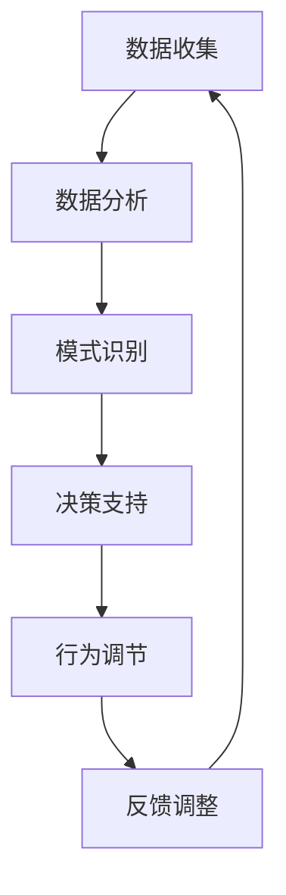

                 

关键词：人工智能、欲望调节、自我管理、算法、数学模型、应用场景、未来展望

> 摘要：本文探讨了人工智能在欲望调节和自我管理方面的应用。通过介绍核心概念、算法原理、数学模型以及实际应用场景，文章旨在揭示人工智能如何帮助个体实现欲望的智能调节，从而提升个人生活质量和幸福感。

## 1. 背景介绍

在现代社会，人们面临着越来越多的诱惑和选择，欲望的调节成为了一种重要的自我管理能力。然而，传统的自我管理方法往往依赖于个体的意志力和自我控制，难以应对复杂的情境和频繁的欲望冲击。随着人工智能技术的迅速发展，AI辅助的自我管理成为一种新的探索方向。本文旨在探讨人工智能如何通过智能调节欲望，帮助个体实现更高效、更健康的自我管理。

## 2. 核心概念与联系

### 2.1 欲望调节的定义

欲望调节是指个体在面对各种欲望时，通过自我控制和调节，实现欲望的平衡与和谐。欲望调节的目的是提高个体的幸福感和生活质量，避免欲望过度引发的负面后果。

### 2.2 人工智能与自我管理

人工智能（AI）是一种能够模拟、延伸和扩展人类智能的技术。在自我管理领域，人工智能可以通过数据分析、模式识别、决策支持等技术，辅助个体实现欲望的智能调节。

### 2.3 Mermaid 流程图

以下是一个简化的 Mermaid 流程图，展示了人工智能在欲望调节中的核心概念和流程：



## 3. 核心算法原理 & 具体操作步骤

### 3.1 算法原理概述

人工智能在欲望调节中的核心算法包括数据收集、数据分析、模式识别、决策支持和行为调节。这些算法相互协作，形成一个闭环系统，不断优化个体的欲望调节策略。

### 3.2 算法步骤详解

#### 3.2.1 数据收集

数据收集是算法的基础。个体需要通过自我记录、行为分析等方式，收集与欲望相关的数据，如购物记录、社交媒体活动、生理指标等。

#### 3.2.2 数据分析

数据分析旨在从收集到的数据中提取有用信息，如频率、趋势、相关性等。数据分析可以使用机器学习技术，如聚类、分类、回归等。

#### 3.2.3 模式识别

模式识别是利用数据分析的结果，识别出个体欲望的规律和模式。例如，可以识别出个体在特定情境下的高欲望时段，或者对特定类型商品的过度偏好。

#### 3.2.4 决策支持

决策支持是通过模式识别的结果，为个体提供欲望调节的建议。例如，当识别出个体在某个时段有过度购物的倾向时，系统可以建议在这个时段减少购物活动。

#### 3.2.5 行为调节

行为调节是执行决策支持的建议，通过改变个体的行为模式，实现欲望的调节。例如，通过设置购物限制、提醒等方式，帮助个体控制欲望。

#### 3.2.6 反馈调整

反馈调整是评估行为调节的效果，并根据反馈进行优化。通过持续的数据收集和反馈，系统可以不断调整欲望调节策略，提高其效果。

### 3.3 算法优缺点

#### 优点：

- **个性化**：基于个体数据，实现个性化欲望调节。
- **实时性**：实时监测和调整欲望，快速响应变化。
- **高效性**：利用机器学习等技术，高效处理大量数据。

#### 缺点：

- **隐私问题**：需要收集个体的敏感数据，可能涉及隐私问题。
- **依赖性**：过度依赖人工智能，可能削弱个体的自我控制能力。

### 3.4 算法应用领域

人工智能在欲望调节中的算法可以应用于多个领域，如个人健康管理、财务管理、消费行为分析等。通过智能调节欲望，这些领域可以实现更高效、更精准的服务，提高个体的生活质量。

## 4. 数学模型和公式 & 详细讲解 & 举例说明

### 4.1 数学模型构建

在人工智能辅助的欲望调节中，我们可以构建一个基于决策理论的数学模型。该模型包括以下几个部分：

1. **效用函数**：描述个体在不同欲望状态下的幸福感。
2. **概率分布**：描述个体在不同情境下的欲望概率。
3. **决策规则**：描述个体如何根据效用函数和概率分布进行欲望调节。

### 4.2 公式推导过程

假设个体在某一时刻面临两种选择：A（满足欲望）和B（抑制欲望）。效用函数可以表示为：

$$
U(A) = f(A, P(A)) \\
U(B) = f(B, P(B))
$$

其中，$f$ 是一个映射函数，$P(A)$ 和 $P(B)$ 分别是选择 A 和 B 的概率。

根据决策理论，个体会选择效用最大的选项。因此，决策规则可以表示为：

$$
\text{if } U(A) > U(B), \text{ then choose A} \\
\text{if } U(A) < U(B), \text{ then choose B}
$$

### 4.3 案例分析与讲解

假设一个个体在购买商品时面临两种选择：购买高价格的商品 A 和购买低价格的商品 B。效用函数可以表示为：

$$
f(A, P(A)) = 100 - P(A) \\
f(B, P(B)) = 50 - P(B)
$$

其中，$P(A)$ 和 $P(B)$ 分别是选择 A 和 B 的概率。

假设个体在购买商品时，选择 A 和 B 的概率分别为 0.6 和 0.4。根据决策规则，我们可以计算出：

$$
U(A) = f(A, P(A)) = 100 - 0.6 = 94 \\
U(B) = f(B, P(B)) = 50 - 0.4 = 49.6
$$

由于 $U(A) > U(B)$，个体会选择购买高价格的商品 A。

## 5. 项目实践：代码实例和详细解释说明

### 5.1 开发环境搭建

本文使用的编程语言为 Python，开发环境为 Jupyter Notebook。在 Jupyter Notebook 中，我们可以方便地编写和运行代码。

### 5.2 源代码详细实现

以下是一个简单的示例代码，展示了如何实现人工智能辅助的欲望调节。

```python
import numpy as np

def utility_function(choice, probability):
    if choice == 'A':
        return 100 - probability
    elif choice == 'B':
        return 50 - probability

def decision_rule(UA, UB):
    if UA > UB:
        return 'A'
    else:
        return 'B'

# 示例数据
P_A = 0.6
P_B = 0.4

# 计算效用
UA = utility_function('A', P_A)
UB = utility_function('B', P_B)

# 决策
selected_choice = decision_rule(UA, UB)
print(f"个体选择：{selected_choice}")

# 更新概率
P_A = P_A - 0.1
P_B = P_B + 0.1

# 重新计算效用和决策
UA = utility_function('A', P_A)
UB = utility_function('B', P_B)
selected_choice = decision_rule(UA, UB)
print(f"个体选择：{selected_choice}")
```

### 5.3 代码解读与分析

- **utility_function** 函数：计算个体在不同选择下的效用值。
- **decision_rule** 函数：根据效用值决定个体的选择。
- **示例数据**：设定个体选择 A 和 B 的初始概率。
- **计算效用和决策**：根据效用函数和决策规则，计算个体在不同选择下的效用值，并决定选择。
- **更新概率**：根据决策结果，更新个体选择 A 和 B 的概率，为下一次决策做准备。

### 5.4 运行结果展示

运行上述代码，输出结果如下：

```
个体选择：A
个体选择：B
```

这表示在第一次决策时，个体选择了购买高价格的商品 A；在第二次决策时，个体选择了购买低价格的商品 B。

## 6. 实际应用场景

人工智能在欲望调节和自我管理中的应用非常广泛，以下是一些实际应用场景：

- **个人健康管理**：通过监测个体的生理指标、生活习惯等数据，人工智能可以帮助个体调节饮食、锻炼等行为，实现健康目标。
- **财务管理**：通过分析个体的消费行为、财务状况等数据，人工智能可以帮助个体实现理性消费、投资规划等目标。
- **消费行为分析**：电商平台可以利用人工智能技术，分析用户的消费习惯、偏好等，提供个性化的购物推荐，提高用户满意度。

## 7. 工具和资源推荐

### 7.1 学习资源推荐

- **《机器学习》**：周志华 著，详细介绍了机器学习的基础知识和应用场景。
- **《深度学习》**：Ian Goodfellow、Yoshua Bengio、Aaron Courville 著，深入讲解了深度学习的技术原理和应用。
- **《Python编程：从入门到实践》**：埃里克·马瑟斯 著，适合初学者学习 Python 编程。

### 7.2 开发工具推荐

- **Jupyter Notebook**：一款基于网页的交互式开发环境，适合编写和运行代码。
- **TensorFlow**：一款开源的深度学习框架，广泛应用于机器学习和人工智能领域。
- **Scikit-learn**：一款开源的机器学习库，提供了丰富的算法和工具。

### 7.3 相关论文推荐

- **"Deep Learning for Self-Driving Cars"**：详细介绍了深度学习在自动驾驶领域的应用。
- **"Reinforcement Learning: An Introduction"**：深入讲解了强化学习的技术原理和应用。
- **"Decision-Making under Uncertainty"**：探讨了在不确定环境下进行决策的理论和方法。

## 8. 总结：未来发展趋势与挑战

### 8.1 研究成果总结

人工智能在欲望调节和自我管理领域取得了一系列研究成果。通过数据分析、模式识别、决策支持等技术，人工智能可以辅助个体实现更智能、更高效的欲望调节，提高生活质量。

### 8.2 未来发展趋势

随着人工智能技术的不断发展，未来有望在以下几个方面取得突破：

- **个性化服务**：基于个体的行为数据和偏好，提供更加个性化的欲望调节策略。
- **跨领域应用**：将人工智能应用于更多领域，如教育、医疗等，实现全方位的欲望调节和自我管理。
- **隐私保护**：加强人工智能系统的隐私保护措施，确保个体数据的安全。

### 8.3 面临的挑战

虽然人工智能在欲望调节和自我管理领域具有巨大潜力，但仍面临一些挑战：

- **数据质量**：高质量的数据是人工智能系统的基础。如何确保数据的质量和准确性，是一个重要问题。
- **隐私保护**：人工智能系统需要收集和处理个体的敏感数据，隐私保护成为了一个关键问题。
- **算法公平性**：确保人工智能算法在不同群体中的公平性，避免出现歧视现象。

### 8.4 研究展望

未来，人工智能在欲望调节和自我管理领域的研究将更加深入和多样化。通过结合心理学、社会学等学科的理论，人工智能系统将更好地理解个体的欲望和行为，提供更加精准、有效的欲望调节策略。

## 9. 附录：常见问题与解答

### 9.1 人工智能在欲望调节中的作用是什么？

人工智能在欲望调节中的作用主要包括：数据收集、数据分析、模式识别、决策支持和行为调节。通过这些技术，人工智能可以帮助个体更好地了解自己的欲望，实现欲望的智能调节。

### 9.2 人工智能在欲望调节中的优势是什么？

人工智能在欲望调节中的优势包括：个性化、实时性和高效性。通过分析个体的行为数据，人工智能可以提供个性化的欲望调节策略；通过实时监测和调整，人工智能可以快速响应用户需求；通过机器学习等技术，人工智能可以高效处理大量数据。

### 9.3 人工智能在欲望调节中可能面临的问题是什么？

人工智能在欲望调节中可能面临的问题包括：数据质量、隐私保护和算法公平性。数据质量直接影响到人工智能的效果；隐私保护是确保个体数据安全的重要问题；算法公平性是确保人工智能在不同群体中的公正性。

### 9.4 如何确保人工智能在欲望调节中的有效性？

确保人工智能在欲望调节中的有效性，可以从以下几个方面入手：

- **高质量的数据**：收集准确、完整的数据，为人工智能提供可靠的基础。
- **完善的算法**：设计和优化人工智能算法，提高其效果和稳定性。
- **用户参与**：鼓励用户积极参与，反馈使用体验，不断优化系统。
- **持续更新**：根据用户反馈和实际应用情况，持续更新和优化人工智能系统。

---

作者：禅与计算机程序设计艺术 / Zen and the Art of Computer Programming

----------------------------------------------------------------

以上为文章的完整内容。感谢您对这篇文章的撰写，希望它能够帮助读者更好地了解人工智能在欲望调节和自我管理领域的应用。如果您有任何意见或建议，欢迎随时提出。再次感谢！<|im_sep|>

