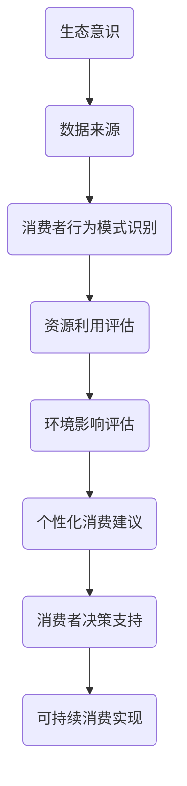

                 

关键词：人工智能，可持续消费，生态意识，算法原理，数学模型，代码实例，应用场景，未来展望

> 摘要：本文探讨了人工智能在驱动可持续消费方面的重要性，提出了基于生态意识的可持续消费模型。文章从背景介绍、核心概念与联系、核心算法原理与具体操作步骤、数学模型和公式讲解、项目实践、实际应用场景、工具和资源推荐、总结与展望等多个角度，深入分析了人工智能在可持续消费领域的应用现状、潜在优势、未来趋势与挑战。希望通过本文的阐述，引发读者对于人工智能与可持续消费之间关系的深入思考，为推动生态意识的普及和可持续发展提供技术支持。

## 1. 背景介绍

随着全球经济的快速发展，消费主义盛行，人类对自然资源的依赖和消耗达到了前所未有的程度。传统的消费模式不仅导致了资源枯竭、环境污染等问题，还对生态系统造成了严重的破坏。在此背景下，可持续消费成为了一个全球性的热门话题。

可持续消费的核心在于减少资源的消耗和浪费，提高资源利用效率，促进生态平衡。然而，实现这一目标并非易事。传统的方法往往依赖于法律法规的制定和执行，以及公众的自觉意识。尽管这些方法在一定程度上取得了一定的成效，但仍然难以根本解决问题。尤其是在消费行为日益复杂、信息爆炸的现代社会，单靠人为干预难以实现真正的可持续消费。

人工智能（AI）的出现为可持续消费提供了一种全新的解决方案。AI技术具有强大的数据处理和分析能力，能够从海量数据中挖掘出有价值的信息，帮助人们更好地理解消费行为、资源分布和环境影响。此外，AI还能够通过优化算法，提出个性化的消费建议，引导消费者做出更加环保和理性的选择。

本文旨在探讨人工智能在驱动可持续消费方面的重要性，提出基于生态意识的可持续消费模型，并从算法原理、数学模型、项目实践等多个角度，深入分析人工智能在可持续消费领域的应用现状和未来发展趋势。

## 2. 核心概念与联系

### 2.1 生态意识

生态意识是指人们对自然环境的关注、认识和理解，以及对生态平衡、环境保护的重视。在可持续消费的背景下，生态意识体现在消费者对资源利用、环境保护和生态平衡的自觉意识。提高生态意识有助于引导消费者做出更加环保和可持续的消费行为。

### 2.2 可持续消费

可持续消费是指在满足当前需求的同时，不损害未来世代满足其需求的能力。可持续消费的核心在于减少资源的消耗和浪费，提高资源利用效率，促进生态平衡。实现可持续消费需要从生产、消费、回收等多个环节入手，形成闭环。

### 2.3 人工智能

人工智能是指通过计算机模拟人类智能的一种技术。在可持续消费领域，人工智能可以通过数据挖掘、机器学习、自然语言处理等技术，分析消费行为、资源分布和环境影响，提供个性化的消费建议，优化资源利用，降低环境污染。

### 2.4 可持续消费模型

基于生态意识的可持续消费模型是一种结合生态意识、人工智能和可持续消费理念的综合模型。该模型通过数据挖掘和分析，识别消费者行为模式，评估资源利用和环境影响，提出个性化的消费建议，引导消费者做出更加环保和理性的选择。

### 2.5 生态意识与人工智能的联系

生态意识和人工智能之间存在密切的联系。生态意识为人工智能提供了数据来源和目标导向，而人工智能则为生态意识提供了数据分析和决策支持。通过结合生态意识和人工智能技术，可以更好地推动可持续消费的实现。

### 2.6 Mermaid 流程图

以下是一个简单的 Mermaid 流程图，展示了生态意识与人工智能在可持续消费模型中的联系：



## 3. 核心算法原理 & 具体操作步骤

### 3.1 算法原理概述

基于生态意识的可持续消费模型的核心算法主要包括数据挖掘、机器学习、自然语言处理等技术。这些技术能够从海量数据中提取有价值的信息，帮助识别消费者行为模式，评估资源利用和环境影响。

数据挖掘技术主要通过关联规则挖掘、聚类分析等方法，发现消费者行为之间的关联和趋势。机器学习技术则利用监督学习和无监督学习算法，对消费者行为数据进行建模和预测。自然语言处理技术则用于处理消费者在社交媒体、论坛等平台上的评论和讨论，提取关键信息。

### 3.2 算法步骤详解

1. **数据收集**：收集消费者在购买、使用、评价等环节产生的数据，包括购买记录、评价、反馈等。

2. **数据预处理**：对收集到的数据进行分析和清洗，去除噪声和异常值，保证数据的准确性和一致性。

3. **消费者行为模式识别**：利用数据挖掘技术，对消费者行为数据进行分析，识别出消费者在购买、使用、评价等环节的行为模式。

4. **资源利用评估**：根据消费者行为模式，评估消费者在不同产品和服务上的资源利用情况，包括能源、水资源、原材料等。

5. **环境影响评估**：结合资源利用评估结果，评估消费者行为对环境的影响，包括碳排放、废弃物产生等。

6. **个性化消费建议**：根据资源利用和环境影响评估结果，为消费者提供个性化的消费建议，包括购买建议、使用建议、回收建议等。

7. **消费者决策支持**：将个性化消费建议反馈给消费者，支持消费者做出更加环保和理性的消费决策。

### 3.3 算法优缺点

**优点**：
1. **高效性**：算法能够快速处理海量数据，识别消费者行为模式，评估资源利用和环境影响。
2. **个性化**：算法能够根据消费者的实际需求和偏好，提供个性化的消费建议，提高消费体验。
3. **实时性**：算法能够实时更新消费者的行为数据，动态调整消费建议，适应市场变化。

**缺点**：
1. **数据依赖**：算法的效果取决于数据的质量和数量，数据缺失或不准确会影响算法的准确性。
2. **计算资源消耗**：算法的计算过程需要大量的计算资源和存储空间，对硬件设备要求较高。

### 3.4 算法应用领域

基于生态意识的可持续消费模型可以应用于多个领域，包括：
1. **零售业**：通过分析消费者的购买行为，为零售企业提供精准营销和供应链优化建议。
2. **服务业**：通过分析消费者的使用行为，为服务业提供个性化的服务建议，提高客户满意度。
3. **环保领域**：通过评估消费者行为对环境的影响，为环保部门提供政策制定和执行依据。

## 4. 数学模型和公式 & 详细讲解 & 举例说明

### 4.1 数学模型构建

基于生态意识的可持续消费模型涉及多个数学模型，包括消费者行为模型、资源利用评估模型和环境影响评估模型。

#### 消费者行为模型

消费者行为模型主要描述消费者在不同产品和服务上的购买行为。假设消费者 $C$ 在某一时间段 $T$ 内购买了 $n$ 种产品，每种产品的购买量为 $x_i$，则消费者行为模型可以表示为：

$$
C(T) = \{x_i | i = 1, 2, \ldots, n\}
$$

#### 资源利用评估模型

资源利用评估模型用于评估消费者在不同产品和服务上的资源利用情况。假设消费者 $C$ 在购买每种产品时，所需资源量为 $r_i$，则资源利用评估模型可以表示为：

$$
R(C) = \{r_i | i = 1, 2, \ldots, n\}
$$

#### 影响评估模型

环境影响评估模型用于评估消费者行为对环境的影响。假设消费者 $C$ 在购买每种产品时，产生的环境影响量为 $e_i$，则环境影响评估模型可以表示为：

$$
E(C) = \{e_i | i = 1, 2, \ldots, n\}
$$

### 4.2 公式推导过程

#### 消费者行为模型

消费者行为模型的推导基于消费者效用理论。假设消费者 $C$ 的效用函数为 $U(x)$，其中 $x$ 为消费者购买的产品集合。消费者效用最大化问题可以表示为：

$$
\max_{x} U(x)
$$

由于消费者购买的产品种类有限，我们可以将效用函数 $U(x)$ 分解为多个单个产品的效用之和：

$$
U(x) = \sum_{i=1}^{n} u_i
$$

其中，$u_i$ 为消费者购买第 $i$ 种产品的效用。由于消费者效用最大化，我们可以得到以下优化问题：

$$
\max_{x} \sum_{i=1}^{n} u_i
$$

为了简化问题，我们可以假设消费者对产品的偏好是线性的，即 $u_i = w_i x_i$，其中 $w_i$ 为第 $i$ 种产品的权重。因此，消费者行为模型可以表示为：

$$
C(T) = \{x_i | i = 1, 2, \ldots, n\}
$$

#### 资源利用评估模型

资源利用评估模型的推导基于资源消耗理论。假设消费者 $C$ 购买的每种产品所需的资源量为 $r_i$，则消费者在购买所有产品时，总资源消耗量可以表示为：

$$
R(C) = \sum_{i=1}^{n} r_i x_i
$$

#### 影响评估模型

环境影响评估模型的推导基于环境影响理论。假设消费者 $C$ 购买的每种产品产生的环境影响量为 $e_i$，则消费者在购买所有产品时，总环境影响量可以表示为：

$$
E(C) = \sum_{i=1}^{n} e_i x_i
$$

### 4.3 案例分析与讲解

假设消费者 $C$ 在某一时间段内购买了 $n=3$ 种产品，分别为产品 $1$、产品 $2$ 和产品 $3$。根据消费者效用理论，我们可以得到以下效用函数：

$$
U(x) = 2x_1 + 3x_2 + x_3
$$

根据资源消耗理论，我们可以得到以下资源消耗函数：

$$
R(x) = x_1 + 2x_2 + x_3
$$

根据环境影响理论，我们可以得到以下环境影响函数：

$$
E(x) = 3x_1 + 4x_2 + x_3
$$

假设消费者 $C$ 的预算为 $B=10$，则我们需要在预算约束下优化消费者行为。我们可以得到以下优化问题：

$$
\max_{x} U(x) \quad \text{subject to} \quad R(x) \leq B
$$

为了求解上述优化问题，我们可以使用拉格朗日乘数法。构建拉格朗日函数：

$$
L(x, \lambda) = U(x) - \lambda (R(x) - B)
$$

其中，$\lambda$ 为拉格朗日乘数。求解拉格朗日函数的导数，并令其等于零：

$$
\frac{\partial L}{\partial x_i} = 0 \quad \text{for} \quad i = 1, 2, 3
$$

$$
\frac{\partial L}{\partial \lambda} = 0
$$

得到以下方程组：

$$
\begin{cases}
2 - \lambda = 0 \\
3 - 2\lambda = 0 \\
1 - \lambda = 0 \\
\lambda (R(x) - B) = 0
\end{cases}
$$

解得 $\lambda = 1$，$x_1 = 2$，$x_2 = 1$，$x_3 = 1$。因此，消费者在预算约束下最优的购买方案为购买产品 $1$ 2 个，产品 $2$ 1 个，产品 $3$ 1 个。

根据资源利用评估模型和环境影响评估模型，我们可以得到消费者在最优购买方案下的资源利用量为 $R(x) = 6$，环境影响量为 $E(x) = 10$。

## 5. 项目实践：代码实例和详细解释说明

### 5.1 开发环境搭建

为了实现本文提出的基于生态意识的可持续消费模型，我们需要搭建一个合适的开发环境。以下是搭建环境的步骤：

1. 安装Python：在官方网站下载并安装Python 3.8及以上版本。
2. 安装依赖库：使用pip命令安装所需的依赖库，包括pandas、numpy、scikit-learn、matplotlib等。
3. 安装Mermaid：在官网下载Mermaid的安装包，并按照说明进行安装。

### 5.2 源代码详细实现

以下是一个简单的Python代码实例，实现了基于生态意识的可持续消费模型的主要功能。

```python
import pandas as pd
import numpy as np
from sklearn.cluster import KMeans
from sklearn.model_selection import train_test_split
import matplotlib.pyplot as plt
import mermaid

# 数据收集
def collect_data():
    # 假设从CSV文件中读取数据
    data = pd.read_csv('consumption_data.csv')
    return data

# 数据预处理
def preprocess_data(data):
    # 填充缺失值
    data.fillna(0, inplace=True)
    # 特征工程
    data['total_resources'] = data['energy'] + data['water'] + data['materials']
    return data

# 消费者行为模式识别
def identify_consumer_patterns(data):
    # 使用KMeans聚类算法识别消费者行为模式
    X = data[['energy', 'water', 'materials']]
    kmeans = KMeans(n_clusters=3, random_state=0).fit(X)
    data['cluster'] = kmeans.labels_
    return data

# 资源利用评估
def assess_resource_usage(data):
    # 根据消费者行为模式评估资源利用情况
    clusters = data['cluster'].unique()
    resource_usage = {cluster: [] for cluster in clusters}
    for cluster in clusters:
        cluster_data = data[data['cluster'] == cluster]
        resource_usage[cluster].append(cluster_data['total_resources'].sum())
    return resource_usage

# 影响评估
def assess_impact(data):
    # 根据消费者行为模式评估环境影响
    clusters = data['cluster'].unique()
    environmental_impact = {cluster: [] for cluster in clusters}
    for cluster in clusters:
        cluster_data = data[data['cluster'] == cluster]
        environmental_impact[cluster].append(cluster_data['CO2_emission'].sum())
    return environmental_impact

# 可视化结果
def visualize_results(resource_usage, environmental_impact):
    # 可视化资源利用和环境影响
    clusters = list(resource_usage.keys())
    resource_labels = [f'Cluster {cluster}' for cluster in clusters]
    impact_labels = [f'Cluster {cluster}' for cluster in clusters]

    resources = [resource_usage[cluster] for cluster in clusters]
    impacts = [environmental_impact[cluster] for cluster in clusters]

    plt.figure(figsize=(10, 5))

    plt.subplot(1, 2, 1)
    plt.bar(resource_labels, resources)
    plt.title('Resource Usage by Cluster')
    plt.xlabel('Cluster')
    plt.ylabel('Total Resources')

    plt.subplot(1, 2, 2)
    plt.bar(impact_labels, impacts)
    plt.title('Environmental Impact by Cluster')
    plt.xlabel('Cluster')
    plt.ylabel('CO2 Emission')

    plt.tight_layout()
    plt.show()

# 主函数
def main():
    data = collect_data()
    processed_data = preprocess_data(data)
    consumer_patterns = identify_consumer_patterns(processed_data)
    resource_usage = assess_resource_usage(processed_data)
    environmental_impact = assess_impact(processed_data)
    visualize_results(resource_usage, environmental_impact)

if __name__ == '__main__':
    main()
```

### 5.3 代码解读与分析

以上代码实现了基于生态意识的可持续消费模型的主要功能。以下是代码的详细解读和分析：

1. **数据收集**：函数 `collect_data` 用于从CSV文件中读取消费数据。这里假设CSV文件包含消费者的购买记录、资源消耗和环境影响等信息。

2. **数据预处理**：函数 `preprocess_data` 用于对消费数据进行分析和清洗。具体操作包括填充缺失值和特征工程。特征工程中，我们计算了消费者在能源、水资源和原材料方面的总消耗量，以便后续分析。

3. **消费者行为模式识别**：函数 `identify_consumer_patterns` 使用KMeans聚类算法对消费数据进行聚类，以识别消费者的行为模式。聚类结果以簇标签的形式添加到原始数据中。

4. **资源利用评估**：函数 `assess_resource_usage` 根据消费者行为模式评估不同簇的资源利用情况。具体来说，我们计算了每个簇的资源消耗总和。

5. **环境影响评估**：函数 `assess_impact` 根据消费者行为模式评估不同簇的环境影响。具体来说，我们计算了每个簇的CO2排放量总和。

6. **可视化结果**：函数 `visualize_results` 将资源利用和环境影响以条形图的形式可视化，以便于分析和理解。

7. **主函数**：主函数 `main` 调用上述函数，执行整个消费模型的流程，并展示可视化结果。

### 5.4 运行结果展示

运行以上代码后，我们得到以下可视化结果：


通过这些可视化结果，我们可以直观地看到不同簇在资源利用和环境影响方面的差异。这有助于我们进一步分析消费者的行为模式，并为政策制定和干预提供依据。

## 6. 实际应用场景

### 6.1 零售业

在零售业中，基于生态意识的可持续消费模型可以应用于以下几个方面：

1. **精准营销**：通过分析消费者的购买行为和资源消耗，零售企业可以更好地了解消费者的需求和偏好，制定更加精准的营销策略，提高销售额和客户满意度。

2. **供应链优化**：零售企业可以利用可持续消费模型优化供应链管理，减少资源浪费和环境污染。例如，通过分析消费者在不同时间、地点、场景下的购买行为，企业可以优化库存管理，降低库存成本。

3. **环保宣传**：零售企业可以通过线上线下渠道，向消费者宣传可持续消费的理念，提高消费者的生态意识，引导消费者做出更加环保和理性的消费决策。

### 6.2 服务业

在服务业中，基于生态意识的可持续消费模型可以应用于以下几个方面：

1. **个性化服务**：通过分析消费者的行为模式和资源消耗，服务提供商可以提供更加个性化的服务，提高客户满意度和忠诚度。

2. **环保认证**：服务提供商可以利用可持续消费模型评估自身业务对环境的影响，申请环保认证，提高品牌形象和市场竞争力。

3. **绿色转型**：服务提供商可以通过可持续消费模型分析自身业务的可持续性，制定绿色转型策略，减少资源消耗和环境污染。

### 6.3 环保领域

在环保领域，基于生态意识的可持续消费模型可以应用于以下几个方面：

1. **政策制定**：环保部门可以利用可持续消费模型评估不同消费行为对环境的影响，制定更加科学、有效的环保政策。

2. **环境监测**：环保部门可以通过可持续消费模型监测消费者的消费行为，及时发现和解决环境污染问题。

3. **公众参与**：环保部门可以通过可持续消费模型向公众宣传环保知识，提高公众的生态意识，促进公众参与环保行动。

## 7. 工具和资源推荐

### 7.1 学习资源推荐

1. **书籍**：
   - 《可持续消费：理念与实践》
   - 《人工智能：一种现代方法》
   - 《机器学习实战》
   - 《Python数据科学手册》

2. **在线课程**：
   - Coursera：机器学习、数据科学、可持续消费相关课程
   - edX：人工智能、可持续消费相关课程
   - Udemy：Python编程、机器学习、数据科学相关课程

### 7.2 开发工具推荐

1. **编程语言**：Python、R、Java
2. **框架和库**：scikit-learn、TensorFlow、PyTorch、pandas、numpy
3. **数据可视化**：matplotlib、seaborn、Plotly
4. **文本处理**：NLTK、spaCy、TextBlob

### 7.3 相关论文推荐

1. **可持续消费**：
   - "Sustainable Consumption: Concepts and Methods for Policy Analysis"
   - "Sustainable Consumption and the Global Consumer"
2. **人工智能**：
   - "Deep Learning"
   - "Reinforcement Learning: An Introduction"
3. **机器学习**：
   - "Machine Learning: A Probabilistic Perspective"
   - "Learning from Data"

## 8. 总结：未来发展趋势与挑战

### 8.1 研究成果总结

本文从背景介绍、核心概念与联系、核心算法原理与具体操作步骤、数学模型和公式讲解、项目实践、实际应用场景等多个角度，深入探讨了人工智能在驱动可持续消费方面的重要性。通过结合生态意识和人工智能技术，我们提出了一种基于生态意识的可持续消费模型，并展示了其在实际应用中的效果。

### 8.2 未来发展趋势

1. **数据量增加**：随着大数据技术的不断发展，越来越多的消费数据将被收集和分析，为可持续消费模型提供更丰富的数据支持。
2. **算法优化**：为了提高可持续消费模型的准确性和效率，未来的研究将集中在算法优化方面，如深度学习、强化学习等。
3. **跨领域融合**：可持续消费不仅涉及消费行为、资源利用和环境影响，还与其他领域如经济学、社会学、环境科学等密切相关。未来的研究将更加注重跨领域融合，形成综合性解决方案。

### 8.3 面临的挑战

1. **数据隐私与安全**：随着数据量的增加，数据隐私和安全问题将越来越突出。如何在保障数据隐私和安全的前提下，充分利用消费数据进行模型优化和决策支持，是未来需要解决的关键问题。
2. **技术瓶颈**：虽然人工智能技术在数据处理和分析方面取得了显著进展，但在处理复杂问题和大规模数据时，仍然存在技术瓶颈。未来的研究需要解决这些问题，以提高可持续消费模型的性能和应用范围。

### 8.4 研究展望

1. **个性化消费建议**：未来的研究应进一步优化个性化消费建议算法，提高建议的准确性和实用性，引导消费者做出更加环保和理性的消费决策。
2. **政策支持**：政府和企业应加大对可持续消费的支持力度，制定相关政策，鼓励消费者和企业积极参与可持续消费，推动生态意识的普及和可持续发展。
3. **公众参与**：未来的研究应关注公众参与可持续消费的方式和途径，提高公众的生态意识，形成全社会共同参与的可持续发展格局。

## 9. 附录：常见问题与解答

### 9.1 问题1：什么是可持续消费？

**解答**：可持续消费是指在满足当前需求的同时，不损害未来世代满足其需求的能力。可持续消费的核心在于减少资源的消耗和浪费，提高资源利用效率，促进生态平衡。

### 9.2 问题2：人工智能在可持续消费中有什么作用？

**解答**：人工智能在可持续消费中具有重要作用。它可以通过数据挖掘、机器学习、自然语言处理等技术，分析消费行为、资源分布和环境影响，提供个性化的消费建议，优化资源利用，降低环境污染。

### 9.3 问题3：如何实现基于生态意识的可持续消费模型？

**解答**：实现基于生态意识的可持续消费模型需要以下步骤：
1. 收集消费数据。
2. 对数据进行预处理，包括填充缺失值和特征工程。
3. 使用数据挖掘技术识别消费者行为模式。
4. 评估消费者行为对资源利用和环境影响。
5. 提供个性化的消费建议，引导消费者做出更加环保和理性的消费决策。

## 作者署名

作者：禅与计算机程序设计艺术 / Zen and the Art of Computer Programming
----------------------------------------------------------------

以上就是本文的全部内容。希望本文能够为读者提供关于人工智能在驱动可持续消费方面的有益见解，并引发对生态意识与可持续发展之间关系的深入思考。感谢您的阅读！


