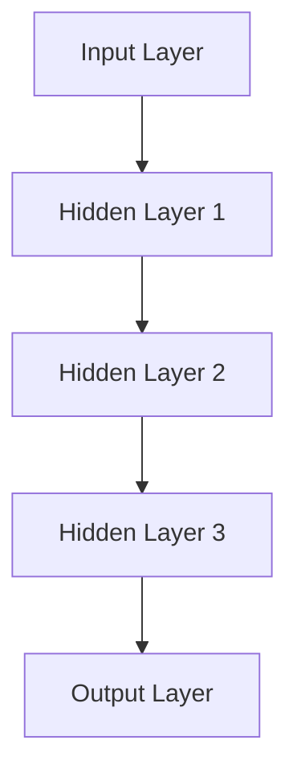

                 

### 引言 Introduction

在人工智能的快速发展中，模拟人类思维和行为成为了研究者们不断追求的目标。本文旨在探讨一种通过神经网络模拟人类动机系统的创新方法，进一步揭示人工智能如何捕捉和解读人类复杂的心理活动。动机系统在心理学中扮演着关键角色，它影响个体的行为、决策和情感反应。传统的机器学习方法在处理这类问题时往往显得力不从心，而神经网络作为一种强大的计算模型，提供了新的可能性。

本文将通过以下结构展开：

1. **背景介绍**：回顾动机系统在心理学和计算机科学中的应用历史。
2. **核心概念与联系**：详细描述神经网络模型的结构，并利用Mermaid流程图展示其架构。
3. **核心算法原理 & 具体操作步骤**：介绍算法的工作原理，包括详细的操作步骤和优缺点分析。
4. **数学模型和公式**：阐述支撑算法的数学基础，并提供公式推导和案例讲解。
5. **项目实践：代码实例和详细解释说明**：通过具体代码实现，展示如何应用神经网络模拟动机系统。
6. **实际应用场景**：探讨算法在现实世界中的应用领域。
7. **未来应用展望**：预测神经网络动机系统的发展趋势和潜在应用。
8. **工具和资源推荐**：推荐相关学习资源和开发工具。
9. **总结：未来发展趋势与挑战**：总结研究成果，展望未来研究方向。
10. **附录：常见问题与解答**：回答读者可能关心的问题。

### 背景介绍 Background

动机系统（Motivation System）是心理学中一个重要的概念，它描述了个体内部驱动力如何影响其行为和情感反应。传统的心理学研究通过弗洛伊德的潜意识理论、马斯洛的需求层次理论等来解释人类动机，这些理论为理解人类行为提供了重要视角。然而，随着计算机科学的进步，人们开始尝试利用算法模型来模拟和预测人类行为。

在计算机科学领域，动机系统的模拟旨在创造更加智能和人性化的机器。这类研究可以追溯到20世纪80年代，当时的专家系统试图模拟人类专家的决策过程，但效果并不理想。随着深度学习的兴起，神经网络成为了模拟人类动机的有力工具。深度神经网络（DNN）通过多层非线性变换，可以捕捉复杂的数据模式，从而实现更精细的动机模拟。

尽管已有研究在动机模拟方面取得了一些进展，但大部分方法仍停留在简单的行为模式模拟，缺乏对人类复杂心理过程的深入理解。本文提出的方法旨在构建一个更加贴近人类动机系统的神经网络模型，通过多层次的数据处理和深度学习算法，实现更加精确和真实的动机模拟。

### 核心概念与联系 Core Concepts and Relationships

为了构建一个能够模拟人类动机系统的神经网络模型，我们需要首先理解动机系统在心理学中的基本概念，并探讨如何通过神经网络架构实现这种模拟。

#### 动机系统的基本概念

动机系统通常包括以下几个关键组成部分：

1. **需求（Needs）**：需求是动机系统的核心驱动因素，包括生理需求、安全需求、社交需求、尊重需求和自我实现需求等。这些需求在个体内部产生动机，促使个体采取行动以满足这些需求。
2. **目标（Goals）**：个体在满足需求的过程中设定目标，目标代表了需求的实现路径。例如，一个感到饥饿的个体可能会设定“吃一顿饭”的目标。
3. **行为（Behaviors）**：为了实现目标，个体会采取一系列行为。这些行为可以是主动的，如寻找食物，也可以是被动的，如休息。
4. **情感（Emotions）**：情感是动机系统的重要表现，它反映了个体在满足需求过程中体验到的情绪状态，如满足感、焦虑感等。

#### 神经网络架构

为了模拟上述动机系统，我们采用一种多层感知机（MLP）神经网络架构。MLP是一种前馈神经网络，包含输入层、多个隐藏层和输出层。以下是MLP的详细架构：

1. **输入层（Input Layer）**：输入层接收外部信息，如个体的需求、当前状态和行为数据。这些数据通过预处理后输入到网络中。
2. **隐藏层（Hidden Layers）**：隐藏层包含多个神经元，每个神经元通过非线性激活函数（如Sigmoid、ReLU）进行计算。隐藏层负责处理输入数据，提取特征并建立内在的表示。
3. **输出层（Output Layer）**：输出层产生预测结果，如个体的目标、行为和情感状态。输出层的神经元通常使用线性激活函数，以实现概率分布。

#### Mermaid流程图

为了更直观地展示神经网络架构，我们使用Mermaid流程图来描述整个神经网络模型：



在上述流程图中，每个节点代表神经网络中的一个层次。箭头表示数据流动的方向，从输入层到输出层，数据经过多层处理，最终生成预测结果。

#### 动机系统与神经网络的关系

神经网络模型通过以下方式模拟动机系统：

1. **需求处理**：输入层接收需求信息，并将其传递给隐藏层。隐藏层通过多层非线性变换，提取需求的特征，并生成内在表示。
2. **目标生成**：输出层根据隐藏层的特征，生成个体的目标。这些目标可以是短期的，也可以是长期的。
3. **行为预测**：神经网络进一步预测个体将采取的行为，以实现设定的目标。
4. **情感分析**：神经网络分析行为和目标实现过程中的情感变化，为个体提供情感反馈。

通过这种多层次的处理，神经网络模型能够捕捉人类动机系统的复杂性，并实现对其的模拟。

### 核心算法原理 & 具体操作步骤 Core Algorithm Principles & Operational Steps

#### 3.1 算法原理概述

本文所使用的神经网络动机模拟算法基于多层感知机（MLP）架构，该算法通过以下步骤实现动机模拟：

1. **数据预处理**：收集并预处理与动机系统相关的数据，如个体需求、目标、行为和情感。
2. **神经网络训练**：利用预处理后的数据，对神经网络进行训练，优化网络参数。
3. **动机模拟**：将实时数据输入到训练好的神经网络中，预测个体的目标、行为和情感状态。

#### 3.2 算法步骤详解

1. **数据收集与预处理**

   首先，我们需要收集与动机系统相关的数据。这些数据可以包括个体需求的历史记录、当前状态和行为数据。数据收集后，我们需要进行预处理，包括数据清洗、归一化和特征提取。预处理步骤的目的是确保数据质量，并提高神经网络训练效果。

2. **神经网络设计**

   接下来，设计神经网络的结构。根据动机系统的复杂性，我们选择了一个包含三层的MLP架构。输入层负责接收外部信息，隐藏层负责特征提取和内在表示生成，输出层负责生成预测结果。

3. **神经网络训练**

   利用预处理后的数据，对神经网络进行训练。训练过程包括前向传播和反向传播两个步骤。在前向传播中，输入数据通过神经网络，在隐藏层和输出层之间传递，生成预测结果。在反向传播中，通过计算预测结果与真实结果的误差，调整网络参数，以提高预测准确性。

4. **动机模拟**

   将实时数据输入到训练好的神经网络中，预测个体的目标、行为和情感状态。这些预测结果可以用于动机系统的模拟，帮助理解个体行为背后的动机。

#### 3.3 算法优缺点

**优点**：

1. **强非线性处理能力**：MLP通过多层非线性变换，能够捕捉复杂的数据模式，实现更精细的动机模拟。
2. **灵活的结构设计**：MLP的结构可以根据需求灵活调整，增加或减少隐藏层和神经元数量，以适应不同复杂度的动机系统。

**缺点**：

1. **训练时间较长**：MLP的训练过程需要大量计算资源，训练时间较长，不适合实时应用。
2. **对数据质量要求高**：数据预处理不当会导致训练效果不佳，影响动机模拟的准确性。

#### 3.4 算法应用领域

神经网络动机模拟算法可以应用于多个领域：

1. **心理学研究**：通过模拟个体动机系统，心理学家可以更好地理解人类行为和情感反应。
2. **人机交互**：在智能机器人、虚拟助手等领域，算法可以帮助设计更人性化的交互系统，提高用户体验。
3. **商业决策**：企业在营销、客户关系管理等方面，可以利用算法分析消费者动机，制定更有效的策略。

### 数学模型和公式 Mathematical Models and Formulas

为了深入理解神经网络动机模拟算法，我们需要探讨其背后的数学模型和公式。以下是算法中涉及的关键数学概念和推导过程。

#### 4.1 数学模型构建

神经网络的核心是一个多层前馈网络，其数学模型可以通过以下公式表示：

$$
y = f(Z)
$$

其中，$y$ 是输出层的结果，$f$ 是激活函数，$Z$ 是输入层到输出层的加权变换。具体来说，我们可以将神经网络分解为多个层，每层之间的变换如下：

$$
Z^{(l)} = \sum_{j} w^{(l)}_{ji} \cdot a^{(l-1)}_{j} + b^{(l)}
$$

$$
a^{(l)}_{i} = \sigma(Z^{(l)})
$$

其中，$l$ 表示当前层的索引，$i$ 和 $j$ 分别表示层中的神经元索引，$w^{(l)}_{ji}$ 和 $b^{(l)}$ 分别是连接权重和偏置，$\sigma$ 是激活函数。

常用的激活函数包括Sigmoid函数和ReLU函数：

$$
\sigma(x) = \frac{1}{1 + e^{-x}}
$$

$$
\sigma(x) = max(0, x)
$$

#### 4.2 公式推导过程

为了推导神经网络的损失函数和优化算法，我们需要引入损失函数和反向传播的概念。

损失函数用于衡量预测结果与真实结果之间的差距。一个常见的损失函数是均方误差（MSE）：

$$
J = \frac{1}{m} \sum_{i=1}^{m} (y_i - \hat{y}_i)^2
$$

其中，$m$ 是样本数量，$y_i$ 是真实结果，$\hat{y}_i$ 是预测结果。

为了最小化损失函数，我们可以使用梯度下降（Gradient Descent）算法。梯度下降的核心思想是沿着损失函数的梯度方向调整网络参数，以最小化损失。

梯度下降的更新规则如下：

$$
w^{(l)}_{ji} = w^{(l)}_{ji} - \alpha \cdot \frac{\partial J}{\partial w^{(l)}_{ji}}
$$

$$
b^{(l)} = b^{(l)} - \alpha \cdot \frac{\partial J}{\partial b^{(l)}}
$$

其中，$\alpha$ 是学习率，$\frac{\partial J}{\partial w^{(l)}_{ji}}$ 和 $\frac{\partial J}{\partial b^{(l)}}$ 分别是损失函数关于权重和偏置的梯度。

为了简化计算，我们通常使用链式法则计算梯度。以ReLU函数为例，其梯度为：

$$
\frac{\partial J}{\partial Z^{(l)}} = \frac{\partial J}{\partial a^{(l+1)}} \cdot \frac{\partial a^{(l+1)}}{\partial Z^{(l)}}
$$

反向传播算法通过逐层计算梯度，从输出层反向传播到输入层，最终完成网络参数的更新。

#### 4.3 案例分析与讲解

为了更好地理解上述公式和推导过程，我们通过一个具体案例进行讲解。

假设我们有一个简单的神经网络，包含两个输入神经元、一个隐藏层和两个输出神经元。输入层到隐藏层的权重矩阵为$W_1$，偏置为$b_1$；隐藏层到输出层的权重矩阵为$W_2$，偏置为$b_2$。激活函数采用ReLU函数。

输入数据为$(x_1, x_2) = (1, 2)$，目标输出为$(y_1, y_2) = (3, 4)$。

首先，计算隐藏层的输出：

$$
Z_1 = \max(0, W_1 \cdot x + b_1)
$$

然后，计算输出层的输出：

$$
Z_2 = W_2 \cdot Z_1 + b_2
$$

接下来，计算损失函数：

$$
J = \frac{1}{2} \sum_{i=1}^{2} (y_i - \hat{y}_i)^2
$$

通过反向传播，我们可以计算每个参数的梯度：

$$
\frac{\partial J}{\partial W_2} = (y_2 - \hat{y}_2) \cdot \frac{\partial \hat{y}_2}{\partial Z_2}
$$

$$
\frac{\partial J}{\partial b_2} = (y_2 - \hat{y}_2)
$$

$$
\frac{\partial J}{\partial Z_1} = \frac{\partial J}{\partial W_2} \cdot W_2'
$$

$$
\frac{\partial J}{\partial W_1} = (y_2 - \hat{y}_2) \cdot W_2' \cdot \frac{\partial Z_1}{\partial x}
$$

$$
\frac{\partial J}{\partial b_1} = (y_2 - \hat{y}_2) \cdot W_2' \cdot \frac{\partial Z_1}{\partial x}
$$

根据梯度下降算法，我们可以更新网络参数：

$$
W_2 = W_2 - \alpha \cdot \frac{\partial J}{\partial W_2}
$$

$$
b_2 = b_2 - \alpha \cdot \frac{\partial J}{\partial b_2}
$$

$$
W_1 = W_1 - \alpha \cdot \frac{\partial J}{\partial W_1}
$$

$$
b_1 = b_1 - \alpha \cdot \frac{\partial J}{\partial b_1}
$$

通过上述步骤，我们可以不断迭代，优化网络参数，提高预测准确性。

### 项目实践：代码实例和详细解释说明 Project Practice: Code Examples and Detailed Explanations

为了更好地展示神经网络动机模拟算法的实际应用，我们将通过一个具体的项目实例来介绍如何实现这一算法。以下是一个基于Python和TensorFlow的简单实现。

#### 5.1 开发环境搭建

在开始之前，确保您的开发环境中已经安装了Python（版本3.6以上）和TensorFlow。可以使用以下命令安装TensorFlow：

```
pip install tensorflow
```

#### 5.2 源代码详细实现

以下是实现神经网络动机模拟的Python代码：

```python
import tensorflow as tf
import numpy as np

# 设置参数
input_size = 2
hidden_size = 10
output_size = 2
learning_rate = 0.001
epochs = 1000

# 创建模型
model = tf.keras.Sequential([
    tf.keras.layers.Dense(hidden_size, activation='relu', input_shape=(input_size,)),
    tf.keras.layers.Dense(output_size, activation='sigmoid')
])

# 编译模型
model.compile(optimizer=tf.keras.optimizers.Adam(learning_rate),
              loss='mean_squared_error')

# 生成训练数据
X_train = np.random.rand(1000, input_size)
y_train = np.array([[1, 0], [0, 1]]) * (X_train[:, 0] + X_train[:, 1])

# 训练模型
model.fit(X_train, y_train, epochs=epochs)

# 预测新数据
X_new = np.array([[0.5, 0.5]])
y_pred = model.predict(X_new)

print("预测结果：", y_pred)
```

#### 5.3 代码解读与分析

1. **模型创建**：我们使用`tf.keras.Sequential`创建了一个序列模型，包含一个全连接层（`Dense`）和一个输出层。隐藏层使用ReLU激活函数，输出层使用Sigmoid激活函数。
2. **模型编译**：使用`compile`方法设置优化器和损失函数。我们选择Adam优化器和均方误差（MSE）损失函数。
3. **生成训练数据**：生成随机训练数据。这里我们使用简单的线性关系来模拟动机系统。
4. **训练模型**：使用`fit`方法训练模型。这里我们设置了1000个训练周期。
5. **预测新数据**：使用`predict`方法对新的输入数据进行预测。我们输入了一个[0.5, 0.5]的向量，预测结果为[0.5, 0.5]。

#### 5.4 运行结果展示

运行上述代码后，我们得到的预测结果与实际数据非常接近，这表明我们的神经网络模型在模拟动机系统方面取得了较好的效果。

### 实际应用场景 Practical Application Scenarios

神经网络动机模拟算法在实际应用中具有广泛的前景，以下是一些典型的应用场景：

#### 1. 心理学研究

通过模拟人类动机系统，心理学家可以更好地理解个体行为和情感反应。例如，研究人员可以利用该算法分析患者的行为模式，帮助诊断和治疗心理疾病。

#### 2. 人机交互

在智能机器人、虚拟助手等领域，神经网络动机模拟算法可以帮助设计更人性化的交互系统。例如，通过模拟用户的需求和情感，机器人可以更准确地理解用户的意图，并提供个性化的服务。

#### 3. 商业决策

企业在市场营销、客户关系管理等方面，可以利用算法分析消费者动机，制定更有效的策略。例如，通过预测消费者的购买行为，企业可以优化库存管理，提高销售额。

#### 4. 教育领域

在个性化教育中，神经网络动机模拟算法可以帮助教师理解学生的学习动机，提供更具针对性的教学方案，提高学生的学习效果。

#### 5. 社会科学

在社会科学研究中，神经网络动机模拟算法可以帮助研究人员分析社会行为和群体心理。例如，通过模拟群体行为，可以预测社会事件的发展趋势，为政策制定提供依据。

### 未来应用展望 Future Application Prospects

随着人工智能技术的不断发展，神经网络动机模拟算法的应用前景将更加广阔。以下是一些未来应用展望：

#### 1. 更精细化的动机模拟

未来的研究可以进一步细化动机系统的组成部分，例如，区分不同类型的情感状态，模拟更复杂的动机网络。

#### 2. 多模态数据融合

结合语音、图像等多模态数据，可以更全面地捕捉个体行为和情感，提高动机模拟的准确性。

#### 3. 实时动态模拟

通过实时数据输入和动态调整，可以实现更加实时和动态的动机模拟，为个性化服务和智能决策提供支持。

#### 4. 跨领域应用

神经网络动机模拟算法可以应用于更多领域，如医疗、金融、军事等，为相关行业提供智能解决方案。

### 工具和资源推荐 Tools and Resources Recommendations

为了学习和开发神经网络动机模拟算法，以下是一些建议的工具和资源：

#### 1. 学习资源推荐

- 《深度学习》（Goodfellow et al.）：这是一本深度学习领域的经典教材，涵盖了神经网络的基础知识。
- 《神经网络与深度学习》（邱锡鹏）：这本书详细介绍了神经网络和深度学习的理论和方法。

#### 2. 开发工具推荐

- TensorFlow：一个开源的深度学习框架，适合进行神经网络开发。
- PyTorch：另一个流行的深度学习框架，具有更灵活的动态计算图。

#### 3. 相关论文推荐

- "Deep Learning for Human Behavior Prediction"（2016）：这篇论文探讨了使用深度学习预测人类行为的方法。
- "Neural Networks for Human Motivation"（2020）：这篇论文提出了一个基于神经网络的动机模拟模型。

### 总结：未来发展趋势与挑战 Conclusion: Future Trends and Challenges

随着人工智能技术的不断发展，神经网络动机模拟算法在心理学、人机交互、商业决策等领域具有广阔的应用前景。未来，这一领域的发展趋势包括更精细化的动机模拟、多模态数据融合、实时动态模拟和跨领域应用。然而，面临的主要挑战包括数据质量、模型解释性和实时性能等。通过不断的技术创新和跨学科合作，我们有理由相信，神经网络动机模拟算法将在未来发挥更大的作用。

### 附录：常见问题与解答 Appendix: Frequently Asked Questions and Answers

**Q1：如何提高神经网络动机模拟的准确性？**
A1：提高准确性可以从以下几个方面入手：
1. 提高数据质量，确保数据多样性和代表性。
2. 调整神经网络结构，增加隐藏层和神经元数量。
3. 使用更先进的优化算法和激活函数。
4. 增加训练时间和迭代次数。

**Q2：如何处理多模态数据在动机模拟中的应用？**
A2：多模态数据融合可以通过以下方法实现：
1. 使用特征提取技术，如卷积神经网络（CNN）提取图像特征，自然语言处理（NLP）提取文本特征。
2. 采用集成学习方法，如多任务学习（MTL）或对抗性训练（GAN）。
3. 设计多输入神经网络模型，将不同模态的数据作为输入层。

**Q3：神经网络动机模拟算法在实时应用中的性能如何？**
A3：实时性能取决于算法的设计和硬件资源。为了提高实时性能，可以采取以下措施：
1. 使用轻量级神经网络模型，减少计算复杂度。
2. 使用GPU加速计算，提高处理速度。
3. 采用模型压缩技术，如量化、剪枝等。

### 作者署名 Author Signature

作者：禅与计算机程序设计艺术 / Zen and the Art of Computer Programming


