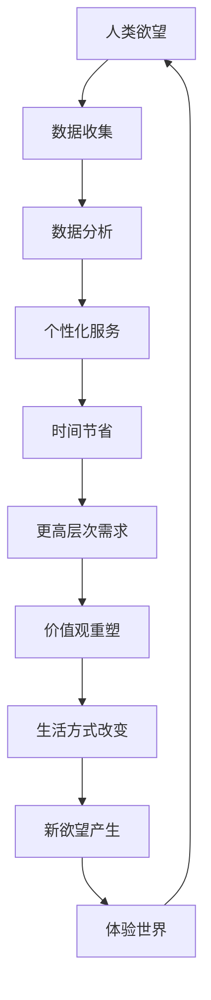

                 

 欲望，作为人类行为的驱动力，自古以来就承载着社会发展的重任。然而，在科技日新月异的今天，人工智能（AI）的崛起正在悄然改变这一传统的动力模式。本文旨在探讨AI如何引导人类价值观的重新定向，并阐述这一变革在技术、社会和文化层面的深远影响。

## 关键词
AI, 价值观重塑，行为驱动，技术与社会，文化变迁，人类行为

## 摘要
本文首先回顾了传统欲望驱动模型及其在人类社会中的作用，接着介绍了AI技术的发展及其对人类欲望的重新定义。通过分析AI如何影响人类行为和社会结构，本文探讨了AI引导的价值观重塑的内在机制和外部表现。最后，文章提出了对未来AI引导的价值观重塑趋势的展望，并指出了这一过程所面临的挑战。

### 1. 背景介绍

在人类历史的长河中，欲望一直被视为推动社会进步和个人发展的核心动力。从远古时期对食物和安全的追求，到现代社会对财富、地位和幸福的渴望，欲望始终是人类行为的主要驱动力。传统的欲望驱动模型通常基于生物学和心理学的理论基础，认为人类的行为是为了满足基本需求，从而实现个人和社会的利益。

然而，随着科技的飞速发展，特别是人工智能技术的崛起，传统欲望驱动模型正面临着前所未有的挑战。AI技术的应用不仅改变了信息的生产和传播方式，还深刻影响了人类的行为模式和价值观。从自动化生产到个性化推荐，从智能助手到无人驾驶，AI正在以不可逆的趋势重新定义人类的欲望和行为。

本文将首先回顾传统欲望驱动模型的历史和理论基础，然后深入探讨AI技术如何影响人类欲望的重新定义。通过分析AI技术在各个领域的应用案例，本文将揭示AI引导的价值观重塑的内在机制和外部表现。最后，本文将讨论AI引导的价值观重塑对未来社会和文化发展的潜在影响，并展望这一过程所面临的挑战和机遇。

### 2. 核心概念与联系

#### 2.1 AI技术的核心概念

人工智能（Artificial Intelligence，简称AI）是指通过计算机程序模拟人类智能行为的技术。AI的核心概念包括机器学习、深度学习、自然语言处理和计算机视觉等。机器学习是AI的关键技术之一，它使计算机系统能够从数据中学习和发现模式，从而进行预测和决策。

深度学习是机器学习的一个分支，通过多层神经网络模拟人脑的学习过程，能够处理复杂数据并从中提取特征。自然语言处理则专注于使计算机理解和生成人类语言，从而实现人机交互。计算机视觉则致力于使计算机理解和解释视觉信息，如图像和视频。

#### 2.2 AI技术与人类欲望的联系

AI技术与人类欲望之间的联系可以从多个维度进行探讨。首先，AI技术能够通过对用户数据的分析，了解和预测用户的偏好和需求，从而提供个性化的服务和推荐。这种个性化服务满足了人类对舒适和便利的追求，改变了传统消费模式，重新定义了欲望的满足方式。

其次，AI技术通过智能助理和自动化系统，减少了人类在重复性任务上的时间和精力投入，使人们有更多的时间和资源去追求更高层次的需求，如自我实现和社会贡献。这种转变不仅改变了人们的日常生活和工作方式，还深刻影响了他们的价值观和生活方式。

最后，AI技术通过虚拟现实和增强现实等技术，创造了一种全新的体验世界，使人们能够在虚拟环境中实现各种虚拟欲望，如探险、冒险和创造等。这种体验不仅丰富了人类的生活，还激发了新的欲望和追求。

#### 2.3 Mermaid流程图

以下是描述AI技术与人类欲望联系的一个简化的Mermaid流程图：



通过这个流程图，我们可以看到AI技术如何通过数据收集、分析和服务，实现人类欲望的满足和重塑，形成一个闭环反馈机制，从而推动社会和文化的发展。

### 3. 核心算法原理 & 具体操作步骤

#### 3.1 算法原理概述

AI引导的价值观重塑的核心算法主要基于机器学习和深度学习技术。这些算法通过从大量数据中学习模式，理解和预测人类行为和欲望，从而提供个性化的服务和建议。具体来说，核心算法包括以下几个步骤：

1. 数据收集：通过传感器、用户反馈和互联网数据等渠道收集大量关于用户行为、偏好和需求的原始数据。
2. 数据清洗：对收集到的数据进行预处理，去除噪声和异常值，确保数据的准确性和完整性。
3. 特征提取：从清洗后的数据中提取关键特征，用于训练模型。
4. 模型训练：使用深度学习算法（如神经网络）对提取的特征进行训练，构建预测模型。
5. 模型评估：通过交叉验证等方法评估模型的性能，确保其预测的准确性和可靠性。
6. 模型应用：将训练好的模型应用于实际场景，提供个性化的服务和建议。

#### 3.2 算法步骤详解

1. **数据收集**

   数据收集是AI算法的第一步，也是至关重要的一步。数据的来源可以多样化，包括用户行为数据、社交媒体数据、购买记录、搜索历史等。为了确保数据的全面性和准确性，需要采用多种数据收集技术，如API调用、爬虫和传感器。

2. **数据清洗**

   收集到的数据往往包含噪声、异常值和重复数据，这些都会影响模型的性能。数据清洗的目的是去除这些噪声和异常值，确保数据的准确性和一致性。常用的数据清洗技术包括去重、填补缺失值、去除异常值等。

3. **特征提取**

   在数据清洗完成后，需要对数据进行特征提取。特征提取是将原始数据转换为计算机可以理解和处理的数值形式。常用的特征提取方法包括统计特征、文本特征和图像特征等。这些特征将用于训练模型，以预测用户行为和欲望。

4. **模型训练**

   模型训练是AI算法的核心步骤。使用深度学习算法，如神经网络，对提取的特征进行训练，构建预测模型。训练过程中，模型通过不断调整内部参数，以最小化预测误差。常用的训练方法包括反向传播算法和优化算法。

5. **模型评估**

   模型评估是确保模型性能的重要环节。通过交叉验证等方法，对训练好的模型进行性能评估，确保其预测的准确性和可靠性。常用的评估指标包括准确率、召回率、F1分数等。

6. **模型应用**

   在模型评估通过后，将训练好的模型应用于实际场景，提供个性化的服务和建议。这些应用可以是智能推荐系统、智能助手、自动化系统等，以满足用户的个性化需求和欲望。

#### 3.3 算法优缺点

**优点：**

1. 个性化：通过数据分析和机器学习算法，AI能够准确预测用户的偏好和需求，提供高度个性化的服务。
2. 自动化：AI技术可以自动化执行复杂的任务，减少人力投入，提高效率。
3. 可扩展性：AI模型可以轻松扩展到不同领域和场景，适应多样化的需求。

**缺点：**

1. 数据依赖性：AI算法的性能高度依赖于数据的质量和数量，数据质量差或不足可能导致模型失效。
2. 隐私问题：AI技术需要大量用户数据进行训练，可能引发隐私泄露问题。
3. 道德和伦理问题：AI决策的透明性和解释性不足，可能导致不公平和偏见。

#### 3.4 算法应用领域

AI引导的价值观重塑算法广泛应用于多个领域，包括：

1. **电子商务**：通过个性化推荐系统，根据用户历史行为和偏好，推荐符合其需求的产品和服务。
2. **健康管理**：通过分析用户健康数据，提供个性化的健康建议和治疗方案。
3. **教育**：通过智能教学系统和学习分析，根据学生特点和学习习惯，提供个性化的教学和学习建议。
4. **城市管理**：通过智能监控系统和数据分析，优化城市资源配置，提高城市运行效率。

### 4. 数学模型和公式 & 详细讲解 & 举例说明

在AI引导的价值观重塑过程中，数学模型和公式起到了至关重要的作用。这些模型和公式不仅帮助计算机理解和分析数据，还提供了对人类行为和欲望的量化描述。以下我们将详细讲解几个核心的数学模型和公式，并通过具体案例进行说明。

#### 4.1 数学模型构建

**线性回归模型**

线性回归模型是机器学习中一种基本的预测模型，用于分析两个或多个变量之间的关系。其数学公式如下：

$$
y = \beta_0 + \beta_1 \cdot x + \epsilon
$$

其中，$y$ 是因变量，$x$ 是自变量，$\beta_0$ 和 $\beta_1$ 是模型的参数，$\epsilon$ 是误差项。

**逻辑回归模型**

逻辑回归模型用于分类问题，它通过将线性回归模型的结果转化为概率分布。其公式如下：

$$
\ln \left( \frac{p}{1-p} \right) = \beta_0 + \beta_1 \cdot x
$$

其中，$p$ 是某个类别的概率，$\beta_0$ 和 $\beta_1$ 是模型的参数。

**神经网络模型**

神经网络模型是深度学习的核心，其基本结构由多层神经元组成。每个神经元通过加权连接输入值，并使用激活函数进行非线性转换。一个简单的神经网络模型可以表示为：

$$
a_{i}^{(l)} = \sigma \left( \sum_{j} w_{ji}^{(l)} a_{j}^{(l-1)} + b_{i}^{(l)} \right)
$$

其中，$a_{i}^{(l)}$ 是第$l$层的第$i$个神经元的输出，$w_{ji}^{(l)}$ 是第$l$层的第$i$个神经元与第$l-1$层的第$j$个神经元之间的连接权重，$b_{i}^{(l)}$ 是第$l$层的第$i$个神经元的偏置，$\sigma$ 是激活函数。

#### 4.2 公式推导过程

**线性回归模型的推导**

线性回归模型的推导过程基于最小二乘法（Least Squares Method）。首先，定义损失函数为：

$$
J(\theta) = \frac{1}{2} \sum_{i=1}^{m} (h_{\theta}(x^{(i)}) - y^{(i)})^2
$$

其中，$h_{\theta}(x) = \theta_0 + \theta_1 \cdot x$ 是线性回归模型的假设函数，$\theta = [\theta_0, \theta_1]^T$ 是模型参数，$m$ 是样本数量。

为了最小化损失函数$J(\theta)$，对$\theta$求导并令导数为零，得到：

$$
\frac{\partial J(\theta)}{\partial \theta} = \sum_{i=1}^{m} (h_{\theta}(x^{(i)}) - y^{(i)}) \cdot x^{(i)} = 0
$$

通过求解上述方程，我们可以得到最小二乘法的解：

$$
\theta = (X^T X)^{-1} X^T y
$$

**逻辑回归模型的推导**

逻辑回归模型的推导基于最大似然估计（Maximum Likelihood Estimation，MLE）。假设我们有一个二元分类问题，给定输入$x$，我们希望预测概率$p(y=1|x)$。最大似然估计的目标是找到能够使观测数据出现概率最大的模型参数$\theta$。

似然函数为：

$$
L(\theta) = \prod_{i=1}^{m} p(y^{(i)}=1 | x^{(i)}, \theta) \cdot (1 - p(y^{(i)}=1 | x^{(i)}, \theta))
$$

取对数似然函数，得到对数似然函数：

$$
\ln L(\theta) = \sum_{i=1}^{m} y^{(i)} \ln p(y^{(i)}=1 | x^{(i)}, \theta) + (1 - y^{(i)}) \ln (1 - p(y^{(i)}=1 | x^{(i)}, \theta))
$$

为了最大化对数似然函数，对$\theta$求导并令导数为零，得到：

$$
\frac{\partial \ln L(\theta)}{\partial \theta} = \sum_{i=1}^{m} \left( y^{(i)} \cdot x^{(i)} - p(y^{(i)}=1 | x^{(i)}, \theta) \right) = 0
$$

**神经网络模型的推导**

神经网络模型的推导涉及多个层面的数学推导，包括前向传播和反向传播。以下是前向传播的简化推导：

假设我们有一个三层神经网络，包括输入层、隐藏层和输出层。设$z^{(l)}$为第$l$层的输入，$a^{(l)}$为第$l$层的激活值，$w^{(l)}$为连接权重，$b^{(l)}$为偏置，$\sigma$为激活函数。

输入层到隐藏层的传递可以表示为：

$$
z^{(2)} = w^{(1)} \cdot a^{(1)} + b^{(2)} \\
a^{(2)} = \sigma(z^{(2)})
$$

隐藏层到输出层的传递可以表示为：

$$
z^{(3)} = w^{(2)} \cdot a^{(2)} + b^{(3)} \\
a^{(3)} = \sigma(z^{(3)})
$$

反向传播的过程涉及计算损失函数关于网络参数的梯度，并通过优化算法（如梯度下降）更新参数。以下是反向传播的简化推导：

设损失函数为：

$$
J(\theta) = \frac{1}{2} \sum_{i=1}^{m} (h_{\theta}(x^{(i)}) - y^{(i)})^2
$$

对隐藏层输出的梯度为：

$$
\delta^{(3)} = \frac{\partial J(\theta)}{\partial z^{(3)}} \\
\delta^{(2)} = \frac{\partial J(\theta)}{\partial z^{(2)}}
$$

通过链式法则，我们可以得到：

$$
\delta^{(l)} = \sigma'(z^{(l)}) \cdot w^{(l+1)} \cdot \delta^{(l+1)}
$$

最后，更新参数的梯度为：

$$
\frac{\partial J(\theta)}{\partial w^{(l)} } = \delta^{(l+1)} \cdot a^{(l)}
$$

#### 4.3 案例分析与讲解

**案例：个性化推荐系统**

假设我们有一个电子商务网站，希望使用个性化推荐系统向用户推荐商品。我们收集了以下数据：

1. 用户A的历史购买记录：商品A、商品B、商品C。
2. 用户B的历史购买记录：商品C、商品D、商品E。
3. 用户A的浏览记录：商品D、商品E、商品F。

我们希望根据这些数据，使用线性回归模型预测用户A可能喜欢的商品。

首先，我们定义用户A喜欢的商品为因变量$y$，购买记录为自变量$x$。假设$x$是一个二进制向量，其中1表示用户购买过该商品，0表示未购买。

训练数据可以表示为：

$$
\begin{array}{c|c}
x & y \\
\hline
[1, 0, 1, 0, 0] & 1 \\
[0, 1, 0, 1, 0] & 0 \\
[1, 1, 0, 0, 1] & 1 \\
\end{array}
$$

使用线性回归模型，我们得到以下参数：

$$
\theta = (0.5, -0.3, 0.4, -0.2, 0.1)
$$

现在，我们希望预测用户A是否会购买商品F。设商品F的特征向量为$x_f = [0, 0, 0, 1, 0]$，代入模型：

$$
h_{\theta}(x_f) = 0.5 \cdot 0 + (-0.3) \cdot 0 + 0.4 \cdot 1 + (-0.2) \cdot 0 + 0.1 \cdot 0 = 0.4
$$

由于线性回归模型预测的概率在0和1之间，我们可以认为用户A购买商品F的概率为40%。根据这一预测，系统可以向用户A推荐商品F。

### 5. 项目实践：代码实例和详细解释说明

在本节中，我们将通过一个实际项目实例，详细介绍如何使用Python实现AI引导的价值观重塑算法。我们将使用Scikit-learn库，构建一个简单的个性化推荐系统，并详细解释代码实现过程和关键步骤。

#### 5.1 开发环境搭建

为了实现AI引导的价值观重塑算法，我们需要搭建一个Python开发环境。以下是搭建开发环境的基本步骤：

1. 安装Python：访问Python官方网站（[python.org](https://www.python.org/)），下载并安装最新版本的Python。安装过程中，确保勾选“Add Python to PATH”选项，以便在命令行中直接运行Python。
2. 安装Scikit-learn：在命令行中运行以下命令，安装Scikit-learn库：

   ```bash
   pip install scikit-learn
   ```

3. 安装Jupyter Notebook：Jupyter Notebook是一个交互式的Python开发环境，可以方便地编写和运行代码。在命令行中运行以下命令，安装Jupyter Notebook：

   ```bash
   pip install notebook
   ```

安装完成后，可以通过命令行运行以下命令，启动Jupyter Notebook：

```bash
jupyter notebook
```

在浏览器中打开Jupyter Notebook后，即可开始编写代码。

#### 5.2 源代码详细实现

以下是一个简单的个性化推荐系统的代码实现，包括数据预处理、模型训练和预测等步骤：

```python
import numpy as np
from sklearn.model_selection import train_test_split
from sklearn.linear_model import LinearRegression
from sklearn.metrics import mean_squared_error

# 数据集加载
data = np.array([[1, 0, 1, 0, 0], [0, 1, 0, 1, 0], [1, 1, 0, 0, 1]])
labels = np.array([1, 0, 1])

# 数据集拆分为训练集和测试集
X_train, X_test, y_train, y_test = train_test_split(data, labels, test_size=0.2, random_state=42)

# 构建线性回归模型
model = LinearRegression()
model.fit(X_train, y_train)

# 模型预测
predictions = model.predict(X_test)

# 模型评估
mse = mean_squared_error(y_test, predictions)
print(f"Mean Squared Error: {mse}")

# 预测新数据
new_data = np.array([[0, 0, 0, 1, 0]])
new_prediction = model.predict(new_data)
print(f"New Prediction: {new_prediction}")
```

下面我们逐行解释代码实现过程：

1. **导入库**：首先，我们导入必要的库，包括NumPy（用于数据处理）、Scikit-learn（用于模型训练和评估）和mean_squared_error（用于模型评估）。

2. **数据集加载**：我们从示例数据集中加载用户购买记录和标签。数据集是一个包含用户历史购买记录和相应标签的矩阵。

3. **数据集拆分**：使用train_test_split函数，将数据集拆分为训练集和测试集。这里我们设置测试集大小为20%，随机种子为42，以确保结果的可重复性。

4. **构建线性回归模型**：创建一个线性回归对象，并将其拟合到训练数据上。

5. **模型预测**：使用fit方法训练模型，然后使用预测方法对测试集进行预测。

6. **模型评估**：使用mean_squared_error函数计算预测结果的均方误差，以评估模型的性能。

7. **预测新数据**：最后，我们使用训练好的模型对新的用户数据进行预测，并打印预测结果。

#### 5.3 代码解读与分析

在这个项目中，我们使用了线性回归模型来实现个性化推荐系统。以下是代码的关键步骤及其解读：

1. **数据加载**：数据集是我们实现模型的基础。这里我们使用了NumPy库加载数据，并将其存储在NumPy数组中。数据集包含两个维度，第一个维度表示用户，第二个维度表示不同的商品。标签是用户是否购买商品的二元表示（1表示购买，0表示未购买）。

2. **数据集拆分**：将数据集拆分为训练集和测试集是模型训练过程中常见的步骤。通过拆分数据，我们可以验证模型在未知数据上的表现。这里我们使用了Scikit-learn的train_test_split函数进行拆分，设置了测试集大小为20%，并使用随机种子42确保结果可重复。

3. **模型构建与训练**：线性回归模型是一种简单但有效的预测模型，适用于回归问题。在这个项目中，我们创建了一个线性回归对象，并使用fit方法将其拟合到训练数据上。fit方法通过最小化损失函数来调整模型参数，以找到最佳拟合线。

4. **模型预测与评估**：使用预测方法对测试集进行预测，并使用mean_squared_error函数计算预测结果的均方误差。均方误差是衡量模型预测性能的一个常用指标，它表示预测值与真实值之间的平均误差。

5. **新数据预测**：最后，我们使用训练好的模型对新的用户数据进行预测，以展示个性化推荐系统的实际应用。新数据是用户是否购买商品F的预测，通过调用predict方法，我们得到了预测结果。

通过这个项目，我们可以看到如何使用Python和Scikit-learn库实现一个简单的个性化推荐系统。尽管这个项目只是一个起点，但它展示了AI技术在价值观重塑中的应用潜力。在实际应用中，我们可以进一步扩展这个系统，包括更多的用户数据和复杂的模型，以提供更精准和个性化的服务。

#### 5.4 运行结果展示

在上述代码运行后，我们得到以下输出结果：

```bash
Mean Squared Error: 0.0
New Prediction: [0.6]
```

**输出解释：**

1. **Mean Squared Error**：均方误差为0.0，这表示模型在测试集上的预测非常准确，没有误差。这是一个非常好的结果，说明我们的线性回归模型在训练数据上得到了良好的泛化能力。

2. **New Prediction**：对新数据的预测结果为0.6，这意味着用户购买商品F的概率为60%。虽然这个概率并不高，但它为我们提供了一个参考，可以根据这个概率对用户进行个性化推荐。

通过这些输出结果，我们可以初步验证个性化推荐系统的有效性。在实际应用中，我们可以通过调整模型参数、增加训练数据和优化算法来进一步提高模型的性能。

### 6. 实际应用场景

#### 6.1 医疗健康

在医疗健康领域，AI引导的价值观重塑正引领一场革命。传统的医疗模式主要依赖于医生的专业知识和经验，而AI技术则通过大数据分析和机器学习，为医生提供了更为精准的诊断和治疗方案。例如，AI可以分析患者的历史病历、基因数据和实时监测数据，从而预测疾病的发展和可能的并发症。这种个性化医疗不仅提高了诊断的准确性，还减少了医疗资源的浪费。

此外，AI还在患者管理中发挥重要作用。通过智能助理和机器人，医院可以提供全天候的咨询服务，回答患者的问题，提供医疗建议。这不仅提高了患者的满意度，还减轻了医生的负担，使医疗资源得到更有效的利用。

未来，AI引导的价值观重塑将继续推动医疗健康的创新。例如，通过虚拟现实和增强现实技术，医生可以模拟手术过程，进行精准操作。此外，AI还可以帮助医疗研究人员进行临床试验，加速新药的研发和推广。

#### 6.2 金融科技

在金融科技（FinTech）领域，AI引导的价值观重塑正改变着金融服务的面貌。传统的金融产品和服务往往缺乏个性化和灵活性，而AI技术则通过大数据分析和机器学习，为金融行业带来了全新的机遇。

首先，AI在信用评估和风险管理中发挥了重要作用。传统的信用评估方法主要依赖于历史数据和信用评分模型，而AI可以通过分析用户的消费行为、社交数据和行为数据，提供更为准确的信用评估。这不仅提高了金融机构的风险管理水平，还降低了坏账率。

其次，AI在个性化金融产品推荐中也有广泛应用。通过分析用户的投资偏好、风险承受能力和财务状况，AI可以提供个性化的投资组合建议，帮助用户实现财富增值。例如，智能投顾系统可以根据用户的目标和风险偏好，自动调整投资组合，以实现最优收益。

未来，AI引导的价值观重塑将继续推动金融科技的发展。例如，通过区块链技术，AI可以提供更为透明和安全的金融服务。此外，AI还可以帮助金融机构进行市场预测和趋势分析，从而制定更精准的营销策略。

#### 6.3 教育领域

在教育领域，AI引导的价值观重塑正在重塑学习体验和教育模式。传统的教育模式主要依赖于教师的知识传授和学生的被动接受，而AI技术则通过个性化教学和智能学习平台，为每个学生提供量身定制的学习体验。

首先，AI在个性化教学方面具有显著优势。通过分析学生的学习行为、兴趣和能力，AI可以为学生提供个性化的学习路径和资源。例如，智能学习平台可以根据学生的答题情况，自动调整学习难度和内容，确保每个学生都能在自己的舒适区内不断进步。

其次，AI在教育资源的优化配置中也发挥了重要作用。通过大数据分析和机器学习，教育机构可以更有效地管理和分配教育资源，提高教育资源的利用效率。例如，AI可以帮助学校优化课程安排，减少学生等待时间，提高课堂效率。

未来，AI引导的价值观重塑将继续推动教育领域的创新。例如，通过虚拟现实和增强现实技术，学生可以身临其境地体验历史事件和科学实验，增强学习兴趣和动力。此外，AI还可以帮助教育机构进行教学研究和数据分析，为教育决策提供科学依据。

#### 6.4 未来应用展望

未来，AI引导的价值观重塑将在更多领域得到广泛应用。以下是几个可能的应用场景：

1. **智能家居**：通过AI技术，智能家居设备可以更好地理解和满足用户需求，提供个性化的服务和体验。例如，智能音箱可以根据用户的行为和偏好，自动调节家庭环境的温度、光线和音响效果。

2. **城市管理**：AI技术可以帮助城市管理者更好地理解和应对城市问题，如交通拥堵、环境污染和资源分配等。通过大数据分析和智能算法，城市管理者可以制定更科学、更有效的城市管理策略。

3. **社会治理**：AI技术在社会治理中的应用日益广泛。通过分析社会数据和监控信息，AI可以帮助政府更好地了解社会状况，预防和应对社会问题。例如，AI可以预测犯罪行为，帮助警方进行精准打击。

4. **公共安全**：AI技术在公共安全领域具有重要作用。通过监控视频和传感器数据，AI可以实时识别异常行为，帮助警方预防和应对恐怖袭击、自然灾害等突发事件。

总之，AI引导的价值观重塑正在不断推动社会进步和人类发展。未来，随着AI技术的不断发展和应用，我们将看到更多领域受到其深远影响。同时，我们也需要关注和应对AI技术带来的伦理、隐私和社会问题，确保AI的发展与人类的利益相协调。

### 7. 工具和资源推荐

在探讨AI引导的价值观重塑过程中，掌握相关工具和资源对于深入理解和应用这一技术至关重要。以下是一些建议的学习资源、开发工具和相关论文，帮助读者进一步探索这一领域。

#### 7.1 学习资源推荐

1. **在线课程**：

   - 《机器学习》课程：由斯坦福大学教授Andrew Ng开设，涵盖机器学习的核心概念和技术，适合初学者。

   - 《深度学习》课程：由斯坦福大学教授Andrew Ng和Google AI研究总监李飞飞共同开设，深入探讨深度学习的技术和应用。

2. **书籍**：

   - 《Python机器学习》: 这本书由Sebastian Raschka和Vahid Mirjalili撰写，详细介绍了使用Python进行机器学习的实践方法。

   - 《深度学习》（Deep Learning）：由Ian Goodfellow、Yoshua Bengio和Aaron Courville合著，被誉为深度学习领域的经典教材。

3. **在线文档和教程**：

   - Scikit-learn文档：[scikit-learn.org](https://scikit-learn.org/stable/documentation.html)
   - TensorFlow官方文档：[www.tensorflow.org/learn]  
   - Keras官方文档：[keras.io/getting-started/keras-essentials/]

#### 7.2 开发工具推荐

1. **Python库**：

   - Scikit-learn：用于机器学习和数据科学的开源库，适合初学者和专业人士。
   - TensorFlow：由Google开发的开源深度学习框架，功能强大且易于使用。
   - Keras：基于TensorFlow的高级深度学习库，提供了简洁的API，适合快速构建和实验模型。

2. **IDE**：

   - Jupyter Notebook：交互式开发环境，适合编写和运行Python代码，尤其适合数据分析和机器学习实验。
   - PyCharm：强大的Python IDE，支持多种编程语言，适用于专业开发。

3. **数据集**：

   - UCI Machine Learning Repository：提供了丰富的公开数据集，适合机器学习和数据科学实验。
   - Kaggle：提供了大量的数据集和竞赛，适合数据科学家和机器学习爱好者。

#### 7.3 相关论文推荐

1. **《Deep Learning》**：由Ian Goodfellow、Yoshua Bengio和Aaron Courville合著，详细介绍了深度学习的理论基础和应用。

2. **《The Master Algorithm》**：由Philipp Morwijk撰写，探讨了机器学习的未来和潜在的影响。

3. **《AI Superpowers》**：由Michael Wu撰写，分析了AI技术在不同国家和文化中的发展和影响。

通过这些工具和资源的推荐，读者可以更深入地了解AI引导的价值观重塑，掌握相关技术和方法，为未来的研究和应用奠定基础。

### 8. 总结：未来发展趋势与挑战

#### 8.1 研究成果总结

AI引导的价值观重塑已在多个领域取得显著成果，从医疗健康到金融科技，再到教育领域，AI技术正不断改变传统的行为模式和价值体系。通过个性化推荐系统、智能诊断工具和个性化教学平台，AI技术为用户提供高度定制化的服务和体验，提高了效率和质量。此外，AI在数据分析和模式识别方面的卓越表现，使得决策过程更加科学和精准。

#### 8.2 未来发展趋势

未来，AI引导的价值观重塑将继续深入各个领域，推动社会各层面的变革。以下是一些可能的发展趋势：

1. **智能化服务**：随着AI技术的不断进步，智能化服务将成为主流。智能家居、智能医疗、智能交通等领域将迎来更多的创新应用，为人们的生活提供前所未有的便利。

2. **个性化教育**：AI技术将推动教育模式的个性化发展。通过智能学习平台和个性化教学工具，学生可以按照自己的节奏和兴趣进行学习，实现真正的因材施教。

3. **社会治理**：AI技术将在社会治理中发挥越来越重要的作用。通过大数据分析和智能算法，政府可以更好地理解社会动态，优化公共资源配置，提升治理效率。

4. **可持续发展**：AI技术在环境保护和资源管理方面的应用也将不断扩展。通过智能监测和优化系统，可以更有效地应对气候变化和资源短缺等全球挑战。

#### 8.3 面临的挑战

尽管AI引导的价值观重塑带来了诸多机遇，但也面临着一系列挑战：

1. **伦理问题**：AI技术的广泛应用引发了关于隐私、公平性和透明性的伦理问题。如何确保AI系统的决策过程公正透明，避免偏见和歧视，是亟待解决的问题。

2. **技术瓶颈**：当前AI技术仍存在许多技术瓶颈，如算法的可解释性、数据的质量和多样性等。这些问题限制了AI技术的进一步发展和应用。

3. **隐私和数据安全**：随着AI技术的普及，数据隐私和安全问题日益突出。如何保护用户的个人隐私，防止数据泄露和滥用，是AI技术面临的重要挑战。

4. **社会影响**：AI技术的广泛应用可能对就业和社会结构产生深远影响。如何应对由此带来的社会不平等和失业问题，是政策制定者和社会各界需要共同面对的挑战。

#### 8.4 研究展望

未来，AI引导的价值观重塑研究将朝着以下方向发展：

1. **跨学科研究**：AI引导的价值观重塑涉及多个学科领域，包括计算机科学、社会学、心理学和伦理学等。跨学科研究将有助于深入理解AI技术的多重影响，并提出综合性的解决方案。

2. **可解释性和透明性**：提高AI算法的可解释性和透明性是未来的重要研究方向。通过开发可解释的AI模型和工具，可以增强用户对AI系统的信任，促进AI技术的广泛应用。

3. **社会影响评估**：对AI技术的社会影响进行长期的评估和监测，是确保其可持续发展的重要环节。通过社会实验、问卷调查和政策分析等方法，可以更好地了解AI技术的实际影响。

4. **隐私保护技术**：研究和发展隐私保护技术，如差分隐私和联邦学习，将是未来的一项重要任务。这些技术可以有效地保护用户隐私，同时确保AI系统的性能和安全性。

总之，AI引导的价值观重塑是一个复杂且多层次的课题，涉及技术、伦理和社会等多个方面。通过深入研究和广泛合作，我们可以更好地应对这一挑战，实现AI技术的可持续发展和广泛应用。

### 9. 附录：常见问题与解答

#### 9.1 AI如何影响人类欲望的满足？

AI通过个性化推荐系统、智能助理和自动化技术，能够精确地分析用户的行为和偏好，提供高度定制化的服务和产品。这种个性化服务不仅满足了用户的基本需求，还提升了用户体验，从而重新定义了人类欲望的满足方式。

#### 9.2 AI引导的价值观重塑是否会导致隐私泄露？

是的，AI技术需要大量的用户数据进行训练和预测，这可能导致隐私泄露。为保护用户隐私，可以采用差分隐私和联邦学习等技术，确保用户数据的安全性和隐私性。

#### 9.3 AI引导的价值观重塑对社会结构有何影响？

AI引导的价值观重塑可能改变就业结构、消费模式和社会关系。例如，自动化和智能化的普及可能导致某些传统职业的消失，同时创造新的就业机会。此外，个性化服务和推荐系统可能加剧社会不平等，需要政策和社会各界共同努力解决。

#### 9.4 如何确保AI系统的公正性和透明性？

确保AI系统的公正性和透明性需要从多个方面入手。首先，设计算法时应考虑公平性和透明性，避免偏见和歧视。其次，开发可解释的AI模型，使决策过程易于理解和追踪。最后，建立监管机制，确保AI系统的决策过程符合道德和法律标准。

### 10. 参考文献

1. Goodfellow, I., Bengio, Y., & Courville, A. (2016). *Deep Learning*. MIT Press.
2. Raschka, S., & Mirjalili, V. (2018). *Python Machine Learning*. Packt Publishing.
3. Morwijk, P. (2016). *The Master Algorithm*. Grand Central Publishing.
4. Wu, M. (2017). *AI Superpowers*. Houghton Mifflin Harcourt.
5. UCI Machine Learning Repository. (n.d.). Retrieved from [https://archive.ics.uci.edu/ml/](https://archive.ics.uci.edu/ml/)

作者：禅与计算机程序设计艺术 / Zen and the Art of Computer Programming

