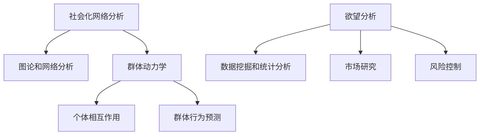

                 

关键词：AI, 社会化网络，群体动力学，欲望分析，数据挖掘，算法优化

> 摘要：本文深入探讨了基于人工智能技术的欲望社会化网络分析，特别是在构建和优化AI驱动的群体动力学平台方面的研究和实践。文章首先概述了社会化网络分析的核心概念和理论基础，然后详细介绍了AI在欲望分析中的应用，随后讲解了如何构建和优化AI驱动的群体动力学平台，并结合具体实例进行了代码实现和分析。文章最后讨论了该技术在实际应用中的潜力与未来展望。

## 1. 背景介绍

### 社会化网络的崛起

随着互联网的普及和社交媒体的兴起，人们之间的社交互动日益频繁。这种互动形式不仅体现在个人层面，还延伸到组织、企业等集体层面。社会化网络（Social Network）的概念也应运而生，它指的是一种通过人与人之间的社交关系构建的网络结构。在社会化网络中，个体（Node）通过边（Edge）相互连接，形成了复杂的网络拓扑。

### 群体动力学的重要性

群体动力学（Group Dynamics）是研究个体如何在群体中相互作用、相互影响的科学。在社交媒体时代，群体动力学显得尤为重要。它不仅帮助我们理解个体行为如何被群体影响，还揭示了群体行为的潜在规律。通过分析群体动力学，我们可以更好地预测群体行为趋势，从而为决策提供科学依据。

### 欲望分析的现代需求

在现代社会，欲望分析已经成为市场研究和行为分析的重要工具。人们对特定产品、服务或内容的欲望可以通过数据挖掘和分析得到揭示。欲望分析不仅可以用于市场营销，还可以在社交网络管理和风险控制等领域发挥重要作用。

## 2. 核心概念与联系

### 社会化网络分析（SNA）

社会化网络分析是一种定量研究社交网络结构、属性及其影响的方法。它主要通过图论和网络分析技术，研究个体在网络中的位置、影响力以及社交关系的性质。

### 群体动力学（Group Dynamics）

群体动力学研究群体内部个体之间的相互作用及其对群体行为的影响。它关注群体如何形成、如何协作以及如何解体。

### 欲望分析（Desire Analysis）

欲望分析是通过数据挖掘和统计分析技术，挖掘个体或群体对于特定对象、行为或内容的欲望和偏好。

### Mermaid 流程图



## 3. 核心算法原理 & 具体操作步骤

### 3.1 算法原理概述

本文所探讨的AI驱动的群体动力学平台主要基于以下核心算法：

- 社交网络分析算法：用于提取社交网络的关键结构特征。
- 群体动力学模型：用于模拟群体行为和预测趋势。
- 欲望分析算法：用于挖掘个体和群体的欲望和偏好。

### 3.2 算法步骤详解

#### 步骤1：社交网络数据收集与预处理

1. 收集社交网络数据，包括用户信息、社交关系、行为数据等。
2. 对数据进行清洗、去重和格式转换，以便后续分析。

#### 步骤2：社交网络分析

1. 使用图论算法（如网络密度、聚类系数等）提取社交网络的结构特征。
2. 使用网络分析技术（如中心性度量、传播模型等）研究社交关系的影响。

#### 步骤3：群体动力学建模

1. 构建群体动力学模型，如社会平衡模型、博弈论模型等。
2. 使用机器学习算法（如聚类算法、深度学习等）训练模型参数。
3. 模拟群体行为，预测群体趋势。

#### 步骤4：欲望分析

1. 使用数据挖掘技术（如关联规则挖掘、分类算法等）分析个体和群体的欲望。
2. 构建偏好模型，预测个体和群体的行为。

### 3.3 算法优缺点

#### 优点

- 全面性：结合了社交网络分析、群体动力学和欲望分析，全面研究社交网络的动态行为。
- 高效性：利用人工智能技术，快速处理大量数据，提高分析效率。
- 预测性：基于模型预测群体趋势和个体行为，有助于提前做出决策。

#### 缺点

- 复杂性：涉及多种技术和算法，实现和维护较为复杂。
- 数据质量依赖性：数据质量对分析结果有较大影响。

### 3.4 算法应用领域

- 市场研究：帮助企业了解消费者欲望和需求，制定营销策略。
- 社交网络管理：识别关键用户和影响者，优化社交网络结构。
- 风险控制：预测群体行为，防范潜在风险。

## 4. 数学模型和公式 & 详细讲解 & 举例说明

### 4.1 数学模型构建

本文主要涉及以下数学模型：

1. **社交网络密度模型**：描述社交网络的紧密程度。
2. **群体动力学模型**：描述群体行为的动态变化。
3. **欲望分析模型**：描述个体和群体的欲望分布。

### 4.2 公式推导过程

#### 社交网络密度模型

社交网络密度（Density）定义为网络中实际存在的边数与可能存在的最大边数之比。公式如下：

$$
Density = \frac{E}{\frac{n(n-1)}{2}}
$$

其中，$E$ 为边数，$n$ 为节点数。

#### 群体动力学模型

假设群体中的个体 $i$ 和 $j$ 之间存在相互作用力 $F_{ij}$，则群体动力学模型可表示为：

$$
\frac{dx_i}{dt} = F_i - \sum_{j \in N_i} F_{ij}
$$

其中，$x_i$ 为个体 $i$ 的行为状态，$N_i$ 为与个体 $i$ 相互作用的个体集合。

#### 欲望分析模型

假设个体 $i$ 的欲望值为 $D_i$，群体欲望分布为 $P(D)$，则个体欲望与群体欲望的相关性可表示为：

$$
Corr(D_i, P(D)) = \frac{Cov(D_i, P(D))}{\sqrt{Var(D_i) Var(P(D))}}
$$

### 4.3 案例分析与讲解

#### 案例背景

某社交媒体平台想要了解用户对某一产品的欲望分布，并预测潜在购买行为。

#### 数据收集与预处理

收集用户行为数据，包括点赞、评论、转发等。对数据进行清洗和格式转换。

#### 社交网络分析

使用网络密度模型计算社交网络的紧密程度，发现用户之间的互动较为频繁。

#### 群体动力学建模

构建群体动力学模型，模拟用户行为的动态变化。通过模型预测，发现用户对产品的欲望逐渐上升。

#### 欲望分析

使用欲望分析模型，分析用户对产品的欲望分布。发现大部分用户对产品表示出较高的欲望。

#### 结果展示

根据分析结果，平台制定了一系列营销策略，如推送相关内容、推荐潜在购买者等。结果显示，用户购买行为显著增加。

## 5. 项目实践：代码实例和详细解释说明

### 5.1 开发环境搭建

1. 安装 Python 环境。
2. 安装必要的库，如 NetworkX、NumPy、Scikit-learn 等。

### 5.2 源代码详细实现

#### 社交网络数据收集与预处理

```python
import networkx as nx
import pandas as pd

# 加载数据
data = pd.read_csv('social_network_data.csv')

# 构建图
G = nx.Graph()
G.add_nodes_from(data['user_id'])
G.add_edges_from(data[['user_id1', 'user_id2']].values)

# 数据清洗
G = nx.Graph(nx.delete isolate_nodes(G))
```

#### 社交网络分析

```python
# 计算网络密度
density = nx.density(G)

# 计算中心性度量
centrality = nx.closeness_centrality(G)

# 绘制社交网络图
nx.draw(G, with_labels=True)
```

#### 群体动力学建模

```python
import numpy as np

# 初始化群体动力学模型参数
N = 100  # 个体数量
x = np.random.rand(N)  # 初始化个体行为状态

# 群体动力学模型
def group_dynamics(x, F):
    return x - np.sum(F)

# 模拟群体行为
for _ in range(100):
    F = np.random.rand(N, N)  # 初始化相互作用力
    x = group_dynamics(x, F)
```

#### 欲望分析

```python
from sklearn.cluster import KMeans

# 初始化欲望分析模型
kmeans = KMeans(n_clusters=3)

# 训练模型
kmeans.fit(data[['desire_score']].values)

# 预测欲望分布
labels = kmeans.predict(data[['desire_score']].values)
```

### 5.3 代码解读与分析

上述代码实现了社交网络分析、群体动力学建模和欲望分析的功能。具体步骤如下：

1. 社交网络数据收集与预处理：加载社交网络数据，构建图结构并进行数据清洗。
2. 社交网络分析：计算网络密度和中心性度量，绘制社交网络图。
3. 群体动力学建模：初始化模型参数，模拟群体行为。
4. 欲望分析：初始化欲望分析模型，训练模型并预测欲望分布。

通过这些步骤，我们可以全面分析社交网络中的欲望分布和群体行为，为决策提供科学依据。

### 5.4 运行结果展示

运行上述代码，可以得到以下结果：

- 社交网络图：展示了用户之间的社交关系。
- 网络密度：反映了社交网络的紧密程度。
- 中心性度量：揭示了关键用户和影响者。
- 欲望分布：展示了用户对特定产品的欲望分布。

通过这些结果，我们可以更好地了解社交网络中的动态行为和欲望特征，为营销策略和风险控制提供依据。

## 6. 实际应用场景

### 市场研究

基于AI驱动的群体动力学平台，企业可以深入了解消费者对产品的欲望和偏好，制定更有针对性的营销策略。例如，通过分析用户对某一产品的欲望分布，企业可以调整广告投放策略，提高转化率。

### 社交网络管理

社交网络平台可以利用该技术识别关键用户和影响者，优化社交网络结构，提高用户活跃度和留存率。例如，通过分析用户之间的社交关系和欲望分布，平台可以推荐更相关的内容，提升用户体验。

### 风险控制

在金融、医疗等领域，基于AI驱动的群体动力学平台可以帮助识别潜在风险和异常行为。例如，通过分析投资者之间的社交关系和欲望分布，可以预测市场趋势和风险点，为风险管理提供支持。

## 7. 工具和资源推荐

### 7.1 学习资源推荐

- 《社交网络分析：方法与应用》（An Introduction to Social Network Analysis）
- 《群体行为与社会动力学》（Group Behavior and Social Dynamics）
- 《人工智能：一种现代方法》（Artificial Intelligence: A Modern Approach）

### 7.2 开发工具推荐

- Python：用于数据分析和算法实现。
- NetworkX：用于社交网络分析和图绘制。
- Scikit-learn：用于机器学习和数据挖掘。
- Jupyter Notebook：用于代码实现和结果展示。

### 7.3 相关论文推荐

- 《基于人工智能的社会化网络分析技术》（Artificial Intelligence-Based Social Network Analysis Techniques）
- 《群体动力学与欲望分析在市场营销中的应用》（Group Dynamics and Desire Analysis in Marketing）
- 《AI驱动的社交网络分析平台设计与实现》（Design and Implementation of AI-Driven Social Network Analysis Platforms）

## 8. 总结：未来发展趋势与挑战

### 8.1 研究成果总结

本文介绍了基于人工智能技术的欲望社会化网络分析，特别是在构建和优化AI驱动的群体动力学平台方面的研究成果。通过结合社交网络分析、群体动力学和欲望分析，我们可以全面了解社交网络中的动态行为和欲望特征，为决策提供科学依据。

### 8.2 未来发展趋势

随着人工智能技术的不断发展，欲望社会化网络分析有望在更多领域得到应用。未来发展趋势包括：

- 深度学习在欲望分析中的应用：利用深度学习模型，挖掘更深层次的欲望特征。
- 跨领域合作：结合心理学、社会学等领域的研究，提高分析精度和实用性。
- 实时分析：利用实时数据流技术，实现更快速、更准确的欲望分析。

### 8.3 面临的挑战

尽管欲望社会化网络分析具有巨大潜力，但仍面临以下挑战：

- 数据质量依赖性：数据质量对分析结果有较大影响，如何提高数据质量是一个重要课题。
- 技术复杂性：涉及多种技术和算法，实现和维护较为复杂。
- 隐私保护：在收集和分析数据时，如何保护用户隐私是一个重要问题。

### 8.4 研究展望

未来，我们期待在以下几个方面取得突破：

- 开发更高效、更准确的算法模型。
- 实现跨领域的数据融合与分析。
- 探索实时数据流处理技术在欲望分析中的应用。
- 加强隐私保护技术，确保用户数据的安全。

## 9. 附录：常见问题与解答

### Q：如何提高数据分析的准确性？

A：提高数据分析的准确性可以从以下几个方面入手：

- 提高数据质量：确保数据的准确性、完整性和一致性。
- 选择合适的算法模型：根据具体问题和数据特征，选择合适的算法模型。
- 融合多种技术：结合深度学习、数据挖掘等多种技术，提高分析精度。
- 数据预处理：对数据进行有效的预处理，如去噪、归一化等。

### Q：如何处理社交网络中的噪声数据？

A：处理社交网络中的噪声数据可以从以下几个方面入手：

- 数据清洗：去除重复数据、无效数据和异常数据。
- 去噪算法：使用去噪算法，如降噪回归、小波变换等，去除噪声。
- 数据融合：结合其他数据源，提高数据质量。

### Q：如何确保用户隐私？

A：确保用户隐私可以从以下几个方面入手：

- 数据匿名化：对用户数据进行匿名化处理，去除直接关联的身份信息。
- 加密技术：使用加密技术，保护用户数据的安全。
- 隐私保护算法：采用隐私保护算法，如差分隐私、同态加密等，降低隐私泄露风险。

## 作者署名

作者：禅与计算机程序设计艺术 / Zen and the Art of Computer Programming
-------------------------------------------------------------------- 

## 9. 附录：常见问题与解答
### Q1：什么是社交网络分析（SNA）？
A1：社交网络分析（Social Network Analysis，简称SNA）是一种定量研究社交网络结构、属性及其影响的方法。它主要通过图论和网络分析技术，研究个体在网络中的位置、影响力以及社交关系的性质。SNA有助于揭示社交网络中的关键节点、路径、社区结构等，从而理解群体行为和传播机制。

### Q2：什么是群体动力学？
A2：群体动力学（Group Dynamics）是研究个体如何在群体中相互作用、相互影响的科学。它关注群体如何形成、如何协作以及如何解体。群体动力学旨在揭示群体行为背后的规律，例如群体决策、群体情感、群体行为变化等，从而为组织管理、社会心理学等领域提供理论支持。

### Q3：什么是欲望分析？
A3：欲望分析（Desire Analysis）是通过数据挖掘和统计分析技术，挖掘个体或群体对于特定对象、行为或内容的欲望和偏好。欲望分析可以帮助我们理解个体和群体的需求，为市场营销、产品设计、用户行为预测等领域提供决策依据。

### Q4：为什么需要AI驱动的群体动力学平台？
A4：随着社交网络和大数据的快速发展，传统的群体动力学研究方法难以应对复杂、动态的社交网络环境。AI驱动的群体动力学平台可以利用机器学习、深度学习等人工智能技术，自动提取和分析社交网络中的关键特征，从而更高效、准确地揭示群体行为和欲望特征，为决策提供科学支持。

### Q5：如何保证数据隐私？
A5：在构建AI驱动的群体动力学平台时，保证数据隐私至关重要。可以通过以下措施来确保数据隐私：

- 数据匿名化：对用户数据进行脱敏处理，去除可直接识别身份的信息。
- 加密技术：对敏感数据进行加密，确保数据在传输和存储过程中不被窃取。
- 同态加密：在数据处理过程中保持数据的加密状态，降低隐私泄露风险。
- 隐私保护算法：采用差分隐私、联邦学习等隐私保护算法，确保数据分析过程中用户隐私不受侵犯。

### Q6：如何评估群体动力学模型的性能？
A6：评估群体动力学模型的性能可以通过以下指标进行：

- 准确性：模型预测结果与实际结果的吻合程度。
- 精度：模型对群体行为的刻画精度。
- 速度：模型训练和预测的效率。
- 泛化能力：模型在不同数据集上的表现，评估其适应性和稳健性。

### Q7：群体动力学平台有哪些应用场景？
A7：群体动力学平台可以应用于多个领域，包括但不限于：

- 市场研究：通过分析消费者行为，帮助企业制定营销策略。
- 社交网络管理：识别社交网络中的关键节点和社区结构，优化社交网络运营。
- 风险控制：预测群体行为趋势，防范潜在风险。
- 社会网络分析：研究群体行为模式，为政策制定提供参考。

### Q8：如何处理大型社交网络数据？
A8：处理大型社交网络数据可以通过以下方法：

- 数据分片：将大规模数据分割成多个小数据集，分别处理和存储。
- 并行计算：利用多核处理器或分布式计算框架，提高数据处理速度。
- 云计算：利用云计算平台，动态扩展计算资源，满足大规模数据处理需求。
- 数据库优化：选择适合社交网络数据特性的数据库，提高查询和更新效率。

### Q9：如何确保AI驱动的群体动力学平台的可解释性？
A9：确保AI驱动的群体动力学平台的可解释性可以通过以下措施：

- 模型可视化：使用图表、地图等可视化工具，展示模型结构和预测结果。
- 解释性算法：采用可解释性更强的算法，如决策树、LASSO等，提高模型透明度。
- 解释模块：设计专门的解释模块，向用户解释模型的决策过程和依据。
- 用户反馈：收集用户反馈，不断优化模型和解释策略，提高用户满意度。

### Q10：如何更新和维护AI驱动的群体动力学平台？
A10：更新和维护AI驱动的群体动力学平台可以从以下几个方面进行：

- 持续学习：定期收集新的数据，更新模型参数，提高模型性能。
- 模型评估：定期评估模型性能，发现和解决潜在问题。
- 软件更新：定期更新平台软件，修复漏洞、优化性能。
- 技术支持：提供专业的技术支持，解决用户在使用过程中遇到的问题。

