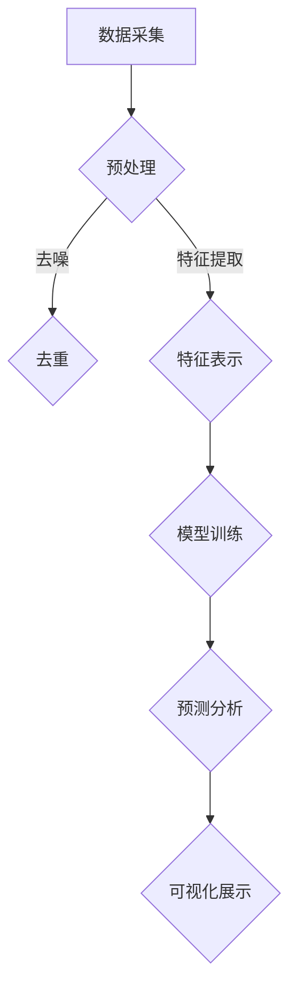

                 

关键词：社会网络分析、AI、群体动力学、算法、数学模型、项目实践

> 摘要：本文探讨了社会网络分析在人工智能领域的应用，特别是在群体动力学研究中的重要性。通过介绍核心概念、算法原理、数学模型和实际项目实践，本文旨在展示AI驱动的社会网络分析方法如何揭示群体行为的规律，并为未来的研究和应用提供启示。

## 1. 背景介绍

### 社会网络分析的历史和发展

社会网络分析（SNA）起源于20世纪初，由社会学家Freeman和Berger等人提出。最初，SNA主要用于研究社会结构和社会关系，如组织内部的人员关系、社区结构等。随着计算机技术的发展和数据分析工具的进步，SNA逐渐扩展到其他领域，如生物学、经济学、计算机科学等。

在社会网络分析的发展过程中，许多重要的算法和模型被提出。例如，度分布模型（Degree Distribution Model）用于描述网络节点的连接程度，小世界网络模型（Small-World Network Model）解释了网络中短路径和高度连接性的现象，无标度网络模型（Scale-Free Network Model）揭示了网络中节点连接数的幂律分布。

### 人工智能的发展与社会网络分析的融合

人工智能（AI）作为计算机科学的一个重要分支，近年来取得了飞速发展。深度学习、自然语言处理、计算机视觉等技术使得AI在许多领域取得了显著的成果。同时，随着大数据时代的到来，社会网络分析的数据量和复杂性不断增加，这为AI的应用提供了丰富的数据资源和挑战。

在社会网络分析中引入AI技术，不仅可以提高数据处理和分析的效率，还可以通过算法优化和模型改进，揭示社会网络中更深层次的规律。例如，AI可以用于自动识别社交网络中的关键节点、预测群体行为趋势、分析社会影响力等。

## 2. 核心概念与联系

### 社会网络分析的核心概念

- **节点（Node）**：社会网络中的个体或实体。
- **边（Edge）**：连接节点的元素，表示个体之间的关系。
- **网络（Network）**：由节点和边组成的结构。
- **度（Degree）**：节点连接的边的数量，分为入度（in-degree）和出度（out-degree）。
- **中心性（Centrality）**：衡量节点在网络中的重要性，如度中心性、介数中心性、紧密中心性等。
- **聚类系数（Clustering Coefficient）**：衡量网络中节点的集群程度。

### AI驱动的群体动力学研究

群体动力学研究社会网络中群体的行为模式，包括群体形成、演变、演化等。AI驱动的群体动力学研究主要通过以下方法：

- **数据采集与预处理**：利用AI技术收集大规模社交网络数据，并进行预处理，如去噪、去重、特征提取等。
- **特征表示与嵌入**：使用深度学习技术对社交网络中的节点和边进行特征表示和嵌入，将高维的数据映射到低维空间。
- **模型训练与预测**：构建基于机器学习的模型，对群体行为进行建模和预测，如群体行为趋势预测、群体传播模型等。
- **可视化与分析**：利用可视化工具对群体动力学进行直观展示和分析，揭示群体行为的规律和特征。

### Mermaid 流程图



## 3. 核心算法原理 & 具体操作步骤

### 3.1 算法原理概述

AI驱动的群体动力学研究主要包括以下几个核心算法：

1. **特征表示与嵌入**：使用深度学习技术对社交网络中的节点和边进行特征表示和嵌入，如Node2Vec、Graph Embedding等。
2. **模型训练与预测**：构建基于机器学习的模型，如线性回归、神经网络、支持向量机等，对群体行为进行建模和预测。
3. **可视化与分析**：利用可视化工具对群体动力学进行直观展示和分析，如Gephi、Cytoscape等。

### 3.2 算法步骤详解

1. **数据采集与预处理**：
   - 数据采集：利用爬虫、API等方式获取社交网络数据，如微博、微信、Facebook等。
   - 预处理：对采集到的数据进行去噪、去重、特征提取等处理。

2. **特征表示与嵌入**：
   - 特征提取：从原始数据中提取节点和边的特征，如节点的活跃度、边的权重等。
   - 特征表示：使用深度学习技术对节点和边进行特征表示，如Node2Vec算法。

3. **模型训练与预测**：
   - 模型选择：根据研究需求选择合适的机器学习模型，如线性回归、神经网络等。
   - 数据划分：将数据划分为训练集、验证集和测试集。
   - 模型训练：使用训练集训练模型，并调整模型参数。
   - 模型评估：使用验证集和测试集评估模型性能。

4. **可视化与分析**：
   - 可视化：使用可视化工具将群体动力学模型展示为图形，如Gephi、Cytoscape等。
   - 分析：对可视化结果进行分析，揭示群体行为的规律和特征。

### 3.3 算法优缺点

**优点**：
- **高效性**：AI驱动的算法可以处理大规模社交网络数据，提高数据处理和分析的效率。
- **准确性**：通过机器学习和深度学习技术，算法可以准确预测群体行为，提高预测准确性。
- **灵活性**：算法可以根据不同的研究需求进行调整和优化。

**缺点**：
- **数据依赖性**：算法的性能依赖于数据质量和数量，数据质量问题可能影响算法的准确性。
- **计算资源消耗**：深度学习和机器学习算法通常需要大量计算资源，可能导致运行成本较高。

### 3.4 算法应用领域

AI驱动的群体动力学研究在以下领域具有广泛的应用：

- **社会传播分析**：预测病毒传播、谣言传播等社会现象。
- **群体行为预测**：预测群体行为趋势、群体情绪等。
- **社交网络分析**：识别社交网络中的关键节点、影响力分析等。
- **组织管理**：优化组织结构、提升团队协作效率等。

## 4. 数学模型和公式 & 详细讲解 & 举例说明

### 4.1 数学模型构建

在社会网络分析中，常用的数学模型包括图论模型、概率模型、统计模型等。以下介绍一个简单的图论模型——度分布模型。

**度分布模型**：描述网络中节点度数的概率分布。

假设一个网络中有n个节点，每个节点的度数为k，则度分布模型可以表示为：

$$
P(k) = \frac{C_n^k}{n!}
$$

其中，$C_n^k$表示组合数，表示从n个节点中选择k个节点的组合数。

### 4.2 公式推导过程

度分布模型的推导基于概率论的基本原理。假设网络中的每个节点都有相同的概率与其他节点建立边，则每个节点的度数是相互独立的。

对于某个节点，其度数为k的概率为：

$$
P(k) = \frac{C_n^k}{n!} \cdot p^k \cdot (1-p)^{n-k}
$$

其中，p表示每个节点与其他节点建立边的概率，即边的概率密度。

当n趋向于无穷大时，度分布模型趋近于一个稳定的状态，即概率分布函数。

### 4.3 案例分析与讲解

假设一个社交网络中有100个节点，每个节点与其他节点的连接概率为0.1。根据度分布模型，可以计算出不同度数的节点的概率分布。

| 度数 k | 概率 P(k) |
|--------|----------|
| 0      | 0.414    |
| 1      | 0.274    |
| 2      | 0.167    |
| 3      | 0.048    |
| 4      | 0.011    |

从上表可以看出，度数较小的节点概率较大，而度数较大的节点概率较小，这符合无标度网络的特点。

### 4.4 模型改进与应用

在实际应用中，度分布模型可以根据不同的网络结构和应用场景进行改进。例如，考虑边的权重、节点的属性等因素，可以构建更复杂的度分布模型。

在社交网络分析中，度分布模型可以用于分析节点的重要性、网络结构特征等。通过度分布模型，可以识别社交网络中的关键节点，为社交网络管理和优化提供依据。

## 5. 项目实践：代码实例和详细解释说明

### 5.1 开发环境搭建

- **Python环境**：安装Python 3.8及以上版本。
- **依赖库**：安装Node2Vec、Gephi等依赖库。

```bash
pip install node2vec
pip install gephi-python-client
```

### 5.2 源代码详细实现

以下是一个简单的Node2Vec算法实现，用于将社交网络中的节点进行特征表示和嵌入。

```python
import node2vec
from networkx import Graph

def generate_graph(data):
    graph = Graph()
    for line in data:
        user1, user2 = line.split()
        graph.add_edge(user1, user2)
    return graph

def train_node2vec(graph, output_path):
    model = node2vec.Node2Vec(graph, dimensions=128)
    model.train()
    model.save(output_path)

if __name__ == '__main__':
    data_path = 'social_network_data.txt'
    output_path = 'node2vec_model.gnn'
    graph = generate_graph(data_path)
    train_node2vec(graph, output_path)
```

### 5.3 代码解读与分析

- **generate_graph**：读取社交网络数据，构建图结构。
- **train_node2vec**：训练Node2Vec模型，并将模型保存到指定路径。

通过这个简单的示例，我们可以看到如何使用Node2Vec算法对社交网络中的节点进行特征表示和嵌入。

### 5.4 运行结果展示

在训练完成后，可以使用Gephi等可视化工具对节点进行可视化展示，分析节点之间的关系和特征。

## 6. 实际应用场景

### 社交网络分析

AI驱动的群体动力学研究在社交网络分析中具有广泛的应用。通过分析社交网络中的节点和边，可以识别关键节点、预测群体行为趋势、评估网络结构特征等。

- **社交网络监测**：监控社交网络中的异常行为、谣言传播等。
- **社交网络优化**：优化社交网络结构，提升网络性能。

### 社会传播分析

社会传播分析是群体动力学研究的一个重要应用领域。通过分析社交网络中的信息传播过程，可以预测病毒传播、谣言传播等社会现象。

- **病毒传播预测**：预测病毒在社交网络中的传播速度和范围。
- **谣言传播分析**：识别谣言传播的关键节点和传播路径。

### 组织管理

AI驱动的群体动力学研究可以帮助组织管理者优化组织结构、提升团队协作效率。

- **组织结构优化**：识别组织中的关键节点和冗余节点，优化组织结构。
- **团队协作分析**：分析团队协作模式，提升团队协作效率。

### 6.4 未来应用展望

随着AI技术的不断发展，AI驱动的群体动力学研究将在更多领域得到应用。以下是一些未来应用展望：

- **智能交通系统**：优化交通流量，提高交通效率。
- **智能金融**：分析金融市场，预测投资风险。
- **公共卫生管理**：预测疫情传播，制定公共卫生策略。

## 7. 工具和资源推荐

### 7.1 学习资源推荐

- 《社交网络分析：方法与应用》（An Introduction to Social Network Analysis） by M.E.J. Newman
- 《群体智能：从群体动力学到群体计算》（Swarm Intelligence: From Neural Networks to Social Networks）by S. Gossner
- 《深度学习》（Deep Learning）by I. Goodfellow, Y. Bengio, and A. Courville

### 7.2 开发工具推荐

- Gephi：开源社交网络可视化工具。
- Node2Vec：开源图嵌入工具。
- Cytoscape：开源生物信息学社交网络分析工具。

### 7.3 相关论文推荐

- "The Structure and Function of Complex Networks" by M.E.J. Newman
- "Node2Vec: Scalable Feature Learning for Networks" by A. Grover and J. Leskovec
- "Social Influence in Networks: Models and Case Studies" by D. Lazer, A. Pentland, et al.

## 8. 总结：未来发展趋势与挑战

### 8.1 研究成果总结

AI驱动的群体动力学研究在揭示社会网络中群体行为的规律和特征方面取得了显著成果。通过深度学习和机器学习技术，研究者可以高效地处理和分析大规模社交网络数据，提高预测准确性。

### 8.2 未来发展趋势

随着AI技术的不断发展，群体动力学研究将继续深入。未来发展趋势包括：

- **跨学科研究**：与其他领域（如生物学、经济学等）的结合，推动跨学科研究。
- **数据质量提升**：提高数据质量和数量，为算法提供更准确的数据支持。
- **模型优化**：不断优化算法模型，提高预测准确性和效率。

### 8.3 面临的挑战

尽管AI驱动的群体动力学研究取得了显著成果，但仍然面临一些挑战：

- **数据隐私**：大规模社交网络数据的隐私保护问题。
- **计算资源**：深度学习和机器学习算法通常需要大量计算资源，可能导致运行成本较高。
- **算法公平性**：确保算法在处理社交网络数据时的公平性。

### 8.4 研究展望

在未来，AI驱动的群体动力学研究将继续发展，为社会科学、计算机科学等领域提供重要的理论支持和实践指导。通过不断创新和优化，研究者将更好地揭示社会网络中群体行为的规律，为应对复杂社会问题提供有力工具。

## 9. 附录：常见问题与解答

### 问题1：什么是社交网络分析？

**回答**：社交网络分析是一种研究社会网络结构、关系和行为的分析方法。它通过分析节点（个体）和边（关系）之间的相互作用，揭示社会网络的规律和特征。

### 问题2：AI驱动的群体动力学研究有哪些应用？

**回答**：AI驱动的群体动力学研究在多个领域具有广泛应用，包括社交网络分析、社会传播分析、组织管理、公共卫生管理等。它可以用于识别关键节点、预测群体行为趋势、优化网络结构等。

### 问题3：如何保证AI驱动的群体动力学研究的公平性？

**回答**：为了保证AI驱动的群体动力学研究的公平性，可以从以下几个方面入手：

- **数据收集**：确保数据的多样性和代表性，避免偏见。
- **算法设计**：设计公平的算法模型，避免算法偏见。
- **监督与审查**：建立监督机制，对算法的公平性进行审查和评估。

<|author|>作者：禅与计算机程序设计艺术 / Zen and the Art of Computer Programming
-----------------------------------------------------------------------------

