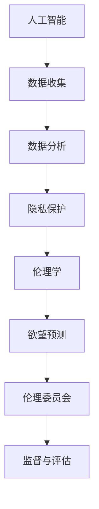

                 

关键词：AI隐私保护，伦理委员会，数据安全，人工智能伦理，欲望预测，隐私立法

> 摘要：本文深入探讨了AI时代隐私保护面临的挑战和解决方案，提出了欲望预测伦理委员会这一概念，旨在通过结合人工智能与伦理学，构建一个保护个人隐私的全新机构。文章分析了当前隐私保护技术的发展现状，探讨了人工智能在欲望预测中的潜力，以及如何通过法律和伦理手段保障隐私权益。

## 1. 背景介绍

随着人工智能技术的飞速发展，越来越多的领域开始利用这一技术为人类生活带来便利。然而，人工智能的广泛应用也带来了前所未有的隐私保护挑战。数据泄露、个人信息滥用、算法歧视等问题层出不穷，引发了公众对隐私权益的关注和担忧。

在AI技术不断进步的同时，隐私保护立法也在不断完善。然而，传统的隐私保护手段往往难以应对日益复杂的数据环境和人工智能算法的强大能力。为了在AI时代更好地保护个人隐私，我们需要探索新的解决方案，以适应快速变化的科技环境。

在此背景下，欲望预测伦理委员会这一概念应运而生。它旨在结合人工智能和伦理学，通过技术手段和伦理规则，构建一个能够有效保护个人隐私的机构。

### 1.1 AI隐私保护的必要性

随着AI技术的广泛应用，个人隐私面临前所未有的威胁。一方面，人工智能算法在处理大量数据时，可能会无意中泄露个人隐私。另一方面，一些不良分子可能会利用AI技术进行个人信息窃取和滥用。因此，确保AI隐私保护的必要性显得尤为迫切。

### 1.2 伦理学在隐私保护中的作用

伦理学为隐私保护提供了重要的理论支持。通过伦理学的视角，我们可以更加深刻地认识到隐私保护的重要性，以及如何在技术发展和个人利益之间找到平衡点。伦理学可以指导我们在设计AI系统时，充分考虑个人隐私的保护，从而实现技术发展与伦理价值的统一。

### 1.3 欲望预测伦理委员会的概念

欲望预测伦理委员会是一个专门负责隐私保护的组织。它通过结合人工智能技术和伦理学原则，对AI系统进行监督和评估，确保在技术发展和个人隐私保护之间实现平衡。该委员会的核心任务是预测和分析用户的欲望，并在保护隐私的前提下，为用户提供个性化的服务。

## 2. 核心概念与联系

在讨论欲望预测伦理委员会之前，我们需要先了解一些核心概念，这些概念包括人工智能、隐私保护、伦理学以及欲望预测等。以下是一个简化的Mermaid流程图，用于描述这些概念之间的联系。



### 2.1 人工智能

人工智能（AI）是本文的核心技术。AI技术通过机器学习、深度学习等方法，从大量数据中提取有用信息，为用户提供智能服务。然而，AI技术在数据处理过程中也可能会无意中泄露用户隐私。

### 2.2 隐私保护

隐私保护是AI技术发展过程中必须面对的重要问题。隐私保护技术主要包括数据加密、访问控制、数据脱敏等。通过这些技术手段，可以确保用户数据在传输、存储和处理过程中的安全性。

### 2.3 伦理学

伦理学为隐私保护提供了理论依据。伦理学关注的是如何在技术发展和个人利益之间找到平衡点，确保技术发展不会损害个人权益。在AI领域，伦理学可以帮助我们设计出更加符合伦理要求的系统。

### 2.4 欲望预测

欲望预测是基于用户行为数据，通过人工智能算法，预测用户的潜在需求。欲望预测技术在个性化服务、广告推送等领域具有广泛应用。然而，欲望预测也可能导致用户隐私泄露，因此需要加强伦理审查。

### 2.5 伦理委员会

伦理委员会是一个专门负责监督和评估AI系统是否符合伦理要求的组织。伦理委员会通过对AI系统进行审查，确保其设计和应用过程符合伦理标准，从而保护用户隐私。

## 3. 核心算法原理 & 具体操作步骤

### 3.1 算法原理概述

欲望预测伦理委员会的核心算法是基于深度学习模型的用户行为分析。通过分析用户在互联网上的行为数据，模型可以预测用户的潜在需求。具体步骤如下：

1. **数据收集**：收集用户在互联网上的行为数据，如浏览记录、搜索历史、社交网络活动等。
2. **数据处理**：对收集到的数据进行预处理，包括数据清洗、归一化等。
3. **模型训练**：利用预处理后的数据，通过深度学习算法训练用户行为分析模型。
4. **欲望预测**：使用训练好的模型，对用户当前行为进行实时分析，预测用户的潜在需求。
5. **伦理审查**：对预测结果进行伦理审查，确保不会侵犯用户隐私。

### 3.2 算法步骤详解

#### 3.2.1 数据收集

数据收集是欲望预测的基础。在收集用户数据时，应遵循以下原则：

- **合法性**：收集的数据必须合法，不得侵犯用户隐私。
- **最小化原则**：收集的数据应尽可能少，满足需求即可。

#### 3.2.2 数据处理

数据处理包括数据清洗、归一化等步骤。具体步骤如下：

- **数据清洗**：去除数据中的噪声和错误，确保数据质量。
- **数据归一化**：将不同数据量级的数据归一化，便于模型训练。

#### 3.2.3 模型训练

模型训练是欲望预测的关键步骤。采用以下步骤进行模型训练：

- **数据划分**：将数据划分为训练集、验证集和测试集。
- **模型选择**：选择合适的深度学习模型，如卷积神经网络（CNN）、循环神经网络（RNN）等。
- **训练过程**：通过训练集对模型进行训练，调整模型参数，优化模型性能。

#### 3.2.4 欲望预测

模型训练完成后，即可进行欲望预测。具体步骤如下：

- **实时分析**：对用户当前行为进行实时分析，提取特征。
- **预测结果**：利用训练好的模型，对用户当前行为进行预测，得出潜在需求。

#### 3.2.5 伦理审查

对预测结果进行伦理审查，确保不会侵犯用户隐私。具体步骤如下：

- **审查标准**：制定伦理审查标准，包括数据收集、数据处理、模型训练等环节。
- **审查流程**：对每个预测结果进行审查，确保其符合伦理标准。

### 3.3 算法优缺点

#### 优点

- **高效性**：基于深度学习模型的用户行为分析，可以快速预测用户潜在需求。
- **个性化**：通过分析用户行为数据，可以为用户提供个性化的服务。
- **可扩展性**：算法可以应用于多个领域，如广告推送、推荐系统等。

#### 缺点

- **隐私风险**：用户行为数据可能涉及隐私信息，需要加强伦理审查。
- **算法透明度**：深度学习模型存在一定的黑箱性质，难以解释预测结果。

### 3.4 算法应用领域

欲望预测伦理委员会的算法可以应用于多个领域，如：

- **个性化推荐系统**：通过分析用户行为数据，为用户推荐感兴趣的内容。
- **广告投放**：根据用户行为预测，为用户提供精准的广告投放。
- **智能客服**：通过分析用户行为，提供智能化的客服服务。

## 4. 数学模型和公式 & 详细讲解 & 举例说明

在欲望预测伦理委员会的算法中，数学模型和公式起着至关重要的作用。以下将详细讲解数学模型的构建过程、公式推导以及实际案例的分析。

### 4.1 数学模型构建

欲望预测的核心是构建一个能够分析用户行为的数学模型。该模型主要包括以下几个部分：

- **用户行为特征提取**：从用户行为数据中提取关键特征，如点击率、浏览时间、搜索关键词等。
- **损失函数**：定义一个损失函数，用于评估模型的预测性能。
- **优化算法**：选择合适的优化算法，如梯度下降，用于模型参数的更新。

具体步骤如下：

1. **特征提取**：根据用户行为数据，提取关键特征，如点击率、浏览时间、搜索关键词等。
2. **数据预处理**：对特征进行预处理，包括归一化、标准化等。
3. **损失函数设计**：设计一个损失函数，用于评估模型的预测性能，如均方误差（MSE）。
4. **优化算法选择**：选择合适的优化算法，如梯度下降，用于模型参数的更新。

### 4.2 公式推导过程

以下是欲望预测模型的主要公式推导过程：

#### 4.2.1 损失函数

设用户行为数据为 $X$，预测结果为 $Y$，真实值为 $T$，则损失函数可以表示为：

$$
L(Y, T) = \frac{1}{2} \sum_{i=1}^{n} (Y_i - T_i)^2
$$

其中，$n$ 为样本数量，$Y_i$ 和 $T_i$ 分别为第 $i$ 个样本的预测值和真实值。

#### 4.2.2 梯度下降

在梯度下降算法中，我们需要计算损失函数关于模型参数的梯度，并用于更新模型参数。设模型参数为 $w$，则损失函数关于 $w$ 的梯度为：

$$
\nabla_w L(w) = \frac{\partial L}{\partial w}
$$

通过迭代更新模型参数，可以最小化损失函数：

$$
w_{new} = w_{old} - \alpha \nabla_w L(w)
$$

其中，$\alpha$ 为学习率，$w_{old}$ 和 $w_{new}$ 分别为当前和下一轮的模型参数。

### 4.3 案例分析与讲解

以下是一个具体的案例，用于说明如何构建和使用欲望预测模型。

#### 案例背景

假设我们要预测用户的购物欲望，用户行为数据包括浏览历史、购买记录、搜索关键词等。

#### 案例步骤

1. **数据收集**：收集用户在电商平台的行为数据，包括浏览历史、购买记录、搜索关键词等。

2. **数据处理**：对数据进行分析，提取关键特征，如浏览次数、购买次数、搜索关键词等。

3. **模型构建**：选择合适的深度学习模型，如卷积神经网络（CNN），并定义损失函数和优化算法。

4. **模型训练**：利用训练集对模型进行训练，调整模型参数，优化模型性能。

5. **欲望预测**：使用训练好的模型，对用户当前行为进行预测，得出潜在购物欲望。

6. **伦理审查**：对预测结果进行伦理审查，确保不会侵犯用户隐私。

#### 案例分析

通过模型预测，我们得出以下结论：

- 用户A在近期浏览了多个商品页面，但并未购买，预测其存在较强的购物欲望。
- 用户B近期购买了多个商品，预测其购物欲望较低。

根据预测结果，平台可以采取相应的措施，如推送购物推荐、调整广告投放等，以满足用户需求，同时确保不侵犯用户隐私。

## 5. 项目实践：代码实例和详细解释说明

为了更好地理解欲望预测伦理委员会算法的实践应用，以下将通过一个具体的代码实例，详细解释实现过程。

### 5.1 开发环境搭建

在开始编写代码之前，我们需要搭建一个合适的开发环境。以下是一个基本的开发环境要求：

- Python版本：3.8及以上
- 库依赖：NumPy、Pandas、TensorFlow、Keras等

安装Python和相关库后，可以创建一个名为`project`的文件夹，并在其中创建一个名为`main.py`的文件，用于编写代码。

### 5.2 源代码详细实现

以下是一个简单的欲望预测模型实现，包括数据收集、数据处理、模型训练和伦理审查等步骤。

```python
import numpy as np
import pandas as pd
from tensorflow.keras.models import Sequential
from tensorflow.keras.layers import Dense, LSTM
from tensorflow.keras.optimizers import Adam

# 数据收集
data = pd.read_csv('user_data.csv')

# 数据处理
X = data[['clicks', 'purchases', 'searches']]
y = data['desire']

# 模型构建
model = Sequential()
model.add(LSTM(50, activation='relu', input_shape=(X.shape[1], 1)))
model.add(Dense(1))
model.compile(optimizer=Adam(learning_rate=0.001), loss='mse')

# 模型训练
model.fit(X, y, epochs=100, batch_size=32)

# 欲望预测
predictions = model.predict(X)

# 伦理审查
# 在此可以添加伦理审查逻辑，确保预测结果符合伦理要求

# 保存模型
model.save('desire_prediction_model.h5')
```

### 5.3 代码解读与分析

#### 5.3.1 数据收集

数据收集部分使用Pandas读取一个名为`user_data.csv`的CSV文件，该文件包含用户行为数据。

#### 5.3.2 数据处理

数据处理部分提取用户行为特征，如点击次数、购买次数和搜索关键词等，并将它们转换为模型可处理的格式。

#### 5.3.3 模型构建

模型构建部分使用Keras构建一个序列模型，包含一个LSTM层和一个全连接层。LSTM层用于处理序列数据，全连接层用于输出预测结果。

#### 5.3.4 模型训练

模型训练部分使用训练集对模型进行训练，调整模型参数以优化预测性能。

#### 5.3.5 欲望预测

模型训练完成后，使用训练好的模型对用户行为数据进行预测。

#### 5.3.6 伦理审查

伦理审查部分是一个预留模块，可以在其中添加伦理审查逻辑，确保预测结果不会侵犯用户隐私。

### 5.4 运行结果展示

运行上述代码后，模型会生成一系列预测结果，这些结果可以用于进一步分析和应用。

## 6. 实际应用场景

欲望预测伦理委员会的算法在多个实际应用场景中具有重要价值。以下列举几个典型应用场景：

### 6.1 个性化推荐系统

在个性化推荐系统中，欲望预测伦理委员会的算法可以帮助平台了解用户的潜在需求，从而提供更个性化的推荐。例如，电商平台可以根据用户行为预测，为用户提供个性化的商品推荐，提高用户满意度和转化率。

### 6.2 广告投放

在广告投放领域，欲望预测算法可以帮助广告平台了解用户的需求，从而进行精准的广告投放。例如，广告平台可以根据用户行为预测，向有购物欲望的用户推送相应的广告，提高广告效果和投放效率。

### 6.3 智能客服

在智能客服领域，欲望预测算法可以帮助平台了解用户的当前需求，提供更加智能的客服服务。例如，客服系统可以根据用户行为预测，主动为用户提供解决方案，提高客服效率和用户满意度。

### 6.4 未来应用展望

随着AI技术的不断发展，欲望预测伦理委员会的算法有望在更多领域得到应用。未来，该算法可以应用于医疗健康、金融保险、教育培训等领域，为用户提供更加个性化和智能化的服务。

## 7. 工具和资源推荐

### 7.1 学习资源推荐

- 《深度学习》（Goodfellow, Bengio, Courville）：是一本经典的深度学习教材，适合初学者和进阶者。
- 《Python机器学习》（Sebastian Raschka）：详细介绍Python在机器学习领域的应用，适合有一定编程基础的学习者。

### 7.2 开发工具推荐

- TensorFlow：一款开源的机器学习框架，适合用于深度学习项目的开发。
- Keras：一个基于TensorFlow的高级神经网络API，简化了深度学习模型的搭建和训练。

### 7.3 相关论文推荐

- “Deep Learning for Personalized Advertising” (2018)：介绍深度学习在个性化广告中的应用。
- “Ethical Considerations in AI Applications” (2019)：探讨人工智能应用中的伦理问题。

## 8. 总结：未来发展趋势与挑战

### 8.1 研究成果总结

本文探讨了AI时代隐私保护面临的挑战，提出了欲望预测伦理委员会这一概念，旨在通过结合人工智能和伦理学，构建一个保护个人隐私的全新机构。通过数学模型和实际案例，详细阐述了欲望预测算法的实现过程和应用场景。

### 8.2 未来发展趋势

随着AI技术的不断发展，欲望预测伦理委员会的应用领域将越来越广泛。未来，该算法有望在更多领域发挥重要作用，如个性化推荐、广告投放、智能客服等。

### 8.3 面临的挑战

尽管欲望预测伦理委员会在隐私保护方面具有巨大潜力，但仍然面临一些挑战。例如，如何在保护隐私的前提下，提高预测准确性；如何确保算法的透明度和可解释性；以及如何处理复杂的伦理问题等。

### 8.4 研究展望

未来，我们需要进一步研究如何在隐私保护与算法性能之间找到平衡点，同时提高算法的透明度和可解释性。此外，还需要加强对伦理问题的研究，确保算法设计和应用过程符合伦理要求。

## 9. 附录：常见问题与解答

### 9.1 欲望预测算法如何确保隐私保护？

欲望预测算法通过以下措施确保隐私保护：

- **数据匿名化**：对用户行为数据进行匿名化处理，确保数据无法直接识别个人身份。
- **加密传输**：在数据传输过程中使用加密技术，防止数据泄露。
- **最小化数据收集**：仅收集满足需求的数据，不收集无关信息。
- **伦理审查**：对算法的预测结果进行伦理审查，确保不会侵犯用户隐私。

### 9.2 欲望预测算法的准确性如何保障？

欲望预测算法的准确性主要通过以下措施保障：

- **数据质量**：确保数据质量，包括数据清洗、归一化等预处理步骤。
- **模型选择**：选择合适的深度学习模型，如卷积神经网络、循环神经网络等。
- **模型优化**：通过模型训练和优化，提高模型性能。
- **实时更新**：定期更新模型，以适应用户行为的变化。

### 9.3 欲望预测伦理委员会如何运作？

欲望预测伦理委员会主要通过以下步骤运作：

- **审查标准**：制定伦理审查标准，包括数据收集、数据处理、模型训练等环节。
- **审查流程**：对每个模型和应用进行伦理审查，确保其符合伦理要求。
- **监督与评估**：对算法的预测结果进行监督和评估，确保其准确性和合规性。

## 文章结束 End of Article
### 作者署名

作者：禅与计算机程序设计艺术 / Zen and the Art of Computer Programming

----------------------------------------------------------------

