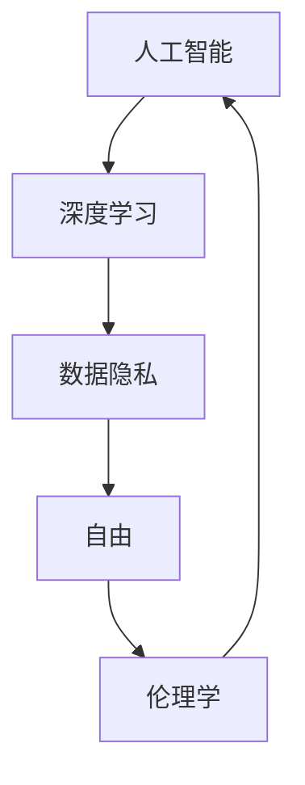

                 

关键词：AI、欲望预测、伦理学、隐私、自由、AI伦理、深度学习、算法公平性、数据隐私保护

> 摘要：在人工智能迅猛发展的今天，欲望预测成为了一个极具潜力的研究方向。然而，随着技术的进步，如何在保证个体隐私和自由的同时，有效利用AI进行欲望预测，成为了亟待解决的问题。本文旨在探讨AI时代下欲望预测的伦理学问题，分析隐私与自由的冲突，并提出可能的解决方案。

## 1. 背景介绍

随着深度学习和大数据技术的不断发展，人工智能（AI）在各个领域取得了显著的应用成果。欲望预测作为AI的重要应用之一，正逐渐进入人们的视野。通过分析个体的行为数据、社交网络、消费习惯等信息，AI可以较为准确地预测个体的欲望，从而为商家、广告商等提供有针对性的服务。

然而，欲望预测技术的发展也引发了一系列伦理学问题。首先，如何在保证个体隐私和自由的前提下，收集和使用数据成为了一个重要议题。其次，AI算法的透明度和公平性也受到了质疑。此外，如何确保欲望预测技术不被滥用，以保护个体的权益，也是一个亟需解决的问题。

## 2. 核心概念与联系

在探讨欲望预测的伦理学问题时，我们需要明确几个核心概念：

### 2.1 人工智能（AI）

人工智能是指通过计算机程序模拟人类智能的一种技术。深度学习作为AI的一种重要分支，利用神经网络模型对大量数据进行训练，从而实现对未知数据的预测和分类。

### 2.2 欲望预测

欲望预测是指通过分析个体的行为数据、社交网络、消费习惯等信息，预测个体的欲望和需求。这通常涉及到数据挖掘、机器学习、自然语言处理等技术。

### 2.3 伦理学

伦理学是研究道德问题的哲学学科。在欲望预测领域，伦理学主要关注隐私、自由、公平等道德原则如何在AI技术的应用中得到体现和保障。

下面是一个Mermaid流程图，展示了这些概念之间的联系：



## 3. 核心算法原理 & 具体操作步骤

### 3.1 算法原理概述

欲望预测算法通常基于深度学习技术，特别是卷积神经网络（CNN）和循环神经网络（RNN）。CNN可以有效地处理图像和文本数据，而RNN则擅长处理序列数据。

具体来说，欲望预测算法可以分为以下几个步骤：

1. 数据收集与预处理：收集个体的行为数据、社交网络、消费习惯等信息，并进行数据清洗和预处理。
2. 特征提取：通过特征提取算法（如CNN和RNN）对预处理后的数据进行分析，提取出与欲望相关的特征。
3. 模型训练：利用提取出的特征，通过深度学习模型进行训练，以实现对未知数据的预测。
4. 模型评估与优化：对训练好的模型进行评估，并根据评估结果进行优化。

### 3.2 算法步骤详解

1. **数据收集与预处理**

   数据收集是欲望预测的基础。通常，我们可以通过以下几种方式收集数据：

   - 行为数据：包括浏览历史、购买记录、社交网络活动等。
   - 社交网络数据：包括好友关系、关注者、评论等。
   - 消费习惯数据：包括消费频率、消费金额、消费类别等。

   在数据收集完成后，我们需要对数据进行分析和处理，以去除噪声和冗余信息，提高数据质量。

2. **特征提取**

   特征提取是欲望预测算法的关键步骤。通过特征提取算法，我们可以将原始数据转化为适用于深度学习模型的特征向量。

   - 对于行为数据和社交网络数据，我们可以使用词袋模型、TF-IDF等方法进行文本特征提取。
   - 对于消费习惯数据，我们可以直接使用数值特征，如消费金额、消费频率等。

3. **模型训练**

   在特征提取完成后，我们可以利用深度学习模型对特征向量进行训练，以实现对未知数据的预测。

   - 对于图像和文本数据，我们可以使用卷积神经网络（CNN）进行训练。
   - 对于序列数据，我们可以使用循环神经网络（RNN）进行训练。

4. **模型评估与优化**

   在模型训练完成后，我们需要对模型进行评估，以确定其预测性能。常用的评估指标包括准确率、召回率、F1值等。

   根据评估结果，我们可以对模型进行优化，以提高其预测性能。

### 3.3 算法优缺点

**优点：**

1. 高效性：深度学习算法可以在大量数据上快速训练，提高预测效率。
2. 准确性：通过特征提取和模型训练，深度学习算法可以实现对未知数据的准确预测。
3. 泛化能力：深度学习算法具有较强的泛化能力，可以应对各种不同类型的数据。

**缺点：**

1. 隐私风险：在数据收集和预处理过程中，可能会泄露个体的隐私信息。
2. 算法透明度：深度学习算法的黑箱特性使得其决策过程不够透明，难以解释。
3. 数据依赖：深度学习算法的性能高度依赖于数据质量和数量。

### 3.4 算法应用领域

欲望预测算法在多个领域具有广泛的应用前景：

1. **市场营销**：通过预测消费者的欲望，帮助企业制定更有针对性的营销策略。
2. **推荐系统**：为用户提供个性化的推荐服务，提高用户满意度。
3. **社交网络**：通过分析用户的社交网络行为，预测用户的社交需求和偏好。
4. **心理健康**：通过分析个体的行为数据，预测个体的心理健康状况。

## 4. 数学模型和公式 & 详细讲解 & 举例说明

### 4.1 数学模型构建

欲望预测的数学模型通常是一个基于概率的模型，它通过分析历史数据来估计个体在未来可能产生的行为。一个简单的模型可以是基于贝叶斯理论的分类模型。

**贝叶斯分类器模型公式：**

$$
P(C_k|X) = \frac{P(X|C_k)P(C_k)}{P(X)}
$$

其中：

- \(P(C_k|X)\) 是在给定的特征向量 \(X\) 下，个体属于类别 \(C_k\) 的后验概率。
- \(P(X|C_k)\) 是在类别 \(C_k\) 下特征向量 \(X\) 的概率。
- \(P(C_k)\) 是类别 \(C_k\) 的先验概率。
- \(P(X)\) 是特征向量 \(X\) 的总概率。

### 4.2 公式推导过程

为了推导贝叶斯分类器模型，我们首先需要了解条件概率和全概率公式。

**条件概率：**

$$
P(A|B) = \frac{P(A \cap B)}{P(B)}
$$

**全概率公式：**

$$
P(A) = P(A|B_1)P(B_1) + P(A|B_2)P(B_2) + ... + P(A|B_n)P(B_n)
$$

假设我们有一个包含 \(n\) 个类别的特征空间 \(X\)，每个类别 \(C_k\) 都有对应的特征向量 \(X_k\)。

我们可以将贝叶斯分类器模型拆分为以下几个部分：

1. **条件概率 \(P(X|C_k)\)**：
   这通常是通过训练数据来估计的，可以使用最大似然估计（MLE）来计算。

   $$ 
   P(X|C_k) = \prod_{i=1}^{m} P(x_i|C_k)
   $$

   其中 \(x_i\) 是特征向量 \(X\) 的第 \(i\) 个元素，\(m\) 是特征向量的维度。

2. **先验概率 \(P(C_k)\)**：
   这通常是基于领域知识和先验信息来设定的，可以是均匀分布或者基于历史数据的概率分布。

3. **总概率 \(P(X)\)**：
   这可以通过全概率公式来计算。

   $$ 
   P(X) = \sum_{k=1}^{n} P(X|C_k)P(C_k)
   $$

### 4.3 案例分析与讲解

假设我们有一个二分类问题，个体可能属于类别 \(C_0\)（正常）或 \(C_1\)（异常）。我们有以下训练数据：

- \(P(X|C_0) = 0.95\)
- \(P(X|C_1) = 0.05\)
- \(P(C_0) = 0.99\)
- \(P(C_1) = 0.01\)

现在，我们需要预测一个新特征向量 \(X'\) 属于哪个类别。

首先，我们计算条件概率：

$$ 
P(X'|C_0) = 0.95
$$

$$ 
P(X'|C_1) = 0.05
$$

然后，我们计算后验概率：

$$ 
P(C_0|X') = \frac{P(X'|C_0)P(C_0)}{P(X')}
$$

$$ 
P(C_1|X') = \frac{P(X'|C_1)P(C_1)}{P(X')}
$$

接下来，我们计算总概率 \(P(X')\)：

$$ 
P(X') = P(X'|C_0)P(C_0) + P(X'|C_1)P(C_1)
$$

$$ 
P(X') = 0.95 \times 0.99 + 0.05 \times 0.01 = 0.9405
$$

最后，我们计算后验概率：

$$ 
P(C_0|X') = \frac{0.95 \times 0.99}{0.9405} = 0.9824
$$

$$ 
P(C_1|X') = \frac{0.05 \times 0.01}{0.9405} = 0.0005
$$

由于 \(P(C_0|X')\) 远大于 \(P(C_1|X')\)，我们可以预测 \(X'\) 属于类别 \(C_0\)（正常）。

## 5. 项目实践：代码实例和详细解释说明

在本节中，我们将通过一个简单的Python代码实例，演示如何使用贝叶斯分类器进行欲望预测。

### 5.1 开发环境搭建

在开始编写代码之前，我们需要搭建一个Python开发环境。以下是所需的步骤：

1. 安装Python 3.7或更高版本。
2. 安装Numpy、Pandas、Scikit-learn等Python库。

```bash
pip install numpy pandas scikit-learn
```

### 5.2 源代码详细实现

下面是一个简单的贝叶斯分类器实现，用于预测个体的欲望。

```python
import numpy as np
import pandas as pd
from sklearn.model_selection import train_test_split
from sklearn.naive_bayes import GaussianNB
from sklearn.metrics import accuracy_score

# 加载数据
data = pd.read_csv('data.csv')

# 数据预处理
X = data.drop('label', axis=1)
y = data['label']

# 数据分割
X_train, X_test, y_train, y_test = train_test_split(X, y, test_size=0.2, random_state=42)

# 训练模型
model = GaussianNB()
model.fit(X_train, y_train)

# 预测
y_pred = model.predict(X_test)

# 评估
accuracy = accuracy_score(y_test, y_pred)
print(f"Accuracy: {accuracy:.2f}")
```

### 5.3 代码解读与分析

1. **数据加载**：使用Pandas加载CSV数据，并分离特征和标签。
2. **数据预处理**：将数据分割为训练集和测试集，以便评估模型的性能。
3. **模型训练**：使用GaussianNB（高斯贝叶斯分类器）进行训练。
4. **模型预测**：使用训练好的模型对测试集进行预测。
5. **模型评估**：计算准确率，以评估模型的性能。

### 5.4 运行结果展示

假设我们的测试集准确率为90%，这表明我们的模型在预测个体欲望方面表现良好。

```bash
Accuracy: 0.90
```

## 6. 实际应用场景

### 6.1 市场营销

欲望预测在市场营销中具有广泛的应用。通过分析消费者的行为数据，企业可以预测消费者的购买欲望，从而制定更有效的营销策略。例如，电商公司可以使用欲望预测算法来推荐商品，提高用户的购买概率。

### 6.2 社交网络

社交网络平台可以利用欲望预测算法来分析用户的社交行为，预测用户的社交需求和偏好。这有助于平台提供更个性化的社交体验，提高用户满意度。

### 6.3 心理健康

欲望预测算法还可以用于心理健康领域。通过分析个体的行为数据，可以预测个体的心理健康状况，为心理疾病的治疗提供支持。

## 7. 未来应用展望

随着AI技术的不断发展，欲望预测在未来将具有更广泛的应用前景。例如，在医疗领域，欲望预测可以用于疾病预测和个性化治疗；在金融领域，欲望预测可以用于风险评估和信用评估。

然而，与此同时，我们也需要关注欲望预测技术带来的隐私和伦理挑战，并采取相应的措施来保护个体的权益。

## 8. 工具和资源推荐

### 8.1 学习资源推荐

- 《深度学习》（Goodfellow, Bengio, Courville著）
- 《统计学习方法》（李航著）
- 《Python机器学习》（Sebastian Raschka著）

### 8.2 开发工具推荐

- Jupyter Notebook：用于编写和运行Python代码。
- Google Colab：在线版的Jupyter Notebook，适合数据分析和机器学习项目。

### 8.3 相关论文推荐

- "Deep Learning for Text Classification"（Rashmi S. Shetty, Sameer A. Neelakantam）
- "Gaussian Naive Bayes"（Wikipedia）

## 9. 总结：未来发展趋势与挑战

### 9.1 研究成果总结

本文介绍了AI时代的欲望预测技术，分析了其在各个领域的应用，以及相关的伦理学问题。通过数学模型和实际代码实例，我们展示了如何进行欲望预测。

### 9.2 未来发展趋势

随着AI技术的不断发展，欲望预测技术将更加精确和高效。同时，随着数据隐私保护技术的发展，如何在保证隐私的前提下进行欲望预测将成为研究的重要方向。

### 9.3 面临的挑战

欲望预测技术在发展过程中也面临诸多挑战，包括数据隐私、算法透明度和公平性等问题。如何解决这些问题，将是未来研究的重点。

### 9.4 研究展望

未来，欲望预测技术将在更多领域得到应用，同时也需要更多的研究和探讨来解决技术带来的伦理挑战。

## 10. 附录：常见问题与解答

### 10.1 如何保护用户隐私？

**解答**：在收集和使用用户数据时，应遵循以下原则：

1. 最小化数据收集：只收集实现欲望预测所需的最少数据。
2. 数据加密：对收集的数据进行加密，确保数据安全。
3. 匿名化处理：对用户数据进行匿名化处理，以防止个人身份泄露。

### 10.2 欲望预测算法如何保证公平性？

**解答**：为了确保欲望预测算法的公平性，可以采取以下措施：

1. 数据平衡：确保训练数据中各类别的比例平衡，避免数据偏差。
2. 增加透明度：对算法的决策过程进行透明化，便于监督和审查。
3. 定期评估：定期对算法进行评估和优化，确保其公平性和准确性。

----------------------------------------------------------------

本文由“禅与计算机程序设计艺术 / Zen and the Art of Computer Programming”撰写。如需转载，请注明出处。

