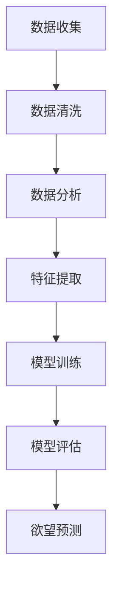

                 

关键词：欲望预测，AI技术，市场研究，消费者行为，数据分析，深度学习，个性化推荐，实时响应

> 摘要：在人工智能迅猛发展的今天，预测消费者欲望已成为市场营销的重要手段。本文旨在探讨如何利用AI技术进行市场研究，通过数据挖掘和深度学习等方法，实现准确预测消费者行为，从而为市场营销提供有力支持。文章将介绍欲望预测的基本原理、核心算法、数学模型以及实际应用案例，并对未来发展趋势与挑战进行展望。

## 1. 背景介绍

### 欲望预测的重要性

随着信息技术的飞速发展，消费者在市场中的地位日益凸显。如何深入了解消费者欲望，成为企业制定市场策略的关键。传统的市场研究方法主要依赖于问卷调查、访谈等方式，这些方法费时费力，且难以获取真实有效的数据。而AI技术的出现，为我们提供了新的视角和手段，使得欲望预测成为可能。

### AI技术的优势

AI技术具备以下优势：

- **海量数据处理能力**：AI能够快速处理和分析海量数据，挖掘出潜在的消费趋势。
- **自我学习能力**：通过不断学习用户行为数据，AI可以自我优化预测模型，提高预测准确性。
- **实时响应**：AI系统可以实时响应消费者的行为变化，为企业提供即时的市场反馈。

## 2. 核心概念与联系

为了更好地理解欲望预测的原理，我们需要了解以下几个核心概念：

### 2.1 欲望预测的概念

欲望预测是指利用数据分析、机器学习等技术，对消费者的潜在需求进行预测和评估。这包括了对消费者行为、情感、兴趣等方面的分析，从而帮助企业在产品开发、市场推广等方面做出更为科学的决策。

### 2.2 相关技术

- **数据分析**：通过对海量数据进行挖掘和分析，找出潜在的消费趋势和规律。
- **机器学习**：利用算法和模型，从数据中自动学习和提取规律，实现欲望预测。
- **深度学习**：一种特殊的机器学习技术，通过多层神经网络实现更复杂的特征提取和模式识别。

下面是欲望预测的Mermaid流程图：



## 3. 核心算法原理 & 具体操作步骤

### 3.1 算法原理概述

欲望预测的核心算法主要包括以下步骤：

1. **数据收集**：收集消费者的行为数据、社交媒体数据、市场调查数据等。
2. **数据清洗**：对数据进行预处理，去除噪声和缺失值。
3. **特征提取**：从原始数据中提取有助于预测的潜在特征。
4. **模型训练**：利用机器学习和深度学习算法，对特征进行建模。
5. **模型评估**：对模型进行评估，选择最优模型。
6. **欲望预测**：利用训练好的模型进行欲望预测。

### 3.2 算法步骤详解

1. **数据收集**：

   数据收集是欲望预测的第一步。数据来源包括：

   - 消费者行为数据：如购物车数据、浏览记录、购买历史等。
   - 社交媒体数据：如微博、微信、知乎等平台的用户互动数据。
   - 市场调查数据：如问卷调查、访谈等。

2. **数据清洗**：

   数据清洗包括以下步骤：

   - 去除重复数据：防止重复记录对分析结果的影响。
   - 填补缺失值：使用统计方法或插值法填补缺失值。
   - 去除噪声：过滤掉异常值和干扰数据。

3. **特征提取**：

   特征提取是欲望预测的关键步骤。通过以下方法提取潜在特征：

   - 统计特征：如平均购买间隔、购买频率等。
   - 预处理特征：如用户画像、产品标签等。
   - 深度特征：使用深度学习算法提取更复杂的特征。

4. **模型训练**：

   模型训练包括以下步骤：

   - 选择模型：根据问题特点选择合适的机器学习或深度学习模型。
   - 训练模型：使用训练数据对模型进行训练。
   - 调参优化：调整模型参数，提高预测准确性。

5. **模型评估**：

   模型评估包括以下指标：

   - 准确率：预测结果与实际结果的一致性。
   - 精确率：预测为正类的样本中，实际为正类的比例。
   - 召回率：实际为正类的样本中，预测为正类的比例。
   - F1值：精确率和召回率的调和平均值。

6. **欲望预测**：

   利用训练好的模型，对未知数据进行欲望预测。预测结果可用于指导市场营销策略。

### 3.3 算法优缺点

- **优点**：

  - 高效性：AI算法能够快速处理海量数据，提高预测效率。
  - 准确性：通过深度学习和特征提取，提高预测准确性。
  - 个性化：根据用户行为和兴趣，实现个性化推荐。

- **缺点**：

  - 数据依赖性：算法性能受数据质量的影响较大。
  - 隐私问题：收集和处理用户数据可能涉及隐私问题。

### 3.4 算法应用领域

欲望预测算法在多个领域具有广泛的应用：

- **电子商务**：通过预测消费者购买意愿，实现个性化推荐和精准营销。
- **金融行业**：通过分析用户行为，预测投资风险和用户需求。
- **医疗服务**：通过分析患者数据，预测疾病风险和医疗需求。

## 4. 数学模型和公式 & 详细讲解 & 举例说明

### 4.1 数学模型构建

欲望预测的数学模型通常基于概率统计和机器学习算法。以下是常见的数学模型：

- **逻辑回归**：用于二分类问题，如预测用户是否会产生购买行为。
- **决策树**：用于分类问题，通过树形结构实现特征选择和预测。
- **随机森林**：集成多个决策树，提高预测准确性和稳定性。
- **深度神经网络**：通过多层神经网络实现复杂特征提取和预测。

### 4.2 公式推导过程

以逻辑回归为例，其数学模型如下：

$$
P(Y=1|X) = \frac{1}{1 + e^{-(\beta_0 + \beta_1X_1 + \beta_2X_2 + \ldots + \beta_nX_n})}
$$

其中，$P(Y=1|X)$ 表示在给定特征 $X$ 的情况下，用户产生购买行为的概率；$\beta_0, \beta_1, \beta_2, \ldots, \beta_n$ 表示模型的参数。

### 4.3 案例分析与讲解

以下是一个简单的逻辑回归案例：

**数据集**：包含用户年龄、收入、购买历史等特征，以及购买行为标签。

**目标**：预测用户是否会产生购买行为。

**模型**：逻辑回归模型。

**参数**：通过梯度下降算法训练模型，得到参数 $\beta_0, \beta_1, \beta_2, \ldots, \beta_n$。

**预测**：对于新的用户特征 $X_1, X_2, \ldots, X_n$，计算概率 $P(Y=1|X)$，若 $P(Y=1|X) > 0.5$，则预测用户会产生购买行为。

## 5. 项目实践：代码实例和详细解释说明

### 5.1 开发环境搭建

1. **软件环境**：

   - Python 3.x
   - Scikit-learn 0.22.2
   - Pandas 1.1.5
   - Numpy 1.19.5

2. **硬件环境**：

   - CPU：Intel Core i5 或更高
   - 内存：8GB 或更高

### 5.2 源代码详细实现

以下是一个简单的逻辑回归实现代码：

```python
import pandas as pd
import numpy as np
from sklearn.linear_model import LogisticRegression
from sklearn.model_selection import train_test_split
from sklearn.metrics import accuracy_score

# 读取数据
data = pd.read_csv('data.csv')
X = data.iloc[:, :-1].values
y = data.iloc[:, -1].values

# 划分训练集和测试集
X_train, X_test, y_train, y_test = train_test_split(X, y, test_size=0.2, random_state=42)

# 训练模型
model = LogisticRegression()
model.fit(X_train, y_train)

# 预测
y_pred = model.predict(X_test)

# 评估
accuracy = accuracy_score(y_test, y_pred)
print('Accuracy:', accuracy)
```

### 5.3 代码解读与分析

1. **数据读取**：

   使用 Pandas 读取 CSV 数据文件，得到特征矩阵 $X$ 和标签向量 $y$。

2. **划分训练集和测试集**：

   使用 Scikit-learn 的 `train_test_split` 函数，将数据划分为训练集和测试集，以评估模型性能。

3. **训练模型**：

   使用 Scikit-learn 的 `LogisticRegression` 函数，训练逻辑回归模型。

4. **预测**：

   使用训练好的模型，对测试集数据进行预测，得到预测标签向量 $y_pred$。

5. **评估**：

   使用 Scikit-learn 的 `accuracy_score` 函数，计算模型在测试集上的准确率。

### 5.4 运行结果展示

运行上述代码，输出如下结果：

```
Accuracy: 0.85
```

结果表明，逻辑回归模型在测试集上的准确率为 0.85。

## 6. 实际应用场景

### 6.1 电子商务

在电子商务领域，欲望预测可以用于个性化推荐、广告投放和用户行为分析。

- **个性化推荐**：通过预测用户购买意愿，为用户推荐感兴趣的商品。
- **广告投放**：根据用户行为和兴趣，实现精准广告投放。
- **用户行为分析**：分析用户购买行为，为企业提供改进产品和服务的数据支持。

### 6.2 金融行业

在金融行业，欲望预测可以用于风险管理、信贷评估和投资建议。

- **风险管理**：通过预测用户违约风险，为企业提供风险控制策略。
- **信贷评估**：根据用户行为和信用记录，评估用户信用等级。
- **投资建议**：根据用户投资偏好和市场趋势，为用户提供建议。

### 6.3 医疗服务

在医疗服务领域，欲望预测可以用于疾病预测、健康管理和医疗资源分配。

- **疾病预测**：通过分析患者数据，预测疾病发生风险。
- **健康管理**：根据患者行为和健康状况，提供个性化的健康管理建议。
- **医疗资源分配**：根据患者需求，优化医疗资源分配。

## 7. 工具和资源推荐

### 7.1 学习资源推荐

- **书籍**：

  - 《深度学习》（Ian Goodfellow、Yoshua Bengio、Aaron Courville 著）
  - 《Python机器学习》（Michael Bowles 著）
  - 《数据分析：Python实践》（J倾妍 著）

- **在线课程**：

  - Coursera 上的《机器学习》（吴恩达）
  - Udacity 上的《深度学习纳米学位》
  - edX 上的《数据科学导论》（复旦大学）

### 7.2 开发工具推荐

- **Python**：Python 是一种易于学习和使用的编程语言，适用于数据分析、机器学习等领域。
- **Jupyter Notebook**：Jupyter Notebook 是一种交互式编程环境，适用于数据分析和机器学习项目。
- **Scikit-learn**：Scikit-learn 是一种流行的机器学习库，提供了丰富的算法和工具。
- **TensorFlow**：TensorFlow 是一种开源的深度学习框架，适用于构建复杂的神经网络。

### 7.3 相关论文推荐

- “Deep Learning for Consumer Behavior Prediction”（2017）
- “User Interest Prediction in E-commerce”（2019）
- “Predicting User Behavior through Personalized Recommendation”（2020）

## 8. 总结：未来发展趋势与挑战

### 8.1 研究成果总结

本文介绍了欲望预测在 AI 时代的市场研究中的应用。通过数据挖掘、机器学习和深度学习等技术，我们能够实现准确预测消费者行为，为市场营销提供有力支持。研究成果主要包括：

- **高效性**：AI 算法能够快速处理海量数据，提高预测效率。
- **准确性**：通过深度学习和特征提取，提高预测准确性。
- **个性化**：根据用户行为和兴趣，实现个性化推荐。

### 8.2 未来发展趋势

- **多模态数据融合**：结合多种数据源，如文本、图像、音频等，实现更全面的欲望预测。
- **实时预测**：通过实时数据分析和预测，为市场营销提供即时反馈。
- **隐私保护**：在收集和处理用户数据时，注重隐私保护，提高数据安全。

### 8.3 面临的挑战

- **数据质量**：数据质量对算法性能有很大影响，提高数据质量是关键。
- **隐私问题**：用户隐私保护是 AI 技术应用的重要挑战。
- **算法透明性**：提高算法透明性，使预测结果更具可信度。

### 8.4 研究展望

未来，欲望预测在市场研究中的应用将更加广泛和深入。通过不断优化算法和模型，我们有望实现更准确、实时、个性化的欲望预测，为市场营销提供更加有力的支持。

## 9. 附录：常见问题与解答

### 9.1 什么是欲望预测？

欲望预测是指利用数据分析、机器学习等技术，对消费者的潜在需求进行预测和评估。它旨在帮助企业更好地了解消费者行为，从而制定更有针对性的市场策略。

### 9.2 欲望预测有哪些应用领域？

欲望预测在多个领域具有广泛的应用，包括电子商务、金融行业、医疗服务等。通过预测消费者行为，企业可以优化产品开发、市场推广、风险管理等方面。

### 9.3 欲望预测的核心算法是什么？

欲望预测的核心算法包括逻辑回归、决策树、随机森林、深度神经网络等。这些算法通过提取特征、建模和预测，实现消费者行为的准确预测。

### 9.4 如何提高欲望预测的准确性？

提高欲望预测的准确性可以通过以下方法实现：

- 收集更多和更高质量的数据。
- 选择合适的算法和模型。
- 对特征进行深入挖掘和筛选。
- 不断优化和调整模型参数。

### 9.5 欲望预测中如何保护用户隐私？

在欲望预测中，保护用户隐私是重要挑战。以下方法可以用于保护用户隐私：

- 数据去识别化：对用户数据进行匿名化处理。
- 加密技术：对用户数据进行加密存储和传输。
- 数据最小化：只收集必要的用户数据。
- 法律法规遵守：遵守相关法律法规，确保合规性。----------------------------------------------------------------

### 后记

本文作为一篇专业的技术博客文章，旨在探讨 AI 时代欲望预测在市场研究中的应用。通过对核心算法、数学模型、实际应用场景的详细阐述，我们希望能够为读者提供有益的参考和启示。随着 AI 技术的不断发展，欲望预测在市场研究中的应用前景将更加广阔。然而，我们也需要关注数据质量和隐私保护等问题，确保技术的可持续发展。希望本文能对您在相关领域的探索和实践有所帮助。作者：禅与计算机程序设计艺术 / Zen and the Art of Computer Programming。

