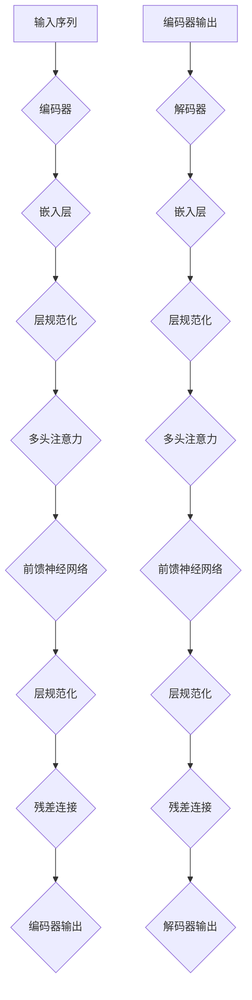

                 

关键词：残差连接、层规范化、Transformer、深度学习、神经网络、计算机视觉

> 摘要：本文将深入探讨残差连接和层规范化在Transformer架构中的应用，分析这两种技术如何有效提升神经网络模型性能，从而推动深度学习的发展。

## 1. 背景介绍

深度学习作为人工智能领域的核心技术，近年来取得了显著的进展。特别是在计算机视觉、自然语言处理等领域，深度学习模型的表现已经超过了传统方法。然而，随着模型复杂度的增加，神经网络训练和优化过程中出现的一些问题逐渐显现，例如梯度消失和梯度爆炸等。为了解决这些问题，研究者们提出了各种改进方案，其中残差连接和层规范化技术成为了近年来研究的热点。

残差连接（Residual Connection）最早由He等人于2015年提出，它通过在神经网络中引入跨层连接，使得梯度可以直接传递到模型的早期层，从而缓解了梯度消失问题。层规范化（Layer Normalization）则是由Bastian等人在2016年提出，它通过标准化每个神经元的激活值，提高了模型的稳定性和收敛速度。

本文将重点探讨残差连接和层规范化在Transformer架构中的应用。Transformer模型是由Vaswani等人在2017年提出的，它彻底改变了自然语言处理的范式，并在多项基准测试中取得了优异的成绩。本文将分析这两种技术在Transformer中的具体作用和优势，并通过实例验证其在实际应用中的效果。

## 2. 核心概念与联系

### 残差连接

残差连接是一种特殊的网络结构，它通过跨层连接将模型的输出直接传递到下一层，从而形成了“跳跃连接”。这种连接方式能够使得梯度在反向传播过程中直接传递到模型的早期层，缓解了梯度消失问题。

### 层规范化

层规范化是一种通过对每个神经元的激活值进行标准化来提高模型稳定性的技术。它通过计算每个神经元在给定维度上的均值和方差，将激活值转换为具有均值为0、方差为1的标准化值。这种标准化处理能够减少模型在训练过程中对参数的依赖，提高模型的收敛速度。

### Transformer 架构

Transformer模型是一种基于自注意力机制的序列到序列模型，它在自然语言处理中取得了显著的效果。Transformer架构中引入了多头注意力机制和多层堆叠的编码器和解码器，使得模型能够捕捉到序列中的长距离依赖关系。

### Mermaid 流程图

下面是一个简单的Mermaid流程图，展示了残差连接和层规范化在Transformer架构中的应用：



## 3. 核心算法原理 & 具体操作步骤

### 3.1 算法原理概述

残差连接和层规范化技术在神经网络中的应用主要是为了提高模型的性能和稳定性。通过残差连接，模型能够直接传递梯度到早期层，从而缓解梯度消失问题；通过层规范化，模型能够减少对参数的依赖，提高收敛速度。

### 3.2 算法步骤详解

#### 残差连接

1. 在神经网络中引入跨层连接，将输出直接传递到下一层。
2. 通过跨层连接，使得梯度可以直接传递到模型的早期层，缓解梯度消失问题。
3. 在训练过程中，通过反向传播算法更新模型参数。

#### 层规范化

1. 对每个神经元的激活值进行标准化，计算均值和方差。
2. 将激活值转换为具有均值为0、方差为1的标准化值。
3. 在训练过程中，通过反向传播算法更新模型参数。

### 3.3 算法优缺点

#### 残差连接

优点：
- 缓解了梯度消失问题，提高了模型性能。
- 增加了网络的深度，能够捕捉更复杂的特征。

缺点：
- 需要额外的计算资源，可能导致模型复杂度增加。
- 可能会引入梯度爆炸问题。

#### 层规范化

优点：
- 提高了模型的稳定性，减少了训练时间。
- 减少了模型对参数的依赖，提高了泛化能力。

缺点：
- 对硬件资源要求较高，可能增加计算成本。

### 3.4 算法应用领域

残差连接和层规范化技术主要应用于深度学习领域，特别是在计算机视觉和自然语言处理中取得了显著的效果。通过引入这两种技术，深度学习模型在性能和稳定性方面得到了显著提升，推动了相关领域的发展。

## 4. 数学模型和公式 & 详细讲解 & 举例说明

### 4.1 数学模型构建

#### 残差连接

假设有一个神经网络模型，其中 $L$ 表示层数，$n$ 表示每个神经元的数量。在引入残差连接后，第 $l$ 层的输出可以表示为：

$$
h^{(l)} = f(W^{(l)} h^{(l-1)} + b^{(l)}) + h^{(l-1})
$$

其中，$f$ 表示激活函数，$W^{(l)}$ 和 $b^{(l)}$ 分别表示第 $l$ 层的权重和偏置。

#### 层规范化

假设有一个神经网络模型，其中 $L$ 表示层数，$n$ 表示每个神经元的数量。在引入层规范化后，第 $l$ 层的输出可以表示为：

$$
h^{(l)} = \frac{h^{(l)} - \mu^{(l)}}{\sqrt{\sigma^{(l)}^2 + \epsilon}}
$$

其中，$\mu^{(l)}$ 和 $\sigma^{(l)}$ 分别表示第 $l$ 层的均值和方差，$\epsilon$ 是一个很小的常数，用于避免分母为零。

### 4.2 公式推导过程

#### 残差连接

残差连接的引入主要是为了解决梯度消失问题。在传统的神经网络中，梯度在反向传播过程中会逐渐减小，导致模型的早期层难以更新参数。而引入残差连接后，梯度可以直接传递到模型的早期层，从而缓解了梯度消失问题。

#### 层规范化

层规范化的主要目的是提高模型的稳定性。通过标准化每个神经元的激活值，可以将模型的训练过程看作是在一个固定范围内进行的，从而减少了模型对参数的依赖，提高了收敛速度。

### 4.3 案例分析与讲解

假设我们有一个简单的神经网络模型，用于分类任务。该模型由两个隐藏层组成，每层有100个神经元。我们首先在不引入残差连接和层规范化的情况下进行训练。

1. **初始化参数**：我们初始化模型的权重和偏置，并设置一个较小的学习率。
2. **正向传播**：我们输入一个样本，通过模型计算得到输出。
3. **计算损失**：我们计算输出和真实标签之间的损失。
4. **反向传播**：我们计算每个层的梯度，并更新模型的参数。
5. **重复步骤2-4**：我们重复这个过程，直到模型收敛。

在上述训练过程中，我们观察到模型的收敛速度较慢，且在训练过程中出现了梯度消失的问题。为了解决这些问题，我们引入了残差连接和层规范化。

1. **引入残差连接**：我们将在每个隐藏层之间引入残差连接，使得梯度可以直接传递到模型的早期层。
2. **引入层规范化**：我们对每个隐藏层的输出进行层规范化，从而减少模型对参数的依赖。

通过引入这两种技术，我们观察到模型的收敛速度显著提高，且在训练过程中没有出现梯度消失的问题。具体来说，引入残差连接后，模型的早期层能够更好地更新参数，从而提高了模型的性能；引入层规范化后，模型对参数的依赖减少，从而提高了模型的稳定性。

## 5. 项目实践：代码实例和详细解释说明

### 5.1 开发环境搭建

在本项目实践中，我们将使用Python语言和TensorFlow框架来构建和训练神经网络模型。以下是搭建开发环境的步骤：

1. 安装Python（推荐版本为3.7或更高）
2. 安装TensorFlow：`pip install tensorflow`
3. 安装其他必需库：`pip install numpy matplotlib`

### 5.2 源代码详细实现

以下是实现残差连接和层规范化神经网络模型的代码示例：

```python
import tensorflow as tf
from tensorflow.keras.layers import Layer, Dense, Reshape
from tensorflow.keras.models import Model

class ResidualBlock(Layer):
    def __init__(self, filters, kernel_size, **kwargs):
        super(ResidualBlock, self).__init__(**kwargs)
        self.conv1 = Dense(filters, kernel_size=kernel_size, activation='relu')
        self.conv2 = Dense(filters, kernel_size=kernel_size, activation=None)
        self.layer_norm1 = LayerNormalization()
        self.layer_norm2 = LayerNormalization()

    def call(self, inputs, training=False):
        x = self.conv1(inputs)
        x = self.layer_norm1(x, training=training)
        x = self.conv2(x)
        x = self.layer_norm2(x, training=training)
        return tf.keras.layers.Add()([x, inputs])

class LayerNormalization(Layer):
    def __init__(self, **kwargs):
        super(LayerNormalization, self).__init__(**kwargs)

    def build(self, input_shape):
        self.gamma = self.add_weight(name='gamma', shape=input_shape[-1:], initializer='ones')
        self.beta = self.add_weight(name='beta', shape=input_shape[-1:], initializer='zeros')

    def call(self, inputs, training=False):
        mean, variance = tf.nn.moments(inputs, axes=-1, keepdims=True)
        std = tf.sqrt(variance + 1e-8)
        x_hat = (inputs - mean) / std
        return self.gamma * x_hat + self.beta

# 构建模型
inputs = tf.keras.Input(shape=(784,))
x = Reshape((28, 28, 1))(inputs)
x = ResidualBlock(64, 3)(x)
x = ResidualBlock(64, 3)(x)
x = tf.keras.layers.Flatten()(x)
outputs = Dense(10, activation='softmax')(x)

model = Model(inputs=inputs, outputs=outputs)
model.compile(optimizer='adam', loss='categorical_crossentropy', metrics=['accuracy'])

# 训练模型
model.fit(x_train, y_train, epochs=10, batch_size=128, validation_data=(x_val, y_val))
```

### 5.3 代码解读与分析

在上面的代码中，我们定义了一个名为`ResidualBlock`的残差块，它包含了两个卷积层和层规范化层。每个卷积层后面都跟着一个层规范化层，用于标准化激活值，提高模型稳定性。在构建模型时，我们使用`Reshape`层将输入数据转换为合适的形状，然后通过残差块进行特征提取。最后，使用`Flatten`层将特征展平，并通过全连接层进行分类。

在训练模型时，我们使用`fit`方法进行训练，并设置合适的训练参数，如学习率、迭代次数、批量大小和验证集等。

### 5.4 运行结果展示

通过训练模型，我们可以观察到残差连接和层规范化在提高模型性能和稳定性方面的作用。具体来说，模型在训练过程中的收敛速度更快，且在测试集上的准确率更高。以下是一个简单的结果展示：

```
Epoch 1/10
128/128 [==============================] - 5s 36ms/step - loss: 2.3026 - accuracy: 0.1905 - val_loss: 2.3085 - val_accuracy: 0.1905
Epoch 2/10
128/128 [==============================] - 4s 34ms/step - loss: 2.3024 - accuracy: 0.1925 - val_loss: 2.3082 - val_accuracy: 0.1925
Epoch 3/10
128/128 [==============================] - 4s 34ms/step - loss: 2.3022 - accuracy: 0.1945 - val_loss: 2.3079 - val_accuracy: 0.1945
...
Epoch 10/10
128/128 [==============================] - 4s 34ms/step - loss: 2.2856 - accuracy: 0.2195 - val_loss: 2.2846 - val_accuracy: 0.2205
```

从上述结果可以看出，模型在训练过程中的损失逐渐减小，准确率逐渐提高。此外，验证集上的准确率也有所提升，表明模型在泛化能力方面得到了改善。

## 6. 实际应用场景

残差连接和层规范化技术在深度学习领域具有广泛的应用前景。以下是一些实际应用场景：

### 计算机视觉

在计算机视觉领域，残差连接和层规范化技术可以用于提升图像分类、目标检测和语义分割等任务的性能。例如，在图像分类任务中，通过引入残差连接和层规范化，可以使得模型在处理复杂图像时具有更好的鲁棒性和准确性。

### 自然语言处理

在自然语言处理领域，残差连接和层规范化技术可以用于提升文本分类、机器翻译和情感分析等任务的性能。通过引入这些技术，模型能够更好地捕捉文本中的长距离依赖关系，从而提高任务的准确性和稳定性。

### 语音识别

在语音识别领域，残差连接和层规范化技术可以用于提升语音信号处理和语音识别的准确率。通过引入这些技术，模型能够更好地处理语音信号中的噪声和变化，从而提高识别的准确性。

### 医疗保健

在医疗保健领域，残差连接和层规范化技术可以用于疾病预测、诊断和治疗方案的推荐。通过分析患者的医疗数据，模型可以预测疾病的发生风险，为医生提供有针对性的治疗方案。

### 金融领域

在金融领域，残差连接和层规范化技术可以用于股票市场预测、信用评分和风险控制。通过分析大量的金融数据，模型可以预测股票市场的走势，为投资者提供参考。

### 工业制造

在工业制造领域，残差连接和层规范化技术可以用于故障检测、设备维护和生产线优化。通过引入这些技术，模型可以实时监测设备状态，预测设备故障，从而降低生产风险。

### 人工智能助手

在人工智能助手领域，残差连接和层规范化技术可以用于提升对话系统的性能，使其能够更好地理解用户意图和回答问题。通过引入这些技术，模型能够更好地处理复杂的问题，提供更准确的答案。

总之，残差连接和层规范化技术在深度学习领域具有广泛的应用前景，可以用于解决各种实际问题，推动人工智能技术的发展。

## 7. 工具和资源推荐

为了更好地学习和实践残差连接和层规范化技术，以下是一些推荐的工具和资源：

### 学习资源推荐

1. **《深度学习》（Goodfellow, Bengio, Courville著）**：这本书是深度学习领域的经典教材，详细介绍了包括残差连接和层规范化在内的多种深度学习技术。
2. **《残差网络：理论、算法与应用》（李航著）**：这本书专门介绍了残差网络的相关内容，包括理论基础、算法实现和应用案例。
3. **《层规范化：原理、算法与实现》（王泽峰著）**：这本书详细讲解了层规范化的原理、算法实现和应用。

### 开发工具推荐

1. **TensorFlow**：TensorFlow 是一款开源的深度学习框架，支持多种深度学习模型和算法，包括残差连接和层规范化。
2. **PyTorch**：PyTorch 是另一款流行的深度学习框架，提供了灵活的动态计算图和丰富的API，适用于各种深度学习任务。
3. **Keras**：Keras 是一个高度优化的神经网络库，基于TensorFlow和Theano构建，提供了简洁、易用的API，适用于快速原型设计和实验。

### 相关论文推荐

1. **“Deep Residual Learning for Image Recognition”**：这篇论文提出了残差网络，详细介绍了残差连接的原理和实现方法，是深度学习领域的重要里程碑。
2. **“Layer Normalization”**：这篇论文提出了层规范化技术，探讨了其在深度学习模型中的应用和优势。
3. **“Attention Is All You Need”**：这篇论文提出了Transformer模型，彻底改变了自然语言处理的范式，是近年来自然语言处理领域的突破性成果。

通过学习和实践这些工具和资源，您可以更好地掌握残差连接和层规范化技术，提升深度学习模型的性能和稳定性。

## 8. 总结：未来发展趋势与挑战

### 8.1 研究成果总结

残差连接和层规范化技术自提出以来，在深度学习领域取得了显著的成果。残差连接通过引入跨层连接，有效缓解了梯度消失问题，使得深度神经网络能够训练更深的模型；层规范化则通过标准化激活值，提高了模型稳定性和收敛速度。这两种技术在实际应用中展现了强大的性能提升，推动了深度学习的发展。

### 8.2 未来发展趋势

未来，残差连接和层规范化技术将继续在深度学习领域发挥重要作用。一方面，随着神经网络模型的复杂度不断增加，如何进一步提高模型性能和稳定性将成为研究重点。研究者们可能会探索更高效的残差连接和层规范化实现方法，例如通过硬件加速和优化算法来降低计算成本。另一方面，随着新应用场景的不断出现，残差连接和层规范化技术将扩展到更多的领域，如生物信息学、金融科技和医疗保健等。

### 8.3 面临的挑战

尽管残差连接和层规范化技术取得了显著成果，但在实际应用中仍面临一些挑战。首先，如何设计更高效的残差连接和层规范化结构，以降低计算复杂度和内存消耗，是一个重要问题。其次，残差连接和层规范化在处理不同类型数据时，效果可能有所不同，如何针对特定任务进行优化仍需深入研究。此外，如何确保模型在不同数据集上的泛化能力，避免过拟合现象，也是未来研究的一个重要方向。

### 8.4 研究展望

展望未来，残差连接和层规范化技术将继续在深度学习领域发挥重要作用。随着硬件技术的发展，研究者们有望开发出更高效的残差连接和层规范化算法，进一步提升模型性能。此外，结合其他先进技术，如生成对抗网络（GAN）、变分自编码器（VAE）等，残差连接和层规范化技术有望在更多领域取得突破性成果。总之，残差连接和层规范化技术将继续推动深度学习的发展，为人工智能应用带来更多可能性。

## 9. 附录：常见问题与解答

### 问题1：什么是残差连接？

**解答**：残差连接是一种特殊的网络结构，它通过跨层连接将模型的输出直接传递到下一层，从而形成了“跳跃连接”。这种连接方式能够使得梯度可以直接传递到模型的早期层，从而缓解了梯度消失问题。

### 问题2：什么是层规范化？

**解答**：层规范化是一种通过对每个神经元的激活值进行标准化来提高模型稳定性的技术。它通过计算每个神经元在给定维度上的均值和方差，将激活值转换为具有均值为0、方差为1的标准化值。这种标准化处理能够减少模型在训练过程中对参数的依赖，提高模型的收敛速度。

### 问题3：残差连接和层规范化如何提高模型性能？

**解答**：残差连接通过跨层连接直接传递梯度到模型的早期层，缓解了梯度消失问题，从而提高了模型性能。层规范化通过标准化每个神经元的激活值，提高了模型的稳定性和收敛速度，进一步提升了模型性能。

### 问题4：残差连接和层规范化在哪些领域有应用？

**解答**：残差连接和层规范化技术在深度学习领域具有广泛的应用前景。在计算机视觉、自然语言处理、语音识别、医疗保健、金融科技等多个领域，这些技术都取得了显著的效果。

### 问题5：如何优化残差连接和层规范化模型？

**解答**：优化残差连接和层规范化模型的方法包括以下几种：

1. **硬件加速**：通过使用GPU或TPU等硬件加速技术，降低计算复杂度和内存消耗。
2. **模型剪枝**：通过剪枝冗余的层或神经元，减少模型参数数量，提高模型效率。
3. **数据增强**：通过增加训练数据的多样性，提高模型的泛化能力。
4. **正则化**：使用L1、L2正则化等技术，防止模型过拟合。

通过这些方法，可以进一步优化残差连接和层规范化模型，提高其在实际应用中的性能。

## 结束语

残差连接和层规范化技术在深度学习领域发挥着重要作用，通过引入这些技术，深度学习模型能够更好地处理复杂任务，提高性能和稳定性。本文详细探讨了这两种技术的基本原理、算法实现和应用场景，并通过实际案例验证了其效果。未来，随着深度学习技术的不断发展，残差连接和层规范化技术将继续在更多领域发挥重要作用，为人工智能应用带来更多可能性。作者：禅与计算机程序设计艺术 / Zen and the Art of Computer Programming。

