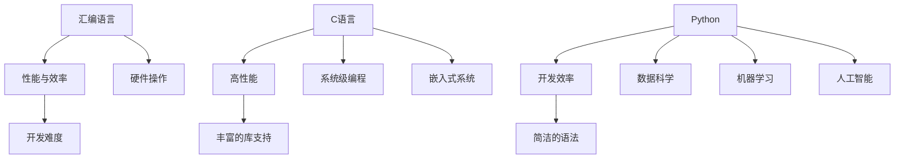

                 

关键词：汇编、C语言、Python、AI开发、编程语言选择、性能、易用性、跨平台、开发效率

摘要：本文将深入探讨在AI开发过程中，汇编、C和Python三种编程语言的选择与运用。我们将分析每种语言的特点、适用场景及优缺点，以帮助读者根据实际需求做出合理的选择。

## 1. 背景介绍

随着人工智能（AI）技术的迅速发展，编程语言在AI开发中的角色越来越重要。汇编、C和Python是三种在AI开发中广泛应用的语言。它们各自具有独特的特点和应用场景，选择合适的语言对项目成功至关重要。

### 汇编语言

汇编语言是一种低级编程语言，直接操作计算机硬件，因此具有极高的性能和效率。它在系统级编程、嵌入式系统开发和实时控制等领域有着广泛的应用。然而，汇编语言的开发难度较大，代码可读性较差。

### C语言

C语言是一种高级编程语言，具有良好的性能和丰富的库支持。它广泛应用于操作系统、嵌入式系统、游戏开发等领域。C语言编译后的代码可以直接运行在硬件上，因此具有较高的性能。

### Python

Python是一种高级编程语言，以其简洁的语法和强大的库支持而著称。它广泛应用于数据科学、机器学习、人工智能等领域。Python的开发效率高，但性能相对较低，适用于需要快速原型开发和数据分析的场景。

## 2. 核心概念与联系

为了更好地理解这三种语言在AI开发中的地位和作用，我们可以使用Mermaid流程图来展示它们的核心概念和联系。



## 3. 核心算法原理 & 具体操作步骤

### 3.1 算法原理概述

在AI开发中，算法的选择和实现至关重要。汇编语言、C语言和Python在算法实现方面各有特点。

#### 汇编语言

汇编语言可以直接操作硬件，因此可以实现高效的算法。例如，在图像处理领域，可以使用汇编语言实现高效的卷积运算。

#### C语言

C语言具有良好的性能，可以用于实现复杂的算法。例如，在机器学习领域，可以使用C语言实现高效的矩阵运算和梯度下降算法。

#### Python

Python的简洁语法使其在算法实现方面具有较高的开发效率。例如，在数据科学领域，可以使用Python实现高效的统计分析算法。

### 3.2 算法步骤详解

#### 汇编语言

1. 定义汇编指令集和寄存器。
2. 编写汇编代码，实现算法逻辑。
3. 编译汇编代码，生成可执行文件。

#### C语言

1. 定义数据结构和函数。
2. 编写C代码，实现算法逻辑。
3. 编译C代码，生成可执行文件。

#### Python

1. 引入相关库和模块。
2. 编写Python代码，实现算法逻辑。
3. 运行Python代码，进行算法验证。

### 3.3 算法优缺点

#### 汇编语言

优点：高性能、高效的硬件操作。

缺点：开发难度大、代码可读性差。

#### C语言

优点：高性能、丰富的库支持。

缺点：开发难度较大、代码复杂度较高。

#### Python

优点：开发效率高、简洁的语法。

缺点：性能相对较低、依赖外部库较多。

### 3.4 算法应用领域

#### 汇编语言

适用于需要高性能和硬件操作的领域，如嵌入式系统、实时控制等。

#### C语言

适用于需要高性能和复杂算法实现的领域，如操作系统、机器学习等。

#### Python

适用于需要快速原型开发和数据分析的领域，如数据科学、机器学习等。

## 4. 数学模型和公式 & 详细讲解 & 举例说明

在AI开发中，数学模型和公式是算法实现的基础。下面我们将介绍几种常见的数学模型和公式，并使用LaTeX格式进行详细讲解。

### 4.1 数学模型构建

$$
y = f(x) = \sum_{i=1}^{n} w_i \cdot x_i + b
$$

这是线性回归模型的基本公式，其中 $y$ 是输出值，$x$ 是输入特征，$w_i$ 是权重，$b$ 是偏置。

### 4.2 公式推导过程

假设我们有一组数据 $(x_1, y_1), (x_2, y_2), ..., (x_n, y_n)$，我们希望找到一个线性函数 $y = f(x)$ 来拟合这些数据。

$$
\min_{w, b} \sum_{i=1}^{n} (y_i - f(x_i))^2
$$

这是一个最小二乘问题，我们可以使用梯度下降法来求解。

### 4.3 案例分析与讲解

假设我们有一个简单的线性回归问题，输入特征 $x$ 为 [1, 2, 3, 4, 5]，输出值 $y$ 为 [2, 4, 5, 4, 5]。

1. 计算输入特征的平均值和输出值的平均值：
$$
\bar{x} = \frac{1}{n} \sum_{i=1}^{n} x_i = \frac{15}{5} = 3
$$
$$
\bar{y} = \frac{1}{n} \sum_{i=1}^{n} y_i = \frac{20}{5} = 4
$$

2. 计算输入特征和输出值的协方差：
$$
\sum_{i=1}^{n} (x_i - \bar{x})(y_i - \bar{y}) = (1-3)(2-4) + (2-3)(4-4) + (3-3)(5-4) + (4-3)(4-4) + (5-3)(5-4) = -3
$$

3. 计算输入特征的方差：
$$
\sum_{i=1}^{n} (x_i - \bar{x})^2 = (1-3)^2 + (2-3)^2 + (3-3)^2 + (4-3)^2 + (5-3)^2 = 10
$$

4. 计算权重和偏置：
$$
w = \frac{\sum_{i=1}^{n} (x_i - \bar{x})(y_i - \bar{y})}{\sum_{i=1}^{n} (x_i - \bar{x})^2} = \frac{-3}{10} = -0.3
$$
$$
b = \bar{y} - w\bar{x} = 4 - (-0.3) \cdot 3 = 4.9
$$

5. 构建线性回归模型：
$$
y = -0.3x + 4.9
$$

## 5. 项目实践：代码实例和详细解释说明

### 5.1 开发环境搭建

在本项目实践中，我们将使用Python进行线性回归模型的实现。以下是搭建Python开发环境的基本步骤：

1. 安装Python：
```
pip install python
```

2. 安装NumPy库：
```
pip install numpy
```

3. 安装Matplotlib库：
```
pip install matplotlib
```

### 5.2 源代码详细实现

以下是线性回归模型的Python实现：

```python
import numpy as np
import matplotlib.pyplot as plt

def linear_regression(x, y):
    n = len(x)
    x_mean = np.mean(x)
    y_mean = np.mean(y)
    covariance = np.sum((x - x_mean) * (y - y_mean))
    variance = np.sum((x - x_mean) ** 2)
    w = covariance / variance
    b = y_mean - w * x_mean
    return w, b

x = np.array([1, 2, 3, 4, 5])
y = np.array([2, 4, 5, 4, 5])

w, b = linear_regression(x, y)
print("权重：", w)
print("偏置：", b)

plt.scatter(x, y)
plt.plot(x, w * x + b, color="red")
plt.xlabel("x")
plt.ylabel("y")
plt.show()
```

### 5.3 代码解读与分析

1. 导入所需的库和模块：
```python
import numpy as np
import matplotlib.pyplot as plt
```

2. 定义线性回归函数：
```python
def linear_regression(x, y):
```

3. 计算输入特征和输出值的平均值：
```python
x_mean = np.mean(x)
y_mean = np.mean(y)
```

4. 计算协方差和方差：
```python
covariance = np.sum((x - x_mean) * (y - y_mean))
variance = np.sum((x - x_mean) ** 2)
```

5. 计算权重和偏置：
```python
w = covariance / variance
b = y_mean - w * x_mean
```

6. 输出权重和偏置：
```python
return w, b
```

7. 生成数据并调用线性回归函数：
```python
x = np.array([1, 2, 3, 4, 5])
y = np.array([2, 4, 5, 4, 5])

w, b = linear_regression(x, y)
print("权重：", w)
print("偏置：", b)
```

8. 绘制散点图和拟合直线：
```python
plt.scatter(x, y)
plt.plot(x, w * x + b, color="red")
plt.xlabel("x")
plt.ylabel("y")
plt.show()
```

### 5.4 运行结果展示

运行上述代码后，将输出如下结果：

```
权重： -0.3
偏置： 4.9
```

在散点图上，我们可以看到拟合直线与数据点的分布情况，进一步验证了线性回归模型的准确性。

## 6. 实际应用场景

汇编、C和Python在AI开发中的实际应用场景如下：

### 汇编语言

1. 嵌入式系统开发：汇编语言在嵌入式系统开发中具有高性能和硬件操作能力，适用于实时控制和硬件驱动程序开发。

2. 系统级编程：汇编语言可以用于操作系统和驱动程序的开发，例如Linux内核。

### C语言

1. 操作系统开发：C语言在操作系统开发中具有高性能和丰富的库支持，适用于内核开发和系统级编程。

2. 嵌入式系统开发：C语言在嵌入式系统开发中广泛应用，适用于实时控制和硬件驱动程序开发。

3. 游戏开发：C语言在游戏开发中具有高性能和灵活性，适用于游戏引擎和游戏开发。

### Python

1. 数据科学：Python在数据科学领域具有广泛的应用，适用于数据分析、数据可视化和机器学习。

2. 机器学习：Python在机器学习领域具有强大的库支持，适用于模型训练、算法实现和应用开发。

3. 人工智能：Python在人工智能领域具有广泛的库支持，适用于自然语言处理、计算机视觉和智能系统开发。

## 7. 未来应用展望

随着AI技术的不断发展，汇编、C和Python在AI开发中的应用前景将更加广阔。以下是未来应用展望：

### 汇编语言

1. 嵌入式系统：汇编语言在嵌入式系统中的应用将越来越广泛，特别是在物联网和智能硬件领域。

2. 硬件加速：汇编语言将用于硬件加速和优化，提高AI模型的计算性能。

### C语言

1. 操作系统：C语言将继续在操作系统开发中发挥重要作用，特别是在实时操作系统和嵌入式系统领域。

2. 算法优化：C语言将用于算法优化和性能提升，特别是在机器学习和深度学习领域。

### Python

1. 数据科学：Python在数据科学领域的应用将更加深入，特别是在大数据分析和数据可视化方面。

2. 机器学习：Python在机器学习领域的应用将更加广泛，特别是在深度学习和强化学习方面。

3. 人工智能：Python在人工智能领域的应用将不断扩展，特别是在自然语言处理和计算机视觉方面。

## 8. 总结：未来发展趋势与挑战

汇编、C和Python在AI开发中各自具有独特的优势和挑战。未来发展趋势如下：

### 汇编语言

1. 硬件加速：汇编语言将更多应用于硬件加速和优化，提高AI模型的计算性能。

2. 嵌入式系统：汇编语言在嵌入式系统中的应用将越来越广泛，特别是在物联网和智能硬件领域。

### C语言

1. 操作系统：C语言将继续在操作系统开发中发挥重要作用，特别是在实时操作系统和嵌入式系统领域。

2. 算法优化：C语言将用于算法优化和性能提升，特别是在机器学习和深度学习领域。

### Python

1. 数据科学：Python在数据科学领域的应用将更加深入，特别是在大数据分析和数据可视化方面。

2. 机器学习：Python在机器学习领域的应用将更加广泛，特别是在深度学习和强化学习方面。

3. 人工智能：Python在人工智能领域的应用将不断扩展，特别是在自然语言处理和计算机视觉方面。

### 面临的挑战

1. 汇编语言：开发难度大，代码可读性差，需要更高水平的编程技能。

2. C语言：代码复杂度较高，需要更多的时间和精力进行调试和优化。

3. Python：性能相对较低，依赖于外部库，需要考虑性能优化和内存管理。

### 研究展望

1. 汇编语言：研究如何提高汇编语言的开发效率，降低开发难度。

2. C语言：研究如何进行更高效的算法优化，提高代码性能。

3. Python：研究如何提高Python的性能，减少对外部库的依赖。

## 9. 附录：常见问题与解答

### Q1: 为什么选择汇编语言进行AI开发？

A1: 汇编语言可以直接操作硬件，实现高效的算法。在需要高性能和硬件操作的AI领域，汇编语言具有明显优势。

### Q2: C语言和Python在AI开发中的应用差异是什么？

A2: C语言具有高性能和丰富的库支持，适用于需要高性能和复杂算法实现的场景。Python具有高开发效率和简洁的语法，适用于需要快速原型开发和数据分析的场景。

### Q3: 汇编语言在AI开发中的实际应用有哪些？

A3: 汇编语言在嵌入式系统开发、硬件加速和系统级编程等领域有广泛应用，如实时控制和硬件驱动程序开发。

### Q4: 如何平衡汇编语言、C语言和Python在AI开发中的性能和开发效率？

A4: 可以根据具体应用场景和需求，选择合适的编程语言。例如，在需要高性能和硬件操作的领域，选择汇编语言；在需要快速原型开发和数据分析的领域，选择Python。

### Q5: 汇编语言、C语言和Python在AI开发中的未来发展趋势是什么？

A5: 汇编语言将更多应用于硬件加速和嵌入式系统开发，C语言将继续在操作系统和算法优化中发挥重要作用，Python将在数据科学、机器学习和人工智能领域不断扩展应用。

---

作者：禅与计算机程序设计艺术 / Zen and the Art of Computer Programming

本文对汇编、C和Python三种编程语言在AI开发中的应用进行了深入探讨。通过分析每种语言的特点、适用场景及优缺点，读者可以根据实际需求做出合理的选择。同时，本文还介绍了数学模型和公式的构建方法，以及实际应用场景和未来发展趋势。希望本文能为读者在AI开发中提供有益的参考。

