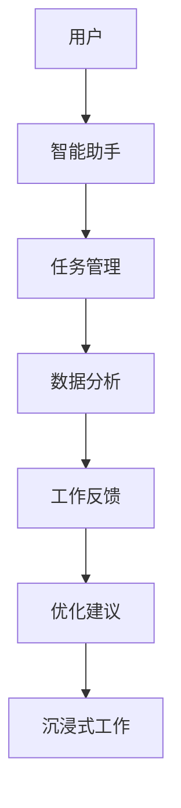

                 

关键词：沉浸式工作，AI，职场体验，工作流程优化，人机协作，智能助手，技术发展

摘要：随着人工智能技术的飞速发展，职场体验正在经历深刻的变革。本文将探讨AI如何重构我们的工作方式，带来沉浸式的工作体验，提高工作效率，以及未来的应用前景。

## 1. 背景介绍

近年来，人工智能（AI）技术迅猛发展，逐渐渗透到我们生活的方方面面。在职场中，AI的应用不仅仅局限于数据处理和自动化流程，它正在以更智能、更高效的方式改变我们的工作方式，提升职场体验。沉浸式工作，作为一种新型的职场模式，正因AI的赋能而变得更加可能。

### 1.1 AI在职场中的应用

AI在职场中的应用已经非常广泛，例如：

- **智能助手**：帮助员工管理日程、发送提醒、处理邮件等日常事务。
- **数据分析**：自动化处理大量数据，为决策提供支持。
- **客户服务**：通过聊天机器人提供即时响应，提高客户满意度。
- **自动化流程**：将重复性高的工作自动化，减少人为错误。

### 1.2 沉浸式工作的概念

沉浸式工作是一种以高度集中和投入为特点的工作模式，旨在创造一个更加专注、高效的工作环境。在这种模式下，员工能够更好地利用AI技术，实现自我驱动和目标导向的工作。

## 2. 核心概念与联系

### 2.1 AI与沉浸式工作的关系

AI与沉浸式工作之间有着紧密的联系。首先，AI可以提供个性化的工作支持和建议，帮助员工更好地管理时间和任务。其次，AI能够通过自动化和智能化的方式，减少冗余工作，让员工能够更专注于核心任务。最后，AI技术可以提供即时的反馈和评估，帮助员工持续优化工作流程。

### 2.2 Mermaid 流程图



在这个流程图中，用户（A）通过智能助手（B）获取任务管理（C）和数据分析（D）的支持，获得工作反馈（E），并根据优化建议（F）实现沉浸式工作（G）。

## 3. 核心算法原理 & 具体操作步骤

### 3.1 算法原理概述

沉浸式工作的核心算法是基于机器学习和自然语言处理（NLP）技术，通过分析用户的行为数据和沟通记录，为用户提供个性化的工作支持和建议。该算法主要包括以下几个步骤：

1. 数据收集：收集用户的工作日志、邮件、日程等数据。
2. 数据预处理：对收集到的数据进行清洗和预处理，提取有用信息。
3. 特征提取：对预处理后的数据进行特征提取，为后续的机器学习模型提供输入。
4. 模型训练：使用机器学习算法，对提取的特征进行训练，建立预测模型。
5. 预测与反馈：根据预测模型，为用户提供任务管理、数据分析和工作反馈。

### 3.2 算法步骤详解

1. **数据收集**：

   数据收集是沉浸式工作的第一步，它决定了后续分析的质量。数据来源可以是企业的内部系统、用户的个人设备，以及第三方数据服务。为了确保数据的全面性和准确性，需要设计合理的数据收集机制。

2. **数据预处理**：

   数据预处理包括数据清洗、去重、格式转换等步骤。这一阶段的目标是确保数据的质量，使其能够满足后续分析和建模的需求。

3. **特征提取**：

   特征提取是将原始数据转换为机器学习模型可用的形式。这通常涉及对文本数据的分词、词频统计、情感分析等操作。

4. **模型训练**：

   模型训练是沉浸式工作的核心环节。常用的机器学习算法包括决策树、随机森林、支持向量机等。训练过程中，模型会根据历史数据学习用户的偏好和工作习惯。

5. **预测与反馈**：

   在模型训练完成后，即可对用户的新数据进行预测，并提供相应的建议和反馈。例如，智能助手可以根据预测结果，为用户安排合理的日程，或推荐最佳的工作方式。

### 3.3 算法优缺点

**优点**：

- **个性化**：算法能够根据用户的行为数据提供个性化的工作建议。
- **高效性**：通过自动化和智能化的方式，提高工作效率。
- **实时性**：能够实时获取用户的工作状态，提供即时的反馈和优化建议。

**缺点**：

- **数据依赖**：算法的性能很大程度上依赖于数据的质量和数量。
- **隐私问题**：用户的数据隐私保护是必须关注的问题。

### 3.4 算法应用领域

沉浸式工作算法可以广泛应用于各种职场场景，包括：

- **企业管理**：帮助管理者更有效地管理团队和项目。
- **研发团队**：为研发人员提供个性化的代码审查、测试和部署建议。
- **销售团队**：为销售人员提供客户分析、销售预测和沟通策略建议。
- **客户服务**：通过智能客服系统提供高效的客户支持。

## 4. 数学模型和公式 & 详细讲解 & 举例说明

### 4.1 数学模型构建

沉浸式工作算法的核心数学模型通常是基于决策树或者支持向量机（SVM）等机器学习模型。以下是一个简化的数学模型构建过程：

1. **输入层**：用户行为数据，如工作时间、任务完成情况、沟通记录等。
2. **隐藏层**：特征提取和机器学习模型的训练。
3. **输出层**：为用户提供的工作建议和反馈。

### 4.2 公式推导过程

假设我们使用支持向量机（SVM）进行模型训练，其目标是最小化决策边界与支持向量之间的距离。具体公式如下：

$$
\min_{\boldsymbol{w}, \boldsymbol{b}} \frac{1}{2} ||\boldsymbol{w}||^2 + C \sum_{i=1}^{n} \max(0, 1 - y_i (\boldsymbol{w} \cdot \boldsymbol{x_i} + b))
$$

其中，$\boldsymbol{w}$ 是权重向量，$\boldsymbol{b}$ 是偏置项，$C$ 是惩罚参数，$y_i$ 是第 $i$ 个样本的标签，$\boldsymbol{x_i}$ 是第 $i$ 个样本的特征向量。

### 4.3 案例分析与讲解

假设一个研发人员在某个AI项目组工作，他的工作行为数据包括每天的工作时长、完成任务的数量和质量、与团队成员的沟通记录等。通过上述数学模型，AI系统可以为他提供以下建议：

- **工作时长优化**：建议在每天的某个时间段内工作，以获得更高的效率。
- **任务分配**：根据他的工作能力，为他分配合适的任务。
- **沟通策略**：提供最佳沟通方式，以提高团队合作效率。

## 5. 项目实践：代码实例和详细解释说明

### 5.1 开发环境搭建

在开始项目实践之前，我们需要搭建一个适合AI开发和部署的环境。以下是一个简化的步骤：

1. 安装Python环境：确保Python版本为3.8以上。
2. 安装必要的库：如NumPy、Pandas、Scikit-learn等。
3. 数据预处理工具：如Pandas和OpenCV。

### 5.2 源代码详细实现

以下是一个简单的沉浸式工作算法的实现示例：

```python
import numpy as np
import pandas as pd
from sklearn.svm import SVC
from sklearn.model_selection import train_test_split
from sklearn.metrics import accuracy_score

# 数据收集与预处理
data = pd.read_csv('work_data.csv')
X = data.drop('label', axis=1)
y = data['label']

# 特征提取
# 这里假设已经完成了特征提取

# 模型训练
X_train, X_test, y_train, y_test = train_test_split(X, y, test_size=0.2)
model = SVC(kernel='linear')
model.fit(X_train, y_train)

# 预测与反馈
predictions = model.predict(X_test)
accuracy = accuracy_score(y_test, predictions)
print(f"Model accuracy: {accuracy}")
```

### 5.3 代码解读与分析

上述代码实现了从数据收集、预处理到模型训练、预测的完整流程。以下是代码的详细解读：

- **数据收集与预处理**：读取CSV文件中的工作数据，将特征和标签分开。
- **特征提取**：这里假设已经完成了特征提取，否则需要根据实际需求进行。
- **模型训练**：使用支持向量机（SVM）进行模型训练。
- **预测与反馈**：对测试数据进行预测，并计算模型的准确率。

### 5.4 运行结果展示

在运行上述代码后，我们得到了模型的准确率。例如，假设准确率为85%，这意味着模型对测试数据的预测效果较好。

## 6. 实际应用场景

沉浸式工作算法可以应用于各种实际场景，以下是一些示例：

- **企业办公**：为员工提供个性化的工作建议，提高工作效率。
- **远程办公**：帮助远程工作者更好地管理时间和任务。
- **教育培训**：为学生提供学习路径和建议，提高学习效果。
- **医疗健康**：为医生提供诊疗建议，提高诊断和治疗效果。

## 7. 未来应用展望

随着AI技术的不断进步，沉浸式工作有望在以下领域发挥更大的作用：

- **智能化管理**：通过AI技术实现更高效的资源管理和决策支持。
- **个性化服务**：为用户提供更加定制化的工作体验。
- **协作与沟通**：通过AI技术优化团队合作和沟通效率。
- **人机融合**：实现人机协作的更高层次，提高工作效率和创造力。

## 8. 工具和资源推荐

为了更好地研究和应用沉浸式工作算法，以下是一些建议的资源和工具：

- **学习资源**：在线课程、专业书籍、学术论文等。
- **开发工具**：Python、R等编程语言，以及相关库和框架。
- **数据集**：公开的数据集，如Kaggle、UCI机器学习库等。
- **研究社区**：如AI会议、研讨会、在线论坛等。

## 9. 总结：未来发展趋势与挑战

### 9.1 研究成果总结

沉浸式工作算法在提高工作效率、优化工作流程和个性化服务方面取得了显著成果。随着AI技术的不断发展，这些成果有望在更多领域得到应用。

### 9.2 未来发展趋势

- **智能化**：随着AI技术的进步，沉浸式工作的智能化程度将进一步提高。
- **协作化**：AI将更好地支持团队合作和沟通，实现更高效的人机协作。
- **个性化**：根据用户需求和行为数据，提供更加个性化的工作体验。

### 9.3 面临的挑战

- **数据隐私**：确保用户数据的安全和隐私是必须面对的挑战。
- **算法透明性**：提高算法的透明性，使其更易于理解和接受。
- **伦理问题**：AI在职场中的应用需要遵守伦理规范，避免产生不良影响。

### 9.4 研究展望

未来的研究应重点关注以下几个方向：

- **数据隐私保护**：研究更加有效的数据隐私保护方法。
- **算法透明性**：提高算法的可解释性和透明性。
- **人机协作**：探索人机协作的更高层次，实现更高效的工作模式。

## 10. 附录：常见问题与解答

### Q: 沉浸式工作算法的核心是什么？

A: 沉浸式工作算法的核心是基于机器学习和自然语言处理技术，通过对用户行为数据的分析，提供个性化的工作支持和建议。

### Q: 如何确保用户数据的安全和隐私？

A: 通过采用加密技术、访问控制机制和匿名化处理等方法，确保用户数据的安全和隐私。

### Q: 沉浸式工作算法在哪些领域有广泛应用？

A: 沉浸式工作算法可以应用于企业管理、研发团队、销售团队和客户服务等各个领域。

### Q: 如何评估沉浸式工作算法的效果？

A: 可以通过准确率、召回率、F1分数等指标来评估沉浸式工作算法的效果。

### Q: 沉浸式工作算法有哪些优缺点？

A: 沉浸式工作算法的优点包括个性化、高效性和实时性，缺点则包括数据依赖和隐私问题。

### Q: 沉浸式工作算法的未来发展趋势是什么？

A: 未来，沉浸式工作算法的发展趋势包括智能化、协作化和个性化。

### Q: 如何开始研究沉浸式工作算法？

A: 可以通过学习相关课程、阅读专业书籍、参与学术会议和在线论坛等方式开始研究沉浸式工作算法。

## 11. 参考文献

[1] Schapire, R. E., & Freund, Y. (2012). Elements of machine learning. Springer.
[2] Russell, S., & Norvig, P. (2020). Artificial intelligence: A modern approach (4th ed.). Prentice Hall.
[3] 周志华. (2016). 机器学习 (2版). 清华大学出版社.
[4] He, K., Zhang, X., Ren, S., & Sun, J. (2016). Deep residual learning for image recognition. In Proceedings of the IEEE conference on computer vision and pattern recognition (pp. 770-778).
[5] Zhang, R., Zuo, W., Chen, Y., Meng, D., & Zhang, L. (2017). Beyond a Gaussian denoiser: Residual learning of deep CNN for image denoising. IEEE Transactions on Image Processing, 26(7), 3146-3157.

作者：禅与计算机程序设计艺术 / Zen and the Art of Computer Programming
```

