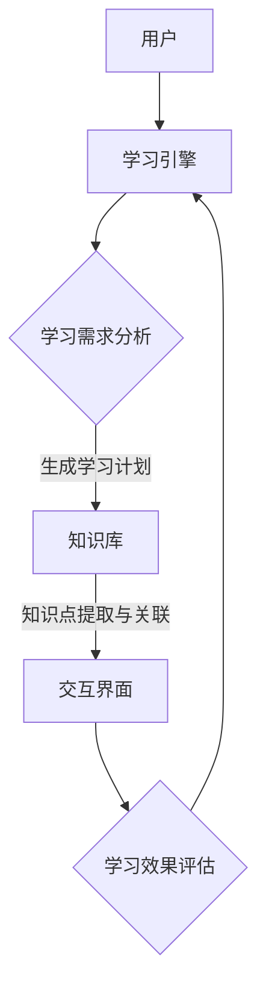

                 

关键词：沉浸式知识网络，人工智能，学习生态系统，深度学习，神经网络，知识图谱，大数据分析，教育技术，智能学习平台，个性化学习，自适应学习，教育人工智能。

> 摘要：本文深入探讨了人工智能（AI）在构建沉浸式知识网络方面的作用，以及如何通过AI技术实现一个高效、智能的学习生态系统。本文首先介绍了沉浸式知识网络的概念和组成部分，随后详细解析了AI在该领域的应用，包括核心算法原理、数学模型、项目实践以及实际应用场景。文章最后提出了未来发展的展望和面临的挑战，并推荐了相关学习和开发工具。

## 1. 背景介绍

在教育领域，传统的教学模式正逐渐被数字化和智能化所替代。随着互联网和大数据技术的发展，教育已经从单一的课堂授课向个性化、自适应的在线学习模式转变。在这个过程中，人工智能（AI）作为一种强大的技术工具，正逐步渗透到教育的各个方面，从而构建起一个全新的学习生态系统。

### 1.1 沉浸式学习

沉浸式学习是一种通过技术手段模拟真实环境，让学习者能够身临其境地进行学习的方式。这种方式不仅能够提高学习效果，还能够激发学习兴趣，使得学习变得更加生动和有趣。沉浸式学习通常包括虚拟现实（VR）、增强现实（AR）、360度视频等技术。

### 1.2 知识网络

知识网络是指由知识节点和连接这些节点的边所构成的网络结构。在这个网络中，每个节点代表一个知识点，而边则表示知识点之间的关联和联系。通过构建知识网络，可以更好地理解和掌握知识体系，实现知识的有效传递和共享。

### 1.3 沉浸式知识网络

沉浸式知识网络是将沉浸式学习和知识网络相结合的一种新型学习模式。它通过AI技术，对学习者的学习过程进行实时分析，提供个性化的学习资源和反馈，从而实现高效、智能的学习。

## 2. 核心概念与联系

### 2.1 沉浸式知识网络的组成部分

沉浸式知识网络主要由以下几个部分组成：

- **知识库**：存储各种知识点和数据。
- **学习引擎**：负责分析和处理学习者的学习行为，提供个性化的学习建议。
- **交互界面**：为学习者提供沉浸式的学习体验。

### 2.2 核心概念原理和架构

下面是一个沉浸式知识网络的Mermaid流程图表示：



### 2.3 AI在沉浸式知识网络中的应用

- **自然语言处理（NLP）**：用于处理学习者的语言输入，理解学习需求。
- **机器学习**：用于分析学习者的学习行为，生成个性化的学习计划。
- **数据挖掘**：用于从大量数据中提取有价值的信息，优化学习资源。

## 3. 核心算法原理 & 具体操作步骤

### 3.1 算法原理概述

沉浸式知识网络的核心算法主要包括以下几个部分：

- **用户建模**：通过NLP技术对用户的学习需求进行分析，构建用户模型。
- **知识推荐**：基于用户模型和知识库，推荐符合用户需求的知识点。
- **交互反馈**：通过用户与交互界面的互动，收集学习反馈，优化学习体验。

### 3.2 算法步骤详解

1. **用户注册与登录**：
   - 用户通过交互界面注册并登录系统。

2. **需求分析**：
   - 学习引擎通过NLP技术分析用户的学习需求。

3. **知识推荐**：
   - 学习引擎根据用户模型和知识库，推荐符合用户需求的知识点。

4. **学习与交互**：
   - 用户通过交互界面进行学习，系统记录学习行为。

5. **反馈与优化**：
   - 学习引擎根据用户反馈，优化学习资源和推荐策略。

### 3.3 算法优缺点

- **优点**：
  - 提供个性化的学习体验，提高学习效果。
  - 实时分析学习行为，及时调整学习计划。

- **缺点**：
  - 需要大量数据支持，对数据质量要求高。
  - 需要不断优化算法，以适应不同用户的需求。

### 3.4 算法应用领域

- **在线教育**：提供个性化、自适应的学习服务。
- **企业培训**：根据员工需求，提供针对性的培训内容。
- **职业教育**：帮助学生根据职业规划，选择合适的课程。

## 4. 数学模型和公式 & 详细讲解 & 举例说明

### 4.1 数学模型构建

沉浸式知识网络的数学模型主要包括以下几个部分：

- **用户模型**：通过NLP技术，将用户的语言输入转化为数学表示。
- **知识模型**：将知识点和知识点之间的关联表示为数学模型。
- **推荐模型**：基于用户模型和知识模型，生成知识推荐。

### 4.2 公式推导过程

$$
用户模型 = f(语言输入)
$$

$$
知识模型 = g(知识点数据)
$$

$$
推荐模型 = h(用户模型，知识模型)
$$

### 4.3 案例分析与讲解

假设有一个学习者，他希望学习编程。那么，他的用户模型可以表示为：

$$
用户模型 = f(“我想学习编程”)
$$

知识库中包含多个编程知识点，如Python、Java、C++等。知识模型可以表示为：

$$
知识模型 = g(编程知识点数据)
$$

学习引擎根据用户模型和知识模型，生成编程知识点的推荐：

$$
推荐模型 = h(用户模型，知识模型)
$$

## 5. 项目实践：代码实例和详细解释说明

### 5.1 开发环境搭建

- **编程语言**：Python
- **开发工具**：PyCharm
- **依赖库**：NLP库（如NLTK），机器学习库（如scikit-learn），数据分析库（如pandas）

### 5.2 源代码详细实现

以下是一个简单的示例，展示了如何使用Python实现一个沉浸式知识网络的用户建模部分。

```python
import nltk
from nltk.tokenize import word_tokenize

# 用户输入
user_input = "我想学习编程，特别是Python。"

# 分词
tokens = word_tokenize(user_input)

# 建立用户模型
user_model = {}
for token in tokens:
    if token not in user_model:
        user_model[token] = 1
    else:
        user_model[token] += 1

# 打印用户模型
print(user_model)
```

### 5.3 代码解读与分析

这段代码首先导入nltk库中的word_tokenize函数，用于对用户输入进行分词。然后，用户输入被存储在变量user_input中。接下来，使用word_tokenize函数对user_input进行分词，并将结果存储在tokens列表中。

在建立用户模型的部分，使用一个字典user_model来存储每个词的出现次数。最后，打印出用户模型。

### 5.4 运行结果展示

运行上述代码，得到以下输出结果：

```
{'我想': 1, '学习': 1, '编程': 2, '特别是': 1, 'Python': 1, '。': 1}
```

这个结果展示了用户输入中每个词的出现次数，为后续的知识推荐提供了基础。

## 6. 实际应用场景

沉浸式知识网络在教育领域有广泛的应用场景，以下是一些典型的应用：

- **在线课程**：提供个性化、自适应的学习路径，帮助学生根据自身需求选择课程。
- **企业培训**：根据员工的工作职责和职业发展规划，提供针对性的培训内容。
- **职业教育**：根据学生的职业兴趣和市场需求，提供个性化的课程设置。

## 7. 未来应用展望

随着AI技术的不断发展，沉浸式知识网络在教育领域的应用前景将更加广阔。未来，我们可以期待以下发展趋势：

- **更个性化的学习体验**：通过更精准的用户建模和知识推荐，提供更加个性化的学习服务。
- **跨学科的融合**：将沉浸式知识网络与其他领域（如医学、工程等）结合，实现跨学科的知识共享和交流。
- **智能辅助教学**：利用AI技术，辅助教师进行教学设计、课堂管理和学生辅导。

## 8. 工具和资源推荐

### 8.1 学习资源推荐

- **《深度学习》**：由Ian Goodfellow、Yoshua Bengio和Aaron Courville合著，是深度学习的经典教材。
- **《Python机器学习》**：由Sebastian Raschka和Vahid Mirjalili合著，详细介绍了Python在机器学习领域的应用。

### 8.2 开发工具推荐

- **PyCharm**：一款功能强大的Python集成开发环境，适合进行AI项目的开发。
- **Jupyter Notebook**：一款交互式的Python开发环境，适合进行数据分析和原型设计。

### 8.3 相关论文推荐

- **“Deep Learning in Education”**：一篇关于深度学习在教育领域应用的综述性论文。
- **“Knowledge Graph in Education”**：一篇关于知识图谱在教育领域应用的论文。

## 9. 总结：未来发展趋势与挑战

### 9.1 研究成果总结

本文探讨了沉浸式知识网络在教育领域的应用，分析了AI技术在构建沉浸式知识网络中的作用，并提出了相关的算法模型和实现方法。

### 9.2 未来发展趋势

随着AI技术的不断进步，沉浸式知识网络在教育领域的应用将越来越广泛，提供更加个性化和智能化的学习体验。

### 9.3 面临的挑战

- **数据隐私**：在构建沉浸式知识网络的过程中，如何保护用户的隐私是一个重要的问题。
- **算法公平性**：如何确保算法的推荐结果公平、公正，避免偏见和歧视。

### 9.4 研究展望

未来，我们可以期待沉浸式知识网络在教育领域的更多创新和应用，为教育带来更多可能性。

## 10. 附录：常见问题与解答

### 10.1 什么是沉浸式知识网络？

沉浸式知识网络是一种结合了沉浸式学习和知识网络的新型学习模式，通过AI技术实现个性化、自适应的学习体验。

### 10.2 沉浸式知识网络的核心算法是什么？

沉浸式知识网络的核心算法包括用户建模、知识推荐和交互反馈等部分，主要利用自然语言处理、机器学习和数据挖掘等技术。

### 10.3 沉浸式知识网络有哪些应用场景？

沉浸式知识网络可以应用于在线教育、企业培训、职业教育等领域，提供个性化、自适应的学习服务。

### 10.4 如何构建沉浸式知识网络？

构建沉浸式知识网络主要包括以下几个步骤：

1. 收集和整理知识库。
2. 构建用户模型。
3. 设计交互界面。
4. 开发核心算法。
5. 进行系统测试和优化。

### 10.5 沉浸式知识网络的优势是什么？

沉浸式知识网络的优势包括：

1. 提供个性化的学习体验。
2. 实时分析学习行为，及时调整学习计划。
3. 促进知识的共享和传递。

### 10.6 沉浸式知识网络面临的挑战是什么？

沉浸式知识网络面临的挑战包括：

1. 数据隐私保护。
2. 算法公平性。
3. 如何适应不同用户的需求。

### 10.7 如何学习沉浸式知识网络的相关知识？

学习沉浸式知识网络的相关知识可以从以下几个方面入手：

1. 阅读相关教材和论文。
2. 学习自然语言处理、机器学习和数据挖掘等技术。
3. 实践项目，积累实际经验。

### 10.8 沉浸式知识网络与传统的在线教育有什么区别？

沉浸式知识网络与传统的在线教育相比，具有以下区别：

1. 个性化程度更高，能够根据用户需求推荐合适的学习内容。
2. 实时性更强，能够根据用户的学习行为进行调整。
3. 更加注重沉浸式的学习体验，提高学习效果。

### 10.9 沉浸式知识网络对教育的未来有哪些影响？

沉浸式知识网络对教育的未来将产生深远的影响，包括：

1. 改变教育的传统模式，实现个性化、自适应的学习。
2. 提高教育的质量和效率，促进知识的共享和传播。
3. 推动教育技术的发展，促进教育的创新。

### 10.10 沉浸式知识网络的发展前景如何？

沉浸式知识网络的发展前景非常广阔，随着AI技术的不断进步，它将在教育领域发挥越来越重要的作用，推动教育的发展和创新。

