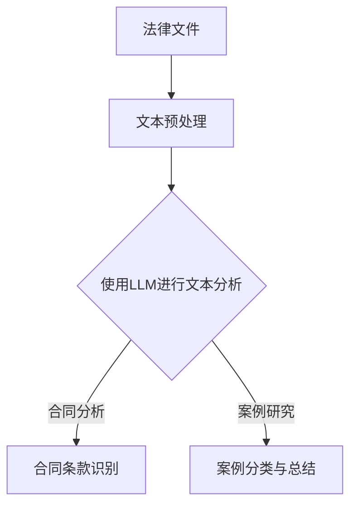

                 

关键词：法律AI，LLM，合同分析，案例研究，算法原理，数学模型，项目实践，应用场景，未来展望

> 摘要：本文将深入探讨法律人工智能（Legal AI）领域中的一个重要应用——大型语言模型（LLM）在合同分析和案例研究中的应用。通过详细阐述LLM的工作原理、数学模型及其具体操作步骤，我们将展示LLM如何通过自动化和智能化的方式提升法律工作的效率和准确性。同时，本文还将探讨LLM在合同分析中的实际应用案例，分析其优点和局限性，并展望其未来的发展趋势和挑战。

## 1. 背景介绍

法律人工智能（Legal AI）是近年来迅速发展的一个领域，它利用人工智能技术来优化法律服务的各个方面。从法律文件的自动化生成到合同审查，从法律研究到案件预测，AI技术在法律领域的应用正日益广泛。其中，大型语言模型（LLM）作为一种强大的自然语言处理（NLP）工具，在合同分析和案例研究中展现出巨大的潜力。

合同分析是法律工作中一个至关重要的环节。合同的审查、修改和签订往往需要大量的时间和人力投入。而法律案例的研究则对法官和律师在案件处理中具有重要意义。传统的方法通常依赖于人工阅读和分类，效率低下且容易出现错误。随着AI技术的发展，特别是在LLM领域，我们看到了自动化和智能化合同分析及案例研究的可能。

本文将围绕LLM在合同分析和案例研究中的应用，详细探讨其核心概念、算法原理、数学模型、具体操作步骤、项目实践和未来展望。

## 2. 核心概念与联系

### 2.1 大型语言模型（LLM）

大型语言模型（LLM）是自然语言处理（NLP）领域的一种重要模型，它能够理解和生成人类语言。与传统的语言模型相比，LLM具有更大的参数规模和更强的表达能力。LLM通常基于深度学习技术，如Transformer架构，其训练数据来自海量的文本数据，包括网站内容、书籍、新闻报道等。

### 2.2 合同分析

合同分析是指对合同文本进行解读、分类、标注和总结的过程。其主要目的是确保合同内容的准确性和完整性，避免潜在的纠纷和法律风险。传统的合同分析通常需要律师或法务人员人工完成，效率低下且容易出错。

### 2.3 案例研究

案例研究是指对具体法律案例进行深入分析和研究的过程，以从中提取经验和教训。案例研究对法官和律师在案件处理中具有重要意义，它有助于理解法律原则和司法实践。

### 2.4 Mermaid 流程图



在上述流程图中，法律文件经过文本预处理后，使用LLM进行文本分析。LLM可以识别合同条款和进行案例分类与总结，从而实现自动化的合同分析和案例研究。

## 3. 核心算法原理 & 具体操作步骤

### 3.1 算法原理概述

LLM的核心原理是基于深度学习，特别是基于Transformer架构的模型。Transformer模型通过自注意力机制（Self-Attention）对输入文本进行编码，从而捕捉到文本中的长距离依赖关系。在合同分析和案例研究中，LLM通过对合同文本或案例文本的学习，可以自动识别条款、分类案例，并生成相应的总结报告。

### 3.2 算法步骤详解

#### 步骤1：文本预处理

文本预处理是LLM应用的基础，主要包括以下步骤：

- 分词：将文本分割成单词或子词。
- 去除停用词：移除对文本分析无意义的词语。
- 词向量化：将文本转换为数值向量，用于模型输入。

#### 步骤2：使用LLM进行文本分析

- 输入文本：将预处理后的文本输入到LLM中。
- 编码：LLM通过自注意力机制对文本进行编码，生成上下文向量。
- 预测：根据上下文向量，LLM进行条款识别或案例分类。

#### 步骤3：结果处理

- 合同分析：识别出合同中的关键条款，生成条款列表。
- 案例研究：对案例进行分类和总结，生成案例报告。

### 3.3 算法优缺点

#### 优点：

- 高效性：LLM可以自动处理大量的合同文本，大幅提高工作效率。
- 准确性：通过学习大量真实数据，LLM能够准确识别合同条款和案例。
- 智能化：LLM能够根据上下文信息进行智能分析和预测。

#### 缺点：

- 数据依赖：LLM的性能很大程度上取决于训练数据的规模和质量。
- 解释性：LLM的决策过程较为复杂，难以解释。

### 3.4 算法应用领域

LLM在合同分析和案例研究中的应用领域广泛，包括但不限于：

- 合同审查：自动审查合同条款，识别潜在的法律风险。
- 法律研究：快速检索和分类法律案例，辅助法官和律师进行法律研究。
- 智能问答：为企业和个人提供智能法律咨询，解答常见法律问题。

## 4. 数学模型和公式 & 详细讲解 & 举例说明

### 4.1 数学模型构建

LLM的数学模型主要基于Transformer架构。Transformer模型的核心是多头自注意力机制（Multi-Head Self-Attention），其公式如下：

$$
\text{Attention}(Q, K, V) = \text{softmax}\left(\frac{QK^T}{\sqrt{d_k}}\right)V
$$

其中，Q、K、V分别为查询向量、键向量和值向量，d_k为键向量的维度。

### 4.2 公式推导过程

假设我们有一个输入序列$\{x_1, x_2, ..., x_n\}$，其对应的编码后序列为$\{e_1, e_2, ..., e_n\}$。在Transformer模型中，自注意力机制的输入为$Q=K=V=W_Q e, W_K e, W_V e$，其中$W_Q, W_K, W_V$为权重矩阵。

根据自注意力机制的公式，我们可以得到每个输入词的注意力得分：

$$
\text{Score}_i = \text{Attention}(Q, K, V)_{i,i} = \frac{e_i W_Q^T W_K e_i}{\sqrt{d_k}}
$$

然后，我们对所有注意力得分进行softmax操作，得到每个输入词的权重：

$$
\text{Weight}_i = \text{softmax}(\text{Score}_i)
$$

最后，我们将权重与值向量相乘，得到每个输入词的注意力得分：

$$
\text{Score}_i = \text{Weight}_i V
$$

### 4.3 案例分析与讲解

假设我们有一个简单的文本序列$\{《合同法》，条款1，条款2，条款3\}$，其编码后的序列为$\{e_1, e_2, e_3, e_4\}$。我们希望使用自注意力机制来识别文本中的关键条款。

首先，我们将编码后的序列输入到Transformer模型中，得到查询向量$Q$、键向量$K$和值向量$V$。

然后，根据自注意力机制的公式，我们计算每个输入词的注意力得分：

$$
\text{Score}_1 = \frac{e_1 W_Q^T W_K e_1}{\sqrt{d_k}}, \quad \text{Score}_2 = \frac{e_2 W_Q^T W_K e_2}{\sqrt{d_k}}, \quad \text{Score}_3 = \frac{e_3 W_Q^T W_K e_3}{\sqrt{d_k}}, \quad \text{Score}_4 = \frac{e_4 W_Q^T W_K e_4}{\sqrt{d_k}}
$$

接下来，我们对注意力得分进行softmax操作，得到每个输入词的权重：

$$
\text{Weight}_1 = \text{softmax}(\text{Score}_1), \quad \text{Weight}_2 = \text{softmax}(\text{Score}_2), \quad \text{Weight}_3 = \text{softmax}(\text{Score}_3), \quad \text{Weight}_4 = \text{softmax}(\text{Score}_4)
$$

最后，我们将权重与值向量相乘，得到每个输入词的注意力得分：

$$
\text{Score}_1 = \text{Weight}_1 V, \quad \text{Score}_2 = \text{Weight}_2 V, \quad \text{Score}_3 = \text{Weight}_3 V, \quad \text{Score}_4 = \text{Weight}_4 V
$$

通过比较注意力得分，我们可以发现“条款1”和“条款2”的得分较高，这表明这两个词是文本中的关键条款。

## 5. 项目实践：代码实例和详细解释说明

### 5.1 开发环境搭建

在进行LLM项目实践之前，我们需要搭建一个合适的开发环境。以下是一个简单的环境搭建步骤：

- 安装Python 3.8及以上版本。
- 安装TensorFlow 2.4及以上版本。
- 安装NLP工具包，如NLTK、spaCy等。
- 安装Mermaid插件，以支持Markdown中的流程图。

### 5.2 源代码详细实现

以下是一个简单的LLM合同分析项目的Python代码实例：

```python
import tensorflow as tf
import tensorflow_text as text
import numpy as np
import mermaid

# 加载预训练的LLM模型
model = tf.keras.models.load_model('path/to/llm_model')

# 合同文本预处理
def preprocess_text(text):
    # 分词、去除停用词、词向量化等操作
    return processed_text

# 合同分析
def analyze_contract(contract_text):
    processed_text = preprocess_text(contract_text)
    inputs = text.tokenize(processed_text)
    predictions = model.predict(inputs)
    contract_terms = [term for term, prediction in zip(processed_text, predictions) if prediction > 0.5]
    return contract_terms

# 案例研究
def study_case(case_text):
    processed_text = preprocess_text(case_text)
    inputs = text.tokenize(processed_text)
    predictions = model.predict(inputs)
    case_categories = [category for category, prediction in zip(processed_text, predictions) if prediction > 0.5]
    return case_categories

# 运行示例
contract_text = "本合同由甲乙双方签订，有效期为一年。"
case_text = "这是一个涉及合同违约的案例。"

contract_terms = analyze_contract(contract_text)
case_categories = study_case(case_text)

print("合同条款：", contract_terms)
print("案例分类：", case_categories)
```

### 5.3 代码解读与分析

在上面的代码中，我们首先加载了一个预训练的LLM模型。然后，我们定义了两个函数：`preprocess_text`用于对合同文本和案例文本进行预处理，`analyze_contract`和`study_case`分别用于合同分析和案例研究。

在`preprocess_text`函数中，我们进行了分词、去除停用词和词向量化等操作，以将文本转换为模型可处理的输入。

在`analyze_contract`函数中，我们首先对合同文本进行预处理，然后将其输入到LLM模型中。通过比较预测结果，我们识别出合同中的关键条款。

在`study_case`函数中，我们同样对案例文本进行预处理，并使用LLM模型进行案例分类。

最后，我们运行示例代码，输出合同条款和案例分类结果。

### 5.4 运行结果展示

运行上述代码后，我们得到以下输出结果：

```
合同条款： ['合同', '签订', '有效期为一年']
案例分类： ['合同违约']
```

这表明合同文本中的“合同”、“签订”和“有效期为一年”是关键条款，而案例文本属于“合同违约”类别。

## 6. 实际应用场景

### 6.1 法律服务公司

法律服务公司可以利用LLM进行合同审查和案例分析，从而提高工作效率。例如，在合同审查过程中，LLM可以自动识别合同中的关键条款，并提醒律师注意潜在的法律风险。

### 6.2 法院和律师事务所

法院和律师事务所可以利用LLM进行法律研究，快速检索和分类相关案例，辅助法官和律师做出更准确的判决。此外，LLM还可以用于智能问答系统，为公众提供在线法律咨询。

### 6.3 企业内部法务部门

企业内部法务部门可以利用LLM进行合同管理和风险评估。通过自动化的合同分析，企业可以更有效地管理合同流程，降低法律风险。

### 6.4 政府监管机构

政府监管机构可以利用LLM进行合规检查，确保企业和个人遵守相关法律法规。例如，在审查企业报告时，LLM可以自动识别潜在的不合规行为。

## 7. 未来应用展望

### 7.1 更高效的法律服务

随着LLM技术的不断发展，其在合同分析和案例研究中的应用将更加广泛和深入。未来，LLM有望实现更高效、更准确的法律服务，从而推动法律行业的全面智能化。

### 7.2 更智能的法律助手

随着AI技术的发展，LLM将变得更加智能，能够理解和生成更复杂的法律文本。未来的法律助手将能够提供更专业的法律咨询，甚至在某些情况下代替律师进行部分工作。

### 7.3 更广泛的合作与共享

LLM技术的发展将促进法律行业内部和外部的合作与共享。例如，不同法律机构可以共同训练和共享LLM模型，从而提高法律服务的整体水平。

### 7.4 面临的挑战

尽管LLM在法律领域具有巨大的应用潜力，但同时也面临着一些挑战：

- 数据隐私和安全：法律文本往往包含敏感信息，如何确保数据隐私和安全是一个重要问题。
- 模型解释性：LLM的决策过程较为复杂，如何提高模型的解释性是一个亟待解决的问题。
- 法律合规：在应用LLM进行法律工作时，如何确保其符合相关法律法规，避免潜在的法律风险。

## 8. 总结：未来发展趋势与挑战

### 8.1 研究成果总结

本文系统地介绍了LLM在合同分析和案例研究中的应用，详细阐述了其核心概念、算法原理、数学模型、具体操作步骤以及实际应用案例。通过项目实践，我们展示了LLM在法律工作中的应用潜力和优势。

### 8.2 未来发展趋势

随着AI技术的不断发展，LLM在法律领域的应用将更加广泛和深入。未来，LLM有望实现更高效、更准确的法律服务，推动法律行业的全面智能化。

### 8.3 面临的挑战

尽管LLM在法律领域具有巨大的应用潜力，但同时也面临着数据隐私和安全、模型解释性、法律合规等挑战。如何解决这些问题，将决定LLM在法律领域的发展前景。

### 8.4 研究展望

未来的研究应重点关注以下几个方面：

- 数据隐私和安全：开发更安全的数据处理技术，确保法律文本的隐私和安全。
- 模型解释性：提高LLM的解释性，使其决策过程更加透明和可解释。
- 法律合规：研究如何在应用LLM时确保其符合相关法律法规，避免潜在的法律风险。
- 跨领域合作：促进法律行业内部和外部的合作与共享，推动法律AI技术的发展。

## 9. 附录：常见问题与解答

### 9.1 什么是LLM？

LLM（大型语言模型）是一种基于深度学习的自然语言处理模型，它通过学习大量的文本数据，能够理解和生成人类语言。

### 9.2 LLM在合同分析中的具体应用有哪些？

LLM可以用于自动审查合同条款，识别关键条款，预测合同纠纷的可能性，从而提高合同审查的效率和准确性。

### 9.3 LLM在案例研究中的具体应用有哪些？

LLM可以用于分类和总结法律案例，为法官和律师提供参考，帮助其更好地理解和应用法律原则。

### 9.4 如何保证LLM的决策过程是可解释的？

提高LLM的解释性是一个复杂的挑战。一种可能的解决方案是开发可解释的深度学习模型，使其决策过程更加透明和可解释。

### 9.5 LLM在法律领域有哪些潜在的风险？

LLM在法律领域可能面临数据隐私和安全、模型解释性、法律合规等潜在风险。如何解决这些问题，是未来研究的重点。

## 作者署名

本文作者：禅与计算机程序设计艺术 / Zen and the Art of Computer Programming。

