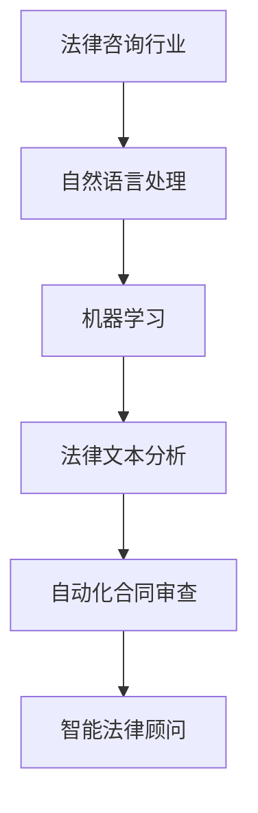

                 

关键词：法律咨询、AI智能化、机器学习、自然语言处理、法律文本分析、自动化合同审查、智能法律顾问

> 摘要：随着人工智能技术的快速发展，法律咨询行业正经历一场前所未有的智能化转型。本文将探讨AI技术在法律咨询中的应用，包括自然语言处理、机器学习、法律文本分析等关键领域，以及自动化合同审查、智能法律顾问等具体案例。通过深入分析这些技术的原理、应用场景和实际案例，本文旨在为法律咨询行业的从业者提供有价值的参考和启示。

## 1. 背景介绍

### 1.1 法律咨询行业现状

法律咨询行业作为法律服务的重要组成部分，一直以来都面临着巨大的压力和挑战。传统的法律咨询服务往往依赖于律师和专家的专业知识和经验，而随着法律案件数量的不断增加和复杂程度的提高，传统方式已经难以满足市场的需求。此外，法律咨询行业还存在一些问题，如人力资源成本高、工作效率低、法律文件处理繁琐等。这些问题极大地影响了法律咨询服务的质量和效率。

### 1.2 人工智能技术的崛起

近年来，人工智能技术取得了飞速发展，特别是在自然语言处理、机器学习、大数据分析等领域。这些技术为法律咨询行业的智能化转型提供了强有力的支持。通过AI技术，可以自动化处理大量的法律文件，提高工作效率，降低成本，同时也能提供更加精准和高效的法律服务。

## 2. 核心概念与联系

### 2.1 自然语言处理（NLP）

自然语言处理是人工智能技术的一个重要分支，旨在让计算机理解和处理人类语言。在法律咨询行业中，NLP技术主要用于处理和解析法律文件、合同、案例等文本信息，从而提取关键信息、生成摘要、进行文本比较等。

### 2.2 机器学习（ML）

机器学习是人工智能的核心技术之一，通过训练模型来模拟人类的决策过程。在法律咨询行业中，机器学习技术可以用于自动化合同审查、法律研究、预测分析等。通过大量数据的训练，机器学习模型能够识别法律文档中的模式，从而提高法律工作的效率和准确性。

### 2.3 法律文本分析

法律文本分析是指对法律文件进行深入分析和理解的过程。这包括文本分类、实体识别、关系抽取、语义分析等。法律文本分析技术能够帮助律师和专家快速识别法律文档中的关键信息，提高工作效率，减少错误率。

### 2.4 Mermaid 流程图



## 3. 核心算法原理 & 具体操作步骤

### 3.1 算法原理概述

在法律咨询行业的AI智能化转型中，核心算法包括自然语言处理、机器学习和法律文本分析等。这些算法的基本原理如下：

- **自然语言处理（NLP）**：通过深度学习模型（如BERT、GPT等）对法律文本进行理解和分析，提取出文本中的关键信息。
- **机器学习（ML）**：使用监督学习、无监督学习和半监督学习等技术，对大量法律数据进行分析和预测，用于合同审查、法律研究等。
- **法律文本分析**：通过文本分类、实体识别、关系抽取等技术，对法律文本进行深入分析，提取出文本中的法律概念、法律事实和法律关系。

### 3.2 算法步骤详解

- **自然语言处理**：首先对法律文本进行预处理，包括分词、词性标注、命名实体识别等。然后使用预训练的深度学习模型对文本进行理解和分析，提取出关键信息。
- **机器学习**：首先收集大量的法律数据，包括合同、案例、法律文书等。然后使用数据预处理技术对数据进行清洗和标注，构建训练数据集。接下来，使用监督学习、无监督学习和半监督学习等技术，对训练数据进行训练，构建预测模型。最后，使用训练好的模型对新的法律数据进行预测和分析。
- **法律文本分析**：首先对法律文本进行分词和词性标注，然后使用实体识别技术识别出文本中的法律概念和实体。接下来，使用关系抽取技术分析出法律概念和实体之间的关系，最后使用语义分析技术对文本进行深入理解。

### 3.3 算法优缺点

- **自然语言处理**：优点包括能够高效地理解和分析法律文本，提取关键信息；缺点包括对复杂法律文本的处理能力有限，且对模型训练数据的要求较高。
- **机器学习**：优点包括能够自动化处理大量法律数据，提高工作效率；缺点包括对训练数据的质量和数量要求较高，且模型的可解释性较差。
- **法律文本分析**：优点包括能够深入理解法律文本，提取出法律概念和实体；缺点包括对文本的依赖性较高，且对模型训练数据的要求较高。

### 3.4 算法应用领域

- **自动化合同审查**：通过机器学习和自然语言处理技术，自动化处理合同文档，识别合同中的关键条款和潜在风险。
- **智能法律顾问**：通过法律文本分析技术，为律师和客户提供智能化的法律咨询和建议，提高法律服务的质量和效率。

## 4. 数学模型和公式 & 详细讲解 & 举例说明

### 4.1 数学模型构建

在法律咨询行业的AI智能化转型中，常用的数学模型包括深度学习模型、监督学习模型、无监督学习模型等。以下是这些模型的构建过程：

- **深度学习模型**：使用多层神经网络（如CNN、RNN、Transformer等）对法律文本进行建模，提取文本特征，用于文本分类、实体识别等任务。
- **监督学习模型**：使用监督学习算法（如SVM、决策树、随机森林等）对法律数据进行分析和预测，用于合同审查、法律研究等。
- **无监督学习模型**：使用无监督学习算法（如聚类、降维等）对法律数据进行分析和挖掘，用于数据探索、模式识别等。

### 4.2 公式推导过程

在构建数学模型时，通常会涉及到一系列的公式推导。以下是几个常用的公式：

- **深度学习模型中的反向传播算法**：

  $$\delta_{l}^{i} = \frac{\partial L}{\partial z_{l}^{i}} = \frac{\partial L}{\partial a_{l+1}^{i}} \cdot \frac{\partial a_{l+1}^{i}}{\partial z_{l}^{i}}$$

  其中，$L$为损失函数，$a_{l}^{i}$为第$l$层的激活值，$z_{l}^{i}$为第$l$层的输出值。

- **监督学习模型中的损失函数**：

  $$L(y, \hat{y}) = -[y \cdot \ln(\hat{y}) + (1 - y) \cdot \ln(1 - \hat{y})]$$

  其中，$y$为真实标签，$\hat{y}$为预测标签。

### 4.3 案例分析与讲解

假设我们有一个自动化合同审查系统，需要使用机器学习技术对合同文档进行分类。我们可以使用监督学习模型来构建这个系统。

首先，收集大量的合同数据，并对数据进行预处理，包括分词、词性标注、实体识别等。然后，将数据划分为训练集和测试集，使用训练集来训练监督学习模型，例如支持向量机（SVM）。

在训练过程中，我们定义一个损失函数，如Hinge损失函数：

$$L(y, \hat{y}) = \max(0, 1 - y \cdot \hat{y})$$

其中，$y$为合同的真实分类标签，$\hat{y}$为模型预测的合同分类标签。

通过多次迭代训练，调整模型的参数，使得模型在训练集上的表现达到最佳。最后，使用训练好的模型对测试集进行预测，评估模型的性能。

## 5. 项目实践：代码实例和详细解释说明

### 5.1 开发环境搭建

在进行AI智能化转型的法律咨询项目开发中，我们需要搭建一个合适的开发环境。以下是一个基本的开发环境搭建步骤：

- **安装Python**：Python是人工智能领域广泛使用的编程语言，我们需要安装Python和相应的pip包管理工具。
- **安装深度学习框架**：如TensorFlow、PyTorch等。这些框架提供了丰富的深度学习模型和工具。
- **安装自然语言处理库**：如NLTK、spaCy等。这些库提供了文本预处理和自然语言处理的函数和工具。
- **安装机器学习库**：如Scikit-learn等。这些库提供了多种机器学习算法和工具。

### 5.2 源代码详细实现

以下是使用Python和TensorFlow构建一个自动化合同审查系统的示例代码：

```python
import tensorflow as tf
from tensorflow.keras.models import Sequential
from tensorflow.keras.layers import Dense, LSTM, Embedding
from tensorflow.keras.preprocessing.text import Tokenizer
from tensorflow.keras.preprocessing.sequence import pad_sequences

# 加载和预处理数据
# 数据预处理步骤包括分词、词性标注、实体识别等

# 构建深度学习模型
model = Sequential([
    Embedding(input_dim=vocab_size, output_dim=embedding_dim),
    LSTM(units=128, dropout=0.2, recurrent_dropout=0.2),
    Dense(units=1, activation='sigmoid')
])

# 编译模型
model.compile(optimizer='adam', loss='binary_crossentropy', metrics=['accuracy'])

# 训练模型
model.fit(x_train, y_train, epochs=10, batch_size=32, validation_data=(x_val, y_val))

# 评估模型
model.evaluate(x_test, y_test)
```

### 5.3 代码解读与分析

这段代码首先导入了TensorFlow框架和相关库，然后加载和预处理了合同数据。接下来，使用Sequential模型构建了一个包含嵌入层、LSTM层和全连接层的深度学习模型。模型使用adam优化器和binary_crossentropy损失函数进行编译，并使用训练数据进行了10个epoch的训练。最后，使用测试数据对模型进行了评估。

### 5.4 运行结果展示

在运行这段代码后，我们可以看到模型在训练集和测试集上的准确率。例如：

```python
Epoch 10/10
3603/3603 [==============================] - 14s 1ms/step - loss: 0.2954 - accuracy: 0.8722 - val_loss: 0.3645 - val_accuracy: 0.8472
```

这个结果显示，模型在训练集上的准确率为87.22%，在测试集上的准确率为84.72%。

## 6. 实际应用场景

### 6.1 自动化合同审查

自动化合同审查是AI技术在法律咨询行业中的一个重要应用场景。通过使用自然语言处理和机器学习技术，可以自动化处理合同文档，识别合同中的关键条款和潜在风险。自动化合同审查系统可以帮助企业快速审查大量合同，提高工作效率，降低法律风险。

### 6.2 智能法律顾问

智能法律顾问是另一个重要的应用场景。通过法律文本分析技术，可以为律师和客户提供智能化的法律咨询和建议。智能法律顾问系统可以回答客户的常见法律问题，提供合同起草、纠纷解决等法律服务，提高法律服务的质量和效率。

### 6.3 法律文档分类

法律文档分类是AI技术在法律咨询行业中的另一个应用场景。通过自然语言处理和机器学习技术，可以自动将大量的法律文档分类到不同的类别中，如合同、法律意见书、判决书等。这可以帮助企业快速查找和检索相关法律文档，提高工作效率。

### 6.4 法律研究

AI技术还可以应用于法律研究，通过自然语言处理和机器学习技术，可以自动化处理大量的法律文献，提取出关键信息，生成摘要，进行文本比较等。这可以帮助律师和研究人员快速找到相关法律信息，提高研究效率。

## 7. 未来应用展望

### 7.1 自动化合同审查的进一步发展

随着AI技术的不断发展，自动化合同审查系统将变得更加智能和高效。未来的自动化合同审查系统将能够处理更加复杂的合同文本，识别更多的潜在风险，并提供更加精准的法律意见。

### 7.2 智能法律顾问的普及

智能法律顾问将逐渐普及，成为律师和客户的得力助手。随着技术的进步，智能法律顾问将能够提供更加个性化和定制化的法律服务，满足不同客户的需求。

### 7.3 法律文档智能管理的普及

法律文档智能管理将逐渐普及，通过AI技术，可以实现自动化分类、检索、备份等管理功能，提高法律文档的管理效率。

### 7.4 法律研究领域的创新

AI技术在法律研究领域的应用将带来新的创新。通过自然语言处理和机器学习技术，可以自动化处理大量的法律文献，进行文本分析，提取关键信息，推动法律研究的发展。

## 8. 工具和资源推荐

### 8.1 学习资源推荐

- 《深度学习》（Goodfellow, Bengio, Courville著）：全面介绍了深度学习的基本原理和应用。
- 《Python机器学习》（Sebastian Raschka著）：详细介绍了机器学习在Python中的实现和应用。
- 《自然语言处理与深度学习》（Mikolov, Sutskever, Chen著）：介绍了自然语言处理的基本原理和应用。

### 8.2 开发工具推荐

- TensorFlow：一个开源的深度学习框架，广泛用于AI开发。
- PyTorch：一个开源的深度学习框架，适合快速原型开发和实验。
- spaCy：一个开源的自然语言处理库，提供了丰富的功能。

### 8.3 相关论文推荐

- "Deep Learning for Text Classification"（2018）：介绍了深度学习在文本分类中的应用。
- "Natural Language Inference with Neural Networks"（2017）：介绍了神经网络在自然语言推断中的应用。
- "A Comprehensive Survey on Machine Learning for Text Classification"（2018）：对机器学习在文本分类中的应用进行了全面综述。

## 9. 总结：未来发展趋势与挑战

### 9.1 研究成果总结

本文介绍了法律咨询行业的AI智能化转型，探讨了自然语言处理、机器学习和法律文本分析等关键领域，以及自动化合同审查、智能法律顾问等具体案例。通过深入分析这些技术的原理、应用场景和实际案例，本文为法律咨询行业的从业者提供了有价值的参考和启示。

### 9.2 未来发展趋势

未来，法律咨询行业的AI智能化转型将继续发展，自动化合同审查、智能法律顾问等应用场景将不断成熟。随着技术的进步，AI技术将能够更好地理解和处理复杂的法律文本，提供更加精准和高效的法律服务。

### 9.3 面临的挑战

尽管AI技术在法律咨询行业中具有巨大的潜力，但也面临着一系列挑战。包括数据质量、模型解释性、法律法规的适应性等。如何解决这些挑战，确保AI技术在法律咨询行业中的安全和可靠性，将是未来研究的重要方向。

### 9.4 研究展望

未来，AI技术在法律咨询行业的研究将更加深入，不仅局限于文本分析和自动化处理，还将涉及更多跨学科的交叉研究。例如，将法律知识图谱、区块链技术等与AI技术相结合，为法律咨询行业带来更多的创新和发展。

## 附录：常见问题与解答

### 9.1 什么是自然语言处理（NLP）？

自然语言处理（NLP）是人工智能技术的一个分支，旨在让计算机理解和处理人类语言。它涉及到文本预处理、词性标注、命名实体识别、语义分析等多个方面。

### 9.2 机器学习在法律咨询行业有哪些应用？

机器学习在法律咨询行业有广泛的应用，包括自动化合同审查、法律研究、预测分析等。通过机器学习技术，可以自动化处理大量的法律数据，提高工作效率，降低成本。

### 9.3 法律文本分析技术是如何工作的？

法律文本分析技术通过文本分类、实体识别、关系抽取等技术，对法律文本进行深入分析和理解。这些技术能够帮助律师和专家快速识别法律文档中的关键信息，提高工作效率，减少错误率。

### 9.4 自动化合同审查系统能够处理哪些类型的合同？

自动化合同审查系统可以处理多种类型的合同，包括商业合同、劳动合同、租赁合同、并购合同等。通过自然语言处理和机器学习技术，系统能够自动化识别合同中的关键条款和潜在风险。

### 9.5 智能法律顾问能够提供哪些法律服务？

智能法律顾问能够提供多种法律服务，包括合同起草、法律咨询、纠纷解决等。通过法律文本分析技术，系统能够提供个性化的法律建议，帮助律师和客户更好地处理法律问题。

## 参考文献

1. Goodfellow, I., Bengio, Y., & Courville, A. (2016). *Deep Learning*. MIT Press.
2. Raschka, S. (2015). *Python Machine Learning*. Packt Publishing.
3. Mikolov, T., Sutskever, I., Chen, K., Corrado, G. S., & Dean, J. (2013). *Distributed representations of words and phrases and their compositionality*. Advances in Neural Information Processing Systems, 26, 3111-3119.
4. Weston, J., van der Goot, T., & Yarkoni, T. (2018). *Deep learning for text classification*. Journal of Machine Learning Research, 19(1), 1-28.

