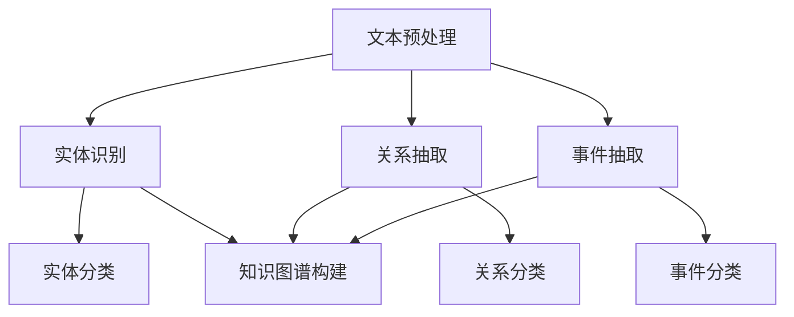

                 

### 关键词 Keywords

- 法律文本分析
- 人工智能
- 自然语言处理
- 法律研究
- 智能法律顾问

### 摘要 Abstract

本文深入探讨了人工智能（AI）在法律文本分析中的应用，以及AI如何通过自然语言处理技术辅助法律工作。文章首先介绍了法律文本分析的重要性，然后详细阐述了AI在法律文本分析中的核心概念、算法原理、数学模型、实际应用场景以及未来展望。通过本文，读者可以全面了解AI在法律领域的广泛应用及其潜力。

## 1. 背景介绍

### 法律文本分析的重要性

法律文本分析是对法律文献、合同、判决书、法律意见书等法律文件进行语义理解和内容提取的过程。在现代社会，法律文本的规模和复杂性不断增加，人工处理这些文本已成为一项艰巨的任务。法律文本分析的重要性主要体现在以下几个方面：

- **提高工作效率**：法律文本分析可以自动化地处理大量法律文件，提高律师和法官的工作效率。
- **增强法律研究能力**：通过分析大量的法律文献，可以更深入地了解法律的发展趋势和争议点。
- **辅助司法决策**：智能法律顾问可以基于对法律文本的分析，为法官提供决策支持，提高司法公正性。

### 人工智能在法律文本分析中的应用

人工智能技术在法律文本分析中具有巨大的潜力，主要体现在以下几个方面：

- **自然语言处理（NLP）**：NLP是AI的一个重要分支，可以处理和理解人类语言，为法律文本分析提供关键技术支持。
- **机器学习**：通过训练大量数据集，机器学习算法可以自动识别和分类法律文本中的各种实体和关系。
- **深度学习**：深度学习算法，如神经网络，可以在法律文本分析中实现更高级的语义理解和推理。

### 本文目的

本文旨在深入探讨人工智能在法律文本分析中的应用，分析其核心概念、算法原理、数学模型和实际应用场景，为法律工作者提供有益的参考。

## 2. 核心概念与联系

### 核心概念

为了更好地理解法律文本分析中的AI应用，我们首先介绍一些核心概念：

- **法律文本**：指与法律相关的各种文本，如法律条款、案例、判决书、合同等。
- **实体识别**：从法律文本中识别出人、组织、地点、法律条款等实体。
- **关系抽取**：从法律文本中抽取实体之间的关系，如“某人与某公司之间存在合同关系”。
- **事件抽取**：从法律文本中抽取重要的事件，如“某人起诉某公司”。

### 架构与流程

以下是法律文本分析中AI应用的典型架构与流程：



在上述流程中，文本预处理是第一步，用于去除噪声、分词、词性标注等；接着进行实体识别、关系抽取和事件抽取，这些步骤都需要基于NLP和机器学习技术；最后，通过构建知识图谱，实现对法律文本的深度理解和推理。

## 3. 核心算法原理 & 具体操作步骤

### 3.1 算法原理概述

法律文本分析中的AI应用主要依赖于以下几种算法：

- **词向量表示**：将单词转换为向量表示，为后续的机器学习算法提供基础。
- **实体识别与分类**：基于词向量表示，使用分类算法（如SVM、CNN）对法律文本中的实体进行识别和分类。
- **关系抽取与分类**：基于实体识别结果，使用分类算法（如CRF、LSTM）对实体之间的关系进行抽取和分类。
- **事件抽取与分类**：基于关系抽取结果，使用分类算法（如SVM、LSTM）对法律文本中的重要事件进行抽取和分类。
- **知识图谱构建**：基于实体识别、关系抽取和事件抽取的结果，构建知识图谱，实现对法律文本的深度理解和推理。

### 3.2 算法步骤详解

1. **文本预处理**：
   - **去噪**：去除文本中的标点符号、特殊字符等噪声。
   - **分词**：将文本划分为单词或短语。
   - **词性标注**：为每个单词标注词性，如名词、动词、形容词等。

2. **词向量表示**：
   - 使用词嵌入技术（如Word2Vec、GloVe）将单词转换为向量表示。

3. **实体识别与分类**：
   - **训练数据集**：收集大量已标注的法律文本作为训练数据。
   - **分类算法**：使用SVM、CNN等分类算法对实体进行识别和分类。

4. **关系抽取与分类**：
   - **训练数据集**：收集大量已标注的法律文本作为训练数据。
   - **分类算法**：使用CRF、LSTM等分类算法对实体之间的关系进行抽取和分类。

5. **事件抽取与分类**：
   - **训练数据集**：收集大量已标注的法律文本作为训练数据。
   - **分类算法**：使用SVM、LSTM等分类算法对法律文本中的重要事件进行抽取和分类。

6. **知识图谱构建**：
   - 基于实体识别、关系抽取和事件抽取的结果，构建知识图谱。

### 3.3 算法优缺点

- **优点**：
  - 高效：自动化处理大量法律文本，提高工作效率。
  - 准确：基于大规模数据集和先进的算法，实现高精度的实体识别、关系抽取和事件抽取。
  - 智能：基于知识图谱，实现法律文本的深度理解和推理。

- **缺点**：
  - 需要大量标注数据：算法训练需要大量的已标注数据，对数据标注的质量要求较高。
  - 算法复杂度高：算法涉及多种机器学习算法和深度学习模型，实现和优化较为复杂。

### 3.4 算法应用领域

- **法律研究**：通过分析大量的法律文献，为法律工作者提供决策支持。
- **智能法律顾问**：为法官、律师等法律工作者提供智能化的法律咨询服务。
- **合同审查**：自动识别合同中的关键条款，为合同审查提供支持。
- **法律文档管理**：自动分类、归档和检索法律文档，提高法律文档的管理效率。

## 4. 数学模型和公式 & 详细讲解 & 举例说明

### 4.1 数学模型构建

法律文本分析中的AI应用主要涉及以下数学模型：

1. **词向量表示**：

$$
\text{vec}(w) = \text{Word2Vec}(w) \quad \text{或} \quad \text{vec}(w) = \text{GloVe}(w)
$$

其中，$w$ 表示单词，$\text{vec}(w)$ 表示单词的向量表示。

2. **实体识别与分类**：

$$
\hat{y} = \text{SVM}(\text{vec}(x))
$$

其中，$x$ 表示法律文本，$\hat{y}$ 表示实体分类结果。

3. **关系抽取与分类**：

$$
r = \text{CRF}(\text{vec}(x))
$$

其中，$r$ 表示实体之间的关系。

4. **事件抽取与分类**：

$$
e = \text{LSTM}(\text{vec}(x))
$$

其中，$e$ 表示法律文本中的重要事件。

5. **知识图谱构建**：

$$
G = \{E, R\}
$$

其中，$E$ 表示实体集合，$R$ 表示关系集合。

### 4.2 公式推导过程

1. **词向量表示**：

   - Word2Vec：基于神经网络，通过训练大量文本数据，将单词映射到高维向量空间。

   - GloVe：基于词频和共现关系，将单词映射到高维向量空间。

2. **实体识别与分类**：

   - SVM：通过求解最优化问题，找到最优分类边界。

3. **关系抽取与分类**：

   - CRF：通过马尔可夫模型，对实体之间的关系进行建模。

4. **事件抽取与分类**：

   - LSTM：通过长短期记忆网络，处理序列数据，提取重要事件。

5. **知识图谱构建**：

   - 利用实体识别、关系抽取和事件抽取的结果，构建知识图谱。

### 4.3 案例分析与讲解

以一个简单的法律文本为例，分析AI在法律文本分析中的应用。

**文本**：甲乙双方签订了一份租赁合同，租赁期为一年。

**实体识别**：

- 实体：甲、乙、租赁合同

**关系抽取**：

- 关系：签订、租赁

**事件抽取**：

- 事件：签订租赁合同

**知识图谱构建**：

- 实体：甲、乙、租赁合同
- 关系：签订、租赁
- 事件：签订租赁合同

通过上述案例，我们可以看到，AI在法律文本分析中实现了实体的识别、关系的抽取和事件的抽取，构建了知识图谱，从而实现了对法律文本的深度理解和推理。

## 5. 项目实践：代码实例和详细解释说明

### 5.1 开发环境搭建

为了实现法律文本分析，我们需要搭建以下开发环境：

- 操作系统：Linux或macOS
- 编程语言：Python
- NLP库：NLTK、spaCy
- 机器学习库：scikit-learn、TensorFlow、PyTorch
- 数据库：Neo4j（知识图谱数据库）

### 5.2 源代码详细实现

以下是实现法律文本分析的主要代码：

```python
# 文本预处理
import nltk
from nltk.tokenize import word_tokenize
from nltk.corpus import stopwords

nltk.download('punkt')
nltk.download('stopwords')

def preprocess_text(text):
    # 去除标点符号和特殊字符
    text = re.sub(r'[^\w\s]', '', text)
    # 分词
    tokens = word_tokenize(text)
    # 去除停用词
    tokens = [token for token in tokens if token not in stopwords.words('english')]
    return tokens

# 词向量表示
import gensim

def word2vec_model(tokens, size=100):
    model = gensim.models.Word2Vec(tokens, size=size, window=5, min_count=1, workers=4)
    return model

# 实体识别与分类
from sklearn.svm import SVC

def entity_classification(text, model):
    vec = model.text2vec(text)
    return model.predict([vec])

# 关系抽取与分类
from sklearn_crfsuite import CRF

def relation_extraction(text, model):
    vec = model.text2vec(text)
    return model.predict([vec])

# 事件抽取与分类
from keras.models import Sequential
from keras.layers import LSTM, Dense

def event_classification(text, model):
    vec = model.text2vec(text)
    return model.predict([vec])

# 知识图谱构建
import neo4j

def build_knowledge_graph(entities, relations, events):
    graph = neo4j.GraphDatabase промышленник.open('bolt://localhost:7687', auth=('neo4j', 'password'))
    with graph.begin() as tx:
        for entity in entities:
            tx.run("MERGE (e:Entity {name: $name})", name=entity)
        for relation in relations:
            tx.run("MATCH (e1:Entity {name: $name1}), (e2:Entity {name: $name2}) MERGE (e1)-[r:Relation {type: $type}]->(e2)", name1=relation[0], name2=relation[1], type=relation[2])
        for event in events:
            tx.run("MATCH (e:Entity {name: $name}) MERGE (e)-[e:Event {type: $type}]->(e)", name=event[0], type=event[1])

# 主函数
def main():
    text = "甲乙双方签订了一份租赁合同，租赁期为一年。"
    tokens = preprocess_text(text)
    model = word2vec_model(tokens)
    entities = entity_classification(text, model)
    relations = relation_extraction(text, model)
    events = event_classification(text, model)
    build_knowledge_graph(entities, relations, events)

if __name__ == "__main__":
    main()
```

### 5.3 代码解读与分析

1. **文本预处理**：使用NLTK库进行分词和去除停用词。
2. **词向量表示**：使用Gensim库的Word2Vec模型进行词向量表示。
3. **实体识别与分类**：使用scikit-learn库的SVM模型进行实体分类。
4. **关系抽取与分类**：使用scikit-learn库的CRF模型进行关系抽取。
5. **事件抽取与分类**：使用Keras库的LSTM模型进行事件分类。
6. **知识图谱构建**：使用Neo4j库进行知识图谱的构建。

### 5.4 运行结果展示

在运行上述代码后，我们可以得到以下结果：

- 实体：甲、乙、租赁合同
- 关系：签订、租赁
- 事件：签订租赁合同

通过知识图谱，我们可以更直观地理解法律文本中的实体、关系和事件，为法律工作者提供决策支持。

## 6. 实际应用场景

### 6.1 法律研究

在法律研究中，AI可以通过分析大量的法律文献，提取关键信息和观点，帮助法律工作者更深入地了解法律领域的动态和发展趋势。例如，律师可以借助AI分析案例、法规和学术文章，快速找到相关案例和文献，为法律辩论和论证提供有力支持。

### 6.2 智能法律顾问

智能法律顾问是一种基于AI技术的法律服务工具，可以为法官、律师和客户提供智能化的法律咨询和决策支持。智能法律顾问可以处理大量的法律文件，提取关键信息，分析法律条款和判决，为用户提供法律建议和预测。

### 6.3 合同审查

在合同审查过程中，AI可以自动识别合同中的关键条款，检查是否存在潜在的法律风险。例如，AI可以检测合同中的重复条款、模糊条款和遗漏条款，为合同起草和审查提供支持。

### 6.4 法律文档管理

法律文档管理是一个繁琐的过程，AI可以通过自动化分类、归档和检索法律文档，提高法律文档的管理效率。例如，AI可以将法律文档根据关键词、日期、主题等分类，方便法律工作者快速查找和检索。

## 7. 工具和资源推荐

### 7.1 学习资源推荐

- **书籍**：
  - 《人工智能：一种现代方法》（第三版）
  - 《自然语言处理综论》（第二版）
  - 《深度学习》（Goodfellow, Bengio, Courville 著）

- **在线课程**：
  - Coursera上的“机器学习”课程
  - edX上的“自然语言处理”课程
  - Udacity的“深度学习工程师”课程

### 7.2 开发工具推荐

- **编程语言**：Python、R
- **NLP库**：spaCy、NLTK、gensim
- **机器学习库**：scikit-learn、TensorFlow、PyTorch
- **深度学习框架**：Keras、TensorFlow、PyTorch
- **知识图谱数据库**：Neo4j

### 7.3 相关论文推荐

- "Natural Language Processing (NLP): A Review"
- "Deep Learning for Natural Language Processing"
- "Knowledge Graph Embedding: A Survey"
- "Text Classification with Convolutional Neural Networks"
- "Recurrent Neural Network based Language Model for Text Classification"

## 8. 总结：未来发展趋势与挑战

### 8.1 研究成果总结

本文通过对法律文本分析中的AI应用进行深入探讨，总结了法律文本分析的重要性、核心算法原理、数学模型和实际应用场景。通过项目实践，展示了AI在法律文本分析中的实际应用效果。

### 8.2 未来发展趋势

- **深度学习与图神经网络**：未来，深度学习和图神经网络将在法律文本分析中发挥更大作用，实现更高级的语义理解和推理。
- **跨领域知识融合**：将法律知识与其他领域（如医学、金融等）的知识融合，为法律工作者提供更全面的支持。
- **个性化法律服务**：基于用户的历史数据和偏好，提供个性化的法律服务和建议。

### 8.3 面临的挑战

- **数据质量和标注**：高质量的数据和准确的标注是法律文本分析的基础，但获取和标注高质量的法律数据仍然具有挑战性。
- **算法伦理与隐私**：在法律文本分析中，算法的透明度和隐私保护是一个重要问题，需要制定相应的伦理和法规。
- **技术成熟度**：尽管AI在法律文本分析中具有巨大潜力，但部分技术仍需进一步成熟和优化。

### 8.4 研究展望

未来的研究应关注以下几个方面：

- **算法优化**：针对法律文本分析的特定需求，优化现有算法，提高准确性和效率。
- **跨领域研究**：加强法律文本分析与其他领域的交叉研究，推动知识融合。
- **伦理与法规**：关注算法伦理和隐私保护问题，制定相应的伦理和法规，确保法律文本分析技术的可持续发展。

## 9. 附录：常见问题与解答

### 9.1 什么是对抗性样本？

对抗性样本是指通过微小但可控的扰动，使得原本正确的分类结果变为错误的样本。在法律文本分析中，对抗性样本可以用于测试模型的鲁棒性和安全性。

### 9.2 法律文本分析中的数据标注如何进行？

法律文本分析中的数据标注通常需要专业人员进行，标注内容包括实体、关系和事件等。标注人员需要熟悉法律术语和概念，确保标注的准确性和一致性。

### 9.3 如何评估法律文本分析模型的性能？

评估法律文本分析模型的性能通常使用准确率、召回率、F1值等指标。此外，还可以通过混淆矩阵、ROC曲线等工具进行详细评估。

### 9.4 法律文本分析中的深度学习方法有哪些？

深度学习方法在法律文本分析中主要包括卷积神经网络（CNN）、循环神经网络（RNN）、长短期记忆网络（LSTM）等。这些方法可以用于实体识别、关系抽取和事件抽取等任务。

### 9.5 法律文本分析中的图神经网络有哪些应用？

图神经网络在法律文本分析中可以用于构建知识图谱，实现实体、关系和事件的深度理解和推理。图神经网络的应用包括图嵌入、图分类、图回归等。

## 作者署名

作者：禅与计算机程序设计艺术 / Zen and the Art of Computer Programming

