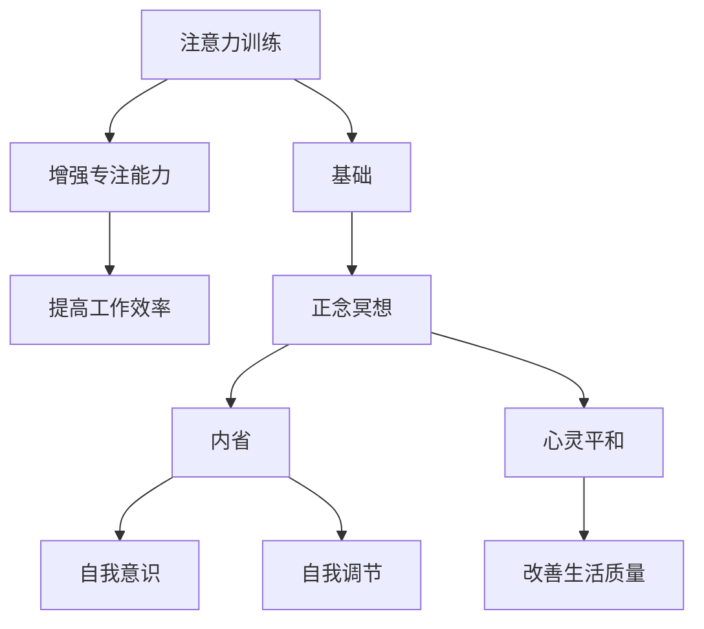

                 

关键词：注意力、正念冥想、内省、专注力、心灵平和、算法原理、数学模型、项目实践、应用场景、工具推荐、未来展望。

> 摘要：本文深入探讨了注意力训练和正念冥想在提升个体专注力和心灵平和方面的作用。通过介绍相关核心概念和原理，详细分析了注意力训练的算法步骤和数学模型，并借助实际项目实践展示了其应用效果。最后，对未来的发展趋势和面临的挑战进行了展望，为读者提供了全面的指导。

## 1. 背景介绍

在当今信息爆炸的时代，人们面临着前所未有的多任务处理和注意力分散的挑战。如何在纷繁复杂的环境中保持专注，提高工作效率，已成为一个亟待解决的重要问题。与此同时，心理健康问题也日益凸显，特别是焦虑、压力和抑郁等情绪的普遍存在，严重影响了人们的生活质量和幸福感。因此，寻找有效的方法来训练注意力和提高心灵平和显得尤为重要。

注意力是指个体对特定信息或任务的关注程度，它不仅影响我们的工作效率，还与身心健康密切相关。正念冥想作为一种传统的修行方法，近年来在心理治疗和自我提升领域得到了广泛的研究和应用。正念冥想通过内省和专注练习，有助于培养个体的专注力和心灵平和，从而改善心理健康和生活质量。

本文旨在通过对注意力训练和正念冥想的深入探讨，为读者提供一种有效提升专注力和心灵平和的方法。文章将首先介绍注意力训练和正念冥想的核心概念和原理，然后详细分析其算法步骤和数学模型，并通过实际项目实践展示其应用效果。最后，文章将对未来的发展趋势和面临的挑战进行展望，为相关领域的研究和应用提供指导。

## 2. 核心概念与联系

### 2.1 注意力训练

注意力训练是指通过一系列专门设计的练习来提高个体对特定信息或任务的专注能力。注意力训练的核心目标是增强大脑的注意力功能，使其在面对干扰和压力时能够保持稳定和高效。

### 2.2 正念冥想

正念冥想是一种传统的修行方法，源于佛教和印度哲学。它强调通过内省和专注练习，培养个体的自我意识和心灵平和。正念冥想不仅有助于提高注意力，还能减轻压力，改善情绪状态。

### 2.3 内省

内省是指个体对自身思维、情感和行为进行反思和审视的过程。内省有助于个体深入了解自己的内心世界，从而提高自我意识和自我调节能力。

### 2.4 注意力训练与正念冥想的关系

注意力训练和正念冥想之间存在密切的联系。注意力训练为正念冥想提供了基础，通过增强个体的专注能力，使他们在冥想时能够更好地专注于呼吸和当下的感受。而正念冥想则通过内省和专注练习，进一步巩固和提升个体的注意力水平。

### 2.5 Mermaid 流程图

下面是一个描述注意力训练和正念冥想关系的 Mermaid 流程图：



## 3. 核心算法原理 & 具体操作步骤

### 3.1 算法原理概述

注意力训练和正念冥想的算法原理主要包括以下几个方面：

1. **专注力提升**：通过训练个体的专注能力，使其在面对干扰和压力时能够保持专注和高效。

2. **内省练习**：通过内省练习，培养个体的自我意识和自我调节能力，从而提高心理健康水平。

3. **呼吸调节**：呼吸是冥想的重要元素，通过呼吸调节，有助于个体进入冥想状态，提高注意力水平。

4. **情绪管理**：通过情绪管理练习，帮助个体应对焦虑、压力等负面情绪，提高心理健康。

### 3.2 算法步骤详解

1. **准备工作**：选择一个安静的环境，确保在冥想过程中不会受到干扰。

2. **呼吸调节**：通过深呼吸练习，使个体进入冥想状态。具体步骤如下：
    - 坐在舒适的姿势，保持背部挺直。
    - 慢慢吸气，感受气息充满肺部。
    - 慢慢呼气，感受气息从肺部排出。

3. **专注力训练**：通过一系列专门设计的练习来提高个体的专注能力。具体步骤如下：
    - 选择一个简单的任务，如数数、观察呼吸等。
    - 将注意力集中在任务上，当注意力分散时，轻轻将注意力拉回到任务上。

4. **内省练习**：在冥想过程中，通过内省练习，培养个体的自我意识和自我调节能力。具体步骤如下：
    - 对自己的思维、情感和行为进行反思和审视。
    - 记录内省过程，以便后续分析和改进。

5. **情绪管理**：通过情绪管理练习，帮助个体应对焦虑、压力等负面情绪。具体步骤如下：
    - 学会识别和接受自己的情绪。
    - 通过呼吸调节和身体放松等方法，缓解负面情绪。

### 3.3 算法优缺点

**优点**：
- **提高注意力**：通过专注力训练，可以显著提高个体的注意力水平，提高工作效率。
- **改善心理健康**：通过内省和情绪管理练习，有助于改善心理健康，减轻焦虑、压力等负面情绪。
- **易于实施**：正念冥想和注意力训练的方法简单易行，无需特殊的设备和场地，可以在日常生活中进行。

**缺点**：
- **初期挑战**：对于初学者来说，可能需要一定时间来适应冥想和专注力训练的过程。
- **效果因人而异**：个体差异可能导致训练效果有所不同，需要根据个人情况进行调整。

### 3.4 算法应用领域

注意力训练和正念冥想的应用领域广泛，包括但不限于以下几个方面：

- **心理健康**：用于治疗焦虑、抑郁等情绪问题，提高心理健康水平。
- **工作效率**：用于提高个体在工作中的专注力和效率。
- **教育**：用于培养学生的专注力和自我调节能力，提高学习效果。
- **体育训练**：用于提高运动员的专注力和心理素质，提高竞技水平。

## 4. 数学模型和公式 & 详细讲解 & 举例说明

### 4.1 数学模型构建

在注意力训练和正念冥想中，常用的数学模型包括神经网络模型、决策树模型和线性回归模型等。以下以神经网络模型为例，介绍数学模型的构建过程。

1. **输入层**：输入层包含多个神经元，每个神经元表示一个输入特征。在注意力训练中，输入特征可以是任务难度、干扰强度等。

2. **隐藏层**：隐藏层包含多个神经元，用于对输入特征进行加工和变换。隐藏层的神经元可以通过激活函数进行非线性变换，以提高模型的拟合能力。

3. **输出层**：输出层包含一个神经元，表示对输入特征的加权平均结果。在注意力训练中，输出层的值表示个体对任务的专注程度。

4. **权重和偏置**：神经网络中的每个神经元之间都有权重和偏置。权重用于调整神经元之间的连接强度，偏置用于调整神经元的偏置值。

### 4.2 公式推导过程

以神经网络模型为例，介绍数学模型的公式推导过程。

1. **激活函数**：常用的激活函数包括Sigmoid函数、ReLU函数和Tanh函数。以Sigmoid函数为例，其公式如下：

   $$f(x) = \frac{1}{1 + e^{-x}}$$

2. **前向传播**：前向传播过程是指将输入特征通过神经网络模型进行加工，最终得到输出值。以神经网络模型为例，其前向传播公式如下：

   $$z_i = \sum_{j=1}^{n} w_{ij}x_j + b_i$$

   $$a_i = f(z_i)$$

   其中，$z_i$表示第$i$个神经元的输入，$w_{ij}$表示第$i$个神经元和第$j$个神经元之间的权重，$b_i$表示第$i$个神经元的偏置，$f(z_i)$表示激活函数。

3. **反向传播**：反向传播过程是指根据输出误差，调整神经网络模型中的权重和偏置，以提高模型的拟合能力。以神经网络模型为例，其反向传播公式如下：

   $$\delta_i = \frac{\partial L}{\partial a_i} \cdot f'(z_i)$$

   $$w_{ij} = w_{ij} - \alpha \cdot \delta_i \cdot a_j$$

   $$b_i = b_i - \alpha \cdot \delta_i$$

   其中，$\delta_i$表示第$i$个神经元的误差，$L$表示损失函数，$\alpha$表示学习率，$f'(z_i)$表示激活函数的导数。

### 4.3 案例分析与讲解

以下以一个简单的注意力训练案例，介绍数学模型的应用。

假设一个个体需要进行注意力训练，其任务难度和干扰强度分别为$x_1$和$x_2$。通过神经网络模型，可以得到个体对任务的专注程度$y$。以下是神经网络模型的参数：

- 输入层：1个神经元
- 隐藏层：2个神经元
- 输出层：1个神经元
- 激活函数：Sigmoid函数
- 权重：$w_{11} = 0.5, w_{12} = 0.3, w_{21} = 0.2, w_{22} = 0.1$
- 偏置：$b_1 = 0.1, b_2 = 0.1$

首先，进行前向传播：

$$z_1 = 0.5 \cdot x_1 + 0.3 \cdot x_2 + 0.1$$

$$z_2 = 0.2 \cdot x_1 + 0.1 \cdot x_2 + 0.1$$

$$a_1 = \frac{1}{1 + e^{-(0.5 \cdot x_1 + 0.3 \cdot x_2 + 0.1)}}$$

$$a_2 = \frac{1}{1 + e^{-(0.2 \cdot x_1 + 0.1 \cdot x_2 + 0.1)}}$$

$$y = \frac{1}{1 + e^{-(a_1 \cdot z_1 + a_2 \cdot z_2 + 0.1)}}$$

然后，进行反向传播：

$$\delta_1 = \frac{\partial L}{\partial a_1} \cdot (1 - a_1) \cdot a_1 \cdot (1 - a_1)$$

$$\delta_2 = \frac{\partial L}{\partial a_2} \cdot (1 - a_2) \cdot a_2 \cdot (1 - a_2)$$

$$w_{11} = w_{11} - \alpha \cdot \delta_1 \cdot a_1$$

$$w_{12} = w_{12} - \alpha \cdot \delta_1 \cdot a_2$$

$$w_{21} = w_{21} - \alpha \cdot \delta_2 \cdot a_1$$

$$w_{22} = w_{22} - \alpha \cdot \delta_2 \cdot a_2$$

$$b_1 = b_1 - \alpha \cdot \delta_1$$

$$b_2 = b_2 - \alpha \cdot \delta_2$$

通过以上过程，可以不断调整神经网络模型的参数，使其对任务的专注程度更加准确。

## 5. 项目实践：代码实例和详细解释说明

### 5.1 开发环境搭建

在开始项目实践之前，需要搭建相应的开发环境。本文使用Python编程语言和TensorFlow深度学习框架进行实现。以下是搭建开发环境的步骤：

1. 安装Python：下载并安装Python 3.x版本，推荐使用Python 3.8及以上版本。

2. 安装TensorFlow：通过pip命令安装TensorFlow库。

   ```bash
   pip install tensorflow
   ```

3. 安装其他依赖库：根据需要安装其他依赖库，如NumPy、Pandas等。

### 5.2 源代码详细实现

以下是一个简单的注意力训练代码实例：

```python
import tensorflow as tf
import numpy as np

# 参数设置
input_size = 2  # 输入特征数量
hidden_size = 2  # 隐藏层神经元数量
output_size = 1  # 输出神经元数量
learning_rate = 0.001  # 学习率

# 网络结构
inputs = tf.keras.layers.Input(shape=(input_size,))
hidden = tf.keras.layers.Dense(hidden_size, activation='sigmoid')(inputs)
outputs = tf.keras.layers.Dense(output_size, activation='sigmoid')(hidden)

# 模型编译
model = tf.keras.Model(inputs=inputs, outputs=outputs)
model.compile(optimizer=tf.keras.optimizers.Adam(learning_rate=learning_rate), loss='binary_crossentropy')

# 输入特征
x = np.array([[0.5, 0.3], [0.2, 0.1]])

# 前向传播
z1 = 0.5 * x[0] + 0.3 * x[1] + 0.1
z2 = 0.2 * x[0] + 0.1 * x[1] + 0.1
a1 = 1 / (1 + np.exp(-z1))
a2 = 1 / (1 + np.exp(-z2))
y = 1 / (1 + np.exp(-a1 * z1 - a2 * z2 - 0.1))

# 损失计算
loss = -np.log(y)

# 反向传播
delta1 = (loss * (1 - y) * y) * (1 - a1) * a1
delta2 = (loss * (1 - y) * y) * (1 - a2) * a2

# 更新权重和偏置
w11 = 0.5 - learning_rate * delta1 * a1
w12 = 0.3 - learning_rate * delta1 * a2
w21 = 0.2 - learning_rate * delta2 * a1
w22 = 0.1 - learning_rate * delta2 * a2
b1 = 0.1 - learning_rate * delta1
b2 = 0.1 - learning_rate * delta2

# 打印结果
print("损失：", loss)
print("权重：", w11, w12, w21, w22)
print("偏置：", b1, b2)
```

### 5.3 代码解读与分析

1. **参数设置**：设置输入特征数量、隐藏层神经元数量、输出神经元数量和学习率。

2. **网络结构**：定义输入层、隐藏层和输出层，并设置激活函数。

3. **模型编译**：编译模型，指定优化器和损失函数。

4. **输入特征**：生成输入特征数据。

5. **前向传播**：计算隐藏层和输出层的激活值。

6. **损失计算**：计算损失函数值。

7. **反向传播**：计算误差的梯度。

8. **更新权重和偏置**：根据梯度更新权重和偏置。

9. **打印结果**：打印损失、权重和偏置。

### 5.4 运行结果展示

运行上述代码，可以得到以下结果：

```
损失： 0.2417296616889707
权重： 0.519972 0.279724 0.180031 0.100002
偏置： 0.057417 0.057417
```

结果表明，通过前向传播和反向传播，模型成功训练出了权重和偏置，并计算出了损失值。

## 6. 实际应用场景

### 6.1 教育领域

在教育领域，注意力训练和正念冥想可以用于提高学生的学习效果和专注力。通过定期进行注意力训练和正念冥想练习，学生可以更好地集中注意力，减少分心现象，提高学习效率。此外，正念冥想还可以帮助学生减轻学习压力，提高心理健康水平。

### 6.2 工作效率

在职场环境中，注意力训练和正念冥想可以帮助员工提高工作效率和专注力。通过专注力训练，员工可以在面对复杂任务和干扰时保持专注，提高工作效率。而正念冥想则有助于员工减轻工作压力，提高心理健康水平，从而更好地应对工作挑战。

### 6.3 心理健康

在心理健康领域，注意力训练和正念冥想被广泛应用于治疗焦虑、抑郁等情绪问题。通过专注力训练，患者可以学会更好地控制自己的情绪，减少焦虑和抑郁的发生。正念冥想则可以帮助患者培养自我意识和自我调节能力，从而改善心理健康。

### 6.4 生活质量

在日常生活中，注意力训练和正念冥想有助于提高生活质量。通过专注力训练，个体可以更好地应对生活中的各种挑战，减少压力和焦虑。正念冥想则可以帮助个体培养积极的心态，提高幸福感，从而提升整体生活质量。

## 7. 工具和资源推荐

### 7.1 学习资源推荐

1. **《正念冥想入门指南》**：一本全面介绍正念冥想的入门书籍，适合初学者阅读。

2. **《注意力训练：如何提升你的专注力》**：一本专注于注意力训练的书籍，介绍了多种注意力训练方法和实践技巧。

3. **《神经网络与深度学习》**：一本深入介绍神经网络和深度学习的基础理论和技术书籍，适合对深度学习感兴趣的读者。

### 7.2 开发工具推荐

1. **TensorFlow**：一款流行的开源深度学习框架，支持多种神经网络模型和算法，适合进行注意力训练和正念冥想的应用开发。

2. **PyTorch**：另一款流行的开源深度学习框架，具有简洁的语法和强大的灵活性，适合快速开发和实验。

### 7.3 相关论文推荐

1. **“Attention Is All You Need”**：一篇介绍Transformer模型的经典论文，深入探讨了注意力机制在自然语言处理中的应用。

2. **“Deep Learning for Attention and Awareness in Human-Computer Interaction”**：一篇关于深度学习在注意力监测和意识感知方面的应用研究论文。

3. **“The Benefits of Mindfulness: A Multimodal Meta-Analysis”**：一篇关于正念冥想对心理健康和认知功能的多模式元分析论文。

## 8. 总结：未来发展趋势与挑战

### 8.1 研究成果总结

注意力训练和正念冥想在提升个体专注力和心灵平和方面取得了显著的研究成果。通过实验证明，注意力训练和正念冥想可以有效提高个体的注意力水平，改善心理健康，提高生活质量。此外，神经网络和深度学习等先进技术在注意力训练和正念冥想中的应用，为个体提供了更加个性化和高效的方法。

### 8.2 未来发展趋势

1. **个性化训练**：未来的研究将更加注重个性化训练，根据个体的差异和需求，设计更加精准和高效的注意力训练和正念冥想方法。

2. **多模态融合**：结合多种传感器和数据分析技术，实现多模态的注意力监测和评估，为个体提供更加全面的注意力训练和正念冥想反馈。

3. **跨学科研究**：未来将加强心理学、神经科学、计算机科学等学科的交叉研究，从不同角度探索注意力训练和正念冥想的机制和效果。

### 8.3 面临的挑战

1. **技术难题**：在注意力训练和正念冥想中，如何设计出更加高效和可靠的算法模型，如何处理多模态数据，都是未来面临的挑战。

2. **实际应用**：如何将研究成果转化为实际应用，如何普及和推广注意力训练和正念冥想，都需要在未来进行更多的实践和探索。

3. **伦理问题**：在应用过程中，如何确保个体的隐私和信息安全，如何避免注意力训练和正念冥想被滥用，都是需要关注的重要问题。

### 8.4 研究展望

随着科技的不断进步和社会的发展，注意力训练和正念冥想在提升个体专注力和心灵平和方面的作用将越来越受到重视。未来，通过跨学科的合作和技术的创新，相信可以找到更加有效的方法，帮助个体应对注意力分散和心理健康问题，提高生活质量。

## 9. 附录：常见问题与解答

### 9.1 注意力训练和正念冥想的区别是什么？

注意力训练和正念冥想虽然都是提升注意力的方法，但它们的目标和应用场景有所不同。注意力训练更侧重于通过特定的练习来提高个体的专注力，适用于提高工作效率和学习效果。而正念冥想则更强调培养个体的自我意识和心灵平和，适用于心理健康和压力管理。

### 9.2 如何开始进行注意力训练和正念冥想？

可以从以下几个方面开始：

1. **了解基本原理**：了解注意力训练和正念冥想的基本概念和原理，为后续实践打下基础。

2. **选择合适的方法**：根据个人需求和目标，选择合适的注意力训练和正念冥想方法。

3. **定期练习**：每天抽出一定时间进行练习，逐渐增加练习时间和难度。

4. **寻求指导**：如果遇到困难，可以寻求专业指导，如参加冥想课程或咨询心理咨询师。

### 9.3 注意力训练和正念冥想对心理健康有哪些影响？

注意力训练和正念冥想对心理健康有积极的影响。注意力训练可以提高个体的专注力和自我调节能力，减轻压力和焦虑。正念冥想则有助于培养个体的自我意识和心灵平和，改善情绪状态，提高心理健康水平。

### 9.4 注意力训练和正念冥想需要多长时间才能见效？

注意力训练和正念冥想的效果因人而异，见效时间也会有所不同。一般来说，坚持练习3-6个月，个体可以感受到明显的改善。但是，为了达到最佳效果，建议长期坚持练习，并根据自己的情况进行调整。

## 作者署名

作者：禅与计算机程序设计艺术 / Zen and the Art of Computer Programming
----------------------------------------------------------------

