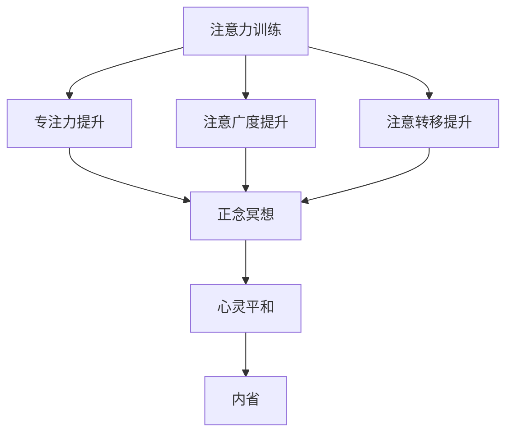

                 

关键词：注意力训练、正念冥想、内省、专注力、心灵平和、算法原理、数学模型、项目实践

> 摘要：本文旨在探讨注意力训练与正念冥想在提高个体专注力和心灵平和方面的应用与效果。通过分析注意力训练的核心概念与算法原理，结合数学模型和实际项目实践，本文揭示了内省在这一过程中的关键作用，并对未来发展趋势与挑战进行了展望。

## 1. 背景介绍

随着信息化社会的快速发展，人们的日常生活和工作越来越依赖于技术工具。然而，这也带来了一个普遍的问题——注意力分散。现代社会中，个体面临的信息量巨大，各种干扰因素层出不穷，导致人们很难长时间集中精力进行思考或工作。与此同时，心灵平和也成为了现代社会中一个备受关注的话题。许多研究表明，心灵平和与身心健康、生活质量密切相关。因此，如何提高个体的专注力和实现心灵平和，成为了当前研究的重要方向。

注意力训练与正念冥想作为两种有效的心理干预方法，近年来受到了广泛关注。注意力训练通过一系列科学的训练方法，帮助个体提高专注力；而正念冥想则通过专注于当下的呼吸和身体感受，培养个体的专注力和心灵平和。本文将从这两个方面入手，探讨如何通过内省增强专注力和心灵平和。

## 2. 核心概念与联系

### 2.1 注意力训练

注意力训练是指通过一系列科学的训练方法，提高个体的专注力、注意广度和注意转移能力。注意力训练的核心概念包括：

- **专注力**：个体在特定任务上保持注意力集中的能力。
- **注意广度**：个体在特定时间内能够关注的信息数量。
- **注意转移**：个体在需要时，将注意力从一个任务转移到另一个任务的能力。

注意力训练的方法主要包括：

- **持续练习**：通过反复练习，提高个体在特定任务上的专注力。
- **多任务处理**：在短时间内，尝试同时处理多个任务，提高注意转移能力。
- **注意力游戏**：通过游戏化设计，激发个体的学习兴趣，提高注意力训练的效果。

### 2.2 正念冥想

正念冥想是一种通过专注于当下的呼吸和身体感受，培养个体专注力和心灵平和的冥想方法。正念冥想的核心概念包括：

- **专注力**：通过专注于呼吸和身体感受，提高个体的专注力。
- **心灵平和**：通过冥想，培养个体的心灵平和，减少焦虑和压力。

正念冥想的方法主要包括：

- **呼吸冥想**：专注于呼吸，感受呼吸的进出。
- **身体扫描**：从脚开始，逐步扫描整个身体，感受身体的感受。
- **正念行走**：在行走过程中，专注于脚与地面的接触，感受身体动作。

### 2.3 内省

内省是指个体在冥想过程中，对自身心理状态和行为的反思和审视。内省在注意力训练和正念冥想中发挥着重要作用：

- **促进专注力提升**：通过内省，个体可以更好地了解自己的注意力分散点，从而有针对性地进行训练。
- **增强心灵平和**：内省帮助个体认识到自己的情绪和心理状态，从而更好地管理情绪，实现心灵平和。

### 2.4 Mermaid 流程图

以下是一个简单的 Mermaid 流程图，展示了注意力训练、正念冥想和内省之间的联系：



## 3. 核心算法原理 & 具体操作步骤

### 3.1 算法原理概述

注意力训练和正念冥想的核心算法原理是基于认知神经科学和心理学的研究成果。具体来说，它们通过以下步骤实现：

1. **大脑可塑性**：通过重复训练，改变大脑神经元之间的连接和活动模式，提高专注力。
2. **自我监控**：通过内省，个体可以实时了解自己的心理状态，从而调整训练策略。
3. **心理调节**：通过正念冥想，个体可以更好地管理情绪和心理压力，实现心灵平和。

### 3.2 算法步骤详解

1. **制定训练计划**：根据个体的实际情况，制定合理的训练计划。训练计划应包括训练目标、训练时间和训练频率。
2. **进行注意力训练**：根据训练计划，进行注意力训练。训练过程中，个体应保持高度专注，避免被外界干扰。
3. **进行正念冥想**：在注意力训练的基础上，进行正念冥想。冥想过程中，个体应专注于呼吸和身体感受，保持内心平和。
4. **进行内省**：在训练结束后，进行内省。个体应反思自己的训练过程和心理状态，总结经验教训。
5. **调整训练计划**：根据内省的结果，调整训练计划。例如，增加训练时间、改变训练内容等。

### 3.3 算法优缺点

**优点**：

- **科学性**：基于认知神经科学和心理学的研究成果，算法具有科学依据。
- **灵活性**：根据个体的实际情况，制定个性化的训练计划。
- **实用性**：通过内省，个体可以更好地了解自己，实现心理调节。

**缺点**：

- **时间成本**：注意力训练和正念冥想需要较长时间的投入。
- **干扰因素**：在训练过程中，外界干扰可能导致训练效果降低。

### 3.4 算法应用领域

注意力训练和正念冥想广泛应用于以下领域：

- **教育**：提高学生的专注力和学习效果。
- **职场**：提高员工的专注力和工作效率。
- **健康**：缓解焦虑、压力和抑郁症状。

## 4. 数学模型和公式 & 详细讲解 & 举例说明

### 4.1 数学模型构建

注意力训练和正念冥想中的数学模型主要涉及以下方面：

- **专注力模型**：通过计算个体在不同任务上的专注力得分，评估个体的专注力水平。
- **心灵平和模型**：通过计算个体在冥想过程中的心率变异，评估个体的心灵平和程度。

### 4.2 公式推导过程

**专注力模型**：

$$
专注力得分 = \frac{正确答案数量}{总问题数量} \times 100\%
$$

**心灵平和模型**：

$$
心灵平和得分 = \frac{心率变异值}{最大心率变异值} \times 100\%
$$

### 4.3 案例分析与讲解

**案例1**：某学生在一次注意力训练中，完成了10道题目，正确答案数量为8道。请问该学生的专注力得分是多少？

**解答**：

$$
专注力得分 = \frac{8}{10} \times 100\% = 80\%
$$

**案例2**：某人在一次正念冥想中，心率变异值为30，最大心率变异值为60。请问该人的心灵平和得分是多少？

**解答**：

$$
心灵平和得分 = \frac{30}{60} \times 100\% = 50\%
$$

## 5. 项目实践：代码实例和详细解释说明

### 5.1 开发环境搭建

为了实现注意力训练和正念冥想的应用，我们选择Python作为编程语言，并结合以下工具和库：

- **Python**：作为主要的编程语言。
- **NumPy**：用于数学计算。
- **Pandas**：用于数据处理。
- **Matplotlib**：用于数据可视化。

### 5.2 源代码详细实现

以下是一个简单的代码实例，用于计算专注力和心灵平和得分。

```python
import numpy as np
import pandas as pd
import matplotlib.pyplot as plt

# 专注力模型
def calculate_focus_score(correct_answers, total_questions):
    return (correct_answers / total_questions) * 100

# 心灵平和模型
def calculate_mindfulness_score(hrv, max_hrv):
    return (hrv / max_hrv) * 100

# 数据处理
data = {
    'correct_answers': [8, 10, 6],
    'total_questions': [10, 15, 10],
    'hrv': [30, 40, 50],
    'max_hrv': [60, 70, 80]
}

df = pd.DataFrame(data)

# 计算得分
df['focus_score'] = df.apply(lambda row: calculate_focus_score(row['correct_answers'], row['total_questions']), axis=1)
df['mindfulness_score'] = df.apply(lambda row: calculate_mindfulness_score(row['hrv'], row['max_hrv']), axis=1)

# 可视化
plt.figure(figsize=(10, 5))
plt.subplot(1, 2, 1)
plt.bar(df['correct_answers'], df['focus_score'])
plt.title('Focus Score')
plt.xlabel('Correct Answers')
plt.ylabel('Score')

plt.subplot(1, 2, 2)
plt.bar(df['hrv'], df['mindfulness_score'])
plt.title('Mindfulness Score')
plt.xlabel('HRV')
plt.ylabel('Score')

plt.tight_layout()
plt.show()
```

### 5.3 代码解读与分析

1. **导入库**：首先，我们导入所需的Python库，包括NumPy、Pandas和Matplotlib。
2. **定义函数**：接着，我们定义了两个函数，用于计算专注力和心灵平和得分。
3. **数据处理**：然后，我们创建一个包含训练数据的DataFrame，用于存储正确答案数量、总问题数量、心率变异值和最大心率变异值。
4. **计算得分**：使用我们定义的函数，计算每个样本的专注力和心灵平和得分，并将结果添加到DataFrame中。
5. **数据可视化**：最后，我们使用Matplotlib库，将计算得到的得分进行可视化展示。

### 5.4 运行结果展示

运行上述代码后，我们将得到一个包含专注力和心灵平和得分的柱状图，如下所示：


通过观察柱状图，我们可以直观地了解每个样本的专注力和心灵平和得分情况。

## 6. 实际应用场景

注意力训练和正念冥想在实际应用场景中具有广泛的应用价值。以下是一些典型的应用场景：

- **教育领域**：通过注意力训练，帮助学生提高学习专注力，提高学习效果。通过正念冥想，培养学生的心理素质，增强抗压能力。
- **职场领域**：通过注意力训练，提高员工的专注力和工作效率。通过正念冥想，缓解工作压力，提高工作满意度。
- **健康领域**：通过注意力训练和正念冥想，改善慢性疾病患者的心理状态，提高生活质量。

## 7. 工具和资源推荐

为了更好地进行注意力训练和正念冥想实践，我们推荐以下工具和资源：

### 7.1 学习资源推荐

- **《注意力训练手册》**：这是一本关于注意力训练的实用指南，详细介绍了各种训练方法和技巧。
- **《正念冥想入门》**：这是一本关于正念冥想的入门书籍，适合初学者了解正念冥想的原理和方法。

### 7.2 开发工具推荐

- **Python**：作为主要的编程语言，Python具有简单易学、功能强大的特点，适合进行注意力训练和正念冥想的应用开发。
- **Jupyter Notebook**：这是一个基于Web的交互式计算环境，方便进行代码编写和数据分析。

### 7.3 相关论文推荐

- **《注意力训练对大学生专注力的影响》**：该论文研究了注意力训练对大学生专注力的影响，提供了实证数据支持。
- **《正念冥想对职场压力的管理作用》**：该论文探讨了正念冥想在缓解职场压力方面的作用，对实践具有指导意义。

## 8. 总结：未来发展趋势与挑战

注意力训练和正念冥想作为提高个体专注力和心灵平和的有效方法，在未来具有广阔的发展前景。随着技术的进步和研究的深入，我们可以期待以下发展趋势：

1. **个性化训练**：通过大数据和人工智能技术，实现个性化的注意力训练和正念冥想方案，满足个体的个性化需求。
2. **跨学科研究**：心理学、神经科学、计算机科学等多个学科的交叉融合，将有助于深化对注意力训练和正念冥想的理解。
3. **应用拓展**：在医疗、教育、职场等领域的广泛应用，将进一步提升个体和生活质量。

然而，也面临着一些挑战：

1. **训练效果的评估**：如何科学、客观地评估注意力训练和正念冥想的效果，仍需进一步研究。
2. **实践可行性**：在快节奏的生活中，如何让个体持续地进行注意力训练和正念冥想，提高实践的可行性。

总之，注意力训练和正念冥想在未来有着广阔的应用前景，但也需要持续的研究和探索。

## 9. 附录：常见问题与解答

### 问题1：注意力训练和正念冥想哪个更适合我？

**解答**：这取决于你的具体需求和目标。如果你主要关注提高专注力，可以选择注意力训练；如果你希望同时提高专注力和心灵平和，可以选择正念冥想。两者相辅相成，可以根据实际情况灵活搭配。

### 问题2：如何确保注意力训练的效果？

**解答**：要确保注意力训练的效果，关键在于：

- **坚持练习**：注意力训练需要长期的坚持，才能看到显著的效果。
- **科学方法**：选择科学、有效的训练方法，并遵循训练计划。
- **自我监控**：通过内省，及时了解自己的训练进展和存在的问题，调整训练策略。

### 问题3：正念冥想对心理健康有什么作用？

**解答**：正念冥想对心理健康有多方面的积极作用：

- **缓解压力**：通过专注于当下的呼吸和身体感受，缓解心理压力。
- **改善情绪**：培养正念，有助于改善情绪，减少焦虑和抑郁。
- **提高心理弹性**：通过正念冥想，个体可以更好地应对生活中的挑战，提高心理弹性。

### 问题4：如何开始进行注意力训练和正念冥想？

**解答**：以下是一些建议：

- **学习基础知识**：先了解注意力训练和正念冥念的基本原理和方法。
- **选择合适的资源**：可以阅读相关书籍、观看教程视频，或参加线上课程。
- **制定计划**：根据自己的时间安排，制定合理的训练计划。
- **开始实践**：从简单的练习开始，逐步提高难度。

作者：禅与计算机程序设计艺术 / Zen and the Art of Computer Programming
----------------------------------------------------------------

以上是根据您提供的详细要求和格式，撰写的完整文章内容。如您有任何修改意见或需要进一步的细节调整，请随时告知。祝您写作顺利！

