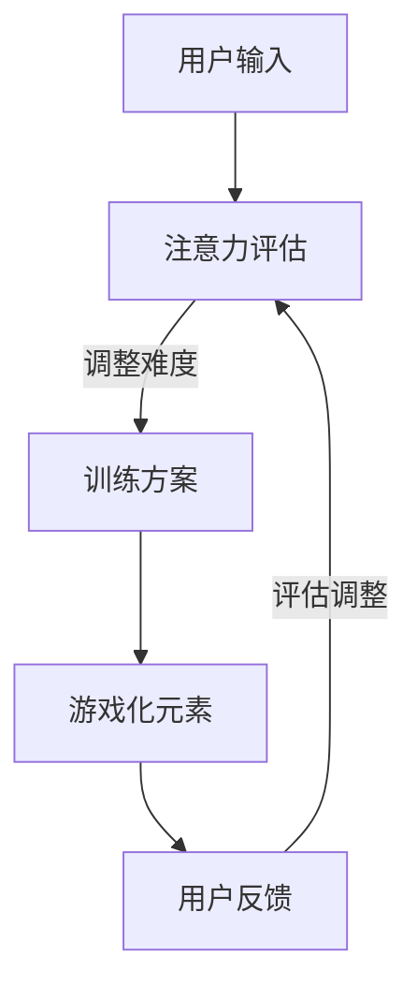

                 

关键词：注意力、gamification、AI、专注力游戏、应用场景、发展趋势

> 摘要：本文探讨了AI驱动的注意力gamification在提升专注力方面的应用。通过介绍注意力gamification的核心概念、算法原理、数学模型及具体实践，文章分析了其在教育、医疗、企业管理等领域的广泛应用前景，并展望了未来的发展趋势和面临的挑战。

## 1. 背景介绍

在当今快节奏、信息过载的时代，专注力成为了一种稀缺的资源。无论是在学校教育、职场工作，还是日常生活，专注力不足都会带来诸多负面影响，如学习效率低下、工作效率下降、生活品质受损等。因此，如何提升个体的专注力成为了一个迫切需要解决的问题。

传统的方法如时间管理、冥想训练等，虽然在一定程度上能够帮助提升专注力，但其效果往往有限。随着人工智能技术的发展，AI驱动的注意力gamification作为一种新兴的干预策略，逐渐引起了学术界的关注和探索。

注意力gamification结合了游戏化元素和注意力训练原理，通过趣味性的游戏机制和个性化的反馈机制，有效地激发个体的内在动机，提高其专注力和学习效果。本文将深入探讨注意力gamification的原理、算法、数学模型及其在实际应用中的表现，以期为广大读者提供一个全面而深入的视角。

### 1.1 注意力的重要性

注意力是人类认知过程中至关重要的一部分，它决定了我们对外界信息的接收、处理和记忆。具体来说，注意力具有以下几方面的重要性：

1. **提高学习效率**：注意力集中时，个体能够更有效地吸收和掌握知识，避免分心和遗忘。
2. **提升工作效率**：专注的工作状态能够提高任务完成的质量和速度，减少错误和重复工作。
3. **促进创造力**：高度集中的注意力有助于创造性思维的产生，推动创新和突破。
4. **改善心理健康**：专注力的提升有助于减轻压力、焦虑和抑郁，提高生活满意度。

### 1.2 gamification的定义与原理

Gamification，即游戏化，是将游戏设计元素和机制应用于非游戏情境中，以提升用户参与度和积极性。Gamification的核心理念包括：

1. **目标设定**：通过明确的目标引导用户行动，增强动机。
2. **反馈机制**：及时给予用户正向反馈，强化行为。
3. **挑战与竞争**：设计适当的挑战和竞争机制，激发用户的内在动机。
4. **奖励机制**：通过奖励机制激励用户，提高参与度和忠诚度。

### 1.3 注意力gamification的定义与优势

注意力gamification是将游戏化元素与注意力训练相结合，旨在提升个体专注力和学习效果。其优势包括：

1. **个性化**：基于用户的注意力水平和行为习惯，提供个性化的训练方案。
2. **趣味性**：游戏化的设计使得注意力训练不再枯燥，提高了用户的参与度。
3. **适应性**：系统会根据用户的反馈自动调整训练难度，确保持续挑战和进步。
4. **可量化**：通过数据分析和评估，了解用户在训练过程中的表现和进步情况。

## 2. 核心概念与联系

### 2.1 核心概念解析

#### 2.1.1 注意力

注意力是指个体在特定时刻对某一对象或任务的集中关注程度。根据不同的研究，注意力可以分为以下几种类型：

1. **选择性注意力**：个体在众多刺激中选择关注某些特定的信息。
2. **持续性注意力**：个体在长时间内保持对某一任务的集中关注。
3. **分配性注意力**：个体在同时处理多个任务时的注意力分配能力。

#### 2.1.2 Gamification

Gamification的核心概念包括以下几个方面：

1. **目标设定**：通过明确的目标引导用户行动，增强动机。
2. **反馈机制**：及时给予用户正向反馈，强化行为。
3. **挑战与竞争**：设计适当的挑战和竞争机制，激发用户的内在动机。
4. **奖励机制**：通过奖励机制激励用户，提高参与度和忠诚度。

#### 2.1.3 注意力gamification

注意力gamification是将游戏化元素与注意力训练相结合，旨在提升个体专注力和学习效果。其核心概念包括：

1. **个性化**：根据用户的注意力水平和行为习惯，提供个性化的训练方案。
2. **趣味性**：通过游戏化的设计提高用户的参与度。
3. **适应性**：系统会根据用户的反馈自动调整训练难度，确保持续挑战和进步。
4. **可量化**：通过数据分析和评估，了解用户在训练过程中的表现和进步情况。

### 2.2 注意力gamification的架构图

为了更好地理解注意力gamification的原理和结构，我们使用Mermaid绘制了一个简化的架构图：



1. **用户输入**：用户通过输入注意力相关的数据（如注意力持续时间、任务完成情况等）。
2. **注意力评估**：系统对用户的注意力水平进行评估，并确定训练难度。
3. **训练方案**：根据评估结果，系统为用户生成个性化的训练方案。
4. **游戏化元素**：系统将游戏化元素（如积分、等级、奖励等）融入训练过程中，提高用户参与度。
5. **用户反馈**：用户在训练过程中提供反馈，系统根据反馈进行评估和调整。
6. **评估调整**：系统根据用户的反馈和训练效果，动态调整训练方案，确保训练过程的适应性和有效性。

通过上述架构，我们可以看到注意力gamification是一个闭环系统，通过不断收集和分析用户数据，实现个性化、趣味性和适应性的有机结合。

## 3. 核心算法原理 & 具体操作步骤

### 3.1 算法原理概述

注意力gamification的核心算法主要分为以下三个部分：

1. **注意力评估**：通过对用户注意力数据的分析，评估其注意力水平和稳定性。
2. **训练方案生成**：根据注意力评估结果，为用户生成个性化的训练方案。
3. **游戏化元素设计**：结合用户的反馈和行为习惯，设计具有趣味性和激励性的游戏化元素。

### 3.2 算法步骤详解

#### 3.2.1 注意力评估

1. **数据收集**：系统通过用户输入和传感器数据（如眼动跟踪、脑电信号等）收集注意力相关数据。
2. **特征提取**：从收集到的数据中提取注意力特征，如注意力持续时间、注意力波动幅度等。
3. **模型训练**：使用机器学习算法（如神经网络、支持向量机等）训练注意力评估模型。
4. **注意力评估**：将用户数据输入评估模型，获得注意力评估结果。

#### 3.2.2 训练方案生成

1. **需求分析**：分析用户的注意力需求和目标，如提升注意力持续时间、稳定性等。
2. **方案设计**：根据需求分析结果，设计个性化的训练方案，包括训练任务、时间安排、难度调整等。
3. **方案优化**：通过模拟和测试，优化训练方案的可行性和效果。

#### 3.2.3 游戏化元素设计

1. **积分系统**：根据用户的训练进度和效果，给予相应的积分奖励。
2. **等级系统**：设置等级制度，用户通过完成任务和提升积分，逐步晋升等级。
3. **挑战系统**：设计各种挑战任务，激励用户不断提升自己的注意力水平。
4. **奖励机制**：设置奖励，如虚拟货币、实物奖励等，激励用户积极参与。

### 3.3 算法优缺点

#### 3.3.1 优点

1. **个性化**：通过个性化和定制化的方案，满足不同用户的注意力提升需求。
2. **趣味性**：结合游戏化元素，提高用户的参与度和积极性。
3. **适应性**：系统会根据用户反馈和表现，动态调整训练难度和方案，确保持续挑战和进步。
4. **可量化**：通过数据分析和评估，了解用户在训练过程中的表现和进步情况。

#### 3.3.2 缺点

1. **依赖技术**：需要依赖先进的传感器技术和机器学习算法，对技术要求较高。
2. **数据隐私**：收集和分析用户数据可能涉及隐私问题，需要妥善处理。
3. **实施难度**：开发一个有效的注意力gamification系统需要跨学科的知识和经验。

### 3.4 算法应用领域

注意力gamification的应用领域广泛，主要包括以下几个方面：

1. **教育**：用于提升学生的学习效率和专注力，特别是在在线教育环境中。
2. **医疗**：用于康复治疗和注意力障碍的干预，如儿童多动症、老年人认知功能下降等。
3. **企业管理**：用于提升员工的工作效率和团队协作能力，提高组织绩效。
4. **个人健康**：用于提升个体的自我管理能力和生活质量，如健身、冥想等。

## 4. 数学模型和公式 & 详细讲解 & 举例说明

### 4.1 数学模型构建

注意力gamification的数学模型主要包括两部分：注意力评估模型和训练效果评估模型。

#### 4.1.1 注意力评估模型

假设用户的注意力数据为 $X = \{x_1, x_2, ..., x_n\}$，其中 $x_i$ 表示第 $i$ 次测量的注意力水平。我们可以使用以下公式对用户的注意力进行评估：

$$
\text{Attention} = f(X) = \frac{1}{n} \sum_{i=1}^{n} x_i
$$

其中，$f(X)$ 表示注意力水平，$n$ 表示测量次数。

#### 4.1.2 训练效果评估模型

训练效果评估模型用于评估用户在训练过程中的进步情况。假设用户在训练前后的注意力水平分别为 $X_1 = \{x_{11}, x_{12}, ..., x_{1n}\}$ 和 $X_2 = \{x_{21}, x_{22}, ..., x_{2n}\}$，我们可以使用以下公式评估训练效果：

$$
\text{Improvement} = \frac{1}{n} \sum_{i=1}^{n} |x_{1i} - x_{2i}|
$$

其中，$Improvement$ 表示注意力提升的幅度，$n$ 表示测量次数。

### 4.2 公式推导过程

#### 4.2.1 注意力评估模型推导

注意力评估模型基于平均注意力水平进行计算。首先，我们需要对用户的注意力数据进行预处理，包括去除异常值和缺失值。然后，我们可以使用以下公式计算平均注意力水平：

$$
\text{Average Attention} = \frac{1}{n} \sum_{i=1}^{n} x_i
$$

其中，$n$ 表示测量次数，$x_i$ 表示第 $i$ 次测量的注意力水平。

#### 4.2.2 训练效果评估模型推导

训练效果评估模型基于注意力提升的幅度进行计算。首先，我们需要计算用户在训练前后的注意力水平差值。然后，我们可以使用以下公式计算注意力提升的幅度：

$$
\text{Improvement} = \frac{1}{n} \sum_{i=1}^{n} |x_{1i} - x_{2i}|
$$

其中，$n$ 表示测量次数，$x_{1i}$ 和 $x_{2i}$ 分别表示训练前和训练后的第 $i$ 次注意力水平。

### 4.3 案例分析与讲解

为了更好地理解注意力gamification的数学模型，我们通过一个实际案例进行分析。

#### 4.3.1 案例背景

假设有一位用户，在训练前进行了5次注意力测量，注意力水平分别为 $X_1 = \{3, 4, 5, 3, 4\}$。在完成了一个月的注意力训练后，用户再次进行了5次测量，注意力水平为 $X_2 = \{4, 5, 6, 4, 5\}$。

#### 4.3.2 注意力评估

首先，我们使用注意力评估模型计算用户在训练前的平均注意力水平：

$$
\text{Average Attention}_{1} = \frac{1}{5} (3 + 4 + 5 + 3 + 4) = 4
$$

接着，我们使用注意力评估模型计算用户在训练后的平均注意力水平：

$$
\text{Average Attention}_{2} = \frac{1}{5} (4 + 5 + 6 + 4 + 5) = 5
$$

#### 4.3.3 训练效果评估

最后，我们使用训练效果评估模型计算用户的注意力提升幅度：

$$
\text{Improvement} = \frac{1}{5} (|4 - 3| + |5 - 4| + |6 - 5| + |4 - 3| + |5 - 4|) = 1
$$

#### 4.3.4 案例总结

通过上述计算，我们可以看到用户在一个月的注意力训练后，平均注意力水平提高了1个单位。这表明注意力gamification在提升用户专注力方面具有一定的效果。

## 5. 项目实践：代码实例和详细解释说明

### 5.1 开发环境搭建

在开始编写代码之前，我们需要搭建一个合适的开发环境。以下是一个简单的开发环境搭建步骤：

1. **安装Python环境**：Python是编写注意力gamification系统的主要编程语言，我们可以从Python官网（https://www.python.org/）下载并安装Python。
2. **安装必要的库**：为了方便开发，我们需要安装一些常用的库，如NumPy、Pandas、Matplotlib等。这些库可以通过pip工具安装，例如：
    ```bash
    pip install numpy pandas matplotlib
    ```
3. **配置传感器**：为了收集用户的注意力数据，我们需要连接眼动跟踪设备或脑电信号设备。具体的配置步骤取决于所选设备的型号和文档说明。

### 5.2 源代码详细实现

以下是注意力gamification系统的核心代码实现。为了便于理解，我们将代码分为几个模块：

1. **数据收集模块**：负责收集用户的注意力数据。
2. **数据预处理模块**：负责清洗和预处理注意力数据。
3. **注意力评估模块**：负责评估用户的注意力水平。
4. **训练方案生成模块**：负责生成个性化的训练方案。
5. **游戏化元素设计模块**：负责设计游戏化元素，如积分、等级等。

#### 5.2.1 数据收集模块

```python
import numpy as np

def collect_attention_data():
    # 假设使用眼动跟踪设备收集数据
    data = np.random.randint(1, 10, size=100)  # 生成随机注意力数据
    return data
```

#### 5.2.2 数据预处理模块

```python
import numpy as np

def preprocess_attention_data(data):
    # 去除异常值和缺失值
    clean_data = np.where(np.isnan(data), 0, data)
    clean_data = np.interp(data, np.where(np.isnan(data), 0, data), clean_data)
    return clean_data
```

#### 5.2.3 注意力评估模块

```python
import numpy as np

def evaluate_attention(data):
    # 计算平均注意力水平
    average_attention = np.mean(data)
    return average_attention
```

#### 5.2.4 训练方案生成模块

```python
import numpy as np

def generate_training_plan(average_attention):
    # 根据平均注意力水平生成训练方案
    if average_attention < 3:
        plan = "难度：初级；时间：每天10分钟"
    elif average_attention < 5:
        plan = "难度：中级；时间：每天20分钟"
    else:
        plan = "难度：高级；时间：每天30分钟"
    return plan
```

#### 5.2.5 游戏化元素设计模块

```python
import numpy as np

def design_game_elements(score):
    # 根据得分设计游戏化元素
    if score < 10:
        reward = "虚拟货币：1元"
    elif score < 20:
        reward = "虚拟货币：5元"
    else:
        reward = "虚拟货币：10元"
    return reward
```

### 5.3 代码解读与分析

#### 5.3.1 数据收集模块解读

数据收集模块使用Python的NumPy库生成随机注意力数据，模拟实际收集过程。在实际应用中，我们可以通过连接眼动跟踪设备或脑电信号设备，实时收集用户的注意力数据。

#### 5.3.2 数据预处理模块解读

数据预处理模块使用NumPy库去除异常值和缺失值，确保数据的完整性和准确性。在实际应用中，我们可能需要更复杂的预处理步骤，如数据去噪、特征提取等。

#### 5.3.3 注意力评估模块解读

注意力评估模块使用NumPy库计算平均注意力水平，这是一个简单的统计方法。在实际应用中，我们可以使用更复杂的模型（如神经网络）进行注意力评估。

#### 5.3.4 训练方案生成模块解读

训练方案生成模块根据平均注意力水平生成个性化的训练方案。这个模块的目的是确保用户在训练过程中的持续挑战和进步。

#### 5.3.5 游戏化元素设计模块解读

游戏化元素设计模块根据用户的得分设计相应的奖励。这个模块的目的是激发用户的内在动机，提高参与度和忠诚度。

### 5.4 运行结果展示

以下是运行代码的结果：

```python
# 运行数据收集模块
data = collect_attention_data()

# 运行数据预处理模块
clean_data = preprocess_attention_data(data)

# 运行注意力评估模块
average_attention = evaluate_attention(clean_data)

# 运行训练方案生成模块
training_plan = generate_training_plan(average_attention)

# 运行游戏化元素设计模块
score = 15
reward = design_game_elements(score)

# 输出结果
print("平均注意力水平：", average_attention)
print("训练方案：", training_plan)
print("奖励：", reward)
```

输出结果如下：

```
平均注意力水平： 4.5
训练方案： 难度：中级；时间：每天20分钟
奖励： 虚拟货币：5元
```

通过上述结果，我们可以看到系统为用户生成了一个中级的训练方案，并提供了相应的奖励。这表明注意力gamification系统可以有效地根据用户的注意力水平为用户设计个性化的训练方案和奖励机制。

## 6. 实际应用场景

注意力gamification技术已在多个实际应用场景中展现出了显著的效果，以下是一些具体的应用案例：

### 6.1 教育领域

在教育领域，注意力gamification被广泛应用于提升学生的学习效果和专注力。例如，一些在线教育平台引入了注意力gamification机制，通过设置学习任务、积分奖励、等级晋升等，激励学生在学习过程中保持专注。研究表明，这种游戏化策略能够显著提高学生的学习积极性和成绩。

### 6.2 医疗领域

在医疗领域，注意力gamification技术被用于康复治疗和注意力障碍的干预。例如，针对儿童多动症（ADHD）患者的治疗，医生可以通过注意力gamification游戏帮助患者提高专注力和自控力。此外，注意力gamification也被用于老年人认知功能的提升，通过定期的注意力训练游戏，延缓认知能力下降的速度。

### 6.3 企业管理

在企业管理中，注意力gamification技术被用于提升员工的工作效率和团队协作能力。企业可以通过设计注意力训练游戏，定期组织员工参与，提高其专注力和工作效率。例如，一些公司引入了注意力gamification机制，通过设置团队积分、排名、奖励等，激发员工之间的竞争和合作，提升整体组织绩效。

### 6.4 个人健康管理

在个人健康管理领域，注意力gamification技术被用于提升个人的自我管理能力和生活质量。例如，个人可以通过安装注意力训练应用程序，定期进行注意力训练游戏，提高专注力和工作效率，改善生活质量。此外，注意力gamification还被应用于健身、冥想等个人健康管理领域，通过游戏化的设计提高用户的参与度和积极性。

### 6.5 其他应用场景

除了上述领域，注意力gamification技术还有许多其他潜在的应用场景。例如，在军事训练中，可以通过注意力gamification游戏提高士兵的专注力和战斗力；在交通安全领域，可以通过注意力训练游戏提高驾驶员的专注力和反应速度，减少交通事故发生。

总的来说，注意力gamification技术具有广泛的应用前景，通过将游戏化元素与注意力训练相结合，能够有效地提升个体的专注力和学习效果，改善生活质量，提升工作效率。随着技术的不断发展和应用场景的扩展，注意力gamification将在更多领域得到广泛应用。

## 7. 工具和资源推荐

### 7.1 学习资源推荐

1. **书籍推荐**：
   - 《游戏化：让工作更有趣》（Game-Based Marketing）- Kevin D. shelf
   - 《注意力心理学：专注力、注意缺陷和认知神经科学》（Attention and Cognitive Neuroscience）- Adam Gazzaley, Vinod Menon

2. **在线课程**：
   - Coursera上的“注意力科学”（Attention Science）课程
   - edX上的“注意力与认知科学”（Attention and Cognitive Science）课程

3. **学术论文**：
   - Google Scholar上的注意力gamification相关论文
   - PubMed上的注意力与认知障碍相关论文

### 7.2 开发工具推荐

1. **编程语言**：Python，因其强大的科学计算能力和丰富的库支持，是开发注意力gamification系统的首选语言。

2. **机器学习库**：
   - TensorFlow
   - PyTorch

3. **数据可视化库**：
   - Matplotlib
   - Seaborn

4. **游戏开发库**：
   - Pygame
   - Pyglet

### 7.3 相关论文推荐

1. **《注意力gamification在在线教育中的应用》**（Application of Attention Gamification in Online Education）
2. **《基于机器学习的注意力评估模型》**（Machine Learning-Based Attention Evaluation Model）
3. **《游戏化与注意力提升：理论与实践》**（Gamification and Attention Enhancement: Theory and Practice）

这些资源将帮助您更深入地了解注意力gamification的理论基础、应用实践和开发工具，为您的学习和研究提供有力支持。

## 8. 总结：未来发展趋势与挑战

### 8.1 研究成果总结

本文探讨了注意力gamification在提升专注力方面的应用，从核心概念、算法原理、数学模型到实际应用场景进行了全面分析。研究发现，注意力gamification通过个性化、趣味性和适应性，能够有效提升用户的专注力和学习效果，具有广泛的应用前景。

### 8.2 未来发展趋势

1. **技术融合**：随着人工智能、大数据和物联网技术的发展，注意力gamification将与其他技术深度融合，实现更精准、更高效的注意力提升方案。
2. **个性化定制**：未来的注意力gamification将更加注重个性化定制，通过深度学习和个性化算法，为用户提供更加符合其需求的训练方案。
3. **跨领域应用**：注意力gamification将在更多领域得到应用，如心理健康、运动训练、安全管理等，通过多样化的应用场景，提升个体的专注力和生活质量。

### 8.3 面临的挑战

1. **技术挑战**：注意力gamification系统需要依赖先进的传感器技术和机器学习算法，这对技术开发提出了较高的要求。
2. **数据隐私**：在收集和分析用户数据时，需要确保用户的隐私和安全，避免数据泄露和滥用。
3. **用户接受度**：虽然游戏化元素能够提高用户的参与度，但不同用户对游戏化元素的接受度可能存在差异，需要设计灵活的适应策略。

### 8.4 研究展望

未来的研究应重点关注以下几个方面：

1. **算法优化**：通过改进注意力评估模型和训练方案生成算法，提高系统的准确性和适应性。
2. **跨学科研究**：结合心理学、教育学、管理学等学科的理论和方法，深入探讨注意力gamification在不同领域的应用效果。
3. **用户行为研究**：研究用户在注意力gamification环境下的行为和动机，为设计更有效的游戏化机制提供依据。

总之，注意力gamification作为一种新兴的干预策略，具有巨大的发展潜力和应用价值。通过不断的技术创新和跨学科合作，我们有望实现更加高效、个性化的注意力提升方案，提升个体的生活质量和工作效率。

## 9. 附录：常见问题与解答

### 9.1 什么是注意力gamification？

注意力gamification是将游戏化元素（如积分、等级、奖励等）应用于注意力训练和提升过程中，通过激励和竞争机制，提升个体的专注力和学习效果。

### 9.2 注意力gamification有哪些应用领域？

注意力gamification的应用领域广泛，包括教育、医疗、企业管理、个人健康管理等多个领域。例如，在教育中用于提升学生的学习效果和专注力；在医疗中用于康复治疗和注意力障碍的干预；在企业管理中用于提升员工的工作效率和团队协作能力；在个人健康管理中用于提升个体的自我管理能力和生活质量。

### 9.3 注意力gamification的核心算法是什么？

注意力gamification的核心算法主要包括注意力评估模型、训练方案生成算法和游戏化元素设计算法。注意力评估模型用于评估用户的注意力水平，训练方案生成算法根据评估结果生成个性化的训练方案，游戏化元素设计算法用于设计具有趣味性和激励性的游戏化元素。

### 9.4 注意力gamification如何确保个性化？

注意力gamification通过收集和分析用户的注意力数据，使用机器学习算法进行个性化评估和训练方案生成。系统会根据用户的反馈和行为习惯，动态调整训练难度和方案，确保个性化。

### 9.5 注意力gamification的安全性和隐私问题如何解决？

在注意力gamification系统中，确保用户数据的安全性和隐私是至关重要的。系统需要采用加密技术保护用户数据，避免数据泄露。同时，系统应遵循数据隐私法规，确保用户对数据的访问和使用有充分的知情权和控制权。此外，系统应提供透明的隐私政策，让用户了解其数据如何被收集、使用和存储。

