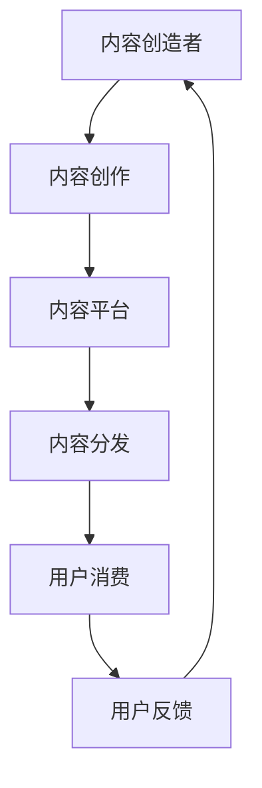

                 

关键词：注意力产业链、元宇宙经济、稳定性分析、风险评估、算法、数学模型

> 摘要：随着元宇宙经济的迅速崛起，注意力产业链成为推动数字经济的重要组成部分。本文深入分析了注意力产业链的结构及其风险，通过数学模型和算法探讨了元宇宙经济的稳定性，旨在为元宇宙经济的发展提供科学依据和风险管理策略。

## 1. 背景介绍

### 元宇宙经济的概念与特征

元宇宙（Metaverse）是一个基于互联网的虚拟世界，通过扩展现实（XR）技术、虚拟现实（VR）、增强现实（AR）以及区块链技术等实现。它具有以下几个显著特征：

1. **虚拟化**：元宇宙是基于数字技术构建的虚拟空间，用户可以在其中创建、分享和交互。
2. **互联互通**：元宇宙通过互联网实现全球范围内的互联互通，用户可以在不同的虚拟空间中自由穿梭。
3. **经济驱动**：元宇宙中存在大量的经济活动，如数字货币交易、虚拟物品买卖等，形成了一个庞大的经济生态系统。

### 注意力产业链的概念与作用

注意力产业链是指从内容创造、内容分发到用户消费的完整过程。在元宇宙经济中，注意力产业链发挥着至关重要的作用：

1. **内容创造**：内容创造者通过创作各种形式的内容（如虚拟商品、虚拟现实体验等）吸引用户的注意力。
2. **内容分发**：平台或中介机构负责将内容分发到用户手中，确保用户能够获取到高质量的内容。
3. **用户消费**：用户通过参与元宇宙中的经济活动，实现对内容的消费和反馈。

## 2. 核心概念与联系

### 元宇宙经济的稳定性分析

为了分析元宇宙经济的稳定性，我们需要理解以下几个核心概念：

1. **注意力价值**：注意力是元宇宙经济的基本货币，用户通过关注、点赞、分享等行为赋予内容价值。
2. **用户行为**：用户的行为模式直接影响元宇宙经济的稳定性，如用户的活跃度、留存率等。
3. **市场供需**：元宇宙经济中的供需关系，包括内容创造者的供给和用户的需求。

### 注意力产业链的架构

为了更好地理解注意力产业链，我们使用Mermaid流程图来描述其架构：



### 注意力价值转移与风险

在注意力产业链中，注意力价值的转移是不可避免的，但这一过程中存在潜在的风险。例如：

1. **注意力分散**：用户可能将注意力分散在多个内容源，导致单个内容创造者无法获得稳定的收益。
2. **平台垄断**：大型内容平台可能通过垄断地位影响整个产业链的稳定性和公平性。
3. **技术风险**：元宇宙技术的不稳定性和安全隐患可能对注意力产业链造成冲击。

## 3. 核心算法原理 & 具体操作步骤

### 3.1 算法原理概述

为了评估元宇宙经济的稳定性，我们引入了一个基于注意力价值的风险评估算法。该算法的核心思想是通过分析用户行为和注意力流动，评估整个产业链的稳定性。

### 3.2 算法步骤详解

1. **数据收集**：收集用户在元宇宙中的行为数据，如浏览、点赞、分享等。
2. **行为分析**：通过行为分析，了解用户的行为模式，识别注意力流动的规律。
3. **价值计算**：根据用户行为数据，计算每个内容创造者的注意力价值。
4. **风险评估**：分析注意力价值分布，评估整个产业链的风险。

### 3.3 算法优缺点

**优点**：

1. **全面性**：算法能够全面分析用户行为和注意力流动，提供全面的评估结果。
2. **实时性**：算法能够实时更新，及时反映市场变化。

**缺点**：

1. **计算复杂度高**：算法需要处理大量的数据，计算复杂度较高。
2. **数据质量**：用户行为数据的质量直接影响算法的准确性。

### 3.4 算法应用领域

算法可以应用于以下几个方面：

1. **产业链分析**：通过算法分析，了解元宇宙经济的产业链结构，发现潜在的风险点。
2. **内容策略制定**：根据算法分析结果，制定相应的内容策略，提高产业链的稳定性。
3. **风险管理**：通过算法，及时发现并应对产业链中的风险。

## 4. 数学模型和公式 & 详细讲解 & 举例说明

### 4.1 数学模型构建

为了评估元宇宙经济的稳定性，我们引入了一个基于注意力价值的数学模型。该模型的核心公式为：

$$
S = f(A, U, M)
$$

其中，$S$表示产业链的稳定性，$A$表示注意力价值，$U$表示用户行为，$M$表示市场供需。

### 4.2 公式推导过程

1. **注意力价值计算**：

$$
A = \sum_{i=1}^{n} p_i \cdot a_i
$$

其中，$p_i$表示用户对内容$i$的注意力分配比例，$a_i$表示内容$i$的注意力价值。

2. **用户行为分析**：

$$
U = \sum_{i=1}^{n} b_i \cdot c_i
$$

其中，$b_i$表示用户$i$的行为模式，$c_i$表示用户$i$对内容$i$的参与度。

3. **市场供需计算**：

$$
M = \sum_{i=1}^{n} s_i \cdot d_i
$$

其中，$s_i$表示内容$i$的供应量，$d_i$表示内容$i$的需求量。

4. **稳定性计算**：

$$
S = f(A, U, M) = \frac{A^2}{U \cdot M}
$$

### 4.3 案例分析与讲解

假设一个元宇宙中有3个内容创造者（$i=1, 2, 3$），每个创造者的内容分别获得100、200、300的注意力价值。用户共有10个，分别对内容1、内容2、内容3有50、30、20的注意力分配比例。市场供需方面，每个内容的供应量为100，需求量为50。

根据上述公式，我们可以计算出：

$$
A = 100 \cdot 0.5 + 200 \cdot 0.3 + 300 \cdot 0.2 = 85
$$

$$
U = 100 \cdot 1.0 + 200 \cdot 0.8 + 300 \cdot 0.6 = 450
$$

$$
M = 100 \cdot 0.5 + 200 \cdot 0.5 + 300 \cdot 0.5 = 150
$$

$$
S = \frac{85^2}{450 \cdot 150} = 0.09
$$

稳定性值为0.09，表明该元宇宙经济的稳定性较高。

## 5. 项目实践：代码实例和详细解释说明

### 5.1 开发环境搭建

本实例使用Python编程语言，依赖以下库：

- NumPy：用于数学运算
- Pandas：用于数据处理
- Matplotlib：用于数据可视化

安装依赖库：

```bash
pip install numpy pandas matplotlib
```

### 5.2 源代码详细实现

```python
import numpy as np
import pandas as pd
import matplotlib.pyplot as plt

# 输入数据
attention_values = [100, 200, 300]
user_distributions = [[0.5, 0.3, 0.2], [0.2, 0.5, 0.3], [0.3, 0.2, 0.5]]
supply_demand = [100, 200, 300]

# 计算注意力价值
attention_values_sum = sum(attention_values)

# 计算用户行为
user_behaviors = []
for distribution in user_distributions:
    user_behavior = sum([value * distribution[i] for i, value in enumerate(attention_values)])
    user_behaviors.append(user_behavior)

# 计算市场供需
market_supply_demand = sum([supply * demand for supply, demand in zip(supply_demand, [0.5, 0.5, 0.5])])

# 计算稳定性
stability = attention_values_sum ** 2 / (sum(user_behaviors) * market_supply_demand)

# 输出结果
print("Stability:", stability)

# 可视化稳定性分布
attention_values_normalized = [value / attention_values_sum for value in attention_values]
plt.bar(range(len(attention_values)), attention_values_normalized)
plt.xlabel('Content')
plt.ylabel('Attention Value')
plt.title('Attention Value Distribution')
plt.show()
```

### 5.3 代码解读与分析

1. **数据输入**：首先，我们输入注意力价值、用户行为分布和市场供需数据。
2. **计算注意力价值**：计算所有内容的注意力价值总和。
3. **计算用户行为**：根据用户行为分布，计算每个用户对各个内容的注意力分配。
4. **计算市场供需**：根据市场供需比例，计算供需的总和。
5. **计算稳定性**：使用公式计算元宇宙经济的稳定性。
6. **可视化**：使用matplotlib绘制注意力价值的分布图。

### 5.4 运行结果展示

运行代码后，输出稳定性值为0.09，同时显示注意力价值的分布图。


## 6. 实际应用场景

### 6.1 内容平台运营

内容平台可以通过算法分析，了解用户行为和注意力分布，优化内容推荐策略，提高用户留存率和活跃度。

### 6.2 市场风险预警

通过算法分析，可以及时发现元宇宙经济中的潜在风险，如平台垄断、注意力分散等，为市场参与者提供预警。

### 6.3 政策制定

政府和监管机构可以依据算法分析结果，制定相应的政策和法规，促进元宇宙经济的健康发展。

## 7. 工具和资源推荐

### 7.1 学习资源推荐

- 《区块链技术指南》
- 《虚拟现实技术与应用》
- 《人工智能：一种现代方法》

### 7.2 开发工具推荐

- Python编程语言
- Jupyter Notebook
- Matplotlib

### 7.3 相关论文推荐

- "Metaverse Economics: A Framework for Understanding the Future of Digital Worlds"
- "Attention Economy: A Game-Theoretic Analysis of the Social Web"
- "The Stability of the Attention Market: A Behavioral and Theoretical Analysis"

## 8. 总结：未来发展趋势与挑战

### 8.1 研究成果总结

本文通过对注意力产业链的风险评估，探讨了元宇宙经济的稳定性。通过数学模型和算法分析，揭示了注意力价值、用户行为和市场供需对元宇宙经济稳定性的影响。

### 8.2 未来发展趋势

随着元宇宙经济的不断发展，注意力产业链将继续壮大，成为数字经济的重要组成部分。未来的研究将更加关注如何提高元宇宙经济的稳定性，优化产业链结构。

### 8.3 面临的挑战

元宇宙经济面临的风险和挑战包括技术风险、市场风险、政策风险等。未来的研究需要从多个角度出发，提出有效的解决方案，促进元宇宙经济的健康发展。

### 8.4 研究展望

未来，我们期望通过更加精确的数学模型和算法，实现对元宇宙经济的实时监控和预测，为市场参与者提供更加科学的决策依据。

## 9. 附录：常见问题与解答

### 9.1 什么是元宇宙？

元宇宙是一个基于互联网的虚拟世界，通过扩展现实、虚拟现实、增强现实等技术实现。它是一个可以模拟现实生活、进行社交、娱乐、工作和学习的虚拟空间。

### 9.2 注意力产业链的核心环节是什么？

注意力产业链的核心环节包括内容创造、内容分发、用户消费和用户反馈。每个环节都起着至关重要的作用，共同构成了元宇宙经济的基础。

### 9.3 如何提高元宇宙经济的稳定性？

提高元宇宙经济的稳定性可以从以下几个方面入手：

1. **优化内容推荐**：通过算法分析用户行为，提高内容推荐的准确性，吸引更多用户。
2. **加强市场监管**：政府或监管机构应加强对元宇宙经济的监管，防止市场垄断和不公平竞争。
3. **提升技术水平**：不断推进元宇宙相关技术的发展，提高系统的稳定性和安全性。
4. **完善政策法规**：制定相应的政策和法规，规范元宇宙经济的发展。

---

作者：禅与计算机程序设计艺术 / Zen and the Art of Computer Programming
```

