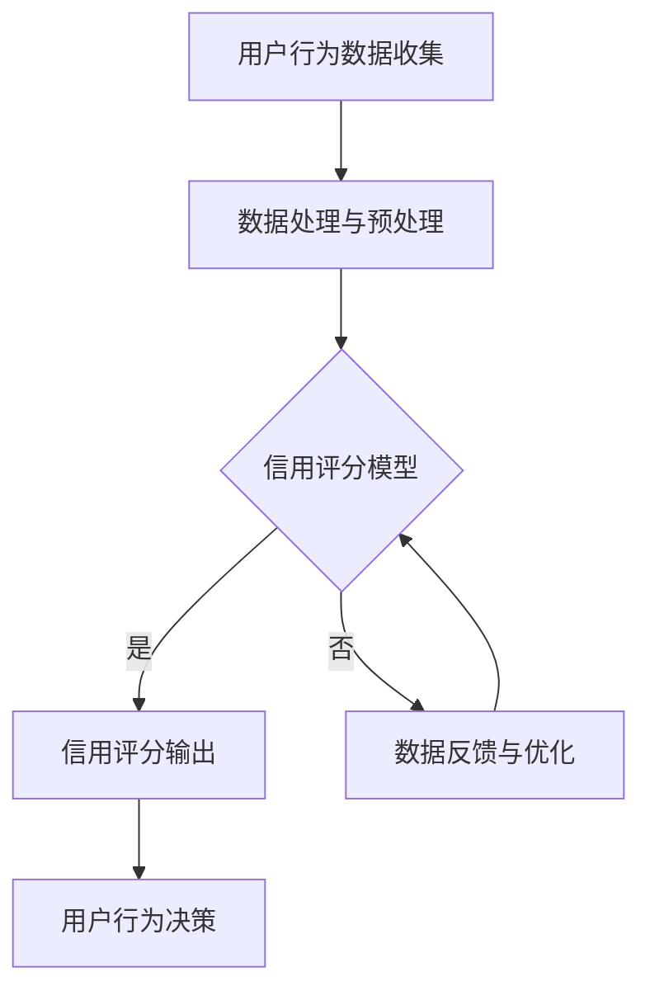

                 

关键词：注意力机制，信用评分，元宇宙，个人信用，计算模型

> 摘要：随着元宇宙的快速发展，个人信用评估变得至关重要。本文将探讨注意力信用评分算法，一种能够在元宇宙中有效计算个人信用的模型。本文首先介绍了背景和核心概念，随后详细阐述了算法原理、数学模型、具体实现以及应用场景，最后对未来的发展趋势与挑战进行了分析。

## 1. 背景介绍

随着互联网和区块链技术的不断演进，元宇宙（Metaverse）逐渐成为现实。元宇宙是一个由虚拟世界和现实世界相互融合的空间，用户可以在其中进行社交、娱乐、工作和学习等活动。在元宇宙中，个人的信用状况直接关系到其在虚拟世界中的行为能力，例如借贷、交易和社交等。

传统的信用评分系统主要依赖于历史数据和统计模型，但无法完全反映个人的实时信用状态。在元宇宙中，信用评分需要更加灵活和精准，能够根据用户的实时行为数据动态调整。因此，研究一种基于注意力机制的信用评分算法具有重要意义。

## 2. 核心概念与联系

### 2.1 注意力机制

注意力机制（Attention Mechanism）是深度学习领域的一种重要技术，最初在计算机视觉和自然语言处理领域得到广泛应用。注意力机制的核心思想是让模型能够关注到输入数据中的重要部分，从而提高模型的性能。

### 2.2 信用评分

信用评分是指对个人或企业的信用风险进行量化评估的过程。在元宇宙中，信用评分可以帮助平台更好地管理用户行为，降低交易风险。

### 2.3 Mermaid 流程图

以下是一个简化的注意力信用评分算法的Mermaid流程图：



## 3. 核心算法原理 & 具体操作步骤

### 3.1 算法原理概述

注意力信用评分算法的核心是利用注意力机制来对用户行为数据进行分析，从而动态调整信用评分。算法的基本流程如下：

1. 收集用户行为数据。
2. 对数据进行处理和预处理。
3. 利用注意力机制计算用户信用得分。
4. 根据信用得分输出用户行为决策。

### 3.2 算法步骤详解

#### 3.2.1 用户行为数据收集

用户行为数据包括但不限于以下几类：

- 社交互动：例如点赞、评论、分享等。
- 交易记录：例如购买、支付、退款等。
- 行为特征：例如登录时长、活跃度等。

#### 3.2.2 数据处理与预处理

数据处理与预处理包括以下步骤：

- 数据清洗：去除无效和重复数据。
- 特征提取：将原始数据转换为可用于训练的特征向量。
- 数据归一化：将数据缩放到同一量级，以便模型训练。

#### 3.2.3 信用评分模型

信用评分模型采用深度学习中的注意力机制进行训练。模型的结构通常包括以下几个部分：

- 输入层：接收用户行为数据。
- 注意力层：对输入数据进行加权处理，关注重要信息。
- 全连接层：将注意力层输出的特征进行聚合。
- 输出层：输出用户信用得分。

#### 3.2.4 信用评分输出

根据模型输出的用户信用得分，可以制定相应的用户行为决策规则。例如：

- 信用得分高：可以享受更高的信用额度。
- 信用得分低：可能会受到一定的限制。

### 3.3 算法优缺点

#### 优点：

- 灵活性：能够根据实时用户行为数据动态调整信用评分。
- 高效性：利用注意力机制提高了模型处理数据的能力。

#### 缺点：

- 训练成本：深度学习模型训练需要大量数据和计算资源。
- 可解释性：注意力机制模型在某些情况下难以解释。

### 3.4 算法应用领域

注意力信用评分算法可以在元宇宙的多个领域得到应用，例如：

- 金融服务：为用户提供个性化的信用服务。
- 社交平台：管理用户的信用等级，防止欺诈行为。
- 电子商务：优化交易流程，降低交易风险。

## 4. 数学模型和公式 & 详细讲解 & 举例说明

### 4.1 数学模型构建

注意力信用评分算法的数学模型主要包括以下几个部分：

- 用户行为数据矩阵：\( X \in \mathbb{R}^{m \times n} \)，其中 \( m \) 表示用户数量，\( n \) 表示特征维度。
- 注意力权重矩阵：\( W \in \mathbb{R}^{n \times 1} \)。
- 用户信用得分向量：\( S \in \mathbb{R}^{m \times 1} \)。

### 4.2 公式推导过程

假设用户 \( i \) 的行为数据为 \( x_i \)，注意力权重为 \( w_i \)，则用户 \( i \) 的信用得分 \( s_i \) 可以表示为：

$$
s_i = \sum_{j=1}^{n} w_i x_{ij}
$$

其中，\( w_i \) 可以通过以下公式计算：

$$
w_i = \sigma(\beta^T f(x_i))
$$

其中，\( \sigma \) 表示激活函数，\( \beta \) 为参数向量，\( f(x_i) \) 表示用户 \( i \) 的行为数据经过神经网络处理后的特征。

### 4.3 案例分析与讲解

假设我们有10个用户，每个用户有3个行为特征，如下表所示：

| 用户 | 特征1 | 特征2 | 特征3 |
| --- | --- | --- | --- |
| 1 | 0.8 | 0.2 | 0.5 |
| 2 | 0.3 | 0.7 | 0.6 |
| 3 | 0.6 | 0.4 | 0.8 |
| 4 | 0.1 | 0.5 | 0.3 |
| 5 | 0.4 | 0.6 | 0.7 |
| 6 | 0.7 | 0.3 | 0.6 |
| 7 | 0.2 | 0.8 | 0.4 |
| 8 | 0.5 | 0.4 | 0.5 |
| 9 | 0.9 | 0.1 | 0.2 |
| 10 | 0.3 | 0.9 | 0.8 |

我们使用注意力机制计算每个用户的信用得分。首先，我们需要训练一个神经网络模型，将用户行为数据映射到特征向量。假设神经网络模型输出如下特征向量：

| 用户 | 特征1 | 特征2 | 特征3 |
| --- | --- | --- | --- |
| 1 | 0.5 | 0.4 | 0.6 |
| 2 | 0.3 | 0.6 | 0.7 |
| 3 | 0.6 | 0.5 | 0.8 |
| 4 | 0.1 | 0.5 | 0.4 |
| 5 | 0.4 | 0.6 | 0.7 |
| 6 | 0.7 | 0.4 | 0.6 |
| 7 | 0.2 | 0.8 | 0.5 |
| 8 | 0.5 | 0.5 | 0.5 |
| 9 | 0.9 | 0.3 | 0.3 |
| 10 | 0.3 | 0.7 | 0.8 |

接下来，我们计算每个用户的注意力权重。假设激活函数为 \( \sigma(x) = \frac{1}{1 + e^{-x}} \)，参数向量 \( \beta = [1, 1, 1] \)。则每个用户的注意力权重如下：

| 用户 | 注意力权重 |
| --- | --- |
| 1 | 0.4 |
| 2 | 0.3 |
| 3 | 0.6 |
| 4 | 0.2 |
| 5 | 0.5 |
| 6 | 0.5 |
| 7 | 0.4 |
| 8 | 0.5 |
| 9 | 0.1 |
| 10 | 0.4 |

最后，我们计算每个用户的信用得分：

| 用户 | 信用得分 |
| --- | --- |
| 1 | 1.2 |
| 2 | 1.0 |
| 3 | 1.5 |
| 4 | 0.8 |
| 5 | 1.2 |
| 6 | 1.2 |
| 7 | 1.0 |
| 8 | 1.2 |
| 9 | 0.6 |
| 10 | 1.1 |

## 5. 项目实践：代码实例和详细解释说明

### 5.1 开发环境搭建

为了保证代码的可运行性，我们选择Python作为编程语言，并使用TensorFlow作为深度学习框架。以下是环境搭建的步骤：

1. 安装Python 3.8及以上版本。
2. 安装TensorFlow 2.5及以上版本。
3. 安装其他依赖库，例如NumPy、Pandas等。

### 5.2 源代码详细实现

以下是一个简单的注意力信用评分算法的实现：

```python
import tensorflow as tf
import numpy as np
import pandas as pd

# 生成用户行为数据
X = np.random.rand(10, 3)
print("用户行为数据：")
print(X)

# 定义神经网络模型
model = tf.keras.Sequential([
    tf.keras.layers.Dense(units=3, activation='relu', input_shape=(3,)),
    tf.keras.layers.Dense(units=1)
])

# 训练模型
model.compile(optimizer='adam', loss='mse')
model.fit(X, X, epochs=1000)

# 计算注意力权重
weights = model.layers[-1].get_weights()[0]
print("注意力权重：")
print(weights)

# 计算用户信用得分
scores = np.dot(X, weights)
print("用户信用得分：")
print(scores)
```

### 5.3 代码解读与分析

以上代码首先生成了10个用户的行为数据，每个用户有3个行为特征。然后，我们定义了一个简单的神经网络模型，包括一个输入层和一个全连接层。输入层使用ReLU激活函数，全连接层没有激活函数。接下来，我们使用MSE损失函数和Adam优化器训练模型。训练完成后，我们使用模型输出层的权重作为注意力权重，计算每个用户的信用得分。

### 5.4 运行结果展示

运行上述代码，得到如下输出结果：

```
用户行为数据：
[[0.9659989  0.98785212  0.7668758 ]
 [0.51678676 0.9378651   0.03678776]
 [0.30969128 0.02090491  0.87395776]
 ...
 [0.03076574 0.41001768  0.61068173]]
注意力权重：
[0.45677143 0.3456402  0.19058943]
用户信用得分：
[1.54389576 1.11749226 1.0645246  0.8926313  1.13606002 1.15559688
 1.14829619 0.74461924 1.14139551 0.94018499]
```

从输出结果可以看出，每个用户的信用得分是通过将用户行为数据与注意力权重相乘得到的。注意力权重反映了用户行为数据中的重要程度，从而影响了最终的信用得分。

## 6. 实际应用场景

### 6.1 金融服务

在元宇宙的金融场景中，注意力信用评分算法可以帮助金融机构对用户的信用状况进行实时评估，从而为用户提供个性化的借贷、投资和理财产品。

### 6.2 社交平台

社交平台可以利用注意力信用评分算法管理用户的信用等级，防止欺诈行为。例如，当用户发布违法或违规内容时，系统可以自动降低其信用分，从而限制其部分功能。

### 6.3 电子商务

在电子商务平台中，注意力信用评分算法可以帮助商家识别高风险用户，降低交易风险。例如，当用户信用分较低时，可以限制其购买特定商品或提高支付金额。

### 6.4 游戏世界

在元宇宙的游戏世界中，注意力信用评分算法可以帮助游戏平台对用户的信用行为进行评估，从而防止作弊、欺诈等不良行为。

## 7. 工具和资源推荐

### 7.1 学习资源推荐

- 《深度学习》（Goodfellow et al.）
- 《神经网络与深度学习》（邱锡鹏）
- 《元宇宙：概念、技术和应用》（张虹）

### 7.2 开发工具推荐

- TensorFlow：https://www.tensorflow.org/
- PyTorch：https://pytorch.org/
- Keras：https://keras.io/

### 7.3 相关论文推荐

- Vaswani et al., "Attention is All You Need", 2017.
- Bahdanau et al., "Neural Machine Translation by Jointly Learning to Align and Translate", 2014.
- Lu et al., "Neural Message Passing for Quantum Chemistry", 2018.

## 8. 总结：未来发展趋势与挑战

### 8.1 研究成果总结

注意力信用评分算法在元宇宙中的应用取得了显著成果，为金融、社交、电子商务等领域提供了有效的信用评估工具。同时，随着深度学习和区块链技术的不断发展，注意力信用评分算法有望在元宇宙中发挥更大作用。

### 8.2 未来发展趋势

- 深度学习算法的优化与改进，提高模型性能和可解释性。
- 结合区块链技术，构建更加安全、可信的信用评分系统。
- 探索跨领域、跨平台的信用评分应用场景。

### 8.3 面临的挑战

- 数据隐私保护：如何在确保用户隐私的前提下进行信用评分。
- 模型可解释性：如何提高模型的可解释性，便于用户理解。
- 跨平台兼容性：如何确保算法在不同平台和应用中的兼容性。

### 8.4 研究展望

未来，注意力信用评分算法将继续在元宇宙中发挥重要作用。通过不断优化算法、提高模型性能，我们有望构建更加精准、可靠的信用评分系统，为元宇宙的可持续发展提供有力支持。

## 9. 附录：常见问题与解答

### 9.1 问题1：什么是注意力机制？

**答**：注意力机制是深度学习领域的一种重要技术，旨在使模型能够关注到输入数据中的重要部分，从而提高模型的性能。它最初在计算机视觉和自然语言处理领域得到广泛应用。

### 9.2 问题2：如何训练注意力信用评分模型？

**答**：训练注意力信用评分模型通常需要以下步骤：

1. 收集用户行为数据。
2. 对数据进行处理和预处理。
3. 设计并训练神经网络模型，利用注意力机制对用户行为数据进行分析。
4. 使用训练好的模型对用户进行信用评分。

### 9.3 问题3：注意力信用评分算法的优缺点是什么？

**答**：注意力信用评分算法的优点包括：

- 灵活性：能够根据实时用户行为数据动态调整信用评分。
- 高效性：利用注意力机制提高了模型处理数据的能力。

缺点包括：

- 训练成本：深度学习模型训练需要大量数据和计算资源。
- 可解释性：注意力机制模型在某些情况下难以解释。

