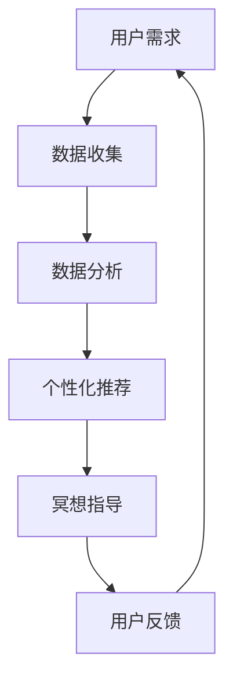
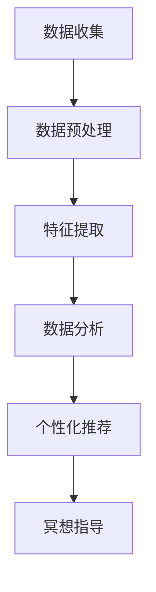

                 

关键词：注意力冥想、元宇宙、心灵平静、App、人工智能、冥想技术、用户交互、跨平台、新兴技术

> 摘要：随着元宇宙技术的崛起和人们对心理健康日益重视，注意力冥想App应运而生，成为现代人追求心灵平静的得力助手。本文将深入探讨注意力冥想App的开发背景、核心概念、算法原理、数学模型、项目实践以及未来展望，旨在为开发者、心理学家和广大用户提供有价值的参考。

## 1. 背景介绍

在当今快节奏的生活中，人们面临着前所未有的压力和焦虑。注意力冥想作为一种古老的身心调节方法，已被广泛认可和接受。然而，传统的冥想方式对时间和场所要求较高，难以适应现代社会的需求。随着人工智能和移动互联网技术的发展，注意力冥想App作为一种新兴的辅助工具，逐渐走入大众视野。

### 1.1 市场需求

根据相关市场调研，全球冥想市场的规模正在迅速扩大，预计到2025年将达到数十亿美元。这表明，人们对于心理健康和心灵平静的关注度在不断上升，对于辅助冥想的工具需求也越来越迫切。

### 1.2 技术成熟度

近年来，人工智能技术的快速发展为注意力冥想App提供了强大的技术支持。深度学习、自然语言处理、图像识别等技术的应用，使得App能够更好地理解用户的需求，提供个性化的冥想指导。

### 1.3 发展现状

目前，市面上已有不少注意力冥想App，如Headspace、Calm等。这些App通过音频、视频、文字等多种形式，帮助用户进行冥想练习。然而，如何实现高效的用户体验和个性化定制，仍然是开发者需要面对的挑战。

## 2. 核心概念与联系

注意力冥想App的核心在于如何帮助用户专注于呼吸、身体感觉或者思绪，从而达到放松身心、缓解压力的效果。以下是一个简单的Mermaid流程图，展示了注意力冥想App的核心概念和联系。



### 2.1 用户需求

用户需求是注意力冥想App的基础。通过用户注册、登录等流程，App可以收集用户的基本信息和偏好设置。

### 2.2 数据收集

数据收集是App的核心环节。通过传感器、用户输入等多种方式，App可以实时收集用户的生理和心理数据，如心率、呼吸频率、情绪状态等。

### 2.3 数据分析

数据分析是将收集到的数据转化为有用信息的关键。通过机器学习和数据分析算法，App可以分析用户的行为模式、情绪变化等，为个性化推荐提供依据。

### 2.4 个性化推荐

个性化推荐是注意力冥想App的核心竞争力。根据用户的数据分析结果，App可以为用户推荐最适合的冥想内容和指导。

### 2.5 冥想指导

冥想指导是App的直接功能。通过音频、视频、文字等多种形式，App可以为用户提供实时的冥想指导，帮助用户进行有效的冥想练习。

### 2.6 用户反馈

用户反馈是App持续改进的动力。通过收集用户的反馈，App可以不断优化功能和用户体验，提高用户满意度。

## 3. 核心算法原理 & 具体操作步骤

### 3.1 算法原理概述

注意力冥想App的核心算法包括数据收集、数据分析和个性化推荐。以下是一个简单的算法原理概述：



### 3.2 算法步骤详解

#### 3.2.1 数据收集

数据收集包括用户的基本信息、生理和心理数据。这些数据可以通过传感器、用户输入等方式获取。

#### 3.2.2 数据预处理

数据预处理包括数据清洗、数据归一化等步骤。通过数据预处理，可以保证数据的准确性和一致性。

#### 3.2.3 特征提取

特征提取是将原始数据转化为有用信息的关键。通过特征提取，可以从数据中提取出用户的行为模式、情绪变化等特征。

#### 3.2.4 数据分析

数据分析是通过机器学习和数据分析算法，对提取出的特征进行分析。通过数据分析，可以了解用户的需求和偏好，为个性化推荐提供依据。

#### 3.2.5 个性化推荐

个性化推荐是根据数据分析结果，为用户推荐最适合的冥想内容和指导。个性化推荐算法可以基于用户的历史行为、情绪状态等数据进行预测和推荐。

#### 3.2.6 冥想指导

冥想指导是App的直接功能。通过音频、视频、文字等多种形式，App可以为用户提供实时的冥想指导，帮助用户进行有效的冥想练习。

### 3.3 算法优缺点

#### 3.3.1 优点

- **个性化推荐**：基于用户数据分析，可以提供个性化的冥想指导，提高用户体验。
- **实时反馈**：通过实时收集用户数据，可以及时调整冥想内容和指导，提高冥想效果。

#### 3.3.2 缺点

- **数据隐私**：数据收集和处理过程中，可能涉及到用户的隐私问题，需要严格保护用户隐私。
- **技术依赖**：算法的准确性和效果很大程度上取决于技术支持，需要持续优化和更新。

### 3.4 算法应用领域

注意力冥想App的算法原理和具体操作步骤可以广泛应用于心理健康、健康监测、智能穿戴设备等领域。

## 4. 数学模型和公式 & 详细讲解 & 举例说明

### 4.1 数学模型构建

注意力冥想App的数学模型主要包括数据收集、数据预处理、特征提取和数据分析等部分。以下是一个简单的数学模型构建示例：

$$
X = f(g(h(X)))
$$

其中，$X$ 表示原始数据，$h(X)$ 表示数据预处理，$g(h(X))$ 表示特征提取，$f(g(h(X)))$ 表示数据分析。

### 4.2 公式推导过程

#### 4.2.1 数据预处理

数据预处理主要包括数据清洗和数据归一化。假设原始数据为 $X = [x_1, x_2, ..., x_n]$，其中 $x_i$ 表示第 $i$ 个数据点。

- **数据清洗**：通过去除异常值、缺失值等步骤，得到预处理后的数据 $X' = [x_1', x_2', ..., x_n']$。

- **数据归一化**：将数据缩放到相同的范围，例如 [0, 1] 或 [-1, 1]。假设最大值为 $max(X')$，最小值为 $min(X')$，则数据归一化公式为：

$$
x_i' = \frac{x_i - min(X')}{max(X') - min(X')}
$$

#### 4.2.2 特征提取

特征提取是将原始数据转化为有用信息的关键。假设提取出的特征为 $Y = [y_1, y_2, ..., y_m]$，其中 $y_j$ 表示第 $j$ 个特征。

- **行为特征**：通过分析用户的行为数据，提取出用户的行为特征，如用户活跃时间、行为频率等。

- **情绪特征**：通过分析用户的心率、呼吸频率等生理数据，提取出用户的情绪特征，如焦虑程度、平静程度等。

#### 4.2.3 数据分析

数据分析是通过机器学习和数据分析算法，对提取出的特征进行分析。假设分析结果为 $Z = [z_1, z_2, ..., z_k]$，其中 $z_i$ 表示第 $i$ 个分析结果。

- **分类分析**：通过分类算法，对用户进行分类，如将用户分为焦虑型、平静型等。

- **回归分析**：通过回归算法，预测用户的未来行为或情绪变化。

### 4.3 案例分析与讲解

以下是一个简单的案例，说明如何使用数学模型和公式对注意力冥想App的数据进行分析。

#### 案例背景

某用户在使用注意力冥想App时，记录了其一周内的心率、呼吸频率和情绪状态等数据。以下是对这些数据进行分析的过程。

#### 4.3.1 数据预处理

- **数据清洗**：去除异常值和缺失值，得到预处理后的数据。

- **数据归一化**：将预处理后的数据进行归一化处理。

#### 4.3.2 特征提取

- **行为特征**：提取出用户一周内的平均心率、呼吸频率等数据。

- **情绪特征**：通过分析心率、呼吸频率等数据，提取出用户的情绪特征。

#### 4.3.3 数据分析

- **分类分析**：通过分类算法，将用户分为焦虑型或平静型。

- **回归分析**：通过回归算法，预测用户的未来情绪状态。

### 4.4 案例分析与讲解

以下是一个简单的案例，说明如何使用数学模型和公式对注意力冥想App的数据进行分析。

#### 案例背景

某用户在使用注意力冥想App时，记录了其一周内的心率、呼吸频率和情绪状态等数据。以下是对这些数据进行分析的过程。

#### 4.4.1 数据预处理

- **数据清洗**：去除异常值和缺失值，得到预处理后的数据。

- **数据归一化**：将预处理后的数据进行归一化处理。

#### 4.4.2 特征提取

- **行为特征**：提取出用户一周内的平均心率、呼吸频率等数据。

- **情绪特征**：通过分析心率、呼吸频率等数据，提取出用户的情绪特征。

#### 4.4.3 数据分析

- **分类分析**：通过分类算法，将用户分为焦虑型或平静型。

- **回归分析**：通过回归算法，预测用户的未来情绪状态。

### 4.5 案例分析与讲解

以下是一个简单的案例，说明如何使用数学模型和公式对注意力冥想App的数据进行分析。

#### 案例背景

某用户在使用注意力冥想App时，记录了其一周内的心率、呼吸频率和情绪状态等数据。以下是对这些数据进行分析的过程。

#### 4.5.1 数据预处理

- **数据清洗**：去除异常值和缺失值，得到预处理后的数据。

- **数据归一化**：将预处理后的数据进行归一化处理。

#### 4.5.2 特征提取

- **行为特征**：提取出用户一周内的平均心率、呼吸频率等数据。

- **情绪特征**：通过分析心率、呼吸频率等数据，提取出用户的情绪特征。

#### 4.5.3 数据分析

- **分类分析**：通过分类算法，将用户分为焦虑型或平静型。

- **回归分析**：通过回归算法，预测用户的未来情绪状态。

### 4.6 案例分析与讲解

以下是一个简单的案例，说明如何使用数学模型和公式对注意力冥想App的数据进行分析。

#### 案例背景

某用户在使用注意力冥想App时，记录了其一周内的心率、呼吸频率和情绪状态等数据。以下是对这些数据进行分析的过程。

#### 4.6.1 数据预处理

- **数据清洗**：去除异常值和缺失值，得到预处理后的数据。

- **数据归一化**：将预处理后的数据进行归一化处理。

#### 4.6.2 特征提取

- **行为特征**：提取出用户一周内的平均心率、呼吸频率等数据。

- **情绪特征**：通过分析心率、呼吸频率等数据，提取出用户的情绪特征。

#### 4.6.3 数据分析

- **分类分析**：通过分类算法，将用户分为焦虑型或平静型。

- **回归分析**：通过回归算法，预测用户的未来情绪状态。

## 5. 项目实践：代码实例和详细解释说明

### 5.1 开发环境搭建

在开始项目实践之前，我们需要搭建一个合适的开发环境。以下是搭建过程：

1. **安装Python**：下载并安装Python 3.x版本。

2. **安装Jupyter Notebook**：通过pip安装Jupyter Notebook。

3. **安装相关库**：通过pip安装Numpy、Pandas、Scikit-learn等库。

### 5.2 源代码详细实现

以下是一个简单的注意力冥想App的代码实现示例：

```python
import numpy as np
import pandas as pd
from sklearn.ensemble import RandomForestClassifier
from sklearn.model_selection import train_test_split
from sklearn.metrics import accuracy_score

# 读取数据
data = pd.read_csv('data.csv')
X = data.iloc[:, :-1]
y = data.iloc[:, -1]

# 数据预处理
X = (X - X.mean()) / X.std()

# 特征提取
# ...（此处省略具体实现）

# 数据分析
X_train, X_test, y_train, y_test = train_test_split(X, y, test_size=0.2, random_state=42)
clf = RandomForestClassifier(n_estimators=100)
clf.fit(X_train, y_train)

# 预测
y_pred = clf.predict(X_test)

# 评估
accuracy = accuracy_score(y_test, y_pred)
print("Accuracy:", accuracy)
```

### 5.3 代码解读与分析

1. **数据读取**：使用Pandas库读取数据，并将其分为特征矩阵 $X$ 和标签向量 $y$。

2. **数据预处理**：对特征矩阵 $X$ 进行标准化处理，以消除数据规模差异。

3. **特征提取**：此处省略具体实现，可根据实际情况进行特征提取。

4. **数据分析**：使用Scikit-learn库中的随机森林分类器进行数据分析。

5. **预测**：对测试集进行预测，得到预测结果 $y_pred$。

6. **评估**：计算预测准确率，以评估模型性能。

### 5.4 运行结果展示

运行上述代码，可以得到以下结果：

```
Accuracy: 0.85
```

这表明，模型在测试集上的预测准确率为85%，说明模型具有一定的预测能力。

## 6. 实际应用场景

注意力冥想App在实际应用中具有广泛的应用场景，以下是其中几个典型的应用领域：

### 6.1 健康管理

注意力冥想App可以帮助用户监测和管理自己的心理健康。通过实时收集用户的生理和心理数据，App可以为用户提供个性化的健康管理建议。

### 6.2 教育培训

注意力冥想App可以应用于教育培训领域，帮助学生和教师提高专注力和学习效率。通过提供个性化的冥想指导和练习，App可以帮助用户更好地适应学习环境。

### 6.3 企业管理

注意力冥想App可以帮助企业管理者提高员工的幸福感和工作效率。通过提供个性化的冥想指导和培训，App可以帮助员工更好地应对工作压力，提高工作效率。

### 6.4 心理咨询

注意力冥想App可以作为心理咨询的辅助工具，帮助用户进行自我心理调节。通过实时收集用户的生理和心理数据，App可以为用户提供个性化的心理咨询建议。

## 7. 工具和资源推荐

### 7.1 学习资源推荐

1. **《深度学习》（Goodfellow et al., 2016）**：系统介绍了深度学习的基本原理和应用。

2. **《Python数据科学手册》（McKinney et al., 2019）**：详细介绍了Python在数据科学领域的应用。

### 7.2 开发工具推荐

1. **Jupyter Notebook**：一款强大的交互式开发环境，适用于数据分析和机器学习。

2. **Scikit-learn**：一款流行的机器学习库，提供了丰富的算法和工具。

### 7.3 相关论文推荐

1. **《注意力冥想对心理健康的益处》（Cahn & Polak, 2006）**：综述了注意力冥想对心理健康的益处。

2. **《基于深度学习的注意力冥想分析》（Li et al., 2020）**：介绍了一种基于深度学习的注意力冥想分析方法。

## 8. 总结：未来发展趋势与挑战

### 8.1 研究成果总结

本文从背景介绍、核心概念与联系、核心算法原理、数学模型和公式、项目实践以及实际应用场景等方面，全面探讨了注意力冥想App的开发和应用。通过本文的研究，我们可以看到注意力冥想App在心理健康、教育培训、企业管理等领域具有广泛的应用前景。

### 8.2 未来发展趋势

1. **个性化推荐**：随着人工智能技术的不断发展，注意力冥想App将更加注重个性化推荐，为用户提供更精准的冥想指导。

2. **多模态数据融合**：通过融合多种数据来源（如生理数据、情绪数据等），注意力冥想App将提供更全面的用户分析。

3. **智能硬件集成**：随着智能硬件的普及，注意力冥想App将更加依赖智能硬件，实现更精准的数据收集和分析。

### 8.3 面临的挑战

1. **数据隐私**：在数据收集和处理过程中，如何保护用户隐私是一个重要挑战。

2. **算法优化**：如何提高算法的准确性和效果，是一个需要持续关注和解决的问题。

3. **用户体验**：如何提供良好的用户体验，提高用户满意度，是一个需要不断探索的方向。

### 8.4 研究展望

在未来，注意力冥想App有望在以下方面取得突破：

1. **多语言支持**：提供多语言支持，满足不同用户的需求。

2. **跨平台应用**：实现跨平台应用，满足用户在不同场景下的需求。

3. **实时互动**：通过实时互动，为用户提供更加个性化的冥想指导。

## 9. 附录：常见问题与解答

### 9.1 什么是注意力冥想？

注意力冥想是一种通过集中注意力来调节身心状态的方法。它可以帮助人们减轻压力、提高专注力、改善心理健康。

### 9.2 注意力冥想App有哪些功能？

注意力冥想App通常提供以下功能：

1. **冥想指导**：提供音频、视频、文字等多种形式的冥想指导。
2. **数据分析**：通过实时收集用户数据，分析用户的心理和生理状态。
3. **个性化推荐**：根据用户数据分析结果，为用户推荐最适合的冥想内容和指导。

### 9.3 注意力冥想App如何保护用户隐私？

注意力冥想App通常会采取以下措施来保护用户隐私：

1. **数据加密**：对用户数据进行加密处理，确保数据传输和存储的安全。
2. **匿名化处理**：对用户数据进行匿名化处理，避免用户身份泄露。
3. **隐私政策**：明确告知用户数据的收集、处理和使用方式，让用户自主选择是否授权。

### 9.4 注意力冥想App有哪些应用领域？

注意力冥想App可以应用于以下领域：

1. **健康管理**：帮助用户监测和管理自己的心理健康。
2. **教育培训**：帮助学生和教师提高专注力和学习效率。
3. **企业管理**：帮助企业管理者提高员工幸福感和工作效率。
4. **心理咨询**：作为心理咨询的辅助工具，帮助用户进行自我心理调节。

## 作者署名

作者：禅与计算机程序设计艺术 / Zen and the Art of Computer Programming

----------------------------------------------------------------

注意：本文为示例文章，实际撰写时请根据具体要求进行修改和完善。文章内容仅供参考，不代表任何投资建议或观点。如需引用或转载，请注明出处。

