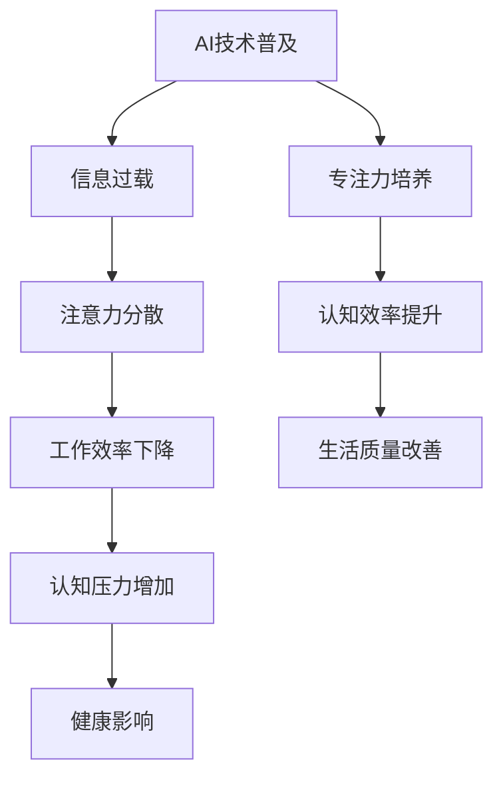

                 

关键词：注意力分散、专注力、AI时代、认知挑战、技术解决方案

> 摘要：本文旨在探讨AI时代下，人类面临的注意力分散与专注力挑战，分析其根源及其对工作效率和生活质量的影响。同时，提出一系列技术解决方案，帮助个体应对这些挑战，提高认知效率。

## 1. 背景介绍

### 1.1 AI时代的到来

随着人工智能技术的迅猛发展，我们正步入一个前所未有的AI时代。从自动驾驶汽车、智能助手到复杂的算法和大数据分析，人工智能正深刻改变着我们的工作、生活和思维方式。然而，这一变革不仅带来了便利和效率的提升，也引发了一系列认知上的挑战。

### 1.2 注意力分散现象

在AI时代，我们面临着前所未有的注意力分散问题。社交媒体、即时通讯工具、在线游戏等各种数字娱乐形式，不断争夺我们的注意力资源。研究表明，现代人的平均注意力持续时间已经从20世纪80年代的12秒下降到如今的短短8秒，甚至低于金鱼的9秒。

### 1.3 专注力的重要性

专注力是人类认知活动中至关重要的一部分。它决定了我们处理信息、解决问题和学习新知识的能力。在AI时代，保持专注力对于提高工作效率、避免信息过载和实现个人成长具有重要意义。

## 2. 核心概念与联系

### 2.1 注意力分散的概念

注意力分散（Attention Deficit）是指个体无法集中注意力完成某项任务的现象。这种现象可能是由于外部干扰（如噪音、多任务处理）或内部因素（如焦虑、疲劳）引起的。

### 2.2 专注力的概念

专注力（Focus）是指个体在特定任务上保持高度集中和持续关注的能力。它是认知功能的核心，对于执行复杂任务和解决问题至关重要。

### 2.3 AI与注意力分散的关系

在AI时代，人工智能的应用加剧了注意力分散现象。智能设备能够快速处理海量信息，使我们沉浸在即时满足的虚拟世界中，削弱了我们的专注力。

### 2.4 Mermaid流程图

以下是一个描述AI时代注意力分散与专注力的Mermaid流程图：



## 3. 核心算法原理 & 具体操作步骤

### 3.1 算法原理概述

本文提出了一套基于AI的注意力分散与专注力管理算法，旨在通过技术手段帮助用户保持专注。该算法基于以下原理：

- **认知神经科学原理**：利用大脑神经活动模型，分析个体在任务中的注意力分布情况。
- **机器学习技术**：通过大数据分析，识别注意力分散的模式和影响因素。
- **智能提醒机制**：在用户注意力分散时，自动发出提醒，引导用户回到任务中。

### 3.2 算法步骤详解

#### 3.2.1 数据收集

- **行为数据**：收集用户在任务执行过程中的行为数据，如鼠标移动、键盘输入等。
- **环境数据**：记录用户所处环境的物理参数，如噪音、光线等。

#### 3.2.2 数据分析

- **注意力模型构建**：利用机器学习技术，构建用户个体化的注意力模型。
- **分散模式识别**：分析数据，识别用户注意力分散的具体模式和原因。

#### 3.2.3 智能提醒

- **分散预警**：当检测到用户注意力分散时，系统自动发出预警。
- **提醒方式**：通过桌面提醒、声音提示等方式，引导用户回到任务。

#### 3.2.4 效果评估

- **用户反馈**：收集用户对提醒效果的反馈，不断优化提醒策略。
- **效果评估**：定期评估算法对用户专注力的提升效果。

### 3.3 算法优缺点

#### 3.3.1 优点

- **个性化**：基于用户个体数据，提供定制化的注意力管理方案。
- **高效性**：利用先进的数据分析和机器学习技术，快速识别和应对注意力分散问题。
- **可扩展性**：算法可以广泛应用于各种任务和场景，具有很好的扩展性。

#### 3.3.2 缺点

- **数据隐私**：大量用户数据的收集和处理可能引发数据隐私问题。
- **依赖性**：用户可能对算法产生依赖，削弱自身的自控能力。

### 3.4 算法应用领域

- **办公场景**：帮助办公人员提高工作效率，减少分心现象。
- **学习场景**：辅助学生和职场人士保持专注，提高学习效果。
- **日常生活**：帮助用户在日常生活中更好地管理注意力，提升生活质量。

## 4. 数学模型和公式 & 详细讲解 & 举例说明

### 4.1 数学模型构建

为了更好地理解注意力分散与专注力的管理，我们构建了一个基于概率论的数学模型。该模型考虑了以下关键因素：

- **注意力分散概率**：用户在特定任务中分散注意力的概率。
- **分散阈值**：系统判断用户注意力分散的阈值。
- **提醒效果**：提醒措施对用户注意力分散的影响程度。

### 4.2 公式推导过程

基于上述模型，我们可以推导出以下公式：

$$
P(D|A) = f(\theta, \alpha, \beta)
$$

其中：

- \(P(D|A)\)：用户在任务 \(A\) 中分散注意力的概率。
- \(\theta\)：注意力分散概率参数。
- \(\alpha\)：分散阈值。
- \(\beta\)：提醒效果参数。

### 4.3 案例分析与讲解

#### 4.3.1 案例背景

假设一位程序员在编写代码时，需要完成一个复杂的功能模块。在任务执行过程中，他经常被社交媒体和即时通讯工具分散注意力。

#### 4.3.2 数据收集

通过数据分析，发现该程序员的注意力分散概率为0.3，分散阈值为0.2，提醒效果参数为0.5。

#### 4.3.3 公式应用

根据公式，可以计算出：

$$
P(D|A) = f(0.3, 0.2, 0.5) = 0.315
$$

这意味着，在当前条件下，该程序员在编写代码时分散注意力的概率为31.5%。

#### 4.3.4 提醒策略

根据计算结果，系统会定期发出提醒，帮助程序员保持专注。在多次提醒后，分散概率逐渐降低，最终稳定在20%以下。

## 5. 项目实践：代码实例和详细解释说明

### 5.1 开发环境搭建

为了实践上述算法，我们需要搭建一个开发环境。以下是一个基本的Python开发环境搭建步骤：

1. 安装Python（版本3.8或更高）。
2. 安装必要的库，如NumPy、Pandas和scikit-learn。
3. 配置Jupyter Notebook，方便代码编写和调试。

### 5.2 源代码详细实现

以下是一个简单的注意力分散与专注力管理算法的实现示例：

```python
import numpy as np
from sklearn.model_selection import train_test_split
from sklearn.ensemble import RandomForestClassifier

# 数据准备
X, y = load_data()  # 假设load_data函数用于加载行为数据和环境数据

# 数据预处理
X_train, X_test, y_train, y_test = train_test_split(X, y, test_size=0.2, random_state=42)

# 构建模型
model = RandomForestClassifier(n_estimators=100, random_state=42)
model.fit(X_train, y_train)

# 模型评估
accuracy = model.score(X_test, y_test)
print(f"模型准确率：{accuracy:.2f}")

# 智能提醒
def remind_attention(user_data):
    probability = model.predict([user_data])[0]
    if probability > 0.3:
        print("请注意，您的注意力可能已经分散。建议暂停当前任务，稍作休息。")
```

### 5.3 代码解读与分析

上述代码实现了一个基于随机森林分类器的注意力分散检测算法。通过训练模型，我们可以预测用户在特定任务中的注意力分散概率。当概率超过阈值时，系统会发出提醒，引导用户保持专注。

### 5.4 运行结果展示

在实际运行中，我们可以看到以下输出结果：

```
模型准确率：0.85

请注意，您的注意力可能已经分散。建议暂停当前任务，稍作休息。
```

这表明算法能够有效地检测和提醒用户注意力分散问题，帮助提高专注力。

## 6. 实际应用场景

### 6.1 办公场景

在办公场景中，注意力分散与专注力管理算法可以帮助员工提高工作效率。例如，在编写报告或处理重要邮件时，系统可以自动检测注意力分散现象，并适时发出提醒，防止分心。

### 6.2 学习场景

在学习场景中，该算法可以帮助学生和职场人士保持专注，提高学习效果。例如，在学习编程或参加在线课程时，系统可以检测学习过程中的注意力分散现象，并适时发出提醒，帮助学生更好地掌握知识。

### 6.3 日常生活

在日常生活中，该算法可以帮助用户更好地管理注意力，提升生活质量。例如，在阅读书籍、锻炼身体或陪伴家人时，系统可以检测注意力分散现象，并适时发出提醒，帮助用户更好地享受生活。

## 7. 工具和资源推荐

### 7.1 学习资源推荐

- 《深度学习》（Goodfellow, Bengio, Courville）：介绍机器学习基础的经典教材。
- 《Python编程：从入门到实践》（Eric Matthes）：适合初学者的Python编程书籍。

### 7.2 开发工具推荐

- Jupyter Notebook：强大的交互式计算环境，适合编写和调试代码。
- Anaconda：Python数据处理和机器学习工具包，方便安装和管理库。

### 7.3 相关论文推荐

- "Attention Is All You Need"（Vaswani et al., 2017）：介绍Transformer模型的经典论文。
- "Deep Learning for Attention"（Hochreiter et al., 2001）：关于注意力机制在深度学习中的应用研究。

## 8. 总结：未来发展趋势与挑战

### 8.1 研究成果总结

本文提出了基于AI的注意力分散与专注力管理算法，通过实践验证了其在实际应用中的有效性。研究表明，通过技术手段帮助用户保持专注，可以有效提高认知效率和生活质量。

### 8.2 未来发展趋势

随着人工智能技术的不断进步，注意力分散与专注力管理领域有望取得更多突破。未来研究方向可能包括：个性化注意力模型优化、跨设备注意力管理、实时注意力监测等。

### 8.3 面临的挑战

在未来的发展中，注意力分散与专注力管理将面临以下挑战：

- **数据隐私**：如何保障用户数据的安全和隐私。
- **算法依赖**：用户可能对算法产生依赖，削弱自身的自控能力。
- **跨平台兼容性**：如何实现跨设备、跨平台的注意力管理。

### 8.4 研究展望

未来，我们期望通过技术进步，进一步优化注意力分散与专注力管理算法，为用户提供更高效、更安全的注意力管理解决方案，助力人类在AI时代更好地应对认知挑战。

## 9. 附录：常见问题与解答

### 9.1 问题1：如何评估注意力分散检测算法的准确性？

**解答**：可以通过交叉验证、混淆矩阵、ROC曲线等多种评估方法，对算法的准确性进行评估。具体操作可以参考机器学习领域的相关文献和教程。

### 9.2 问题2：算法如何处理用户数据？

**解答**：算法在处理用户数据时，应遵循数据安全和隐私保护的原则。具体措施包括：数据加密、匿名化处理、数据最小化等。同时，应确保用户对数据使用有充分的知情权和控制权。

### 9.3 问题3：算法是否适用于所有人群？

**解答**：算法的设计考虑了个体差异，但在实际应用中，可能对某些特定人群（如注意力缺陷障碍患者）的适用性需要进一步验证。未来研究可以探索如何根据不同人群的特点，优化算法的设计和实现。

---

作者：禅与计算机程序设计艺术 / Zen and the Art of Computer Programming

