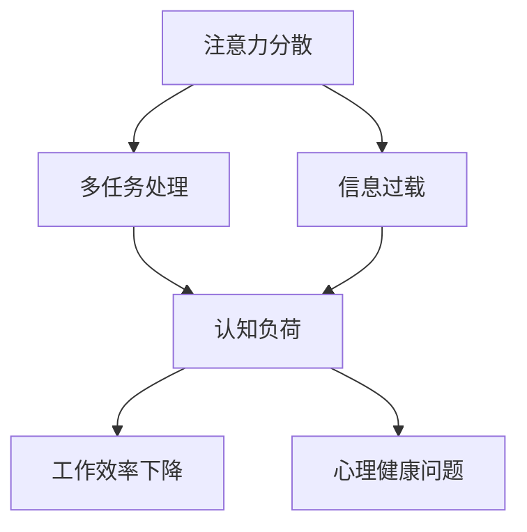

                 

在当今高度数字化的社会中，注意力分散和专注力问题已成为普遍现象。随着人工智能（AI）技术的飞速发展，这一问题变得更加复杂和严重。本文旨在探讨注意力分散与专注力在AI时代所面临的挑战，并提供一些建议以帮助人们应对这些问题。

## 关键词

- 注意力分散
- 专注力
- AI时代
- 认知挑战
- 应对策略

## 摘要

本文首先介绍了注意力分散与专注力的概念及其在现代社会中的重要性。接着，分析了AI时代给人们的认知带来的挑战，包括信息过载、多任务处理等。最后，提出了一些有效的应对策略，以帮助人们提高专注力和应对注意力分散问题。

### 1. 背景介绍

注意力分散（Attention Deficit Hyperactivity Disorder，ADHD）和专注力（Focus）是两个紧密相关的概念。注意力分散指的是个体在执行任务时难以集中注意力，容易受到外界干扰。而专注力则是指个体能够长时间保持对特定任务的注意力，不受外界干扰。

在过去的几十年里，随着科技的飞速发展，人们的注意力分散问题日益严重。在传统的工业时代，人们的工作和生活环境相对简单，主要面对的是现实世界中的问题。然而，在当今的数字化时代，人们面临着前所未有的信息过载。智能手机、社交媒体、电子邮件等应用程序不断分散着人们的注意力，使人们很难长时间专注于一项任务。

### 2. 核心概念与联系

在AI时代，人们面临的注意力分散和专注力问题更加复杂。以下是一个Mermaid流程图，展示了注意力分散和专注力的核心概念及其相互联系：



从图中可以看出，注意力分散会导致多任务处理能力下降，进而增加认知负荷，降低工作效率，并对心理健康产生负面影响。

### 3. 核心算法原理 & 具体操作步骤

在应对注意力分散和专注力问题时，我们可以采用以下核心算法原理：

#### 3.1 算法原理概述

算法的核心思想是通过合理安排工作和休息时间，以及利用技术工具来帮助人们提高专注力。

#### 3.2 算法步骤详解

1. **制定时间管理计划**：根据任务的重要性和紧急程度，为每个任务分配时间。确保每项任务都有足够的时间来完成。

2. **设定专注时间**：将工作时间划分为若干个专注周期，每个周期为25分钟，然后休息5分钟。

3. **使用技术工具**：利用番茄工作法（Pomodoro Technique）等时间管理工具来帮助人们保持专注。

4. **减少干扰因素**：关闭不必要的社交媒体通知，使用屏蔽程序来屏蔽干扰。

5. **定期检查进度**：在每天的结束前回顾任务完成情况，并根据实际情况调整计划。

#### 3.3 算法优缺点

**优点**：
- 提高工作效率
- 减少焦虑和压力
- 提高生活质量

**缺点**：
- 需要较强的自律性
- 在一开始可能会感到不适

#### 3.4 算法应用领域

该算法适用于任何需要集中注意力的场景，如编程、写作、学习等。在AI时代，特别是在远程工作和在线学习的环境中，这种算法具有很高的实用价值。

### 4. 数学模型和公式 & 详细讲解 & 举例说明

为了更好地理解注意力分散和专注力的问题，我们可以借助一些数学模型和公式。以下是一个简单的数学模型，用于描述注意力分散的影响：

$$
F = k \cdot (I - R)
$$

其中，$F$ 表示专注力，$I$ 表示干扰水平，$R$ 表示恢复力，$k$ 是一个常数。

#### 4.1 数学模型构建

这个模型基于以下假设：
- 专注力与干扰水平成反比
- 专注力与恢复力成正比

#### 4.2 公式推导过程

根据假设，我们可以得到以下公式：

$$
F = \frac{k}{I + \frac{R}{k}}
$$

其中，$k$ 是一个常数，用于平衡干扰水平和恢复力的影响。

#### 4.3 案例分析与讲解

假设一个人在安静的环境中（$I = 10$）可以保持100的专注力。如果将干扰水平提高到30，那么他的专注力会下降到70。如果他的恢复力提高到20，那么他的专注力可以恢复到100。

这个例子表明，提高恢复力是提高专注力的关键。在AI时代，我们需要找到有效的方法来提高我们的恢复力，从而应对注意力分散问题。

### 5. 项目实践：代码实例和详细解释说明

为了更好地理解如何在实际项目中应用注意力分散和专注力的算法，以下是一个简单的Python代码实例：

```python
import time

def pomodoro_work(session_duration):
    start_time = time.time()
    while time.time() - start_time < session_duration:
        # 执行任务
        pass
    print("专注周期结束，休息一下！")

def pomodoro_break(break_duration):
    start_time = time.time()
    while time.time() - start_time < break_duration:
        # 休息
        pass
    print("休息周期结束，继续工作！")

# 设置专注时间和休息时间
session_duration = 25 * 60  # 25分钟
break_duration = 5 * 60     # 5分钟

# 执行番茄工作法
while True:
    pomodoro_work(session_duration)
    pomodoro_break(break_duration)
```

这段代码使用Python的`time`模块来计时，并实现了番茄工作法的两个主要环节：专注周期和休息周期。

### 6. 实际应用场景

在AI时代，注意力分散和专注力问题在多个场景中都具有重要意义。以下是一些实际应用场景：

- **远程工作**：远程工作环境中，员工往往需要自己管理时间和注意力。利用注意力分散和专注力的算法可以帮助员工提高工作效率。
- **在线学习**：在线学习平台需要学生具备较高的专注力。通过合理安排学习时间和休息时间，可以帮助学生更好地掌握知识。
- **软件开发**：软件开发过程中，程序员需要长时间保持注意力集中。使用注意力分散和专注力的算法可以帮助程序员提高编码效率。

### 7. 未来应用展望

随着AI技术的不断发展，注意力分散和专注力问题将在更多领域得到关注。以下是一些未来应用展望：

- **个性化时间管理**：未来的时间管理工具将能够根据用户的习惯和需求，提供个性化的时间管理方案。
- **智能干扰屏蔽**：智能干扰屏蔽工具将能够自动识别并屏蔽对用户当前任务无关的干扰。
- **脑波监测与反馈**：利用脑波监测技术，可以为用户提供实时的专注力反馈，帮助他们更好地管理注意力。

### 8. 工具和资源推荐

为了帮助读者更好地应对注意力分散和专注力问题，以下是一些工具和资源的推荐：

- **工具**：
  - **Forest**：一款专注力提升应用，通过种植虚拟植物来帮助用户保持专注。
  - **Freedom**：一款屏蔽干扰的浏览器扩展，可以帮助用户专注工作。

- **资源**：
  - **《深度工作》（Deep Work）**：作者Cal Newport提出了一系列提高专注力的方法，对于需要长时间专注于工作的读者非常有用。
  - **《番茄工作法》（The Pomodoro Technique）**：介绍了如何通过番茄工作法来提高工作效率。

### 9. 总结：未来发展趋势与挑战

随着AI技术的不断进步，注意力分散和专注力问题将成为越来越严重的挑战。未来，我们需要更加重视这一问题的研究和应对。通过开发智能工具、推广有效的注意力管理方法，以及加强公众教育，我们可以更好地应对这一挑战，提高我们的生活质量和工作效率。

### 附录：常见问题与解答

1. **什么是注意力分散？**
   注意力分散是指个体在执行任务时难以集中注意力，容易受到外界干扰。

2. **什么是专注力？**
   专注力是指个体能够长时间保持对特定任务的注意力，不受外界干扰。

3. **如何提高专注力？**
   提高专注力的方法包括合理安排工作和休息时间、减少干扰因素、使用时间管理工具等。

4. **什么是番茄工作法？**
   番茄工作法是一种时间管理方法，通过将工作时间划分为专注周期和休息周期，帮助人们提高专注力。

### 作者署名

作者：禅与计算机程序设计艺术 / Zen and the Art of Computer Programming
```

