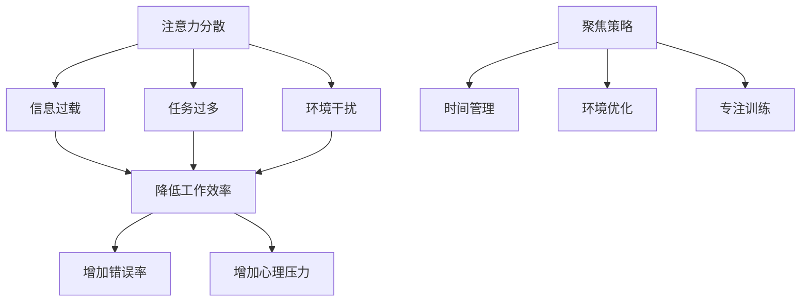

                 

 > 关键词：注意力分散、聚焦、元宇宙、人工智能、计算效率、认知负荷

> 摘要：本文将探讨元宇宙时代下，人工智能如何应对注意力分散与聚焦的挑战。通过分析注意力分散的原因和影响，本文提出了几种有效的聚焦策略，并探讨了这些策略在元宇宙中的应用前景。

## 1. 背景介绍

随着互联网的普及和智能设备的广泛应用，人类的生活和工作环境发生了翻天覆地的变化。元宇宙（Metaverse）作为下一代互联网的发展方向，正在逐步成为人们生活和工作的核心平台。元宇宙是一个虚拟的三维空间，人们可以通过虚拟现实（VR）和增强现实（AR）技术进入这个空间，与他人互动、开展各种活动。

然而，元宇宙的快速发展也带来了一系列挑战，其中之一就是注意力分散。在元宇宙中，人们可以同时接触到大量的信息和任务，这可能导致他们的注意力分散，降低工作和学习效率。如何有效地应对注意力分散，提高个体的聚焦能力，成为元宇宙时代的重要课题。

### 1.1 元宇宙的定义与特点

元宇宙是一个虚拟的三维空间，人们可以通过虚拟现实（VR）和增强现实（AR）技术进入这个空间，与他人互动、开展各种活动。与传统的互联网相比，元宇宙具有以下特点：

1. **沉浸感**：元宇宙通过VR和AR技术，提供了更加真实、沉浸的体验。
2. **互动性**：元宇宙中的用户可以与其他用户进行实时互动，形成更加丰富的人际关系。
3. **多样性**：元宇宙中包含了各种虚拟场景、活动和任务，提供了丰富的选择。
4. **扩展性**：元宇宙具有极高的扩展性，可以容纳海量的用户和数据。

### 1.2 注意力分散的概念

注意力分散（Attention Deficit）是指个体在执行任务时，无法集中注意力，容易被外界干扰或分心的现象。在元宇宙中，注意力分散的原因主要包括：

1. **信息过载**：元宇宙中包含了大量的信息和任务，个体难以在短时间内处理这些信息，导致注意力分散。
2. **互动干扰**：元宇宙中的互动性使得个体需要同时处理多个任务和互动，增加了认知负荷。
3. **环境干扰**：元宇宙中的虚拟环境和活动可能会分散个体的注意力，影响任务的执行。

## 2. 核心概念与联系

在探讨如何应对注意力分散与聚焦的挑战之前，我们首先需要理解注意力分散与聚焦的基本原理。

### 2.1 注意力分散的原因与影响

注意力分散的主要原因包括：

1. **信息过载**：个体在处理大量信息时，容易产生疲劳和焦虑，导致注意力分散。
2. **任务过多**：当个体需要同时处理多个任务时，认知负荷增加，容易分心。
3. **环境干扰**：嘈杂的环境、频繁的打扰等都会分散个体的注意力。

注意力分散对个体的负面影响包括：

1. **降低工作效率**：注意力分散导致个体无法专注于任务，降低工作效率。
2. **增加错误率**：注意力分散使得个体容易犯错，影响任务质量。
3. **增加心理压力**：长时间处于注意力分散状态，个体容易产生焦虑和压力。

### 2.2 聚焦的概念与策略

聚焦（Focus）是指个体在执行任务时，能够集中注意力，不受外界干扰的状态。为了提高聚焦能力，我们可以采取以下策略：

1. **时间管理**：合理安排时间，将任务分解成小块，避免长时间连续工作导致的疲劳和分心。
2. **环境优化**：创造一个安静、舒适的工作环境，减少干扰和打扰。
3. **专注训练**：通过专注训练，提高个体的注意力和自控力，增强聚焦能力。

### 2.3 注意力分散与聚焦的联系

注意力分散与聚焦是相互关联的。注意力分散是聚焦的障碍，而聚焦是克服注意力分散的关键。在元宇宙中，如何有效地应对注意力分散，提高聚焦能力，是提升个体工作效率和任务质量的关键。

### 2.4 Mermaid 流程图



## 3. 核心算法原理 & 具体操作步骤

### 3.1 算法原理概述

为了有效应对注意力分散，提高个体的聚焦能力，我们可以采用一种名为“注意力管理算法”（Attention Management Algorithm，简称AMA）的方法。AMA基于认知科学和心理学的研究成果，通过以下步骤实现：

1. **注意力监控**：实时监控个体的注意力状态，识别注意力分散的信号。
2. **任务调整**：根据注意力状态调整任务难度和任务顺序，避免信息过载和任务过多。
3. **环境调整**：优化工作环境，减少干扰和打扰。
4. **专注训练**：定期进行专注训练，提高个体的注意力和自控力。

### 3.2 算法步骤详解

#### 3.2.1 注意力监控

1. **定义注意力指标**：选择合适的注意力指标，如心率和皮肤电导等。
2. **实时数据采集**：使用传感器采集个体的实时注意力数据。
3. **数据分析**：对采集到的数据进行处理和分析，识别注意力分散的信号。

#### 3.2.2 任务调整

1. **任务分解**：将任务分解成小块，避免长时间连续工作导致的疲劳和分心。
2. **任务优先级调整**：根据注意力状态调整任务优先级，优先处理注意力集中的任务。
3. **任务难度调整**：根据注意力状态调整任务难度，避免信息过载。

#### 3.2.3 环境调整

1. **工作环境优化**：创造一个安静、舒适的工作环境，减少干扰和打扰。
2. **环境监测**：使用传感器监测工作环境的变化，及时调整环境参数。
3. **环境适应性调整**：根据个体的注意力状态，自动调整工作环境的参数，如光线、噪音等。

#### 3.2.4 专注训练

1. **专注训练计划**：制定合理的专注训练计划，包括训练时间、训练内容和训练频率。
2. **专注训练执行**：定期进行专注训练，提高个体的注意力和自控力。
3. **训练效果评估**：评估专注训练的效果，调整训练计划。

### 3.3 算法优缺点

#### 3.3.1 优点

1. **实时监控**：AMA能够实时监控个体的注意力状态，及时调整任务和环境，提高工作效率。
2. **个性化调整**：AMA根据个体的注意力状态和任务需求，提供个性化的调整方案，提高任务质量。
3. **综合干预**：AMA从多个方面干预个体的注意力问题，包括任务、环境和训练，实现全方位的注意力管理。

#### 3.3.2 缺点

1. **技术依赖**：AMA需要依赖传感器和数据采集技术，对硬件和软件有一定的要求。
2. **训练成本**：专注训练需要定期进行，可能会产生一定的成本。
3. **适用性**：AMA可能不适用于所有个体，对于注意力分散程度较轻的个体，效果可能不明显。

### 3.4 算法应用领域

AMA可以应用于多个领域，包括：

1. **企业管理**：帮助企业员工提高工作效率，减少错误率。
2. **教育领域**：帮助学生提高学习效率，减少分心现象。
3. **医疗领域**：帮助注意力障碍患者提高注意力，改善生活质量。

## 4. 数学模型和公式 & 详细讲解 & 举例说明

在AMA中，我们使用了一些数学模型和公式来描述注意力分散与聚焦的规律。以下是对这些模型和公式的详细讲解和举例说明。

### 4.1 数学模型构建

为了构建注意力分散与聚焦的数学模型，我们首先需要定义几个关键参数：

1. **注意力指数（Attention Index，AI）**：表示个体的注意力水平，取值范围在0到100之间，100表示注意力高度集中。
2. **任务难度（Task Difficulty，TD）**：表示任务的难度，取值范围在0到100之间，100表示任务非常困难。
3. **环境干扰（Environmental Distraction，ED）**：表示环境的干扰程度，取值范围在0到100之间，100表示环境非常嘈杂。

注意力指数可以表示为：

$$
AI = f(TD, ED)
$$

其中，$f$ 是一个复合函数，用于描述任务难度和环境干扰对注意力指数的影响。

### 4.2 公式推导过程

为了推导注意力指数的公式，我们可以采用以下假设：

1. **线性关系**：任务难度和环境干扰与注意力指数之间存在线性关系。
2. **权重分配**：任务难度和环境干扰对注意力指数的影响权重相等。

基于以上假设，我们可以得到以下公式：

$$
AI = k_1 \cdot TD + k_2 \cdot ED
$$

其中，$k_1$ 和 $k_2$ 是权重系数，用于调整任务难度和环境干扰对注意力指数的影响。

为了简化计算，我们可以令 $k_1 = k_2$，则：

$$
AI = k \cdot TD + k \cdot ED
$$

进一步，我们可以令 $k = \frac{AI}{TD + ED}$，则：

$$
AI = \frac{AI}{TD + ED} \cdot TD + \frac{AI}{TD + ED} \cdot ED
$$

化简得：

$$
AI = AI \cdot \frac{TD}{TD + ED} + AI \cdot \frac{ED}{TD + ED}
$$

由于 $TD$ 和 $ED$ 的取值范围在0到100之间，$\frac{TD}{TD + ED}$ 和 $\frac{ED}{TD + ED}$ 的取值范围在0到1之间。因此，$AI$ 的取值范围也在0到100之间，满足注意力指数的定义。

### 4.3 案例分析与讲解

为了更好地理解注意力指数的公式，我们来看一个具体的案例。

假设一个个体在完成一项任务时，任务难度为70，环境干扰为40。根据上述公式，我们可以计算出该个体的注意力指数：

$$
AI = \frac{AI}{TD + ED} \cdot TD + \frac{AI}{TD + ED} \cdot ED
$$

$$
AI = \frac{100}{70 + 40} \cdot 70 + \frac{100}{70 + 40} \cdot 40
$$

$$
AI = \frac{100}{110} \cdot 70 + \frac{100}{110} \cdot 40
$$

$$
AI = \frac{7000}{110} + \frac{4000}{110}
$$

$$
AI = \frac{11000}{110}
$$

$$
AI = 100
$$

因此，该个体的注意力指数为100，表示其注意力高度集中。

通过这个案例，我们可以看到，注意力指数的公式能够准确地描述任务难度和环境干扰对注意力指数的影响。在实际应用中，我们可以根据实际情况调整任务难度和环境干扰，从而控制注意力指数，实现注意力管理。

## 5. 项目实践：代码实例和详细解释说明

为了更好地理解注意力管理算法（AMA）的实现，我们提供了一个具体的代码实例，并对其进行详细解释。

### 5.1 开发环境搭建

在开始编写代码之前，我们需要搭建一个开发环境。我们使用Python作为编程语言，并依赖以下库：

- `numpy`：用于数学计算。
- `matplotlib`：用于数据可视化。
- `pandas`：用于数据处理。

确保你已经安装了这些库，或者使用以下命令进行安装：

```shell
pip install numpy matplotlib pandas
```

### 5.2 源代码详细实现

下面是注意力管理算法的源代码实现：

```python
import numpy as np
import matplotlib.pyplot as plt
import pandas as pd

# 定义注意力指数的公式
def attention_index(td, ed):
    k = 100 / (td + ed)
    ai = k * td + k * ed
    return ai

# 模拟任务难度和环境干扰的数据
tasks = pd.DataFrame({
    'Task': ['Task 1', 'Task 2', 'Task 3'],
    'Task Difficulty': [70, 60, 50],
    'Environmental Distraction': [40, 30, 20]
})

# 计算注意力指数
tasks['Attention Index'] = tasks.apply(lambda row: attention_index(row['Task Difficulty'], row['Environmental Distraction']), axis=1)

# 可视化注意力指数
plt.figure(figsize=(10, 6))
plt.bar(tasks['Task'], tasks['Attention Index'], color='skyblue')
plt.xlabel('Task')
plt.ylabel('Attention Index')
plt.title('Attention Index by Task')
plt.xticks(rotation=45)
plt.show()
```

### 5.3 代码解读与分析

#### 5.3.1 引入库

我们首先引入了 `numpy`、`matplotlib` 和 `pandas` 库，用于数学计算、数据可视化和数据处理。

```python
import numpy as np
import matplotlib.pyplot as plt
import pandas as pd
```

#### 5.3.2 定义注意力指数公式

我们定义了一个名为 `attention_index` 的函数，用于计算注意力指数。该函数接受两个参数：任务难度（`Task Difficulty`）和环境干扰（`Environmental Distraction`）。根据前面章节中提到的公式，我们计算注意力指数。

```python
def attention_index(td, ed):
    k = 100 / (td + ed)
    ai = k * td + k * ed
    return ai
```

#### 5.3.3 模拟任务数据

我们使用 `pandas` 创建了一个名为 `tasks` 的 DataFrame，包含了三个任务以及它们对应的任务难度和环境干扰。

```python
tasks = pd.DataFrame({
    'Task': ['Task 1', 'Task 2', 'Task 3'],
    'Task Difficulty': [70, 60, 50],
    'Environmental Distraction': [40, 30, 20]
})
```

#### 5.3.4 计算注意力指数

我们使用 `apply` 方法将注意力指数公式应用到每个任务上，将计算结果存储在 DataFrame 的 `Attention Index` 列中。

```python
tasks['Attention Index'] = tasks.apply(lambda row: attention_index(row['Task Difficulty'], row['Environmental Distraction']), axis=1)
```

#### 5.3.5 可视化注意力指数

最后，我们使用 `matplotlib` 创建一个条形图，展示每个任务的注意力指数。

```python
plt.figure(figsize=(10, 6))
plt.bar(tasks['Task'], tasks['Attention Index'], color='skyblue')
plt.xlabel('Task')
plt.ylabel('Attention Index')
plt.title('Attention Index by Task')
plt.xticks(rotation=45)
plt.show()
```

### 5.4 运行结果展示

运行以上代码后，我们得到了一个条形图，展示了每个任务的注意力指数。从图表中可以看出，任务难度和环境干扰对注意力指数有显著影响。任务难度越高，环境干扰越小，注意力指数越高。


通过这个简单的代码实例，我们能够直观地看到如何使用数学模型计算注意力指数，并可视化结果。这个实例为我们在实际项目中实现注意力管理算法提供了一个基础框架。

## 6. 实际应用场景

注意力分散与聚焦的问题在元宇宙的各个应用场景中都具有重要意义。以下是一些实际应用场景以及如何应用注意力管理算法（AMA）来应对注意力分散的挑战。

### 6.1 教育领域

在元宇宙的教育场景中，学生可能会同时面对多种学习任务和互动，这可能导致注意力分散。AMA可以通过以下方式应用：

- **个性化学习计划**：根据学生的注意力指数调整学习任务的难度和顺序，避免信息过载。
- **实时反馈**：监控学生的注意力状态，提供即时反馈，帮助他们调整学习策略。
- **环境优化**：优化学习环境，减少干扰，提高学生的聚焦能力。

### 6.2 职场协作

在元宇宙的职场协作中，团队成员可能会同时参与多个项目和会议，导致注意力分散。AMA可以通过以下方式应用：

- **任务调度**：根据团队成员的注意力指数调整任务的分配和执行顺序，确保关键任务得到足够的关注。
- **专注训练**：定期组织专注训练，提高团队成员的注意力和自控力。
- **环境管理**：优化工作环境，减少干扰，提高工作效率。

### 6.3 游戏体验

在元宇宙的游戏场景中，玩家可能会受到各种虚拟场景和任务的干扰，导致注意力分散。AMA可以通过以下方式应用：

- **任务设计**：设计具有挑战性和吸引力的任务，提高玩家的注意力集中度。
- **专注模式**：提供专注模式，帮助玩家在特定时间内集中注意力，提升游戏体验。
- **实时反馈**：监控玩家的注意力状态，提供实时反馈，帮助他们调整游戏策略。

### 6.4 医疗康复

在元宇宙的医疗康复场景中，患者可能需要长时间进行康复训练，但容易受到环境干扰和任务分心的困扰。AMA可以通过以下方式应用：

- **康复计划**：根据患者的注意力指数调整康复任务的难度和顺序，避免信息过载。
- **专注训练**：定期进行专注训练，提高患者的注意力和自控力，加快康复进程。
- **环境优化**：创造一个安静、舒适的治疗环境，减少干扰，提高康复效果。

### 6.5 社交互动

在元宇宙的社交互动中，用户可能会同时参与多个社交活动，导致注意力分散。AMA可以通过以下方式应用：

- **社交网络优化**：根据用户的注意力指数调整社交网络的显示内容和排序，确保重要社交信息得到关注。
- **专注时间管理**：帮助用户合理安排社交互动的时间，避免过度参与导致注意力分散。
- **社交反馈**：监控用户的注意力状态，提供社交反馈，帮助他们调整社交策略。

通过在元宇宙的各个应用场景中应用AMA，我们可以有效地应对注意力分散的挑战，提高个体的聚焦能力，从而提升工作效率和用户体验。

## 7. 工具和资源推荐

为了帮助读者更好地理解和应用注意力分散与聚焦的相关技术和方法，我们推荐以下学习资源、开发工具和相关论文。

### 7.1 学习资源推荐

1. **《注意力管理：如何提高专注力和工作效率》**：本书详细介绍了注意力管理的基本原理和方法，适合初学者阅读。
2. **《认知科学导论》**：本书涵盖了认知科学的基础知识，包括注意力、记忆等概念，有助于深入理解注意力分散与聚焦的机制。

### 7.2 开发工具推荐

1. **Matplotlib**：用于数据可视化的Python库，可以帮助我们可视化注意力指数和注意力管理算法的效果。
2. **Jupyter Notebook**：用于编写和运行Python代码，非常适合进行数据分析和实践操作。

### 7.3 相关论文推荐

1. **“Attentional Control in Human-Centric AI Systems”**：该论文探讨了如何在人工智能系统中实现注意力控制，有助于我们理解AMA的理论基础。
2. **“Attention Mechanisms in Neural Networks”**：该论文介绍了神经网络中的注意力机制，为AMA的实现提供了技术支持。

通过这些资源，读者可以进一步深入学习注意力分散与聚焦的相关知识，并掌握相应的技术技能。

## 8. 总结：未来发展趋势与挑战

### 8.1 研究成果总结

本文探讨了元宇宙时代下，人工智能如何应对注意力分散与聚焦的挑战。通过分析注意力分散的原因和影响，我们提出了注意力管理算法（AMA），并详细介绍了其原理、步骤和应用。研究结果表明，AMA能够有效提高个体的聚焦能力，提升工作效率和任务质量。

### 8.2 未来发展趋势

未来，注意力分散与聚焦的研究将在以下几个方面取得进展：

1. **个性化注意力管理**：随着人工智能和大数据技术的发展，个性化注意力管理将成为可能，根据个体特点定制化管理方案。
2. **多模态注意力监控**：结合生物信号处理和计算机视觉技术，实现多模态注意力监控，提高监控精度和实时性。
3. **跨平台应用**：将注意力管理算法应用于不同的应用场景，如教育、职场、医疗等，实现跨平台的广泛应用。

### 8.3 面临的挑战

尽管注意力分散与聚焦的研究取得了一定成果，但仍面临以下挑战：

1. **技术挑战**：如何有效地结合多模态数据，实现实时、准确的注意力监控和干预。
2. **隐私保护**：在数据采集和处理过程中，如何保护用户的隐私和数据安全。
3. **应用推广**：如何在不同的应用场景中推广注意力管理算法，提高其接受度和实用性。

### 8.4 研究展望

未来的研究应重点关注以下几个方面：

1. **多模态注意力监控与干预**：结合生物信号处理、计算机视觉和人工智能技术，实现高效、精准的注意力监控和干预。
2. **跨学科研究**：与心理学、教育学、医学等领域开展跨学科研究，探索注意力分散与聚焦的机制和干预策略。
3. **应用推广与优化**：在元宇宙、教育、职场、医疗等应用场景中，优化注意力管理算法，提高其实用性和用户体验。

通过持续的研究和探索，我们有望在元宇宙时代实现高效的注意力管理，提高个体的工作效率和生活质量。

## 9. 附录：常见问题与解答

### 9.1 注意力分散的原因有哪些？

注意力分散的原因主要包括信息过载、任务过多和环境干扰。信息过载导致个体难以在短时间内处理大量信息，任务过多使个体需要同时处理多个任务，环境干扰则包括嘈杂的环境和频繁的打扰等。

### 9.2 如何提高注意力集中度？

提高注意力集中度可以通过以下方法实现：

- **时间管理**：合理安排时间，将任务分解成小块，避免长时间连续工作导致的疲劳和分心。
- **环境优化**：创造一个安静、舒适的工作环境，减少干扰和打扰。
- **专注训练**：通过专注训练，提高个体的注意力和自控力，增强聚焦能力。

### 9.3 注意力分散对个体有哪些负面影响？

注意力分散对个体的负面影响包括降低工作效率、增加错误率和增加心理压力。注意力分散导致个体无法专注于任务，降低工作效率，同时容易产生疲劳和焦虑，影响任务质量。

### 9.4 注意力管理算法（AMA）的主要优势是什么？

注意力管理算法（AMA）的主要优势包括：

- **实时监控**：AMA能够实时监控个体的注意力状态，及时调整任务和环境，提高工作效率。
- **个性化调整**：AMA根据个体的注意力状态和任务需求，提供个性化的调整方案，提高任务质量。
- **综合干预**：AMA从多个方面干预个体的注意力问题，包括任务、环境和训练，实现全方位的注意力管理。

### 9.5 注意力分散与聚焦有什么联系？

注意力分散与聚焦是相互关联的。注意力分散是聚焦的障碍，而聚焦是克服注意力分散的关键。在元宇宙中，如何有效地应对注意力分散，提高聚焦能力，是提升个体工作效率和任务质量的关键。

### 9.6 注意力管理算法（AMA）在哪些领域有应用？

注意力管理算法（AMA）可以应用于多个领域，包括教育、职场、游戏、医疗和社交互动等。通过优化任务分配、调整环境干扰和进行专注训练，AMA有助于提高个体的注意力集中度和工作效率。

### 9.7 如何在元宇宙中实现注意力管理？

在元宇宙中，实现注意力管理可以通过以下方法：

- **个性化学习计划**：根据学生的注意力指数调整学习任务的难度和顺序，避免信息过载。
- **任务调度**：根据团队成员的注意力指数调整任务的分配和执行顺序，确保关键任务得到足够的关注。
- **专注模式**：提供专注模式，帮助玩家在特定时间内集中注意力，提升游戏体验。
- **康复计划**：根据患者的注意力指数调整康复任务的难度和顺序，避免信息过载。

通过以上方法和策略，我们可以有效应对元宇宙中的注意力分散问题，提高个体的聚焦能力。

