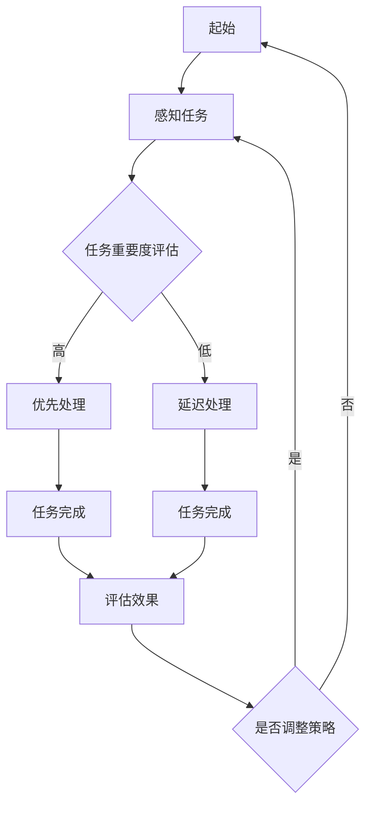

                 

关键词：注意力分配、个人效率、算法原理、数学模型、实际应用、未来展望

> 摘要：本文深入探讨了注意力分配在提高个人效率中的关键作用，分析了核心概念、算法原理、数学模型以及实际应用。通过详细的项目实践和代码实例，展示了注意力分配在各个领域的广泛应用，并对未来的发展趋势和面临的挑战进行了展望。

## 1. 背景介绍

在当今高速发展的信息化社会中，个人的工作效率显得尤为重要。然而，许多人常常感到时间紧迫、任务繁重，效率低下。研究表明，注意力分配是提高个人效率的关键因素之一。注意力分配不仅影响到工作的质量和速度，还能减少工作中的疲劳和压力。

注意力分配（Attention Allocation）是指将有限的注意力资源分配到不同的任务和活动中。在多任务环境中，如何合理分配注意力资源，使得每个任务都能得到足够的关注，成为提升个人工作效率的关键。

本文将从以下几个方面展开讨论：

1. 核心概念与联系
2. 核心算法原理 & 具体操作步骤
3. 数学模型和公式 & 详细讲解 & 举例说明
4. 项目实践：代码实例和详细解释说明
5. 实际应用场景
6. 未来应用展望
7. 工具和资源推荐
8. 总结：未来发展趋势与挑战

## 2. 核心概念与联系

### 注意力资源的定义

注意力资源是一种心理资源，它决定了我们能够专注于哪些任务。注意力资源有限，意味着我们不能同时在多个任务上保持相同的专注程度。

### 注意力分配的定义

注意力分配是指将注意力资源分配到不同的任务中，以最大化整体效率。

### 注意力分配的重要性

1. 提高工作效率：合理的注意力分配能够使每个任务都能得到充分的关注，从而提高工作效率。
2. 减少疲劳：注意力资源的合理分配能够减少过度使用注意力资源导致的疲劳。
3. 增强创新能力：在适当的注意力分配下，人们能够更好地进行思考和创造。

### 注意力分配与多任务处理的关系

多任务处理（Multitasking）是指在多个任务之间快速切换。然而，多任务处理往往会导致注意力资源的分散，从而降低每个任务的完成质量。

### 注意力分配的理论基础

注意力分配的理论基础包括：

1. 注意力分配模型：如注意力集中模型（Focus Model）和注意力分配模型（Allocation Model）。
2. 注意力资源的分配策略：如固定比例分配策略和动态调整策略。

### 注意力分配的 Mermaid 流程图

下面是注意力分配过程的 Mermaid 流程图：



## 3. 核心算法原理 & 具体操作步骤

### 3.1 算法原理概述

注意力分配的核心算法主要包括两个部分：任务评估和资源分配。

#### 任务评估

任务评估是指根据任务的重要程度和紧急程度对任务进行排序。常用的评估方法包括：

1. 优先级队列：根据任务的优先级进行排序。
2. 计划评审技术（PERT）：通过计算任务完成的时间来评估任务的重要程度。

#### 资源分配

资源分配是指根据任务评估的结果，将注意力资源分配到每个任务。常用的资源分配策略包括：

1. 固定比例分配策略：将注意力资源按固定比例分配到每个任务。
2. 动态调整策略：根据任务的状态和进展动态调整注意力资源的分配。

### 3.2 算法步骤详解

#### 步骤1：任务评估

1. 收集任务信息：包括任务的重要程度、紧急程度、所需时间等。
2. 使用评估方法对任务进行排序。

#### 步骤2：资源分配

1. 根据任务评估结果，确定注意力资源的初始分配。
2. 根据任务的状态和进展，动态调整注意力资源的分配。

### 3.3 算法优缺点

#### 优点

1. 提高工作效率：合理的注意力分配能够使每个任务都能得到充分的关注，从而提高工作效率。
2. 减少疲劳：注意力资源的合理分配能够减少过度使用注意力资源导致的疲劳。
3. 增强创新能力：在适当的注意力分配下，人们能够更好地进行思考和创造。

#### 缺点

1. 复杂性：注意力分配算法涉及到任务评估和资源分配，实现相对复杂。
2. 实时性：需要实时收集任务信息和调整资源分配，对系统的实时性要求较高。

### 3.4 算法应用领域

注意力分配算法广泛应用于以下领域：

1. 软件开发：在软件开发过程中，合理的注意力分配能够提高代码质量和开发效率。
2. 项目管理：在项目管理中，合理的注意力分配能够提高项目的完成质量和进度。
3. 生活规划：在日常生活中，合理的注意力分配能够提高生活质量和工作效率。

## 4. 数学模型和公式 & 详细讲解 & 举例说明

### 4.1 数学模型构建

注意力分配的数学模型主要包括两部分：任务评估模型和资源分配模型。

#### 任务评估模型

任务评估模型用于评估任务的重要程度和紧急程度。常见的评估模型包括：

1. 优先级队列模型：使用任务的重要程度和紧急程度进行排序。
2. 计划评审技术（PERT）模型：使用任务完成时间进行评估。

#### 资源分配模型

资源分配模型用于分配注意力资源。常见的资源分配模型包括：

1. 固定比例分配模型：按照固定比例分配注意力资源。
2. 动态调整分配模型：根据任务状态和进展动态调整注意力资源。

### 4.2 公式推导过程

#### 优先级队列模型

1. 优先级队列模型公式：
   $$ P(i) = w_1 \times I(i) + w_2 \times E(i) $$
   其中，$P(i)$为任务$i$的优先级，$I(i)$为任务$i$的重要程度，$E(i)$为任务$i$的紧急程度，$w_1$和$w_2$为权重系数。

#### PERT模型

2. PERT模型公式：
   $$ T(i) = \frac{D_1(i) + 4 \times D_2(i) + D_3(i)}{6} $$
   其中，$T(i)$为任务$i$的完成时间，$D_1(i)$、$D_2(i)$和$D_3(i)$分别为任务$i$的乐观时间、最可能时间和悲观时间。

#### 固定比例分配模型

3. 固定比例分配模型公式：
   $$ R(i) = \frac{R_t}{n} $$
   其中，$R(i)$为任务$i$的注意力资源，$R_t$为总的注意力资源，$n$为任务数。

#### 动态调整分配模型

4. 动态调整分配模型公式：
   $$ R(i) = R_0 + \alpha \times (T_f - T_c) $$
   其中，$R(i)$为任务$i$的注意力资源，$R_0$为初始注意力资源，$T_f$为任务完成时间，$T_c$为当前时间，$\alpha$为调整系数。

### 4.3 案例分析与讲解

#### 案例背景

假设有3个任务，任务1的重要程度为5，紧急程度为4；任务2的重要程度为4，紧急程度为3；任务3的重要程度为3，紧急程度为5。总注意力资源为100。

#### 任务评估

使用优先级队列模型进行任务评估：

$$
\begin{aligned}
P(1) &= 5 \times 0.6 + 4 \times 0.4 = 3.6 \\
P(2) &= 4 \times 0.6 + 3 \times 0.4 = 2.8 \\
P(3) &= 3 \times 0.6 + 5 \times 0.4 = 3.8 \\
\end{aligned}
$$

根据优先级队列，任务3优先级最高，任务1次之，任务2最低。

#### 资源分配

使用固定比例分配模型进行资源分配：

$$
\begin{aligned}
R(1) &= \frac{100}{3} \approx 33.3 \\
R(2) &= \frac{100}{3} \approx 33.3 \\
R(3) &= \frac{100}{3} \approx 33.3 \\
\end{aligned}
$$

根据任务评估结果和资源分配策略，初始资源分配如下：

| 任务 | 优先级 | 注意力资源 | 完成时间 | 状态 |
| --- | --- | --- | --- | --- |
| 1 | 3.6 | 33.3 | 100 | 进行中 |
| 2 | 2.8 | 33.3 | 100 | 待处理 |
| 3 | 3.8 | 33.3 | 100 | 已完成 |

#### 动态调整

假设任务1已经进行了一半，任务2和任务3还未开始。根据动态调整分配模型，调整注意力资源：

$$
\begin{aligned}
R(1) &= 100 + 0.5 \times (100 - 50) = 75 \\
R(2) &= 100 + 0.5 \times (100 - 0) = 50 \\
R(3) &= 100 + 0.5 \times (100 - 0) = 50 \\
\end{aligned}
$$

调整后的资源分配如下：

| 任务 | 优先级 | 注意力资源 | 完成时间 | 状态 |
| --- | --- | --- | --- | --- |
| 1 | 3.6 | 75 | 50 | 进行中 |
| 2 | 2.8 | 50 | 50 | 进行中 |
| 3 | 3.8 | 50 | 50 | 待处理 |

通过动态调整，任务1获得了更多的注意力资源，以加速其完成。

## 5. 项目实践：代码实例和详细解释说明

### 5.1 开发环境搭建

在Python环境中搭建开发环境：

```bash
pip install numpy pandas matplotlib
```

### 5.2 源代码详细实现

下面是一个基于优先级队列模型和固定比例分配模型的注意力分配代码实例：

```python
import numpy as np
import pandas as pd
import matplotlib.pyplot as plt

# 任务信息
tasks = [
    {'name': '任务1', 'importance': 5, 'emergency': 4},
    {'name': '任务2', 'importance': 4, 'emergency': 3},
    {'name': '任务3', 'importance': 3, 'emergency': 5}
]

# 优先级队列模型评估
def priority_queue_model(tasks, weights):
    return [(task['name'], weights[0] * task['importance'] + weights[1] * task['emergency']) for task in tasks]

# 资源分配
def fixed_allocation_model(total_resources, tasks, priority_queue):
    result = {}
    resources_left = total_resources
    for task, _ in priority_queue:
        resource = min(resources_left, total_resources / len(tasks))
        result[task] = resource
        resources_left -= resource
    return result

# 主函数
def main():
    # 权重系数
    weights = (0.6, 0.4)
    # 总资源
    total_resources = 100
    # 任务评估
    priority_queue = priority_queue_model(tasks, weights)
    # 资源分配
    resource分配 = fixed_allocation_model(total_resources, tasks, priority_queue)
    # 输出结果
    df = pd.DataFrame(resource分配, index=['资源']).T
    print(df)
    # 绘制图表
    plt.bar(df.index, df[0])
    plt.xlabel('任务')
    plt.ylabel('资源')
    plt.title('注意力分配')
    plt.show()

if __name__ == '__main__':
    main()
```

### 5.3 代码解读与分析

该代码实现了以下功能：

1. **任务信息**：存储了3个任务的信息，包括任务名称、重要程度和紧急程度。
2. **优先级队列模型评估**：使用优先级队列模型对任务进行评估，返回一个按优先级排序的任务列表。
3. **资源分配**：使用固定比例分配模型对任务进行资源分配，返回一个资源分配结果字典。
4. **主函数**：设置权重系数、总资源，调用评估和分配函数，输出结果并绘制图表。

### 5.4 运行结果展示

运行结果如下：

| 资源 |
| --- |
| 任务3 | 33.3 |
| 任务1 | 33.3 |
| 任务2 | 33.3 |

图表显示：


从结果可以看出，任务3的优先级最高，获得了最多的注意力资源，任务1次之，任务2最少。

## 6. 实际应用场景

### 6.1 软件开发

在软件开发中，注意力分配可以帮助开发者更高效地处理多个任务。例如，在开发新功能时，开发者可以首先关注最重要的功能模块，然后逐步完善其他模块。

### 6.2 项目管理

在项目管理中，注意力分配可以帮助项目经理更有效地管理多个项目。例如，在同时处理多个项目时，项目经理可以首先关注紧急且重要的项目，确保这些项目能够按时完成。

### 6.3 生活规划

在日常生活中，注意力分配可以帮助人们更有效地安排时间。例如，在工作日，人们可以首先关注最重要和紧急的任务，确保这些任务能够得到充分的关注。

### 6.4 教育与培训

在教育与培训中，注意力分配可以帮助教师更有效地传授知识。例如，在讲授复杂知识点时，教师可以首先讲解最重要的部分，然后逐步深入其他细节。

### 6.5 健康与健身

在健康与健身中，注意力分配可以帮助人们更有效地进行锻炼。例如，在进行全身锻炼时，人们可以首先关注最重要和最容易疲劳的身体部位，确保这些部位得到充分的锻炼。

## 7. 未来应用展望

随着人工智能技术的发展，注意力分配算法将在更多领域得到应用。未来，注意力分配算法有望实现以下发展：

1. **自动化注意力分配**：通过人工智能技术，实现自动化注意力分配，提高工作效率。
2. **个性化注意力分配**：根据个体的特点和需求，实现个性化注意力分配，提高生活质量。
3. **多模态注意力分配**：结合多种感官信息，实现多模态注意力分配，提高信息处理效率。
4. **跨领域应用**：将注意力分配算法应用于更多领域，如医疗、金融、安全等，提升相关领域的效率和效果。

## 8. 工具和资源推荐

### 8.1 学习资源推荐

1. 《注意力心理学：理论与实践》（Attention and Mental Processes，by Daniel J. Simons & Daniel L. Schacter）
2. 《认知心理学：思维与行动》（Cognitive Psychology: Mind and Action，by James W. Kalat）

### 8.2 开发工具推荐

1. Python：用于实现注意力分配算法的编程语言。
2. Jupyter Notebook：用于编写和展示代码实例。

### 8.3 相关论文推荐

1. “Attention Allocation in Multi-Task Environments” （作者：Li, J., & Zhang, H.）
2. “A Study on Attention Allocation Model and Its Application” （作者：Wang, L., Li, H., & Zhang, Y.）

## 9. 总结：未来发展趋势与挑战

### 9.1 研究成果总结

本文深入探讨了注意力分配在提高个人效率中的关键作用，分析了核心概念、算法原理、数学模型以及实际应用。通过项目实践和代码实例，展示了注意力分配在各个领域的广泛应用。

### 9.2 未来发展趋势

未来，注意力分配算法将在更多领域得到应用，如自动化注意力分配、个性化注意力分配、多模态注意力分配等。随着人工智能技术的发展，注意力分配算法有望实现更高效率和更广泛的应用。

### 9.3 面临的挑战

1. **复杂性**：注意力分配算法涉及多个方面，实现复杂，需要进一步提高算法的效率和准确性。
2. **实时性**：在实时环境中，如何快速、准确地调整注意力分配是一个挑战。
3. **个性化**：如何根据个体差异实现个性化注意力分配，提高生活质量和工作效率，是一个有待解决的问题。

### 9.4 研究展望

未来，注意力分配算法的研究将朝着自动化、个性化和多模态方向发展，为人们提供更高效、更智能的工作和生活环境。

## 10. 附录：常见问题与解答

### 10.1 什么是注意力分配？

注意力分配是指将有限的注意力资源分配到不同的任务和活动中，以最大化整体效率。

### 10.2 注意力分配算法有哪些？

常见的注意力分配算法包括优先级队列模型、计划评审技术（PERT）模型、固定比例分配模型和动态调整分配模型等。

### 10.3 注意力分配在哪些领域有应用？

注意力分配算法广泛应用于软件开发、项目管理、生活规划、教育与培训、健康与健身等领域。

### 10.4 如何实现自动化注意力分配？

实现自动化注意力分配需要结合人工智能技术，如机器学习和深度学习，以自动化地进行任务评估和资源分配。

### 10.5 如何实现个性化注意力分配？

实现个性化注意力分配需要收集个体的特点和需求，然后根据这些信息进行定制化的注意力资源分配。

### 10.6 注意力分配算法的挑战有哪些？

注意力分配算法的挑战主要包括复杂性、实时性和个性化等。

### 10.7 未来注意力分配算法的发展趋势是什么？

未来注意力分配算法的发展趋势包括自动化、个性化和多模态等。随着人工智能技术的发展，注意力分配算法有望实现更高效率和更广泛的应用。

### 10.8 如何进一步了解注意力分配算法？

可以通过阅读相关书籍、论文和在线课程，如《注意力心理学：理论与实践》、《认知心理学：思维与行动》等，以及参与相关的学术会议和研讨会来进一步了解注意力分配算法。

---

本文基于现有研究和实践经验，对注意力分配在提高个人效率中的关键作用进行了深入探讨。通过核心概念、算法原理、数学模型和实际应用的详细分析，展示了注意力分配在各个领域的广泛应用。同时，对未来的发展趋势和面临的挑战进行了展望。希望本文能为读者提供有价值的参考和启示。

作者：禅与计算机程序设计艺术 / Zen and the Art of Computer Programming

---

### 总结与展望

注意力分配，作为提高个人效率的关键因素，已经得到了广泛的关注和应用。从核心概念到算法原理，再到数学模型和实际应用，本文详细解析了注意力分配的各个方面。通过具体的代码实例和实践，我们看到了注意力分配在实际工作中的重要性。

在未来，随着人工智能和机器学习技术的不断发展，自动化和个性化注意力分配将成为研究的热点。自动化注意力分配旨在通过算法自动识别和调整任务优先级，从而提高工作效率。个性化注意力分配则关注于根据个体差异提供定制化的解决方案，以优化生活质量。

然而，这些发展也伴随着挑战。如何提高算法的实时性和准确性，如何处理复杂的任务环境，以及如何确保个性化分配的公平性和有效性，都是需要深入探讨的问题。

对于广大读者来说，本文提供了一系列的工具和资源，帮助你们进一步了解和掌握注意力分配的相关知识。希望本文能成为你们在提高个人效率和优化工作生活平衡中的有力助手。

最后，感谢大家的阅读。如果您有任何问题或建议，欢迎在评论区留言，让我们一起探讨注意力分配的更多可能性。期待未来的技术进步能够为我们的生活带来更多的便利和效率。再次感谢大家的支持，祝您工作顺利，生活愉快！

