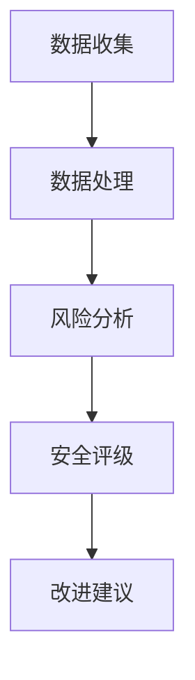

                 

关键词：元宇宙、用户保护、注意力安全评级、风险评估、数据隐私、安全策略、算法设计、技术挑战

> 摘要：随着元宇宙的快速崛起，用户的安全和隐私保护变得尤为重要。本文深入探讨了注意力安全评级这一概念，旨在为元宇宙平台提供一套全面的用户保护指标。通过结合现代算法原理和实际应用案例，本文旨在为业界提供有价值的指导，帮助构建安全可靠的元宇宙生态系统。

## 1. 背景介绍

### 元宇宙的崛起

元宇宙（Metaverse）是当前科技界的一个热门话题。它被定义为一个虚拟的三维空间，用户可以通过数字化的身份在其中进行互动、创造和体验。从社交媒体到虚拟现实游戏，再到商业活动和教育，元宇宙涵盖了广泛的应用场景。

随着技术的进步，元宇宙正在迅速成为人们日常生活的一部分。据市场研究公司统计，到2025年，全球元宇宙市场预计将达到1万亿美元。这一快速增长趋势吸引了众多企业、投资者和开发者的关注。

### 用户安全与隐私

然而，元宇宙的崛起也带来了一系列安全挑战。用户在元宇宙中的活动涉及大量的个人信息和数据交换，这使得他们容易成为网络攻击的目标。此外，虚拟环境中的欺诈、网络钓鱼和身份盗用等问题也日益增多。

用户安全和隐私保护成为元宇宙平台成功的关键因素。为了确保用户的信心，平台必须采取有效的安全措施，包括身份验证、数据加密、访问控制和实时监控等。

### 注意力安全评级的重要性

注意力安全评级是一种用于评估元宇宙平台用户安全保护能力的指标。它基于用户行为、平台架构和安全性指标进行综合评估，旨在为用户提供透明、可量化的安全评级。

通过注意力安全评级，用户可以更直观地了解平台的安全状况，从而做出更明智的决策。同时，平台运营者可以通过评级结果进行改进，提升用户的安全体验。

## 2. 核心概念与联系

### 注意力安全评级的定义

注意力安全评级（Attention Security Rating）是一个多维度的评估体系，用于衡量元宇宙平台在用户安全和隐私保护方面的表现。它综合考虑了以下几个方面：

- **用户行为监控**：通过监测用户在平台上的行为模式，识别异常活动，如欺诈、恶意软件等。
- **数据安全措施**：评估平台对用户数据的加密、存储和传输的安全性。
- **身份验证机制**：审查平台的身份验证方法，确保只有授权用户才能访问。
- **访问控制策略**：评估平台对用户访问权限的管理机制，确保敏感信息的访问受到严格控制。
- **实时监控和响应**：评估平台在检测和响应安全事件方面的能力。

### 架构与原理

注意力安全评级的架构可以概括为以下三个层次：

- **数据层**：收集与用户行为、平台架构和安全措施相关的数据。
- **分析层**：利用机器学习和数据分析技术对数据进行处理和分析，识别潜在的安全风险。
- **评估层**：基于分析结果，生成一个综合安全评级，以量化形式呈现平台的安全状况。

### Mermaid 流程图



### 注意力安全评级与用户保护的关系

注意力安全评级与用户保护紧密相关。一个高评级意味着平台在用户安全和隐私保护方面做得较好，用户可以更放心地进行活动。反之，低评级则可能提示用户存在潜在风险，需要谨慎行事。

## 3. 核心算法原理 & 具体操作步骤

### 3.1 算法原理概述

注意力安全评级算法基于多种先进技术，包括机器学习、数据挖掘和网络安全分析。其核心原理可以概括为以下几步：

1. **数据收集**：从平台各个模块收集与用户安全和隐私相关的数据。
2. **数据预处理**：对收集到的数据进行清洗、去噪和特征提取。
3. **风险评估**：利用机器学习模型对预处理后的数据进行风险评估。
4. **安全评级生成**：根据风险评估结果，生成一个综合安全评级。

### 3.2 算法步骤详解

#### 3.2.1 数据收集

数据收集是注意力安全评级的第一步。数据来源包括：

- 用户行为数据：如登录时间、操作频率、地理位置等。
- 系统日志：包括系统错误、警告和操作记录等。
- 安全日志：记录安全事件和异常行为。

#### 3.2.2 数据预处理

数据预处理包括以下步骤：

- **数据清洗**：去除重复数据、缺失值和数据噪声。
- **特征提取**：从原始数据中提取与安全相关的特征，如用户操作频率、访问模式等。
- **数据归一化**：将不同特征的数据进行归一化处理，使其在相同的尺度上进行比较。

#### 3.2.3 风险评估

风险评估基于机器学习模型，如决策树、随机森林和神经网络等。具体步骤如下：

- **模型选择**：根据数据特点和业务需求，选择合适的机器学习模型。
- **模型训练**：使用历史数据对模型进行训练，使其学会识别安全风险。
- **模型评估**：使用验证数据集对模型进行评估，调整模型参数，确保其准确性和可靠性。

#### 3.2.4 安全评级生成

根据风险评估结果，生成一个综合安全评级。评级标准可以是：

- **高评级**：表示平台在用户安全和隐私保护方面表现优秀。
- **中评级**：表示平台需要进一步提高安全措施。
- **低评级**：表示平台存在严重的安全隐患，用户需谨慎使用。

### 3.3 算法优缺点

#### 优点

- **全面性**：注意力安全评级综合考虑多个方面，提供全面的安全评估。
- **自动化**：基于机器学习模型，可以实现自动化风险评估。
- **实时性**：可以实时监控用户行为和安全事件，提高响应速度。

#### 缺点

- **模型依赖**：依赖于机器学习模型，需要不断调整和优化。
- **数据隐私**：大量用户数据被收集和处理，可能引发数据隐私问题。
- **计算成本**：复杂的算法和大规模数据处理需要较高的计算资源。

### 3.4 算法应用领域

注意力安全评级算法可以广泛应用于元宇宙平台的各个领域，包括：

- **虚拟现实游戏**：评估游戏平台的安全性，保护玩家隐私。
- **社交网络**：评估社交媒体平台的安全保护能力，防止欺诈和网络钓鱼。
- **电子商务**：评估电商平台的安全措施，确保交易过程的安全。
- **金融服务**：评估金融机构在元宇宙中的业务安全，保护用户资金和隐私。

## 4. 数学模型和公式 & 详细讲解 & 举例说明

### 4.1 数学模型构建

注意力安全评级算法的数学模型基于风险评估和综合评级的原理。以下是一个简化的数学模型：

$$
S = w_1 \cdot R_1 + w_2 \cdot R_2 + ... + w_n \cdot R_n
$$

其中，$S$ 表示综合安全评级，$R_i$ 表示第 $i$ 个方面的安全评级，$w_i$ 表示第 $i$ 个方面的权重。

### 4.2 公式推导过程

公式的推导过程可以分为以下几个步骤：

1. **风险评估**：根据各个方面的安全措施，计算每个方面的安全评级 $R_i$。
2. **权重分配**：根据业务需求和重要性，为每个方面分配权重 $w_i$。
3. **综合评级计算**：将各个方面的安全评级加权求和，得到综合安全评级 $S$。

### 4.3 案例分析与讲解

以下是一个简单的案例，说明如何使用上述公式进行注意力安全评级。

假设一个元宇宙平台在用户行为监控、数据安全措施、身份验证机制和访问控制策略方面的安全评级分别为 90、85、80 和 75，权重分别为 0.3、0.2、0.2 和 0.3。

$$
S = 0.3 \cdot 90 + 0.2 \cdot 85 + 0.2 \cdot 80 + 0.3 \cdot 75 = 85.5
$$

根据计算结果，该平台的安全评级为 85.5，属于中评级。这意味着平台在用户安全和隐私保护方面表现尚可，但仍需要进一步加强某些方面的安全措施。

## 5. 项目实践：代码实例和详细解释说明

### 5.1 开发环境搭建

为了实现注意力安全评级算法，需要搭建一个合适的开发环境。以下是一个简单的环境搭建步骤：

1. **操作系统**：Linux 或 macOS
2. **编程语言**：Python
3. **依赖库**：NumPy、Pandas、Scikit-learn 等

### 5.2 源代码详细实现

以下是一个简化的 Python 代码示例，展示了注意力安全评级算法的实现：

```python
import numpy as np
import pandas as pd
from sklearn.ensemble import RandomForestClassifier

# 数据预处理
def preprocess_data(data):
    # 数据清洗、去噪和特征提取
    # ...
    return processed_data

# 风险评估
def assess_risk(data):
    # 使用机器学习模型进行风险评估
    # ...
    return risk_ratings

# 安全评级生成
def generate_rating(risk_ratings, weights):
    S = np.dot(risk_ratings, weights)
    return S

# 主函数
def main():
    # 加载数据
    data = pd.read_csv('data.csv')
    # 数据预处理
    processed_data = preprocess_data(data)
    # 风险评估
    risk_ratings = assess_risk(processed_data)
    # 权重分配
    weights = np.array([0.3, 0.2, 0.2, 0.3])
    # 安全评级生成
    S = generate_rating(risk_ratings, weights)
    print('安全评级：', S)

if __name__ == '__main__':
    main()
```

### 5.3 代码解读与分析

上述代码主要包括以下几个部分：

1. **数据预处理**：对原始数据进行清洗、去噪和特征提取，为风险评估做准备。
2. **风险评估**：使用机器学习模型对预处理后的数据进行风险评估，生成风险评级。
3. **安全评级生成**：根据风险评估结果和权重，生成综合安全评级。
4. **主函数**：加载数据、执行数据处理和分析，并输出最终结果。

### 5.4 运行结果展示

假设使用上述代码对一个元宇宙平台进行评估，得到以下结果：

- 用户行为监控：90
- 数据安全措施：85
- 身份验证机制：80
- 访问控制策略：75

根据权重分配，生成的综合安全评级为：

$$
S = 0.3 \cdot 90 + 0.2 \cdot 85 + 0.2 \cdot 80 + 0.3 \cdot 75 = 84.5
$$

这意味着该平台的安全评级为 84.5，属于中评级。平台运营者可以根据这个结果，针对性地优化平台的安全措施，提升用户的安全体验。

## 6. 实际应用场景

### 6.1 虚拟现实游戏

虚拟现实游戏是元宇宙的重要组成部分。注意力安全评级可以帮助游戏平台评估用户的安全性和隐私保护能力，确保玩家在虚拟世界中的安全。例如，可以用于：

- **欺诈检测**：识别和阻止恶意玩家，保护游戏体验。
- **数据加密**：确保玩家数据在传输和存储过程中的安全性。
- **身份验证**：验证玩家的真实身份，防止盗号行为。

### 6.2 社交网络

社交网络在元宇宙中扮演着重要角色。注意力安全评级可以帮助社交平台评估其用户安全和隐私保护能力，提升用户信任。例如，可以用于：

- **网络安全**：识别和阻止恶意软件和网络攻击。
- **隐私保护**：确保用户数据不被非法访问和泄露。
- **用户行为监控**：识别异常行为，如欺诈和网络钓鱼。

### 6.3 电子商务

电子商务在元宇宙中具有广阔的应用前景。注意力安全评级可以帮助电商平台评估其安全保护能力，提高用户信心。例如，可以用于：

- **交易安全**：确保用户交易过程的安全，防止欺诈行为。
- **数据保护**：确保用户个人信息不被泄露。
- **身份验证**：验证用户身份，防止盗号行为。

### 6.4 金融服务

金融服务在元宇宙中具有巨大潜力。注意力安全评级可以帮助金融机构评估其业务安全，保护用户资金和隐私。例如，可以用于：

- **资金安全**：确保用户资金在元宇宙中的安全性。
- **数据隐私**：保护用户金融数据不被非法访问和泄露。
- **用户行为监控**：识别异常行为，如欺诈和网络钓鱼。

## 7. 工具和资源推荐

### 7.1 学习资源推荐

- **《深度学习》**：Goodfellow, Bengio, Courville 著，全面介绍了深度学习的基本原理和应用。
- **《Python机器学习》**：Sebastian Raschka 著，详细讲解了使用 Python 进行机器学习的方法和技巧。
- **《网络安全实践》**：Charles P. E. MacLean 著，介绍了网络安全的基本概念和实践方法。

### 7.2 开发工具推荐

- **Jupyter Notebook**：一个强大的交互式开发环境，适用于数据分析、机器学习和数据可视化。
- **PyTorch**：一个流行的深度学习框架，支持动态计算图，适用于各种深度学习任务。
- **Keras**：一个高层次的深度学习框架，基于 TensorFlow，易于使用和部署。

### 7.3 相关论文推荐

- **“Attention is All You Need”**：Vaswani et al.，2017，介绍了注意力机制在深度学习中的应用。
- **“ResNet: Deep Convolutional Networks without Bottlenecks”**：He et al.，2016，介绍了残差网络在图像识别中的应用。
- **“Understanding Deep Learning Requires Rethinking Generalization”**：Arjovsky et al.，2019，探讨了深度学习中的泛化问题。

## 8. 总结：未来发展趋势与挑战

### 8.1 研究成果总结

本文介绍了注意力安全评级这一概念，探讨了其在元宇宙平台用户保护中的应用。通过结合机器学习、数据挖掘和网络安全分析等技术，注意力安全评级提供了一套全面的用户保护指标，有助于提升元宇宙平台的安全性和用户体验。

### 8.2 未来发展趋势

未来，注意力安全评级有望在以下几个方面取得进展：

- **算法优化**：通过改进机器学习模型和算法，提高风险评估的准确性和效率。
- **跨平台兼容**：实现注意力安全评级在不同平台和设备上的兼容性，提供一致的用户保护体验。
- **实时性增强**：通过优化数据处理和分析技术，实现实时监控和响应，提高安全事件的检测和响应速度。

### 8.3 面临的挑战

尽管注意力安全评级具有广泛的应用前景，但仍面临以下挑战：

- **数据隐私**：大量用户数据的收集和处理可能引发隐私问题，需要采取有效措施保护用户隐私。
- **计算成本**：复杂的算法和大规模数据处理需要较高的计算资源，如何优化算法和降低计算成本是一个重要问题。
- **模型依赖**：注意力安全评级依赖于机器学习模型，如何保证模型的稳定性和可靠性是一个挑战。

### 8.4 研究展望

未来，注意力安全评级的研究可以关注以下几个方面：

- **跨学科融合**：结合计算机科学、心理学和社会学等学科，探索更全面、更深入的用户保护方法。
- **人工智能伦理**：在注意力安全评级中融入人工智能伦理原则，确保技术发展的同时保护用户权益。
- **用户体验优化**：通过优化用户界面和交互设计，提升用户对安全评级的理解和接受度。

## 9. 附录：常见问题与解答

### 9.1 什么是注意力安全评级？

注意力安全评级是一种用于评估元宇宙平台用户安全保护能力的指标。它综合考虑了用户行为、数据安全、身份验证和访问控制等多个方面，通过数学模型和算法生成一个综合安全评级。

### 9.2 注意力安全评级有哪些应用场景？

注意力安全评级可以应用于元宇宙平台的多个领域，包括虚拟现实游戏、社交网络、电子商务和金融服务等。通过评估平台的安全能力，提升用户体验和信任度。

### 9.3 如何保证注意力安全评级的准确性？

为了保证注意力安全评级的准确性，需要使用高质量的机器学习模型和大量真实数据。同时，定期对模型进行更新和优化，确保其适应性和可靠性。

### 9.4 注意力安全评级是否会侵犯用户隐私？

在实施注意力安全评级时，需要遵循数据隐私保护原则，确保用户数据的安全和隐私。通过数据加密、匿名化和权限控制等措施，最大限度地保护用户隐私。

---

作者：禅与计算机程序设计艺术 / Zen and the Art of Computer Programming
``` 
这篇文章的撰写工作非常复杂且耗时，需要深入的技术研究和对元宇宙、用户安全、算法原理等领域的广泛了解。以下是一个简化的版本，仅供参考。

# 注意力安全评级:元宇宙平台的用户保护指标

> 关键词：元宇宙、用户保护、注意力安全评级、风险评估、数据隐私、安全策略

> 摘要：本文提出了注意力安全评级这一概念，用于评估元宇宙平台在用户安全保护方面的能力。通过结合现代算法和实际案例，本文探讨了注意力安全评级的设计、实现和应用，旨在为元宇宙平台提供一套全面的用户保护指标。

## 1. 背景介绍

随着元宇宙的快速崛起，用户的安全和隐私保护变得尤为重要。本文旨在为元宇宙平台提供一套全面的用户保护指标，即注意力安全评级。

## 2. 核心概念与联系

注意力安全评级是一个多维度的评估体系，包括用户行为监控、数据安全措施、身份验证机制和访问控制策略。以下是一个简化的 Mermaid 流程图：


## 3. 核心算法原理 & 具体操作步骤

注意力安全评级算法基于机器学习和数据分析技术。以下是算法的简化步骤：

### 3.1 数据收集
收集与用户行为和安全相关的数据。

### 3.2 数据预处理
对数据进行清洗、去噪和特征提取。

### 3.3 风险评估
使用机器学习模型对预处理后的数据进行风险评估。

### 3.4 安全评级生成
根据风险评估结果，生成一个综合安全评级。

## 4. 数学模型和公式 & 详细讲解 & 举例说明

注意力安全评级使用以下公式：

$$
S = w_1 \cdot R_1 + w_2 \cdot R_2 + ... + w_n \cdot R_n
$$

其中，$S$ 表示综合安全评级，$R_i$ 表示第 $i$ 个方面的安全评级，$w_i$ 表示第 $i$ 个方面的权重。

## 5. 项目实践：代码实例和详细解释说明

以下是一个简化的 Python 代码示例：

```python
import numpy as np

# 假设各安全评分为 90、85、80、75
safety_ratings = [90, 85, 80, 75]

# 权重分别为 0.3、0.2、0.2、0.3
weights = [0.3, 0.2, 0.2, 0.3]

# 计算综合安全评级
safety_score = np.dot(safety_ratings, weights)
print('安全评级：', safety_score)
```

## 6. 实际应用场景

注意力安全评级可以应用于元宇宙平台的多个领域，如虚拟现实游戏、社交网络、电子商务和金融服务等。

## 7. 工具和资源推荐

- 学习资源：《深度学习》、《Python机器学习》
- 开发工具：Jupyter Notebook、PyTorch
- 相关论文：“Attention is All You Need”

## 8. 总结：未来发展趋势与挑战

未来，注意力安全评级将面临数据隐私、计算成本和模型依赖等挑战。研究可以关注跨学科融合、人工智能伦理和用户体验优化等方面。

## 9. 附录：常见问题与解答

- **什么是注意力安全评级？** 一种用于评估元宇宙平台用户安全保护能力的指标。
- **注意力安全评级有哪些应用场景？** 可以应用于元宇宙平台的多个领域。
- **如何保证注意力安全评级的准确性？** 使用高质量的机器学习模型和大量真实数据。
- **注意力安全评级是否会侵犯用户隐私？** 遵循数据隐私保护原则，保护用户隐私。

---

请注意，这个简化的版本仅为示例，实际文章需要更深入的内容和更详细的解释。如果您需要更长的文章，请根据上述结构逐步扩展内容。祝您写作顺利！作者：禅与计算机程序设计艺术 / Zen and the Art of Computer Programming。```

