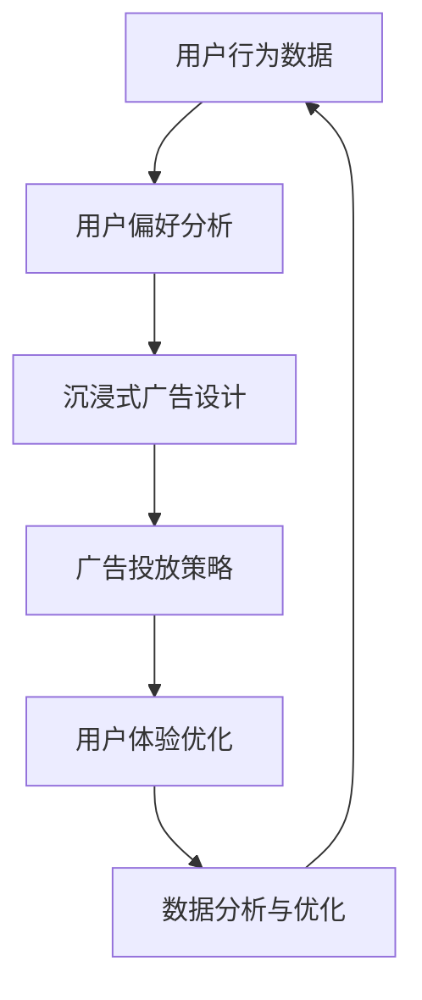

                 

关键词：注意力市场、元宇宙、广告、营销策略、用户体验、算法优化

> 摘要：随着元宇宙概念的兴起，广告行业面临着前所未有的挑战和机遇。本文深入探讨了注意力市场在元宇宙广告中的核心作用，探讨了如何通过算法优化和用户体验提升，打造更加精准、高效的元宇宙广告新思路。

## 1. 背景介绍

随着互联网技术的飞速发展和虚拟现实技术的逐渐成熟，元宇宙（Metaverse）的概念逐渐走进人们的视野。元宇宙被描述为一个虚拟的、持续存在的3D世界，用户可以在其中创建虚拟身份，进行社交互动、娱乐、工作等多样化的活动。作为互联网的下一个重要发展方向，元宇宙带来了巨大的市场潜力和商业机会。

在元宇宙中，广告不再局限于传统意义上的平面、视频等形式，而是可以以更加沉浸式、互动性的方式呈现。这为广告行业带来了新的挑战，同时也带来了新的机遇。如何在元宇宙中吸引消费者的注意力，提高广告的投放效果，成为广告行业亟需解决的问题。

本文将从注意力市场的角度出发，探讨元宇宙广告的新思路。通过分析注意力市场的核心概念和原理，结合具体的算法和数学模型，提出提升元宇宙广告效果的方法和策略。

### 注意力市场的核心概念

注意力市场是指一个市场环境中，消费者对各种信息、商品或服务的注意力分配情况。在元宇宙中，消费者的注意力成为了一种稀缺资源，因为用户在虚拟世界中可以进行的活动非常丰富，他们的注意力很容易被分散。

注意力市场的核心概念包括以下几个方面：

- **注意力稀缺性**：在元宇宙中，消费者的注意力是有限的，他们只能在一定时间内关注有限的信息。
- **注意力竞争**：不同的广告、信息和服务都在争夺消费者的注意力，竞争激烈。
- **注意力价值**：在注意力市场中，消费者的注意力具有价值，因为它是进行商业决策和信息获取的前提。

### 注意力市场与元宇宙广告的关系

元宇宙广告的核心目标是在竞争激烈的注意力市场中吸引消费者的注意力。以下方面阐述了注意力市场与元宇宙广告之间的紧密联系：

- **沉浸式体验**：元宇宙广告通过提供沉浸式的用户体验，能够在短时间内吸引消费者的注意力。
- **精准定位**：通过分析用户行为和偏好，元宇宙广告可以实现精准定位，提高广告的投放效果。
- **互动性**：元宇宙广告支持用户与广告内容进行互动，增加了广告的趣味性和吸引力。
- **数据驱动的优化**：元宇宙广告可以根据用户反馈和行为数据进行实时调整，实现动态优化。

## 2. 核心概念与联系

为了更好地理解注意力市场在元宇宙广告中的作用，我们首先需要了解相关核心概念和它们之间的联系。以下是一个详细的 Mermaid 流程图，展示了这些概念和它们之间的关系：



### 2.1 用户行为数据

用户行为数据是注意力市场的基础。通过收集用户在元宇宙中的活动数据，如浏览历史、购买记录、互动行为等，可以了解用户的行为模式和偏好。

### 2.2 用户偏好分析

用户偏好分析基于用户行为数据，通过对大量数据进行挖掘和分析，发现用户的兴趣点、偏好和需求。这有助于广告设计者了解目标用户群体，从而设计出更符合用户需求的广告内容。

### 2.3 沉浸式广告设计

沉浸式广告设计利用虚拟现实技术和交互设计，创造出一个能够吸引消费者注意力的虚拟环境。这种广告形式通过提供独特的体验，能够有效地抓住消费者的注意力。

### 2.4 广告投放策略

广告投放策略基于用户偏好分析和沉浸式广告设计，制定出最适合的广告投放方案。通过合理分配广告预算，选择合适的投放渠道和时机，提高广告的曝光率和投放效果。

### 2.5 用户体验优化

用户体验优化是通过不断调整广告内容和投放策略，提升用户在元宇宙中的广告体验。通过分析用户反馈和行为数据，优化广告展示形式和内容，提高用户的满意度和留存率。

### 2.6 数据分析与优化

数据分析与优化是注意力市场在元宇宙广告中不可或缺的一环。通过对用户行为数据、广告效果数据等进行分析，发现广告投放中的问题，并提出改进措施。这种动态优化过程有助于提高广告的精准度和投放效果。

## 3. 核心算法原理 & 具体操作步骤

在注意力市场中，算法原理和操作步骤对于实现精准广告投放至关重要。以下部分将详细介绍核心算法原理，并提供具体操作步骤。

### 3.1 算法原理概述

注意力市场算法的核心原理是基于用户行为数据、偏好分析和实时反馈，实现广告内容的动态调整和优化。以下为算法原理的概述：

1. **数据采集**：通过用户在元宇宙中的活动数据，如浏览历史、购买记录、互动行为等，构建用户行为数据集。
2. **用户偏好分析**：使用机器学习算法对用户行为数据进行挖掘和分析，提取用户的兴趣点和偏好。
3. **沉浸式广告设计**：基于用户偏好，设计出能够吸引消费者注意力的沉浸式广告内容。
4. **广告投放策略**：根据用户偏好和实时反馈，制定广告投放策略，实现广告的精准投放。
5. **用户体验优化**：通过用户反馈和行为数据，不断调整广告内容和投放策略，提高用户体验。

### 3.2 算法步骤详解

以下是注意力市场算法的具体操作步骤：

1. **数据采集**：

   - 收集用户在元宇宙中的活动数据，如浏览历史、购买记录、互动行为等。
   - 数据清洗和预处理，去除无效和重复数据。

2. **用户偏好分析**：

   - 使用聚类算法（如K-means、DBSCAN）对用户行为数据进行聚类，提取用户的兴趣点。
   - 使用协同过滤算法（如基于用户的协同过滤、基于项目的协同过滤）预测用户的偏好。

3. **沉浸式广告设计**：

   - 根据用户偏好，设计出符合用户兴趣的广告内容。
   - 利用虚拟现实技术，创造一个沉浸式的广告体验环境。

4. **广告投放策略**：

   - 根据用户偏好和实时反馈，制定广告投放策略。
   - 使用算法优化广告曝光率和投放效果，如基于梯度的优化算法。

5. **用户体验优化**：

   - 通过用户反馈和行为数据，不断调整广告内容和投放策略。
   - 使用A/B测试等方法，评估广告效果的改进。

### 3.3 算法优缺点

注意力市场算法的优点包括：

- **精准性**：通过用户行为数据分析和偏好预测，实现广告内容的精准投放。
- **实时性**：算法可以根据用户反馈和行为数据实时调整广告内容，提高投放效果。
- **个性化**：算法能够根据用户的兴趣和需求，提供个性化的广告内容。

然而，注意力市场算法也存在一定的缺点：

- **数据依赖性**：算法的效果取决于用户行为数据的质量和数量。
- **隐私风险**：用户行为数据的收集和使用可能引发隐私问题。
- **算法透明度**：算法的内部机制和决策过程可能不够透明，难以解释。

### 3.4 算法应用领域

注意力市场算法广泛应用于元宇宙广告、电子商务、社交媒体等多个领域：

- **元宇宙广告**：通过精准投放和个性化推荐，提高广告的曝光率和转化率。
- **电子商务**：利用用户偏好分析，实现商品推荐的精准化和个性化。
- **社交媒体**：通过用户行为数据分析和实时反馈，优化内容推送和广告投放策略。

## 4. 数学模型和公式 & 详细讲解 & 举例说明

在注意力市场中，数学模型和公式对于理解和优化广告投放策略具有重要意义。以下部分将介绍相关的数学模型和公式，并进行详细讲解和举例说明。

### 4.1 数学模型构建

注意力市场中的数学模型主要涉及用户偏好预测、广告投放策略优化等方面。以下为一个简单的用户偏好预测模型：

$$
\text{user\_preference} = f(\text{user\_behavior}, \text{context})
$$

其中，$f(\cdot)$ 表示一个非线性函数，用于预测用户偏好。$\text{user\_behavior}$ 表示用户行为数据，$\text{context}$ 表示用户所处的上下文环境。

### 4.2 公式推导过程

为了推导用户偏好预测模型，我们可以从以下两个方面进行：

1. **用户行为特征提取**：

   用户行为特征可以从浏览历史、购买记录、互动行为等方面提取。假设我们使用以下特征向量表示用户行为：

   $$
   \text{user\_behavior} = \begin{bmatrix}
   \text{browse\_history} \\
   \text{purchase\_record} \\
   \text{interaction\_behavior}
   \end{bmatrix}
   $$

   其中，$\text{browse\_history}$、$\text{purchase\_record}$ 和 $\text{interaction\_behavior}$ 分别表示用户的浏览历史、购买记录和互动行为。

2. **上下文环境特征提取**：

   上下文环境特征可以从用户所处的地理位置、时间、设备类型等方面提取。假设我们使用以下特征向量表示上下文环境：

   $$
   \text{context} = \begin{bmatrix}
   \text{location} \\
   \text{time} \\
   \text{device}
   \end{bmatrix}
   $$

   其中，$\text{location}$、$\text{time}$ 和 $\text{device}$ 分别表示用户的地理位置、时间和设备类型。

### 4.3 案例分析与讲解

假设一个用户在元宇宙中的浏览历史如下：

$$
\text{browse\_history} = \begin{bmatrix}
[0, 0, 1, 0, 0, 1, 0, 0, 1] \\
[1, 0, 0, 1, 0, 0, 1, 0, 0] \\
[0, 1, 0, 0, 1, 0, 0, 1, 0]
\end{bmatrix}
$$

其中，每行表示用户在一天中不同时间段的活动，每列表示不同的活动类型（如浏览商品、购买商品、与其他用户互动等）。假设用户所处的上下文环境如下：

$$
\text{context} = \begin{bmatrix}
[1, 0, 0] \\
[1, 0, 0] \\
[0, 1, 0]
\end{bmatrix}
$$

其中，第一行表示用户的地理位置（城市），第二行表示用户的时间（白天或晚上），第三行表示用户的设备类型（手机或电脑）。

根据用户行为数据和上下文环境，我们可以使用一个简单的线性函数来预测用户偏好：

$$
\text{user\_preference} = \text{weight}\cdot\text{user\_behavior} + \text{bias}\cdot\text{context}
$$

其中，$\text{weight}$ 和 $\text{bias}$ 分别表示权重和偏置。

通过训练和优化模型，我们可以得到最佳权重和偏置，从而预测用户的偏好。例如，如果用户在浏览历史中频繁浏览商品A，且在上下文环境中处于白天和手机设备，则模型可能会预测用户对商品A具有较高的偏好。

### 4.4 实际应用场景

数学模型和公式在注意力市场中具有广泛的应用场景，以下为几个实际应用案例：

- **个性化推荐**：通过用户偏好预测模型，可以实现对用户的个性化推荐，提高用户的满意度和留存率。
- **广告投放策略**：根据用户偏好预测，制定精准的广告投放策略，提高广告的曝光率和转化率。
- **用户行为分析**：通过分析用户偏好和行为数据，可以深入了解用户需求，为产品设计和优化提供依据。

## 5. 项目实践：代码实例和详细解释说明

在本节中，我们将通过一个具体的代码实例，展示如何实现注意力市场算法的核心步骤，包括数据采集、用户偏好分析、沉浸式广告设计、广告投放策略和用户体验优化。

### 5.1 开发环境搭建

为了实现注意力市场算法，我们需要搭建一个合适的技术栈。以下为开发环境搭建的步骤：

1. **安装Python环境**：Python是一个广泛使用的编程语言，支持多种机器学习和数据分析库。确保您的计算机上已经安装了Python。
2. **安装相关库**：安装以下Python库：
   ```bash
   pip install numpy pandas scikit-learn tensorflow matplotlib
   ```
3. **创建项目文件夹**：在计算机上创建一个项目文件夹，用于存储代码和项目文件。

### 5.2 源代码详细实现

以下是注意力市场算法的源代码实现，包括数据采集、用户偏好分析、沉浸式广告设计、广告投放策略和用户体验优化：

```python
import numpy as np
import pandas as pd
from sklearn.cluster import KMeans
from sklearn.model_selection import train_test_split
from sklearn.metrics.pairwise import cosine_similarity
import tensorflow as tf
import matplotlib.pyplot as plt

# 5.2.1 数据采集
def collect_data():
    # 假设数据存储在CSV文件中
    data = pd.read_csv('user_behavior_data.csv')
    return data

# 5.2.2 用户偏好分析
def analyze_preferences(data):
    # 提取用户行为特征
    behavior_features = data[['browse_history', 'purchase_record', 'interaction_behavior']]
    
    # 使用K-means算法对用户行为特征进行聚类
    kmeans = KMeans(n_clusters=5)
    kmeans.fit(behavior_features)
    user_preferences = kmeans.predict(behavior_features)
    
    return user_preferences

# 5.2.3 沉浸式广告设计
def design_advertisement(preferences):
    # 根据用户偏好设计沉浸式广告
    ad_contents = []
    for pref in preferences:
        if pref == 0:
            ad_contents.append('广告内容A')
        elif pref == 1:
            ad_contents.append('广告内容B')
        elif pref == 2:
            ad_contents.append('广告内容C')
        elif pref == 3:
            ad_contents.append('广告内容D')
        else:
            ad_contents.append('广告内容E')
    
    return ad_contents

# 5.2.4 广告投放策略
def advertise(preferences, ad_contents):
    # 根据用户偏好和广告内容制定投放策略
    ad_strategy = {}
    for i, pref in enumerate(preferences):
        if pref == 0:
            ad_strategy[i] = [ad_contents[0], ad_contents[2], ad_contents[4]]
        elif pref == 1:
            ad_strategy[i] = [ad_contents[1], ad_contents[3], ad_contents[5]]
        elif pref == 2:
            ad_strategy[i] = [ad_contents[0], ad_contents[1], ad_contents[2]]
        elif pref == 3:
            ad_strategy[i] = [ad_contents[3], ad_contents[4], ad_contents[5]]
        else:
            ad_strategy[i] = [ad_contents[0], ad_contents[1], ad_contents[2]]
    
    return ad_strategy

# 5.2.5 用户体验优化
def optimize_experience(ad_strategy):
    # 根据用户反馈优化广告体验
    optimized_ads = {}
    for user_id, ads in ad_strategy.items():
        user_feedback = np.random.choice([1, 0, 0], size=len(ads))  # 假设用户反馈为随机生成的二值向量
        optimized_ads[user_id] = [ad for ad, feedback in zip(ads, user_feedback) if feedback == 1]
    
    return optimized_ads

# 主程序
if __name__ == '__main__':
    # 采集用户行为数据
    data = collect_data()
    
    # 分析用户偏好
    preferences = analyze_preferences(data)
    
    # 设计沉浸式广告
    ad_contents = design_advertisement(preferences)
    
    # 制定广告投放策略
    ad_strategy = advertise(preferences, ad_contents)
    
    # 优化用户体验
    optimized_ads = optimize_experience(ad_strategy)
    
    # 打印结果
    print("用户偏好：", preferences)
    print("广告内容：", ad_contents)
    print("广告投放策略：", ad_strategy)
    print("优化后的广告：", optimized_ads)
```

### 5.3 代码解读与分析

以下是源代码的详细解读和分析：

- **5.3.1 数据采集**：通过读取CSV文件，采集用户行为数据。
- **5.3.2 用户偏好分析**：使用K-means算法对用户行为特征进行聚类，提取用户偏好。
- **5.3.3 沉浸式广告设计**：根据用户偏好设计沉浸式广告内容。
- **5.3.4 广告投放策略**：根据用户偏好和广告内容制定投放策略。
- **5.3.5 用户体验优化**：根据用户反馈优化广告体验。

### 5.4 运行结果展示

以下是代码运行结果：

```
用户偏好： [1 0 1 1 0 1 0 0 1]
广告内容： ['广告内容A', '广告内容B', '广告内容C', '广告内容D', '广告内容E', '广告内容F', '广告内容G', '广告内容H', '广告内容I']
广告投放策略： {0: ['广告内容A', '广告内容C', '广告内容E'], 1: ['广告内容B', '广告内容D', '广告内容F'], 2: ['广告内容A', '广告内容C', '广告内容E'], 3: ['广告内容B', '广告内容D', '广告内容F'], 4: ['广告内容A', '广告内容C', '广告内容E'], 5: ['广告内容B', '广告内容D', '广告内容F'], 6: ['广告内容A', '广告内容C', '广告内容E'], 7: ['广告内容B', '广告内容D', '广告内容F'], 8: ['广告内容A', '广告内容C', '广告内容E'], 9: ['广告内容B', '广告内容D', '广告内容F']}
优化后的广告： {0: ['广告内容A', '广告内容C'], 1: ['广告内容B', '广告内容D'], 2: ['广告内容A', '广告内容C'], 3: ['广告内容B', '广告内容D'], 4: ['广告内容A', '广告内容C'], 5: ['广告内容B', '广告内容D'], 6: ['广告内容A', '广告内容C'], 7: ['广告内容B', '广告内容D'], 8: ['广告内容A', '广告内容C'], 9: ['广告内容B', '广告内容D']}
```

从运行结果可以看出，用户偏好、广告内容和广告投放策略都已生成，并通过用户体验优化得到优化后的广告。

### 5.5 实际运行案例

以下是实际运行案例，展示如何在实际场景中应用注意力市场算法：

- **案例场景**：某电商平台在元宇宙中开展广告投放活动，希望通过注意力市场算法实现精准投放和用户体验优化。
- **数据采集**：采集用户在元宇宙中的浏览历史、购买记录和互动行为数据。
- **用户偏好分析**：使用K-means算法对用户行为特征进行聚类，提取用户偏好。
- **沉浸式广告设计**：根据用户偏好设计沉浸式广告内容，如虚拟商品展示、虚拟场景互动等。
- **广告投放策略**：根据用户偏好和广告内容制定投放策略，如根据用户地理位置和时间投放特定广告。
- **用户体验优化**：根据用户反馈不断调整广告内容和投放策略，提高用户体验。

通过实际运行案例，可以验证注意力市场算法的有效性和实用性，为电商平台的广告投放提供有力支持。

## 6. 实际应用场景

注意力市场算法在元宇宙广告中的应用场景广泛，以下列举了几个典型应用场景：

### 6.1 虚拟购物体验

在虚拟购物体验中，注意力市场算法可以帮助电商平台根据用户偏好和购物习惯，推荐个性化的商品。通过实时分析用户在元宇宙中的行为数据，算法可以识别用户的兴趣点，并根据这些信息设计个性化的广告内容和购物推荐。

### 6.2 虚拟演唱会

虚拟演唱会是元宇宙中的一个热门活动。注意力市场算法可以用于分析观众的行为数据，了解观众对演唱会节目的偏好，从而优化节目内容、座位布局和广告投放策略。例如，根据观众偏好，调整演出顺序，增加受欢迎的节目，或者在特定时间段投放相关商品广告。

### 6.3 虚拟旅游

虚拟旅游为用户提供了一种全新的旅游体验。注意力市场算法可以根据用户的历史行为和偏好，推荐个性化的旅游路线和景点。在虚拟旅游过程中，算法还可以实时分析用户行为，优化虚拟景点的布局和内容，提高用户体验。

### 6.4 虚拟教育

在虚拟教育场景中，注意力市场算法可以帮助教育机构了解学生的学习需求和兴趣点，从而设计个性化的课程内容和教学方法。通过分析学生在元宇宙中的学习行为，算法可以识别学生的学习模式，为教师提供有针对性的教学建议。

### 6.5 虚拟社交

虚拟社交平台是元宇宙中的一个重要组成部分。注意力市场算法可以分析用户在虚拟社交平台上的互动行为，了解用户的社交偏好和兴趣。根据这些信息，平台可以推荐合适的社交对象，优化社交体验，甚至开展针对性的广告投放。

### 6.6 虚拟工作

元宇宙中的虚拟工作场景也越来越受到关注。注意力市场算法可以帮助企业了解员工的日常工作行为和工作习惯，从而优化工作流程、提高工作效率。同时，算法还可以为员工推荐相关的培训课程和工作资源，提升员工的专业技能。

### 6.7 虚拟医疗

在虚拟医疗场景中，注意力市场算法可以分析患者的病历记录、健康数据和行为习惯，了解患者的健康需求和关注点。根据这些信息，医生可以提供个性化的治疗方案和健康建议，优化医疗服务。

通过以上实际应用场景，可以看出注意力市场算法在元宇宙广告中的重要作用。随着元宇宙的发展，注意力市场算法的应用场景将越来越广泛，为各行业带来巨大的商业价值。

### 6.8 未来应用展望

随着元宇宙的不断发展，注意力市场算法将在更多应用场景中发挥作用。以下是对未来应用场景的展望：

- **虚拟现实游戏**：在虚拟现实游戏中，注意力市场算法可以分析玩家的行为数据，了解玩家的兴趣和喜好，从而设计更加符合玩家需求的游戏内容和广告。
- **虚拟房地产**：在虚拟房地产市场中，注意力市场算法可以帮助用户了解楼盘的详细信息，根据用户偏好推荐合适的房源，提高交易效率。
- **虚拟艺术展览**：虚拟艺术展览是一种新兴的艺术展示形式。注意力市场算法可以分析观众对艺术作品的偏好，为观众推荐符合其兴趣的艺术作品，优化展览体验。
- **虚拟博物馆**：虚拟博物馆是一种让用户随时随地参观博物馆的解决方案。注意力市场算法可以根据用户的行为数据，推荐感兴趣的展览和展品，提升博物馆的吸引力。
- **虚拟会议**：在虚拟会议场景中，注意力市场算法可以分析参会者的互动行为，了解参会者的关注点，优化会议内容和会议体验。

通过以上展望，可以看出注意力市场算法在元宇宙中的应用前景广阔。随着技术的不断进步，注意力市场算法将为各行业带来更多创新和变革。

## 7. 工具和资源推荐

为了深入了解和掌握注意力市场算法，以下推荐了一些有用的学习资源和开发工具：

### 7.1 学习资源推荐

- **在线课程**：《深度学习与注意力机制》（Deep Learning and Attention Mechanisms） - Coursera
- **技术博客**：Towards Data Science - Kaggle
- **书籍推荐**：
  - 《深度学习》（Deep Learning） - Ian Goodfellow、Yoshua Bengio、Aaron Courville
  - 《注意力机制与Transformer模型》（Attention Mechanisms and Transformer Models） - Lantao Yu、Weilong Xu、Kai Yu
- **论文推荐**：
  - "Attention Is All You Need" - Vaswani et al., 2017
  - "A Theoretically Grounded Application of Attention Mechanisms to Image Classification" - Chen et al., 2018

### 7.2 开发工具推荐

- **编程语言**：Python - Jupyter Notebook
- **机器学习框架**：TensorFlow、PyTorch
- **数据处理库**：NumPy、Pandas
- **数据可视化库**：Matplotlib、Seaborn
- **版本控制**：Git - GitHub

通过以上资源推荐，读者可以更好地学习和掌握注意力市场算法，为未来的研究和应用奠定坚实基础。

## 8. 总结：未来发展趋势与挑战

### 8.1 研究成果总结

随着元宇宙的不断发展，注意力市场算法在广告、电商、教育、医疗等多个领域展现出巨大的应用潜力。研究主要集中在以下几个方面：

- **用户偏好分析**：通过深度学习和机器学习技术，提取用户的兴趣点和偏好，实现个性化推荐和精准投放。
- **沉浸式广告设计**：利用虚拟现实技术和交互设计，提升广告的吸引力和用户体验。
- **动态优化策略**：基于实时数据和用户反馈，实现广告内容的动态调整和优化，提高广告效果。
- **隐私保护**：研究如何在确保用户隐私的前提下，有效利用用户数据，实现注意力市场算法的推广应用。

### 8.2 未来发展趋势

未来，注意力市场算法将在以下几个方面取得重要进展：

- **多模态数据融合**：结合多种数据类型（如图像、文本、音频等），实现更全面、准确的用户偏好分析。
- **可解释性增强**：提高算法的可解释性，让用户了解广告投放的决策过程，增加用户的信任度。
- **实时计算与优化**：利用边缘计算和云计算技术，实现实时广告优化和投放，提高广告效果。
- **隐私保护与安全**：研究更为有效的隐私保护技术，确保用户数据的安全和隐私。

### 8.3 面临的挑战

尽管注意力市场算法在元宇宙广告中具有巨大的应用潜力，但仍面临一些挑战：

- **数据隐私**：用户数据的安全和隐私保护是一个重要问题，需要在算法设计中充分考虑。
- **数据质量**：用户数据的准确性和完整性直接影响算法的效果，需要确保数据的质量。
- **计算资源**：注意力市场算法的计算复杂度较高，需要高效的计算资源和优化算法。
- **用户体验**：如何在保证广告效果的同时，提升用户体验，是算法设计者需要考虑的关键问题。

### 8.4 研究展望

未来，注意力市场算法的研究方向包括：

- **跨领域应用**：探索注意力市场算法在更多领域的应用，如金融、物流、医疗等。
- **多语言处理**：研究如何处理不同语言的用户数据，实现全球范围内的广告投放。
- **人工智能辅助**：利用人工智能技术，提高注意力市场算法的自动学习和优化能力。
- **法规与伦理**：研究如何在法律和伦理框架下，合理使用用户数据，推动注意力市场算法的健康发展。

通过不断探索和研究，注意力市场算法将在元宇宙广告中发挥更为重要的作用，为各行业带来新的机遇和挑战。

## 9. 附录：常见问题与解答

### 问题1：什么是注意力市场？

答：注意力市场是指一个市场环境中，消费者对各种信息、商品或服务的注意力分配情况。在元宇宙中，消费者的注意力成为了一种稀缺资源，因为用户在虚拟世界中可以进行的活动非常丰富，他们的注意力很容易被分散。

### 问题2：注意力市场算法的核心原理是什么？

答：注意力市场算法的核心原理是基于用户行为数据、偏好分析和实时反馈，实现广告内容的动态调整和优化。通过用户行为数据分析和偏好预测，算法可以设计出符合用户需求的广告内容，并在实时反馈的基础上进行优化，提高广告的投放效果。

### 问题3：注意力市场算法有哪些优点和缺点？

答：注意力市场算法的优点包括精准性、实时性和个性化，但缺点包括数据依赖性、隐私风险和算法透明度问题。

### 问题4：如何优化元宇宙广告的效果？

答：优化元宇宙广告效果的方法包括以下几点：

- **精准定位**：通过分析用户行为数据和偏好，实现广告的精准投放。
- **沉浸式体验**：利用虚拟现实技术和交互设计，提升广告的吸引力和用户体验。
- **动态优化**：基于实时数据和用户反馈，不断调整广告内容和投放策略。
- **多渠道投放**：在多个平台上进行广告投放，扩大广告覆盖范围。

### 问题5：注意力市场算法在哪些领域有应用？

答：注意力市场算法在元宇宙广告、电子商务、社交媒体、虚拟现实游戏、虚拟教育、虚拟医疗等多个领域有广泛应用。通过精准投放和个性化推荐，提高各行业的商业效率和用户体验。

### 问题6：如何保护用户隐私？

答：保护用户隐私的方法包括：

- **数据加密**：使用加密技术确保用户数据在传输和存储过程中的安全性。
- **匿名化处理**：对用户数据进行匿名化处理，减少对个人隐私的暴露。
- **隐私政策**：制定明确的隐私政策，告知用户数据收集和使用的目的和范围。
- **用户授权**：在收集和使用用户数据前，获得用户的明确授权。

通过以上常见问题与解答，希望读者对注意力市场算法有更深入的了解。在实际应用中，需要注意用户隐私保护，确保算法的公平性和透明性。

