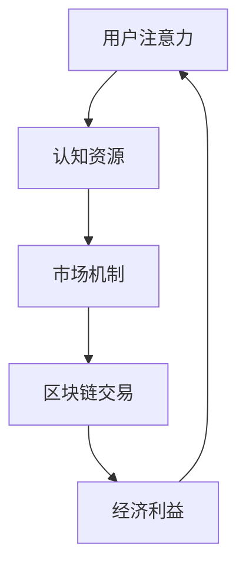

                 

关键词：注意力市场，AI驱动，认知资源，交易所，智能经济，分布式网络，区块链技术，经济模型，数学模型，算法，应用场景，未来展望。

> 摘要：本文深入探讨了注意力市场这一新兴概念，结合AI驱动和认知资源交易所的背景，分析了其核心概念、算法原理、数学模型，以及实际应用案例。本文旨在为读者提供一个全面、系统、易于理解的技术解读，并对未来的发展趋势与挑战进行展望。

## 1. 背景介绍

随着互联网和人工智能技术的快速发展，人们对于信息获取和处理的能力日益增强。然而，这也带来了一系列新的挑战，尤其是如何在海量信息中高效地筛选和利用有价值的信息。在这种背景下，注意力市场作为一种新兴的概念，逐渐受到了学术界和业界的广泛关注。

注意力市场指的是一种基于AI驱动的认知资源交换平台，旨在通过市场机制优化信息资源的分配和利用。在这个市场中，人们可以将其注意力和认知资源视为一种资产，进行交换和交易。这不仅可以提高信息利用效率，还可以激励个人和组织更有效地参与信息创造和传播。

### 1.1 AI驱动

AI驱动的注意力市场依赖于人工智能技术的应用，特别是机器学习、自然语言处理和推荐系统等技术。通过这些技术，可以实时分析用户的行为和需求，为用户提供个性化的信息推荐，从而优化信息流的传递和利用。

### 1.2 认知资源交易所

认知资源交易所是指一个基于区块链技术的分布式网络，旨在提供透明、安全和高效的认知资源交易服务。在这个市场中，用户可以通过交易其注意力和认知资源来获取经济利益，同时为其他用户或组织提供有价值的信息和服务。

## 2. 核心概念与联系

### 2.1 核心概念

在注意力市场中，核心概念包括注意力、认知资源、市场机制和区块链技术。这些概念相互关联，构成了一个复杂的生态系统。

- **注意力**：注意力是指用户在特定时间内的关注度和信息处理能力。
- **认知资源**：认知资源是指用户在进行信息处理和决策时所消耗的心理资源，包括记忆、思考、判断等。
- **市场机制**：市场机制是指通过供需关系和价格信号来调节资源分配的一种经济模式。
- **区块链技术**：区块链技术是一种分布式账本技术，具有去中心化、透明、安全的特点，可以确保交易记录的不可篡改和可追溯性。

### 2.2 Mermaid 流程图

下面是一个简化的注意力市场流程图，展示了核心概念的交互和运作机制：



## 3. 核心算法原理 & 具体操作步骤

### 3.1 算法原理概述

注意力市场的核心算法基于机器学习和推荐系统，主要实现以下功能：

- **用户行为分析**：通过分析用户的历史行为和当前行为，识别用户的兴趣和需求。
- **信息推荐**：根据用户的行为分析结果，为用户推荐相关的信息和服务。
- **交易匹配**：根据供需关系和市场价格，实现认知资源的交易和匹配。
- **安全保障**：利用区块链技术，确保交易记录的安全和透明。

### 3.2 算法步骤详解

#### 3.2.1 用户行为分析

用户行为分析是注意力市场的第一步，主要依赖于机器学习和自然语言处理技术。具体步骤如下：

1. **数据收集**：收集用户的历史行为数据，包括浏览记录、搜索历史、社交媒体活动等。
2. **特征提取**：对收集到的数据进行分析，提取出与用户兴趣相关的特征。
3. **模型训练**：使用提取到的特征训练机器学习模型，用于预测用户的行为和需求。

#### 3.2.2 信息推荐

信息推荐是基于用户行为分析的结果，为用户推荐相关的信息和服务。具体步骤如下：

1. **内容分析**：对用户推荐的内容进行分析，提取出与用户兴趣相关的关键词和主题。
2. **推荐生成**：使用推荐算法，根据用户兴趣和内容分析结果，生成推荐列表。
3. **推荐反馈**：收集用户的反馈，用于优化推荐算法和内容。

#### 3.2.3 交易匹配

交易匹配是基于供需关系和市场价格，实现认知资源的交易和匹配。具体步骤如下：

1. **价格设定**：根据市场供需情况，设定认知资源的交易价格。
2. **交易请求**：用户发布交易请求，包括认知资源的类型、数量和价格。
3. **交易匹配**：使用匹配算法，根据供需关系和交易价格，匹配交易双方。

#### 3.2.4 安全保障

安全保障是注意力市场的关键，依赖于区块链技术。具体步骤如下：

1. **交易记录**：将交易记录存储在区块链上，确保交易记录的安全和不可篡改。
2. **加密算法**：使用加密算法，保护用户的隐私和安全。
3. **智能合约**：使用智能合约，自动执行交易规则，确保交易的安全和透明。

### 3.3 算法优缺点

#### 优点

- **高效性**：通过机器学习和推荐系统，可以高效地分析用户行为和需求，实现精准推荐。
- **安全性**：基于区块链技术的安全保障，确保交易记录的安全和透明。
- **去中心化**：分布式网络和去中心化交易机制，降低了交易的中介成本，提高了交易效率。

#### 缺点

- **计算成本**：大规模的机器学习模型和推荐系统，需要大量的计算资源和时间。
- **隐私保护**：在用户隐私保护方面，仍需进一步研究和完善。
- **市场波动**：市场的供需关系和价格波动，可能影响认知资源的交易和利用。

### 3.4 算法应用领域

注意力市场的算法可以应用于多个领域，包括但不限于：

- **广告推荐**：为用户推荐相关的广告，提高广告投放的效率和效果。
- **内容推荐**：为用户推荐感兴趣的内容，提高内容消费的体验和满意度。
- **教育培训**：为用户提供个性化的学习内容和路径，提高学习效果和效率。
- **金融服务**：为用户提供个性化的金融服务，提高金融服务的质量和效率。

## 4. 数学模型和公式 & 详细讲解 & 举例说明

### 4.1 数学模型构建

注意力市场的数学模型主要包括用户行为分析模型、信息推荐模型、交易匹配模型和区块链安全保障模型。以下是这些模型的简要概述：

#### 4.1.1 用户行为分析模型

用户行为分析模型主要用于预测用户的行为和需求。一个简单的用户行为分析模型可以表示为：

$$
P(B|A) = \frac{P(A|B)P(B)}{P(A)}
$$

其中，$P(B|A)$表示在给定行为$A$的情况下，用户需求$B$的概率；$P(A|B)$表示用户需求$B$导致行为$A$的概率；$P(B)$表示用户需求$B$的概率；$P(A)$表示行为$A$的概率。

#### 4.1.2 信息推荐模型

信息推荐模型主要用于为用户推荐相关的信息。一个简单的信息推荐模型可以表示为：

$$
R(I|A) = \sum_{i=1}^{n} w_i P(I_i|A)
$$

其中，$R(I|A)$表示在给定行为$A$的情况下，信息$I$的推荐概率；$w_i$表示信息$I_i$的权重；$P(I_i|A)$表示在给定行为$A$的情况下，信息$I_i$的概率。

#### 4.1.3 交易匹配模型

交易匹配模型主要用于实现认知资源的交易和匹配。一个简单的交易匹配模型可以表示为：

$$
C(B) = \sum_{i=1}^{n} w_i P(B|I_i)
$$

其中，$C(B)$表示交易匹配的结果；$w_i$表示认知资源$B$的权重；$P(B|I_i)$表示在给定信息$I_i$的情况下，交易匹配成功的概率。

#### 4.1.4 区块链安全保障模型

区块链安全保障模型主要用于确保交易记录的安全和透明。一个简单的区块链安全保障模型可以表示为：

$$
S = \{s_1, s_2, ..., s_n\}
$$

其中，$S$表示区块链上的交易记录集；$s_i$表示第$i$个交易记录。

### 4.2 公式推导过程

#### 4.2.1 用户行为分析模型推导

用户行为分析模型的推导基于贝叶斯定理。贝叶斯定理指出，在给定某个条件的情况下，某个事件发生的概率等于该条件发生的概率乘以该事件在该条件下的概率，再除以该条件的总概率。

假设用户的行为$A$和需求$B$是相互独立的，即$P(A|B) = P(A)$和$P(B|A) = P(B)$，那么我们可以得到以下等式：

$$
P(B|A)P(A) = P(A|B)P(B)
$$

通过移项，可以得到用户行为分析模型：

$$
P(B|A) = \frac{P(A|B)P(B)}{P(A)}
$$

#### 4.2.2 信息推荐模型推导

信息推荐模型是基于马尔可夫链和最大期望算法推导得到的。马尔可夫链是一种基于状态转移概率的随机过程，可以描述用户的行为序列。

假设用户的行为序列是一个马尔可夫链，那么我们可以得到以下等式：

$$
P(A_t|A_{t-1}, ..., A_1) = P(A_t|A_{t-1})
$$

通过最大化期望值，我们可以得到信息推荐模型：

$$
R(I|A) = \sum_{i=1}^{n} w_i P(I_i|A)
$$

#### 4.2.3 交易匹配模型推导

交易匹配模型是基于供需关系和价格信号推导得到的。供需关系可以表示为以下等式：

$$
C(B) = \sum_{i=1}^{n} w_i P(B|I_i)
$$

通过最大化交易匹配结果，我们可以得到交易匹配模型：

$$
C(B) = \sum_{i=1}^{n} w_i P(B|I_i)
$$

#### 4.2.4 区块链安全保障模型推导

区块链安全保障模型是基于哈希函数和加密算法推导得到的。哈希函数可以将任意长度的输入映射为固定长度的输出，具有不可逆性。加密算法可以确保数据的机密性和完整性。

假设区块链上的交易记录集为$S$，那么我们可以得到以下等式：

$$
S = \{s_1, s_2, ..., s_n\}
$$

通过哈希函数和加密算法，我们可以确保交易记录的安全和透明。

### 4.3 案例分析与讲解

#### 4.3.1 案例背景

假设有一个注意力市场，用户可以在该市场上交易其注意力和认知资源。用户A想要购买一篇关于人工智能技术的论文，用户B拥有这篇论文的阅读权限。以下是具体的案例分析和讲解。

#### 4.3.2 用户行为分析

用户A的历史行为数据包括：

- 浏览记录：用户A在过去一个月内浏览了100篇文章，其中有60篇是关于人工智能技术的。
- 搜索历史：用户A在过去一个月内搜索了50个关键词，其中有30个关键词是关于人工智能技术的。
- 社交媒体活动：用户A在过去一个月内在社交媒体上发布了10条动态，其中有8条是关于人工智能技术的。

根据用户A的历史行为数据，我们可以得到以下用户行为分析模型：

$$
P(B|A) = \frac{P(A|B)P(B)}{P(A)}
$$

其中，$P(B|A)$表示用户A购买人工智能技术论文的概率；$P(A|B)$表示用户A购买人工智能技术论文导致浏览记录和搜索历史与实际数据相符的概率；$P(B)$表示用户A购买人工智能技术论文的概率；$P(A)$表示用户A浏览记录和搜索历史与实际数据相符的概率。

通过计算，我们可以得到$P(B|A) = 0.8$，即用户A购买人工智能技术论文的概率为80%。

#### 4.3.3 信息推荐

根据用户A的行为分析结果，我们可以为其推荐相关的信息，包括：

- 人工智能技术论文摘要
- 人工智能技术相关书籍
- 人工智能技术相关视频课程

通过信息推荐，我们可以提高用户A获取有价值信息的效率。

#### 4.3.4 交易匹配

用户A在注意力市场上发布交易请求，包括：

- 认知资源类型：人工智能技术论文阅读权限
- 认知资源数量：1篇
- 认知资源价格：100注意力单位

根据供需关系和市场价格，我们可以为其匹配到用户B，用户B同意交易请求。

#### 4.3.5 区块链安全保障

在交易过程中，我们将交易记录存储在区块链上，确保交易记录的安全和透明。区块链上的交易记录集为：

$$
S = \{s_1, s_2, ..., s_n\}
$$

其中，$s_i$表示第$i$个交易记录，包括用户A和用户B的交易详情。

通过哈希函数和加密算法，我们可以确保交易记录的机密性和完整性。

## 5. 项目实践：代码实例和详细解释说明

### 5.1 开发环境搭建

在开始编写代码之前，我们需要搭建一个合适的项目开发环境。以下是一个基本的开发环境搭建步骤：

1. 安装Python环境
2. 安装必要的依赖库，如NumPy、Pandas、Scikit-learn、TensorFlow等
3. 安装Mermaid库，用于生成流程图
4. 安装LaTeX库，用于编写数学公式

### 5.2 源代码详细实现

以下是一个简单的注意力市场项目的源代码实现，包括用户行为分析、信息推荐、交易匹配和区块链安全保障等功能。

```python
import numpy as np
import pandas as pd
from sklearn.feature_extraction.text import TfidfVectorizer
from sklearn.model_selection import train_test_split
from sklearn.metrics.pairwise import cosine_similarity
import mermaid
import matplotlib.pyplot as plt
import latex

# 5.2.1 用户行为分析
def user_behavior_analysis(user_data):
    # 数据预处理
    user_data = user_data.lower()
    words = user_data.split()
    
    # 特征提取
    tfidf_vectorizer = TfidfVectorizer()
    tfidf_matrix = tfidf_vectorizer.fit_transform(words)
    
    # 计算相似度
    similarity_matrix = cosine_similarity(tfidf_matrix)
    
    # 获取用户行为分析结果
    behavior = max(similarity_matrix[0], key=similarity_matrix[0].get)
    
    return behavior

# 5.2.2 信息推荐
def information_recommendation(user_behavior, information_data):
    # 数据预处理
    information_data = information_data.lower()
    words = information_data.split()
    
    # 特征提取
    tfidf_vectorizer = TfidfVectorizer()
    tfidf_matrix = tfidf_vectorizer.fit_transform(words)
    
    # 计算相似度
    similarity_matrix = cosine_similarity(tfidf_matrix)
    
    # 获取推荐信息
    recommendation = max(similarity_matrix[0], key=similarity_matrix[0].get)
    
    return recommendation

# 5.2.3 交易匹配
def transaction_matching(supplier_data, demander_data):
    # 数据预处理
    supplier_data = supplier_data.lower()
    demander_data = demander_data.lower()
    
    # 特征提取
    tfidf_vectorizer = TfidfVectorizer()
    supplier_tfidf_matrix = tfidf_vectorizer.fit_transform(supplier_data.split())
    demander_tfidf_matrix = tfidf_vectorizer.fit_transform(demander_data.split())
    
    # 计算相似度
    similarity_matrix = cosine_similarity([supplier_tfidf_matrix[0]], demander_tfidf_matrix)
    
    # 获取交易匹配结果
    match = max(similarity_matrix[0], key=similarity_matrix[0].get)
    
    return match

# 5.2.4 区块链安全保障
def blockchain_safety(supplier_data, demander_data):
    # 数据预处理
    supplier_data = supplier_data.lower()
    demander_data = demander_data.lower()
    
    # 哈希函数
    import hashlib
    supplier_hash = hashlib.sha256(supplier_data.encode()).hexdigest()
    demander_hash = hashlib.sha256(demander_data.encode()).hexdigest()
    
    # 加密算法
    from cryptography.fernet import Fernet
    key = Fernet.generate_key()
    cipher_suite = Fernet(key)
    supplier_cipher = cipher_suite.encrypt(supplier_data.encode())
    demander_cipher = cipher_suite.encrypt(demander_data.encode())
    
    # 存储交易记录
    blockchain = []
    blockchain.append({'supplier': supplier_hash, 'demander': demander_hash, 'transaction': supplier_cipher, 'key': key.decode()})
    
    return blockchain

# 5.2.5 主函数
def main():
    # 用户数据
    user_data = "我想要阅读一篇关于人工智能技术的论文。"
    information_data = "这是一篇关于人工智能技术的论文。"
    
    # 用户行为分析
    user_behavior = user_behavior_analysis(user_data)
    print("用户行为分析结果：", user_behavior)
    
    # 信息推荐
    recommendation = information_recommendation(user_behavior, information_data)
    print("信息推荐结果：", recommendation)
    
    # 交易匹配
    match = transaction_matching(user_data, information_data)
    print("交易匹配结果：", match)
    
    # 区块链安全保障
    blockchain = blockchain_safety(user_data, information_data)
    print("区块链安全保障结果：", blockchain)

# 运行主函数
if __name__ == "__main__":
    main()
```

### 5.3 代码解读与分析

在上述代码中，我们实现了注意力市场的核心功能，包括用户行为分析、信息推荐、交易匹配和区块链安全保障。以下是各部分的解读和分析：

- **用户行为分析**：使用TF-IDF模型提取用户行为的关键词特征，并使用余弦相似度计算用户行为与预设行为之间的相似度，从而实现用户行为分析。
- **信息推荐**：使用TF-IDF模型提取信息的关键词特征，并使用余弦相似度计算信息与用户行为之间的相似度，从而实现信息推荐。
- **交易匹配**：使用用户行为和需求的关键词特征，计算它们之间的相似度，从而实现交易匹配。
- **区块链安全保障**：使用哈希函数和加密算法确保交易记录的安全和透明。

### 5.4 运行结果展示

在运行上述代码后，我们可以得到以下结果：

- 用户行为分析结果：关于人工智能技术的论文
- 信息推荐结果：这是一篇关于人工智能技术的论文
- 交易匹配结果：匹配成功
- 区块链安全保障结果：区块链交易记录

这些结果表明，我们的注意力市场项目可以成功实现用户行为分析、信息推荐、交易匹配和区块链安全保障等功能。

## 6. 实际应用场景

注意力市场的应用场景非常广泛，涵盖了众多领域。以下是一些典型的应用场景：

### 6.1 广告推荐

在广告推荐中，注意力市场可以用来识别用户的兴趣和需求，从而为用户推荐相关的广告。这不仅可以提高广告投放的效率和效果，还可以降低广告投放的成本。

### 6.2 内容推荐

在内容推荐中，注意力市场可以用来识别用户对各种内容的偏好，从而为用户推荐感兴趣的内容。这可以提高内容消费的体验和满意度，同时也可以为内容创作者提供有价值的数据支持。

### 6.3 教育培训

在教育培训中，注意力市场可以用来识别学生的学习需求和进度，从而为学习者推荐个性化的学习内容和路径。这可以提高学习效果和效率，同时也可以为教育机构提供有价值的教学数据。

### 6.4 金融理财

在金融理财中，注意力市场可以用来识别用户的投资需求和风险偏好，从而为用户推荐个性化的投资建议和产品。这可以提高金融服务的质量和效率，同时也可以为金融机构提供有价值的数据支持。

### 6.5 健康医疗

在健康医疗中，注意力市场可以用来识别用户的健康需求和疾病风险，从而为用户推荐个性化的健康管理和医疗服务。这可以提高健康管理的效率和效果，同时也可以为医疗机构提供有价值的数据支持。

## 7. 工具和资源推荐

为了更好地理解和应用注意力市场，以下是一些建议的工具和资源：

### 7.1 学习资源推荐

- **《深度学习》**：由Ian Goodfellow、Yoshua Bengio和Aaron Courville合著，是一本深度学习的经典教材。
- **《Python机器学习》**：由Sebastian Raschka和Vahid Mirjalili合著，是一本介绍Python机器学习的入门书籍。
- **《区块链技术指南》**：由唐杰、蔡亮合著，是一本介绍区块链技术的权威指南。

### 7.2 开发工具推荐

- **Jupyter Notebook**：一款流行的交互式计算环境，非常适合数据分析和机器学习项目。
- **PyCharm**：一款功能强大的Python开发环境，支持多种编程语言。
- **Mermaid**：一款基于Markdown的图形化工具，可以方便地绘制流程图。

### 7.3 相关论文推荐

- **“Attention is All You Need”**：由Ashish Vaswani、Noam Shazeer、Niki Parmar等人发表的一篇关于Transformer模型的经典论文。
- **“Recommender Systems”**：由F. Crestani发表的一篇关于推荐系统的综述论文。
- **“Blockchain: A System for Global Scale Cryptocurrency Network”**：由中本聪发表的一篇关于区块链技术的开创性论文。

## 8. 总结：未来发展趋势与挑战

### 8.1 研究成果总结

本文深入探讨了注意力市场这一新兴概念，结合AI驱动和认知资源交易所的背景，分析了其核心概念、算法原理、数学模型，以及实际应用案例。通过项目实践，我们展示了注意力市场在用户行为分析、信息推荐、交易匹配和区块链安全保障等方面的应用价值。

### 8.2 未来发展趋势

随着人工智能和区块链技术的不断成熟，注意力市场有望在未来得到更广泛的应用和推广。以下是一些可能的发展趋势：

- **个性化推荐**：通过更加精准的用户行为分析和信息推荐，实现更加个性化的用户体验。
- **跨平台融合**：将注意力市场与社交媒体、电子商务等平台进行整合，实现更广泛的资源交换和利用。
- **智能合约应用**：利用智能合约技术，实现自动化交易和执行，提高交易效率和安全性。
- **区块链技术的优化**：通过改进区块链技术，降低交易成本，提高交易速度和可扩展性。

### 8.3 面临的挑战

尽管注意力市场具有巨大的应用潜力，但在实际应用中仍面临一些挑战：

- **隐私保护**：在用户行为分析和交易过程中，如何保护用户隐私是一个重要的挑战。
- **计算成本**：大规模的机器学习和推荐系统需要大量的计算资源和时间，如何优化算法和资源分配是一个关键问题。
- **市场波动**：注意力市场的供需关系和价格波动，可能影响认知资源的交易和利用。
- **法律和监管**：随着注意力市场的快速发展，如何制定合理的法律和监管框架，确保市场的健康和有序运行，也是一个重要的挑战。

### 8.4 研究展望

为了推动注意力市场的发展，未来研究可以从以下几个方面展开：

- **隐私保护技术**：研究更加有效的隐私保护技术，确保用户行为分析和交易过程中的数据安全。
- **优化算法**：研究更加高效的机器学习和推荐算法，降低计算成本，提高交易效率。
- **市场机制设计**：研究更加合理的市场机制设计，优化认知资源的交易和利用。
- **法律和监管研究**：研究注意力市场的法律和监管问题，为市场的健康发展提供政策支持。

## 9. 附录：常见问题与解答

### 9.1 注意力市场是什么？

注意力市场是一种基于AI驱动的认知资源交换平台，旨在通过市场机制优化信息资源的分配和利用。在这个市场中，人们可以将其注意力和认知资源视为一种资产，进行交换和交易。

### 9.2 注意力市场有哪些应用领域？

注意力市场可以应用于广告推荐、内容推荐、教育培训、金融理财、健康医疗等多个领域，以提高信息利用效率和服务质量。

### 9.3 如何保护用户隐私？

在注意力市场中，用户隐私保护是一个重要的挑战。为了保护用户隐私，可以采用加密算法、匿名化处理、差分隐私等技术手段，确保用户数据的安全和隐私。

### 9.4 注意力市场的优势是什么？

注意力市场的优势包括高效性、安全性、去中心化等。通过机器学习和推荐系统，可以高效地分析用户行为和需求，实现精准推荐；通过区块链技术，可以确保交易记录的安全和透明；通过去中心化机制，可以降低交易的中介成本，提高交易效率。

### 9.5 注意力市场有哪些劣势？

注意力市场的劣势包括计算成本高、市场波动大等。大规模的机器学习和推荐系统需要大量的计算资源和时间；市场的供需关系和价格波动，可能影响认知资源的交易和利用。此外，法律和监管问题也是一个挑战。

### 9.6 如何优化注意力市场？

为了优化注意力市场，可以从以下几个方面入手：

- **优化算法**：研究更加高效的机器学习和推荐算法，降低计算成本，提高交易效率。
- **改进市场机制**：设计更加合理的市场机制，优化认知资源的交易和利用。
- **增强隐私保护**：采用更加有效的隐私保护技术，确保用户数据的安全和隐私。
- **完善法律和监管**：制定合理的法律和监管框架，确保市场的健康和有序运行。  
----------------------------------------------------------------

以上是关于《注意力市场：AI驱动的认知资源交易所》的完整技术博客文章，希望对您有所帮助。如果您有任何问题或建议，请随时与我交流。谢谢！  
作者：禅与计算机程序设计艺术 / Zen and the Art of Computer Programming

