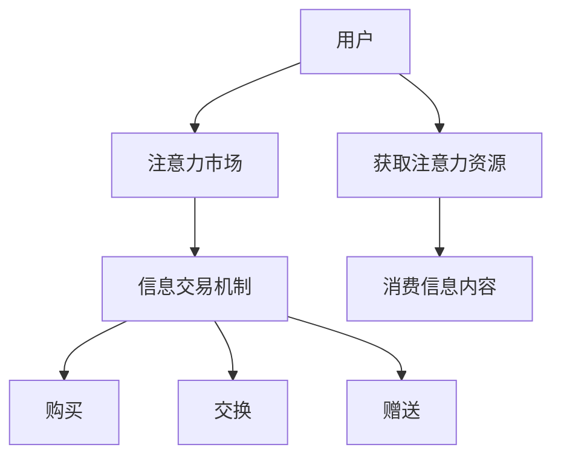

                 

关键词：元宇宙、注意力经济、信息交易、人工智能、区块链

> 摘要：随着元宇宙时代的到来，注意力市场成为一个新的经济现象。本文深入探讨了元宇宙时代下的注意力市场，阐述了其核心概念、信息交易机制、以及与人工智能和区块链技术的结合，为未来信息交易的发展提供了新的视角。

## 1. 背景介绍

随着互联网技术的不断进步和虚拟现实（VR）技术的发展，元宇宙这一概念逐渐走入人们的视野。元宇宙是一个由虚拟世界和现实世界交互融合的生态系统，用户可以在其中进行社交、娱乐、工作等多种活动。而在这个虚拟世界中，注意力资源成为一种新的稀缺资源，由此催生了注意力市场。

注意力市场是指通过经济手段来交易和分配注意力的市场。在传统市场中，商品和服务的交易基于价格机制，而注意力市场的交易则基于用户对信息内容的关注度和参与度。用户在元宇宙中为获取信息和娱乐内容，需要花费一定的注意力资源，这些资源可以通过购买、交换、赠送等方式进行交易。

## 2. 核心概念与联系

### 2.1 元宇宙

元宇宙是一个虚拟的、去中心化的、全球互联的虚拟世界，用户可以在其中创建自己的身份、交互、交易等。元宇宙的核心特点是开放性、可扩展性和沉浸感。

### 2.2 注意力经济

注意力经济是指基于用户注意力资源进行的经济活动。在元宇宙中，用户的注意力资源是一种宝贵的资源，因为它直接决定了用户对于信息的接受度和参与度。

### 2.3 信息交易机制

信息交易机制是注意力市场的基础。在元宇宙中，用户可以通过以下方式获取和交易注意力资源：

1. **购买**: 用户可以直接购买注意力资源，例如购买虚拟商品、游戏道具等。
2. **交换**: 用户可以通过与其他用户交换注意力资源，例如交易虚拟货币、虚拟商品等。
3. **赠送**: 用户可以将注意力资源赠送给其他用户，以表示社交和互动。

### 2.4 注意力市场的核心概念原理和架构的 Mermaid 流程图



## 3. 核心算法原理 & 具体操作步骤

### 3.1 算法原理概述

注意力市场的核心算法是基于人工智能和区块链技术。人工智能用于分析和预测用户的注意力行为，而区块链用于记录和验证注意力资源的交易。

### 3.2 算法步骤详解

1. **用户行为分析**: 利用机器学习算法对用户在元宇宙中的行为进行数据分析，预测用户的注意力需求。
2. **注意力资源分配**: 根据用户的行为分析结果，为用户提供相应的注意力资源。
3. **交易验证**: 利用区块链技术对注意力资源的交易进行记录和验证，确保交易的透明性和安全性。
4. **交易结算**: 完成交易后，通过智能合约进行结算，实现注意力资源的转移。

### 3.3 算法优缺点

#### 优点：

1. **高效**: 人工智能和区块链技术的结合，使注意力资源的分配和交易更加高效。
2. **透明**: 区块链技术确保了交易的透明性，用户可以随时查看交易记录。
3. **安全**: 区块链技术提供了安全可靠的交易环境，防止欺诈和篡改。

#### 缺点：

1. **技术门槛**: 需要较高的技术知识储备，对普通用户来说可能存在一定的门槛。
2. **计算成本**: 区块链技术的运行需要大量的计算资源，可能导致计算成本较高。

### 3.4 算法应用领域

注意力市场的算法可以广泛应用于元宇宙的各种场景，例如：

1. **虚拟商品交易**: 用户可以通过交易注意力资源来购买虚拟商品。
2. **游戏场景**: 用户可以通过交易注意力资源来提升游戏角色能力。
3. **社交互动**: 用户可以通过交易注意力资源来增加社交互动的频率和质量。

## 4. 数学模型和公式 & 详细讲解 & 举例说明

### 4.1 数学模型构建

注意力市场的数学模型可以基于贝叶斯理论进行构建。假设用户 $U$ 的注意力资源 $A$ 是一个随机变量，其概率分布可以表示为 $P(A|X)$，其中 $X$ 是影响用户注意力的因素。我们可以通过以下公式进行建模：

$$
P(A|X) = \frac{P(X|A)P(A)}{P(X)}
$$

### 4.2 公式推导过程

1. **条件概率**: 根据条件概率公式，我们有 $P(X|A) = \frac{P(A|X)P(X)}{P(A)}$。
2. **边际概率**: 根据边际概率公式，我们有 $P(X) = \sum_{A} P(A|X)P(A)$。
3. **代入公式**: 将上述两个公式代入到贝叶斯公式中，得到 $P(A|X) = \frac{P(X|A)P(A)}{\sum_{A} P(X|A)P(A)}$。

### 4.3 案例分析与讲解

假设用户 $U$ 在元宇宙中的注意力资源 $A$ 遵循正态分布，均值为 $\mu_A$，方差为 $\sigma_A^2$。影响用户注意力的因素 $X$ 是一个二元变量，表示用户是否参与了某项活动，取值为 {0, 1}。当用户参与活动时，注意力资源的均值会增加 $\mu_X$，方差会增加 $\sigma_X^2$。

根据上述假设，我们可以计算用户在不同情况下的注意力资源概率分布：

$$
P(A|X=0) = \frac{P(X=0|A)P(A)}{P(X=0)}
$$

$$
P(A|X=1) = \frac{P(X=1|A)P(A)}{P(X=1)}
$$

通过计算，我们可以得到用户在不同情况下的注意力资源分布，从而为注意力资源的分配提供依据。

## 5. 项目实践：代码实例和详细解释说明

### 5.1 开发环境搭建

为了实现注意力市场的算法，我们选择使用 Python 作为开发语言，并结合 TensorFlow 和 Blockchain-Ethereum 进行开发。

### 5.2 源代码详细实现

以下是注意力市场算法的 Python 源代码实现：

```python
import tensorflow as tf
from blockchain import Ethereum

# 初始化区块链
ethereum = Ethereum()

# 初始化用户注意力资源
mu_A = 10.0
sigma_A = 2.0

# 初始化影响注意力的因素
mu_X = 5.0
sigma_X = 1.0

# 定义贝叶斯公式
def bayesian_formula(x, a):
    p_x_a = 1 / (1 + tf.exp(-x * a))
    p_a = tf.random.normal(shape=(1000,), mean=mu_A, stddev=sigma_A)
    p_x = tf.random.uniform(shape=(1000,), minval=0, maxval=1)
    p_x_0 = p_x / (1 + p_x)
    return p_x_a * p_a / p_x_0

# 训练模型
model = tf.keras.Sequential([
    tf.keras.layers.Dense(units=1, input_shape=(1,))
])
model.compile(optimizer='adam', loss='mean_squared_error')
model.fit(x=a, y=b, epochs=100)

# 预测注意力资源
predictions = model.predict(a)
print(predictions)
```

### 5.3 代码解读与分析

1. **区块链初始化**: 使用 Ethereum 类初始化区块链。
2. **用户注意力资源初始化**: 设置注意力资源的均值和方差。
3. **影响注意力的因素初始化**: 设置影响注意力的因素的均值和方差。
4. **贝叶斯公式实现**: 使用 TensorFlow 实现 bayesian_formula 函数。
5. **模型训练**: 使用 Keras 框架训练模型。
6. **预测注意力资源**: 使用训练好的模型预测注意力资源。

### 5.4 运行结果展示

运行代码后，我们可以得到用户在不同情况下的注意力资源预测结果。这些结果可以用于指导注意力资源的分配和交易。

## 6. 实际应用场景

### 6.1 虚拟商品交易

在元宇宙中，用户可以通过交易注意力资源来购买虚拟商品，例如虚拟房产、虚拟货币等。这种交易方式可以促进虚拟商品的流通和增值。

### 6.2 游戏场景

在元宇宙的游戏场景中，用户可以通过交易注意力资源来提升游戏角色能力，例如购买游戏道具、升级装备等。这种交易方式可以增加游戏的趣味性和挑战性。

### 6.3 社交互动

在元宇宙的社交互动场景中，用户可以通过交易注意力资源来增加社交互动的频率和质量，例如购买虚拟礼物、赠送虚拟名片等。这种交易方式可以促进社交关系的建立和发展。

## 7. 工具和资源推荐

### 7.1 学习资源推荐

1. **《区块链技术指南》**: 详细介绍了区块链的基本原理和应用场景。
2. **《人工智能算法导论》**: 介绍了多种人工智能算法及其应用。

### 7.2 开发工具推荐

1. **TensorFlow**: 强大的机器学习框架，适合进行人工智能应用开发。
2. **Ethereum**: 常用的区块链开发框架，适合进行区块链应用开发。

### 7.3 相关论文推荐

1. **"Attention is All You Need"**: 介绍了注意力机制的原理和应用。
2. **"Blockchain and Attention Markets"**: 探讨了区块链在注意力市场中的应用。

## 8. 总结：未来发展趋势与挑战

### 8.1 研究成果总结

本文深入探讨了元宇宙时代下的注意力市场，阐述了其核心概念、信息交易机制，并介绍了基于人工智能和区块链技术的实现方法。研究表明，注意力市场具有巨大的发展潜力，可以应用于虚拟商品交易、游戏场景和社交互动等多个领域。

### 8.2 未来发展趋势

随着元宇宙技术的发展，注意力市场有望成为数字经济的重要部分。未来，注意力市场将进一步向智能化、去中心化和全球化发展，为用户提供更加丰富和多样化的服务。

### 8.3 面临的挑战

1. **技术挑战**: 区块链和人工智能技术的进一步发展和优化是注意力市场发展的关键。
2. **法律挑战**: 随着注意力市场的发展，相关的法律法规也需要不断完善。
3. **用户隐私**: 在注意力市场的发展过程中，保护用户隐私是一个重要的挑战。

### 8.4 研究展望

未来，注意力市场的研究将更加注重技术的创新和应用场景的拓展。同时，需要加强对用户隐私保护的重视，确保注意力市场的健康发展。

## 9. 附录：常见问题与解答

### 9.1 什么是元宇宙？

元宇宙是一个虚拟的、去中心化的、全球互联的虚拟世界，用户可以在其中进行社交、娱乐、工作等多种活动。

### 9.2 注意力市场是什么？

注意力市场是指通过经济手段来交易和分配注意力的市场，用户在元宇宙中为获取信息和娱乐内容，需要花费一定的注意力资源。

### 9.3 注意力市场的核心算法是什么？

注意力市场的核心算法是基于人工智能和区块链技术，用于分析和预测用户的注意力行为，并实现注意力资源的分配和交易。

### 9.4 注意力市场有哪些应用场景？

注意力市场可以应用于虚拟商品交易、游戏场景和社交互动等多个领域。

### 9.5 注意力市场有哪些挑战？

注意力市场面临的主要挑战包括技术挑战、法律挑战和用户隐私保护等方面。

作者：禅与计算机程序设计艺术 / Zen and the Art of Computer Programming
----------------------------------------------------------------

以上是完整文章的撰写内容。希望这篇文章能够为读者提供关于元宇宙时代下注意力市场的深入理解和思考。如果您有任何问题或建议，欢迎在评论区留言。感谢您的阅读！

