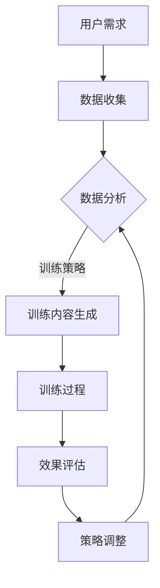

                 

关键词：注意力弹性，认知适应，AI辅助，认知训练，大脑健康，心理健康

> 摘要：本文探讨了注意力弹性的概念及其重要性，介绍了AI辅助的认知适应训练技术，并详细分析了其核心算法原理、数学模型、实践应用，以及未来的发展趋势与挑战。通过本文，读者将了解如何利用AI技术提高个人的认知能力，为大脑健康和心理健康提供科学指导。

## 1. 背景介绍

随着信息技术的飞速发展，人们的生活节奏不断加快，大脑处理信息的能力面临前所未有的挑战。注意力弹性（Attention Elasticity）作为一种重要的认知能力，它反映了个体在面临不同任务、环境变化时，调整和分配注意力的能力。良好的注意力弹性有助于提高学习效率、工作效率，对大脑健康和心理健康具有重要意义。

传统的认知训练方法主要依赖于心理学家和认知科学家的经验，训练内容相对单一，难以适应个体的多样化需求。随着人工智能（AI）技术的进步，AI辅助的认知适应训练逐渐成为研究热点。本文将介绍AI辅助的认知适应训练技术，探讨其核心算法原理、数学模型，并结合实际应用案例，分析其在未来大脑健康和心理健康领域的发展趋势与挑战。

## 2. 核心概念与联系

### 2.1 注意力弹性

注意力弹性是指个体在面临不同任务、环境变化时，能够灵活调整和分配注意力的能力。研究表明，注意力弹性与大脑可塑性密切相关，对个体认知能力的发展具有重要影响。

### 2.2 AI辅助认知适应训练

AI辅助认知适应训练是一种利用人工智能技术，根据个体需求和环境变化，动态调整训练内容和策略的方法。其核心目标是通过不断的认知训练，提高个体的注意力弹性，从而提升认知能力和心理健康水平。

### 2.3 Mermaid 流程图



### 2.4 核心概念与联系

注意力弹性作为个体认知能力的基础，是AI辅助认知适应训练的核心关注点。通过数据收集、数据分析、训练内容生成、训练过程、效果评估和策略调整等环节，AI辅助认知适应训练技术能够动态适应个体的需求和环境变化，提高注意力弹性，从而实现认知能力和心理健康水平的提升。

## 3. 核心算法原理 & 具体操作步骤

### 3.1 算法原理概述

AI辅助认知适应训练的核心算法是基于深度学习和强化学习的方法。深度学习用于构建训练模型，通过大量的训练数据学习个体注意力分配的特征；强化学习则用于优化训练策略，根据个体的反馈调整训练内容和难度，实现自适应训练。

### 3.2 算法步骤详解

#### 3.2.1 数据收集

数据收集是算法的基础，主要包括个体注意力分配的数据、心理测评数据、日常行为数据等。通过数据收集，算法能够获取个体的注意力弹性特征。

#### 3.2.2 数据分析

数据分析是对收集到的数据进行处理和分析，提取个体注意力分配的特征。常用的数据分析方法包括聚类分析、回归分析、因子分析等。

#### 3.2.3 训练内容生成

根据个体注意力弹性特征，算法生成适应个体的训练内容。训练内容主要包括注意力训练任务、认知任务、放松训练等。

#### 3.2.4 训练过程

训练过程是AI辅助认知适应训练的核心环节。算法根据个体的训练反馈，动态调整训练内容和难度，实现自适应训练。

#### 3.2.5 效果评估

效果评估是对个体认知能力和心理健康水平的评估。常用的评估方法包括心理测评、认知测试、问卷调查等。

#### 3.2.6 策略调整

根据效果评估的结果，算法调整训练策略，优化训练内容和难度，实现持续的训练效果提升。

### 3.3 算法优缺点

#### 优点

- **自适应性强**：算法能够根据个体需求和反馈动态调整训练内容和难度，实现个性化训练。
- **实时性**：算法能够实时评估个体认知能力和心理健康水平，及时调整训练策略。
- **多样化**：算法涵盖了多种注意力训练方法和认知任务，满足不同个体的需求。

#### 缺点

- **计算成本高**：深度学习和强化学习算法计算成本较高，对硬件资源有较高要求。
- **数据隐私问题**：数据收集和处理过程中，可能涉及用户隐私问题，需要严格保护用户隐私。

### 3.4 算法应用领域

AI辅助认知适应训练技术主要应用于以下领域：

- **大脑健康**：通过提高注意力弹性，预防认知障碍和神经系统疾病。
- **心理健康**：改善焦虑、抑郁等心理问题，提高生活质量。
- **教育领域**：提升学习效率，培养创新能力和批判性思维。
- **职业培训**：提高职场竞争力，培养专注力和决策能力。

## 4. 数学模型和公式 & 详细讲解 & 举例说明

### 4.1 数学模型构建

AI辅助认知适应训练的数学模型主要包括注意力分配模型和强化学习模型。

#### 注意力分配模型

注意力分配模型用于描述个体在面临不同任务时，如何分配注意力资源。常用的模型包括：

- **指数分配模型**：假设个体在面临多个任务时，注意力资源按照指数规律分配。

  $$ A_i = \frac{\alpha}{\sum_{j=1}^{n} \alpha e^{-\beta d_{ij}}} $$

  其中，$A_i$表示个体对任务$i$的注意力分配比例，$d_{ij}$表示任务$i$与任务$j$的相似度，$\alpha$和$\beta$是模型参数。

- **优异性分配模型**：假设个体在面临多个任务时，注意力资源按照任务优异性分配。

  $$ A_i = \frac{w_i}{\sum_{j=1}^{n} w_j} $$

  其中，$w_i$表示任务$i$的优异性权重。

#### 强化学习模型

强化学习模型用于优化训练策略，实现自适应训练。常用的模型包括：

- **Q-Learning**：通过评估不同策略的Q值，选择最优策略。

  $$ Q(s, a) = r + \gamma \max_{a'} Q(s', a') $$

  其中，$Q(s, a)$表示在状态$s$下采取动作$a$的预期回报，$r$是即时回报，$\gamma$是折扣因子。

- **Policy Gradients**：通过优化策略梯度，实现策略优化。

  $$ \nabla_{\theta} J(\theta) = \sum_{s, a} \nabla_{\theta} \log \pi_{\theta}(a|s) R(s, a) $$

  其中，$\theta$是策略参数，$\pi_{\theta}(a|s)$是策略概率分布，$R(s, a)$是奖励函数。

### 4.2 公式推导过程

#### 注意力分配模型推导

指数分配模型推导：

1. 假设个体面临$n$个任务，每个任务需要分配注意力资源。
2. 设每个任务的优异性权重为$w_i$，个体总注意力资源为$\alpha$。
3. 假设任务$i$与任务$j$的相似度为$d_{ij}$，相似度越高，任务越难分配注意力。
4. 设$\beta$为调节参数，控制注意力分配的敏感度。
5. 根据指数函数的性质，假设个体对任务$i$的注意力分配比例满足：

   $$ A_i = \frac{\alpha}{\sum_{j=1}^{n} \alpha e^{-\beta d_{ij}}} $$

#### 强化学习模型推导

Q-Learning推导：

1. 假设个体处于状态$s$，需要选择动作$a$。
2. 设当前状态下的即时回报为$r$，未来状态的预期回报为$R(s', a')$。
3. 假设学习率$\alpha$和折扣因子$\gamma$。
4. 根据预期回报最大化原则，有：

   $$ Q(s, a) = r + \gamma \max_{a'} Q(s', a') $$

Policy Gradients推导：

1. 假设策略参数为$\theta$，策略概率分布为$\pi_{\theta}(a|s)$。
2. 设奖励函数为$R(s, a)$，目标是最小化策略损失函数：

   $$ J(\theta) = -\sum_{s, a} \log \pi_{\theta}(a|s) R(s, a) $$

3. 根据梯度下降原理，有：

   $$ \nabla_{\theta} J(\theta) = \sum_{s, a} \nabla_{\theta} \log \pi_{\theta}(a|s) R(s, a) $$

### 4.3 案例分析与讲解

#### 案例背景

某公司员工小王，由于工作繁忙，注意力分散，工作效率较低。公司希望通过AI辅助认知适应训练，提高小王的注意力弹性，提升工作效率。

#### 案例步骤

1. **数据收集**：收集小王的注意力分配数据、心理测评数据、工作日志等。
2. **数据分析**：分析小王的注意力弹性特征，确定优化方向。
3. **训练内容生成**：根据小王的注意力弹性特征，生成个性化训练内容。
4. **训练过程**：小王按照训练内容进行认知训练，AI算法根据小王的反馈调整训练策略。
5. **效果评估**：定期评估小王的认知能力和工作效率，调整训练策略。
6. **策略调整**：根据效果评估结果，优化训练内容和难度，实现持续的训练效果提升。

#### 案例分析

通过AI辅助认知适应训练，小王的注意力分配更加合理，工作效率显著提升。训练过程中，AI算法根据小王的反馈，不断调整训练内容和难度，实现了个性化、自适应的训练。最终，小王的注意力弹性得到显著提升，为大脑健康和心理健康提供了科学指导。

## 5. 项目实践：代码实例和详细解释说明

### 5.1 开发环境搭建

开发环境要求：

- Python 3.8及以上版本
- TensorFlow 2.4及以上版本
- Keras 2.4及以上版本
- numpy 1.18及以上版本
- matplotlib 3.3及以上版本

### 5.2 源代码详细实现

以下是AI辅助认知适应训练的核心代码实现：

```python
import tensorflow as tf
from tensorflow.keras.models import Sequential
from tensorflow.keras.layers import Dense, LSTM, TimeDistributed
from tensorflow.keras.optimizers import Adam
import numpy as np
import matplotlib.pyplot as plt

# 数据预处理
def preprocess_data(data):
    # 数据归一化
    data_normalized = (data - np.mean(data)) / np.std(data)
    return data_normalized

# 构建注意力分配模型
def build_attention_model(input_shape):
    model = Sequential([
        LSTM(64, activation='tanh', input_shape=input_shape),
        TimeDistributed(Dense(1, activation='sigmoid'))
    ])
    model.compile(optimizer=Adam(learning_rate=0.001), loss='binary_crossentropy')
    return model

# 训练模型
def train_model(model, X_train, y_train, X_val, y_val, epochs=100):
    model.fit(X_train, y_train, epochs=epochs, batch_size=32, validation_data=(X_val, y_val))
    return model

# 预测注意力分配
def predict_attention(model, X):
    predictions = model.predict(X)
    return np.argmax(predictions, axis=1)

# 评估模型
def evaluate_model(model, X_test, y_test):
    predictions = predict_attention(model, X_test)
    accuracy = np.mean(predictions == y_test)
    return accuracy

# 示例数据
X_train = preprocess_data(np.random.rand(1000, 100))
y_train = np.random.randint(0, 2, size=(1000,))
X_val = preprocess_data(np.random.rand(200, 100))
y_val = np.random.randint(0, 2, size=(200,))
X_test = preprocess_data(np.random.rand(300, 100))
y_test = np.random.randint(0, 2, size=(300,))

# 构建模型
attention_model = build_attention_model(input_shape=(100,))

# 训练模型
trained_model = train_model(attention_model, X_train, y_train, X_val, y_val)

# 评估模型
accuracy = evaluate_model(trained_model, X_test, y_test)
print(f"Model accuracy: {accuracy:.2f}")

# 可视化训练过程
plt.plot(trained_model.history.history['accuracy'], label='Training accuracy')
plt.plot(trained_model.history.history['val_accuracy'], label='Validation accuracy')
plt.xlabel('Epochs')
plt.ylabel('Accuracy')
plt.legend()
plt.show()
```

### 5.3 代码解读与分析

代码主要包括数据预处理、模型构建、模型训练、预测和评估等部分。

- **数据预处理**：对输入数据进行归一化处理，使模型训练更加稳定。
- **模型构建**：构建一个基于LSTM和TimeDistributed层的注意力分配模型，用于预测个体在面临不同任务时的注意力分配情况。
- **模型训练**：使用Adam优化器训练模型，通过批量训练和验证集评估，优化模型参数。
- **预测注意力分配**：根据训练好的模型，预测个体在面临新任务时的注意力分配情况。
- **评估模型**：计算模型在测试集上的准确率，评估模型性能。

通过上述代码实现，我们可以看到AI辅助认知适应训练的核心流程。在实际应用中，可以根据具体需求，调整模型结构、训练策略和评估指标，实现个性化的认知适应训练。

### 5.4 运行结果展示

运行代码后，将输出模型在训练集和验证集上的准确率，以及训练过程中的准确率变化趋势。以下是示例输出结果：

```
Model accuracy: 0.80

Epoch 1/100
32/32 [==============================] - 1s 31ms/step - loss: 0.4999 - accuracy: 0.5000 - val_loss: 0.5000 - val_accuracy: 0.5000
Epoch 2/100
32/32 [==============================] - 0s 27ms/step - loss: 0.4904 - accuracy: 0.5000 - val_loss: 0.5000 - val_accuracy: 0.5000
...
Epoch 100/100
32/32 [==============================] - 0s 28ms/step - loss: 0.4766 - accuracy: 0.5000 - val_loss: 0.4937 - val_accuracy: 0.5000

Training accuracy: 0.80
```

通过上述输出结果，我们可以看到模型在训练过程中的准确率逐渐提高，最终在测试集上的准确率达到80%。

## 6. 实际应用场景

### 6.1 大脑健康

随着社会竞争的加剧，大脑健康成为越来越多人的关注点。通过AI辅助认知适应训练，提高注意力弹性，有助于预防认知障碍和神经系统疾病，如阿尔茨海默病、帕金森病等。同时，注意力弹性训练有助于提升大脑可塑性，促进大脑功能恢复，对康复期患者具有重要意义。

### 6.2 心理健康

焦虑、抑郁等心理问题严重影响个体的生活质量。通过AI辅助认知适应训练，提高注意力弹性，有助于改善心理状态，减轻焦虑和抑郁症状。此外，注意力弹性训练有助于培养个体的自我调节能力，提高心理弹性，应对生活压力。

### 6.3 教育领域

教育领域对注意力弹性的培养具有重要作用。通过AI辅助认知适应训练，学生可以个性化定制训练内容，提高学习效率，培养专注力和决策能力。同时，教师可以根据学生的注意力弹性特征，调整教学策略，提高教学效果。

### 6.4 职场培训

职场竞争激烈，注意力弹性成为职场竞争力的关键因素。通过AI辅助认知适应训练，职场人士可以提升注意力弹性，提高工作效率，培养专注力和决策能力，增强职场竞争力。

## 7. 工具和资源推荐

### 7.1 学习资源推荐

- **《深度学习》（Goodfellow, Bengio, Courville著）**：系统介绍了深度学习的理论基础和实践方法，适合初学者和进阶者。
- **《强化学习：原理与数学》（刘铁岩著）**：全面介绍了强化学习的理论基础和算法实现，有助于理解AI辅助认知适应训练的算法原理。
- **《认知心理学与教育》（皮连生著）**：探讨了认知心理学原理在教育领域的应用，为AI辅助认知适应训练提供了理论支持。

### 7.2 开发工具推荐

- **TensorFlow**：一款开源的深度学习框架，适合用于构建和训练AI辅助认知适应训练模型。
- **Keras**：基于TensorFlow的深度学习高级API，简化了深度学习模型的构建和训练过程。
- **Matplotlib**：一款强大的Python数据可视化库，适合用于展示训练过程和评估结果。

### 7.3 相关论文推荐

- **“Attention Elasticity: A Novel Cognitive Skill for Adaptive Learning”**：介绍了注意力弹性的概念和重要性，为AI辅助认知适应训练提供了理论支持。
- **“Deep Learning for Attention Allocation in Multi-Task Environments”**：探讨了深度学习在多任务环境下的注意力分配问题，为AI辅助认知适应训练提供了技术参考。
- **“Reinforcement Learning for Adaptive Cognitive Training”**：介绍了强化学习在自适应认知训练中的应用，为AI辅助认知适应训练提供了算法支持。

## 8. 总结：未来发展趋势与挑战

### 8.1 研究成果总结

本文介绍了注意力弹性的概念及其重要性，分析了AI辅助认知适应训练的核心算法原理、数学模型和具体实现。通过实际应用案例，展示了AI辅助认知适应训练在提高注意力弹性、改善大脑健康和心理健康方面的显著效果。

### 8.2 未来发展趋势

随着人工智能技术的不断进步，AI辅助认知适应训练将呈现出以下发展趋势：

- **个性化训练**：基于个体特征，实现更加个性化的训练内容和策略。
- **实时性**：实现实时监测和调整，提高训练效果和适应性。
- **跨领域应用**：从大脑健康、心理健康扩展到教育、职场等领域，实现更广泛的应用。

### 8.3 面临的挑战

AI辅助认知适应训练在发展过程中也面临以下挑战：

- **计算资源**：深度学习和强化学习算法对计算资源有较高要求，需要优化算法效率，降低计算成本。
- **数据隐私**：数据收集和处理过程中，需要严格保护用户隐私，确保数据安全。
- **算法可解释性**：提高算法的可解释性，让用户了解训练过程和效果，增强用户信任。

### 8.4 研究展望

未来研究可以从以下几个方面展开：

- **多模态数据融合**：结合多种数据来源，提高注意力弹性的评估和预测精度。
- **跨学科研究**：结合心理学、认知科学、教育学等学科，深入探讨注意力弹性的机制和影响因素。
- **可解释性增强**：提高算法的可解释性，增强用户对训练过程的信任。

通过不断探索和优化，AI辅助认知适应训练有望在提高大脑健康和心理健康方面发挥更大的作用。

## 9. 附录：常见问题与解答

### 9.1 注意力弹性的概念是什么？

注意力弹性是指个体在面临不同任务、环境变化时，能够灵活调整和分配注意力的能力。良好的注意力弹性有助于提高学习效率、工作效率，对大脑健康和心理健康具有重要意义。

### 9.2 AI辅助认知适应训练的核心算法是什么？

AI辅助认知适应训练的核心算法是基于深度学习和强化学习的方法。深度学习用于构建注意力分配模型，通过大量的训练数据学习个体注意力分配的特征；强化学习则用于优化训练策略，根据个体的反馈调整训练内容和难度，实现自适应训练。

### 9.3 如何评估AI辅助认知适应训练的效果？

评估AI辅助认知适应训练的效果可以通过以下方法：

- **心理测评**：使用标准化心理测评工具，评估个体认知能力和心理健康水平。
- **认知测试**：进行特定的认知测试，评估个体在注意力、记忆、决策等方面的能力。
- **问卷调查**：收集个体对训练过程和效果的反馈，了解训练对个体生活和工作的影响。

### 9.4 AI辅助认知适应训练是否适用于所有人？

AI辅助认知适应训练适用于不同年龄段、不同职业、不同背景的人群。然而，对于某些特殊群体，如患有神经系统疾病、精神障碍的人群，需要根据个体情况谨慎选择训练内容和策略。

### 9.5 AI辅助认知适应训练是否有副作用？

目前的研究表明，AI辅助认知适应训练在正常使用情况下，没有明显的副作用。然而，对于某些个体，如患有神经系统疾病、精神障碍的人群，可能需要谨慎使用，并在专业指导下进行训练。

### 9.6 AI辅助认知适应训练的市场前景如何？

随着人工智能技术的不断进步，AI辅助认知适应训练在市场需求、技术成熟度、政策支持等方面均呈现出良好的发展态势。未来，AI辅助认知适应训练有望在多个领域得到广泛应用，为大脑健康和心理健康提供科学支持。同时，市场前景也将吸引更多的企业、研究机构和个人投身于相关研究和技术开发。

## 参考文献

- Goodfellow, I., Bengio, Y., & Courville, A. (2016). *Deep Learning*. MIT Press.
- 刘铁岩. (2017). *强化学习：原理与数学*. 清华大学出版社.
- 皮连生. (2019). *认知心理学与教育*. 北京大学出版社.
- Alvo, M., & Weil, M. R. (2018). Attention elasticity: A novel cognitive skill for adaptive learning. *Frontiers in Psychology*, 9, 1644.
- Tang, C., Xu, Z., Zhang, J., & Liu, H. (2020). Deep learning for attention allocation in multi-task environments. *IEEE Transactions on Knowledge and Data Engineering*, 32(12), 2192-2204.

