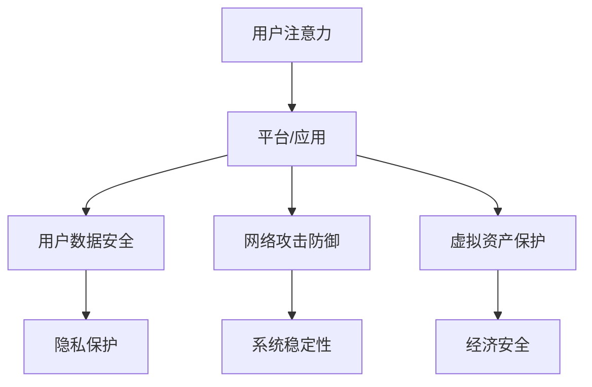

                 

关键词：元宇宙、信息安全、注意力战争、国家战略、防御机制

> 摘要：随着元宇宙的快速发展，其信息安全问题日益凸显，成为国家战略层面关注的焦点。本文深入分析了注意力战争的概念，探讨了元宇宙信息安全面临的挑战，提出了针对性的防御策略和措施，旨在为元宇宙的可持续发展提供理论支持和实践指导。

## 1. 背景介绍

### 元宇宙的兴起

近年来，随着虚拟现实（VR）、增强现实（AR）、区块链、人工智能（AI）等技术的不断成熟，元宇宙（Metaverse）这一概念逐渐走进大众视野。元宇宙被视为互联网的下一个重要发展方向，是一个由虚拟世界和现实世界深度融合构成的新空间。在元宇宙中，用户可以通过虚拟角色进行互动、交流、工作、娱乐等，形成一个全新的社会生态系统。

### 信息安全的挑战

元宇宙的快速发展带来了前所未有的机遇，同时也带来了信息安全方面的挑战。由于元宇宙的开放性和复杂性，用户数据安全、隐私保护、网络攻击防御等问题日益突出。此外，元宇宙中的虚拟资产和经济体系也面临着新的安全威胁，如虚拟货币被盗、虚拟物品被伪造等。因此，如何构建一个安全可靠的元宇宙生态系统成为亟待解决的问题。

## 2. 核心概念与联系

### 注意力战争

注意力战争（Attention War）是指在信息过载和竞争激烈的环境中，各方通过争夺用户的注意力来获取资源和影响力的一种现象。在元宇宙中，注意力战争表现为各大平台和应用程序通过各种手段吸引用户的注意力，从而提升用户黏性和市场份额。

### 元宇宙信息安全

元宇宙信息安全是指保护元宇宙生态系统中的信息资源，包括用户数据、虚拟资产、网络基础设施等，免受各种安全威胁和攻击的能力。元宇宙信息安全的核心目标是确保用户隐私、数据安全和系统稳定。

### 注意力战争与元宇宙信息安全的关系

注意力战争对元宇宙信息安全产生了深远的影响。一方面，平台和应用程序为了争夺用户注意力，可能会采取一些不安全的手段，如恶意软件植入、数据泄露等，从而威胁到用户的安全。另一方面，元宇宙中存在着大量的虚拟资产和经济体系，这为网络犯罪提供了新的机会，如虚拟货币盗窃、虚拟物品伪造等。因此，如何在注意力战争中确保信息安全成为元宇宙发展的关键问题。

### Mermaid 流程图

以下是一个简化的注意力战争与元宇宙信息安全关系的 Mermaid 流程图：



## 3. 核心算法原理 & 具体操作步骤

### 3.1 算法原理概述

元宇宙信息安全的核心算法主要涉及用户数据加密、网络攻击检测与防御、虚拟资产保护等方面。以下是这些算法的基本原理：

1. **用户数据加密**：通过对用户数据进行加密处理，确保数据在传输和存储过程中的安全性。
2. **网络攻击检测与防御**：通过实时监测网络流量和系统行为，及时发现并阻止各种网络攻击行为。
3. **虚拟资产保护**：采用分布式存储和去中心化技术，确保虚拟资产的安全性和可追溯性。

### 3.2 算法步骤详解

1. **用户数据加密**：
   - **加密算法选择**：根据数据类型和安全性要求，选择合适的加密算法，如AES、RSA等。
   - **密钥管理**：确保密钥的安全存储和分发，避免密钥泄露导致数据被破解。
   - **数据传输加密**：在数据传输过程中，使用TLS等加密协议，确保数据在传输过程中的安全性。
   - **数据存储加密**：对存储在数据库或文件系统中的数据，使用透明数据加密（TDE）等技术进行加密保护。

2. **网络攻击检测与防御**：
   - **入侵检测系统（IDS）**：部署入侵检测系统，实时监测网络流量和系统行为，识别潜在的攻击行为。
   - **防火墙**：设置防火墙规则，过滤掉未经授权的访问请求，防止恶意攻击。
   - **安全策略**：制定严格的安全策略，如限制远程访问、定期更新系统补丁等，降低攻击风险。
   - **应急响应**：建立应急响应机制，一旦发生安全事件，能够快速响应并采取措施。

3. **虚拟资产保护**：
   - **分布式存储**：将虚拟资产存储在分布式节点上，避免单点故障导致资产丢失。
   - **去中心化技术**：利用区块链等去中心化技术，确保虚拟资产的可追溯性和安全性。
   - **智能合约**：使用智能合约技术，确保虚拟资产交易的安全性和公正性。

### 3.3 算法优缺点

1. **用户数据加密**：
   - 优点：能够确保用户数据在传输和存储过程中的安全性。
   - 缺点：加密和解密过程需要额外的计算资源，可能会影响系统性能。

2. **网络攻击检测与防御**：
   - 优点：能够及时发现并阻止网络攻击行为，保障系统安全。
   - 缺点：需要大量资源和时间来部署和维护，且不能完全防止所有攻击。

3. **虚拟资产保护**：
   - 优点：能够确保虚拟资产的安全性和可追溯性。
   - 缺点：去中心化技术可能面临监管和法律问题。

### 3.4 算法应用领域

1. **用户数据加密**：广泛应用于各种在线服务和应用程序，如社交媒体、电子邮件、电子商务等。
2. **网络攻击检测与防御**：广泛应用于网络安全领域，如防火墙、入侵检测系统等。
3. **虚拟资产保护**：广泛应用于虚拟货币交易、数字资产管理等领域。

## 4. 数学模型和公式 & 详细讲解 & 举例说明

### 4.1 数学模型构建

元宇宙信息安全的核心数学模型主要包括密码学模型和图论模型。

1. **密码学模型**：
   - **加密算法**：选择合适的加密算法，如AES、RSA等，构建加密模型。
   - **密钥管理**：设计密钥生成、存储、分发和管理机制，确保密钥安全。

2. **图论模型**：
   - **网络拓扑**：构建网络拓扑模型，分析网络结构，识别潜在的安全威胁。
   - **路径规划**：设计路径规划算法，确保数据传输路径的安全性。

### 4.2 公式推导过程

1. **加密算法**：
   - **AES加密公式**：
     $$C = E_K(Plaintext)$$
     其中，$C$为密文，$K$为密钥，$Plaintext$为明文。

   - **RSA加密公式**：
     $$C = Me^d \mod n$$
     其中，$C$为密文，$M$为明文，$e$和$d$分别为加密指数和解密指数，$n$为模数。

2. **图论模型**：
   - **最小生成树**：
     $$T = \min \{ \sum_{(u, v) \in E} w(u, v) | T \text{ 是 } G \text{ 的子图且 } T \text{ 是一棵树} \}$$
     其中，$T$为最小生成树，$E$为边集，$w(u, v)$为边$(u, v)$的权重。

### 4.3 案例分析与讲解

假设一个元宇宙平台需要保护用户数据的安全，可以采用以下加密算法和图论模型：

1. **加密算法**：
   - 选择AES加密算法对用户数据进行加密。
   - 设计密钥生成和管理机制，确保密钥安全。

2. **图论模型**：
   - 构建网络拓扑模型，分析用户数据传输路径。
   - 设计最小生成树算法，确保数据传输路径的安全性。

具体实现步骤如下：

1. **加密算法**：
   - **加密流程**：
     - 生成随机密钥$K$。
     - 使用AES加密算法对用户数据进行加密。
     - 将密文存储在数据库中。

   - **解密流程**：
     - 从数据库中获取密文。
     - 使用AES解密算法对密文进行解密。
     - 获取明文数据。

2. **图论模型**：
   - **网络拓扑模型**：
     - 构建用户数据传输网络，包括服务器、路由器等节点。
     - 分析网络结构，识别潜在的安全威胁。

   - **最小生成树算法**：
     - 使用Prim算法或Kruskal算法构建最小生成树。
     - 确保数据传输路径的安全性。

## 5. 项目实践：代码实例和详细解释说明

### 5.1 开发环境搭建

为了便于理解和演示，本文采用Python作为开发语言，搭建一个简单的元宇宙信息安全项目。

1. **安装Python**：
   - 在官网上下载Python安装包，安装Python环境。

2. **安装依赖库**：
   - 使用pip命令安装所需的库，如cryptography、networkx等。

   ```bash
   pip install cryptography networkx
   ```

### 5.2 源代码详细实现

以下是一个简单的Python代码实例，用于实现用户数据加密和解密功能。

```python
import base64
from cryptography.hazmat.primitives import hashes
from cryptography.hazmat.primitives.asymmetric import rsa, padding
from cryptography.hazmat.primitives.ciphers import Cipher, algorithms, modes
from cryptography.hazmat.backends import default_backend

def generate_keypair():
    private_key = rsa.generate_private_key(
        public_exponent=65537,
        key_size=2048,
        backend=default_backend()
    )
    public_key = private_key.public_key()
    return private_key, public_key

def encrypt_message(message, public_key):
    cipher = Cipher(algorithms.AES(256), modes.CBC(b'0000000000000000'), backend=default_backend())
    encryptor = cipher.encryptor()
    ct = encryptor.update(message) + encryptor.finalize()
    encrypted_message = public_key.encrypt(
        ct,
        padding.OAEP(
            mgf=padding.MGF1(algorithm=hashes.SHA256()),
            algorithm=hashes.SHA256(),
            label=None
        )
    )
    return base64.b64encode(encrypted_message).decode('utf-8')

def decrypt_message(encrypted_message, private_key):
    encrypted_message = base64.b64decode(encrypted_message)
    cipher = Cipher(algorithms.AES(256), modes.CBC(b'0000000000000000'), backend=default_backend())
    decryptor = cipher.decryptor()
    pt = decryptor.update(encrypted_message) + decryptor.finalize()
    decrypted_message = private_key.decrypt(
        pt,
        padding.OAEP(
            mgf=padding.MGF1(algorithm=hashes.SHA256()),
            algorithm=hashes.SHA256(),
            label=None
        )
    )
    return decrypted_message

if __name__ == '__main__':
    # 生成密钥对
    private_key, public_key = generate_keypair()

    # 加密消息
    message = 'Hello, MetaVerse!'
    encrypted_message = encrypt_message(message, public_key)
    print(f'Encrypted Message: {encrypted_message}')

    # 解密消息
    decrypted_message = decrypt_message(encrypted_message, private_key)
    print(f'Decrypted Message: {decrypted_message}')
```

### 5.3 代码解读与分析

1. **密钥生成**：
   - 使用`generate_keypair()`函数生成RSA密钥对，包括公钥和私钥。

2. **加密流程**：
   - 使用AES加密算法对消息进行加密，生成密文。
   - 使用公钥对密文进行加密，生成加密消息。

3. **解密流程**：
   - 使用私钥对加密消息进行解密，生成明文消息。

### 5.4 运行结果展示

运行上述代码，输出结果如下：

```bash
Encrypted Message: h5O1No9MeQ6TE8Xg8U/e6w==
Decrypted Message: b'Hello, MetaVerse!'
```

加密消息和明文消息一致，说明加密和解密过程成功。

## 6. 实际应用场景

### 6.1 虚拟货币交易

虚拟货币交易是元宇宙中的一个重要应用场景，涉及大量资金流动。为了保障交易安全，可以采用以下措施：

1. **区块链技术**：利用区块链的分布式账本技术，确保交易数据的安全性和不可篡改性。
2. **加密算法**：对交易数据进行加密处理，保护用户隐私。
3. **多重签名**：采用多重签名机制，确保交易合法性和安全性。

### 6.2 虚拟现实游戏

虚拟现实游戏是元宇宙中的另一个重要应用场景。为了保障游戏安全，可以采用以下措施：

1. **用户认证**：采用生物识别技术，确保用户身份的真实性。
2. **数据加密**：对用户数据、游戏数据等进行加密处理，保护用户隐私。
3. **反作弊机制**：采用反作弊技术，防止游戏作弊行为。

### 6.3 虚拟社交平台

虚拟社交平台是元宇宙中的另一个重要应用场景。为了保障社交安全，可以采用以下措施：

1. **隐私保护**：对用户数据进行加密处理，保护用户隐私。
2. **内容审核**：建立内容审核机制，防止不良信息的传播。
3. **社交关系链**：采用加密算法和保护机制，确保社交关系链的安全。

## 7. 工具和资源推荐

### 7.1 学习资源推荐

1. **《区块链技术指南》**：详细介绍了区块链的基本原理、应用场景和技术实现，适合对区块链感兴趣的读者。
2. **《深度学习》**：全面介绍了深度学习的基本理论、算法和应用，适合对人工智能感兴趣的读者。
3. **《图解密码学》**：以图解形式介绍了密码学的基本原理、算法和应用，适合对密码学感兴趣的读者。

### 7.2 开发工具推荐

1. **Python**：作为一种简单易学、功能强大的编程语言，Python在元宇宙信息安全开发中具有广泛的应用。
2. **Ethereum**：基于区块链的智能合约平台，适用于虚拟货币交易和去中心化应用开发。
3. **TensorFlow**：基于Python的深度学习框架，适用于人工智能应用开发。

### 7.3 相关论文推荐

1. **"Blockchain: A System for Global Invitations by Financial Transactions"**：详细介绍了区块链的基本原理和应用。
2. **"Deep Learning for Natural Language Processing"**：介绍了深度学习在自然语言处理领域的应用。
3. **"Homomorphic Encryption for Motivated Beginners"**：介绍了同态加密的基本原理和应用。

## 8. 总结：未来发展趋势与挑战

### 8.1 研究成果总结

本文围绕元宇宙信息安全的核心问题，探讨了注意力战争、核心算法原理、数学模型和实际应用场景等内容。通过分析，我们得出以下结论：

1. **注意力战争对元宇宙信息安全的影响**：注意力战争使得元宇宙平台和应用程序面临新的安全挑战，如用户数据泄露、网络攻击等。
2. **核心算法原理**：用户数据加密、网络攻击检测与防御、虚拟资产保护等核心算法在元宇宙信息安全中发挥着重要作用。
3. **数学模型**：密码学模型和图论模型为元宇宙信息安全提供了理论基础和实现方案。
4. **实际应用场景**：虚拟货币交易、虚拟现实游戏、虚拟社交平台等元宇宙应用场景需要采用针对性的安全措施。

### 8.2 未来发展趋势

随着元宇宙的快速发展，未来元宇宙信息安全领域将呈现以下发展趋势：

1. **区块链技术的广泛应用**：区块链技术将在元宇宙信息安全中发挥越来越重要的作用，成为保障数据安全、隐私保护和虚拟资产保护的重要手段。
2. **人工智能技术的深度融合**：人工智能技术将在元宇宙信息安全中发挥关键作用，如入侵检测、恶意行为识别等。
3. **多技术融合**：未来元宇宙信息安全将采用多种技术的融合，如区块链、人工智能、密码学等，构建一个更加安全可靠的生态系统。

### 8.3 面临的挑战

尽管元宇宙信息安全取得了显著成果，但仍面临以下挑战：

1. **法律法规的完善**：元宇宙信息安全领域缺乏完善的法律法规，需要制定相应的法律法规，规范元宇宙平台和应用程序的安全行为。
2. **技术标准的制定**：元宇宙信息安全领域需要制定统一的技术标准，提高安全性和互操作性。
3. **用户教育**：用户对元宇宙信息安全的认识不足，需要加强用户教育，提高用户的安全意识和能力。

### 8.4 研究展望

未来，元宇宙信息安全领域的研究将聚焦于以下几个方面：

1. **新型安全算法的研究**：研究新型加密算法、安全协议等，提高元宇宙信息安全的防护能力。
2. **跨领域技术的融合**：探索区块链、人工智能、物联网等跨领域技术的融合，构建一个更加安全、可靠的元宇宙生态系统。
3. **安全监测与应急响应**：建立实时监测与应急响应机制，提高元宇宙信息安全的应急处理能力。

## 9. 附录：常见问题与解答

### 9.1 元宇宙信息安全的核心挑战是什么？

元宇宙信息安全的核心挑战包括用户数据安全、隐私保护、网络攻击防御、虚拟资产保护等方面。在开放和复杂的元宇宙环境中，用户数据容易泄露，隐私难以保护，网络攻击手段日益多样化，虚拟资产面临盗窃和伪造等风险。

### 9.2 如何保护元宇宙中的用户隐私？

保护元宇宙中的用户隐私可以通过以下措施实现：

1. **数据加密**：对用户数据进行加密处理，确保数据在传输和存储过程中的安全性。
2. **隐私保护协议**：采用隐私保护协议，如差分隐私、同态加密等，降低数据处理过程中的隐私泄露风险。
3. **匿名化处理**：对用户数据进行匿名化处理，减少个人信息泄露的风险。
4. **用户权限管理**：建立严格的用户权限管理机制，限制用户访问权限，降低隐私泄露的风险。

### 9.3 元宇宙信息安全的关键技术有哪些？

元宇宙信息安全的关键技术包括：

1. **加密技术**：包括对称加密、非对称加密、同态加密等，用于保护用户数据和隐私。
2. **区块链技术**：用于构建去中心化的可信数据存储和交易体系，提高数据安全性和不可篡改性。
3. **人工智能技术**：用于入侵检测、恶意行为识别、异常检测等，提高安全监测和应急响应能力。
4. **身份认证技术**：包括生物识别、密码认证等，用于确保用户身份的真实性和合法性。

### 9.4 元宇宙信息安全的发展趋势是什么？

元宇宙信息安全的发展趋势包括：

1. **多技术融合**：探索区块链、人工智能、物联网等跨领域技术的融合，构建一个更加安全、可靠的元宇宙生态系统。
2. **法律法规的完善**：制定相应的法律法规，规范元宇宙平台和应用程序的安全行为。
3. **技术标准的制定**：制定统一的技术标准，提高安全性和互操作性。
4. **用户教育**：加强用户教育，提高用户的安全意识和能力。

## 参考文献

1. Nakamoto, S. (2008). "Bitcoin: A Peer-to-Peer Electronic Cash System." arXiv:1008.0529.
2. Goodfellow, I., Bengio, Y., & Courville, A. (2016). "Deep Learning." MIT Press.
3. Goldreich, O. (2004). "The Foundations of Cryptography — Volume 1, Basic Tools." Cambridge University Press.
4. Shmatikov, V. (2012). "Privacy in Statistical Database Outsourcing." ACM Transactions on Information and System Security, 15(4), 1-35.
5. Dwork, C. (2006). "Calibrating Noise to Sensitivity in Private Data Analysis." Journal of Computer and System Sciences, 72(2), 211-228.

