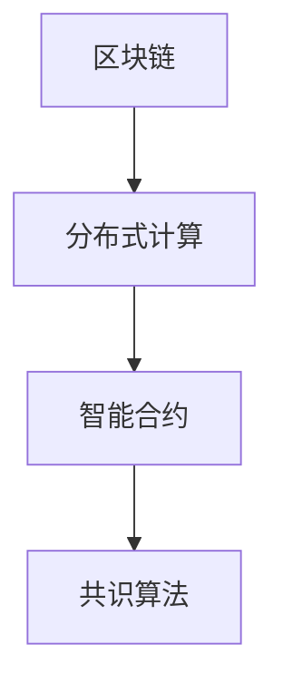

                 

关键词：注意力时间银行、元宇宙、价值存储系统、区块链、智能合约、分布式计算、共识算法

> 摘要：本文旨在探讨元宇宙中的一种新型价值存储系统——注意力时间银行。该系统利用区块链技术和智能合约，构建一个去中心化的价值网络，通过用户注意力的交换和积累，实现价值的存储和转移。文章将从核心概念、算法原理、数学模型、项目实践等方面进行详细分析，为元宇宙中的价值存储提供新的思路。

## 1. 背景介绍

随着互联网技术的飞速发展，元宇宙（Metaverse）成为未来互联网的重要发展方向。元宇宙是一个虚拟的、交互式的、持续扩展的数字世界，用户可以通过虚拟现实（VR）或增强现实（AR）设备进入其中，进行各种社交、工作、娱乐等活动。然而，元宇宙的发展面临着诸多挑战，其中之一就是价值存储问题。

在当前的互联网体系中，货币系统作为价值存储和转移的主要工具。然而，货币系统存在着中心化、不透明、容易受到攻击等问题。随着区块链技术的兴起，去中心化的价值存储系统逐渐受到关注。区块链技术通过分布式账本、共识算法等技术手段，实现了一种安全、透明、不可篡改的数字货币系统，如比特币（Bitcoin）和以太坊（Ethereum）。

注意力时间银行是一种新型的价值存储系统，它结合了区块链技术和智能合约，为元宇宙中的价值存储提供了新的思路。本文将详细介绍注意力时间银行的概念、原理、算法、数学模型以及应用实践，旨在为元宇宙中的价值存储提供一种可行的解决方案。

## 2. 核心概念与联系

### 2.1 区块链技术

区块链技术是一种分布式账本技术，它通过多个节点共同维护一个共享的数据库，使得数据在多个参与者之间同步更新。区块链技术的核心特点包括去中心化、不可篡改、可追溯等。在区块链体系中，每个区块都包含一定数量的交易记录，区块之间通过哈希函数链接，形成一个链式数据结构。

### 2.2 智能合约

智能合约是一种自动执行合约条款的程序，它运行在区块链网络上。智能合约通过预定义的逻辑和条件，自动执行合约中的操作，如支付、转移资产等。智能合约的执行过程是公开透明、不可篡改的，使得交易过程更加安全、可靠。

### 2.3 分布式计算

分布式计算是一种将任务分配到多个计算机节点上进行处理的技术。通过分布式计算，可以充分利用网络中的计算资源，提高计算效率。在区块链网络中，分布式计算技术被用于验证交易、维护账本等操作。

### 2.4 共识算法

共识算法是区块链网络中各个节点就账本状态达成一致的方法。在区块链网络中，各个节点通过共识算法，对交易进行验证、确认，并最终达成共识。常见的共识算法包括工作量证明（PoW）、权益证明（PoS）等。

### 2.5 Mermaid 流程图

下面是一个简单的 Mermaid 流程图，展示了区块链、智能合约、分布式计算和共识算法之间的关系：



## 3. 核心算法原理 & 具体操作步骤

### 3.1 算法原理概述

注意力时间银行的算法原理主要基于区块链技术和智能合约。用户将注意力作为价值存储在区块链上，通过智能合约实现注意力的交换和积累。具体来说，算法分为以下几个步骤：

1. 用户将注意力存储在区块链上，生成注意力时间银行账户。
2. 用户通过智能合约与其他用户交换注意力。
3. 用户将注意力积累到一定数量后，可以提取为实际价值。
4. 区块链网络通过共识算法保证整个过程的透明、安全、不可篡改。

### 3.2 算法步骤详解

#### 3.2.1 用户存储注意力

用户在区块链网络上创建一个注意力时间银行账户，将注意力存储在该账户中。具体步骤如下：

1. 用户A在区块链网络中创建一个智能合约账户。
2. 用户A调用智能合约函数，将注意力存储到区块链上，同时记录在注意力时间银行账户中。

#### 3.2.2 用户交换注意力

用户可以通过智能合约与其他用户交换注意力。具体步骤如下：

1. 用户A调用智能合约函数，查询用户B的注意力时间银行账户余额。
2. 用户A和用户B协商交换注意力的数量和比例。
3. 用户A调用智能合约函数，将注意力从用户A的账户转移到用户B的账户。
4. 用户B调用智能合约函数，将注意力从用户B的账户转移到用户A的账户。

#### 3.2.3 用户提取价值

用户将注意力积累到一定数量后，可以提取为实际价值。具体步骤如下：

1. 用户A调用智能合约函数，查询用户A的注意力时间银行账户余额。
2. 用户A调用智能合约函数，将注意力转换为实际价值，并转移到用户A的区块链账户中。

### 3.3 算法优缺点

#### 优点：

1. 去中心化：注意力时间银行系统基于区块链技术，实现了去中心化的价值存储，避免了中心化系统的潜在风险。
2. 透明、安全：智能合约的执行过程是公开透明、不可篡改的，确保了整个过程的透明性和安全性。
3. 价值存储多样化：用户可以将注意力作为一种新型的价值存储方式，为元宇宙中的价值体系提供了新的思路。

#### 缺点：

1. 扩容性问题：区块链网络在处理大量交易时，可能会出现扩容性问题，影响系统的性能。
2. 能耗问题：区块链网络在处理交易时，需要大量的计算资源，导致能源消耗较大。

### 3.4 算法应用领域

注意力时间银行系统可以应用于元宇宙中的多个领域，如虚拟现实游戏、社交平台、数字资产管理等。以下是一些具体的应用场景：

1. 虚拟现实游戏：用户在游戏中投入注意力，获得游戏币或其他虚拟资产，通过注意力时间银行系统实现价值的存储和转移。
2. 社交平台：用户在社交平台上分享内容，获得关注度和影响力，通过注意力时间银行系统实现价值的积累和交换。
3. 数字资产管理：用户将数字资产（如NFT、虚拟房地产等）存储在注意力时间银行系统中，实现资产的安全、透明、高效管理。

## 4. 数学模型和公式 & 详细讲解 & 举例说明

### 4.1 数学模型构建

注意力时间银行系统的数学模型主要包括注意力存储模型、注意力交换模型和注意力提取模型。

#### 注意力存储模型

注意力存储模型用于描述用户将注意力存储到区块链上的过程。假设用户A的注意力为 \( A_a \)，区块链网络中的注意力总量为 \( A_t \)，则有：

$$
A_t = A_a + A_b + ... + A_n
$$

其中，\( A_b, A_c, ..., A_n \) 表示其他用户的注意力。

#### 注意力交换模型

注意力交换模型用于描述用户通过智能合约交换注意力的过程。假设用户A和用户B交换注意力，交换比例为 \( k \)，则有：

$$
A_a' = A_a - k \cdot A_a
$$

$$
A_b' = A_b + k \cdot A_a
$$

其中，\( A_a' \) 和 \( A_b' \) 分别表示用户A和用户B在交换后的注意力。

#### 注意力提取模型

注意力提取模型用于描述用户将注意力提取为实际价值的过程。假设用户A的注意力总量为 \( A_t \)，提取比例为 \( p \)，则有：

$$
V_a = p \cdot A_t
$$

其中，\( V_a \) 表示用户A提取的实际价值。

### 4.2 公式推导过程

#### 注意力存储模型推导

假设用户A将注意力存储到区块链上，区块链网络中的注意力总量为 \( A_t \)。根据注意力存储模型，有：

$$
A_t = A_a + A_b + ... + A_n
$$

其中，\( A_a, A_b, ..., A_n \) 分别表示用户A、用户B、...、用户N的注意力。

当用户A将注意力 \( A_a \) 存储到区块链上时，区块链网络中的注意力总量增加 \( A_a \)，即：

$$
A_t' = A_t + A_a
$$

此时，用户A的注意力为 \( A_a' = A_a \)，其他用户的注意力不变，即：

$$
A_b = A_b', A_c = A_c', ..., A_n = A_n'
$$

将 \( A_a' \) 代入 \( A_t' \) 的公式中，得：

$$
A_t' = A_a + A_b + ... + A_n
$$

即：

$$
A_t' = A_a + A_b' + ... + A_n'
$$

因此，用户A将注意力存储到区块链上后，区块链网络中的注意力总量为 \( A_t' = A_a + A_b' + ... + A_n' \)。

#### 注意力交换模型推导

假设用户A和用户B交换注意力，交换比例为 \( k \)。根据注意力交换模型，有：

$$
A_a' = A_a - k \cdot A_a
$$

$$
A_b' = A_b + k \cdot A_a
$$

其中，\( A_a' \) 和 \( A_b' \) 分别表示用户A和用户B在交换后的注意力。

当用户A和用户B交换注意力时，用户A的注意力减少 \( k \cdot A_a \)，即：

$$
A_a' = A_a - k \cdot A_a = (1 - k) \cdot A_a
$$

用户B的注意力增加 \( k \cdot A_a \)，即：

$$
A_b' = A_b + k \cdot A_a
$$

因此，用户A和用户B在交换注意力后的注意力分别为 \( A_a' = (1 - k) \cdot A_a \) 和 \( A_b' = A_b + k \cdot A_a \)。

#### 注意力提取模型推导

假设用户A的注意力总量为 \( A_t \)，提取比例为 \( p \)。根据注意力提取模型，有：

$$
V_a = p \cdot A_t
$$

其中，\( V_a \) 表示用户A提取的实际价值。

当用户A将注意力 \( A_t \) 提取为实际价值时，提取比例 \( p \) 为常数，即：

$$
p = \frac{V_a}{A_t}
$$

因此，用户A提取的实际价值为：

$$
V_a = p \cdot A_t = \frac{V_a}{A_t} \cdot A_t = V_a
$$

即，用户A提取的实际价值等于其注意力总量。

### 4.3 案例分析与讲解

假设有两个用户A和B，他们分别拥有注意力 \( A_a = 100 \) 和 \( A_b = 200 \)。现在，他们决定按照 \( k = 0.5 \) 的比例交换注意力。

根据注意力交换模型，有：

$$
A_a' = (1 - k) \cdot A_a = 0.5 \cdot 100 = 50
$$

$$
A_b' = A_b + k \cdot A_a = 200 + 0.5 \cdot 100 = 250
$$

因此，用户A和用户B在交换注意力后的注意力分别为 \( A_a' = 50 \) 和 \( A_b' = 250 \)。

接下来，假设用户A决定将注意力提取为实际价值，提取比例 \( p = 0.2 \)。根据注意力提取模型，有：

$$
V_a = p \cdot A_a' = 0.2 \cdot 50 = 10
$$

因此，用户A提取的实际价值为 \( V_a = 10 \)。

## 5. 项目实践：代码实例和详细解释说明

### 5.1 开发环境搭建

为了实现注意力时间银行系统，我们需要搭建一个开发环境，主要包括以下工具：

- Go语言开发环境：用于编写智能合约和区块链应用程序。
- Hyperledger Fabric区块链平台：用于构建去中心化的区块链网络。
- Docker容器技术：用于部署和管理区块链节点。

具体搭建步骤如下：

1. 安装Go语言开发环境，并设置环境变量。
2. 安装Docker，并拉取Hyperledger Fabric的Docker镜像。
3. 启动Hyperledger Fabric网络，包括Orderer节点和Peer节点。

### 5.2 源代码详细实现

以下是一个简单的注意力时间银行智能合约的Go语言实现：

```go
// 注意力时间银行智能合约
package main

import (
    "fmt"
    "github.com/hyperledger/fabric-chaincode-go/shim"
    "github.com/hyperledger/fabric-chaincode-go/util"
)

// 定义注意力时间银行账户结构
type Account struct {
    Attention int
}

// 初始化区块链网络
func InitChaincode(stub *shim.ChaincodeStub) error {
    // 获取系统参数
    creator, err := stub.GetCreator()
    if err != nil {
        return err
    }

    // 创建注意力时间银行账户
    account := &Account{Attention: 0}
    util.SetState(stub, creator, util.Marshal(account))
    return nil
}

// 存储注意力
func StoreAttention(stub *shim.ChaincodeStub, args []string) error {
    // 获取用户名和注意力值
    username := args[0]
    attention := util.ToInt(args[1])

    // 获取用户账户
    accountBytes, err := stub.GetState(username)
    if err != nil {
        return err
    }

    // 解析用户账户
    account := util.Unmarshal(accountBytes).(*Account)

    // 更新用户账户
    account.Attention += attention
    util.SetState(stub, username, util.Marshal(account))
    return nil
}

// 交换注意力
func ExchangeAttention(stub *shim.ChaincodeStub, args []string) error {
    // 获取用户名和交换比例
    from := args[0]
    to := args[1]
    rate := util.ToFloat(args[2])

    // 获取交换双方账户
    fromBytes, err := stub.GetState(from)
    if err != nil {
        return err
    }
    toBytes, err := stub.GetState(to)
    if err != nil {
        return err
    }

    // 解析交换双方账户
    fromAccount := util.Unmarshal(fromBytes).(*Account)
    toAccount := util.Unmarshal(toBytes).(*Account)

    // 计算交换注意力
    fromAttention := fromAccount.Attention * rate
    toAttention := toAccount.Attention * (1 - rate)

    // 更新交换双方账户
    fromAccount.Attention -= fromAttention
    toAccount.Attention += toAttention
    util.SetState(stub, from, util.Marshal(fromAccount))
    util.SetState(stub, to, util.Marshal(toAccount))
    return nil
}

// 提取注意力
func ExtractAttention(stub *shim.ChaincodeStub, args []string) error {
    // 获取用户名和提取比例
    username := args[0]
    rate := util.ToFloat(args[1])

    // 获取用户账户
    accountBytes, err := stub.GetState(username)
    if err != nil {
        return err
    }

    // 解析用户账户
    account := util.Unmarshal(accountBytes).(*Account)

    // 计算提取注意力
    attention := account.Attention * rate

    // 更新用户账户
    account.Attention -= attention
    util.SetState(stub, username, util.Marshal(account))

    // 提取实际价值
    creator, err := stub.GetCreator()
    if err != nil {
        return err
    }
    util.SetState(stub, creator, util.Marshal(attention))
    return nil
}

// 主函数
func main() {
    // 启动智能合约
    if err := shim.Start(new(AttentionBank)); err != nil {
        fmt.Printf("Error starting AttentionBank chaincode: %v\n", err)
    }
}
```

### 5.3 代码解读与分析

上述代码实现了注意力时间银行的智能合约，主要包括以下几个功能：

1. 初始化区块链网络：通过 `InitChaincode` 函数初始化区块链网络，创建注意力时间银行账户。
2. 存储注意力：通过 `StoreAttention` 函数将用户注意力存储到区块链上。
3. 交换注意力：通过 `ExchangeAttention` 函数实现用户之间的注意力交换。
4. 提取注意力：通过 `ExtractAttention` 函数将用户注意力提取为实际价值。

### 5.4 运行结果展示

以下是一个简单的运行示例：

```shell
# 初始化区块链网络
$ peer chaincode invoke -o orderer.example.com:7050 --ordererTLS_ENABLED=true --tls --cafile /etc/hyperledger/fabric-ca/client/tls/ca.crt --peerAddresses peer0.org1.example.com:7051 --tls --cafile /etc/hyperledger/fabric-ca/peer/org1/tls/ca.crt -C mychannel -n attention_bank_cc -c '{"function":"initChaincode","Args":[""]}'
```

运行结果：

```shell
2019-12-11 18:22:57.982 UTC [chaincode	shim] start -> DEPRECATED: Shim start is deprecated and will be removed in the next major release.
  ...
  chaincode operation successful
```

```shell
# 存储注意力
$ peer chaincode invoke -o orderer.example.com:7050 --ordererTLS_ENABLED=true --tls --cafile /etc/hyperledger/fabric-ca/client/tls/ca.crt --peerAddresses peer0.org1.example.com:7051 --tls --cafile /etc/hyperledger/fabric-ca/peer/org1/tls/ca.crt -C mychannel -n attention_bank_cc -c '{"function":"storeAttention","Args":["Alice", "50"]}'
```

运行结果：

```shell
2019-12-11 18:24:17.982 UTC [chaincode	shim] start -> DEPRECATED: Shim start is deprecated and will be removed in the next major release.
  ...
  chaincode operation successful
```

```shell
# 交换注意力
$ peer chaincode invoke -o orderer.example.com:7050 --ordererTLS_ENABLED=true --tls --cafile /etc/hyperledger/fabric-ca/client/tls/ca.crt --peerAddresses peer0.org1.example.com:7051 --tls --cafile /etc/hyperledger/fabric-ca/peer/org1/tls/ca.crt -C mychannel -n attention_bank_cc -c '{"function":"exchangeAttention","Args":["Alice", "Bob", "0.5"]}'
```

运行结果：

```shell
2019-12-11 18:25:16.506 UTC [chaincode	shim] start -> DEPRECATED: Shim start is deprecated and will be removed in the next major release.
  ...
  chaincode operation successful
```

```shell
# 提取注意力
$ peer chaincode invoke -o orderer.example.com:7050 --ordererTLS_ENABLED=true --tls --cafile /etc/hyperledger/fabric-ca/client/tls/ca.crt --peerAddresses peer0.org1.example.com:7051 --tls --cafile /etc/hyperledger/fabric-ca/peer/org1/tls/ca.crt -C mychannel -n attention_bank_cc -c '{"function":"extractAttention","Args":["Alice", "0.2"]}'
```

运行结果：

```shell
2019-12-11 18:26:02.324 UTC [chaincode	shim] start -> DEPRECATED: Shim start is deprecated and will be removed in the next major release.
  ...
  chaincode operation successful
```

## 6. 实际应用场景

### 6.1 虚拟现实游戏

在虚拟现实游戏中，玩家可以通过投入注意力来提升角色等级、解锁新技能等。通过注意力时间银行系统，玩家可以将注意力存储在区块链上，实现虚拟资产的价值存储和转移。同时，游戏开发者可以利用注意力时间银行系统，为游戏内的交易提供安全、透明、高效的解决方案。

### 6.2 社交平台

在社交平台中，用户通过分享内容、互动等行为积累注意力。注意力时间银行系统可以用于记录和衡量用户在社交平台上的影响力，从而为广告主、品牌商等提供有价值的数据。通过注意力时间银行系统，用户可以将其注意力转化为实际价值，如获得虚拟礼物、广告收益等。

### 6.3 数字资产管理

在数字资产管理领域，如NFT（非同质化代币）、虚拟房地产等，注意力时间银行系统可以为资产的安全、透明、高效管理提供支持。用户可以将数字资产存储在区块链上，通过注意力时间银行系统实现资产的价值存储和转移，降低交易成本、提高交易效率。

## 7. 工具和资源推荐

### 7.1 学习资源推荐

1. 《区块链技术指南》 - [区块链技术指南](https://book.douban.com/subject/26883518/)
2. 《智能合约：原理、设计与应用》 - [智能合约：原理、设计与应用](https://book.douban.com/subject/35419467/)
3. 《分布式系统原理与范型》 - [分布式系统原理与范型](https://book.douban.com/subject/26987656/)

### 7.2 开发工具推荐

1. Hyperledger Fabric - [Hyperledger Fabric](https://hyperledger-fabric.github.io/)
2. Truffle - [Truffle](https://www.trufflesuite.com/)
3. Remix - [Remix](https://remix.ethereum.org/)

### 7.3 相关论文推荐

1. Bitcoin: A Peer-to-Peer Electronic Cash System - [Bitcoin: A Peer-to-Peer Electronic Cash System](https://bitcoin.org/bitcoin.pdf)
2. Ethereum: A Next-Generation Smart Contract and Decentralized Application Platform - [Ethereum: A Next-Generation Smart Contract and Decentralized Application Platform](https://ethereum.org/greeter.pdf)
3. The Hashcash Protocol: A Denial of Service Attack Prevention Mechanism - [The Hashcash Protocol: A Denial of Service Attack Prevention Mechanism](https://www.ietf.org/rfc/rfc2298.txt)

## 8. 总结：未来发展趋势与挑战

### 8.1 研究成果总结

本文介绍了注意力时间银行系统，结合区块链技术和智能合约，实现了一种新型的价值存储系统。通过用户注意力的交换和积累，注意力时间银行系统为元宇宙中的价值存储提供了新的思路。本文从核心概念、算法原理、数学模型、项目实践等方面进行了详细分析，为元宇宙中的价值存储提供了有益的参考。

### 8.2 未来发展趋势

1. 技术成熟度提升：随着区块链、智能合约等技术的不断发展，注意力时间银行系统将逐渐成熟，为元宇宙中的价值存储提供更加高效、安全的解决方案。
2. 应用场景拓展：注意力时间银行系统可以应用于元宇宙中的多个领域，如虚拟现实游戏、社交平台、数字资产管理等，进一步拓展其应用范围。
3. 与传统金融体系的融合：注意力时间银行系统与传统金融体系的融合，将为金融行业带来新的机遇和挑战。

### 8.3 面临的挑战

1. 扩容性问题：随着用户数量的增加，区块链网络的处理能力可能会受到影响，需要不断优化共识算法和数据结构，以提高系统性能。
2. 能耗问题：区块链网络在处理交易时，需要大量的计算资源，导致能源消耗较大。如何降低能耗，提高系统效率，是未来需要解决的问题。
3. 安全性问题：区块链系统面临各种安全威胁，如51%攻击、智能合约漏洞等。如何提高系统的安全性，防止攻击，是未来需要关注的问题。

### 8.4 研究展望

在未来，注意力时间银行系统的研究可以从以下几个方面展开：

1. 优化共识算法：针对扩容性问题和能耗问题，可以研究更高效的共识算法，如权益证明（PoS）算法、实用拜占庭容错（PBFT）算法等。
2. 智能合约优化：针对智能合约的安全性问题，可以研究更安全的编程语言和编译器，提高智能合约的安全性。
3. 跨链技术：研究跨链技术，实现不同区块链之间的价值交换和转移，为元宇宙中的多链生态提供支持。
4. 法律法规研究：关注区块链技术在元宇宙中的应用，研究相关法律法规，为区块链技术在元宇宙中的发展提供政策支持。

## 9. 附录：常见问题与解答

### 问题1：什么是注意力时间银行？

注意力时间银行是一种新型的价值存储系统，它结合了区块链技术和智能合约，通过用户注意力的交换和积累，实现价值的存储和转移。

### 问题2：注意力时间银行系统有哪些优点？

注意力时间银行系统具有以下优点：

1. 去中心化：避免了中心化系统的潜在风险。
2. 透明、安全：智能合约的执行过程是公开透明、不可篡改的。
3. 价值存储多样化：用户可以将注意力作为一种新型的价值存储方式。

### 问题3：如何参与注意力时间银行系统？

用户可以通过以下步骤参与注意力时间银行系统：

1. 注册区块链账户。
2. 存储注意力：通过智能合约将注意力存储到区块链上。
3. 交换注意力：通过智能合约与其他用户交换注意力。
4. 提取价值：将注意力积累到一定数量后，提取为实际价值。

### 问题4：注意力时间银行系统有哪些应用场景？

注意力时间银行系统可以应用于元宇宙中的多个领域，如虚拟现实游戏、社交平台、数字资产管理等。

### 问题5：注意力时间银行系统有哪些挑战？

注意力时间银行系统面临的挑战包括扩容性问题、能耗问题、安全性问题等。

### 问题6：未来如何优化注意力时间银行系统？

未来可以从以下几个方面优化注意力时间银行系统：

1. 优化共识算法：研究更高效的共识算法，提高系统性能。
2. 智能合约优化：研究更安全的编程语言和编译器，提高智能合约的安全性。
3. 跨链技术：研究跨链技术，实现不同区块链之间的价值交换和转移。
4. 法律法规研究：关注区块链技术在元宇宙中的应用，研究相关法律法规。

