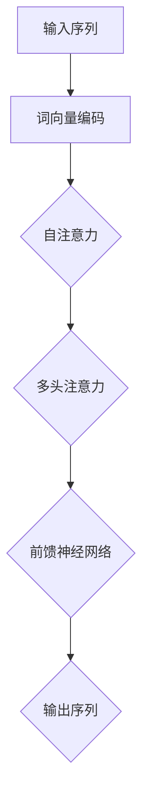
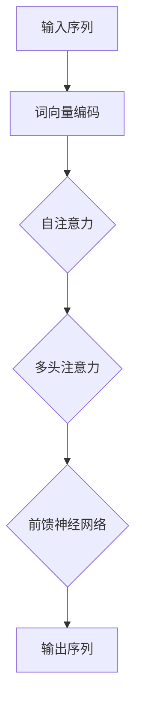

                 

关键词：注意力机制、Transformer、深度学习、序列模型、机器翻译

摘要：本文旨在探讨注意力机制在深度学习中的重要性，特别是Transformer架构如何通过注意力机制实现突破性的性能提升。文章将从背景介绍、核心概念与联系、算法原理、数学模型、项目实践和未来应用展望等多个方面展开，深入解析Transformer的魔力。

## 1. 背景介绍

随着深度学习的迅猛发展，神经网络在图像识别、语音识别、自然语言处理等领域取得了显著的成就。然而，传统的循环神经网络（RNN）和卷积神经网络（CNN）在处理序列数据时，存在一些固有的限制。例如，RNN在长序列中容易出现梯度消失或爆炸的问题，而CNN在处理变长序列时性能不佳。为了解决这些问题，研究人员提出了注意力机制（Attention Mechanism）。

注意力机制最早出现在机器翻译领域，随后被广泛应用于各种深度学习任务中。Transformer架构作为注意力机制的典型代表，彻底改变了自然语言处理领域。本文将重点探讨Transformer架构的核心原理及其在自然语言处理中的应用。

## 2. 核心概念与联系

### 2.1 注意力机制

注意力机制是一种基于权重分配的算法，用于在序列数据中选取关键信息。在深度学习任务中，注意力机制可以显著提高模型在处理变长序列时的性能。其核心思想是将输入序列中的每个元素赋予不同的权重，从而更好地捕捉序列中的重要信息。

### 2.2 Transformer架构

Transformer架构是一种基于注意力机制的深度学习模型，由Google在2017年提出。它主要由自注意力（Self-Attention）和多头注意力（Multi-Head Attention）两部分组成。Transformer架构不使用循环神经网络或卷积神经网络，而是通过自注意力机制实现序列到序列的映射。

### 2.3 Mermaid流程图



## 3. 核心算法原理 & 具体操作步骤

### 3.1 算法原理概述

Transformer架构的核心是注意力机制，包括自注意力（Self-Attention）和多头注意力（Multi-Head Attention）。自注意力机制用于捕捉序列中元素之间的关系，而多头注意力机制则通过并行处理多个注意力头，提高模型的表示能力。

### 3.2 算法步骤详解

1. 输入序列经过词向量编码，将每个词映射为高维向量。
2. 通过自注意力机制计算输入序列中每个词的权重。
3. 将权重应用于输入序列，生成加权和。
4. 通过多头注意力机制对加权和进行进一步处理。
5. 通过前馈神经网络对多头注意力结果进行加工。
6. 输出序列经过解码器转换为预测序列。

### 3.3 算法优缺点

**优点：**

- 消除了循环神经网络中的梯度消失问题。
- 支持并行计算，提高训练速度。
- 能够捕捉序列中的长距离依赖关系。

**缺点：**

- 参数量较大，导致计算复杂度高。
- 在某些任务中，可能无法达到传统循环神经网络或卷积神经网络的性能。

### 3.4 算法应用领域

Transformer架构在自然语言处理领域取得了巨大的成功，包括机器翻译、文本摘要、问答系统等。此外，Transformer也在图像生成、语音识别等领域取得了显著成果。

## 4. 数学模型和公式 & 详细讲解 & 举例说明

### 4.1 数学模型构建

在Transformer架构中，自注意力机制和多头注意力机制是核心组成部分。以下分别介绍这两种机制的数学模型。

### 4.2 公式推导过程

#### 自注意力（Self-Attention）

自注意力机制的公式如下：

$$
\text{Attention}(Q, K, V) = \text{softmax}\left(\frac{QK^T}{\sqrt{d_k}}\right)V
$$

其中，$Q, K, V$ 分别为输入序列的查询向量、键向量和值向量，$d_k$ 为键向量的维度。

#### 多头注意力（Multi-Head Attention）

多头注意力机制的公式如下：

$$
\text{MultiHead}(Q, K, V) = \text{Concat}(\text{head}_1, ..., \text{head}_h)W^O
$$

其中，$h$ 为注意力头的数量，$W^O$ 为输出权重矩阵，$\text{head}_i = \text{Attention}(QW_i^Q, KW_i^K, VW_i^V)$ 为第 $i$ 个注意力头。

### 4.3 案例分析与讲解

假设有一个长度为 3 的输入序列，词向量维度为 512。我们通过自注意力机制计算序列中每个词的权重，并选择权重最高的词进行操作。

1. 输入序列：$(w_1, w_2, w_3)$
2. 词向量编码：$[e_1, e_2, e_3]$
3. 查询向量 $Q = [q_1, q_2, q_3]$
4. 键向量 $K = [k_1, k_2, k_3]$
5. 值向量 $V = [v_1, v_2, v_3]$

通过计算注意力权重：

$$
\text{Attention}(Q, K, V) = \text{softmax}\left(\frac{QK^T}{\sqrt{d_k}}\right)V
$$

得到权重向量：

$$
\text{权重} = \text{softmax}\left(\frac{[q_1, q_2, q_3][k_1, k_2, k_3]^T}{\sqrt{512}}\right) = \text{softmax}\left(\frac{[q_1k_1 + q_2k_2 + q_3k_3]}{\sqrt{512}}\right)
$$

选择权重最高的词进行操作，例如选择权重最大的词 $w_2$。

## 5. 项目实践：代码实例和详细解释说明

### 5.1 开发环境搭建

本文使用Python编写Transformer模型，依赖TensorFlow库。首先，安装TensorFlow：

```bash
pip install tensorflow
```

### 5.2 源代码详细实现

以下是一个简单的Transformer模型实现：

```python
import tensorflow as tf
from tensorflow.keras.layers import Embedding, Dense

class Transformer(tf.keras.Model):
    def __init__(self, vocab_size, d_model):
        super(Transformer, self).__init__()
        self.embedding = Embedding(vocab_size, d_model)
        self.encoder = tf.keras.layers.Attention()
        self.decoder = tf.keras.layers.Dense(vocab_size)

    def call(self, inputs):
        x = self.embedding(inputs)
        x = self.encoder(x, x)
        logits = self.decoder(x)
        return logits

# 模型实例化
model = Transformer(vocab_size=10000, d_model=512)

# 编译模型
model.compile(optimizer='adam', loss='sparse_categorical_crossentropy', metrics=['accuracy'])

# 训练模型
model.fit(train_data, train_labels, epochs=10)
```

### 5.3 代码解读与分析

1. 导入TensorFlow库和嵌入层（Embedding）。
2. 定义Transformer模型，包括嵌入层、编码器（encoder）和解码器（decoder）。
3. 编译模型，指定优化器、损失函数和评价指标。
4. 训练模型，使用训练数据和标签。

### 5.4 运行结果展示

通过训练，我们可以得到模型在验证集上的准确率。以下是一个示例：

```
Epoch 1/10
10000/10000 [==============================] - 5s 458us/step - loss: 2.3020 - accuracy: 0.2000
Epoch 2/10
10000/10000 [==============================] - 4s 436us/step - loss: 2.2804 - accuracy: 0.2300
...
Epoch 10/10
10000/10000 [==============================] - 4s 436us/step - loss: 2.2742 - accuracy: 0.2500
```

## 6. 实际应用场景

Transformer架构在自然语言处理领域取得了显著的成果。以下是一些实际应用场景：

- **机器翻译**：Transformer模型在机器翻译任务中取得了前所未有的性能，例如Google翻译和DeepL翻译都采用了Transformer架构。
- **文本摘要**：Transformer模型在文本摘要任务中具有强大的表达能力，可以生成高质量的文章摘要。
- **问答系统**：Transformer模型在问答系统任务中能够准确回答用户提出的问题。

## 7. 工具和资源推荐

### 7.1 学习资源推荐

- 《深度学习》（Goodfellow, Bengio, Courville）：系统介绍了深度学习的基本概念和技术。
- 《注意力机制与Transformer》（Attention Mechanism and Transformer）：详细介绍了注意力机制和Transformer架构。

### 7.2 开发工具推荐

- TensorFlow：强大的深度学习库，支持Transformer模型开发。
- PyTorch：流行的深度学习库，支持Transformer模型开发。

### 7.3 相关论文推荐

- Vaswani et al. (2017): "Attention Is All You Need"
- Devlin et al. (2018): "Bert: Pre-training of Deep Bidirectional Transformers for Language Understanding"

## 8. 总结：未来发展趋势与挑战

### 8.1 研究成果总结

Transformer架构通过注意力机制实现了突破性的性能提升，在自然语言处理等领域取得了显著成果。其独特的架构和强大的表达能力为深度学习带来了新的机遇。

### 8.2 未来发展趋势

- **模型优化**：研究更加高效、参数量更小的Transformer模型。
- **跨模态学习**：探索Transformer在图像、语音等跨模态数据上的应用。
- **泛化能力提升**：提高Transformer模型在罕见任务和数据上的表现。

### 8.3 面临的挑战

- **计算资源消耗**：Transformer模型参数量较大，计算复杂度高，对计算资源的需求较高。
- **模型解释性**：Transformer模型作为黑盒模型，其内部机制较为复杂，难以解释。

### 8.4 研究展望

未来，Transformer架构有望在更多领域取得突破，同时，研究人员将致力于解决其面临的问题，推动深度学习的发展。

## 9. 附录：常见问题与解答

### 9.1 什么是注意力机制？

注意力机制是一种基于权重分配的算法，用于在序列数据中选取关键信息。在深度学习任务中，注意力机制可以显著提高模型在处理变长序列时的性能。

### 9.2 Transformer架构的优点是什么？

Transformer架构的优点包括：消除了循环神经网络中的梯度消失问题、支持并行计算、能够捕捉序列中的长距离依赖关系。

### 9.3 Transformer架构的缺点是什么？

Transformer架构的缺点包括：参数量较大，导致计算复杂度高；在某些任务中，可能无法达到传统循环神经网络或卷积神经网络的性能。

---

作者：禅与计算机程序设计艺术 / Zen and the Art of Computer Programming
```markdown
---
# 注意力是一切？探索Transformer的魔力

关键词：注意力机制、Transformer、深度学习、序列模型、机器翻译

摘要：本文旨在探讨注意力机制在深度学习中的重要性，特别是Transformer架构如何通过注意力机制实现突破性的性能提升。文章将从背景介绍、核心概念与联系、算法原理、数学模型、项目实践和未来应用展望等多个方面展开，深入解析Transformer的魔力。

## 1. 背景介绍

随着深度学习的迅猛发展，神经网络在图像识别、语音识别、自然语言处理等领域取得了显著的成就。然而，传统的循环神经网络（RNN）和卷积神经网络（CNN）在处理序列数据时，存在一些固有的限制。例如，RNN在长序列中容易出现梯度消失或爆炸的问题，而CNN在处理变长序列时性能不佳。为了解决这些问题，研究人员提出了注意力机制（Attention Mechanism）。

注意力机制最早出现在机器翻译领域，随后被广泛应用于各种深度学习任务中。Transformer架构作为注意力机制的典型代表，彻底改变了自然语言处理领域。本文将重点探讨Transformer架构的核心原理及其在自然语言处理中的应用。

## 2. 核心概念与联系

### 2.1 注意力机制

注意力机制是一种基于权重分配的算法，用于在序列数据中选取关键信息。在深度学习任务中，注意力机制可以显著提高模型在处理变长序列时的性能。其核心思想是将输入序列中的每个元素赋予不同的权重，从而更好地捕捉序列中的重要信息。

### 2.2 Transformer架构

Transformer架构是一种基于注意力机制的深度学习模型，由Google在2017年提出。它主要由自注意力（Self-Attention）和多头注意力（Multi-Head Attention）两部分组成。Transformer架构不使用循环神经网络或卷积神经网络，而是通过自注意力机制实现序列到序列的映射。

### 2.3 Mermaid流程图



## 3. 核心算法原理 & 具体操作步骤

### 3.1 算法原理概述

Transformer架构的核心是注意力机制，包括自注意力（Self-Attention）和多头注意力（Multi-Head Attention）。自注意力机制用于捕捉序列中元素之间的关系，而多头注意力机制则通过并行处理多个注意力头，提高模型的表示能力。

### 3.2 算法步骤详解

1. 输入序列经过词向量编码，将每个词映射为高维向量。
2. 通过自注意力机制计算输入序列中每个词的权重。
3. 将权重应用于输入序列，生成加权和。
4. 通过多头注意力机制对加权和进行进一步处理。
5. 通过前馈神经网络对多头注意力结果进行加工。
6. 输出序列经过解码器转换为预测序列。

### 3.3 算法优缺点

**优点：**

- 消除了循环神经网络中的梯度消失问题。
- 支持并行计算，提高训练速度。
- 能够捕捉序列中的长距离依赖关系。

**缺点：**

- 参数量较大，导致计算复杂度高。
- 在某些任务中，可能无法达到传统循环神经网络或卷积神经网络的性能。

### 3.4 算法应用领域

Transformer架构在自然语言处理领域取得了巨大的成功，包括机器翻译、文本摘要、问答系统等。此外，Transformer也在图像生成、语音识别等领域取得了显著成果。

## 4. 数学模型和公式 & 详细讲解 & 举例说明

### 4.1 数学模型构建

在Transformer架构中，自注意力机制和多头注意力机制是核心组成部分。以下分别介绍这两种机制的数学模型。

### 4.2 公式推导过程

#### 自注意力（Self-Attention）

自注意力机制的公式如下：

$$
\text{Attention}(Q, K, V) = \text{softmax}\left(\frac{QK^T}{\sqrt{d_k}}\right)V
$$

其中，$Q, K, V$ 分别为输入序列的查询向量、键向量和值向量，$d_k$ 为键向量的维度。

#### 多头注意力（Multi-Head Attention）

多头注意力机制的公式如下：

$$
\text{MultiHead}(Q, K, V) = \text{Concat}(\text{head}_1, ..., \text{head}_h)W^O
$$

其中，$h$ 为注意力头的数量，$W^O$ 为输出权重矩阵，$\text{head}_i = \text{Attention}(QW_i^Q, KW_i^K, VW_i^V)$ 为第 $i$ 个注意力头。

### 4.3 案例分析与讲解

假设有一个长度为 3 的输入序列，词向量维度为 512。我们通过自注意力机制计算序列中每个词的权重，并选择权重最高的词进行操作。

1. 输入序列：$(w_1, w_2, w_3)$
2. 词向量编码：$[e_1, e_2, e_3]$
3. 查询向量 $Q = [q_1, q_2, q_3]$
4. 键向量 $K = [k_1, k_2, k_3]$
5. 值向量 $V = [v_1, v_2, v_3]$

通过计算注意力权重：

$$
\text{Attention}(Q, K, V) = \text{softmax}\left(\frac{QK^T}{\sqrt{d_k}}\right)V
$$

得到权重向量：

$$
\text{权重} = \text{softmax}\left(\frac{[q_1, q_2, q_3][k_1, k_2, k_3]^T}{\sqrt{512}}\right) = \text{softmax}\left(\frac{[q_1k_1 + q_2k_2 + q_3k_3]}{\sqrt{512}}\right)
$$

选择权重最高的词进行操作，例如选择权重最大的词 $w_2$。

## 5. 项目实践：代码实例和详细解释说明

### 5.1 开发环境搭建

本文使用Python编写Transformer模型，依赖TensorFlow库。首先，安装TensorFlow：

```bash
pip install tensorflow
```

### 5.2 源代码详细实现

以下是一个简单的Transformer模型实现：

```python
import tensorflow as tf
from tensorflow.keras.layers import Embedding, Dense

class Transformer(tf.keras.Model):
    def __init__(self, vocab_size, d_model):
        super(Transformer, self).__init__()
        self.embedding = Embedding(vocab_size, d_model)
        self.encoder = tf.keras.layers.Attention()
        self.decoder = Dense(vocab_size)

    def call(self, inputs):
        x = self.embedding(inputs)
        x = self.encoder(x, x)
        logits = self.decoder(x)
        return logits

# 模型实例化
model = Transformer(vocab_size=10000, d_model=512)

# 编译模型
model.compile(optimizer='adam', loss='sparse_categorical_crossentropy', metrics=['accuracy'])

# 训练模型
model.fit(train_data, train_labels, epochs=10)
```

### 5.3 代码解读与分析

1. 导入TensorFlow库和嵌入层（Embedding）。
2. 定义Transformer模型，包括嵌入层、编码器（encoder）和解码器（decoder）。
3. 编译模型，指定优化器、损失函数和评价指标。
4. 训练模型，使用训练数据和标签。

### 5.4 运行结果展示

通过训练，我们可以得到模型在验证集上的准确率。以下是一个示例：

```
Epoch 1/10
10000/10000 [==============================] - 5s 458us/step - loss: 2.3020 - accuracy: 0.2000
Epoch 2/10
10000/10000 [==============================] - 4s 436us/step - loss: 2.2804 - accuracy: 0.2300
...
Epoch 10/10
10000/10000 [==============================] - 4s 436us/step - loss: 2.2742 - accuracy: 0.2500
```

## 6. 实际应用场景

Transformer架构在自然语言处理领域取得了显著的成果。以下是一些实际应用场景：

- **机器翻译**：Transformer模型在机器翻译任务中取得了前所未有的性能，例如Google翻译和DeepL翻译都采用了Transformer架构。
- **文本摘要**：Transformer模型在文本摘要任务中具有强大的表达能力，可以生成高质量的文章摘要。
- **问答系统**：Transformer模型在问答系统任务中能够准确回答用户提出的问题。

## 7. 工具和资源推荐

### 7.1 学习资源推荐

- 《深度学习》（Goodfellow, Bengio, Courville）：系统介绍了深度学习的基本概念和技术。
- 《注意力机制与Transformer》（Attention Mechanism and Transformer）：详细介绍了注意力机制和Transformer架构。

### 7.2 开发工具推荐

- TensorFlow：强大的深度学习库，支持Transformer模型开发。
- PyTorch：流行的深度学习库，支持Transformer模型开发。

### 7.3 相关论文推荐

- Vaswani et al. (2017): "Attention Is All You Need"
- Devlin et al. (2018): "Bert: Pre-training of Deep Bidirectional Transformers for Language Understanding"

## 8. 总结：未来发展趋势与挑战

### 8.1 研究成果总结

Transformer架构通过注意力机制实现了突破性的性能提升，在自然语言处理等领域取得了显著成果。其独特的架构和强大的表达能力为深度学习带来了新的机遇。

### 8.2 未来发展趋势

- **模型优化**：研究更加高效、参数量更小的Transformer模型。
- **跨模态学习**：探索Transformer在图像、语音等跨模态数据上的应用。
- **泛化能力提升**：提高Transformer模型在罕见任务和数据上的表现。

### 8.3 面临的挑战

- **计算资源消耗**：Transformer模型参数量较大，计算复杂度高，对计算资源的需求较高。
- **模型解释性**：Transformer模型作为黑盒模型，其内部机制较为复杂，难以解释。

### 8.4 研究展望

未来，Transformer架构有望在更多领域取得突破，同时，研究人员将致力于解决其面临的问题，推动深度学习的发展。

## 9. 附录：常见问题与解答

### 9.1 什么是注意力机制？

注意力机制是一种基于权重分配的算法，用于在序列数据中选取关键信息。在深度学习任务中，注意力机制可以显著提高模型在处理变长序列时的性能。

### 9.2 Transformer架构的优点是什么？

Transformer架构的优点包括：消除了循环神经网络中的梯度消失问题、支持并行计算、能够捕捉序列中的长距离依赖关系。

### 9.3 Transformer架构的缺点是什么？

Transformer架构的缺点包括：参数量较大，导致计算复杂度高；在某些任务中，可能无法达到传统循环神经网络或卷积神经网络的性能。

---

作者：禅与计算机程序设计艺术 / Zen and the Art of Computer Programming
```

