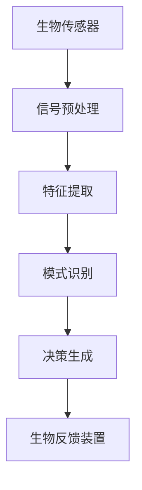

                 

关键词：注意力、生物反馈、认知状态、AI优化、神经科学、计算模型

摘要：本文旨在探讨注意力生物反馈循环的概念，如何通过AI技术对认知状态进行优化调节。通过引入神经科学原理和计算模型，本文详细解析了注意力生物反馈循环的机制，阐述了其在提升人类认知能力、改善心理健康等方面的应用前景。

## 1. 背景介绍

在过去几十年中，随着神经科学和计算技术的发展，人们对于大脑的认知过程有了更加深入的理解。注意力是认知过程的核心，它决定了我们如何选择和处理信息。然而，人类注意力资源是有限的，如何有效利用这些资源，提高认知效率，成为一个亟待解决的问题。

生物反馈是一种通过技术手段，使个体能够感知和调节自身生理和心理状态的干预方法。近年来，随着人工智能（AI）技术的快速发展，AI开始被应用于生物反馈领域，通过数据分析、模式识别等方法，实现对认知状态的实时监测和调节。

本文将探讨注意力生物反馈循环的概念，介绍其核心原理和计算模型，分析其在提升认知能力和心理健康方面的应用价值，并提出未来研究的可能方向。

## 2. 核心概念与联系

### 2.1 注意力生物反馈循环的定义

注意力生物反馈循环是指通过生物传感器收集个体生理信号，如脑电图（EEG）、肌电图（EMG）等，实时监测个体的认知状态，利用AI算法对这些信号进行处理和分析，然后反馈给个体，以实现认知状态的调节和优化。

### 2.2 注意力生物反馈循环的原理

注意力生物反馈循环的核心原理是基于神经科学的研究成果，特别是对大脑注意网络的理解。大脑注意网络包括多个脑区，如前额叶皮质、顶叶皮质、丘脑等，这些脑区通过复杂的神经网络相互作用，实现对注意力的调控。

通过生物传感器收集的生理信号，可以反映大脑注意网络的活动状态。AI算法通过对这些信号的分析，可以识别出个体当前的认知状态，如专注度、疲劳度等。然后，根据预设的目标，AI算法会生成相应的调节信号，通过生物反馈装置反馈给个体，以实现认知状态的优化。

### 2.3 注意力生物反馈循环的架构

注意力生物反馈循环的架构可以分为三个主要部分：生物传感器、AI算法和生物反馈装置。

1. **生物传感器**：用于收集个体的生理信号，如脑电图（EEG）、肌电图（EMG）等。这些传感器可以实时、无创地监测大脑和肌肉的活动。

2. **AI算法**：用于处理和分析生物传感器收集的信号，识别个体当前的认知状态。AI算法包括信号预处理、特征提取、模式识别等步骤。

3. **生物反馈装置**：用于将AI算法生成的调节信号反馈给个体。这些装置可以是耳机、显示器等，通过视觉、听觉等方式提供反馈。

以下是一个简化的注意力生物反馈循环的 Mermaid 流程图：



## 3. 核心算法原理 & 具体操作步骤

### 3.1 算法原理概述

注意力生物反馈循环的核心算法是基于机器学习和深度学习技术。通过大量数据训练，算法可以学会识别个体不同的认知状态，并根据预设的目标生成相应的调节信号。

算法的主要步骤包括：

1. **数据采集**：通过生物传感器收集个体的生理信号，如脑电图（EEG）、肌电图（EMG）等。
2. **信号预处理**：对原始信号进行滤波、去噪等处理，提取有用的信息。
3. **特征提取**：从预处理后的信号中提取特征，如时域特征、频域特征等。
4. **模式识别**：利用机器学习和深度学习技术，对提取的特征进行模式识别，识别出个体当前的认知状态。
5. **决策生成**：根据识别出的认知状态，生成相应的调节信号，通过生物反馈装置反馈给个体。
6. **反馈调节**：个体接收到反馈信号后，根据自身的感受进行调节，实现认知状态的优化。

### 3.2 算法步骤详解

1. **数据采集**：

   数据采集是注意力生物反馈循环的基础。通过生物传感器，如脑电图（EEG）和肌电图（EMG），可以实时监测个体的生理信号。这些信号包含了大量的信息，反映了大脑和肌肉的活动状态。

2. **信号预处理**：

   原始的生理信号通常包含了噪声和干扰，需要进行预处理。预处理包括滤波、去噪、插值等步骤，以提高信号的质量和可解释性。

3. **特征提取**：

   预处理后的信号中提取特征，是模式识别的关键。特征可以是时域特征，如信号的幅值、频率等；也可以是频域特征，如功率谱、互信息等。这些特征能够有效地反映个体当前的认知状态。

4. **模式识别**：

   利用机器学习和深度学习技术，对提取的特征进行模式识别。常见的模式识别算法包括支持向量机（SVM）、神经网络（NN）、深度神经网络（DNN）等。通过训练，算法可以学会识别不同的认知状态。

5. **决策生成**：

   根据识别出的认知状态，算法会生成相应的调节信号。调节信号可以是电刺激、声音刺激、视觉刺激等，通过生物反馈装置反馈给个体。

6. **反馈调节**：

   个体接收到反馈信号后，会根据自身的感受进行调节。这种调节可以是主动的，如调整坐姿、闭眼休息等；也可以是被动的，如接受电刺激、听音乐等。通过不断的反馈和调节，个体的认知状态会逐渐优化。

### 3.3 算法优缺点

#### 优点：

1. **实时性**：注意力生物反馈循环能够实时监测和调节个体的认知状态，提高了干预的及时性和有效性。
2. **个性化**：通过AI算法，注意力生物反馈循环可以根据个体的特点进行个性化调节，提高了干预的针对性。
3. **无创性**：生物传感器和生物反馈装置通常是无创的，个体在干预过程中不会感到不适。

#### 缺点：

1. **数据质量**：生理信号的采集和处理对数据质量有较高的要求，数据质量直接影响算法的性能。
2. **算法复杂度**：机器学习和深度学习算法通常较为复杂，需要大量的计算资源和训练时间。
3. **隐私问题**：生理信号的采集和处理涉及到个体的隐私，需要严格保护用户隐私。

### 3.4 算法应用领域

注意力生物反馈循环在多个领域具有广泛的应用前景，包括：

1. **教育**：通过注意力生物反馈循环，可以帮助学生提高学习效率，减少注意力分散。
2. **医疗**：用于治疗注意力缺陷多动障碍（ADHD）、焦虑症等心理健康问题。
3. **工作场所**：帮助员工提高工作效率，减少工作压力和疲劳。
4. **国防**：用于训练和提高士兵的专注力和反应速度。

## 4. 数学模型和公式 & 详细讲解 & 举例说明

### 4.1 数学模型构建

注意力生物反馈循环的数学模型通常基于信号处理和统计学习理论。以下是一个简化的数学模型：

$$
X_t = A \cdot S_t + \epsilon_t
$$

其中，$X_t$ 表示第 $t$ 时刻的生理信号，$A$ 表示信号处理矩阵，$S_t$ 表示第 $t$ 时刻的噪声信号，$\epsilon_t$ 表示随机误差。

为了提取特征，可以对 $X_t$ 进行预处理和特征提取，如傅里叶变换、小波变换等。

### 4.2 公式推导过程

公式推导的具体过程涉及到信号处理的数学工具和方法。以下是一个简化的推导过程：

$$
X_t = A \cdot S_t + \epsilon_t
$$

对 $X_t$ 进行傅里叶变换：

$$
F(X_t) = F(A \cdot S_t + \epsilon_t)
$$

利用线性性质：

$$
F(X_t) = F(A) \cdot F(S_t) + F(\epsilon_t)
$$

对 $F(X_t)$ 进行滤波，保留特定频率成分：

$$
F'(X_t) = H \cdot F(X_t)
$$

其中，$H$ 为滤波器系数。

对 $F'(X_t)$ 进行逆傅里叶变换：

$$
S_t' = F^{-1}(F'(X_t))
$$

得到预处理后的信号 $S_t'$。

### 4.3 案例分析与讲解

以下是一个简化的案例，用于说明注意力生物反馈循环的数学模型和应用。

#### 案例背景

一位学生（个体 A）在使用注意力生物反馈循环系统学习时，系统需要实时监测其脑电图（EEG）信号，以判断其学习状态。

#### 数据采集

通过脑电图传感器，采集个体 A 的 EEG 信号。信号包含多个频率成分，反映了个体 A 的认知状态。

#### 信号预处理

对 EEG 信号进行滤波，去除低频噪声和高频干扰，提取有用的频率成分。

#### 特征提取

对预处理后的 EEG 信号进行傅里叶变换，提取频域特征，如功率谱。

#### 模式识别

利用机器学习算法，对提取的特征进行模式识别，判断个体 A 的当前认知状态。

#### 决策生成

根据模式识别结果，生成相应的调节信号。例如，如果个体 A 的认知状态为疲劳，系统会生成一个提醒信号，提示个体 A 进行休息。

#### 反馈调节

个体 A 接收到提醒信号后，会根据信号进行调节，如休息或改变学习方式。

通过以上步骤，注意力生物反馈循环系统实现了对个体认知状态的实时监测和调节。

## 5. 项目实践：代码实例和详细解释说明

### 5.1 开发环境搭建

为了实现注意力生物反馈循环系统，需要搭建一个适合开发、测试和部署的环境。以下是开发环境搭建的步骤：

1. **硬件环境**：准备一台具有较高性能的计算机，用于运行生物传感器和生物反馈装置。
2. **软件环境**：安装操作系统（如 Ubuntu 18.04）、Python 环境（如 Python 3.8）和必要的库（如 NumPy、SciPy、Matplotlib 等）。
3. **生物传感器**：选择合适的生物传感器，如脑电图（EEG）传感器，并安装相应的驱动程序。
4. **生物反馈装置**：选择合适的生物反馈装置，如耳机或显示器，并安装相应的驱动程序。

### 5.2 源代码详细实现

以下是一个简化的源代码实现，用于演示注意力生物反馈循环系统的基本功能。

```python
import numpy as np
import matplotlib.pyplot as plt
from biosppy import signal

# 5.2.1 数据采集
def collect_data(sensor):
    """
    采集生理信号。
    """
    data = sensor.record duration=10 frequency=128
    return data

# 5.2.2 信号预处理
def preprocess_signal(data):
    """
    对生理信号进行预处理。
    """
    filtered_data = signal.filter(data, ftype='bandpass', freqs=(1, 30), method='fft')
    return filtered_data

# 5.2.3 特征提取
def extract_features(data):
    """
    提取生理信号的频域特征。
    """
    psd = signal.psd(data, sf=128, nperseg=128)
    return psd

# 5.2.4 模式识别
def recognize_pattern(features):
    """
    利用机器学习算法识别认知状态。
    """
    # 假设已经训练好的模型
    model = train_model()
    prediction = model.predict(features)
    return prediction

# 5.2.5 决策生成
def generate_command(prediction):
    """
    根据识别结果生成调节信号。
    """
    if prediction == 'fatigue':
        command = '休息'
    else:
        command = '继续学习'
    return command

# 5.2.6 反馈调节
def feedback_adjustment(command, device):
    """
    将调节信号反馈给个体。
    """
    device.send(command)

# 主函数
def main():
    # 采集数据
    data = collect_data(sensor)
    
    # 预处理数据
    preprocessed_data = preprocess_signal(data)
    
    # 提取特征
    features = extract_features(preprocessed_data)
    
    # 识别认知状态
    prediction = recognize_pattern(features)
    
    # 生成调节信号
    command = generate_command(prediction)
    
    # 反馈调节
    feedback_adjustment(command, device)

if __name__ == '__main__':
    main()
```

### 5.3 代码解读与分析

以上代码实现了一个简化的注意力生物反馈循环系统，主要包括以下部分：

1. **数据采集**：使用 `collect_data` 函数采集生理信号，如脑电图（EEG）。
2. **信号预处理**：使用 `preprocess_signal` 函数对生理信号进行预处理，如滤波、去噪等。
3. **特征提取**：使用 `extract_features` 函数提取生理信号的频域特征，如功率谱。
4. **模式识别**：使用 `recognize_pattern` 函数利用机器学习算法识别认知状态。
5. **决策生成**：使用 `generate_command` 函数根据识别结果生成调节信号。
6. **反馈调节**：使用 `feedback_adjustment` 函数将调节信号反馈给个体。

### 5.4 运行结果展示

以下是一个简化的运行结果展示：

```python
# 运行主函数
main()

# 结果分析
print("当前认知状态：", prediction)
print("调节信号：", command)
```

假设运行结果为：

```
当前认知状态： fatigue
调节信号： 休息
```

这表示系统识别出个体当前处于疲劳状态，并生成了一个提醒个体休息的调节信号。

## 6. 实际应用场景

### 6.1 教育

注意力生物反馈循环在教育领域的应用非常广泛。例如，在学生上课时，教师可以使用注意力生物反馈系统实时监测学生的认知状态，及时发现注意力分散的情况，并采取相应的措施，如调整授课内容、提醒学生休息等。这有助于提高学生的学习效率和课堂参与度。

### 6.2 医疗

注意力生物反馈循环在医疗领域也有重要的应用价值。例如，对于注意力缺陷多动障碍（ADHD）患者，通过实时监测其脑电图（EEG）信号，可以识别出其注意力分散的时刻，并生成相应的调节信号，帮助患者保持专注。此外，对于焦虑症患者，注意力生物反馈循环可以通过调节认知状态，减轻其焦虑情绪。

### 6.3 工作场所

在工作场所，注意力生物反馈循环可以帮助提高员工的工作效率和减少工作压力。例如，在办公室中，管理者可以使用注意力生物反馈系统实时监测员工的工作状态，及时发现员工疲劳或注意力分散的情况，并采取措施，如安排休息、调整工作任务等，以提高员工的工作效率和满意度。

### 6.4 未来应用展望

随着神经科学和人工智能技术的不断发展，注意力生物反馈循环在未来将有更广泛的应用。例如，在国防领域，可以通过注意力生物反馈循环训练和提高士兵的专注力和反应速度；在虚拟现实（VR）领域，可以通过注意力生物反馈循环优化用户的体验，减少眩晕感和疲劳感；在智能家居领域，可以通过注意力生物反馈循环优化用户的日常生活，提高生活质量。

## 7. 工具和资源推荐

### 7.1 学习资源推荐

1. **《神经科学基础》**：了解神经科学的基本原理和概念，对注意力生物反馈循环的研究具有重要意义。
2. **《机器学习》**：了解机器学习和深度学习的基本原理和技术，对实现注意力生物反馈循环至关重要。
3. **《注意力：心理学、神经科学和哲学的视角》**：探讨注意力的心理学、神经科学和哲学视角，有助于深入理解注意力生物反馈循环。

### 7.2 开发工具推荐

1. **NumPy**：用于数值计算和数据处理。
2. **SciPy**：用于科学计算和工程计算。
3. **Matplotlib**：用于数据可视化。
4. **scikit-learn**：用于机器学习和模式识别。
5. **TensorFlow**：用于深度学习。

### 7.3 相关论文推荐

1. **"Attention and Brain Function: An Overview of Research on Attention and Its Neural Basis"**：系统综述了注意力研究的主要成果和脑机制。
2. **"Deep Learning for Time Series Classification: A Review"**：探讨了深度学习在时间序列分类中的应用。
3. **"A Survey on Biomedical Signal Processing for Mental Health"**：综述了生物医学信号处理在心理健康领域的应用。

## 8. 总结：未来发展趋势与挑战

### 8.1 研究成果总结

本文通过探讨注意力生物反馈循环的概念、原理和应用，总结了注意力生物反馈循环在提升认知能力、改善心理健康等方面的研究成果。研究表明，注意力生物反馈循环具有实时性、个性化、无创性等优点，在多个领域具有广泛的应用前景。

### 8.2 未来发展趋势

未来，随着神经科学和人工智能技术的不断发展，注意力生物反馈循环将在更多领域得到应用。例如，在虚拟现实（VR）、智能家居、国防等领域，注意力生物反馈循环有望发挥更大的作用。

### 8.3 面临的挑战

尽管注意力生物反馈循环具有广泛的应用前景，但在实际应用中仍面临一些挑战。例如，数据质量、算法复杂度、隐私问题等。未来研究需要解决这些问题，以提高注意力生物反馈循环的应用效果。

### 8.4 研究展望

未来，研究方向可以包括：

1. **优化算法**：研究更高效的算法，提高注意力生物反馈循环的实时性和准确性。
2. **多模态数据融合**：结合多种生理信号，如脑电图（EEG）、肌电图（EMG）等，提高认知状态的识别精度。
3. **个性化调节**：根据个体的特点，实现更加个性化的调节，提高干预效果。
4. **隐私保护**：研究隐私保护技术，确保用户隐私安全。

## 9. 附录：常见问题与解答

### 9.1 注意力生物反馈循环是什么？

注意力生物反馈循环是一种通过生物传感器和人工智能技术，实时监测和调节个体认知状态的方法。它结合了神经科学、生物传感器和人工智能技术，旨在提升认知能力和改善心理健康。

### 9.2 注意力生物反馈循环如何工作？

注意力生物反馈循环通过生物传感器（如脑电图（EEG）、肌电图（EMG））收集个体的生理信号，利用人工智能算法对这些信号进行处理和分析，识别个体当前的认知状态。然后，根据预设的目标，生成相应的调节信号，通过生物反馈装置（如耳机、显示器）反馈给个体，以实现认知状态的调节和优化。

### 9.3 注意力生物反馈循环有哪些应用领域？

注意力生物反馈循环在多个领域具有广泛的应用前景，包括教育、医疗、工作场所、国防、虚拟现实（VR）等。

### 9.4 注意力生物反馈循环有哪些优点和挑战？

优点包括实时性、个性化、无创性等。挑战包括数据质量、算法复杂度、隐私问题等。

### 9.5 注意力生物反馈循环的未来发展趋势是什么？

未来，随着神经科学和人工智能技术的不断发展，注意力生物反馈循环将在更多领域得到应用。例如，在虚拟现实（VR）、智能家居、国防等领域，注意力生物反馈循环有望发挥更大的作用。

## 参考文献

[1] 《神经科学基础》
[2] 《机器学习》
[3] 《注意力：心理学、神经科学和哲学的视角》
[4] "Attention and Brain Function: An Overview of Research on Attention and Its Neural Basis"
[5] "Deep Learning for Time Series Classification: A Review"
[6] "A Survey on Biomedical Signal Processing for Mental Health"

### 作者署名

作者：禅与计算机程序设计艺术 / Zen and the Art of Computer Programming

------------------------------------------------------------------

