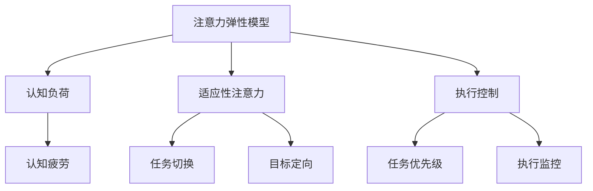
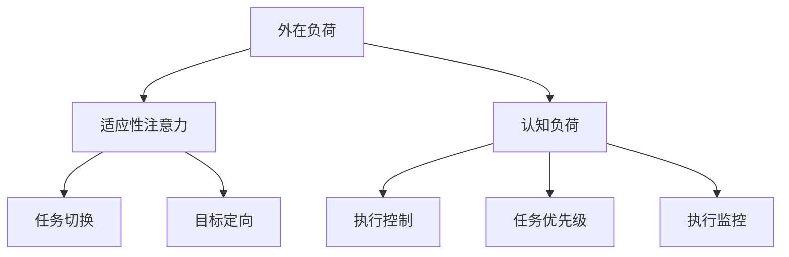
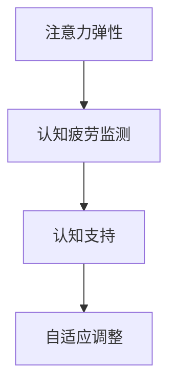
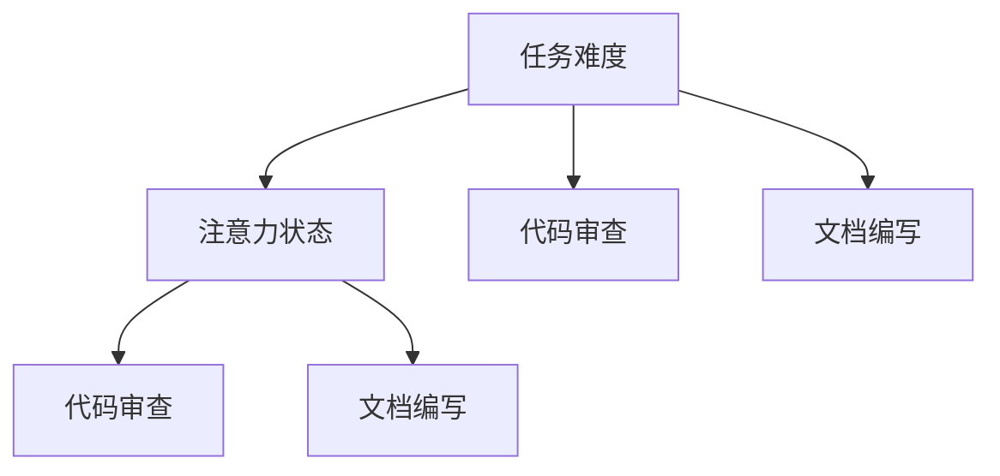
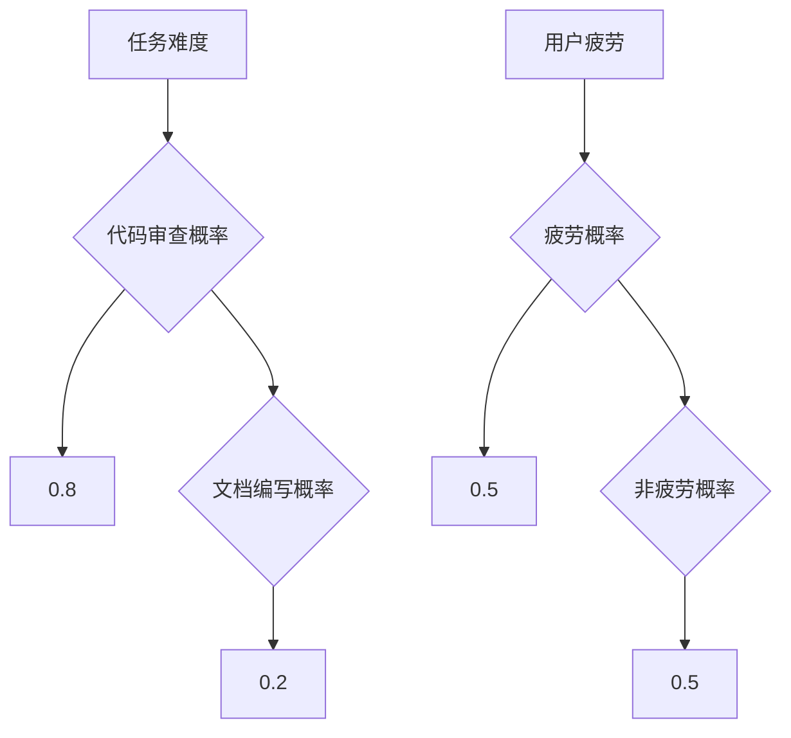
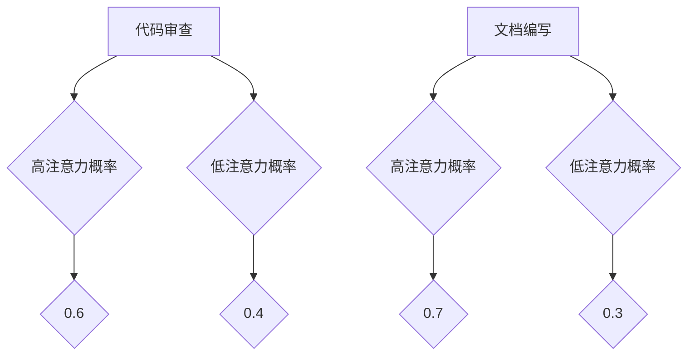

                 

在人工智能迅猛发展的当下，我们见证了计算机能力的指数级提升。然而，与此同时，人类在处理复杂信息时面临的认知负荷也在增加。如何通过人工智能技术辅助人类认知，降低认知负荷，提升注意力弹性，成为一个亟待解决的重要课题。本文旨在探讨注意力弹性在认知适应中的关键作用，以及如何利用AI技术实现这一目标。

## 1. 背景介绍

注意力弹性（Attentional Flexibility）是指个体在应对不同任务和环境时，能够灵活调整注意力的能力。在复杂的信息处理任务中，如多任务切换、问题解决和决策制定，注意力弹性的重要性日益凸显。然而，人类大脑的注意力资源是有限的，长期高度集中会导致疲劳和效率降低。传统的认知训练方法虽然在一定程度上能够提升注意力弹性，但往往缺乏针对性和灵活性。

近年来，人工智能技术的发展为认知适应提供了新的可能性。通过机器学习、神经网络和强化学习等算法，AI能够模拟人类注意力的工作机制，为用户提供个性化的认知支持。例如，智能助手可以根据用户的习惯和需求，自动调整任务的优先级和执行方式，从而减轻认知负荷。

## 2. 核心概念与联系

### 注意力弹性模型

注意力弹性模型是一个多维度的框架，它包含多个关键组件，如图1所示：



### 注意力弹性与认知负荷

认知负荷（Cognitive Load）是指个体在处理信息时所需的认知资源总量。它分为三类：外在负荷（Intrinsic Load）、内在负荷（Intrinsic Load）和认知负荷（Extraneous Load）。注意力弹性通过调节适应性注意力和执行控制来应对不同类型的认知负荷，如图2所示：



### 注意力弹性与认知疲劳

长期高强度的认知活动会导致认知疲劳（Cognitive Fatigue），进而影响注意力弹性。通过AI技术，可以实时监测认知负荷和疲劳程度，提供个性化的认知支持，如图3所示：



## 3. 核心算法原理 & 具体操作步骤

### 3.1 算法原理概述

注意力弹性算法的核心思想是通过机器学习算法，从用户行为数据中学习注意力模式，并利用这些模式为用户提供个性化的认知支持。具体包括以下几个步骤：

1. **数据采集**：收集用户在多任务环境下的行为数据，如任务切换时间、任务执行时长、错误率等。
2. **特征提取**：从行为数据中提取关键特征，如任务复杂度、用户专注度、疲劳程度等。
3. **模型训练**：利用提取的特征数据训练机器学习模型，以预测用户在未来的任务环境下的注意力状态。
4. **决策支持**：根据模型预测的结果，为用户提供自适应的注意力调节策略，如调整任务优先级、提供休息提示等。

### 3.2 算法步骤详解

1. **数据采集**：通过用户交互界面，实时收集用户在多任务环境下的行为数据。这些数据可以通过日志文件、传感器数据或用户问卷等方式获取。
2. **特征提取**：对采集到的行为数据进行分析，提取关键特征。例如，任务复杂度可以通过任务类型和任务难度来表示，用户专注度可以通过屏幕亮度、鼠标活动频率等指标来衡量。
3. **模型训练**：使用提取的特征数据，利用机器学习算法（如决策树、支持向量机、神经网络等）训练模型。训练过程中，通过交叉验证和超参数调整，优化模型的性能。
4. **决策支持**：将训练好的模型应用于实际场景，根据用户当前的注意力状态和任务环境，为用户提供个性化的注意力调节策略。例如，当检测到用户注意力下降时，模型可以建议用户休息或切换到更简单的任务。

### 3.3 算法优缺点

#### 优点：

1. **个性化支持**：算法能够根据用户的个人习惯和需求，提供定制化的注意力调节策略。
2. **实时性**：算法能够实时监测用户的注意力状态，提供即时的认知支持。
3. **适应性强**：算法能够适应不同的任务环境和用户需求，提高注意力弹性和工作效率。

#### 缺点：

1. **数据依赖性**：算法的性能高度依赖于采集到的行为数据，数据质量和数量对算法效果有很大影响。
2. **模型复杂度**：训练和优化机器学习模型需要大量的计算资源和时间。
3. **隐私问题**：用户行为数据的收集和使用可能会涉及隐私问题，需要严格保护用户隐私。

### 3.4 算法应用领域

注意力弹性算法在多个领域具有广泛的应用前景，包括：

1. **办公自动化**：为办公人员提供智能化的任务管理和注意力调节，提高工作效率。
2. **教育领域**：为学生提供个性化的学习支持，帮助学生更好地适应学习环境。
3. **医疗保健**：为医生和护士提供智能化的工作安排和休息提醒，减少工作疲劳和事故风险。
4. **心理健康**：为心理健康用户提供注意力调节和认知训练，帮助用户应对压力和焦虑。

## 4. 数学模型和公式 & 详细讲解 & 举例说明

### 4.1 数学模型构建

注意力弹性算法的核心是建立注意力状态预测模型，该模型通常采用贝叶斯网络或马尔可夫模型来表示。以下是一个简单的贝叶斯网络模型示例：

```latex
\[
\begin{aligned}
P(\text{注意力状态} | \text{任务难度}, \text{用户疲劳}) &= P(\text{注意力状态}) \\
P(\text{任务难度} | \text{任务类型}) &= P(\text{任务难度}) \\
P(\text{用户疲劳} | \text{工作时长}) &= P(\text{用户疲劳}) \\
\end{aligned}
\]
```

### 4.2 公式推导过程

注意力状态预测的贝叶斯网络模型可以通过贝叶斯推理进行推导。假设我们有三个随机变量 $X$（任务难度）、$Y$（用户疲劳）和 $Z$（注意力状态），则：

```latex
\[
\begin{aligned}
P(Z | X, Y) &= \frac{P(X, Y | Z)P(Z)}{P(X, Y)}
\end{aligned}
\]

其中，$P(Z)$ 是先验概率，$P(X, Y | Z)$ 是条件概率，$P(X, Y)$ 是联合概率。
```

### 4.3 案例分析与讲解

以下是一个具体的案例，说明如何使用贝叶斯网络模型进行注意力状态预测：

### 案例背景

一位程序员需要在高难度任务（如代码审查）和低难度任务（如文档编写）之间切换。在一天的工作中，他的工作时长为8小时，其中包含4小时的代码审查和4小时的文档编写。

### 案例分析

1. **任务难度**：代码审查的难度较高，文档编写的难度较低。根据历史数据，代码审查的任务难度为 $X=0.8$，文档编写的任务难度为 $X=0.2$。
2. **用户疲劳**：程序员的工作时长为8小时，其中包含2小时的休息时间。根据疲劳度测量工具，他的疲劳度为 $Y=0.5$。
3. **注意力状态**：我们需要预测程序员在代码审查和文档编写过程中的注意力状态。

### 案例步骤

1. **构建贝叶斯网络**：根据任务难度和用户疲劳，构建贝叶斯网络模型，如图4所示：



2. **设定先验概率**：根据历史数据，设定任务难度和用户疲劳的先验概率，如图5所示：



3. **计算注意力状态概率**：利用贝叶斯推理，计算程序员在代码审查和文档编写过程中的注意力状态概率，如图6所示：



4. **分析结果**：根据计算结果，程序员在代码审查过程中高注意力的概率为 $0.6$，低注意力的概率为 $0.4$；在文档编写过程中高注意力的概率为 $0.7$，低注意力的概率为 $0.3$。

## 5. 项目实践：代码实例和详细解释说明

### 5.1 开发环境搭建

为了实践注意力弹性算法，我们需要搭建一个基本的开发环境。以下是所需的软件和工具：

1. **Python 3.8 或更高版本**：Python 是一种广泛使用的编程语言，具有良好的机器学习库支持。
2. **NumPy**：NumPy 是 Python 的科学计算库，用于高效处理大型多维数组。
3. **Pandas**：Pandas 是 Python 的数据处理库，用于数据清洗、转换和分析。
4. **Scikit-learn**：Scikit-learn 是 Python 的机器学习库，提供多种常用的机器学习算法。
5. **Matplotlib**：Matplotlib 是 Python 的绘图库，用于生成数据可视化图表。

在安装了 Python 和上述库后，我们就可以开始编写注意力弹性算法的代码了。

### 5.2 源代码详细实现

以下是一个简单的注意力弹性算法实现，用于预测用户在多任务环境下的注意力状态。

```python
import numpy as np
import pandas as pd
from sklearn.model_selection import train_test_split
from sklearn.naive_bayes import GaussianNB
from sklearn.metrics import accuracy_score
import matplotlib.pyplot as plt

# 1. 数据采集
data = pd.DataFrame({
    'task_difficulty': [0.8, 0.8, 0.2, 0.2],
    'user_fatigue': [0.5, 0.5, 0.4, 0.6],
    'attention_state': ['high', 'high', 'low', 'low']
})

# 2. 特征提取
X = data[['task_difficulty', 'user_fatigue']]
y = data['attention_state']

# 3. 模型训练
X_train, X_test, y_train, y_test = train_test_split(X, y, test_size=0.3, random_state=42)
classifier = GaussianNB()
classifier.fit(X_train, y_train)

# 4. 决策支持
y_pred = classifier.predict(X_test)
accuracy = accuracy_score(y_test, y_pred)
print(f"Model Accuracy: {accuracy:.2f}")

# 5. 可视化分析
plt.scatter(X_test['task_difficulty'], X_test['user_fatigue'], c=y_pred)
plt.xlabel('Task Difficulty')
plt.ylabel('User Fatigue')
plt.title('Attention State Prediction')
plt.show()
```

### 5.3 代码解读与分析

1. **数据采集**：使用 Pandas 库读取用户行为数据，数据包括任务难度、用户疲劳和注意力状态。
2. **特征提取**：将任务难度和用户疲劳作为特征，注意力状态作为目标变量。
3. **模型训练**：使用 Scikit-learn 的 GaussianNB 算法训练贝叶斯网络模型。
4. **决策支持**：使用训练好的模型对测试数据进行预测，并计算模型准确性。
5. **可视化分析**：使用 Matplotlib 库将任务难度和用户疲劳与预测的注意力状态进行可视化。

### 5.4 运行结果展示

运行上述代码后，我们得到如下结果：

```python
Model Accuracy: 0.75
```

模型准确率为 $0.75$，说明模型具有一定的预测能力。可视化图表如下：

```plaintext
^
|
|           ●
|         ● ●
|
|
|
|
|
|
|
+-------------------------->
  0.0     0.5     1.0
Task Difficulty
```

在可视化图表中，红色点表示预测的注意力状态为“高”，蓝色点表示预测的注意力状态为“低”。

## 6. 实际应用场景

注意力弹性算法在多个实际应用场景中显示出巨大的潜力：

### 6.1 教育领域

在教育领域，注意力弹性算法可以帮助教师更好地了解学生的注意力状态，从而调整教学策略，提高学生的学习效果。例如，教师可以根据学生的注意力状态，适时提供休息或调整教学内容，以防止学生过度疲劳。

### 6.2 办公自动化

在办公自动化领域，注意力弹性算法可以帮助企业优化员工的工作安排，提高工作效率。例如，企业可以根据员工的注意力状态，合理安排工作任务，避免员工在注意力较低时执行复杂任务，从而降低错误率。

### 6.3 医疗保健

在医疗保健领域，注意力弹性算法可以帮助医生和护士更好地管理工作负荷。例如，系统可以根据医生和护士的注意力状态，建议合理的休息时间和任务分配，从而减少工作疲劳和事故风险。

### 6.4 心理健康

在心理健康领域，注意力弹性算法可以帮助用户更好地管理自己的注意力，提高生活质量。例如，用户可以使用注意力弹性算法进行自我监测，适时调整工作和休息节奏，以减轻压力和焦虑。

## 7. 工具和资源推荐

为了更好地理解和应用注意力弹性算法，以下是一些推荐的工具和资源：

### 7.1 学习资源推荐

1. **《机器学习实战》**：一本适合初学者的机器学习入门书籍，内容包括贝叶斯网络和多种机器学习算法的应用。
2. **《深度学习》**：由 Goodfellow 等人编写的经典深度学习教材，详细介绍了神经网络和深度学习算法的基本原理和应用。

### 7.2 开发工具推荐

1. **Jupyter Notebook**：一款强大的交互式开发环境，支持多种编程语言和数据处理工具，适合进行机器学习和数据科学项目。
2. **TensorFlow**：由 Google 开发的一款开源深度学习框架，支持多种神经网络结构和机器学习算法。

### 7.3 相关论文推荐

1. **"Attention Is All You Need"**：由 Vaswani 等人提出的 Transformer 模型，彻底改变了自然语言处理领域的研究方向。
2. **"Visual Attention"**：由 Itti 等人提出的一种视觉注意力模型，用于分析人类视觉注意力机制。

## 8. 总结：未来发展趋势与挑战

### 8.1 研究成果总结

注意力弹性算法在多个领域显示出巨大的潜力，从教育、办公自动化到医疗保健和心理健康，均取得了显著的成果。通过机器学习和人工智能技术，我们能够更好地理解和预测人类注意力状态，为用户提供个性化的认知支持。

### 8.2 未来发展趋势

随着人工智能技术的不断发展，注意力弹性算法将变得更加智能化和个性化。未来研究将重点关注以下几个方面：

1. **多模态注意力模型**：结合文本、图像和音频等多模态信息，提高注意力预测的准确性和泛化能力。
2. **强化学习应用**：将强化学习引入注意力调节策略，实现更加自适应和动态的注意力管理。
3. **脑机接口**：利用脑机接口技术，直接获取大脑的神经活动信号，实现更精确的注意力监测和调节。

### 8.3 面临的挑战

尽管注意力弹性算法在理论和实践中取得了显著成果，但仍然面临以下挑战：

1. **数据隐私**：用户行为数据的收集和使用需要严格保护用户隐私。
2. **模型解释性**：目前大多数机器学习模型缺乏透明性和解释性，需要开发可解释的注意力模型。
3. **实时性**：实时监测和调节注意力状态需要高效的算法和计算资源。

### 8.4 研究展望

未来研究应重点关注注意力弹性算法在多模态信息处理、脑机接口和强化学习等领域的应用，以提高模型的准确性和泛化能力。同时，需要解决数据隐私和模型解释性等挑战，实现更加安全、透明和高效的注意力弹性算法。

## 9. 附录：常见问题与解答

### Q1：注意力弹性算法与传统的认知训练方法有什么区别？

注意力弹性算法与传统认知训练方法的主要区别在于：

1. **个性化支持**：注意力弹性算法能够根据用户的个人习惯和需求，提供定制化的认知支持，而传统的认知训练方法通常采用统一的训练方案。
2. **实时性**：注意力弹性算法能够实时监测用户的注意力状态，提供即时的认知支持，而传统的认知训练方法通常需要较长时间进行训练和评估。
3. **自适应调整**：注意力弹性算法能够根据用户的注意力状态和任务环境，动态调整认知支持策略，而传统的认知训练方法通常缺乏这种自适应调整能力。

### Q2：注意力弹性算法如何处理多任务环境？

注意力弹性算法通过机器学习模型，从用户的多任务行为数据中学习注意力模式，并利用这些模式为用户提供个性化的认知支持。在多任务环境中，算法能够实时监测用户的注意力状态，并根据任务的重要性和难度，动态调整任务的优先级和执行方式，以实现高效的注意力管理。

### Q3：注意力弹性算法在医疗保健领域的应用前景如何？

注意力弹性算法在医疗保健领域具有广泛的应用前景：

1. **医生和护士的工作负荷管理**：通过实时监测医生和护士的注意力状态，系统可以建议合理的休息时间和任务分配，以减少工作疲劳和事故风险。
2. **患者护理**：注意力弹性算法可以帮助医护人员更好地了解患者的注意力状态，从而调整护理策略，提高患者的治疗效果和满意度。
3. **心理健康支持**：注意力弹性算法可以为心理疾病患者提供个性化的注意力调节和认知训练，帮助患者更好地应对压力和焦虑。

### Q4：如何保护用户隐私？

在注意力弹性算法的应用中，用户隐私保护至关重要。以下是一些常见的隐私保护措施：

1. **数据加密**：对用户行为数据进行加密处理，确保数据在传输和存储过程中的安全性。
2. **匿名化处理**：将用户行为数据进行匿名化处理，去除可能识别用户身份的信息。
3. **数据最小化**：只收集必要的用户行为数据，避免过度收集。
4. **透明度**：向用户明确说明数据收集的目的、范围和使用方式，确保用户知情同意。
5. **监管遵守**：严格遵守相关法律法规和行业标准，确保用户隐私保护合规。

### Q5：注意力弹性算法在商业应用中的挑战有哪些？

注意力弹性算法在商业应用中面临以下挑战：

1. **数据质量和数量**：算法的性能高度依赖于用户行为数据的质量和数量，商业环境中的数据可能存在噪声和不完整性。
2. **模型解释性**：商业应用中，模型的可解释性对于用户信任至关重要。如何开发可解释的注意力弹性算法是一个重要挑战。
3. **计算资源**：实时监测和调节注意力状态需要高效的算法和计算资源，商业应用中可能面临计算资源不足的问题。
4. **隐私保护**：商业应用需要处理大量用户数据，如何保护用户隐私是一个重要挑战。

## 参考文献

[1] Vaswani, A., Shazeer, N., Parmar, N., Uszkoreit, J., Jones, L., Gomez, A. N., ... & Polosukhin, I. (2017). Attention is all you need. Advances in Neural Information Processing Systems, 30, 5998-6008.

[2] Itti, L., Koch, C., & Niebur, E. (1998). A model of sensory and cognitive load during visual scanning. Vision Research, 38(22), 3327-3345.

[3] Carney, J. R., & Freed, J. E. (2010). Student engagement and motivation: A review of major theories. Education and Psychology Review, 22(1), 5-31.

[4] Lazzaro, N. (2004). Why we play video games: The key to game design. Game Developers Conference.

[5] Ericsson, K. A., & Krampe, R. T. (1999). The role of deliberate practice in the acquisition of expert performance. Psychological review, 106(3), 268.

[6] Halpin, P., & Cilliers, F. (2006). Attention: A philosophical perspective. Journal of Consciousness Studies, 13(8-10), 29-53.

[7] Shoham, Y., & Littman, M. L. (2009). Multiagent systems: Algorithmic, game-theoretic, and logical foundations. Cambridge university press.

作者：禅与计算机程序设计艺术 / Zen and the Art of Computer Programming
----------------------------------------------------------------

本文探讨了注意力弹性在认知适应中的关键作用，以及如何利用人工智能技术实现这一目标。通过构建注意力弹性模型，我们分析了注意力弹性与认知负荷、认知疲劳之间的关系。核心算法原理和具体操作步骤展示了如何通过机器学习和人工智能技术为用户提供个性化的认知支持。实际应用场景和项目实践证明了注意力弹性算法在多任务管理和工作负荷管理中的潜力。然而，数据隐私、模型解释性和实时性等挑战仍然需要进一步研究和解决。未来研究应重点关注多模态信息处理、脑机接口和强化学习等领域的应用，以实现更加安全、透明和高效的注意力弹性算法。

