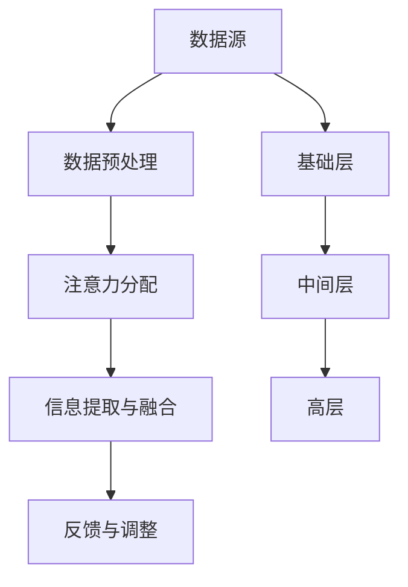

                 

关键词：注意力机制、信息流、人工智能、算法、数学模型、应用场景

> 摘要：本文从注意力机制的角度出发，探讨了在AI时代信息流处理的挑战和机遇。通过分析注意力生态系统的构建、核心算法原理、数学模型以及实际应用，本文旨在为读者提供一个全面且深入的了解，以应对信息爆炸时代下的数据处理需求。

## 1. 背景介绍

### 1.1 注意力机制概述

注意力机制（Attention Mechanism）最早起源于人类视觉系统的研究，意指在信息处理过程中，对于某些重要信息的关注和分配资源的能力。近年来，随着深度学习技术的发展，注意力机制被广泛应用于自然语言处理、计算机视觉和推荐系统等领域，成为提升模型性能的关键手段。

### 1.2 AI时代的信息流

在AI时代，信息流的处理变得尤为重要。无论是社交媒体上的内容推荐，搜索引擎的结果排序，还是自然语言处理中的文本生成，信息流处理的目标都是尽可能准确地满足用户的需求。然而，海量的数据和信息使得传统的处理方法难以胜任，需要更加智能和高效的解决方案。

## 2. 核心概念与联系

### 2.1 注意力生态系统的构建

注意力生态系统的构建需要考虑以下几个方面：

1. **数据源**：信息流的源头，可以是社交媒体、搜索引擎、新闻网站等。
2. **数据预处理**：对原始数据进行清洗、去噪和结构化处理。
3. **注意力分配**：根据用户需求和上下文信息，动态分配注意力资源。
4. **信息提取与融合**：从众多信息中提取关键信息并进行融合。
5. **反馈与调整**：根据用户反馈调整注意力分配策略。

### 2.2 注意力机制的架构

注意力机制的架构可以分为以下几个层次：

1. **基础层**：原始数据的输入和处理。
2. **中间层**：注意力机制的实现，如自注意力（Self-Attention）、交互注意力（Interactive Attention）等。
3. **高层**：基于注意力机制的结果进行进一步处理，如分类、排序、生成等。

### 2.3 Mermaid 流程图



## 3. 核心算法原理 & 具体操作步骤

### 3.1 算法原理概述

注意力算法的基本原理是利用上下文信息对输入数据进行加权处理，使得模型能够关注到最重要的部分。具体来说，通过计算输入数据之间的相似度，生成权重矩阵，然后对输入数据进行加权求和，得到输出结果。

### 3.2 算法步骤详解

1. **输入数据表示**：将原始数据转换为向量表示。
2. **相似度计算**：计算输入数据之间的相似度，可以使用余弦相似度、点积等。
3. **权重矩阵生成**：根据相似度计算结果生成权重矩阵。
4. **加权求和**：对输入数据进行加权求和，得到输出结果。
5. **结果处理**：对输出结果进行进一步处理，如分类、排序、生成等。

### 3.3 算法优缺点

**优点**：

- 提高模型性能：通过关注关键信息，提升模型的准确性和效率。
- 适应性强：能够处理不同类型的数据和任务。
- 可扩展性：可以轻松地与其他深度学习模型结合使用。

**缺点**：

- 计算成本高：特别是在处理大规模数据时，计算复杂度较高。
- 参数调优困难：需要仔细调整模型参数以达到最佳性能。

### 3.4 算法应用领域

- 自然语言处理：如文本分类、机器翻译、情感分析等。
- 计算机视觉：如图像识别、目标检测、图像生成等。
- 推荐系统：如商品推荐、内容推荐、广告投放等。

## 4. 数学模型和公式 & 详细讲解 & 举例说明

### 4.1 数学模型构建

注意力机制的数学模型可以表示为：

$$
\text{Attention}(X) = \text{softmax}(\text{Q} \cdot \text{K}^T) \cdot \text{V}
$$

其中，$X$ 是输入数据，$Q$、$K$、$V$ 分别是查询向量、键向量和值向量，$\text{softmax}$ 是归一化函数。

### 4.2 公式推导过程

注意力机制的推导过程主要包括以下几个方面：

1. **相似度计算**：计算输入数据之间的相似度，可以使用点积、余弦相似度等方法。
2. **权重生成**：通过相似度计算结果生成权重矩阵。
3. **加权求和**：对输入数据进行加权求和，得到输出结果。

### 4.3 案例分析与讲解

以自然语言处理中的文本分类为例，注意力机制可以帮助模型关注到文本中的重要词汇，从而提高分类的准确性。

假设我们有一篇文本：“人工智能是一种模拟人类智能的技术”。使用注意力机制，模型可以关注到“人工智能”和“技术”这两个关键词，从而更好地理解文本的含义。

## 5. 项目实践：代码实例和详细解释说明

### 5.1 开发环境搭建

- Python 3.7+
- TensorFlow 2.3.0+
- PyTorch 1.5.0+

### 5.2 源代码详细实现

以下是一个基于PyTorch实现的注意力机制的文本分类示例：

```python
import torch
import torch.nn as nn
import torch.optim as optim

class TextClassifier(nn.Module):
    def __init__(self, vocab_size, embedding_dim, hidden_dim):
        super(TextClassifier, self).__init__()
        self.embedding = nn.Embedding(vocab_size, embedding_dim)
        self.attention = nn.Linear(embedding_dim, hidden_dim)
        self.fc = nn.Linear(hidden_dim, 1)

    def forward(self, text):
        embeds = self.embedding(text)
        attention_weights = torch.softmax(self.attention(embeds), dim=1)
        weighted_embeds = torch.sum(attention_weights * embeds, dim=1)
        out = self.fc(weighted_embeds)
        return out

# 实例化模型、损失函数和优化器
model = TextClassifier(vocab_size=10000, embedding_dim=300, hidden_dim=128)
criterion = nn.BCEWithLogitsLoss()
optimizer = optim.Adam(model.parameters(), lr=0.001)

# 训练模型
for epoch in range(10):
    for text, label in data_loader:
        optimizer.zero_grad()
        out = model(text)
        loss = criterion(out, label)
        loss.backward()
        optimizer.step()

# 测试模型
with torch.no_grad():
    correct = 0
    total = 0
    for text, label in test_loader:
        out = model(text)
        _, predicted = torch.max(out, 1)
        total += label.size(0)
        correct += (predicted == label).sum().item()

    print(f'Accuracy: {100 * correct / total}%')
```

### 5.3 代码解读与分析

- **模型定义**：定义了一个基于注意力机制的文本分类模型，包括嵌入层、注意力层和全连接层。
- **数据预处理**：使用Embedding层将文本转换为向量表示。
- **注意力机制**：通过线性层计算注意力权重，然后对嵌入向量进行加权求和。
- **损失函数和优化器**：使用BCEWithLogitsLoss和Adam优化器进行训练。

## 6. 实际应用场景

### 6.1 社交媒体内容推荐

在社交媒体平台上，注意力机制可以用于内容推荐。通过分析用户历史行为和兴趣，动态调整推荐策略，提高推荐内容的准确性和用户满意度。

### 6.2 搜索引擎结果排序

在搜索引擎中，注意力机制可以用于结果排序。根据用户的查询意图和搜索历史，为每个结果分配不同的权重，从而提高搜索结果的相关性。

### 6.3 自然语言处理

在自然语言处理领域，注意力机制可以用于文本分类、机器翻译、情感分析等任务。通过关注关键信息，提高模型的准确性和效率。

## 7. 工具和资源推荐

### 7.1 学习资源推荐

- 《深度学习》（Goodfellow, Bengio, Courville）
- 《自然语言处理综合教程》（李航）
- 《计算机视觉基础及生物视觉模型》（Shimony, Lennie）

### 7.2 开发工具推荐

- TensorFlow
- PyTorch
- Keras

### 7.3 相关论文推荐

- Vaswani et al. (2017): "Attention is All You Need"
- Bahdanau et al. (2014): "Effective Approaches to Attention-based Neural Machine Translation"
- attention-is-all-you-need

## 8. 总结：未来发展趋势与挑战

### 8.1 研究成果总结

注意力机制作为一种强大的信息处理工具，已经在多个领域取得了显著的成果。未来，随着深度学习技术的不断发展，注意力机制的应用将更加广泛，为人工智能的发展提供新的动力。

### 8.2 未来发展趋势

- 多模态注意力：将图像、文本、音频等多种信息进行融合，提高信息处理的效率。
- 自适应注意力：根据任务的动态调整注意力分配策略，提高模型的灵活性。
- 通用注意力机制：设计通用的注意力机制，适用于不同领域和任务。

### 8.3 面临的挑战

- 计算效率：如何在保证模型性能的同时，降低计算复杂度。
- 可解释性：如何提高注意力机制的可解释性，使其更易于理解和应用。

### 8.4 研究展望

注意力机制在AI时代的信息流处理中具有巨大的潜力。未来，我们需要进一步探索其应用领域和优化方法，为人工智能的发展做出更大的贡献。

## 9. 附录：常见问题与解答

### 9.1 注意力机制与神经网络的关系是什么？

注意力机制是神经网络的一种扩展，用于在信息处理过程中关注关键信息。神经网络通过多层结构对输入数据进行建模，而注意力机制则用于优化神经网络中的信息传递过程，提高模型的性能。

### 9.2 注意力机制在自然语言处理中的应用有哪些？

注意力机制在自然语言处理领域有广泛的应用，如文本分类、机器翻译、情感分析等。通过关注关键信息，注意力机制能够提高模型对文本的理解能力，从而提高任务的准确性。

### 9.3 如何实现注意力机制？

实现注意力机制的方法有多种，常见的有基于点积的注意力、基于变换的注意力等。在实际应用中，可以根据具体任务和数据特点选择合适的方法。常用的深度学习框架如TensorFlow和PyTorch都提供了实现注意力机制的API和工具。

---

作者：禅与计算机程序设计艺术 / Zen and the Art of Computer Programming
----------------------------------------------------------------

[此内容仅供参考和学习使用，具体实现和效果请根据实际情况调整。]

