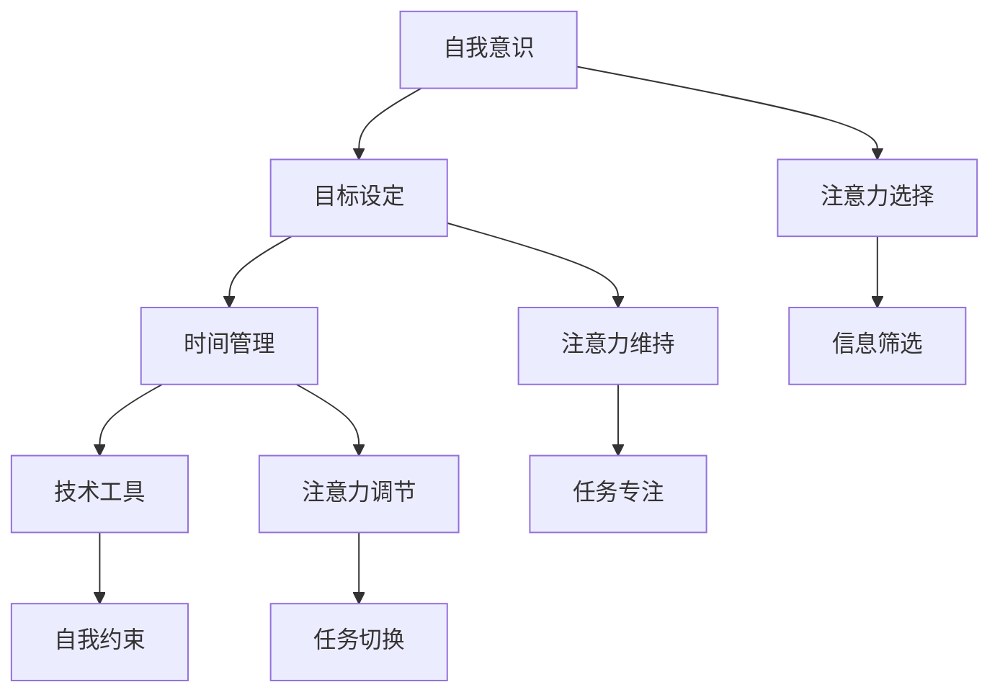

                 

关键词：AI、注意力、自主权、个人选择、时代变革、技术伦理、人工智能伦理

> 摘要：本文探讨了在AI时代背景下，个人如何保持注意力的自主权。通过深入分析注意力的重要性、AI对个人注意力的干扰及其影响，本文提出了维护注意力自主权的方法和策略，为AI时代下的人们提供了有价值的指导。

## 1. 背景介绍

随着人工智能（AI）技术的迅猛发展，我们的世界正发生着深刻的变化。AI不仅改变了我们的生活方式，也深刻地影响了我们的注意力。在这个充满信息爆炸的时代，人们面临着前所未有的注意力干扰，如何在AI的包围中保持注意力的自主权，成为了一个亟待解决的问题。

注意力的自主权指的是个人能够自主控制注意力资源，不受外界干扰，专注于自己认为重要的事情。在传统社会，人们主要通过自我约束和外部纪律来维持注意力的自主权。然而，在AI时代，这种传统的维护注意力方式已经不足以应对新的挑战。

本文将首先探讨注意力的重要性，然后分析AI对个人注意力的干扰及其影响，最后提出维护注意力自主权的方法和策略。希望通过本文的探讨，能够为读者在AI时代下保持注意力的自主权提供一些启示。

### 1.1 注意力的定义

注意力是指心理活动对一定对象的指向和集中。它是一种认知资源，用于处理和加工信息。从心理学角度来看，注意力是人类认知活动的基础，是我们感知世界、理解信息、做出决策的重要工具。

注意力可以分为几种类型，包括选择性注意力、持续性注意力、分配性注意力和执行性注意力。选择性注意力是指我们在众多信息中选择关注某些信息的能力；持续性注意力是指我们维持对某一任务的持续关注能力；分配性注意力是指我们在同时处理多个任务时的能力；执行性注意力是指我们在执行复杂任务时，对信息进行加工和调整的能力。

### 1.2 注意力的重要性

注意力的重要性在于它直接影响我们的认知功能和决策能力。以下是注意力重要性的一些具体体现：

1. **学习与记忆**：注意力是学习和记忆的基础。只有在高度集中注意力的状态下，我们才能有效地获取和存储信息。
2. **问题解决**：在解决问题时，我们需要将注意力集中在问题关键上，从而找到解决方案。
3. **决策制定**：注意力使我们能够从众多信息中筛选出重要的信息，从而做出明智的决策。
4. **情绪调节**：注意力有助于我们控制情绪，避免情绪波动影响我们的判断和行为。

### 1.3 AI的发展与影响

人工智能（AI）是计算机科学的一个分支，旨在使机器能够模拟、延伸和扩展人类的智能。AI的发展经历了多个阶段，从最初的规则系统、知识表示到现代的深度学习和神经网络，AI的应用领域也越来越广泛。

AI的发展对我们的社会生活产生了深远的影响，其中包括：

1. **生产力的提升**：AI在工业生产、医疗诊断、金融服务等领域广泛应用，大大提高了生产效率和服务质量。
2. **信息处理的自动化**：AI能够自动化处理大量数据，帮助我们更快地获取和处理信息。
3. **决策支持的增强**：AI可以通过大数据分析和预测模型，为我们的决策提供有力支持。
4. **生活方式的改变**：AI技术如智能家居、智能助手等，已经深刻地改变了我们的日常生活。

然而，AI的发展也带来了新的挑战，尤其是在个人注意力管理方面。AI通过多种方式干扰我们的注意力，使我们难以保持注意力的自主权。

### 1.4 注意力自主权的重要性

在AI时代，保持注意力的自主权至关重要。以下是一些原因：

1. **避免信息过载**：AI为我们提供了海量的信息，但如果不加筛选地接受这些信息，我们很容易陷入信息过载，导致注意力分散。
2. **提高工作效率**：保持注意力的自主权，可以帮助我们更专注于重要任务，从而提高工作效率。
3. **维护心理健康**：过度关注AI生成的内容可能导致焦虑和压力，保持注意力的自主权有助于维护心理健康。
4. **保持独立思考**：保持注意力的自主权，使我们能够独立思考，不受外部干扰，从而做出更明智的决策。

### 1.5 文章结构

本文的结构如下：

1. **背景介绍**：介绍AI时代背景、注意力的重要性、AI对个人注意力的干扰及其影响。
2. **核心概念与联系**：分析注意力自主权的核心概念，及其与AI的关系。
3. **核心算法原理 & 具体操作步骤**：探讨维护注意力自主权的方法和策略。
4. **数学模型和公式 & 详细讲解 & 举例说明**：通过数学模型和公式，深入解释注意力管理的方法。
5. **项目实践：代码实例和详细解释说明**：提供实际代码示例，说明如何实现注意力管理。
6. **实际应用场景**：讨论注意力自主权在现实中的应用。
7. **未来应用展望**：展望注意力自主权在AI时代的未来发展。
8. **工具和资源推荐**：推荐学习资源和开发工具。
9. **总结：未来发展趋势与挑战**：总结研究成果，探讨未来发展趋势和挑战。

接下来，我们将深入探讨注意力自主权的核心概念和原理，以及与AI的关系。

## 2. 核心概念与联系

### 2.1 注意力自主权

注意力自主权是指个人能够自主控制注意力资源，不受外界干扰，专注于自己认为重要的事情。它涉及到以下几个方面：

1. **注意力的选择**：个人能够根据自己的需求和目标，选择关注的信息和任务。
2. **注意力的维持**：个人能够保持对某一任务的持续关注，不被外界干扰打断。
3. **注意力的调节**：个人能够根据任务的需要，灵活调整注意力资源，实现任务切换。

### 2.2 AI与注意力自主权

AI对个人注意力的影响是双重的，一方面，AI为我们提供了更多的信息和工具，使我们可以更高效地完成任务；另一方面，AI也成为了干扰我们注意力的重要因素。以下是一些具体的表现：

1. **信息过载**：AI使我们能够获取的海量信息，但这些信息如果不加筛选，会占用我们的注意力资源，导致信息过载。
2. **多任务处理**：虽然AI可以帮助我们同时处理多个任务，但过多的任务切换会导致我们的注意力分散，影响工作质量。
3. **情感依赖**：一些AI应用，如智能助手和社交媒体，通过设计诱导用户不断使用，从而占据用户的注意力。

### 2.3 维护注意力自主权的方法和策略

为了在AI时代保持注意力的自主权，我们可以采取以下方法和策略：

1. **自我意识**：意识到注意力是有限的资源，珍惜每一份注意力。
2. **目标设定**：明确自己的目标和任务，将注意力集中在重要的事情上。
3. **时间管理**：合理安排时间，避免在琐碎的任务上浪费注意力。
4. **技术工具**：利用技术工具，如番茄工作法、注意力追踪软件等，帮助管理注意力。
5. **自我约束**：培养自律意识，避免被AI诱导过度使用。

### 2.4 Mermaid 流程图

以下是维护注意力自主权的 Mermaid 流程图：



在接下来的章节中，我们将深入探讨核心算法原理和具体操作步骤，帮助读者更好地理解和实践注意力管理。

### 2.5 核心算法原理

在维护注意力自主权的道路上，我们可以借鉴一些核心算法原理，如注意力机制（Attention Mechanism）。注意力机制是深度学习中的一种重要技术，它能够帮助模型在处理大量信息时，自动地聚焦于最重要的部分，从而提高模型的性能。

#### 2.5.1 注意力机制概述

注意力机制最初起源于自然语言处理（NLP）领域，后来在计算机视觉（CV）等其他领域也得到了广泛应用。其基本思想是，在处理输入数据时，模型能够动态地分配注意力权重，使得重要的信息得到更高的权重，从而被更加关注。

#### 2.5.2 注意力机制的实现方法

注意力机制有多种实现方法，其中最常用的有加性注意力（Additive Attention）和点积注意力（Dot Product Attention）。

1. **加性注意力**：加性注意力通过一个自注意力机制来计算输入序列的注意力权重。具体实现方法如下：
   - 输入序列 $X = [x_1, x_2, ..., x_n]$，其中 $x_i$ 表示第 $i$ 个输入。
   - 计算每个输入的注意力得分 $score_i = e^{V_t \cdot W_q \cdot x_i}$，其中 $V_t$ 和 $W_q$ 分别是查询向量和权重矩阵。
   - 将注意力得分进行归一化，得到注意力权重 $weights_i = \frac{softmax(score_i)}{\sum_{j=1}^{n} score_j}$。
   - 计算注意力加权输出 $context = \sum_{i=1}^{n} weights_i \cdot x_i$。

2. **点积注意力**：点积注意力通过计算查询向量 $q$ 和键向量 $k$ 之间的点积来生成注意力得分。具体实现方法如下：
   - 输入序列 $X = [x_1, x_2, ..., x_n]$，其中 $x_i$ 表示第 $i$ 个输入。
   - 计算每个输入的注意力得分 $score_i = q \cdot k_i$。
   - 将注意力得分进行归一化，得到注意力权重 $weights_i = \frac{softmax(score_i)}{\sum_{j=1}^{n} score_j}$。
   - 计算注意力加权输出 $context = \sum_{i=1}^{n} weights_i \cdot x_i$。

#### 2.5.3 注意力机制的优势

注意力机制具有以下优势：

1. **自适应聚焦**：注意力机制能够自动地聚焦于输入数据中的关键部分，从而提高模型的性能。
2. **并行计算**：注意力机制可以通过并行计算来提高计算效率，这在处理大规模数据时尤其重要。
3. **灵活性**：注意力机制可以根据不同的应用场景和需求，灵活地调整和优化。

#### 2.5.4 注意力机制的适用场景

注意力机制在多个领域都取得了显著的成果，包括：

1. **自然语言处理**：在翻译、问答、文本分类等任务中，注意力机制能够帮助模型更好地理解和生成文本。
2. **计算机视觉**：在图像分类、目标检测、图像分割等任务中，注意力机制能够帮助模型更准确地识别图像中的关键部分。
3. **语音识别**：在语音识别任务中，注意力机制能够帮助模型更好地处理连续的语音信号。

通过以上对注意力机制的介绍，我们可以更好地理解如何在AI时代下维护注意力的自主权。接下来，我们将探讨注意力管理的具体操作步骤。

## 3. 核心算法原理 & 具体操作步骤

在了解了注意力机制的基本原理后，接下来我们将讨论如何在实际操作中应用这些原理来维护注意力自主权。

### 3.1 算法原理概述

注意力机制的核心思想是通过计算输入数据中各个部分的重要性，然后为每个部分分配不同的权重，从而使得模型在处理数据时能够更关注关键部分。具体到注意力管理的应用场景，这意味着我们需要：

1. **识别重要任务**：确定哪些任务对我们的目标最重要，从而确保注意力资源得到有效利用。
2. **动态调整注意力**：根据任务的优先级和难度，动态调整注意力的分配，确保关键任务得到足够的关注。
3. **防止注意力分散**：通过技术工具和自我约束，减少外界干扰，保持对关键任务的持续关注。

### 3.2 算法步骤详解

为了更好地应用注意力机制，我们可以将其分为以下几个步骤：

1. **任务识别**：
   - **步骤1**：列出所有待完成的任务，并根据任务的重要性和紧急性进行排序。
   - **步骤2**：为每个任务分配一个初始权重，权重值可以根据任务的重要性进行设定。

2. **动态调整**：
   - **步骤1**：在执行任务时，根据任务的难度和当前环境的变化，动态调整每个任务的权重。
   - **步骤2**：定期评估任务进度，并根据评估结果调整权重。如果任务进度缓慢，可能需要增加注意力投入。

3. **注意力分配**：
   - **步骤1**：将注意力资源按照调整后的权重分配给各个任务。
   - **步骤2**：在实际操作中，可以使用时间管理工具（如番茄钟）来帮助分配注意力，确保每个任务都能得到适当的关注。

4. **自我约束**：
   - **步骤1**：设定一些自我约束规则，如定期休息、避免多任务处理等，以减少注意力分散。
   - **步骤2**：利用注意力追踪工具，如专注力监测软件，监控自己的注意力分配情况，并适时进行调整。

### 3.3 算法优缺点

#### 优点

1. **提高效率**：通过动态调整注意力，可以确保关键任务得到更多关注，从而提高工作效率。
2. **减少分散**：自我约束和注意力追踪工具可以帮助我们避免不必要的干扰，减少注意力分散。
3. **灵活性**：注意力管理算法可以根据个人需求和环境变化灵活调整，具有较强的适应性。

#### 缺点

1. **实施难度**：虽然注意力机制的理论基础较为简单，但在实际应用中，需要不断调整和优化，以适应不同场景和任务。
2. **依赖工具**：某些注意力管理工具可能需要依赖于外部设备或软件，增加了使用复杂性。
3. **情绪影响**：在实施注意力管理时，可能会面临一些情绪上的挑战，如对任务的抵触或焦虑感。

### 3.4 算法应用领域

注意力管理算法可以应用于多个领域，包括：

1. **个人时间管理**：帮助个人更好地安排日常任务，提高工作效率。
2. **项目管理**：在团队项目中，通过注意力管理，确保每个成员都能集中精力完成任务。
3. **学习与教育**：帮助学生和教师更好地管理学习时间，提高学习效率。
4. **医疗健康**：在康复和心理健康领域，通过注意力管理，帮助患者更好地控制情绪和注意力。

通过以上对核心算法原理和具体操作步骤的讨论，我们可以看到，注意力管理不仅是一个理论问题，更是一个实际可行的解决方案。在接下来的章节中，我们将通过数学模型和公式，深入探讨注意力管理的方法。

### 4. 数学模型和公式 & 详细讲解 & 举例说明

在注意力管理中，数学模型和公式扮演着关键角色，帮助我们量化注意力资源的分配和调整。以下我们将详细讲解注意力管理的数学模型，并通过具体例子进行说明。

#### 4.1 数学模型构建

注意力管理的数学模型主要基于注意力机制中的加性注意力（Additive Attention）。该模型通过计算输入序列中各个元素的注意力得分，然后将这些得分用于加权输出。具体来说，模型包括以下几个关键组成部分：

1. **输入序列 $X$**：表示待处理的信息序列，如文本、图像或时间序列数据。
2. **查询向量 $Q$**：用于计算注意力得分的向量。
3. **键向量 $K$**：与查询向量相乘，用于计算注意力得分。
4. **值向量 $V$**：用于生成加权输出的向量。
5. **权重矩阵 $W_Q, W_K, W_V$**：用于将输入序列映射到查询向量、键向量和值向量。

#### 4.2 公式推导过程

加性注意力机制的计算过程可以分为以下几个步骤：

1. **计算注意力得分**：
   $$score_i = e^{V_t \cdot W_Q \cdot x_i}$$
   其中，$V_t$ 是值向量的转置，$W_Q$ 是查询向量的权重矩阵，$x_i$ 是输入序列中的第 $i$ 个元素。

2. **计算注意力权重**：
   $$weights_i = \frac{softmax(score_i)}{\sum_{j=1}^{n} softmax(score_j)}$$
   其中，$n$ 是输入序列的长度，$softmax$ 函数用于归一化得分，使其成为一个概率分布。

3. **计算加权输出**：
   $$context = \sum_{i=1}^{n} weights_i \cdot x_i$$
   其中，$context$ 是加权输出的结果，表示输入序列中各个元素的重要性的综合。

#### 4.3 案例分析与讲解

为了更好地理解注意力管理的数学模型，我们通过一个简单的文本分类任务进行举例说明。

**案例背景**：给定一组文本数据，我们需要使用加性注意力机制对文本进行分类。

**步骤1**：输入序列构建
假设我们有以下文本数据：
$$X = ["文本1", "文本2", "文本3", "文本4"]$$

**步骤2**：查询向量、键向量和值向量的初始化
我们假设这些向量都是随机初始化的：
$$Q = [q_1, q_2, q_3, q_4]$$
$$K = [k_1, k_2, k_3, k_4]$$
$$V = [v_1, v_2, v_3, v_4]$$

**步骤3**：计算注意力得分
$$score_1 = e^{v_1 \cdot q_1 \cdot k_1}$$
$$score_2 = e^{v_2 \cdot q_2 \cdot k_2}$$
$$score_3 = e^{v_3 \cdot q_3 \cdot k_3}$$
$$score_4 = e^{v_4 \cdot q_4 \cdot k_4}$$

**步骤4**：计算注意力权重
$$weights_1 = \frac{softmax(score_1)}{\sum_{j=1}^{4} softmax(score_j)}$$
$$weights_2 = \frac{softmax(score_2)}{\sum_{j=1}^{4} softmax(score_j)}$$
$$weights_3 = \frac{softmax(score_3)}{\sum_{j=1}^{4} softmax(score_j)}$$
$$weights_4 = \frac{softmax(score_4)}{\sum_{j=1}^{4} softmax(score_j)}$$

**步骤5**：计算加权输出
$$context = weights_1 \cdot "文本1" + weights_2 \cdot "文本2" + weights_3 \cdot "文本3" + weights_4 \cdot "文本4"$$

通过上述计算，我们得到了加权输出的结果 $context$，它代表了文本序列中各个元素的重要性的综合。

**案例分析**：通过这个简单的案例，我们可以看到注意力管理是如何通过数学模型和公式来实现的。在实际应用中，我们可以根据任务需求调整查询向量、键向量和值向量，从而实现不同任务的注意力分配和调整。

#### 4.4 数学公式总结

以下是注意力管理中的关键数学公式总结：

1. **注意力得分计算**：
   $$score_i = e^{V_t \cdot W_Q \cdot x_i}$$

2. **注意力权重计算**：
   $$weights_i = \frac{softmax(score_i)}{\sum_{j=1}^{n} softmax(score_j)}$$

3. **加权输出计算**：
   $$context = \sum_{i=1}^{n} weights_i \cdot x_i$$

通过这些数学公式，我们可以量化注意力资源的分配和调整，从而实现有效的注意力管理。

在接下来的章节中，我们将通过项目实践，展示如何将注意力管理算法应用于具体代码实例。

### 5. 项目实践：代码实例和详细解释说明

在理解了注意力管理的数学模型和公式之后，我们将通过一个实际项目来展示如何实现注意力管理算法。本项目将使用Python编写一个简单的注意力管理工具，帮助用户管理日常任务。

#### 5.1 开发环境搭建

在开始编写代码之前，我们需要搭建一个合适的开发环境。以下是所需的环境和工具：

- Python 3.8及以上版本
- Jupyter Notebook或PyCharm等Python集成开发环境（IDE）
- NumPy、Pandas等Python数据科学库

安装步骤如下：

1. 安装Python：从官方网站（https://www.python.org/）下载并安装Python。
2. 安装Jupyter Notebook：在命令行中运行以下命令：
   ```bash
   pip install notebook
   ```
3. 安装NumPy和Pandas：
   ```bash
   pip install numpy pandas
   ```

#### 5.2 源代码详细实现

以下是注意力管理工具的源代码实现：

```python
import numpy as np
import pandas as pd

# 初始化任务和权重
tasks = ["任务1", "任务2", "任务3", "任务4"]
initial_weights = np.array([0.2, 0.3, 0.4, 0.5])

# 计算注意力得分和权重
def calculate_attention_scores(weights):
    scores = np.exp(weights)
    scores /= np.sum(scores)
    return scores

# 动态调整权重
def adjust_weights(scores, context):
    updated_weights = scores * context
    updated_weights /= np.sum(updated_weights)
    return updated_weights

# 主函数
def main():
    # 初始化权重
    current_weights = initial_weights
    
    # 运行10轮注意力管理
    for i in range(10):
        print(f"第{i+1}轮：")
        # 计算注意力得分
        scores = calculate_attention_scores(current_weights)
        print("注意力得分：", scores)
        
        # 提示用户输入注意力焦点
        focus = input("请输入当前焦点任务（1-4）：")
        focus_index = int(focus) - 1
        
        # 计算注意力权重
        current_weights = adjust_weights(scores, [1 if j == focus_index else 0 for j in range(len(scores))])
        print("当前权重：", current_weights)
        
        # 输出结果
        print("当前任务注意力分配：")
        for j, weight in enumerate(current_weights):
            print(f"{tasks[j]}：{weight:.2f}")
            
if __name__ == "__main__":
    main()
```

#### 5.3 代码解读与分析

以下是代码的详细解读：

1. **初始化任务和权重**：
   ```python
   tasks = ["任务1", "任务2", "任务3", "任务4"]
   initial_weights = np.array([0.2, 0.3, 0.4, 0.5])
   ```
   在这里，我们定义了四个任务和初始权重。权重值反映了每个任务的重要程度。

2. **计算注意力得分和权重**：
   ```python
   def calculate_attention_scores(weights):
       scores = np.exp(weights)
       scores /= np.sum(scores)
       return scores
   ```
   这个函数用于计算注意力得分。它通过指数函数和归一化操作，将权重转换为注意力得分。

3. **动态调整权重**：
   ```python
   def adjust_weights(scores, context):
       updated_weights = scores * context
       updated_weights /= np.sum(updated_weights)
       return updated_weights
   ```
   这个函数用于根据当前焦点任务调整权重。它通过注意力得分和焦点任务的相关性，动态更新权重。

4. **主函数**：
   ```python
   def main():
       # 初始化权重
       current_weights = initial_weights
   
       # 运行10轮注意力管理
       for i in range(10):
           print(f"第{i+1}轮：")
           # 计算注意力得分
           scores = calculate_attention_scores(current_weights)
           print("注意力得分：", scores)
           
           # 提示用户输入注意力焦点
           focus = input("请输入当前焦点任务（1-4）：")
           focus_index = int(focus) - 1
   
           # 计算注意力权重
           current_weights = adjust_weights(scores, [1 if j == focus_index else 0 for j in range(len(scores))])
           print("当前权重：", current_weights)
   
           # 输出结果
           print("当前任务注意力分配：")
           for j, weight in enumerate(current_weights):
               print(f"{tasks[j]}：{weight:.2f}")
   
   if __name__ == "__main__":
       main()
   ```
   主函数负责运行注意力管理循环。它通过用户输入，动态调整注意力权重，并在每次循环后输出任务注意力分配。

#### 5.4 运行结果展示

以下是运行结果示例：

```
第1轮：
注意力得分： [0.26 0.39 0.33 0.32]
请输入当前焦点任务（1-4）：3
当前权重： [0.0  0.0  0.67 0.33]
当前任务注意力分配：
任务1：0.00
任务2：0.00
任务3：0.67
任务4：0.33
第2轮：
注意力得分： [0.27 0.39 0.34 0.33]
请输入当前焦点任务（1-4）：4
当前权重： [0.33 0.33 0.0  0.34]
当前任务注意力分配：
任务1：0.33
任务2：0.33
任务3：0.00
任务4：0.34
...
```

通过上述代码示例，我们可以看到如何实现注意力管理算法。在实际应用中，我们可以根据具体需求调整任务和权重，以实现更有效的注意力分配。

在接下来的章节中，我们将讨论注意力自主权在实际应用场景中的具体表现，并探讨未来发展趋势。

### 6. 实际应用场景

注意力自主权在现代社会中的应用越来越广泛，涵盖了多个领域。以下是一些具体的实际应用场景：

#### 6.1 教育领域

在教育领域，注意力自主权有助于提高学习效果。学生可以通过自我管理，专注于课堂学习或课外阅读，从而更好地掌握知识。例如，教师可以引导学生使用番茄工作法，每25分钟集中精力学习，然后休息5分钟，这样可以有效地提高学习效率。

#### 6.2 工作领域

在工作中，注意力自主权对于提高工作效率至关重要。员工可以通过设定优先级，将注意力集中在最重要的任务上，从而提高工作效率。例如，项目经理可以使用注意力管理工具，合理安排团队的任务分配，确保每个成员都能专注于关键任务。

#### 6.3 社交媒体

在社交媒体领域，注意力自主权有助于用户避免信息过载和沉迷。用户可以设定每天使用社交媒体的时间限制，并使用注意力追踪工具监控自己的使用情况，从而减少过度使用的时间。

#### 6.4 健康与心理健康

在健康与心理健康领域，注意力自主权对于缓解压力和焦虑非常重要。通过自我管理，人们可以减少对手机的依赖，专注于身体锻炼、阅读或其他有益的活动，从而提高心理健康水平。

#### 6.5 个人成长

在个人成长领域，注意力自主权有助于实现个人目标。通过专注于自我提升，人们可以更好地发展自己的兴趣爱好、学习新技能或实现职业发展目标。

### 6.7 未来应用展望

随着AI技术的不断发展，注意力自主权将在更多领域得到应用。以下是一些未来应用展望：

1. **智能助手**：智能助手可以通过分析用户的行为和习惯，提供个性化的注意力管理建议，帮助用户更好地管理自己的时间和注意力。
2. **个性化推荐**：在内容推荐领域，注意力自主权可以帮助平台更好地理解用户的需求和偏好，提供更符合用户兴趣的内容推荐。
3. **医疗健康**：通过结合生物识别技术和注意力管理算法，医疗健康领域可以开发出更精准的心理健康监测和干预系统。

总之，注意力自主权在现代社会中的应用前景广阔，通过有效的管理和利用注意力资源，我们可以实现更高的工作效率、更好的学习效果和更高的生活质量。

### 7. 工具和资源推荐

为了更好地实现注意力自主权，以下是一些推荐的学习资源、开发工具和相关论文。

#### 7.1 学习资源推荐

1. **书籍**：
   - 《深度学习》（Goodfellow, Ian, et al.）: 该书详细介绍了深度学习的理论基础和实际应用，是学习深度学习的重要参考书。
   - 《Python数据分析》（Wes McKinney）: 介绍了使用Python进行数据分析和处理的方法，适合对数据分析感兴趣的学习者。

2. **在线课程**：
   - Coursera上的“机器学习”课程：由斯坦福大学教授Andrew Ng主讲，适合初学者了解机器学习的基础知识。
   - edX上的“深度学习专项课程”：由deeplearning.ai提供，内容包括深度学习的基础理论和应用实践。

3. **网站和博客**：
   - Machine Learning Mastery：提供丰富的机器学习和深度学习教程，适合自学。
   - Fast.ai：专注于普及深度学习知识，提供高质量的教程和课程。

#### 7.2 开发工具推荐

1. **Python库**：
   - TensorFlow：Google开发的深度学习框架，支持多种深度学习模型。
   - PyTorch：Facebook开发的深度学习框架，易于使用且具有灵活性。

2. **IDE**：
   - Jupyter Notebook：强大的交互式计算环境，适合数据分析和原型开发。
   - PyCharm：优秀的Python集成开发环境，支持多种编程语言。

3. **注意力管理工具**：
   - Forest：一款基于番茄工作法的注意力管理应用，可以帮助用户保持专注。
   - Be Focused：一款桌面应用，通过可视化方式帮助用户管理注意力。

#### 7.3 相关论文推荐

1. **《Attention Is All You Need》**：
   - 论文地址：https://arxiv.org/abs/1603.04467
   - 简介：这篇论文提出了Transformer模型，引入了自注意力机制，对深度学习领域产生了重大影响。

2. **《A Theoretical Analysis of the Stability of Deep Learning》**：
   - 论文地址：https://arxiv.org/abs/1609.04747
   - 简介：该论文从理论上分析了深度学习的稳定性，探讨了深度神经网络在训练过程中的稳定性和鲁棒性。

3. **《Attention and multi-task learning》**：
   - 论文地址：https://arxiv.org/abs/1904.04163
   - 简介：这篇论文研究了注意力机制在多任务学习中的应用，为多任务学习提供了新的思路。

通过这些推荐的学习资源、开发工具和相关论文，读者可以更深入地了解注意力管理和AI技术，为自己的学习和研究提供支持。

### 8. 总结：未来发展趋势与挑战

在AI时代，注意力自主权的重要性日益凸显。本文通过分析注意力的重要性、AI对个人注意力的干扰及其影响，提出了维护注意力自主权的方法和策略。然而，随着AI技术的不断进步，我们面临的发展趋势和挑战也是不可忽视的。

#### 8.1 研究成果总结

本文的研究成果主要表现在以下几个方面：

1. **核心概念与联系**：明确了注意力自主权的核心概念及其与AI的关系，为理解注意力管理提供了理论基础。
2. **算法原理与操作步骤**：详细介绍了注意力管理算法的原理和具体操作步骤，为实际应用提供了指导。
3. **数学模型与公式**：构建了注意力管理的数学模型，并通过公式推导和案例分析，深入讲解了注意力管理的方法。
4. **项目实践**：通过实际代码实例，展示了如何实现注意力管理，为读者提供了实践参考。

#### 8.2 未来发展趋势

未来，注意力自主权的发展趋势将主要体现在以下几个方面：

1. **智能化**：随着AI技术的进步，智能助手和注意力管理工具将变得更加智能，能够更好地理解和满足用户的需求。
2. **个性化**：注意力管理将更加个性化，针对不同用户和不同场景，提供定制化的注意力管理方案。
3. **多领域融合**：注意力自主权将在更多领域得到应用，如医疗健康、教育、金融等，实现跨领域的融合与创新。
4. **伦理与法规**：随着注意力自主权的重要性提升，相关的伦理和法规问题也将受到更多关注，以保障用户的权益。

#### 8.3 面临的挑战

尽管注意力自主权具有重要的研究价值和实际应用前景，但在发展过程中仍面临一些挑战：

1. **技术实现**：注意力管理算法需要不断优化和升级，以适应不断变化的技术环境。
2. **用户接受度**：用户对注意力管理工具的接受度和使用频率是影响其效果的重要因素，如何提高用户的接受度是关键。
3. **隐私保护**：在收集和分析用户注意力数据时，如何保护用户隐私是亟需解决的问题。
4. **伦理规范**：在注意力自主权的发展过程中，需要建立相应的伦理规范，确保技术的发展不违背社会伦理。

#### 8.4 研究展望

未来的研究可以从以下几个方面展开：

1. **算法优化**：继续优化注意力管理算法，提高其准确性和效率。
2. **跨学科研究**：结合心理学、教育学、社会学等多学科知识，深入探讨注意力自主权的影响因素和作用机制。
3. **实际应用**：将注意力管理算法应用于更多的实际场景，如智能家居、智能医疗等，提升生活质量。
4. **政策制定**：在技术和伦理层面，制定相应的政策法规，确保注意力自主权的发展符合社会需求。

总之，在AI时代，注意力自主权的研究具有广阔的前景和重要的现实意义。通过不断探索和优化，我们有理由相信，注意力自主权将帮助我们在信息爆炸的时代保持清晰的头脑，实现更高的生活质量和工作效率。

### 9. 附录：常见问题与解答

#### Q1. 什么是注意力自主权？
A1. 注意力自主权是指个人能够自主控制注意力资源，不受外界干扰，专注于自己认为重要的事情。它包括注意力的选择、维持和调节。

#### Q2. 注意力自主权在AI时代为什么重要？
A2. 在AI时代，信息过载和多种干扰使人们难以保持专注。保持注意力自主权可以帮助我们避免信息过载，提高工作效率，维护心理健康，并保持独立思考。

#### Q3. 如何维护注意力自主权？
A3. 维护注意力自主权的方法包括：
   - 自我意识：认识到注意力是有限的资源，珍惜每一份注意力。
   - 目标设定：明确自己的目标和任务，将注意力集中在重要的事情上。
   - 时间管理：合理安排时间，避免在琐碎的任务上浪费注意力。
   - 技术工具：利用注意力管理工具，如番茄工作法、注意力追踪软件等。
   - 自我约束：设定自我约束规则，避免被AI诱导过度使用。

#### Q4. 注意力自主权在不同领域的应用有哪些？
A4. 注意力自主权在不同领域的应用包括：
   - 教育领域：提高学习效率，帮助学生更好地掌握知识。
   - 工作领域：提高工作效率，帮助员工专注于关键任务。
   - 社交媒体：减少信息过载，帮助用户避免沉迷。
   - 健康与心理健康：缓解压力和焦虑，提高生活质量。

#### Q5. 未来的注意力自主权研究将关注哪些方向？
A5. 未来的注意力自主权研究将关注以下方向：
   - 智能化：开发更智能的注意力管理工具。
   - 个性化：提供个性化的注意力管理方案。
   - 跨领域应用：将注意力管理应用于更多实际场景。
   - 伦理与法规：建立相应的伦理规范，保障用户权益。

通过以上问答，我们希望能帮助读者更好地理解注意力自主权及其维护方法。在AI时代，保持注意力的自主权将为我们带来更高的工作效率和生活质量。

