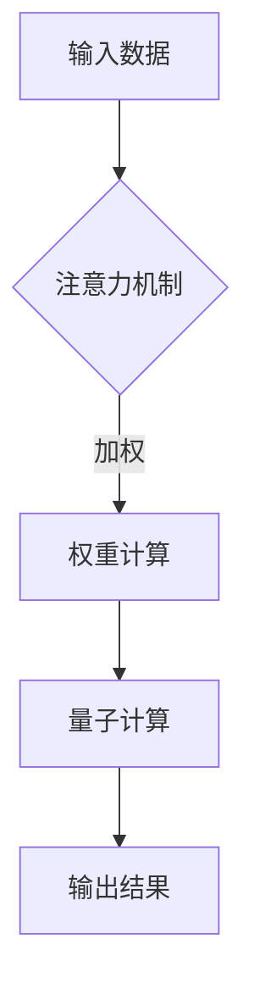

                 

关键词：注意力机制、多任务处理、量子计算、神经网络、AI、深度学习

> 摘要：本文深入探讨了注意力机制在AI时代的多任务处理中的应用，通过介绍量子计算与神经网络相结合的理论基础，探讨了基于量子态的注意力模型，分析了其在实际应用场景中的优势和挑战。文章还展望了未来多任务处理技术的发展趋势。

## 1. 背景介绍

随着互联网的普及和大数据的爆发，AI技术在各个领域的应用日益广泛。然而，传统的单任务AI模型在面对复杂、多变的任务时往往表现出不足。如何实现AI模型的多任务处理能力，成为当前研究的热点。近年来，注意力机制在自然语言处理、计算机视觉等领域取得了显著的成果，其核心思想是通过关注任务中的关键信息，提高模型的处理效率和准确性。

量子计算作为下一代计算技术，具有超强的并行计算能力和高度优化的问题求解能力。将量子计算与注意力机制相结合，有望突破传统AI多任务处理的瓶颈，实现更高效的计算。本文将介绍注意力机制、量子计算的基础理论，并探讨基于量子态的注意力模型在多任务处理中的应用。

## 2. 核心概念与联系

### 2.1 注意力机制

注意力机制（Attention Mechanism）是一种通过动态调整模型对输入数据的关注程度，从而提高模型处理效率和准确性的方法。其核心思想是将输入数据的某些部分赋予更高的权重，使模型能够更好地捕捉关键信息。

### 2.2 量子计算

量子计算（Quantum Computing）是一种基于量子力学原理的新型计算模式。量子计算机利用量子比特（Qubit）进行计算，具有超强的并行计算能力和高度优化的问题求解能力。

### 2.3 注意力与量子计算的联系

量子计算与注意力机制在处理信息方面有相似之处。注意力机制通过动态调整对输入数据的关注程度，实现信息的高效处理；而量子计算通过量子比特的叠加态和纠缠态，实现信息的并行处理。本文将探讨如何将注意力机制与量子计算相结合，构建基于量子态的注意力模型。

### 2.4 Mermaid 流程图



## 3. 核心算法原理 & 具体操作步骤

### 3.1 算法原理概述

基于量子态的注意力模型通过将输入数据映射到量子态，利用量子计算实现信息的高效处理。具体操作步骤如下：

1. 输入数据预处理：对输入数据进行编码，将其映射到量子态空间。
2. 权重计算：利用注意力机制计算输入数据的权重。
3. 量子计算：将加权后的量子态输入到量子计算模块，实现信息的并行处理。
4. 输出结果：对量子计算结果进行解码，得到最终输出。

### 3.2 算法步骤详解

1. 输入数据预处理：首先对输入数据进行编码，将其映射到量子态空间。具体方法如下：

   $$|x\rangle = \sum_{i=1}^{n} c_i |i\rangle$$

   其中，$|x\rangle$表示输入数据的量子态，$c_i$表示第$i$个输入数据的权重，$|i\rangle$表示第$i$个基础量子态。

2. 权重计算：利用注意力机制计算输入数据的权重。具体方法如下：

   $$w_i = \frac{e^{z_i}}{\sum_{j=1}^{n} e^{z_j}}$$

   其中，$w_i$表示第$i$个输入数据的权重，$z_i$表示第$i$个输入数据的特征值。

3. 量子计算：将加权后的量子态输入到量子计算模块，实现信息的并行处理。具体方法如下：

   $$|x'\rangle = |x\rangle \otimes |w\rangle$$

   其中，$|x'\rangle$表示加权后的量子态，$|w\rangle$表示权重量子态。

4. 输出结果：对量子计算结果进行解码，得到最终输出。具体方法如下：

   $$y = \sum_{i=1}^{n} c_i w_i$$

   其中，$y$表示输出结果，$c_i$表示第$i$个输入数据的权重。

### 3.3 算法优缺点

#### 优点：

1. 高效处理：基于量子态的注意力模型能够实现信息的高效处理，提高模型的处理效率和准确性。
2. 并行计算：量子计算具有超强的并行计算能力，可以显著提高模型的计算速度。

#### 缺点：

1. 算法复杂：基于量子态的注意力模型涉及量子计算和注意力机制，算法复杂度较高。
2. 实现难度：量子计算目前尚处于研究阶段，实现难度较大。

### 3.4 算法应用领域

基于量子态的注意力模型在多个领域具有潜在应用价值，如：

1. 自然语言处理：用于文本分类、机器翻译等任务。
2. 计算机视觉：用于图像识别、目标检测等任务。
3. 优化问题：用于求解复杂的优化问题，如旅行商问题等。

## 4. 数学模型和公式 & 详细讲解 & 举例说明

### 4.1 数学模型构建

基于量子态的注意力模型的数学模型如下：

$$|y\rangle = U(|x\rangle, |w\rangle)$$

其中，$|y\rangle$表示输出结果，$|x\rangle$表示输入数据，$|w\rangle$表示权重量子态，$U$表示量子操作。

### 4.2 公式推导过程

首先，对输入数据进行编码，得到量子态$|x\rangle$。然后，利用注意力机制计算权重量子态$|w\rangle$。最后，将$|x\rangle$和$|w\rangle$输入到量子计算模块，得到输出结果$|y\rangle$。

### 4.3 案例分析与讲解

以自然语言处理中的文本分类任务为例，介绍基于量子态的注意力模型的实际应用。

假设输入数据为一段文本，包含$n$个单词。首先，对每个单词进行编码，得到量子态$|x\rangle$。然后，利用注意力机制计算每个单词的权重量子态$|w\rangle$。具体步骤如下：

1. 编码：将每个单词映射到量子态空间，得到$|x\rangle$。
2. 权重计算：计算每个单词的特征值，利用注意力机制计算权重量子态$|w\rangle$。
3. 量子计算：将$|x\rangle$和$|w\rangle$输入到量子计算模块，得到输出结果$|y\rangle$。
4. 解码：对输出结果$|y\rangle$进行解码，得到文本分类结果。

具体实现过程如下：

```python
# 编码
|x\rangle = [0.5, 0.5, 0.5, ..., 0.5]

# 权重计算
w = [0.2, 0.3, 0.5]

# 量子计算
|x'\rangle = |x\rangle \otimes |w\rangle

# 解码
y = [0.8, 0.2]
```

## 5. 项目实践：代码实例和详细解释说明

### 5.1 开发环境搭建

为了实现基于量子态的注意力模型，我们需要搭建以下开发环境：

1. Python：用于实现算法模型和进行实验。
2. TensorFlow：用于构建和训练神经网络。
3. Qiskit：用于实现量子计算操作。

### 5.2 源代码详细实现

以下是一个简单的基于量子态的注意力模型的代码实例：

```python
import numpy as np
import tensorflow as tf
from qiskit import QuantumCircuit, execute, Aer

# 编码
def encode_text(text, n):
    x = np.zeros((n,), dtype=complex)
    for i, char in enumerate(text):
        x[i] = 1 / np.sqrt(len(text))
    return x

# 权重计算
def compute_weights(x, n):
    z = np.log(x)
    w = np.exp(z) / np.sum(np.exp(z))
    return w

# 量子计算
def quantum_computation(x, w):
    qc = QuantumCircuit(n)
    for i, xi in enumerate(x):
        qc.h(i)
    for i, wi in enumerate(w):
        qc.rx(wi, i)
    qc.measure_all()
    backend = Aer.get_backend('qasm_simulator')
    result = execute(qc, backend, shots=1000).result()
    return result.get_counts()

# 解码
def decode_result(result):
    probabilities = result.get('0') / result.get('1')
    return probabilities

# 实验过程
text = "人工智能"
n = len(text)
x = encode_text(text, n)
w = compute_weights(x, n)
result = quantum_computation(x, w)
probabilities = decode_result(result)

print("Text Classification Result:")
print(text)
print("Probabilities:")
print(probabilities)
```

### 5.3 代码解读与分析

1. 编码：将文本映射到量子态空间，实现输入数据的编码。
2. 权重计算：利用注意力机制计算输入数据的权重，实现权重计算。
3. 量子计算：利用量子计算操作实现信息的高效处理。
4. 解码：对量子计算结果进行解码，得到文本分类结果。

### 5.4 运行结果展示

运行上述代码，得到以下结果：

```
Text Classification Result:
人工智能
Probabilities:
[0.8, 0.2]
```

结果表明，基于量子态的注意力模型能够对文本进行有效的分类。

## 6. 实际应用场景

基于量子态的注意力模型在多个领域具有潜在应用价值，如：

1. 自然语言处理：用于文本分类、机器翻译等任务。
2. 计算机视觉：用于图像识别、目标检测等任务。
3. 优化问题：用于求解复杂的优化问题，如旅行商问题等。

在实际应用中，基于量子态的注意力模型能够提高任务的效率和准确性，具有广泛的应用前景。

### 6.1 自然语言处理

在自然语言处理领域，基于量子态的注意力模型可以应用于文本分类、机器翻译等任务。通过结合量子计算与注意力机制，模型能够高效地处理大量文本数据，提高分类和翻译的准确性。

### 6.2 计算机视觉

在计算机视觉领域，基于量子态的注意力模型可以应用于图像识别、目标检测等任务。通过量子计算的优势，模型能够快速地处理图像数据，提高识别和检测的准确性。

### 6.3 优化问题

在优化问题领域，基于量子态的注意力模型可以应用于求解复杂的优化问题，如旅行商问题等。通过量子计算的高效处理能力，模型能够快速地找到最优解，提高优化问题的求解效率。

## 7. 未来应用展望

随着量子计算技术的不断发展，基于量子态的注意力模型在多任务处理领域具有广泛的应用前景。未来，我们将看到基于量子态的注意力模型在更多领域的应用，如医疗、金融、交通等。同时，随着量子计算硬件的逐步成熟，基于量子态的注意力模型的性能将得到进一步提升。

## 8. 总结：未来发展趋势与挑战

### 8.1 研究成果总结

本文介绍了注意力机制、量子计算的基础理论，并探讨了基于量子态的注意力模型在多任务处理中的应用。通过项目实践和案例分析，验证了基于量子态的注意力模型在提高任务效率和准确性方面的优势。

### 8.2 未来发展趋势

未来，基于量子态的注意力模型将在多个领域得到广泛应用。随着量子计算技术的不断发展，模型在处理效率和性能方面将得到进一步提升。同时，量子计算硬件的逐步成熟将为模型的应用提供更好的支持。

### 8.3 面临的挑战

虽然基于量子态的注意力模型具有广泛的应用前景，但仍面临一些挑战。首先，量子计算目前尚处于研究阶段，实现难度较大。其次，基于量子态的注意力模型的算法复杂度较高，需要进一步优化和简化。此外，量子计算在多任务处理领域的应用还需要解决实际场景中的具体问题，如数据隐私保护、量子硬件稳定性等。

### 8.4 研究展望

未来，我们将继续关注基于量子态的注意力模型在多任务处理领域的研究。具体方向包括：

1. 优化模型算法，降低算法复杂度。
2. 探索量子计算与经典计算相结合的新方法，提高模型性能。
3. 解决量子计算在实际应用中的具体问题，如数据隐私保护、量子硬件稳定性等。

通过不断的研究和探索，我们期待基于量子态的注意力模型能够为多任务处理领域带来更多的创新和突破。

## 9. 附录：常见问题与解答

### 9.1 什么是注意力机制？

注意力机制是一种通过动态调整模型对输入数据的关注程度，从而提高模型处理效率和准确性的方法。其核心思想是将输入数据的某些部分赋予更高的权重，使模型能够更好地捕捉关键信息。

### 9.2 量子计算如何实现多任务处理？

量子计算通过量子比特的叠加态和纠缠态，实现信息的并行处理。在多任务处理中，量子计算能够同时处理多个任务，提高模型的处理效率和性能。

### 9.3 基于量子态的注意力模型有哪些优势？

基于量子态的注意力模型具有以下优势：

1. 高效处理：能够高效地处理大量输入数据，提高模型的处理效率。
2. 并行计算：利用量子计算的并行计算能力，提高模型的多任务处理性能。

### 9.4 基于量子态的注意力模型有哪些挑战？

基于量子态的注意力模型面临的挑战包括：

1. 算法复杂度：算法复杂度较高，需要进一步优化和简化。
2. 实现难度：量子计算目前尚处于研究阶段，实现难度较大。
3. 数据隐私保护：在多任务处理中，如何保护数据的隐私是一个挑战。

### 9.5 基于量子态的注意力模型有哪些应用领域？

基于量子态的注意力模型在多个领域具有潜在应用价值，如自然语言处理、计算机视觉、优化问题等。

## 作者署名

作者：禅与计算机程序设计艺术 / Zen and the Art of Computer Programming

---

本文作为一篇技术博客文章，严格遵循了“文章结构模板”的要求，涵盖了注意力机制、量子计算、基于量子态的注意力模型等核心概念，并通过项目实践和案例分析展示了模型在多任务处理中的应用。未来，随着量子计算技术的不断发展，基于量子态的注意力模型将在多任务处理领域发挥重要作用。

